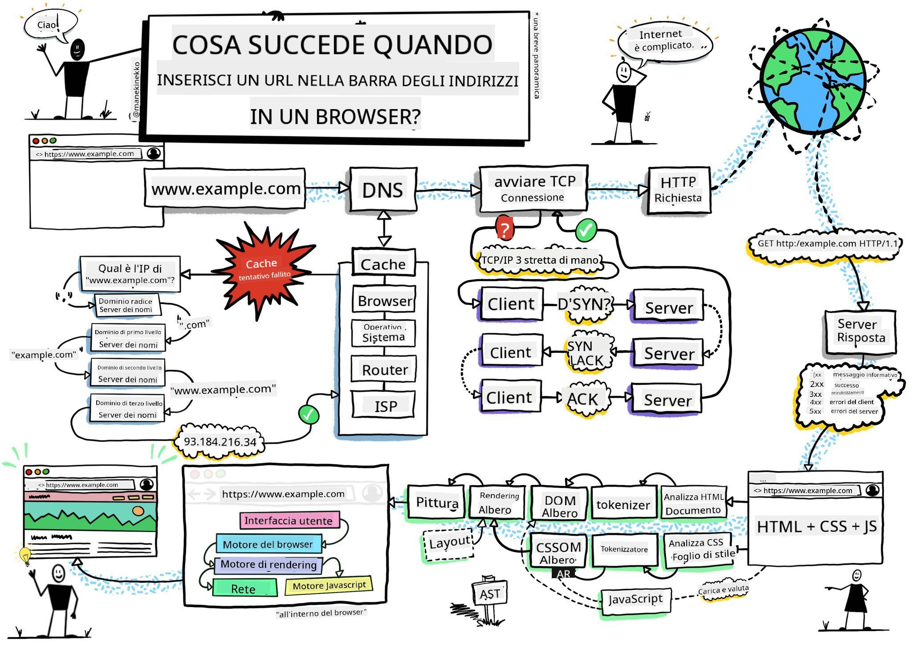
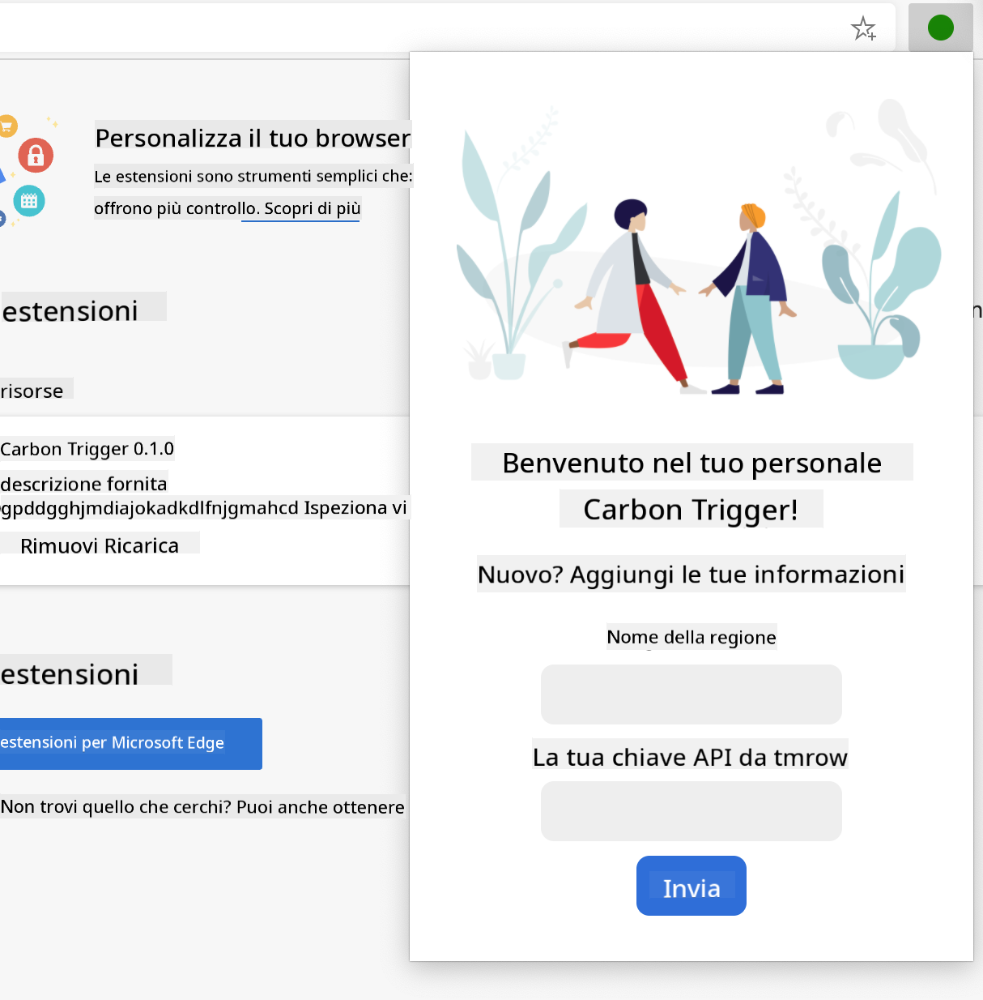

<!--
CO_OP_TRANSLATOR_METADATA:
{
  "original_hash": "0bb55e0b98600afab801eea115228873",
  "translation_date": "2025-08-25T23:41:15+00:00",
  "source_file": "5-browser-extension/1-about-browsers/README.md",
  "language_code": "it"
}
-->
# Progetto Estensione del Browser Parte 1: Tutto sui Browser


> Sketchnote di [Wassim Chegham](https://dev.to/wassimchegham/ever-wondered-what-happens-when-you-type-in-a-url-in-an-address-bar-in-a-browser-3dob)

## Quiz Pre-Lezione

[Quiz pre-lezione](https://ashy-river-0debb7803.1.azurestaticapps.net/quiz/23)

### Introduzione

Le estensioni del browser aggiungono funzionalità extra a un browser. Ma prima di costruirne una, è utile imparare un po' su come funzionano i browser.

### Informazioni sul browser

In questa serie di lezioni, imparerai a creare un'estensione del browser che funzionerà su Chrome, Firefox ed Edge. In questa parte, scoprirai come funzionano i browser e inizierai a strutturare gli elementi dell'estensione.

Ma cos'è esattamente un browser? È un'applicazione software che consente a un utente finale di accedere ai contenuti da un server e visualizzarli su pagine web.

✅ Un po' di storia: il primo browser si chiamava 'WorldWideWeb' ed è stato creato da Sir Timothy Berners-Lee nel 1990.


> Alcuni dei primi browser, via [Karen McGrane](https://www.slideshare.net/KMcGrane/week-4-ixd-history-personal-computing)

Quando un utente si connette a Internet utilizzando un indirizzo URL (Uniform Resource Locator), solitamente tramite il protocollo Hypertext Transfer con un indirizzo `http` o `https`, il browser comunica con un server web e recupera una pagina web.

A questo punto, il motore di rendering del browser la visualizza sul dispositivo dell'utente, che potrebbe essere un telefono cellulare, un desktop o un laptop.

I browser hanno anche la capacità di memorizzare nella cache i contenuti, in modo che non debbano essere recuperati dal server ogni volta. Possono registrare la cronologia delle attività di navigazione di un utente, memorizzare i 'cookie', che sono piccoli frammenti di dati contenenti informazioni utilizzate per salvare le attività dell'utente, e molto altro.

Una cosa davvero importante da ricordare sui browser è che non sono tutti uguali! Ogni browser ha i suoi punti di forza e di debolezza, e un web developer professionista deve capire come far funzionare bene le pagine web su diversi browser. Questo include la gestione di piccoli schermi, come quelli di un telefono cellulare, così come di utenti che sono offline.

Un sito web davvero utile che probabilmente dovresti aggiungere ai preferiti nel browser che preferisci usare è [caniuse.com](https://www.caniuse.com). Quando costruisci pagine web, è molto utile utilizzare le liste di tecnologie supportate di caniuse per offrire il miglior supporto possibile ai tuoi utenti.

✅ Come puoi capire quali browser sono più popolari tra gli utenti del tuo sito web? Controlla le tue analisi: puoi installare vari pacchetti di analisi come parte del tuo processo di sviluppo web, e questi ti diranno quali browser sono più utilizzati tra i vari browser popolari.

## Estensioni del browser

Perché vorresti creare un'estensione del browser? È uno strumento utile da aggiungere al tuo browser quando hai bisogno di un accesso rapido a compiti che tendi a ripetere. Ad esempio, se hai bisogno di controllare i colori delle varie pagine web con cui interagisci, potresti installare un'estensione per il selettore di colori. Se hai difficoltà a ricordare le password, potresti utilizzare un'estensione per la gestione delle password.

Le estensioni del browser sono anche divertenti da sviluppare. Tendono a gestire un numero limitato di compiti che svolgono bene.

✅ Quali sono le tue estensioni del browser preferite? Quali compiti svolgono?

### Installare le estensioni

Prima di iniziare a costruire, dai un'occhiata al processo di creazione e distribuzione di un'estensione del browser. Sebbene ogni browser gestisca questa operazione in modo leggermente diverso, il processo è simile su Chrome e Firefox a questo esempio su Edge:


> Nota: Assicurati di attivare la modalità sviluppatore e consentire estensioni da altri store.

In sostanza, il processo sarà:

- costruire la tua estensione usando `npm run build` 
- navigare nel browser al pannello delle estensioni utilizzando il pulsante "Impostazioni e altro" (l'icona `...`) in alto a destra
- se è una nuova installazione, scegliere `load unpacked` per caricare una nuova estensione dalla sua cartella di build (nel nostro caso è `/dist`) 
- oppure, cliccare su `reload` se stai ricaricando un'estensione già installata

✅ Queste istruzioni si riferiscono alle estensioni che costruisci tu stesso; per installare estensioni che sono state rilasciate nello store delle estensioni del browser associato a ciascun browser, dovresti navigare in quegli [store](https://microsoftedge.microsoft.com/addons/Microsoft-Edge-Extensions-Home) e installare l'estensione di tua scelta.

### Iniziamo

Costruirai un'estensione del browser che mostra l'impronta di carbonio della tua regione, indicando il consumo energetico della tua regione e la fonte dell'energia. L'estensione avrà un modulo che raccoglie una chiave API per accedere all'API di CO2 Signal.

**Ti serve:**

- [una chiave API](https://www.co2signal.com/); inserisci la tua email nella casella su questa pagina e te ne verrà inviata una
- il [codice per la tua regione](http://api.electricitymap.org/v3/zones) corrispondente alla [Electricity Map](https://www.electricitymap.org/map) (a Boston, ad esempio, uso 'US-NEISO').
- il [codice iniziale](../../../../5-browser-extension/start). Scarica la cartella `start`; completerai il codice in questa cartella.
- [NPM](https://www.npmjs.com) - NPM è uno strumento di gestione dei pacchetti; installalo localmente e i pacchetti elencati nel tuo file `package.json` saranno installati per l'uso con le tue risorse web

✅ Scopri di più sulla gestione dei pacchetti in questo [eccellente modulo Learn](https://docs.microsoft.com/learn/modules/create-nodejs-project-dependencies/?WT.mc_id=academic-77807-sagibbon)

Prenditi un momento per esaminare la base di codice:

dist
    -|manifest.json (impostazioni predefinite qui)
    -|index.html (markup HTML front-end qui)
    -|background.js (JS di background qui)
    -|main.js (JS compilato)
src
    -|index.js (il tuo codice JS va qui)

✅ Una volta che hai la tua chiave API e il codice della regione a portata di mano, conservali in una nota per un uso futuro.

### Costruire l'HTML per l'estensione

Questa estensione ha due viste. Una per raccogliere la chiave API e il codice della regione:



E la seconda per mostrare il consumo di carbonio della regione:


Iniziamo costruendo l'HTML per il modulo e stilizzandolo con CSS.

Nella cartella `/dist`, costruirai un modulo e un'area risultati. Nel file `index.html`, popola l'area del modulo delineata:

```HTML
<form class="form-data" autocomplete="on">
	<div>
		<h2>New? Add your Information</h2>
	</div>
	<div>
		<label for="region">Region Name</label>
		<input type="text" id="region" required class="region-name" />
	</div>
	<div>
		<label for="api">Your API Key from tmrow</label>
		<input type="text" id="api" required class="api-key" />
	</div>
	<button class="search-btn">Submit</button>
</form>	
```
Questo è il modulo in cui le informazioni salvate verranno inserite e salvate nella memoria locale.

Successivamente, crea l'area dei risultati; sotto il tag finale del modulo, aggiungi alcuni div:

```HTML
<div class="result">
	<div class="loading">loading...</div>
	<div class="errors"></div>
	<div class="data"></div>
	<div class="result-container">
		<p><strong>Region: </strong><span class="my-region"></span></p>
		<p><strong>Carbon Usage: </strong><span class="carbon-usage"></span></p>
		<p><strong>Fossil Fuel Percentage: </strong><span class="fossil-fuel"></span></p>
	</div>
	<button class="clear-btn">Change region</button>
</div>
```
A questo punto, puoi provare una build. Assicurati di installare le dipendenze del pacchetto di questa estensione:

```
npm install
```

Questo comando utilizzerà npm, il Node Package Manager, per installare webpack per il processo di build della tua estensione. Puoi vedere l'output di questo processo guardando in `/dist/main.js` - vedrai che il codice è stato raggruppato.

Per ora, l'estensione dovrebbe essere costruita e, se la distribuisci in Edge come estensione, vedrai un modulo visualizzato ordinatamente.

Congratulazioni, hai fatto i primi passi verso la costruzione di un'estensione del browser. Nelle lezioni successive, la renderai più funzionale e utile.

---

## 🚀 Sfida

Dai un'occhiata a uno store di estensioni del browser e installane una sul tuo browser. Puoi esaminare i suoi file in modi interessanti. Cosa scopri?

## Quiz Post-Lezione

[Quiz post-lezione](https://ashy-river-0debb7803.1.azurestaticapps.net/quiz/24)

## Revisione e Studio Autonomo

In questa lezione hai appreso un po' sulla storia del browser web; cogli l'occasione per imparare come gli inventori del World Wide Web ne immaginavano l'uso leggendo di più sulla sua storia. Alcuni siti utili includono:

[The History of Web Browsers](https://www.mozilla.org/firefox/browsers/browser-history/)

[History of the Web](https://webfoundation.org/about/vision/history-of-the-web/)

[Un'intervista con Tim Berners-Lee](https://www.theguardian.com/technology/2019/mar/12/tim-berners-lee-on-30-years-of-the-web-if-we-dream-a-little-we-can-get-the-web-we-want)

## Compito 

[Restyle your extension](assignment.md)

**Disclaimer (Avvertenza)**:  
Questo documento è stato tradotto utilizzando il servizio di traduzione automatica [Co-op Translator](https://github.com/Azure/co-op-translator). Sebbene ci impegniamo per garantire l'accuratezza, si prega di notare che le traduzioni automatiche possono contenere errori o imprecisioni. Il documento originale nella sua lingua nativa dovrebbe essere considerato la fonte autorevole. Per informazioni critiche, si raccomanda una traduzione professionale effettuata da un traduttore umano. Non siamo responsabili per eventuali incomprensioni o interpretazioni errate derivanti dall'uso di questa traduzione.