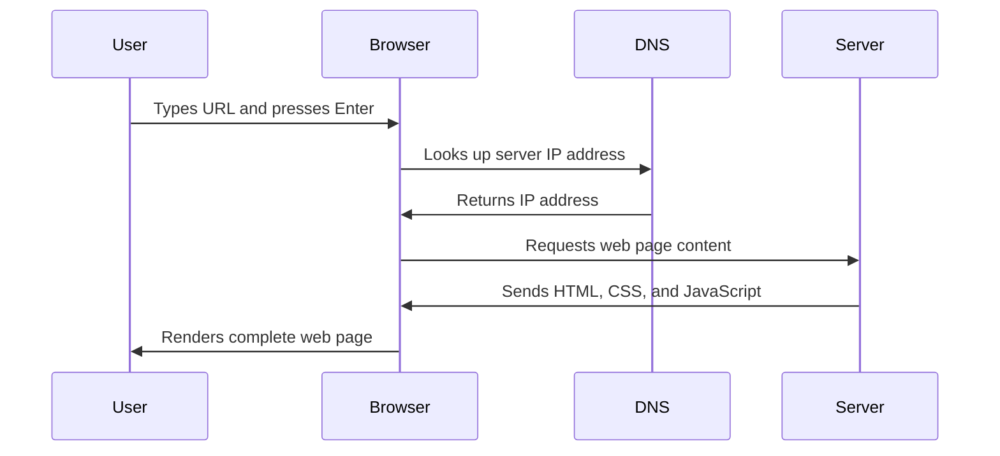

<!--
CO_OP_TRANSLATOR_METADATA:
{
  "original_hash": "33a875c522f237a2026e4653240dfc07",
  "translation_date": "2025-10-22T23:42:24+00:00",
  "source_file": "5-browser-extension/1-about-browsers/README.md",
  "language_code": "it"
}
-->
# Progetto Estensione per Browser Parte 1: Tutto sui Browser


> Sketchnote di [Wassim Chegham](https://dev.to/wassimchegham/ever-wondered-what-happens-when-you-type-in-a-url-in-an-address-bar-in-a-browser-3dob)

## Quiz Pre-Lettura

[Quiz pre-lettura](https://ff-quizzes.netlify.app/web/quiz/23)

### Introduzione

Le estensioni per browser sono mini-applicazioni che migliorano la tua esperienza di navigazione web. Come la visione originale di Tim Berners-Lee di un web interattivo, le estensioni ampliano le capacità del browser oltre la semplice visualizzazione di documenti. Dai gestori di password che mantengono sicuri i tuoi account ai selettori di colori che aiutano i designer a trovare le tonalità perfette, le estensioni risolvono le sfide quotidiane della navigazione.

Prima di costruire la tua prima estensione, è importante capire come funzionano i browser. Proprio come Alexander Graham Bell ha dovuto comprendere la trasmissione del suono prima di inventare il telefono, conoscere i fondamenti dei browser ti aiuterà a creare estensioni che si integrano perfettamente con i sistemi esistenti.

Alla fine di questa lezione, comprenderai l'architettura dei browser e avrai iniziato a costruire la tua prima estensione.

## Comprendere i Browser Web

Un browser web è essenzialmente un sofisticato interprete di documenti. Quando digiti "google.com" nella barra degli indirizzi, il browser esegue una serie complessa di operazioni: richiede contenuti dai server di tutto il mondo, quindi analizza e rende quel codice nelle pagine web interattive che vedi.

Questo processo rispecchia il modo in cui il primo browser web, WorldWideWeb, è stato progettato da Tim Berners-Lee nel 1990 per rendere accessibili a tutti i documenti ipertestuali.

✅ **Un po' di storia**: Il primo browser si chiamava 'WorldWideWeb' ed è stato creato da Sir Timothy Berners-Lee nel 1990.


> Alcuni dei primi browser, via [Karen McGrane](https://www.slideshare.net/KMcGrane/week-4-ixd-history-personal-computing)

### Come i Browser Elaborano i Contenuti Web

Il processo che avviene tra l'inserimento di un URL e la visualizzazione di una pagina web coinvolge diversi passaggi coordinati che si svolgono in pochi secondi:



**Ecco cosa realizza questo processo:**
- **Traduce** l'URL leggibile dall'uomo in un indirizzo IP del server tramite la ricerca DNS
- **Stabilisce** una connessione sicura con il server web utilizzando i protocolli HTTP o HTTPS
- **Richiede** il contenuto specifico della pagina web dal server
- **Riceve** il markup HTML, lo stile CSS e il codice JavaScript dal server
- **Renderizza** tutto il contenuto nella pagina web interattiva che vedi

### Funzionalità Principali dei Browser

I browser moderni offrono numerose funzionalità che gli sviluppatori di estensioni possono sfruttare:

| Funzionalità | Scopo | Opportunità per le Estensioni |
|--------------|-------|------------------------------|
| **Motore di Rendering** | Visualizza HTML, CSS e JavaScript | Modifica dei contenuti, iniezione di stili |
| **Motore JavaScript** | Esegue il codice JavaScript | Script personalizzati, interazioni con API |
| **Archiviazione Locale** | Salva dati localmente | Preferenze utente, dati memorizzati |
| **Stack di Rete** | Gestisce le richieste web | Monitoraggio delle richieste, analisi dei dati |
| **Modello di Sicurezza** | Protegge gli utenti da contenuti dannosi | Filtraggio dei contenuti, miglioramenti di sicurezza |

**Comprendere queste funzionalità ti aiuta a:**
- **Identificare** dove la tua estensione può aggiungere il massimo valore
- **Scegliere** le API del browser giuste per la funzionalità della tua estensione
- **Progettare** estensioni che funzionano in modo efficiente con i sistemi del browser
- **Garantire** che la tua estensione segua le migliori pratiche di sicurezza del browser

### Considerazioni sullo Sviluppo Cross-Browser

I diversi browser implementano gli standard con leggere variazioni, proprio come i diversi linguaggi di programmazione possono gestire lo stesso algoritmo in modo diverso. Chrome, Firefox e Safari hanno ciascuno caratteristiche uniche che gli sviluppatori devono considerare durante lo sviluppo delle estensioni.

> 💡 **Consiglio Pro**: Usa [caniuse.com](https://www.caniuse.com) per verificare quali tecnologie web sono supportate nei diversi browser. Questo è prezioso quando pianifichi le funzionalità della tua estensione!

**Considerazioni chiave per lo sviluppo di estensioni:**
- **Testa** la tua estensione su browser come Chrome, Firefox e Edge
- **Adatta** le API delle estensioni e i formati dei manifesti ai diversi browser
- **Gestisci** le caratteristiche di prestazione e le limitazioni variabili
- **Fornisci** soluzioni alternative per le funzionalità specifiche del browser che potrebbero non essere disponibili

✅ **Insight Analitico**: Puoi determinare quali browser preferiscono i tuoi utenti installando pacchetti di analisi nei tuoi progetti di sviluppo web. Questi dati ti aiutano a stabilire quali browser supportare per primi.

## Comprendere le Estensioni per Browser

Le estensioni per browser risolvono le sfide comuni della navigazione web aggiungendo funzionalità direttamente all'interfaccia del browser. Piuttosto che richiedere applicazioni separate o flussi di lavoro complessi, le estensioni forniscono accesso immediato a strumenti e funzionalità.

Questo concetto rispecchia il modo in cui i primi pionieri dell'informatica, come Douglas Engelbart, immaginavano di aumentare le capacità umane con la tecnologia: le estensioni aumentano la funzionalità di base del browser.

**Categorie popolari di estensioni e i loro benefici:**
- **Strumenti di Produttività**: Gestori di attività, app per prendere appunti e tracker di tempo che ti aiutano a rimanere organizzato
- **Miglioramenti di Sicurezza**: Gestori di password, blocchi pubblicitari e strumenti per la privacy che proteggono i tuoi dati
- **Strumenti per Sviluppatori**: Formattatori di codice, selettori di colori e strumenti di debug che semplificano lo sviluppo
- **Miglioramenti dei Contenuti**: Modalità di lettura, downloader di video e strumenti per screenshot che migliorano la tua esperienza web

✅ **Domanda di Riflessione**: Quali sono le tue estensioni per browser preferite? Quali compiti specifici svolgono e come migliorano la tua esperienza di navigazione?

## Installazione e Gestione delle Estensioni

Comprendere il processo di installazione delle estensioni ti aiuta a prevedere l'esperienza dell'utente quando installa la tua estensione. Il processo di installazione è standardizzato nei browser moderni, con lievi variazioni nel design dell'interfaccia.


> **Importante**: Assicurati di attivare la modalità sviluppatore e consentire le estensioni da altri store quando testi le tue estensioni.

### Processo di Installazione delle Estensioni in Sviluppo

Quando sviluppi e testi le tue estensioni, segui questo flusso di lavoro:

```bash
# Step 1: Build your extension
npm run build
```

**Cosa realizza questo comando:**
- **Compila** il tuo codice sorgente in file pronti per il browser
- **Raggruppa** i moduli JavaScript in pacchetti ottimizzati
- **Genera** i file finali dell'estensione nella cartella `/dist`
- **Prepara** la tua estensione per l'installazione e il test

**Passaggio 2: Naviga nella Gestione delle Estensioni del Browser**
1. **Apri** la pagina di gestione delle estensioni del tuo browser
2. **Clicca** sul pulsante "Impostazioni e altro" (l'icona `...`) in alto a destra
3. **Seleziona** "Estensioni" dal menu a tendina

**Passaggio 3: Carica la tua Estensione**
- **Per nuove installazioni**: Scegli `carica non impacchettato` e seleziona la tua cartella `/dist`
- **Per aggiornamenti**: Clicca su `ricarica` accanto alla tua estensione già installata
- **Per test**: Abilita la "Modalità sviluppatore" per accedere a funzionalità di debug aggiuntive

### Installazione dell'Estensione in Produzione

> ✅ **Nota**: Queste istruzioni di sviluppo sono specifiche per le estensioni che crei tu stesso. Per installare estensioni pubblicate, visita gli store ufficiali delle estensioni per browser come il [Microsoft Edge Add-ons store](https://microsoftedge.microsoft.com/addons/Microsoft-Edge-Extensions-Home).

**Comprendere la differenza:**
- **Installazioni di sviluppo** ti permettono di testare estensioni non pubblicate durante lo sviluppo
- **Installazioni dallo store** forniscono estensioni pubblicate e verificate con aggiornamenti automatici
- **Sideloading** consente l'installazione di estensioni da fonti esterne agli store ufficiali (richiede la modalità sviluppatore)

## Creare la tua Estensione per l'Impronta di Carbonio

Creeremo un'estensione per browser che mostra l'impronta di carbonio dell'uso energetico della tua regione. Questo progetto dimostra i concetti essenziali dello sviluppo di estensioni, creando al contempo uno strumento pratico per la consapevolezza ambientale.

Questo approccio segue il principio del "learning by doing" che si è dimostrato efficace fin dai tempi delle teorie educative di John Dewey - combinando competenze tecniche con applicazioni significative nel mondo reale.

### Requisiti del Progetto

Prima di iniziare lo sviluppo, raccogliamo le risorse e le dipendenze necessarie:

**Accesso API Richiesto:**
- **[Chiave API CO2 Signal](https://www.co2signal.com/)**: Inserisci il tuo indirizzo email per ricevere la tua chiave API gratuita
- **[Codice regione](http://api.electricitymap.org/v3/zones)**: Trova il codice della tua regione utilizzando la [Mappa dell'Elettricità](https://www.electricitymap.org/map) (ad esempio, Boston usa 'US-NEISO')

**Strumenti di Sviluppo:**
- **[Node.js e NPM](https://www.npmjs.com)**: Strumento di gestione dei pacchetti per installare le dipendenze del progetto
- **[Codice iniziale](../../../../5-browser-extension/start)**: Scarica la cartella `start` per iniziare lo sviluppo

✅ **Scopri di più**: Migliora le tue competenze nella gestione dei pacchetti con questo [modulo di apprendimento completo](https://docs.microsoft.com/learn/modules/create-nodejs-project-dependencies/?WT.mc_id=academic-77807-sagibbon)

### Comprendere la Struttura del Progetto

Comprendere la struttura del progetto aiuta a organizzare il lavoro di sviluppo in modo efficiente. Proprio come la Biblioteca di Alessandria era organizzata per un facile recupero delle conoscenze, una base di codice ben strutturata rende lo sviluppo più efficiente:

```
project-root/
├── dist/                    # Built extension files
│   ├── manifest.json        # Extension configuration
│   ├── index.html           # User interface markup
│   ├── background.js        # Background script functionality
│   └── main.js              # Compiled JavaScript bundle
└── src/                     # Source development files
    └── index.js             # Your main JavaScript code
```

**Analisi di ciò che realizza ogni file:**
- **`manifest.json`**: **Definisce** i metadati dell'estensione, i permessi e i punti di ingresso
- **`index.html`**: **Crea** l'interfaccia utente che appare quando gli utenti cliccano sulla tua estensione
- **`background.js`**: **Gestisce** i compiti in background e i listener degli eventi del browser
- **`main.js`**: **Contiene** il JavaScript finale raggruppato dopo il processo di build
- **`src/index.js`**: **Contiene** il tuo codice di sviluppo principale che viene compilato in `main.js`

> 💡 **Consiglio di Organizzazione**: Conserva la tua chiave API e il codice della regione in una nota sicura per un facile riferimento durante lo sviluppo. Avrai bisogno di questi valori per testare la funzionalità della tua estensione.

✅ **Nota di Sicurezza**: Non commettere mai chiavi API o credenziali sensibili nel tuo repository di codice. Ti mostreremo come gestirle in modo sicuro nei prossimi passaggi.

## Creare l'Interfaccia dell'Estensione

Ora costruiremo i componenti dell'interfaccia utente. L'estensione utilizza un approccio a due schermate: una schermata di configurazione per la configurazione iniziale e una schermata dei risultati per la visualizzazione dei dati.

Questo segue il principio della divulgazione progressiva utilizzato nel design dell'interfaccia fin dai primi giorni dell'informatica - rivelando informazioni e opzioni in una sequenza logica per evitare di sopraffare gli utenti.

### Panoramica delle Visualizzazioni dell'Estensione

**Vista Configurazione** - Configurazione iniziale per il primo utilizzo:


**Vista Risultati** - Visualizzazione dei dati sull'impronta di carbonio:


### Creare il Modulo di Configurazione

Il modulo di configurazione raccoglie i dati di configurazione dell'utente durante il primo utilizzo. Una volta configurate, queste informazioni persistono nella memoria del browser per le sessioni future.

Nel file `/dist/index.html`, aggiungi questa struttura del modulo:

```html
<form class="form-data" autocomplete="on">
    <div>
        <h2>New? Add your Information</h2>
    </div>
    <div>
        <label for="region">Region Name</label>
        <input type="text" id="region" required class="region-name" />
    </div>
    <div>
        <label for="api">Your API Key from tmrow</label>
        <input type="text" id="api" required class="api-key" />
    </div>
    <button class="search-btn">Submit</button>
</form>
```

**Ecco cosa realizza questo modulo:**
- **Crea** una struttura semantica del modulo con etichette e associazioni di input appropriate
- **Abilita** la funzionalità di completamento automatico del browser per migliorare l'esperienza utente
- **Richiede** che entrambi i campi siano compilati prima dell'invio utilizzando l'attributo `required`
- **Organizza** gli input con nomi di classe descrittivi per una facile stilizzazione e targeting JavaScript
- **Fornisce** istruzioni chiare per gli utenti che configurano l'estensione per la prima volta

### Creare la Visualizzazione dei Risultati

Successivamente, crea l'area dei risultati che mostrerà i dati sull'impronta di carbonio. Aggiungi questo HTML sotto il modulo:

```html
<div class="result">
    <div class="loading">loading...</div>
    <div class="errors"></div>
    <div class="data"></div>
    <div class="result-container">
        <p><strong>Region: </strong><span class="my-region"></span></p>
        <p><strong>Carbon Usage: </strong><span class="carbon-usage"></span></p>
        <p><strong>Fossil Fuel Percentage: </strong><span class="fossil-fuel"></span></p>
    </div>
    <button class="clear-btn">Change region</button>
</div>
```

**Analisi di ciò che fornisce questa struttura:**
- **`loading`**: **Mostra** un messaggio di caricamento mentre i dati dell'API vengono recuperati
- **`errors`**: **Mostra** messaggi di errore se le chiamate API falliscono o i dati sono non validi
- **`data`**: **Contiene** dati grezzi per il debug durante lo sviluppo
- **`result-container`**: **Presenta** informazioni formattate sull'impronta di carbonio agli utenti
- **`clear-btn`**: **Permette** agli utenti di cambiare la loro regione e riconfigurare l'estensione

### Configurare il Processo di Build

Ora installiamo le dipendenze del progetto e testiamo il processo di build:

```bash
npm install
```

**Cosa realizza questo processo di installazione:**
- **Scarica** Webpack e altre dipendenze di sviluppo specificate in `package.json`
- **Configura** la catena di strumenti di build per compilare JavaScript moderno
- **Prepara** l'ambiente di sviluppo per la costruzione e il test dell'estensione
- **Abilita** il raggruppamento del codice, l'ottimizzazione e le funzionalità di compatibilità tra browser

> 💡 **Insight sul Processo di Build**: Webpack raggruppa il tuo codice sorgente da `/src/index.js` in `/dist/main.js`. Questo processo ottimizza il tuo codice per la produzione e garantisce la compatibilità con i browser.

### Testare i Progressi

A questo punto, puoi testare la tua estensione:

1. **Esegui** il comando di build per compilare il tuo codice
2. **Carica** l'estensione nel tuo browser utilizzando la modalità sviluppatore
3. **Verifica** che il modulo venga visualizzato correttamente e abbia un aspetto professionale
4. **Controlla** che tutti gli elementi del modulo siano correttamente allineati e funzionanti

**Cosa hai realizzato:**
- **Costruito** la struttura HTML di base per la tua estensione
- **Creato** sia l'interfaccia di configurazione che quella dei risultati con un markup semantico corretto
- **Impostato** un flusso di lavoro di sviluppo moderno utilizzando strumenti standard del settore
- **Preparato** la base per aggiungere funzionalità interattive in JavaScript

Hai completato la prima fase dello sviluppo dell'estensione per browser. Proprio come i fratelli Wright hanno dovuto comprendere l'aerodinamica prima di riuscire a volare, comprendere questi concetti fondamentali ti prepara a costruire funzionalità interattive più complesse nella prossima lezione.

## Sfida Agente GitHub Copilot 🚀

Usa la modalità Agente per completare la seguente sfida:
**Descrizione:** Migliora l'estensione del browser aggiungendo funzionalità di validazione dei moduli e feedback per l'utente, al fine di migliorare l'esperienza utente durante l'inserimento delle chiavi API e dei codici regione.

**Prompt:** Crea funzioni di validazione in JavaScript che verifichino se il campo della chiave API contiene almeno 20 caratteri e se il codice regione segue il formato corretto (ad esempio 'US-NEISO'). Aggiungi un feedback visivo modificando i colori dei bordi degli input: verde per gli input validi e rosso per quelli non validi. Inoltre, aggiungi una funzione di attivazione/disattivazione per mostrare/nascondere la chiave API per motivi di sicurezza.

Scopri di più su [agent mode](https://code.visualstudio.com/blogs/2025/02/24/introducing-copilot-agent-mode) qui.

## 🚀 Sfida

Dai un'occhiata a uno store di estensioni per browser e installane una sul tuo browser. Puoi esaminare i suoi file in modi interessanti. Cosa scopri?

## Quiz post-lezione

[Quiz post-lezione](https://ff-quizzes.netlify.app/web/quiz/24)

## Revisione & Studio Autonomo

In questa lezione hai imparato qualcosa sulla storia del browser web; approfitta di questa opportunità per approfondire come gli inventori del World Wide Web ne immaginavano l'utilizzo leggendo di più sulla sua storia. Alcuni siti utili includono:

[La storia dei browser web](https://www.mozilla.org/firefox/browsers/browser-history/)

[Storia del Web](https://webfoundation.org/about/vision/history-of-the-web/)

[Un'intervista con Tim Berners-Lee](https://www.theguardian.com/technology/2019/mar/12/tim-berners-lee-on-30-years-of-the-web-if-we-dream-a-little-we-can-get-the-web-we-want)

## Compito 

[Restyle la tua estensione](assignment.md)

---

**Disclaimer**:  
Questo documento è stato tradotto utilizzando il servizio di traduzione AI [Co-op Translator](https://github.com/Azure/co-op-translator). Sebbene ci impegniamo per garantire l'accuratezza, si prega di notare che le traduzioni automatiche possono contenere errori o imprecisioni. Il documento originale nella sua lingua nativa dovrebbe essere considerato la fonte autorevole. Per informazioni critiche, si raccomanda una traduzione professionale umana. Non siamo responsabili per eventuali incomprensioni o interpretazioni errate derivanti dall'uso di questa traduzione.