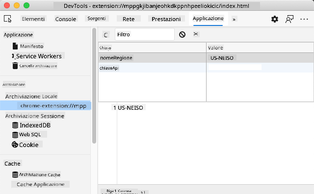

<!--
CO_OP_TRANSLATOR_METADATA:
{
  "original_hash": "a7587943d38d095de8613e1b508609f5",
  "translation_date": "2025-08-29T00:06:40+00:00",
  "source_file": "5-browser-extension/2-forms-browsers-local-storage/README.md",
  "language_code": "it"
}
-->
# Progetto Estensione Browser Parte 2: Chiamare un'API, utilizzare Local Storage

## Quiz Pre-Lezione

[Quiz pre-lezione](https://ff-quizzes.netlify.app/web/quiz/25)

### Introduzione

In questa lezione, chiamerai un'API inviando il modulo della tua estensione browser e visualizzando i risultati nella tua estensione. Inoltre, imparerai come memorizzare i dati nel local storage del browser per un utilizzo futuro.

✅ Segui i segmenti numerati nei file appropriati per sapere dove inserire il tuo codice.

### Configura gli elementi da manipolare nell'estensione:

A questo punto hai già creato l'HTML per il modulo e il `<div>` dei risultati della tua estensione browser. Da ora in poi, dovrai lavorare nel file `/src/index.js` e costruire la tua estensione passo dopo passo. Consulta la [lezione precedente](../1-about-browsers/README.md) per configurare il progetto e il processo di build.

Lavorando nel file `index.js`, inizia creando alcune variabili `const` per contenere i valori associati ai vari campi:

```JavaScript
// form fields
const form = document.querySelector('.form-data');
const region = document.querySelector('.region-name');
const apiKey = document.querySelector('.api-key');

// results
const errors = document.querySelector('.errors');
const loading = document.querySelector('.loading');
const results = document.querySelector('.result-container');
const usage = document.querySelector('.carbon-usage');
const fossilfuel = document.querySelector('.fossil-fuel');
const myregion = document.querySelector('.my-region');
const clearBtn = document.querySelector('.clear-btn');
```

Tutti questi campi sono referenziati tramite la loro classe CSS, come hai configurato nell'HTML nella lezione precedente.

### Aggiungi i listener

Successivamente, aggiungi i listener di eventi al modulo e al pulsante di reset che reimposta il modulo, in modo che, se un utente invia il modulo o clicca sul pulsante di reset, accada qualcosa. Aggiungi anche la chiamata per inizializzare l'app alla fine del file:

```JavaScript
form.addEventListener('submit', (e) => handleSubmit(e));
clearBtn.addEventListener('click', (e) => reset(e));
init();
```

✅ Nota la sintassi abbreviata utilizzata per ascoltare un evento di submit o click e come l'evento viene passato alle funzioni handleSubmit o reset. Riesci a scrivere l'equivalente di questa sintassi abbreviata in un formato più lungo? Quale preferisci?

### Costruisci le funzioni init() e reset():

Ora costruirai la funzione che inizializza l'estensione, chiamata init():

```JavaScript
function init() {
	//if anything is in localStorage, pick it up
	const storedApiKey = localStorage.getItem('apiKey');
	const storedRegion = localStorage.getItem('regionName');

	//set icon to be generic green
	//todo

	if (storedApiKey === null || storedRegion === null) {
		//if we don't have the keys, show the form
		form.style.display = 'block';
		results.style.display = 'none';
		loading.style.display = 'none';
		clearBtn.style.display = 'none';
		errors.textContent = '';
	} else {
        //if we have saved keys/regions in localStorage, show results when they load
        displayCarbonUsage(storedApiKey, storedRegion);
		results.style.display = 'none';
		form.style.display = 'none';
		clearBtn.style.display = 'block';
	}
};

function reset(e) {
	e.preventDefault();
	//clear local storage for region only
	localStorage.removeItem('regionName');
	init();
}

```

In questa funzione c'è una logica interessante. Leggendola, riesci a capire cosa succede?

- vengono impostati due `const` per verificare se l'utente ha memorizzato un APIKey e un codice regione nel local storage.
- se uno dei due è nullo, mostra il modulo cambiando il suo stile per visualizzarlo come 'block'.
- nascondi i risultati, il caricamento e il clearBtn e imposta qualsiasi testo di errore come stringa vuota.
- se esistono una chiave e una regione, avvia una routine per:
  - chiamare l'API per ottenere i dati sull'uso del carbonio.
  - nascondere l'area dei risultati.
  - nascondere il modulo.
  - mostrare il pulsante di reset.

Prima di procedere, è utile imparare un concetto molto importante disponibile nei browser: [LocalStorage](https://developer.mozilla.org/docs/Web/API/Window/localStorage). LocalStorage è un modo utile per memorizzare stringhe nel browser come coppie `key-value`. Questo tipo di storage web può essere manipolato tramite JavaScript per gestire i dati nel browser. LocalStorage non scade, mentre SessionStorage, un altro tipo di storage web, viene cancellato quando il browser viene chiuso. I vari tipi di storage hanno pro e contro nel loro utilizzo.

> Nota - la tua estensione browser ha il proprio local storage; la finestra principale del browser è un'istanza separata e si comporta in modo indipendente.

Imposti il tuo APIKey per avere un valore stringa, ad esempio, e puoi vedere che è impostato su Edge "ispezionando" una pagina web (puoi cliccare con il tasto destro su un browser per ispezionare) e andando alla scheda Applicazioni per vedere lo storage.



✅ Pensa a situazioni in cui NON vorresti memorizzare alcuni dati nel LocalStorage. In generale, memorizzare API Keys nel LocalStorage è una cattiva idea! Riesci a capire perché? Nel nostro caso, poiché la nostra app è puramente educativa e non verrà distribuita in un app store, utilizzeremo questo metodo.

Nota che utilizzi l'API Web per manipolare il LocalStorage, utilizzando `getItem()`, `setItem()` o `removeItem()`. È ampiamente supportato nei browser.

Prima di costruire la funzione `displayCarbonUsage()` chiamata in `init()`, costruiamo la funzionalità per gestire l'invio iniziale del modulo.

### Gestisci l'invio del modulo

Crea una funzione chiamata `handleSubmit` che accetta un argomento evento `(e)`. Interrompi la propagazione dell'evento (in questo caso, vogliamo impedire al browser di aggiornarsi) e chiama una nuova funzione, `setUpUser`, passando gli argomenti `apiKey.value` e `region.value`. In questo modo, utilizzi i due valori che vengono inseriti tramite il modulo iniziale quando i campi appropriati sono popolati.

```JavaScript
function handleSubmit(e) {
	e.preventDefault();
	setUpUser(apiKey.value, region.value);
}
```

✅ Rinfresca la memoria - l'HTML che hai configurato nella lezione precedente ha due campi di input i cui `valori` vengono catturati tramite il `const` che hai impostato all'inizio del file, e sono entrambi `required`, quindi il browser impedisce agli utenti di inserire valori nulli.

### Configura l'utente

Passando alla funzione `setUpUser`, qui è dove imposti i valori del local storage per apiKey e regionName. Aggiungi una nuova funzione:

```JavaScript
function setUpUser(apiKey, regionName) {
	localStorage.setItem('apiKey', apiKey);
	localStorage.setItem('regionName', regionName);
	loading.style.display = 'block';
	errors.textContent = '';
	clearBtn.style.display = 'block';
	//make initial call
	displayCarbonUsage(apiKey, regionName);
}
```

Questa funzione imposta un messaggio di caricamento da mostrare mentre l'API viene chiamata. A questo punto, sei arrivato a creare la funzione più importante di questa estensione browser!

### Visualizza l'uso del carbonio

Finalmente è il momento di interrogare l'API!

Prima di procedere, dovremmo discutere delle API. Le API, o [Application Programming Interfaces](https://www.webopedia.com/TERM/A/API.html), sono un elemento critico nella cassetta degli attrezzi di uno sviluppatore web. Forniscono modi standard per i programmi di interagire e interfacciarsi tra loro. Ad esempio, se stai costruendo un sito web che deve interrogare un database, qualcuno potrebbe aver creato un'API per te. Sebbene esistano molti tipi di API, una delle più popolari è una [REST API](https://www.smashingmagazine.com/2018/01/understanding-using-rest-api/).

✅ Il termine 'REST' sta per 'Representational State Transfer' e utilizza URL configurati in vari modi per recuperare dati. Fai una piccola ricerca sui vari tipi di API disponibili per gli sviluppatori. Quale formato ti piace di più?

Ci sono cose importanti da notare su questa funzione. Prima di tutto, nota la parola chiave [`async`](https://developer.mozilla.org/docs/Web/JavaScript/Reference/Statements/async_function). Scrivere le tue funzioni in modo che funzionino in modo asincrono significa che aspettano che un'azione, come il ritorno dei dati, venga completata prima di continuare.

Ecco un breve video su `async`:

[](https://youtube.com/watch?v=YwmlRkrxvkk "Async e Await per gestire le promesse")

> 🎥 Clicca sull'immagine sopra per un video su async/await.

Crea una nuova funzione per interrogare l'API C02Signal:

```JavaScript
import axios from '../node_modules/axios';

async function displayCarbonUsage(apiKey, region) {
	try {
		await axios
			.get('https://api.co2signal.com/v1/latest', {
				params: {
					countryCode: region,
				},
				headers: {
					'auth-token': apiKey,
				},
			})
			.then((response) => {
				let CO2 = Math.floor(response.data.data.carbonIntensity);

				//calculateColor(CO2);

				loading.style.display = 'none';
				form.style.display = 'none';
				myregion.textContent = region;
				usage.textContent =
					Math.round(response.data.data.carbonIntensity) + ' grams (grams C02 emitted per kilowatt hour)';
				fossilfuel.textContent =
					response.data.data.fossilFuelPercentage.toFixed(2) +
					'% (percentage of fossil fuels used to generate electricity)';
				results.style.display = 'block';
			});
	} catch (error) {
		console.log(error);
		loading.style.display = 'none';
		results.style.display = 'none';
		errors.textContent = 'Sorry, we have no data for the region you have requested.';
	}
}
```

Questa è una funzione grande. Cosa sta succedendo qui?

- seguendo le migliori pratiche, utilizzi la parola chiave `async` per far sì che questa funzione si comporti in modo asincrono. La funzione contiene un blocco `try/catch` poiché restituirà una promessa quando l'API restituisce dati. Poiché non hai controllo sulla velocità con cui l'API risponderà (potrebbe non rispondere affatto!), devi gestire questa incertezza chiamandola in modo asincrono.
- stai interrogando l'API co2signal per ottenere i dati della tua regione, utilizzando la tua API Key. Per utilizzare quella chiave, devi utilizzare un tipo di autenticazione nei parametri dell'intestazione.
- una volta che l'API risponde, assegni vari elementi dei suoi dati di risposta alle parti dello schermo che hai configurato per mostrare questi dati.
- se c'è un errore o se non ci sono risultati, mostri un messaggio di errore.

✅ Utilizzare modelli di programmazione asincrona è un altro strumento molto utile nella tua cassetta degli attrezzi. Leggi [i vari modi](https://developer.mozilla.org/docs/Web/JavaScript/Reference/Statements/async_function) in cui puoi configurare questo tipo di codice.

Congratulazioni! Se costruisci la tua estensione (`npm run build`) e la aggiorni nel pannello delle estensioni, hai un'estensione funzionante! L'unica cosa che non funziona è l'icona, e la sistemerai nella prossima lezione.

---

## 🚀 Sfida

Abbiamo discusso di diversi tipi di API finora in queste lezioni. Scegli un'API web e ricerca in profondità cosa offre. Ad esempio, dai un'occhiata alle API disponibili nei browser come l'[HTML Drag and Drop API](https://developer.mozilla.org/docs/Web/API/HTML_Drag_and_Drop_API). Cosa rende un'API eccellente secondo te?

## Quiz Post-Lezione

[Quiz post-lezione](https://ff-quizzes.netlify.app/web/quiz/26)

## Revisione & Studio Autonomo

Hai imparato a conoscere LocalStorage e API in questa lezione, entrambi molto utili per uno sviluppatore web professionista. Riesci a pensare a come queste due cose lavorano insieme? Pensa a come progetteresti un sito web che memorizza elementi da utilizzare tramite un'API.

## Compito

[Adotta un'API](assignment.md)

---

**Disclaimer**:  
Questo documento è stato tradotto utilizzando il servizio di traduzione automatica [Co-op Translator](https://github.com/Azure/co-op-translator). Sebbene ci impegniamo per garantire l'accuratezza, si prega di notare che le traduzioni automatiche potrebbero contenere errori o imprecisioni. Il documento originale nella sua lingua nativa dovrebbe essere considerato la fonte autorevole. Per informazioni critiche, si consiglia una traduzione professionale eseguita da un traduttore umano. Non siamo responsabili per eventuali fraintendimenti o interpretazioni errate derivanti dall'uso di questa traduzione.