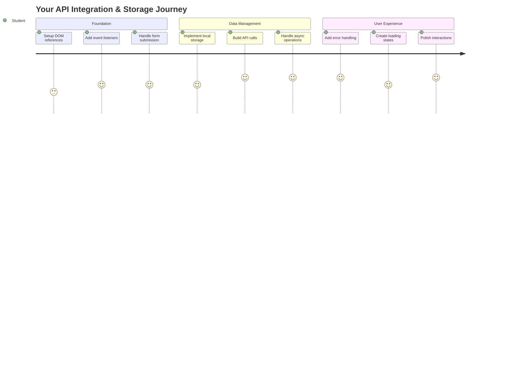
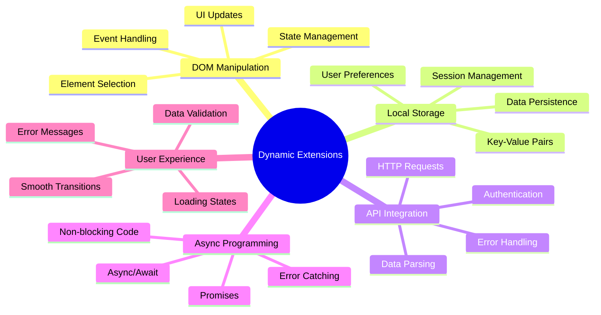
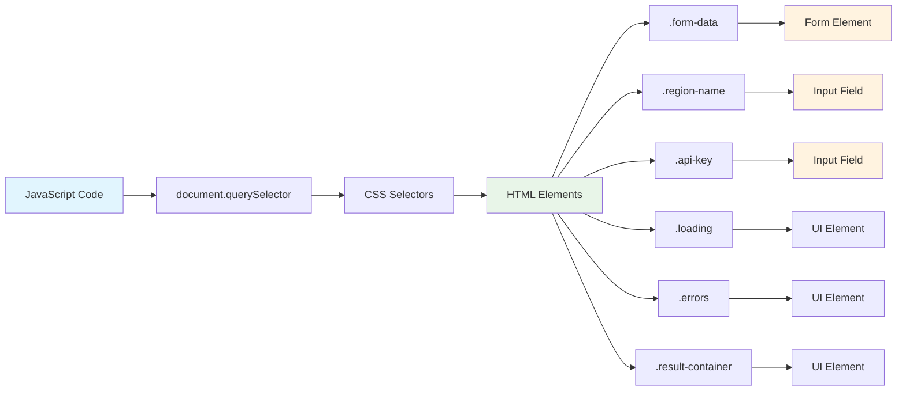
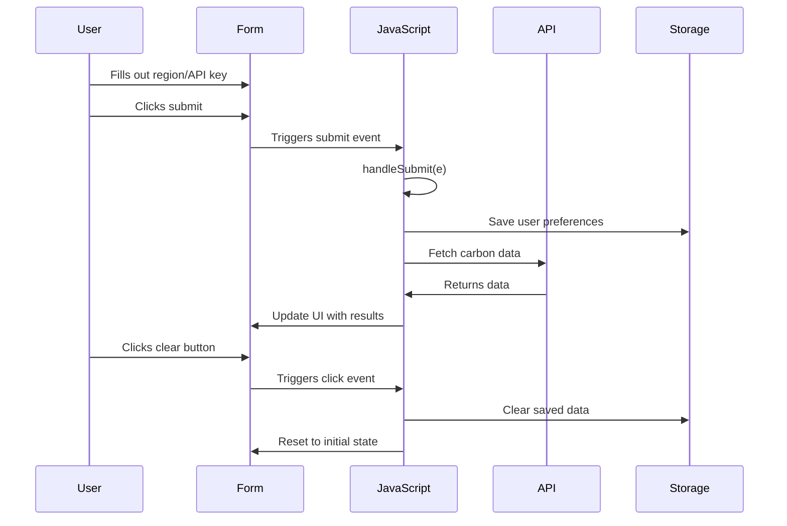
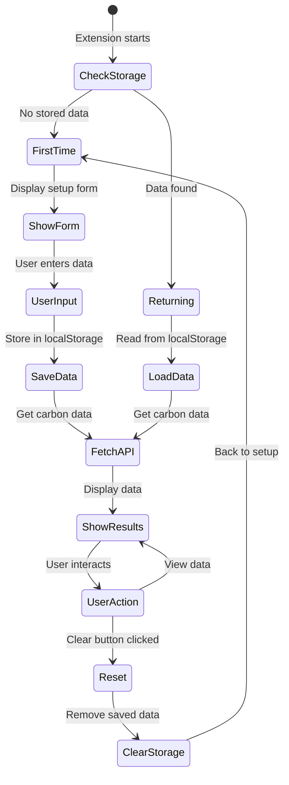
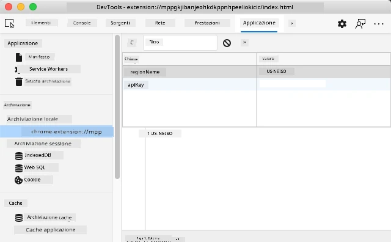
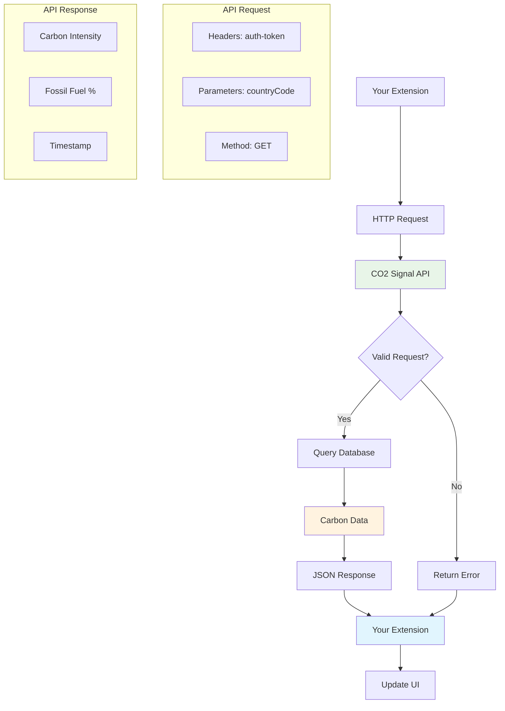
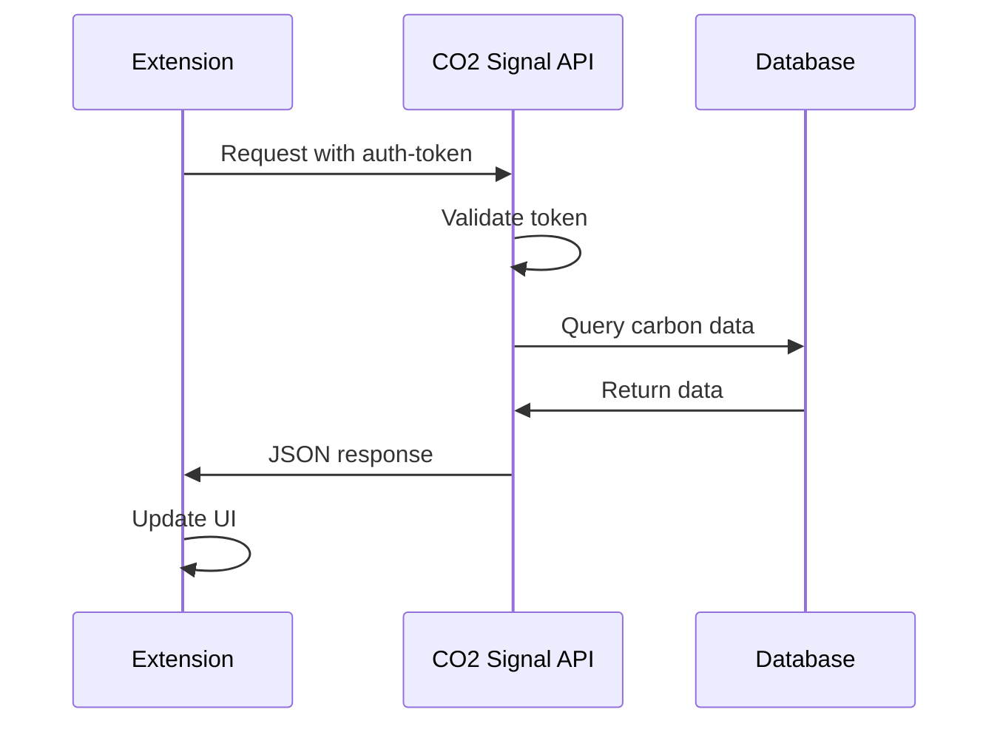
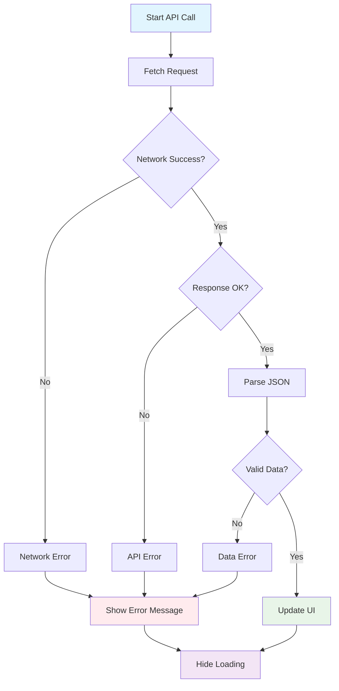
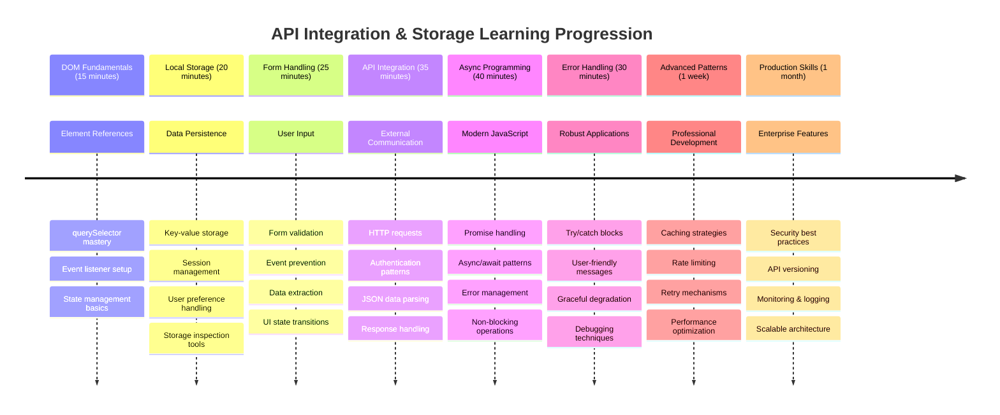

# Progetto Estensione Browser Parte 2: Chiamare un'API, utilizzare Local Storage



## Quiz Pre-Lettura

[Quiz pre-lettura](https://ff-quizzes.netlify.app/web/quiz/25)

## Introduzione

Ricordi quell'estensione per browser che hai iniziato a costruire? Al momento hai un modulo dall'aspetto gradevole, ma è essenzialmente statico. Oggi gli daremo vita collegandolo a dati reali e fornendogli memoria.

Pensa ai computer di controllo della missione Apollo: non si limitavano a mostrare informazioni fisse. Comunicavano costantemente con la navicella spaziale, si aggiornavano con i dati di telemetria e ricordavano i parametri critici della missione. Questo è il tipo di comportamento dinamico che stiamo costruendo oggi. La tua estensione si connetterà a internet, raccoglierà dati ambientali reali e ricorderà le tue impostazioni per la prossima volta.

L'integrazione con le API potrebbe sembrare complessa, ma si tratta semplicemente di insegnare al tuo codice come comunicare con altri servizi. Che tu stia recuperando dati meteorologici, feed di social media o informazioni sull'impronta di carbonio come faremo oggi, si tratta di stabilire queste connessioni digitali. Esploreremo anche come i browser possono conservare le informazioni, proprio come le biblioteche usano i cataloghi per ricordare dove si trovano i libri.

Alla fine di questa lezione, avrai un'estensione per browser che recupera dati reali, memorizza le preferenze dell'utente e offre un'esperienza fluida. Iniziamo!



✅ Segui i segmenti numerati nei file appropriati per sapere dove posizionare il tuo codice

## Configura gli elementi da manipolare nell'estensione

Prima che il tuo JavaScript possa manipolare l'interfaccia, ha bisogno di riferimenti a specifici elementi HTML. Pensalo come un telescopio che deve essere puntato su stelle particolari: prima che Galileo potesse studiare le lune di Giove, doveva localizzare e concentrarsi su Giove stesso.

Nel tuo file `index.js`, creeremo variabili `const` che catturano riferimenti a ciascun elemento importante del modulo. Questo è simile a come gli scienziati etichettano la loro attrezzatura: invece di cercare in tutto il laboratorio ogni volta, possono accedere direttamente a ciò di cui hanno bisogno.



```javascript
// form fields
const form = document.querySelector('.form-data');
const region = document.querySelector('.region-name');
const apiKey = document.querySelector('.api-key');

// results
const errors = document.querySelector('.errors');
const loading = document.querySelector('.loading');
const results = document.querySelector('.result-container');
const usage = document.querySelector('.carbon-usage');
const fossilfuel = document.querySelector('.fossil-fuel');
const myregion = document.querySelector('.my-region');
const clearBtn = document.querySelector('.clear-btn');
```

**Ecco cosa fa questo codice:**
- **Cattura** gli elementi del modulo utilizzando `document.querySelector()` con selettori di classe CSS
- **Crea** riferimenti ai campi di input per il nome della regione e la chiave API
- **Stabilisce** connessioni agli elementi di visualizzazione dei risultati per i dati sull'uso del carbonio
- **Configura** l'accesso agli elementi dell'interfaccia utente come indicatori di caricamento e messaggi di errore
- **Memorizza** ogni riferimento agli elementi in una variabile `const` per un facile riutilizzo nel tuo codice

## Aggiungi i listener degli eventi

Ora faremo in modo che la tua estensione risponda alle azioni degli utenti. I listener degli eventi sono il modo in cui il tuo codice monitora le interazioni degli utenti. Pensali come gli operatori nei primi centralini telefonici: ascoltavano le chiamate in arrivo e collegavano i circuiti giusti quando qualcuno voleva effettuare una connessione.



```javascript
form.addEventListener('submit', (e) => handleSubmit(e));
clearBtn.addEventListener('click', (e) => reset(e));
init();
```

**Comprendere questi concetti:**
- **Collega** un listener di invio al modulo che si attiva quando gli utenti premono Invio o cliccano su invia
- **Connetti** un listener di clic al pulsante di cancellazione per reimpostare il modulo
- **Passa** l'oggetto evento `(e)` alle funzioni gestore per un controllo aggiuntivo
- **Chiama** la funzione `init()` immediatamente per configurare lo stato iniziale della tua estensione

✅ Nota la sintassi abbreviata delle funzioni freccia utilizzata qui. Questo approccio moderno di JavaScript è più pulito rispetto alle espressioni di funzione tradizionali, ma entrambi funzionano altrettanto bene!

### 🔄 **Verifica Pedagogica**
**Comprensione della gestione degli eventi**: Prima di passare all'inizializzazione, assicurati di poter:
- ✅ Spiegare come `addEventListener` collega le azioni degli utenti alle funzioni JavaScript
- ✅ Comprendere perché passiamo l'oggetto evento `(e)` alle funzioni gestore
- ✅ Riconoscere la differenza tra eventi `submit` e `click`
- ✅ Descrivere quando la funzione `init()` viene eseguita e perché

**Auto-Test Rapido**: Cosa accadrebbe se dimenticassi `e.preventDefault()` in un invio di modulo?
*Risposta: La pagina si ricaricherebbe, perdendo tutto lo stato JavaScript e interrompendo l'esperienza utente*

## Costruisci le funzioni di inizializzazione e reimpostazione

Creiamo la logica di inizializzazione per la tua estensione. La funzione `init()` è come il sistema di navigazione di una nave che controlla i suoi strumenti: determina lo stato attuale e regola l'interfaccia di conseguenza. Controlla se qualcuno ha già utilizzato la tua estensione e carica le sue impostazioni precedenti.

La funzione `reset()` offre agli utenti un nuovo inizio, simile a come gli scienziati reimpostano i loro strumenti tra gli esperimenti per garantire dati puliti.

```javascript
function init() {
	// Check if user has previously saved API credentials
	const storedApiKey = localStorage.getItem('apiKey');
	const storedRegion = localStorage.getItem('regionName');

	// Set extension icon to generic green (placeholder for future lesson)
	// TODO: Implement icon update in next lesson

	if (storedApiKey === null || storedRegion === null) {
		// First-time user: show the setup form
		form.style.display = 'block';
		results.style.display = 'none';
		loading.style.display = 'none';
		clearBtn.style.display = 'none';
		errors.textContent = '';
	} else {
		// Returning user: load their saved data automatically
		displayCarbonUsage(storedApiKey, storedRegion);
		results.style.display = 'none';
		form.style.display = 'none';
		clearBtn.style.display = 'block';
	}
}

function reset(e) {
	e.preventDefault();
	// Clear stored region to allow user to choose a new location
	localStorage.removeItem('regionName');
	// Restart the initialization process
	init();
}
```

**Analisi di ciò che accade qui:**
- **Recupera** la chiave API e la regione memorizzate nella local storage del browser
- **Controlla** se si tratta di un utente alla prima esperienza (nessuna credenziale memorizzata) o di un utente abituale
- **Mostra** il modulo di configurazione per i nuovi utenti e nasconde altri elementi dell'interfaccia
- **Carica** automaticamente i dati salvati per gli utenti abituali e visualizza l'opzione di reimpostazione
- **Gestisce** lo stato dell'interfaccia utente in base ai dati disponibili

**Concetti chiave sulla Local Storage:**
- **Persiste** i dati tra le sessioni del browser (a differenza della session storage)
- **Memorizza** i dati come coppie chiave-valore utilizzando `getItem()` e `setItem()`
- **Restituisce** `null` quando non esistono dati per una determinata chiave
- **Fornisce** un modo semplice per ricordare le preferenze e le impostazioni degli utenti

> 💡 **Comprendere la Memoria del Browser**: [LocalStorage](https://developer.mozilla.org/docs/Web/API/Window/localStorage) è come dare alla tua estensione una memoria persistente. Considera come l'antica Biblioteca di Alessandria conservava i rotoli: le informazioni rimanevano disponibili anche quando gli studiosi andavano via e tornavano.
>
> **Caratteristiche principali:**
> - **Persiste** i dati anche dopo aver chiuso il browser
> - **Sopravvive** ai riavvii del computer e ai crash del browser
> - **Fornisce** spazio di archiviazione significativo per le preferenze degli utenti
> - **Offre** accesso immediato senza ritardi di rete

> **Nota Importante**: La tua estensione per browser ha una local storage isolata che è separata dalle normali pagine web. Questo garantisce sicurezza e previene conflitti con altri siti web.

Puoi visualizzare i dati memorizzati aprendo gli Strumenti per Sviluppatori del browser (F12), navigando nella scheda **Application** e espandendo la sezione **Local Storage**.





> ⚠️ **Considerazione sulla Sicurezza**: Nelle applicazioni di produzione, memorizzare le chiavi API nella LocalStorage comporta rischi di sicurezza poiché JavaScript può accedere a questi dati. Per scopi didattici, questo approccio va bene, ma le applicazioni reali dovrebbero utilizzare archiviazione sicura lato server per credenziali sensibili.

## Gestisci l'invio del modulo

Ora gestiremo cosa accade quando qualcuno invia il tuo modulo. Per impostazione predefinita, i browser ricaricano la pagina quando i moduli vengono inviati, ma intercetteremo questo comportamento per creare un'esperienza più fluida.

Questo approccio rispecchia il modo in cui il controllo della missione gestisce le comunicazioni con le navicelle spaziali: invece di reimpostare l'intero sistema per ogni trasmissione, mantengono un'operazione continua mentre elaborano nuove informazioni.

Crea una funzione che cattura l'evento di invio del modulo ed estrae l'input dell'utente:

```javascript
function handleSubmit(e) {
	e.preventDefault();
	setUpUser(apiKey.value, region.value);
}
```

**In quanto sopra, abbiamo:**
- **Previene** il comportamento predefinito di invio del modulo che ricaricherebbe la pagina
- **Estrae** i valori di input dell'utente dai campi della chiave API e della regione
- **Passa** i dati del modulo alla funzione `setUpUser()` per l'elaborazione
- **Mantiene** il comportamento di applicazione a pagina singola evitando ricaricamenti della pagina

✅ Ricorda che i campi del modulo HTML includono l'attributo `required`, quindi il browser valida automaticamente che gli utenti forniscano sia la chiave API che la regione prima che questa funzione venga eseguita.

## Configura le preferenze dell'utente

La funzione `setUpUser` è responsabile di salvare le credenziali dell'utente e di avviare la prima chiamata API. Questo crea una transizione fluida dalla configurazione alla visualizzazione dei risultati.

```javascript
function setUpUser(apiKey, regionName) {
	// Save user credentials for future sessions
	localStorage.setItem('apiKey', apiKey);
	localStorage.setItem('regionName', regionName);
	
	// Update UI to show loading state
	loading.style.display = 'block';
	errors.textContent = '';
	clearBtn.style.display = 'block';
	
	// Fetch carbon usage data with user's credentials
	displayCarbonUsage(apiKey, regionName);
}
```

**Passo dopo passo, ecco cosa accade:**
- **Salva** la chiave API e il nome della regione nella local storage per uso futuro
- **Mostra** un indicatore di caricamento per informare gli utenti che i dati stanno per essere recuperati
- **Cancella** eventuali messaggi di errore precedenti dalla visualizzazione
- **Rivela** il pulsante di cancellazione per consentire agli utenti di reimpostare le loro impostazioni in seguito
- **Avvia** la chiamata API per recuperare i dati reali sull'uso del carbonio

Questa funzione crea un'esperienza utente senza interruzioni gestendo sia la persistenza dei dati che gli aggiornamenti dell'interfaccia utente in un'unica azione coordinata.

## Visualizza i dati sull'uso del carbonio

Ora collegheremo la tua estensione a fonti di dati esterne tramite API. Questo trasforma la tua estensione da uno strumento autonomo a qualcosa che può accedere a informazioni in tempo reale da tutto il web.

**Comprendere le API**

[Le API](https://www.webopedia.com/TERM/A/API.html) sono il modo in cui le diverse applicazioni comunicano tra loro. Pensale come il sistema telegrafico che collegava città lontane nel XIX secolo: gli operatori inviavano richieste alle stazioni distanti e ricevevano risposte con le informazioni richieste. Ogni volta che controlli i social media, fai una domanda a un assistente vocale o utilizzi un'app di consegna, le API facilitano questi scambi di dati.



**Concetti chiave sulle API REST:**
- **REST** sta per 'Representational State Transfer'
- **Utilizza** metodi HTTP standard (GET, POST, PUT, DELETE) per interagire con i dati
- **Restituisce** dati in formati prevedibili, tipicamente JSON
- **Fornisce** endpoint URL consistenti per diversi tipi di richieste

✅ L'[API CO2 Signal](https://www.co2signal.com/) che utilizzeremo fornisce dati in tempo reale sull'intensità del carbonio delle reti elettriche in tutto il mondo. Questo aiuta gli utenti a comprendere l'impatto ambientale del loro consumo di elettricità!

> 💡 **Comprendere JavaScript Asincrono**: La parola chiave [`async`](https://developer.mozilla.org/docs/Web/JavaScript/Reference/Statements/async_function) consente al tuo codice di gestire più operazioni simultaneamente. Quando richiedi dati a un server, non vuoi che l'intera estensione si blocchi: sarebbe come se il controllo del traffico aereo interrompesse tutte le operazioni mentre aspetta la risposta di un aereo.
>
> **Vantaggi principali:**
> - **Mantiene** la reattività dell'estensione mentre i dati vengono caricati
> - **Consente** ad altro codice di continuare a essere eseguito durante le richieste di rete
> - **Migliora** la leggibilità del codice rispetto ai modelli tradizionali di callback
> - **Consente** una gestione elegante degli errori per problemi di rete

Ecco un breve video su `async`:

[](https://youtube.com/watch?v=YwmlRkrxvkk "Async e Await per gestire le promesse")

> 🎥 Clicca sull'immagine sopra per un video su async/await.

### 🔄 **Verifica Pedagogica**
**Comprensione della Programmazione Asincrona**: Prima di immergerti nella funzione API, verifica di comprendere:
- ✅ Perché utilizziamo `async/await` invece di bloccare l'intera estensione
- ✅ Come i blocchi `try/catch` gestiscono elegantemente gli errori di rete
- ✅ La differenza tra operazioni sincrone e asincrone
- ✅ Perché le chiamate API possono fallire e come gestire tali fallimenti

**Connessione al Mondo Reale**: Considera questi esempi asincroni quotidiani:
- **Ordinare cibo**: Non aspetti in cucina - ricevi una ricevuta e continui altre attività
- **Inviare email**: La tua app email non si blocca mentre invia - puoi scrivere altre email
- **Caricare pagine web**: Le immagini si caricano progressivamente mentre puoi già leggere il testo

**Flusso di Autenticazione API**:


Crea la funzione per recuperare e visualizzare i dati sull'uso del carbonio:

```javascript
// Modern fetch API approach (no external dependencies needed)
async function displayCarbonUsage(apiKey, region) {
	try {
		// Fetch carbon intensity data from CO2 Signal API
		const response = await fetch('https://api.co2signal.com/v1/latest', {
			method: 'GET',
			headers: {
				'auth-token': apiKey,
				'Content-Type': 'application/json'
			},
			// Add query parameters for the specific region
			...new URLSearchParams({ countryCode: region }) && {
				url: `https://api.co2signal.com/v1/latest?countryCode=${region}`
			}
		});

		// Check if the API request was successful
		if (!response.ok) {
			throw new Error(`API request failed: ${response.status}`);
		}

		const data = await response.json();
		const carbonData = data.data;

		// Calculate rounded carbon intensity value
		const carbonIntensity = Math.round(carbonData.carbonIntensity);

		// Update the user interface with fetched data
		loading.style.display = 'none';
		form.style.display = 'none';
		myregion.textContent = region.toUpperCase();
		usage.textContent = `${carbonIntensity} grams (grams CO₂ emitted per kilowatt hour)`;
		fossilfuel.textContent = `${carbonData.fossilFuelPercentage.toFixed(2)}% (percentage of fossil fuels used to generate electricity)`;
		results.style.display = 'block';

		// TODO: calculateColor(carbonIntensity) - implement in next lesson

	} catch (error) {
		console.error('Error fetching carbon data:', error);
		
		// Show user-friendly error message
		loading.style.display = 'none';
		results.style.display = 'none';
		errors.textContent = 'Sorry, we couldn\'t fetch data for that region. Please check your API key and region code.';
	}
}
```

**Analisi di ciò che accade qui:**
- **Utilizza** l'API moderna `fetch()` invece di librerie esterne come Axios per un codice più pulito e senza dipendenze
- **Implementa** un controllo degli errori appropriato con `response.ok` per intercettare i fallimenti dell'API in anticipo
- **Gestisce** operazioni asincrone con `async/await` per un flusso di codice più leggibile
- **Autentica** con l'API CO2 Signal utilizzando l'intestazione `auth-token`
- **Analizza** i dati JSON di risposta ed estrae informazioni sull'intensità del carbonio
- **Aggiorna** più elementi dell'interfaccia utente con dati ambientali formattati
- **Fornisce** messaggi di errore user-friendly quando le chiamate API falliscono

**Concetti chiave di JavaScript moderno dimostrati:**
- **Template literals** con sintassi `${}` per una formattazione delle stringhe pulita
- **Gestione degli errori** con blocchi try/catch per applicazioni robuste
- **Pattern async/await** per gestire le richieste di rete in modo elegante
- **Destrutturazione degli oggetti** per estrarre dati specifici dalle risposte API
- **Chaining dei metodi** per manipolazioni multiple del DOM

✅ Questa funzione dimostra diversi concetti importanti dello sviluppo web: comunicare con server esterni, gestire l'autenticazione, elaborare dati, aggiornare interfacce e gestire errori in modo elegante. Queste sono competenze fondamentali che gli sviluppatori professionisti utilizzano regolarmente.



### 🔄 **Verifica Pedagogica**
**Comprensione Completa del Sistema**: Verifica la tua padronanza dell'intero flusso:
- ✅ Come i riferimenti al DOM consentono a JavaScript di controllare l'interfaccia
- ✅ Perché la local storage crea persistenza tra le sessioni del browser
- ✅ Come async/await consente chiamate API senza bloccare l'estensione
- ✅ Cosa accade quando le chiamate API falliscono e come vengono gestiti gli errori
- ✅ Perché l'esperienza utente include stati di caricamento e messaggi di errore

🎉 **Cosa hai realizzato:** Hai creato un'estensione per browser che:
- **Si connette** a internet e recupera dati ambientali reali
- **Persiste** le impostazioni dell'utente tra le sessioni
- **Gestisce** gli errori in modo elegante invece di bloccarsi
- **Fornisce** un'esperienza utente fluida e professionale

Testa il tuo lavoro eseguendo `npm run build` e aggiornando la tua estensione nel browser. Ora hai un tracker dell'impronta di carbonio funzionante. La prossima lezione aggiungerà funzionalità dinamiche alle icone per completare l'estensione.

---

## Sfida GitHub Copilot Agent 🚀

Usa la modalità Agent per completare la seguente sfida:
**Descrizione:** Migliora l'estensione del browser aggiungendo miglioramenti nella gestione degli errori e funzionalità per migliorare l'esperienza utente. Questa sfida ti aiuterà a esercitarti con le API, l'archiviazione locale e la manipolazione del DOM utilizzando i moderni pattern JavaScript.

**Compito:** Crea una versione migliorata della funzione displayCarbonUsage che includa: 1) Un meccanismo di retry per le chiamate API fallite con backoff esponenziale, 2) Validazione dell'input per il codice della regione prima di effettuare la chiamata API, 3) Un'animazione di caricamento con indicatori di progresso, 4) Caching delle risposte API in localStorage con timestamp di scadenza (cache per 30 minuti), e 5) Una funzionalità per visualizzare i dati storici delle chiamate API precedenti. Aggiungi anche commenti JSDoc in stile TypeScript per documentare tutti i parametri delle funzioni e i tipi di ritorno.

Scopri di più su [agent mode](https://code.visualstudio.com/blogs/2025/02/24/introducing-copilot-agent-mode) qui.

## 🚀 Sfida

Approfondisci la tua comprensione delle API esplorando la vasta gamma di API basate su browser disponibili per lo sviluppo web. Scegli una di queste API del browser e crea una piccola dimostrazione:

- [Geolocation API](https://developer.mozilla.org/docs/Web/API/Geolocation_API) - Ottieni la posizione attuale dell'utente
- [Notification API](https://developer.mozilla.org/docs/Web/API/Notifications_API) - Invia notifiche desktop
- [HTML Drag and Drop API](https://developer.mozilla.org/docs/Web/API/HTML_Drag_and_Drop_API) - Crea interfacce interattive di trascinamento
- [Web Storage API](https://developer.mozilla.org/docs/Web/API/Web_Storage_API) - Tecniche avanzate di archiviazione locale
- [Fetch API](https://developer.mozilla.org/docs/Web/API/Fetch_API) - Alternativa moderna a XMLHttpRequest

**Domande di ricerca da considerare:**
- Quali problemi reali risolve questa API?
- Come gestisce l'API errori e casi limite?
- Quali considerazioni di sicurezza esistono quando si utilizza questa API?
- Quanto è supportata questa API nei diversi browser?

Dopo la tua ricerca, identifica quali caratteristiche rendono un'API facile da usare e affidabile per gli sviluppatori.

## Quiz post-lezione

[Quiz post-lezione](https://ff-quizzes.netlify.app/web/quiz/26)

## Revisione e studio autonomo

Hai imparato a conoscere LocalStorage e le API in questa lezione, entrambi strumenti molto utili per uno sviluppatore web professionista. Riesci a pensare a come queste due cose possano lavorare insieme? Pensa a come progetteresti un sito web che memorizza elementi da utilizzare tramite un'API.

### ⚡ **Cosa puoi fare nei prossimi 5 minuti**
- [ ] Apri la scheda Applicazione in DevTools ed esplora localStorage su qualsiasi sito web
- [ ] Crea un semplice modulo HTML e testa la validazione del modulo nel browser
- [ ] Prova a memorizzare e recuperare dati utilizzando localStorage nella console del browser
- [ ] Ispeziona i dati del modulo inviati utilizzando la scheda Network

### 🎯 **Cosa puoi realizzare in quest'ora**
- [ ] Completa il quiz post-lezione e comprendi i concetti di gestione dei moduli
- [ ] Crea un modulo per un'estensione del browser che salva le preferenze dell'utente
- [ ] Implementa la validazione lato client del modulo con messaggi di errore utili
- [ ] Esercitati con l'API chrome.storage per la persistenza dei dati dell'estensione
- [ ] Crea un'interfaccia utente che risponda alle impostazioni salvate dall'utente

### 📅 **La tua costruzione di estensioni per una settimana**
- [ ] Completa un'estensione del browser completa con funzionalità di modulo
- [ ] Padroneggia le diverse opzioni di archiviazione: locale, sincronizzata e sessione
- [ ] Implementa funzionalità avanzate per i moduli come autocompletamento e validazione
- [ ] Aggiungi funzionalità di importazione/esportazione per i dati utente
- [ ] Testa la tua estensione accuratamente su diversi browser
- [ ] Migliora l'esperienza utente e la gestione degli errori della tua estensione

### 🌟 **La tua padronanza delle Web API in un mese**
- [ ] Crea applicazioni complesse utilizzando varie API di archiviazione del browser
- [ ] Impara i pattern di sviluppo offline-first
- [ ] Contribuisci a progetti open source che coinvolgono la persistenza dei dati
- [ ] Padroneggia lo sviluppo focalizzato sulla privacy e la conformità GDPR
- [ ] Crea librerie riutilizzabili per la gestione dei moduli e dei dati
- [ ] Condividi conoscenze sulle Web API e lo sviluppo di estensioni

## 🎯 La tua timeline di padronanza dello sviluppo di estensioni



### 🛠️ Riepilogo del tuo toolkit di sviluppo Full-Stack

Dopo aver completato questa lezione, ora hai:
- **Padronanza del DOM**: Targeting preciso degli elementi e manipolazione
- **Esperienza con l'archiviazione**: Gestione dei dati persistenti con localStorage
- **Integrazione API**: Recupero dati in tempo reale e autenticazione
- **Programmazione asincrona**: Operazioni non bloccanti con JavaScript moderno
- **Gestione degli errori**: Applicazioni robuste che gestiscono i fallimenti con grazia
- **Esperienza utente**: Stati di caricamento, validazione e interazioni fluide
- **Pattern moderni**: fetch API, async/await e funzionalità ES6+

**Competenze professionali acquisite**: Hai implementato pattern utilizzati in:
- **Applicazioni web**: App a pagina singola con fonti di dati esterne
- **Sviluppo mobile**: App basate su API con capacità offline
- **Software desktop**: App Electron con archiviazione persistente
- **Sistemi aziendali**: Autenticazione, caching e gestione degli errori
- **Framework moderni**: Pattern di gestione dei dati in React/Vue/Angular

**Livello successivo**: Sei pronto per esplorare argomenti avanzati come strategie di caching, connessioni WebSocket in tempo reale o gestione complessa dello stato!

## Compito

[Adotta un'API](assignment.md)

---

**Disclaimer**:  
Questo documento è stato tradotto utilizzando il servizio di traduzione AI [Co-op Translator](https://github.com/Azure/co-op-translator). Sebbene ci impegniamo per garantire l'accuratezza, si prega di notare che le traduzioni automatiche potrebbero contenere errori o imprecisioni. Il documento originale nella sua lingua nativa dovrebbe essere considerato la fonte autorevole. Per informazioni critiche, si consiglia una traduzione professionale umana. Non siamo responsabili per eventuali incomprensioni o interpretazioni errate derivanti dall'uso di questa traduzione.