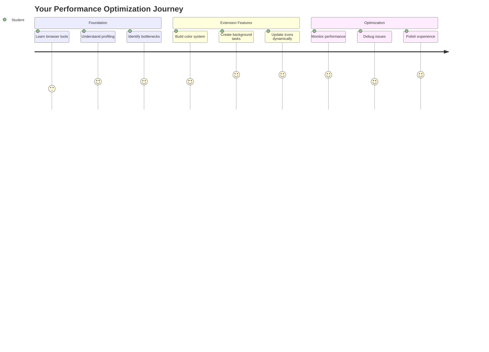
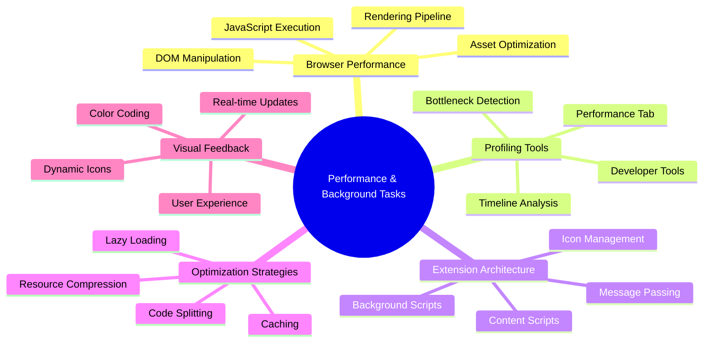
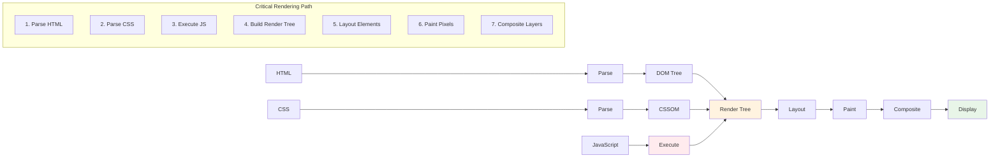
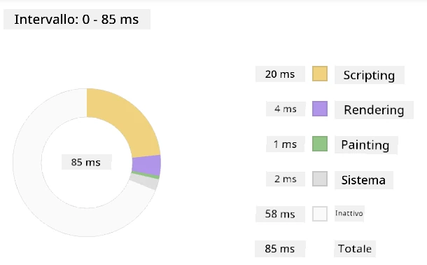
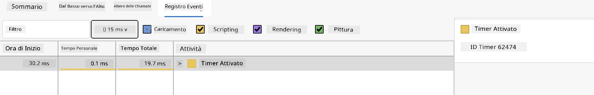
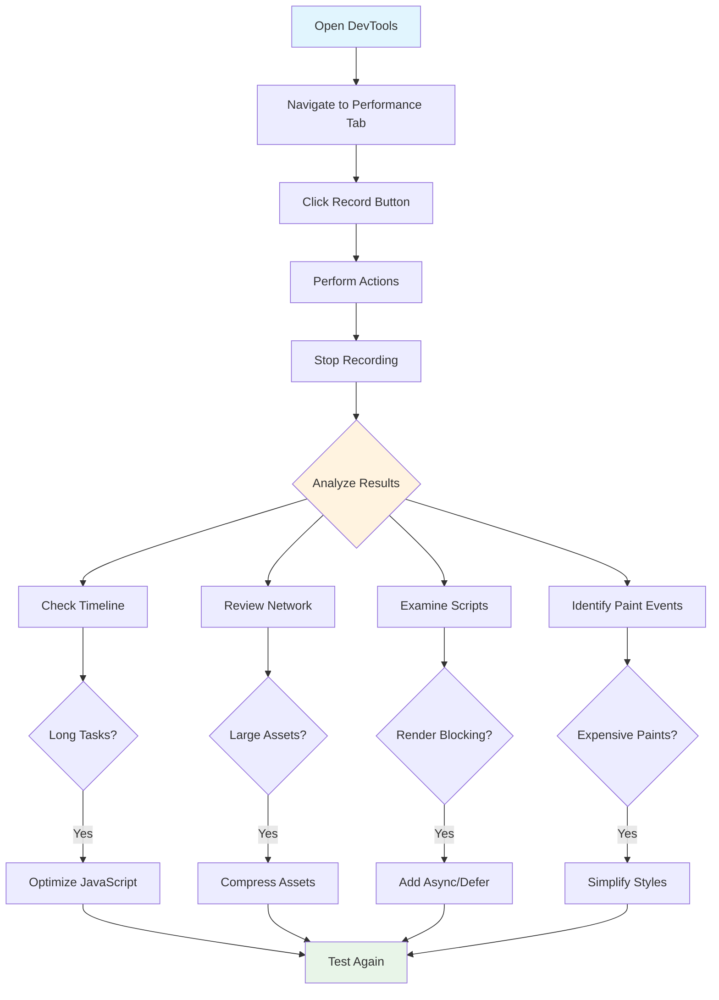
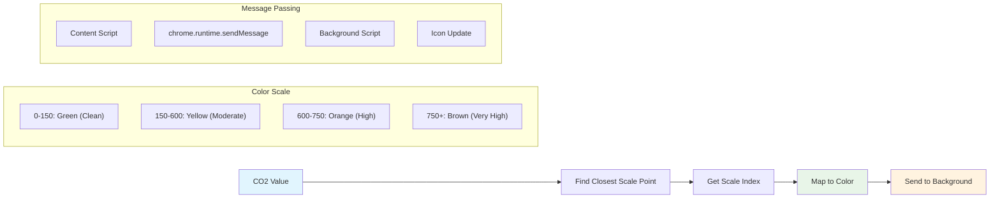
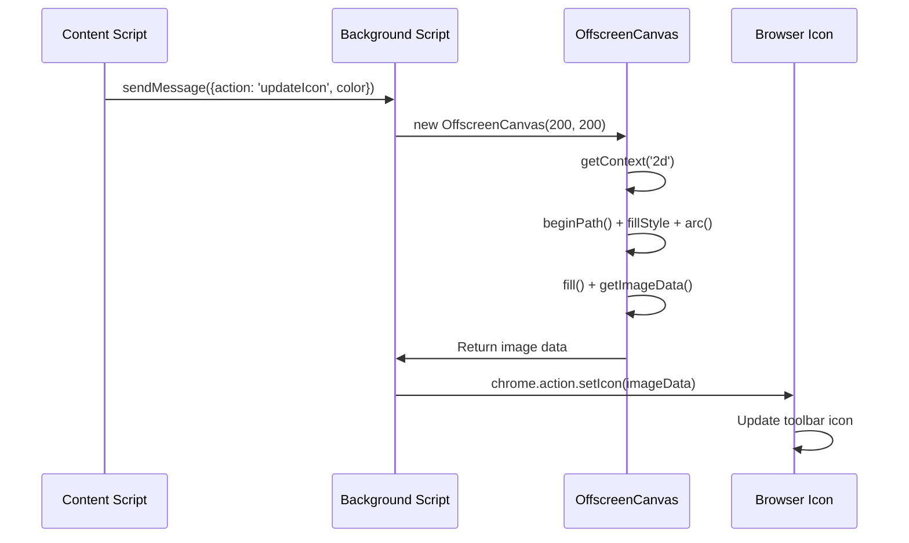
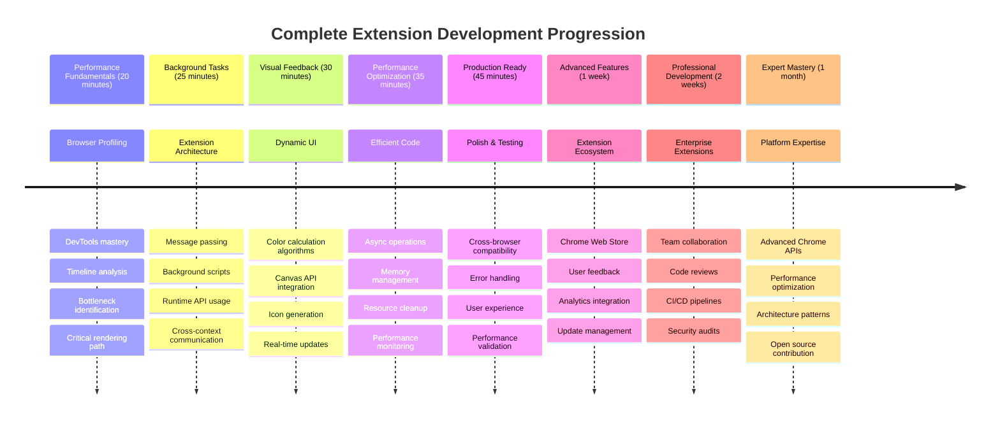

<!--
CO_OP_TRANSLATOR_METADATA:
{
  "original_hash": "b275fed2c6fc90d2b9b6661a3225faa2",
  "translation_date": "2025-11-04T00:38:23+00:00",
  "source_file": "5-browser-extension/3-background-tasks-and-performance/README.md",
  "language_code": "it"
}
-->
# Progetto Estensione Browser Parte 3: Scopri le Attività in Background e le Prestazioni



Ti sei mai chiesto cosa rende alcune estensioni del browser rapide e reattive mentre altre sembrano lente? Il segreto sta in ciò che accade dietro le quinte. Mentre gli utenti navigano nell'interfaccia della tua estensione, c'è un intero mondo di processi in background che gestiscono silenziosamente il recupero dei dati, l'aggiornamento delle icone e le risorse di sistema.

Questa è la nostra ultima lezione della serie sulle estensioni del browser, e faremo in modo che il tuo tracker dell'impronta di carbonio funzioni senza intoppi. Aggiungerai aggiornamenti dinamici delle icone e imparerai a individuare i problemi di prestazioni prima che diventino problematici. È come mettere a punto un'auto da corsa: piccole ottimizzazioni possono fare una grande differenza nel funzionamento generale.

Quando avremo finito, avrai un'estensione rifinita e comprenderai i principi di prestazione che distinguono le buone app web da quelle eccellenti. Immergiamoci nel mondo dell'ottimizzazione del browser.

## Quiz Pre-Lettura

[Quiz pre-lettura](https://ff-quizzes.netlify.app/web/quiz/27)

### Introduzione

Nelle lezioni precedenti, hai creato un modulo, lo hai collegato a un'API e hai affrontato il recupero asincrono dei dati. La tua estensione sta prendendo forma in modo eccellente.

Ora dobbiamo aggiungere gli ultimi ritocchi, come far cambiare colore all'icona dell'estensione in base ai dati sul carbonio. Questo mi ricorda come la NASA abbia dovuto ottimizzare ogni sistema sulla navetta spaziale Apollo. Non potevano permettersi sprechi di cicli o memoria perché la vita dipendeva dalle prestazioni. Anche se la nostra estensione del browser non è così critica, i principi sono gli stessi: codice efficiente crea esperienze utente migliori.



## Fondamenti delle Prestazioni Web

Quando il tuo codice funziona in modo efficiente, le persone possono *sentire* la differenza. Conosci quel momento in cui una pagina si carica istantaneamente o un'animazione scorre fluida? Quella è la buona prestazione al lavoro.

Le prestazioni non riguardano solo la velocità: si tratta di creare esperienze web che sembrino naturali invece che goffe e frustranti. Nei primi giorni dell'informatica, Grace Hopper teneva sulla sua scrivania un nanosecondo (un pezzo di filo lungo circa un piede) per mostrare quanto lontano viaggia la luce in un miliardesimo di secondo. Era il suo modo di spiegare perché ogni microsecondo conta nell'informatica. Esploriamo gli strumenti da detective che ti aiutano a capire cosa rallenta le cose.

> "Le prestazioni di un sito web riguardano due cose: quanto velocemente si carica la pagina e quanto velocemente il codice su di essa viene eseguito." -- [Zack Grossbart](https://www.smashingmagazine.com/2012/06/javascript-profiling-chrome-developer-tools/)

Il tema di come rendere i tuoi siti web incredibilmente veloci su tutti i tipi di dispositivi, per tutti i tipi di utenti, in tutte le situazioni, è sorprendentemente vasto. Ecco alcuni punti da tenere a mente mentre costruisci un progetto web standard o un'estensione del browser.

Il primo passo per ottimizzare il tuo sito è capire cosa sta realmente accadendo dietro le quinte. Fortunatamente, il tuo browser ha potenti strumenti da detective integrati.



Per aprire gli Strumenti per Sviluppatori in Edge, clicca sui tre puntini in alto a destra, poi vai su Altri strumenti > Strumenti per sviluppatori. Oppure usa la scorciatoia da tastiera: `Ctrl` + `Shift` + `I` su Windows o `Option` + `Command` + `I` su Mac. Una volta lì, clicca sulla scheda Prestazioni - è qui che farai le tue indagini.

**Ecco il tuo kit da detective delle prestazioni:**
- **Apri** gli Strumenti per Sviluppatori (li userai costantemente come sviluppatore!)
- **Vai** alla scheda Prestazioni - pensala come il tracker di fitness della tua app web
- **Premi** il pulsante Registra e osserva la tua pagina in azione
- **Studia** i risultati per individuare cosa rallenta le cose

Proviamolo. Apri un sito web (Microsoft.com funziona bene per questo) e clicca sul pulsante 'Registra'. Ora aggiorna la pagina e osserva il profiler catturare tutto ciò che accade. Quando interrompi la registrazione, vedrai una ripartizione dettagliata di come il browser 'scrive', 'renderizza' e 'dipinge' il sito. Mi ricorda come il controllo missione monitori ogni sistema durante un lancio di razzi - ottieni dati in tempo reale su ciò che sta accadendo e quando.


✅ La [Documentazione Microsoft](https://docs.microsoft.com/microsoft-edge/devtools-guide/performance/?WT.mc_id=academic-77807-sagibbon) ha tantissimi dettagli se vuoi approfondire.

> Consiglio utile: Cancella la cache del browser prima di testare per vedere come si comporta il tuo sito per i visitatori alla prima visita - di solito è molto diverso rispetto alle visite successive!

Seleziona gli elementi della timeline del profilo per ingrandire gli eventi che accadono mentre la tua pagina si carica.

Ottieni un'istantanea delle prestazioni della tua pagina selezionando una parte della timeline del profilo e guardando il pannello di riepilogo:



Controlla il pannello del registro eventi per vedere se qualche evento ha impiegato più di 15 ms:



✅ Familiarizza con il tuo profiler! Apri gli strumenti per sviluppatori su questo sito e verifica se ci sono colli di bottiglia. Qual è l'asset che si carica più lentamente? E quello più velocemente?



## Cosa Cercare Durante il Profiling

Eseguire il profiler è solo l'inizio: la vera abilità sta nel capire cosa ti stanno dicendo quei grafici colorati. Non preoccuparti, ci prenderai la mano. Gli sviluppatori esperti hanno imparato a individuare i segnali di allarme prima che diventino problemi veri e propri.

Parliamo dei soliti sospetti - i problemi di prestazione che tendono a insinuarsi nei progetti web. Come Marie Curie doveva monitorare attentamente i livelli di radiazione nel suo laboratorio, dobbiamo osservare certi schemi che indicano problemi in arrivo. Individuarli in anticipo ti risparmierà (e risparmierà ai tuoi utenti) molta frustrazione.

**Dimensioni degli asset**: I siti web sono diventati sempre più "pesanti" nel corso degli anni, e gran parte di quel peso extra proviene dalle immagini. È come se stessimo riempiendo sempre di più le nostre valigie digitali.

✅ Dai un'occhiata all'[Internet Archive](https://httparchive.org/reports/page-weight) per vedere come le dimensioni delle pagine sono cresciute nel tempo - è piuttosto rivelatore.

**Ecco come mantenere ottimizzati i tuoi asset:**
- **Comprimi** le immagini! I formati moderni come WebP possono ridurre drasticamente le dimensioni dei file
- **Servi** la dimensione dell'immagine giusta per ogni dispositivo - non c'è bisogno di inviare immagini enormi per desktop ai telefoni
- **Minimizza** il tuo CSS e JavaScript - ogni byte conta
- **Usa** il caricamento lazy in modo che le immagini vengano scaricate solo quando gli utenti effettivamente ci arrivano

**Traversate DOM**: Il browser deve costruire il suo Document Object Model basandosi sul codice che scrivi, quindi è nell'interesse di una buona prestazione della pagina mantenere i tag al minimo, utilizzando e stilizzando solo ciò di cui la pagina ha bisogno. A tal proposito, il CSS in eccesso associato a una pagina potrebbe essere ottimizzato; gli stili che devono essere utilizzati solo su una pagina non devono essere inclusi nel foglio di stile principale, ad esempio.

**Strategie chiave per l'ottimizzazione del DOM:**
- **Minimizza** il numero di elementi HTML e livelli di nidificazione
- **Rimuovi** le regole CSS inutilizzate e consolida i fogli di stile in modo efficiente
- **Organizza** il CSS per caricare solo ciò che è necessario per ogni pagina
- **Struttura** l'HTML in modo semantico per una migliore analisi da parte del browser

**JavaScript**: Ogni sviluppatore JavaScript dovrebbe prestare attenzione agli script che bloccano il rendering e che devono essere caricati prima che il resto del DOM possa essere attraversato e dipinto nel browser. Considera l'uso di `defer` con i tuoi script inline (come fatto nel modulo Terrarium).

**Tecniche moderne di ottimizzazione JavaScript:**
- **Usa** l'attributo `defer` per caricare gli script dopo l'analisi del DOM
- **Implementa** il code splitting per caricare solo il JavaScript necessario
- **Applica** il caricamento lazy per le funzionalità non critiche
- **Minimizza** l'uso di librerie e framework pesanti quando possibile

✅ Prova alcuni siti su un sito di [test di velocità](https://www.webpagetest.org/) per saperne di più sui controlli comuni effettuati per determinare le prestazioni del sito.

### 🔄 **Verifica Pedagogica**
**Comprensione delle Prestazioni**: Prima di costruire le funzionalità dell'estensione, assicurati di poter:
- ✅ Spiegare il percorso di rendering critico dall'HTML ai pixel
- ✅ Identificare i colli di bottiglia delle prestazioni comuni nelle applicazioni web
- ✅ Utilizzare gli strumenti per sviluppatori del browser per profilare le prestazioni della pagina
- ✅ Comprendere come la dimensione degli asset e la complessità del DOM influenzano la velocità

**Auto-Test Rapido**: Cosa succede quando hai JavaScript che blocca il rendering?
*Risposta: Il browser deve scaricare ed eseguire lo script prima di poter continuare a analizzare l'HTML e renderizzare la pagina*

**Impatto Reale delle Prestazioni**:
- **Ritardo di 100ms**: Gli utenti notano il rallentamento
- **Ritardo di 1 secondo**: Gli utenti iniziano a perdere concentrazione
- **Ritardo di 3+ secondi**: Il 40% degli utenti abbandona la pagina
- **Reti mobili**: Le prestazioni contano ancora di più

Ora che hai un'idea di come il browser renderizza gli asset che gli invii, vediamo le ultime cose che devi fare per completare la tua estensione:

### Crea una funzione per calcolare il colore

Ora creeremo una funzione che trasforma i dati numerici in colori significativi. Pensala come un sistema a semaforo: verde per energia pulita, rosso per alta intensità di carbonio.

Questa funzione prenderà i dati di CO2 dalla nostra API e determinerà quale colore rappresenta meglio l'impatto ambientale. È simile a come gli scienziati usano la codifica a colori nelle mappe di calore per visualizzare modelli di dati complessi - dalle temperature oceaniche alla formazione delle stelle. Aggiungiamola a `/src/index.js`, subito dopo quelle variabili `const` che abbiamo impostato in precedenza:



```javascript
function calculateColor(value) {
	// Define CO2 intensity scale (grams per kWh)
	const co2Scale = [0, 150, 600, 750, 800];
	// Corresponding colors from green (clean) to dark brown (high carbon)
	const colors = ['#2AA364', '#F5EB4D', '#9E4229', '#381D02', '#381D02'];

	// Find the closest scale value to our input
	const closestNum = co2Scale.sort((a, b) => {
		return Math.abs(a - value) - Math.abs(b - value);
	})[0];
	
	console.log(`${value} is closest to ${closestNum}`);
	
	// Find the index for color mapping
	const num = (element) => element > closestNum;
	const scaleIndex = co2Scale.findIndex(num);

	const closestColor = colors[scaleIndex];
	console.log(scaleIndex, closestColor);

	// Send color update message to background script
	chrome.runtime.sendMessage({ action: 'updateIcon', value: { color: closestColor } });
}
```

**Analizziamo questa piccola funzione intelligente:**
- **Imposta** due array - uno per i livelli di CO2, un altro per i colori (verde = pulito, marrone = sporco!)
- **Trova** la corrispondenza più vicina al nostro valore effettivo di CO2 utilizzando un ordinamento intelligente degli array
- **Recupera** il colore corrispondente utilizzando il metodo findIndex()
- **Invia** un messaggio allo script in background di Chrome con il colore scelto
- **Usa** i template literals (quelle virgolette rovesciate) per una formattazione delle stringhe più pulita
- **Mantiene** tutto organizzato con dichiarazioni const

L'API `chrome.runtime` [API](https://developer.chrome.com/extensions/runtime) è come il sistema nervoso della tua estensione - gestisce tutta la comunicazione e le attività dietro le quinte:

> "Usa l'API chrome.runtime per recuperare la pagina di background, restituire dettagli sul manifest e ascoltare e rispondere agli eventi nel ciclo di vita dell'app o dell'estensione. Puoi anche usare questa API per convertire il percorso relativo degli URL in URL completamente qualificati."

**Perché l'API Chrome Runtime è così utile:**
- **Permette** alle diverse parti della tua estensione di comunicare tra loro
- **Gestisce** il lavoro in background senza bloccare l'interfaccia utente
- **Amministra** gli eventi del ciclo di vita della tua estensione
- **Facilita** il passaggio di messaggi tra gli script

✅ Se stai sviluppando questa estensione per Edge, potrebbe sorprenderti sapere che stai usando un'API di Chrome. Le versioni più recenti del browser Edge funzionano sul motore del browser Chromium, quindi puoi sfruttare questi strumenti.



```mermaid
architecture-beta
    group browser(logos:chrome)[Browser]
    
    service popup(logos:html5)[Popup UI] in browser
    service content(logos:javascript)[Content Script] in browser
    service background(database)[Background Script] in browser
    service api(logos:api)[External API] in browser
    
    popup:R -- L:content
    content:R -- L:background
    background:T -- B:api
    content:T -- B:api
    
    junction junctionCenter in browser
    popup:R -- L:junctionCenter
    junctionCenter:R -- L:background
```

> **Consiglio utile**: Se vuoi profilare un'estensione del browser, avvia gli strumenti per sviluppatori direttamente dall'estensione stessa, poiché è una sua istanza separata del browser. Questo ti dà accesso a metriche di prestazione specifiche per l'estensione.

### Imposta un colore predefinito per l'icona

Prima di iniziare a recuperare dati reali, diamo alla nostra estensione un punto di partenza. A nessuno piace guardare un'icona vuota o rotta. Inizieremo con un colore verde in modo che gli utenti sappiano che l'estensione funziona dal momento in cui la installano.

Nella tua funzione `init()`, impostiamo quell'icona verde predefinita:

```javascript
chrome.runtime.sendMessage({
	action: 'updateIcon',
	value: {
		color: 'green',
	},
});
```

**Cosa realizza questa inizializzazione:**
- **Imposta** un colore verde neutro come stato predefinito
- **Fornisce** un feedback visivo immediato quando l'estensione si carica
- **Stabilisce** il modello di comunicazione con lo script in background
- **Garantisce** che gli utenti vedano un'estensione funzionante prima che i dati vengano caricati

### Chiama la funzione, esegui la chiamata

Ora colleghiamo tutto insieme in modo che, quando arrivano nuovi dati di CO2, la tua icona si aggiorni automaticamente con il colore corretto. È come collegare il circuito finale in un dispositivo elettronico: improvvisamente tutti i singoli componenti funzionano come un sistema unico.

Aggiungi questa riga subito dopo aver ottenuto i dati di CO2 dall'API:

```javascript
// After retrieving CO2 data from the API
// let CO2 = data.data[0].intensity.actual;
calculateColor(CO2);
```

**Cosa realizza questa integrazione:**
- **Collega** il flusso di dati dell'API con il sistema di indicatori visivi
- **Attiva** gli aggiornamenti delle icone automaticamente quando arrivano nuovi dati
- **Garantisce** un feedback visivo in tempo reale basato sull'intensità attuale del carbonio
- **Mantiene** la separazione delle responsabilità tra il recupero dei dati e la logica di visualizzazione

E infine, in `/dist/background.js`, aggiungi il listener per queste chiamate di azione in background:

```javascript
// Listen for messages from the content script
chrome.runtime.onMessage.addListener(function (msg, sender, sendResponse) {
	if (msg.action === 'updateIcon') {
		chrome.action.setIcon({ imageData: drawIcon(msg.value) });
	}
});

// Draw dynamic icon using Canvas API
// Borrowed from energy lollipop extension - nice feature!
function drawIcon(value) {
	// Create an offscreen canvas for better performance
	const canvas = new OffscreenCanvas(200, 200);
	const context = canvas.getContext('2d');

	// Draw a colored circle representing carbon intensity
	context.beginPath();
	context.fillStyle = value.color;
	context.arc(100, 100, 50, 0, 2 * Math.PI);
	context.fill();

	// Return the image data for the browser icon
	return context.getImageData(50, 50, 100, 100);
}
```

**Cosa fa questo script in background:**
- **Ascolta** i messaggi dal tuo script principale (come un centralinista che risponde alle chiamate)
- **Elabora** le richieste 'updateIcon' per cambiare l'icona della barra degli strumenti
- **Crea** nuove icone al volo utilizzando l'API Canvas
- **Disegna** un semplice cerchio colorato che mostra l'intensità attuale del carbonio
- **Aggiorna** la barra degli strumenti del browser con la nuova icona
- **Usa** OffscreenCanvas per prestazioni fluide (senza bloccare l'interfaccia utente)

✅ Imparerai di più sull'API Canvas nelle [lezioni sul gioco spaziale](../../6-space-game/2-drawing-to-canvas/README.md).



### 🔄 **Verifica Pedagogica**
**Comprensione Completa dell'Estensione**: Verifica la tua padronanza dell'intero sistema:
- ✅ Come funziona il passaggio di messaggi tra i diversi script dell'estensione?
- ✅ Perché usiamo OffscreenCanvas invece di Canvas normale per le prestazioni?
- ✅ Qual è il ruolo dell'API Chrome Runtime nell'architettura delle estensioni?
- ✅ Come l'algoritmo di calcolo del colore mappa i dati per fornire un feedback visivo?

**Considerazioni sulle prestazioni**: La tua estensione ora dimostra:
- **Messaggistica efficiente**: Comunicazione chiara tra i contesti degli script
- **Rendering ottimizzato**: OffscreenCanvas previene il blocco dell'interfaccia utente
- **Aggiornamenti in tempo reale**: Cambiamenti dinamici delle icone basati su dati live
- **Gestione della memoria**: Pulizia e gestione delle risorse adeguate

**È ora di testare la tua estensione:**
- **Compila** tutto con `npm run build`
- **Ricarica** la tua estensione nel browser (non dimenticare questo passaggio)
- **Apri** la tua estensione e osserva il cambiamento di colore dell'icona
- **Controlla** come risponde ai dati reali sul carbonio provenienti da tutto il mondo

Ora saprai a colpo d'occhio se è un buon momento per fare il bucato o se è meglio aspettare un'energia più pulita. Hai appena creato qualcosa di veramente utile e hai imparato qualcosa sulle prestazioni del browser lungo il percorso.

## Sfida dell'Agente GitHub Copilot 🚀

Usa la modalità Agente per completare la seguente sfida:

**Descrizione:** Migliora le capacità di monitoraggio delle prestazioni dell'estensione del browser aggiungendo una funzione che traccia e visualizza i tempi di caricamento per i diversi componenti dell'estensione.

**Prompt:** Crea un sistema di monitoraggio delle prestazioni per l'estensione del browser che misuri e registri il tempo necessario per recuperare i dati di CO2 dall'API, calcolare i colori e aggiornare l'icona. Aggiungi una funzione chiamata `performanceTracker` che utilizzi l'API Performance per misurare queste operazioni e visualizzi i risultati nella console del browser con timestamp e metriche di durata.

Scopri di più sulla [modalità agente](https://code.visualstudio.com/blogs/2025/02/24/introducing-copilot-agent-mode) qui.

## 🚀 Sfida

Ecco una missione da detective interessante: scegli alcuni siti web open source che esistono da anni (pensa a Wikipedia, GitHub o Stack Overflow) e analizza la loro cronologia dei commit. Riesci a individuare dove hanno apportato miglioramenti alle prestazioni? Quali problemi si sono ripetuti?

**Approccio per l'indagine:**
- **Cerca** nei messaggi dei commit parole come "ottimizzare", "prestazioni" o "più veloce"
- **Osserva** i modelli - continuano a risolvere gli stessi tipi di problemi?
- **Identifica** i colpevoli comuni che rallentano i siti web
- **Condividi** ciò che scopri - altri sviluppatori possono imparare da esempi reali

## Quiz post-lezione

[Quiz post-lezione](https://ff-quizzes.netlify.app/web/quiz/28)

## Revisione e studio autonomo

Considera di iscriverti a una [newsletter sulle prestazioni](https://perf.email/)

Indaga alcuni dei modi in cui i browser valutano le prestazioni web esaminando le schede delle prestazioni nei loro strumenti web. Trovi differenze significative?

### ⚡ **Cosa puoi fare nei prossimi 5 minuti**
- [ ] Apri il Task Manager del browser (Shift+Esc in Chrome) per vedere l'utilizzo delle risorse dell'estensione
- [ ] Usa la scheda Performance di DevTools per registrare e analizzare le prestazioni delle pagine web
- [ ] Controlla la pagina delle estensioni del browser per vedere quali estensioni influenzano il tempo di avvio
- [ ] Prova a disabilitare temporaneamente le estensioni per vedere le differenze di prestazioni

### 🎯 **Cosa puoi realizzare in quest'ora**
- [ ] Completa il quiz post-lezione e comprendi i concetti sulle prestazioni
- [ ] Implementa uno script in background per la tua estensione del browser
- [ ] Impara a usare browser.alarms per attività in background efficienti
- [ ] Pratica il passaggio di messaggi tra script di contenuto e script in background
- [ ] Misura e ottimizza l'utilizzo delle risorse della tua estensione

### 📅 **Il tuo viaggio settimanale sulle prestazioni**
- [ ] Completa un'estensione del browser ad alte prestazioni con funzionalità in background
- [ ] Padroneggia i service worker e l'architettura moderna delle estensioni
- [ ] Implementa strategie efficienti di sincronizzazione e caching dei dati
- [ ] Impara tecniche avanzate di debug per le prestazioni delle estensioni
- [ ] Ottimizza la tua estensione sia per funzionalità che per efficienza delle risorse
- [ ] Crea test completi per scenari di prestazioni delle estensioni

### 🌟 **La tua maestria nell'ottimizzazione in un mese**
- [ ] Crea estensioni per browser di livello enterprise con prestazioni ottimali
- [ ] Impara tutto su Web Workers, Service Workers e prestazioni web moderne
- [ ] Contribuisci a progetti open source focalizzati sull'ottimizzazione delle prestazioni
- [ ] Padroneggia gli internals del browser e tecniche avanzate di debug
- [ ] Crea strumenti di monitoraggio delle prestazioni e guide alle migliori pratiche
- [ ] Diventa un esperto di prestazioni che aiuta a ottimizzare le applicazioni web

## 🎯 La tua timeline di maestria nelle estensioni del browser



### 🛠️ Il tuo toolkit completo per lo sviluppo di estensioni

Dopo aver completato questa trilogia, hai ora padroneggiato:
- **Architettura del browser**: Comprensione approfondita di come le estensioni si integrano con i sistemi del browser
- **Profilazione delle prestazioni**: Capacità di identificare e risolvere i colli di bottiglia utilizzando strumenti per sviluppatori
- **Programmazione asincrona**: Modelli moderni di JavaScript per operazioni reattive e non bloccanti
- **Integrazione API**: Recupero di dati esterni con autenticazione e gestione degli errori
- **Design visivo**: Aggiornamenti dinamici dell'interfaccia utente e generazione grafica basata su Canvas
- **Passaggio di messaggi**: Comunicazione tra script nell'architettura delle estensioni
- **Esperienza utente**: Stati di caricamento, gestione degli errori e interazioni intuitive
- **Competenze di produzione**: Test, debug e ottimizzazione per il deployment nel mondo reale

**Applicazioni reali**: Le tue competenze nello sviluppo di estensioni si applicano direttamente a:
- **Progressive Web Apps**: Architettura e modelli di prestazioni simili
- **App desktop Electron**: Applicazioni cross-platform basate su tecnologie web
- **App ibride mobili**: Sviluppo Cordova/PhoneGap utilizzando API web
- **Applicazioni web aziendali**: Dashboard complessi e strumenti di produttività
- **Estensioni Chrome DevTools**: Strumenti avanzati per sviluppatori e debug
- **Integrazione API web**: Qualsiasi applicazione che comunica con servizi esterni

**Impatto professionale**: Ora puoi:
- **Creare** estensioni per browser pronte per la produzione, dalla concezione al deployment
- **Ottimizzare** le prestazioni delle applicazioni web utilizzando strumenti di profilazione standard del settore
- **Progettare** sistemi scalabili con una corretta separazione delle responsabilità
- **Debuggare** operazioni asincrone complesse e comunicazioni tra contesti
- **Contribuire** a progetti open source di estensioni e standard del browser

**Prossime opportunità**:
- **Sviluppatore per Chrome Web Store**: Pubblica estensioni per milioni di utenti
- **Ingegnere delle prestazioni web**: Specializzati in ottimizzazione ed esperienza utente
- **Sviluppatore di piattaforme browser**: Contribuisci allo sviluppo del motore del browser
- **Creatore di framework per estensioni**: Crea strumenti che aiutano altri sviluppatori
- **Relazioni con gli sviluppatori**: Condividi conoscenze attraverso insegnamento e creazione di contenuti

🌟 **Obiettivo raggiunto**: Hai creato un'estensione per browser completa e funzionale che dimostra pratiche di sviluppo professionali e standard web moderni!

## Compito

[Analizza un sito per le prestazioni](assignment.md)

---

**Disclaimer**:  
Questo documento è stato tradotto utilizzando il servizio di traduzione AI [Co-op Translator](https://github.com/Azure/co-op-translator). Sebbene ci impegniamo per garantire l'accuratezza, si prega di notare che le traduzioni automatiche possono contenere errori o imprecisioni. Il documento originale nella sua lingua nativa dovrebbe essere considerato la fonte autorevole. Per informazioni critiche, si raccomanda una traduzione professionale umana. Non siamo responsabili per eventuali incomprensioni o interpretazioni errate derivanti dall'uso di questa traduzione.