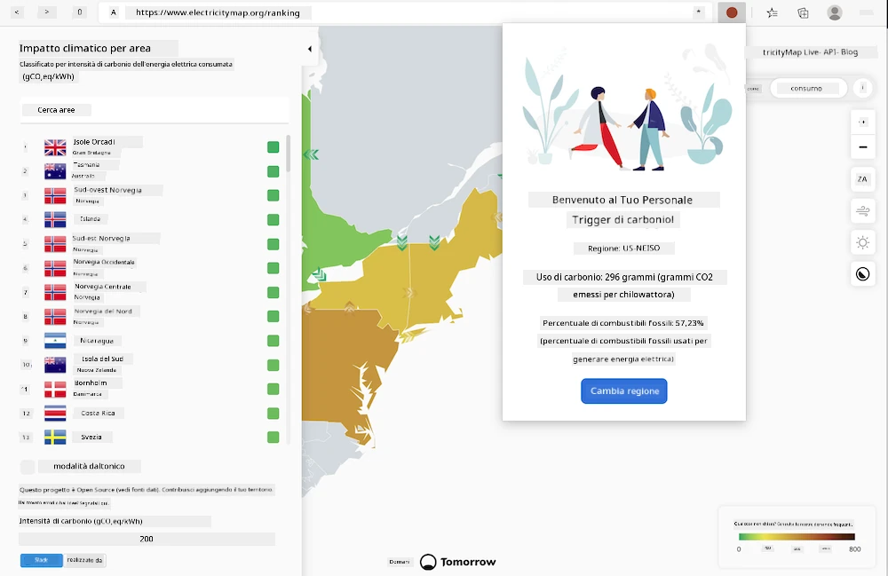

<!--
CO_OP_TRANSLATOR_METADATA:
{
  "original_hash": "b121a279a6ab39878491f3e572673515",
  "translation_date": "2025-08-25T23:27:15+00:00",
  "source_file": "5-browser-extension/README.md",
  "language_code": "it"
}
-->
# Creare un'estensione per browser

Creare estensioni per browser è un modo divertente e interessante per riflettere sulle prestazioni delle tue applicazioni mentre sviluppi un tipo diverso di risorsa web. Questo modulo include lezioni su come funzionano i browser, come distribuire un'estensione per browser, come creare un modulo, chiamare un'API, utilizzare l'archiviazione locale e come valutare e migliorare le prestazioni del tuo sito web.

Creerai un'estensione per browser che funziona su Edge, Chrome e Firefox. Questa estensione, che è come un mini sito web progettato per un compito molto specifico, controlla l'[API CO2 Signal](https://www.co2signal.com) per verificare l'uso di elettricità e l'intensità di carbonio di una determinata regione, restituendo una lettura sull'impronta di carbonio della regione.

Questa estensione può essere utilizzata ad hoc da un utente una volta che una chiave API e un codice regione sono stati inseriti in un modulo, per determinare l'uso locale di elettricità e fornire così dati che possono influenzare le decisioni energetiche dell'utente. Ad esempio, potrebbe essere preferibile posticipare l'uso di un'asciugatrice (un'attività ad alta intensità di carbonio) durante un periodo di elevato consumo di elettricità nella tua regione.

### Argomenti

1. [Informazioni sul browser](1-about-browsers/README.md)
2. [Moduli e archiviazione locale](2-forms-browsers-local-storage/README.md)
3. [Attività in background e prestazioni](3-background-tasks-and-performance/README.md)

### Crediti

## Crediti

L'idea per questo "web carbon trigger" è stata proposta da Asim Hussain, responsabile del team Green Cloud Advocacy di Microsoft e autore dei [Green Principles](https://principles.green/). In origine era un [progetto di sito web](https://github.com/jlooper/green).

La struttura dell'estensione per browser è stata influenzata dall'[estensione COVID di Adebola Adeniran](https://github.com/onedebos/covtension).

Il concetto dietro il sistema di icone a "punti" è stato suggerito dalla struttura delle icone dell'estensione per browser [Energy Lollipop](https://energylollipop.com/) per le emissioni in California.

Queste lezioni sono state scritte con ♥️ da [Jen Looper](https://www.twitter.com/jenlooper)

**Disclaimer (Avvertenza)**:  
Questo documento è stato tradotto utilizzando il servizio di traduzione automatica [Co-op Translator](https://github.com/Azure/co-op-translator). Sebbene ci impegniamo per garantire l'accuratezza, si prega di notare che le traduzioni automatiche possono contenere errori o imprecisioni. Il documento originale nella sua lingua nativa dovrebbe essere considerato la fonte autorevole. Per informazioni critiche, si raccomanda una traduzione professionale effettuata da un traduttore umano. Non siamo responsabili per eventuali incomprensioni o interpretazioni errate derivanti dall'uso di questa traduzione.