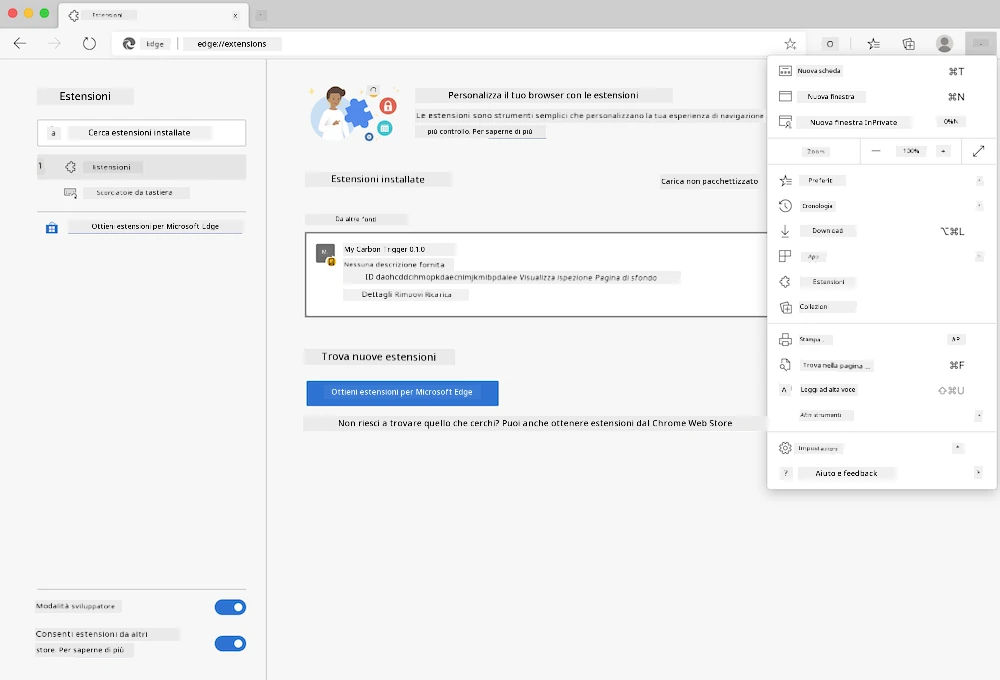

# Estensione del browser Carbon Trigger: codice completato

Utilizzando l'API CO2 Signal di tmrow per monitorare l'uso dell'elettricità, è stato creato un'estensione del browser che ti ricorda quanto è intenso l'uso dell'elettricità nella tua area. Usare questa estensione ti aiuterà a prendere decisioni sulle tue attività basandoti su queste informazioni.


## Per iniziare

Devi installare [npm](https://npmjs.com). Scarica una copia di questo codice in una cartella sul tuo computer.

Installa tutti i pacchetti necessari:

```
npm install
```

Crea l'estensione con webpack:

```
npm run build
```

Per installarla su Edge, utilizza il menu "tre punti" nell'angolo in alto a destra del browser per trovare il pannello delle estensioni. Da lì, seleziona "Carica non impacchettato" per caricare una nuova estensione. Quando richiesto, apri la cartella "dist" e l'estensione verrà caricata. Per utilizzarla, avrai bisogno di una chiave API di CO2 Signal ([ottienila qui via email](https://www.co2snal.com/) inserendo il tuo indirizzo email nel box sulla pagina) e del [codice della tua area](http://api.electricitymap.org/v3/zones) da [Electricity Map](https://www.electricitymap.org/map) (ad esempio, per Boston, utilizzo "US-NEISO").



Una volta che la chiave API e il codice dell'area sono stati inseriti nell'interfaccia dell'estensione, il punto colorato nella barra delle estensioni del browser dovrebbe cambiare per riflettere l'uso energetico della tua area e fornire un indicatore su quali attività ad alto consumo energetico sono più adatte. Il concetto dietro questo sistema di "punti" mi è stato ispirato dall'estensione [Energy Lollipop](https://energylollipop.com/) per le emissioni in California.

**Disclaimer**:  
Questo documento è stato tradotto utilizzando il servizio di traduzione automatica [Co-op Translator](https://github.com/Azure/co-op-translator). Sebbene ci impegniamo per garantire l'accuratezza, si prega di notare che le traduzioni automatiche potrebbero contenere errori o imprecisioni. Il documento originale nella sua lingua nativa dovrebbe essere considerato la fonte autorevole. Per informazioni critiche, si raccomanda una traduzione professionale effettuata da un traduttore umano. Non siamo responsabili per eventuali incomprensioni o interpretazioni errate derivanti dall'uso di questa traduzione.