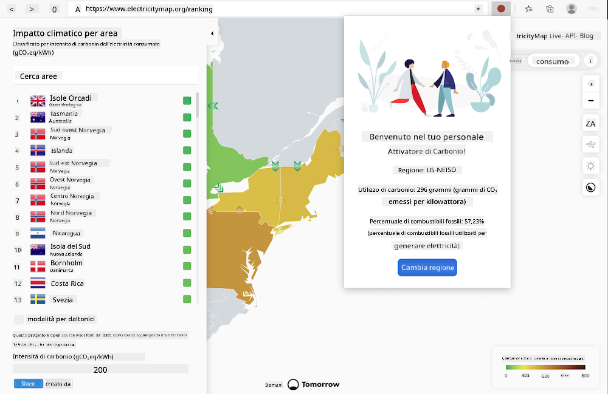
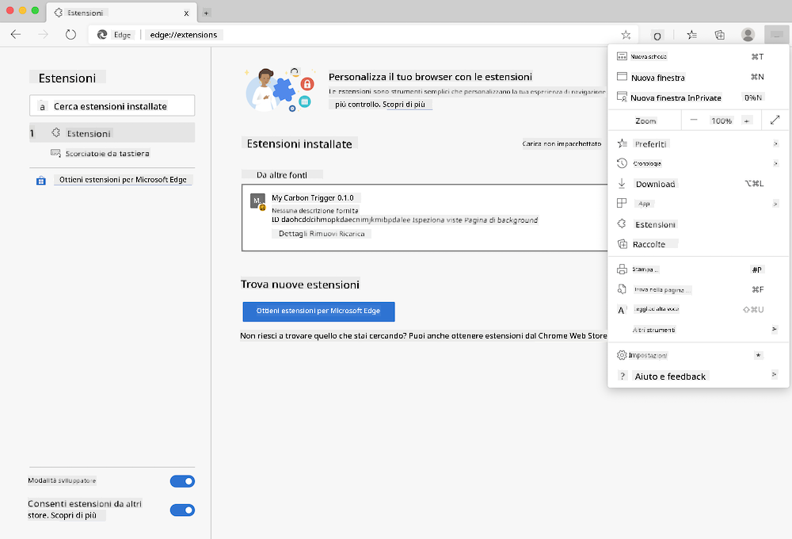

<!--
CO_OP_TRANSLATOR_METADATA:
{
  "original_hash": "9a6b22a2eff0f499b66236be973b24ad",
  "translation_date": "2025-08-26T00:00:17+00:00",
  "source_file": "5-browser-extension/solution/translation/README.it.md",
  "language_code": "it"
}
-->
# Estensione del browser Carbon Trigger: codice per iniziare

Si utilizzerà l'API Signal CO2 di tmrow per monitorare l'utilizzo dell'elettricità e creare un'estensione per il browser che fornisca un promemoria diretto su quanto sia intenso l'uso di elettricità nella propria regione. L'utilizzo di questa estensione personalizzata aiuterà a valutare le proprie attività in base a queste informazioni.



## Per iniziare

È necessario che [npm](https://npmjs.com) sia installato. Scaricare una copia di questo codice in una cartella del proprio computer.

Installare tutti i pacchetti richiesti:

```
npm install
```

Creare l'estensione con webpack:

```
npm run build
```

Per installare su Edge, utilizzare il menu "tre punti" nell'angolo in alto a destra del browser per accedere al pannello Estensioni. Se non è già attiva, abilitare la Modalità sviluppatore (in basso a sinistra). Selezionare "Carica decompressa" per aggiungere una nuova estensione. Aprire la cartella "dist" al prompt e l'estensione verrà caricata. Per utilizzarla, sarà necessario ottenere una chiave API per l'API di CO2 Signal (si può [richiedere qui via e-mail](https://www.co2signal.com/) - inserire la propria e-mail nella casella presente in questa pagina) e il [codice della propria regione](http://api.electricitymap.org/v3/zones) corrispondente alla [mappa elettrica](https://www.electricitymap.org/map) (ad esempio, per Boston, "US-NEISO").



Una volta inseriti la chiave API e il codice della regione nell'interfaccia dell'estensione, il punto colorato nella barra dell'estensione del browser dovrebbe cambiare per riflettere l'utilizzo di energia della regione e fornire indicazioni su quali attività ad alto consumo energetico sarebbero più appropriate da eseguire. Il concetto alla base di questo sistema a "punti" è stato ispirato dall'[estensione Energy Lollipop](https://energylollipop.com/) per le emissioni della California.

**Disclaimer (Avvertenza)**:  
Questo documento è stato tradotto utilizzando il servizio di traduzione automatica [Co-op Translator](https://github.com/Azure/co-op-translator). Sebbene ci impegniamo per garantire l'accuratezza, si prega di tenere presente che le traduzioni automatiche possono contenere errori o imprecisioni. Il documento originale nella sua lingua nativa dovrebbe essere considerato la fonte autorevole. Per informazioni critiche, si raccomanda una traduzione professionale effettuata da un traduttore umano. Non siamo responsabili per eventuali incomprensioni o interpretazioni errate derivanti dall'uso di questa traduzione.