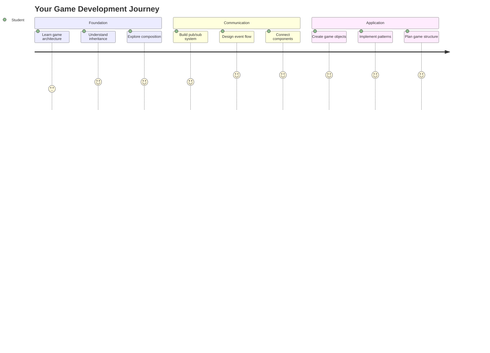
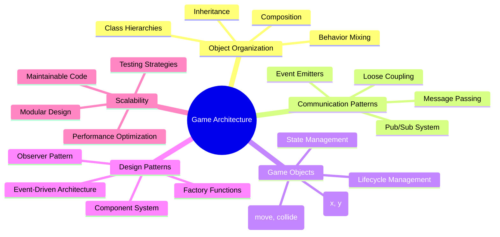
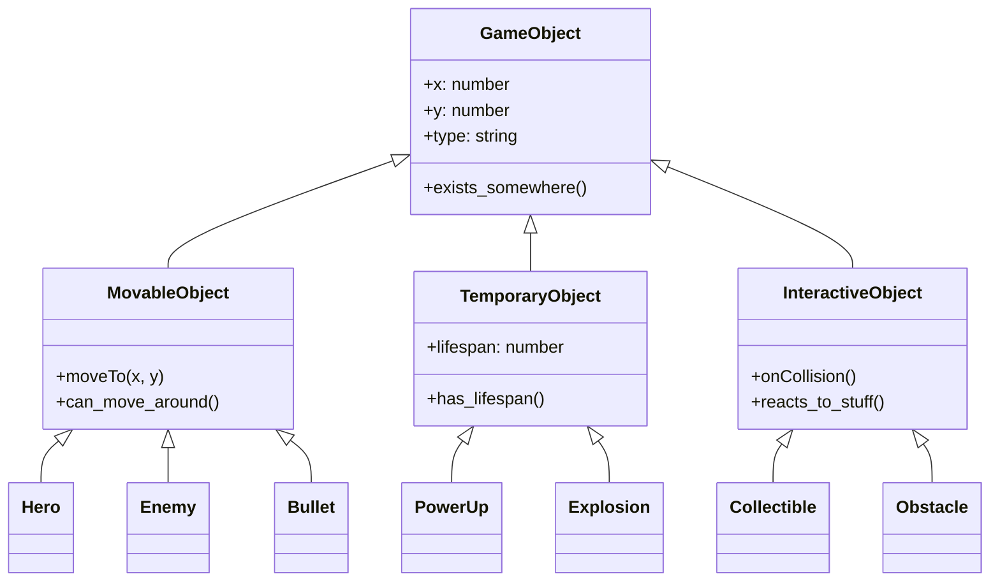
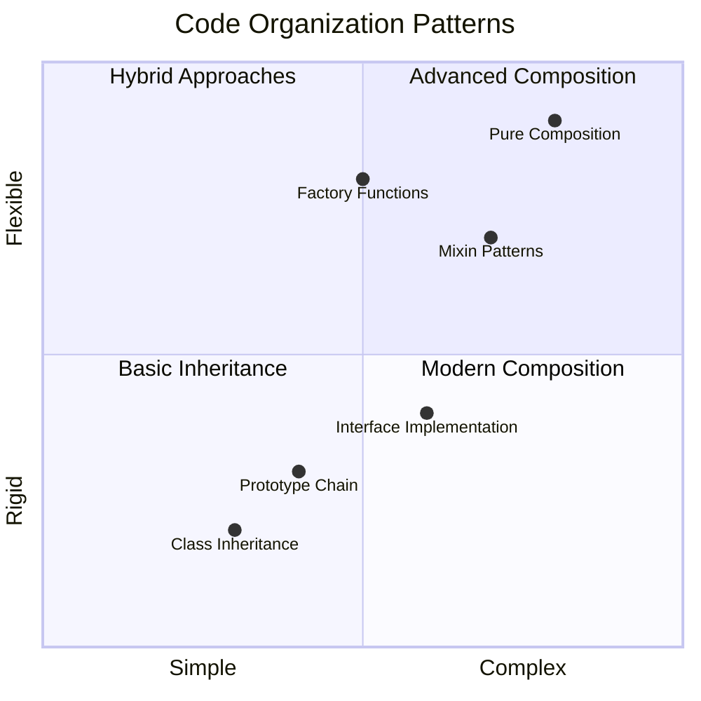
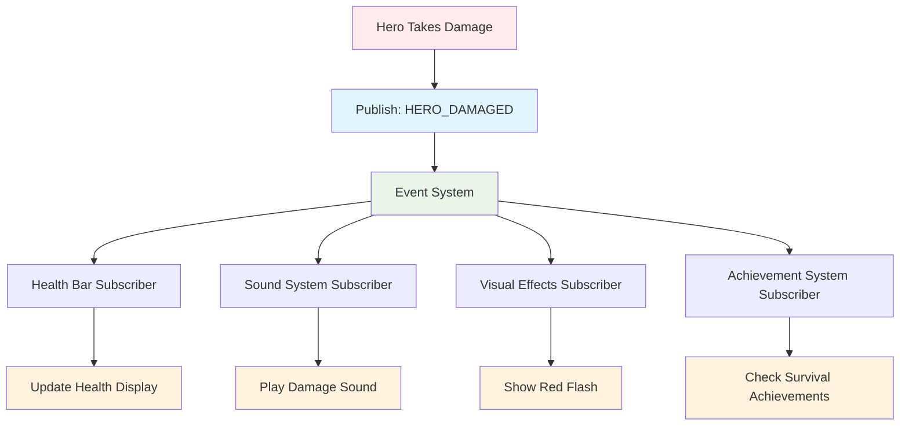
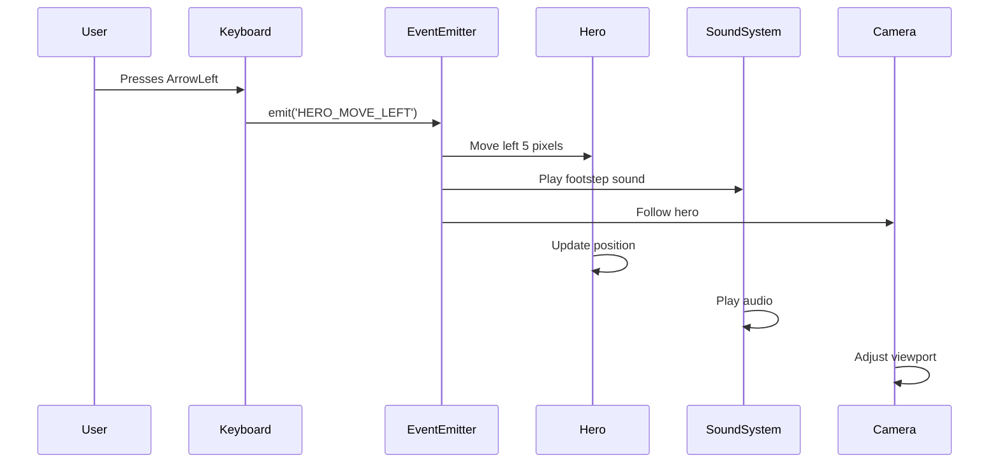
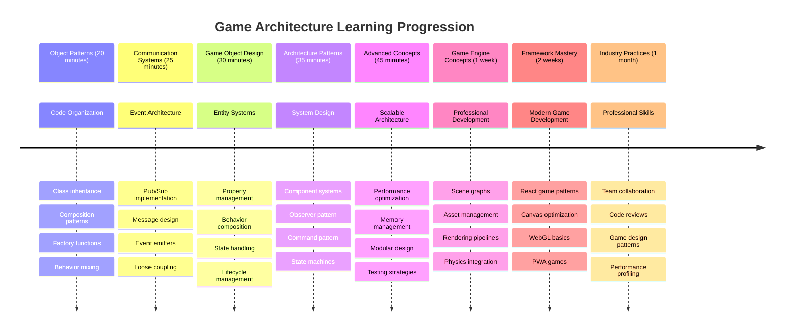

<!--
CO_OP_TRANSLATOR_METADATA:
{
  "original_hash": "a6332a7bb4d0be3bfd24199c83993777",
  "translation_date": "2025-11-04T00:37:27+00:00",
  "source_file": "6-space-game/1-introduction/README.md",
  "language_code": "it"
}
-->
# Costruire un Gioco Spaziale Parte 1: Introduzione




Proprio come il controllo missione della NASA coordina più sistemi durante un lancio spaziale, costruiremo un gioco spaziale che dimostra come le diverse parti di un programma possano lavorare insieme senza problemi. Creando qualcosa che puoi effettivamente giocare, imparerai concetti di programmazione essenziali applicabili a qualsiasi progetto software.

Esploreremo due approcci fondamentali per organizzare il codice: ereditarietà e composizione. Questi non sono solo concetti accademici – sono gli stessi modelli che alimentano tutto, dai videogiochi ai sistemi bancari. Implementeremo anche un sistema di comunicazione chiamato pub/sub, che funziona come le reti di comunicazione utilizzate nelle navicelle spaziali, permettendo ai diversi componenti di condividere informazioni senza creare dipendenze.

Alla fine di questa serie, capirai come costruire applicazioni che possono scalare ed evolversi – che tu stia sviluppando giochi, applicazioni web o qualsiasi altro sistema software.



## Quiz Pre-Lettura

[Quiz pre-lettura](https://ff-quizzes.netlify.app/web/quiz/29)

## Ereditarietà e Composizione nello Sviluppo di Giochi

Man mano che i progetti crescono in complessità, l'organizzazione del codice diventa fondamentale. Ciò che inizia come uno script semplice può diventare difficile da gestire senza una struttura adeguata – proprio come le missioni Apollo richiedevano un'attenta coordinazione tra migliaia di componenti.

Esploreremo due approcci fondamentali per organizzare il codice: ereditarietà e composizione. Ognuno ha vantaggi distinti, e comprendere entrambi ti aiuta a scegliere l'approccio giusto per situazioni diverse. Dimostreremo questi concetti attraverso il nostro gioco spaziale, dove eroi, nemici, potenziamenti e altri oggetti devono interagire in modo efficiente.

✅ Uno dei libri di programmazione più famosi mai scritti riguarda i [design patterns](https://en.wikipedia.org/wiki/Design_Patterns).

In ogni gioco, ci sono `oggetti di gioco` – gli elementi interattivi che popolano il mondo del gioco. Eroi, nemici, potenziamenti ed effetti visivi sono tutti oggetti di gioco. Ognuno esiste in coordinate specifiche dello schermo usando valori `x` e `y`, simili al tracciamento di punti su un piano cartesiano.

Nonostante le loro differenze visive, questi oggetti spesso condividono comportamenti fondamentali:

- **Esistono da qualche parte** – Ogni oggetto ha coordinate x e y affinché il gioco sappia dove disegnarlo
- **Molti possono muoversi** – Gli eroi corrono, i nemici inseguono, i proiettili volano attraverso lo schermo
- **Hanno una durata** – Alcuni rimangono per sempre, altri (come le esplosioni) appaiono brevemente e scompaiono
- **Reagiscono agli eventi** – Quando le cose si scontrano, i potenziamenti vengono raccolti, le barre della salute si aggiornano

✅ Pensa a un gioco come Pac-Man. Riesci a identificare i quattro tipi di oggetti elencati sopra in questo gioco?



### Esprimere il Comportamento Attraverso il Codice

Ora che hai compreso i comportamenti comuni che gli oggetti di gioco condividono, esploriamo come implementare questi comportamenti in JavaScript. Puoi esprimere il comportamento degli oggetti attraverso metodi associati a classi o oggetti individuali, e ci sono diversi approcci tra cui scegliere.

**L'Approccio Basato su Classi**

Le classi e l'ereditarietà forniscono un approccio strutturato per organizzare gli oggetti di gioco. Come il sistema di classificazione tassonomica sviluppato da Carl Linneo, inizi con una classe base contenente proprietà comuni, quindi crei classi specializzate che ereditano questi fondamenti aggiungendo capacità specifiche.

✅ L'ereditarietà è un concetto importante da comprendere. Scopri di più nell'[articolo di MDN sull'ereditarietà](https://developer.mozilla.org/docs/Web/JavaScript/Inheritance_and_the_prototype_chain).

Ecco come puoi implementare gli oggetti di gioco usando classi e ereditarietà:

```javascript
// Step 1: Create the base GameObject class
class GameObject {
  constructor(x, y, type) {
    this.x = x;
    this.y = y;
    this.type = type;
  }
}
```

**Analizziamo questo passo dopo passo:**
- Stiamo creando un modello di base che ogni oggetto di gioco può utilizzare
- Il costruttore salva dove si trova l'oggetto (`x`, `y`) e di che tipo è
- Questo diventa la base su cui tutti i tuoi oggetti di gioco si costruiranno

```javascript
// Step 2: Add movement capability through inheritance
class Movable extends GameObject {
  constructor(x, y, type) {
    super(x, y, type); // Call parent constructor
  }

  // Add the ability to move to a new position
  moveTo(x, y) {
    this.x = x;
    this.y = y;
  }
}
```

**In quanto sopra, abbiamo:**
- **Esteso** la classe GameObject per aggiungere funzionalità di movimento
- **Chiamato** il costruttore del genitore usando `super()` per inizializzare le proprietà ereditate
- **Aggiunto** un metodo `moveTo()` che aggiorna la posizione dell'oggetto

```javascript
// Step 3: Create specific game object types
class Hero extends Movable {
  constructor(x, y) {
    super(x, y, 'Hero'); // Set type automatically
  }
}

class Tree extends GameObject {
  constructor(x, y) {
    super(x, y, 'Tree'); // Trees don't need movement
  }
}

// Step 4: Use your game objects
const hero = new Hero(0, 0);
hero.moveTo(5, 5); // Hero can move!

const tree = new Tree(10, 15);
// tree.moveTo() would cause an error - trees can't move
```

**Comprendere questi concetti:**
- **Crea** tipi di oggetti specializzati che ereditano comportamenti appropriati
- **Dimostra** come l'ereditarietà consente l'inclusione selettiva delle funzionalità
- **Mostra** che gli eroi possono muoversi mentre gli alberi rimangono fermi
- **Illustra** come la gerarchia delle classi previene azioni inappropriate

✅ Prenditi qualche minuto per immaginare un eroe di Pac-Man (Inky, Pinky o Blinky, ad esempio) e come sarebbe scritto in JavaScript.

**L'Approccio Compositivo**

La composizione segue una filosofia di design modulare, simile a come gli ingegneri progettano navicelle spaziali con componenti intercambiabili. Invece di ereditare da una classe genitore, combini comportamenti specifici per creare oggetti con esattamente le funzionalità di cui hanno bisogno. Questo approccio offre flessibilità senza vincoli gerarchici rigidi.

```javascript
// Step 1: Create base behavior objects
const gameObject = {
  x: 0,
  y: 0,
  type: ''
};

const movable = {
  moveTo(x, y) {
    this.x = x;
    this.y = y;
  }
};
```

**Ecco cosa fa questo codice:**
- **Definisce** un oggetto base `gameObject` con proprietà di posizione e tipo
- **Crea** un oggetto di comportamento separato `movable` con funzionalità di movimento
- **Separa** le preoccupazioni mantenendo i dati di posizione e la logica di movimento indipendenti

```javascript
// Step 2: Compose objects by combining behaviors
const movableObject = { ...gameObject, ...movable };

// Step 3: Create factory functions for different object types
function createHero(x, y) {
  return {
    ...movableObject,
    x,
    y,
    type: 'Hero'
  };
}

function createStatic(x, y, type) {
  return {
    ...gameObject,
    x,
    y,
    type
  };
}
```

**In quanto sopra, abbiamo:**
- **Combinato** le proprietà dell'oggetto base con il comportamento di movimento usando la sintassi spread
- **Creato** funzioni di fabbrica che restituiscono oggetti personalizzati
- **Abilitato** la creazione flessibile di oggetti senza gerarchie rigide di classi
- **Permesso** agli oggetti di avere esattamente i comportamenti di cui hanno bisogno

```javascript
// Step 4: Create and use your composed objects
const hero = createHero(10, 10);
hero.moveTo(5, 5); // Works perfectly!

const tree = createStatic(0, 0, 'Tree');
// tree.moveTo() is undefined - no movement behavior was composed
```

**Punti chiave da ricordare:**
- **Compone** oggetti mescolando comportamenti piuttosto che ereditandoli
- **Fornisce** più flessibilità rispetto alle gerarchie rigide di ereditarietà
- **Permette** agli oggetti di avere esattamente le funzionalità di cui hanno bisogno
- **Utilizza** la moderna sintassi spread di JavaScript per una combinazione pulita degli oggetti
```

**Which Pattern Should You Choose?**

**Which Pattern Should You Choose?**



> 💡 **Consiglio Pro**: Entrambi i modelli hanno il loro posto nello sviluppo moderno di JavaScript. Le classi funzionano bene per gerarchie chiaramente definite, mentre la composizione brilla quando hai bisogno della massima flessibilità.
> 
**Ecco quando utilizzare ciascun approccio:**
- **Scegli** l'ereditarietà quando hai relazioni "è-un" chiare (un Eroe *è-un* oggetto Movable)
- **Seleziona** la composizione quando hai relazioni "ha-un" (un Eroe *ha* capacità di movimento)
- **Considera** le preferenze del tuo team e i requisiti del progetto
- **Ricorda** che puoi mescolare entrambi gli approcci nella stessa applicazione

### 🔄 **Verifica Pedagogica**
**Comprensione dell'Organizzazione degli Oggetti**: Prima di passare ai modelli di comunicazione, assicurati di poter:
- ✅ Spiegare la differenza tra ereditarietà e composizione
- ✅ Identificare quando utilizzare classi rispetto a funzioni di fabbrica
- ✅ Comprendere come funziona la parola chiave `super()` nell'ereditarietà
- ✅ Riconoscere i vantaggi di ciascun approccio per lo sviluppo di giochi

**Auto-Test Rapido**: Come creeresti un Nemico Volante che può sia muoversi che volare?
- **Approccio con ereditarietà**: `class FlyingEnemy extends Movable`
- **Approccio con composizione**: `{ ...movable, ...flyable, ...gameObject }`

**Connessione al Mondo Reale**: Questi modelli appaiono ovunque:
- **Componenti React**: Props (composizione) vs ereditarietà delle classi
- **Motori di Gioco**: I sistemi entità-componente utilizzano la composizione
- **App Mobile**: I framework UI spesso utilizzano gerarchie di ereditarietà

## Modelli di Comunicazione: Il Sistema Pub/Sub

Man mano che le applicazioni crescono in complessità, gestire la comunicazione tra i componenti diventa impegnativo. Il modello di pubblicazione-sottoscrizione (pub/sub) risolve questo problema utilizzando principi simili alla trasmissione radio – un trasmettitore può raggiungere più ricevitori senza sapere chi sta ascoltando.

Pensa a cosa succede quando un eroe subisce danni: la barra della salute si aggiorna, si attivano effetti sonori, appare un feedback visivo. Piuttosto che collegare direttamente l'oggetto eroe a questi sistemi, il pub/sub consente all'eroe di trasmettere un messaggio "danno subito". Qualsiasi sistema che deve rispondere può sottoscriversi a questo tipo di messaggio e reagire di conseguenza.

✅ **Pub/Sub** sta per 'publish-subscribe'



### Comprendere l'Architettura Pub/Sub

Il modello pub/sub mantiene le diverse parti della tua applicazione debolmente accoppiate, il che significa che possono lavorare insieme senza essere direttamente dipendenti l'una dall'altra. Questa separazione rende il tuo codice più manutenibile, testabile e flessibile ai cambiamenti.

**I protagonisti principali nel pub/sub:**
- **Messaggi** – Etichette di testo semplici come `'PLAYER_SCORED'` che descrivono cosa è successo (più eventuali informazioni aggiuntive)
- **Publisher** – Gli oggetti che annunciano "È successo qualcosa!" a chiunque stia ascoltando
- **Subscriber** – Gli oggetti che dicono "Mi interessa quell'evento" e reagiscono quando accade
- **Sistema di Eventi** – L'intermediario che garantisce che i messaggi arrivino ai giusti ascoltatori

### Creare un Sistema di Eventi

Creiamo un sistema di eventi semplice ma potente che dimostra questi concetti:

```javascript
// Step 1: Create the EventEmitter class
class EventEmitter {
  constructor() {
    this.listeners = {}; // Store all event listeners
  }
  
  // Register a listener for a specific message type
  on(message, listener) {
    if (!this.listeners[message]) {
      this.listeners[message] = [];
    }
    this.listeners[message].push(listener);
  }
  
  // Send a message to all registered listeners
  emit(message, payload = null) {
    if (this.listeners[message]) {
      this.listeners[message].forEach(listener => {
        listener(message, payload);
      });
    }
  }
}
```

**Analisi di ciò che accade qui:**
- **Crea** un sistema centrale di gestione degli eventi usando una classe semplice
- **Memorizza** gli ascoltatori in un oggetto organizzato per tipo di messaggio
- **Registra** nuovi ascoltatori usando il metodo `on()`
- **Trasmette** messaggi a tutti gli ascoltatori interessati usando `emit()`
- **Supporta** payload opzionali di dati per trasmettere informazioni rilevanti

### Mettere Tutto Insieme: Un Esempio Pratico

Bene, vediamo questo in azione! Costruiremo un sistema di movimento semplice che mostra quanto il pub/sub possa essere pulito e flessibile:

```javascript
// Step 1: Define your message types
const Messages = {
  HERO_MOVE_LEFT: 'HERO_MOVE_LEFT',
  HERO_MOVE_RIGHT: 'HERO_MOVE_RIGHT',
  ENEMY_SPOTTED: 'ENEMY_SPOTTED'
};

// Step 2: Create your event system and game objects
const eventEmitter = new EventEmitter();
const hero = createHero(0, 0);
```

**Ecco cosa fa questo codice:**
- **Definisce** un oggetto di costanti per prevenire errori nei nomi dei messaggi
- **Crea** un'istanza di emettitore di eventi per gestire tutta la comunicazione
- **Inizializza** un oggetto eroe nella posizione iniziale

```javascript
// Step 3: Set up event listeners (subscribers)
eventEmitter.on(Messages.HERO_MOVE_LEFT, () => {
  hero.moveTo(hero.x - 5, hero.y);
  console.log(`Hero moved to position: ${hero.x}, ${hero.y}`);
});

eventEmitter.on(Messages.HERO_MOVE_RIGHT, () => {
  hero.moveTo(hero.x + 5, hero.y);
  console.log(`Hero moved to position: ${hero.x}, ${hero.y}`);
});
```

**In quanto sopra, abbiamo:**
- **Registrato** ascoltatori di eventi che rispondono ai messaggi di movimento
- **Aggiornato** la posizione dell'eroe in base alla direzione del movimento
- **Aggiunto** log nella console per tracciare i cambiamenti di posizione dell'eroe
- **Separato** la logica di movimento dalla gestione dell'input

```javascript
// Step 4: Connect keyboard input to events (publishers)
window.addEventListener('keydown', (event) => {
  switch(event.key) {
    case 'ArrowLeft':
      eventEmitter.emit(Messages.HERO_MOVE_LEFT);
      break;
    case 'ArrowRight':
      eventEmitter.emit(Messages.HERO_MOVE_RIGHT);
      break;
  }
});
```

**Comprendere questi concetti:**
- **Collega** l'input da tastiera agli eventi di gioco senza accoppiamento stretto
- **Abilita** il sistema di input a comunicare con gli oggetti di gioco indirettamente
- **Permette** a più sistemi di rispondere agli stessi eventi di tastiera
- **Rende** facile cambiare i tasti di controllo o aggiungere nuovi metodi di input



> 💡 **Consiglio Pro**: La bellezza di questo modello è la flessibilità! Puoi facilmente aggiungere effetti sonori, vibrazioni dello schermo o effetti particellari semplicemente aggiungendo più ascoltatori di eventi – senza bisogno di modificare il codice esistente per la tastiera o il movimento.
> 
**Ecco perché amerai questo approccio:**
- Aggiungere nuove funzionalità diventa super facile – basta ascoltare gli eventi che ti interessano
- Più cose possono reagire allo stesso evento senza interferire tra loro
- Testare diventa molto più semplice perché ogni pezzo funziona indipendentemente
- Quando qualcosa si rompe, sai esattamente dove guardare

### Perché il Pub/Sub Scala Efficacemente

Il modello pub/sub mantiene la semplicità man mano che le applicazioni crescono in complessità. Che si tratti di gestire dozzine di nemici, aggiornamenti dinamici dell'interfaccia utente o sistemi sonori, il modello gestisce l'aumento della scala senza modifiche architettoniche. Le nuove funzionalità si integrano nel sistema di eventi esistente senza influenzare la funzionalità già stabilita.

> ⚠️ **Errore Comune**: Non creare troppi tipi di messaggi specifici all'inizio. Inizia con categorie ampie e affinale man mano che le esigenze del tuo gioco diventano più chiare.
> 
**Migliori pratiche da seguire:**
- **Raggruppa** i messaggi correlati in categorie logiche
- **Usa** nomi descrittivi che indicano chiaramente cosa è successo
- **Mantieni** i payload dei messaggi semplici e mirati
- **Documenta** i tuoi tipi di messaggi per la collaborazione del team

### 🔄 **Verifica Pedagogica**
**Comprensione dell'Architettura Event-Driven**: Verifica la tua comprensione del sistema completo:
- ✅ In che modo il modello pub/sub previene l'accoppiamento stretto tra i componenti?
- ✅ Perché è più facile aggiungere nuove funzionalità con un'architettura basata su eventi?
- ✅ Qual è il ruolo dell'EventEmitter nel flusso di comunicazione?
- ✅ Come fanno le costanti dei messaggi a prevenire errori e migliorare la manutenibilità?

**Sfida di Design**: Come gestiresti questi scenari di gioco con il pub/sub?
1. **Nemico muore**: Aggiorna il punteggio, riproduci un suono, genera un potenziamento, rimuovi dallo schermo
2. **Livello completato**: Ferma la musica, mostra l'interfaccia utente, salva i progressi, carica il livello successivo
3. **Potenziamento raccolto**: Migliora le abilità, aggiorna l'interfaccia utente, riproduci un effetto, avvia il timer

**Connessione Professionale**: Questo modello appare in:
- **Framework Frontend**: Sistemi di eventi React/Vue
- **Servizi Backend**: Comunicazione tra microservizi
- **Motori di Gioco**: Sistema di eventi di Unity
- **Sviluppo Mobile**: Sistemi di notifica iOS/Android

---

## Sfida con GitHub Copilot Agent 🚀

Usa la modalità Agent per completare la seguente sfida:

**Descrizione:** Crea un semplice sistema di oggetti di gioco utilizzando sia l'ereditarietà che il modello pub/sub. Implementerai un gioco di base in cui diversi oggetti possono comunicare tra loro attraverso eventi senza conoscersi direttamente.

**Prompt:** Crea un sistema di gioco in JavaScript con i seguenti requisiti: 1) Crea una classe base GameObject con coordinate x, y e una proprietà di tipo. 2) Crea una classe Hero che estende GameObject e può muoversi. 3) Crea una classe Enemy che estende GameObject e può inseguire l'eroe. 4) Implementa una classe EventEmitter per il modello pub/sub. 5) Configura gli ascoltatori di eventi in modo che, quando l'eroe si muove, i nemici vicini ricevano un evento 'HERO_MOVED' e aggiornino la loro posizione per avvicinarsi all'eroe. Includi dichiarazioni console.log per mostrare la comunicazione tra gli oggetti.

Scopri di più sulla [modalità agent](https://code.visualstudio.com/blogs/2025/02/24/introducing-copilot-agent-mode) qui.

## 🚀 Sfida
Considera come il pattern pub-sub possa migliorare l'architettura di un gioco. Identifica quali componenti dovrebbero emettere eventi e come il sistema dovrebbe rispondere. Progetta un concetto di gioco e mappa i modelli di comunicazione tra i suoi componenti.

## Quiz post-lezione

[Quiz post-lezione](https://ff-quizzes.netlify.app/web/quiz/30)

## Revisione e studio autonomo

Scopri di più sul Pub/Sub [leggendo a riguardo](https://docs.microsoft.com/azure/architecture/patterns/publisher-subscriber/?WT.mc_id=academic-77807-sagibbon).

### ⚡ **Cosa puoi fare nei prossimi 5 minuti**
- [ ] Apri un qualsiasi gioco HTML5 online e ispeziona il suo codice usando DevTools
- [ ] Crea un semplice elemento HTML5 Canvas e disegna una forma di base
- [ ] Prova a usare `setInterval` per creare un semplice ciclo di animazione
- [ ] Esplora la documentazione dell'API Canvas e prova un metodo di disegno

### 🎯 **Cosa puoi realizzare in quest'ora**
- [ ] Completa il quiz post-lezione e comprendi i concetti di sviluppo di giochi
- [ ] Configura la struttura del tuo progetto di gioco con file HTML, CSS e JavaScript
- [ ] Crea un ciclo di gioco di base che si aggiorna e si rende continuamente
- [ ] Disegna i tuoi primi sprite di gioco sul canvas
- [ ] Implementa il caricamento di asset di base per immagini e suoni

### 📅 **Creazione del tuo gioco durante la settimana**
- [ ] Completa il gioco spaziale completo con tutte le funzionalità pianificate
- [ ] Aggiungi grafica rifinita, effetti sonori e animazioni fluide
- [ ] Implementa gli stati del gioco (schermata iniziale, gameplay, game over)
- [ ] Crea un sistema di punteggio e tracciamento dei progressi del giocatore
- [ ] Rendi il tuo gioco reattivo e accessibile su diversi dispositivi
- [ ] Condividi il tuo gioco online e raccogli feedback dai giocatori

### 🌟 **Sviluppo del tuo gioco durante il mese**
- [ ] Crea più giochi esplorando generi e meccaniche diversi
- [ ] Impara un framework di sviluppo di giochi come Phaser o Three.js
- [ ] Contribuisci a progetti open source di sviluppo di giochi
- [ ] Padroneggia modelli avanzati di programmazione di giochi e ottimizzazione
- [ ] Crea un portfolio che mostri le tue competenze nello sviluppo di giochi
- [ ] Mentora altri interessati allo sviluppo di giochi e media interattivi

## 🎯 La tua timeline di padronanza dello sviluppo di giochi



### 🛠️ Riepilogo del tuo toolkit per l'architettura di giochi

Dopo aver completato questa lezione, ora hai:
- **Padronanza dei modelli di design**: Comprensione dei compromessi tra ereditarietà e composizione
- **Architettura basata su eventi**: Implementazione del pub/sub per una comunicazione scalabile
- **Design orientato agli oggetti**: Gerarchie di classi e composizione di comportamenti
- **JavaScript moderno**: Funzioni factory, sintassi spread e modelli ES6+
- **Architettura scalabile**: Principi di progettazione modulare e a basso accoppiamento
- **Fondamenti di sviluppo di giochi**: Sistemi di entità e modelli di componenti
- **Modelli professionali**: Approcci standard del settore per l'organizzazione del codice

**Applicazioni reali**: Questi modelli si applicano direttamente a:
- **Framework frontend**: Architettura dei componenti React/Vue e gestione dello stato
- **Servizi backend**: Comunicazione microservizi e sistemi basati su eventi
- **Sviluppo mobile**: Architettura di app iOS/Android e sistemi di notifiche
- **Motori di gioco**: Unity, Unreal e sviluppo di giochi basati sul web
- **Software aziendale**: Event sourcing e progettazione di sistemi distribuiti
- **Design API**: Servizi RESTful e comunicazione in tempo reale

**Competenze professionali acquisite**: Ora puoi:
- **Progettare** architetture software scalabili usando modelli comprovati
- **Implementare** sistemi basati su eventi che gestiscono interazioni complesse
- **Scegliere** strategie di organizzazione del codice appropriate per diversi scenari
- **Debuggare** e mantenere sistemi a basso accoppiamento in modo efficace
- **Comunicare** decisioni tecniche usando terminologia standard del settore

**Prossimo livello**: Sei pronto per implementare questi modelli in un vero gioco, esplorare argomenti avanzati di sviluppo di giochi o applicare questi concetti architetturali alle applicazioni web!

🌟 **Obiettivo raggiunto**: Hai padroneggiato i modelli fondamentali di architettura software che alimentano tutto, dai giochi semplici ai complessi sistemi aziendali!

## Compito

[Progetta un gioco](assignment.md)

---

**Disclaimer**:  
Questo documento è stato tradotto utilizzando il servizio di traduzione AI [Co-op Translator](https://github.com/Azure/co-op-translator). Sebbene ci impegniamo per garantire l'accuratezza, si prega di notare che le traduzioni automatiche potrebbero contenere errori o imprecisioni. Il documento originale nella sua lingua nativa dovrebbe essere considerato la fonte autorevole. Per informazioni critiche, si raccomanda una traduzione professionale umana. Non siamo responsabili per eventuali incomprensioni o interpretazioni errate derivanti dall'uso di questa traduzione.