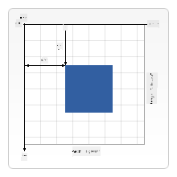

<!--
CO_OP_TRANSLATOR_METADATA:
{
  "original_hash": "41be8d35e7f30aa9dad10773c35e89c4",
  "translation_date": "2025-08-25T22:19:02+00:00",
  "source_file": "6-space-game/2-drawing-to-canvas/README.md",
  "language_code": "it"
}
-->
# Costruire un Gioco Spaziale Parte 2: Disegna Eroe e Mostri sul Canvas

## Quiz Pre-Lettura

[Quiz pre-lettura](https://ashy-river-0debb7803.1.azurestaticapps.net/quiz/31)

## Il Canvas

Il canvas è un elemento HTML che di default non ha contenuto; è una tela bianca. Devi aggiungere contenuti disegnandoci sopra.

✅ Leggi [di più sull'API Canvas](https://developer.mozilla.org/docs/Web/API/Canvas_API) su MDN.

Ecco come viene tipicamente dichiarato, come parte del corpo della pagina:

```html
<canvas id="myCanvas" width="200" height="100"></canvas>
```

Sopra stiamo impostando `id`, `width` e `height`.

- `id`: impostalo per ottenere un riferimento quando devi interagire con esso.
- `width`: questa è la larghezza dell'elemento.
- `height`: questa è l'altezza dell'elemento.

## Disegnare geometrie semplici

Il Canvas utilizza un sistema di coordinate cartesiane per disegnare gli oggetti. Pertanto, utilizza un asse x e un asse y per esprimere dove si trova qualcosa. La posizione `0,0` è l'angolo in alto a sinistra e l'angolo in basso a destra corrisponde alla larghezza e altezza che hai impostato per il canvas.

  
> Immagine da [MDN](https://developer.mozilla.org/docs/Web/API/Canvas_API/Tutorial/Drawing_shapes)

Per disegnare sul canvas, devi seguire i seguenti passaggi:

1. **Ottenere un riferimento** all'elemento Canvas.
1. **Ottenere un riferimento** all'elemento Context che si trova sul canvas.
1. **Eseguire un'operazione di disegno** utilizzando l'elemento Context.

Il codice per i passaggi sopra solitamente appare così:

```javascript
// draws a red rectangle
//1. get the canvas reference
canvas = document.getElementById("myCanvas");

//2. set the context to 2D to draw basic shapes
ctx = canvas.getContext("2d");

//3. fill it with the color red
ctx.fillStyle = 'red';

//4. and draw a rectangle with these parameters, setting location and size
ctx.fillRect(0,0, 200, 200) // x,y,width, height
```

✅ L'API Canvas si concentra principalmente su forme 2D, ma puoi anche disegnare elementi 3D su un sito web; per questo, potresti utilizzare l'[API WebGL](https://developer.mozilla.org/docs/Web/API/WebGL_API).

Puoi disegnare ogni tipo di oggetto con l'API Canvas, come:

- **Forme geometriche**, abbiamo già mostrato come disegnare un rettangolo, ma c'è molto altro che puoi disegnare.
- **Testo**, puoi disegnare un testo con qualsiasi font e colore desideri.
- **Immagini**, puoi disegnare un'immagine basata su un asset come un file .jpg o .png, per esempio.

✅ Prova! Sai come disegnare un rettangolo, riesci a disegnare un cerchio su una pagina? Dai un'occhiata ad alcuni disegni interessanti su Canvas su CodePen. Ecco un [esempio particolarmente impressionante](https://codepen.io/dissimulate/pen/KrAwx).

## Caricare e disegnare un asset immagine

Puoi caricare un asset immagine creando un oggetto `Image` e impostando la sua proprietà `src`. Poi ascolti l'evento `load` per sapere quando è pronto per essere utilizzato. Il codice appare così:

### Caricare un asset

```javascript
const img = new Image();
img.src = 'path/to/my/image.png';
img.onload = () => {
  // image loaded and ready to be used
}
```

### Pattern per caricare un asset

Si consiglia di racchiudere il codice sopra in una struttura come questa, così è più facile da usare e puoi manipolarlo solo quando è completamente caricato:

```javascript
function loadAsset(path) {
  return new Promise((resolve) => {
    const img = new Image();
    img.src = path;
    img.onload = () => {
      // image loaded and ready to be used
      resolve(img);
    }
  })
}

// use like so

async function run() {
  const heroImg = await loadAsset('hero.png')
  const monsterImg = await loadAsset('monster.png')
}

```

Per disegnare gli asset di gioco su uno schermo, il tuo codice apparirà così:

```javascript
async function run() {
  const heroImg = await loadAsset('hero.png')
  const monsterImg = await loadAsset('monster.png')

  canvas = document.getElementById("myCanvas");
  ctx = canvas.getContext("2d");
  ctx.drawImage(heroImg, canvas.width/2,canvas.height/2);
  ctx.drawImage(monsterImg, 0,0);
}
```

## Ora è il momento di iniziare a costruire il tuo gioco

### Cosa costruire

Costruirai una pagina web con un elemento Canvas. Dovrebbe mostrare uno schermo nero `1024*768`. Ti abbiamo fornito due immagini:

- Nave dell'eroe

   

- Mostro 5*5

   

### Passaggi consigliati per iniziare lo sviluppo

Trova i file che sono stati creati per te nella sottocartella `your-work`. Dovrebbe contenere quanto segue:

```bash
-| assets
  -| enemyShip.png
  -| player.png
-| index.html
-| app.js
-| package.json
```

Apri la copia di questa cartella in Visual Studio Code. Devi avere un ambiente di sviluppo locale configurato, preferibilmente con Visual Studio Code con NPM e Node installati. Se non hai `npm` configurato sul tuo computer, [ecco come farlo](https://www.npmjs.com/get-npm).

Avvia il tuo progetto navigando nella cartella `your_work`:

```bash
cd your-work
npm start
```

Quanto sopra avvierà un server HTTP all'indirizzo `http://localhost:5000`. Apri un browser e inserisci quell'indirizzo. È una pagina vuota al momento, ma cambierà.

> Nota: per vedere le modifiche sullo schermo, aggiorna il browser.

### Aggiungi codice

Aggiungi il codice necessario a `your-work/app.js` per risolvere quanto segue:

1. **Disegna** un canvas con sfondo nero  
   > suggerimento: aggiungi due righe sotto il TODO appropriato in `/app.js`, impostando l'elemento `ctx` su nero e le coordinate in alto/sinistra su 0,0 e l'altezza e larghezza uguali a quelle del canvas.
2. **Carica** le texture  
   > suggerimento: aggiungi le immagini del giocatore e del nemico utilizzando `await loadTexture` e passando il percorso dell'immagine. Non le vedrai ancora sullo schermo!
3. **Disegna** l'eroe al centro dello schermo nella metà inferiore  
   > suggerimento: usa l'API `drawImage` per disegnare heroImg sullo schermo, impostando `canvas.width / 2 - 45` e `canvas.height - canvas.height / 4)`.
4. **Disegna** 5*5 mostri  
   > suggerimento: ora puoi decommentare il codice per disegnare i nemici sullo schermo. Successivamente, vai alla funzione `createEnemies` e completala.

   Per prima cosa, imposta alcune costanti:

    ```javascript
    const MONSTER_TOTAL = 5;
    const MONSTER_WIDTH = MONSTER_TOTAL * 98;
    const START_X = (canvas.width - MONSTER_WIDTH) / 2;
    const STOP_X = START_X + MONSTER_WIDTH;
    ```

    poi, crea un ciclo per disegnare l'array di mostri sullo schermo:

    ```javascript
    for (let x = START_X; x < STOP_X; x += 98) {
        for (let y = 0; y < 50 * 5; y += 50) {
          ctx.drawImage(enemyImg, x, y);
        }
      }
    ```

## Risultato

Il risultato finale dovrebbe apparire così:


## Soluzione

Prova a risolverlo da solo prima, ma se ti blocchi, dai un'occhiata a una [soluzione](../../../../6-space-game/2-drawing-to-canvas/solution/app.js).

---

## 🚀 Sfida

Hai imparato a disegnare con l'API Canvas focalizzata sul 2D; dai un'occhiata all'[API WebGL](https://developer.mozilla.org/docs/Web/API/WebGL_API) e prova a disegnare un oggetto 3D.

## Quiz Post-Lettura

[Quiz post-lettura](https://ashy-river-0debb7803.1.azurestaticapps.net/quiz/32)

## Revisione & Studio Autonomo

Scopri di più sull'API Canvas [leggendo a riguardo](https://developer.mozilla.org/docs/Web/API/Canvas_API).

## Compito

[Gioca con l'API Canvas](assignment.md)

**Disclaimer (Avvertenza)**:  
Questo documento è stato tradotto utilizzando il servizio di traduzione automatica [Co-op Translator](https://github.com/Azure/co-op-translator). Sebbene ci impegniamo per garantire l'accuratezza, si prega di notare che le traduzioni automatizzate potrebbero contenere errori o imprecisioni. Il documento originale nella sua lingua nativa dovrebbe essere considerato la fonte autorevole. Per informazioni critiche, si raccomanda una traduzione professionale effettuata da un traduttore umano. Non siamo responsabili per eventuali incomprensioni o interpretazioni errate derivanti dall'uso di questa traduzione.