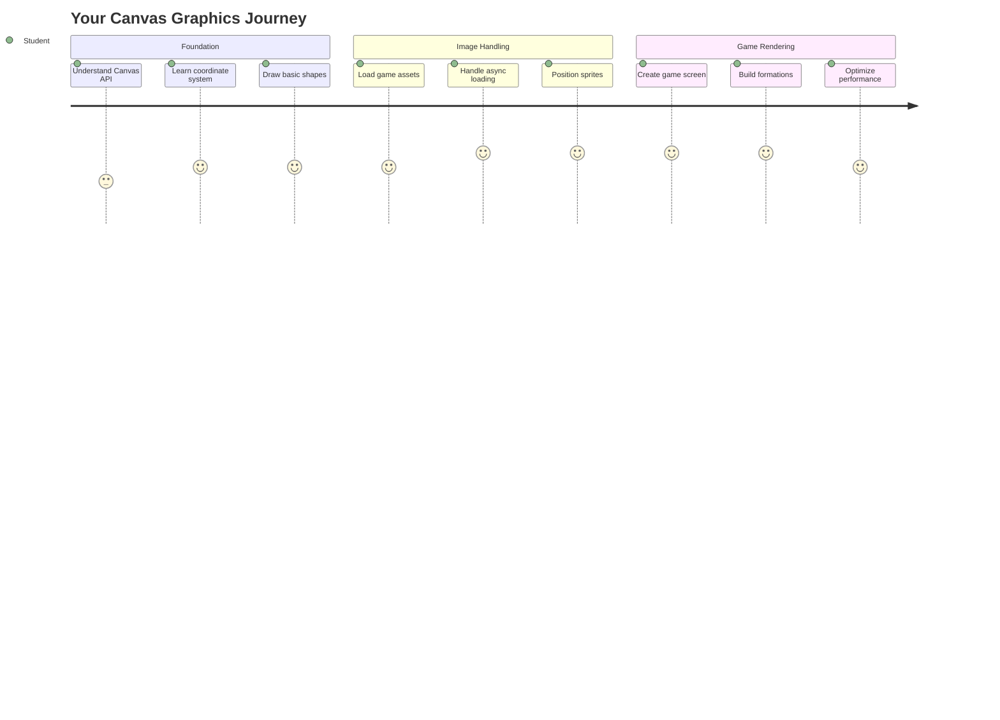
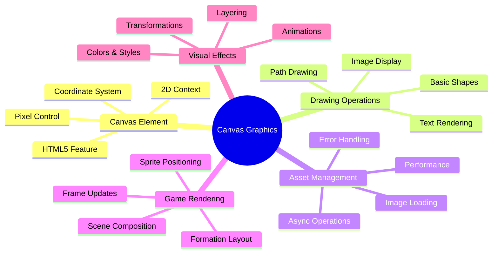
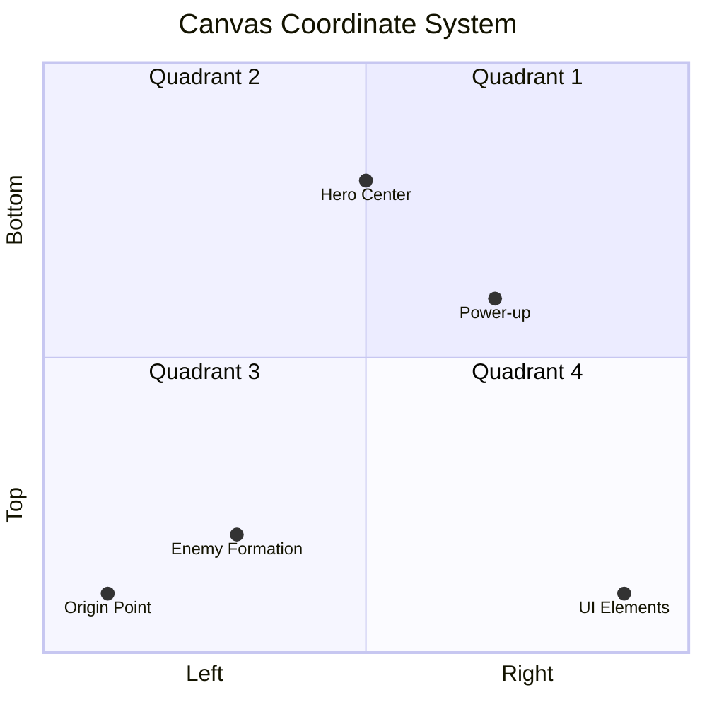
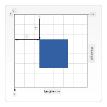
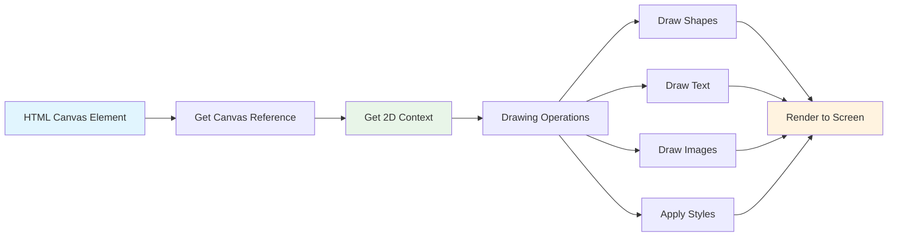
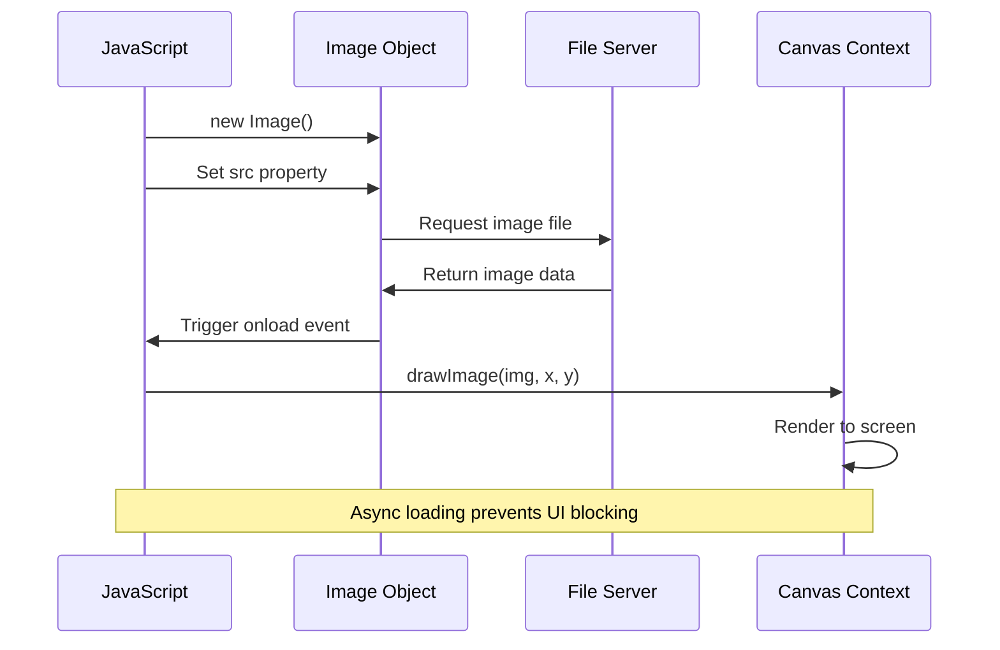
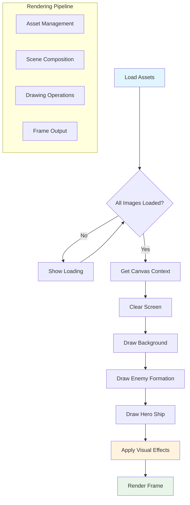
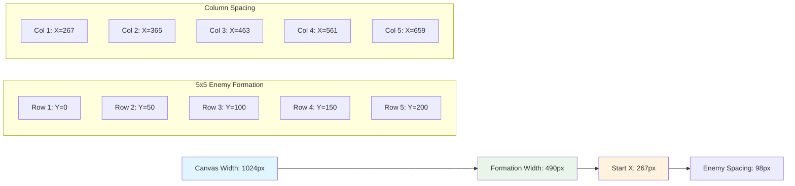
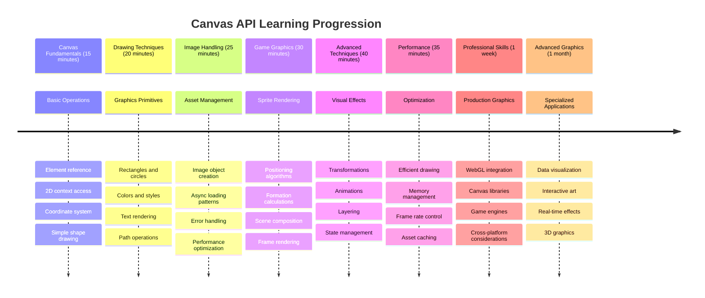

# Costruire un Gioco Spaziale Parte 2: Disegna Eroe e Mostri sul Canvas



L'API Canvas è una delle funzionalità più potenti dello sviluppo web per creare grafica dinamica e interattiva direttamente nel tuo browser. In questa lezione, trasformeremo quell'elemento HTML `<canvas>` vuoto in un mondo di gioco pieno di eroi e mostri. Pensa al canvas come alla tua tavola da disegno digitale dove il codice diventa visivo.

Stiamo costruendo su ciò che hai imparato nella lezione precedente e ora ci immergeremo negli aspetti visivi. Imparerai come caricare e visualizzare gli sprite del gioco, posizionare gli elementi con precisione e creare le basi visive per il tuo gioco spaziale. Questo colma il divario tra pagine web statiche ed esperienze dinamiche e interattive.

Alla fine di questa lezione, avrai una scena di gioco completa con la tua nave eroica posizionata correttamente e le formazioni nemiche pronte per la battaglia. Capirai come i giochi moderni rendono la grafica nei browser e acquisirai le competenze per creare le tue esperienze visive interattive. Esploriamo la grafica del canvas e diamo vita al tuo gioco spaziale!



## Quiz Pre-Lezione

[Quiz pre-lezione](https://ff-quizzes.netlify.app/web/quiz/31)

## Il Canvas

Cos'è esattamente questo elemento `<canvas>`? È la soluzione di HTML5 per creare grafica e animazioni dinamiche nei browser web. A differenza delle immagini o dei video regolari che sono statici, il canvas ti dà il controllo a livello di pixel su tutto ciò che appare sullo schermo. Questo lo rende perfetto per giochi, visualizzazioni di dati e arte interattiva. Pensalo come una superficie di disegno programmabile dove JavaScript diventa il tuo pennello.

Per impostazione predefinita, un elemento canvas appare come un rettangolo vuoto e trasparente sulla tua pagina. Ma è qui che risiede il potenziale! La sua vera potenza emerge quando usi JavaScript per disegnare forme, caricare immagini, creare animazioni e far rispondere le cose alle interazioni dell'utente. È simile a come i pionieri della grafica computerizzata presso Bell Labs negli anni '60 dovevano programmare ogni pixel per creare le prime animazioni digitali.

✅ Leggi [di più sull'API Canvas](https://developer.mozilla.org/docs/Web/API/Canvas_API) su MDN.

Ecco come viene tipicamente dichiarato, come parte del corpo della pagina:

```html
<canvas id="myCanvas" width="200" height="100"></canvas>
```

**Ecco cosa fa questo codice:**
- **Imposta** l'attributo `id` in modo da poter fare riferimento a questo specifico elemento canvas in JavaScript
- **Definisce** la `width` in pixel per controllare la dimensione orizzontale del canvas
- **Stabilisce** la `height` in pixel per determinare le dimensioni verticali del canvas

## Disegnare Geometria Semplice

Ora che sai cos'è l'elemento canvas, esploriamo il disegno effettivo su di esso! Il canvas utilizza un sistema di coordinate che potrebbe sembrare familiare dalle lezioni di matematica, ma c'è una svolta importante specifica per la grafica computerizzata.

Il canvas utilizza coordinate cartesiane con un asse x (orizzontale) e un asse y (verticale) per posizionare tutto ciò che disegni. Ma ecco la differenza chiave: a differenza del sistema di coordinate della matematica, il punto di origine `(0,0)` inizia nell'angolo in alto a sinistra, con i valori x che aumentano man mano che ti sposti a destra e i valori y che aumentano man mano che ti sposti verso il basso. Questo approccio risale ai primi display dei computer dove i fasci di elettroni scansionavano dall'alto verso il basso, rendendo l'angolo in alto a sinistra il punto di partenza naturale.




> Immagine da [MDN](https://developer.mozilla.org/docs/Web/API/Canvas_API/Tutorial/Drawing_shapes)

Per disegnare sull'elemento canvas, seguirai lo stesso processo in tre fasi che forma la base di tutta la grafica del canvas. Una volta fatto alcune volte, diventa naturale:



1. **Ottieni un riferimento** al tuo elemento Canvas dal DOM (proprio come qualsiasi altro elemento HTML)
2. **Ottieni il contesto di rendering 2D** – questo fornisce tutti i metodi di disegno
3. **Inizia a disegnare!** Usa i metodi integrati del contesto per creare la tua grafica

Ecco come appare in codice:

```javascript
// Step 1: Get the canvas element
const canvas = document.getElementById("myCanvas");

// Step 2: Get the 2D rendering context
const ctx = canvas.getContext("2d");

// Step 3: Set fill color and draw a rectangle
ctx.fillStyle = 'red';
ctx.fillRect(0, 0, 200, 200); // x, y, width, height
```

**Analizziamo questo passaggio per passaggio:**
- **Prendiamo** il nostro elemento canvas usando il suo ID e lo memorizziamo in una variabile
- **Otteniamo** il contesto di rendering 2D – questo è il nostro kit di strumenti pieno di metodi di disegno
- **Diciamo** al canvas che vogliamo riempire le cose di rosso usando la proprietà `fillStyle`
- **Disegniamo** un rettangolo che parte dall'angolo in alto a sinistra (0,0) largo e alto 200 pixel

✅ L'API Canvas si concentra principalmente su forme 2D, ma puoi anche disegnare elementi 3D su un sito web; per questo, potresti usare l'[API WebGL](https://developer.mozilla.org/docs/Web/API/WebGL_API).

Puoi disegnare ogni tipo di cosa con l'API Canvas come:

- **Forme geometriche**, abbiamo già mostrato come disegnare un rettangolo, ma c'è molto altro che puoi disegnare.
- **Testo**, puoi disegnare un testo con qualsiasi font e colore desideri.
- **Immagini**, puoi disegnare un'immagine basata su un asset immagine come un .jpg o .png per esempio.

✅ Prova! Sai come disegnare un rettangolo, riesci a disegnare un cerchio su una pagina? Dai un'occhiata ad alcuni disegni interessanti su Canvas su CodePen. Ecco un [esempio particolarmente impressionante](https://codepen.io/dissimulate/pen/KrAwx).

### 🔄 **Verifica Pedagogica**
**Comprensione dei Fondamenti del Canvas**: Prima di passare al caricamento delle immagini, assicurati di poter:
- ✅ Spiegare come il sistema di coordinate del canvas differisce dalle coordinate matematiche
- ✅ Comprendere il processo in tre fasi per le operazioni di disegno sul canvas
- ✅ Identificare cosa fornisce il contesto di rendering 2D
- ✅ Descrivere come `fillStyle` e `fillRect` lavorano insieme

**Auto-Test Rapido**: Come disegneresti un cerchio blu alla posizione (100, 50) con raggio 25?
```javascript
ctx.fillStyle = 'blue';
ctx.beginPath();
ctx.arc(100, 50, 25, 0, 2 * Math.PI);
ctx.fill();
```

**Metodi di Disegno sul Canvas che Ora Conosci**:
- **fillRect()**: Disegna rettangoli pieni
- **fillStyle**: Imposta colori e motivi
- **beginPath()**: Inizia nuovi percorsi di disegno
- **arc()**: Crea cerchi e curve

## Caricare e Disegnare un Asset Immagine

Disegnare forme di base è utile per iniziare, ma la maggior parte dei giochi necessita di immagini reali! Sprite, sfondi e texture sono ciò che dà ai giochi il loro fascino visivo. Caricare e visualizzare immagini sul canvas funziona in modo diverso rispetto al disegno di forme geometriche, ma è semplice una volta compreso il processo.

Dobbiamo creare un oggetto `Image`, caricare il nostro file immagine (questo avviene in modo asincrono, cioè "in background"), e poi disegnarlo sul canvas una volta pronto. Questo approccio garantisce che le tue immagini vengano visualizzate correttamente senza bloccare la tua applicazione durante il caricamento.



### Caricamento Base delle Immagini

```javascript
const img = new Image();
img.src = 'path/to/my/image.png';
img.onload = () => {
  // Image loaded and ready to be used
  console.log('Image loaded successfully!');
};
```

**Ecco cosa succede in questo codice:**
- **Creiamo** un nuovo oggetto Image per contenere il nostro sprite o texture
- **Indichiamo** quale file immagine caricare impostando il percorso della sorgente
- **Ascoltiamo** l'evento di caricamento per sapere esattamente quando l'immagine è pronta per essere utilizzata

### Un Modo Migliore per Caricare Immagini

Ecco un modo più robusto per gestire il caricamento delle immagini che gli sviluppatori professionisti usano comunemente. Avvolgeremo il caricamento delle immagini in una funzione basata su Promise – questo approccio, reso popolare quando le Promesse JavaScript sono diventate standard in ES6, rende il tuo codice più organizzato e gestisce gli errori in modo elegante:

```javascript
function loadAsset(path) {
  return new Promise((resolve, reject) => {
    const img = new Image();
    img.src = path;
    img.onload = () => {
      resolve(img);
    };
    img.onerror = () => {
      reject(new Error(`Failed to load image: ${path}`));
    };
  });
}

// Modern usage with async/await
async function initializeGame() {
  try {
    const heroImg = await loadAsset('hero.png');
    const monsterImg = await loadAsset('monster.png');
    // Images are now ready to use
  } catch (error) {
    console.error('Failed to load game assets:', error);
  }
}
```

**Cosa abbiamo fatto qui:**
- **Avvolto** tutta la logica di caricamento delle immagini in una Promise per gestirla meglio
- **Aggiunto** la gestione degli errori che ci dice effettivamente quando qualcosa va storto
- **Usato** la sintassi moderna async/await perché è molto più leggibile
- **Incluso** blocchi try/catch per gestire con eleganza eventuali problemi di caricamento

Una volta caricate le immagini, disegnarle sul canvas è in realtà piuttosto semplice:

```javascript
async function renderGameScreen() {
  try {
    // Load game assets
    const heroImg = await loadAsset('hero.png');
    const monsterImg = await loadAsset('monster.png');

    // Get canvas and context
    const canvas = document.getElementById("myCanvas");
    const ctx = canvas.getContext("2d");

    // Draw images to specific positions
    ctx.drawImage(heroImg, canvas.width / 2, canvas.height / 2);
    ctx.drawImage(monsterImg, 0, 0);
  } catch (error) {
    console.error('Failed to render game screen:', error);
  }
}
```

**Analizziamo questo passaggio per passaggio:**
- **Carichiamo** sia le immagini dell'eroe che dei mostri in background usando await
- **Prendiamo** il nostro elemento canvas e otteniamo quel contesto di rendering 2D di cui abbiamo bisogno
- **Posizioniamo** l'immagine dell'eroe proprio al centro usando un po' di matematica veloce sulle coordinate
- **Mettiamo** l'immagine del mostro nell'angolo in alto a sinistra per iniziare la nostra formazione nemica
- **Gestiamo** eventuali errori che potrebbero verificarsi durante il caricamento o il rendering



## Ora è il Momento di Iniziare a Costruire il Tuo Gioco

Ora metteremo tutto insieme per creare le basi visive del tuo gioco spaziale. Hai una solida comprensione dei fondamenti del canvas e delle tecniche di caricamento delle immagini, quindi questa sezione pratica ti guiderà nella costruzione di uno schermo di gioco completo con sprite posizionati correttamente.

### Cosa Costruire

Creerai una pagina web con un elemento Canvas. Dovrebbe rendere uno schermo nero `1024*768`. Ti abbiamo fornito due immagini:

- Nave eroica

   

- 5*5 mostri

   

### Passaggi Consigliati per Iniziare lo Sviluppo

Trova i file di partenza che sono stati creati per te nella sottocartella `your-work`. La struttura del tuo progetto dovrebbe contenere:

```bash
your-work/
├── assets/
│   ├── enemyShip.png
│   └── player.png
├── index.html
├── app.js
└── package.json
```

**Ecco con cosa stai lavorando:**
- **Sprite di gioco** si trovano nella cartella `assets/` così tutto rimane organizzato
- **Il tuo file HTML principale** configura l'elemento canvas e prepara tutto
- **Un file JavaScript** dove scriverai tutta la magia del rendering del gioco
- **Un package.json** che configura un server di sviluppo per testare localmente

Apri questa cartella in Visual Studio Code per iniziare lo sviluppo. Avrai bisogno di un ambiente di sviluppo locale con Visual Studio Code, NPM e Node.js installati. Se non hai `npm` configurato sul tuo computer, [ecco come installarlo](https://www.npmjs.com/get-npm).

Avvia il tuo server di sviluppo navigando nella cartella `your-work`:

```bash
cd your-work
npm start
```

**Questo comando fa alcune cose piuttosto interessanti:**
- **Avvia** un server locale su `http://localhost:5000` così puoi testare il tuo gioco
- **Serve** correttamente tutti i tuoi file così il browser può caricarli
- **Osserva** i tuoi file per modifiche così puoi sviluppare senza problemi
- **Ti offre** un ambiente di sviluppo professionale per testare tutto

> 💡 **Nota**: Il tuo browser mostrerà inizialmente una pagina vuota – è normale! Man mano che aggiungi codice, aggiorna il browser per vedere le modifiche. Questo approccio di sviluppo iterativo è simile a come la NASA ha costruito il computer di guida Apollo – testando ogni componente prima di integrarlo nel sistema più grande.

### Aggiungi codice

Aggiungi il codice richiesto a `your-work/app.js` per completare i seguenti compiti:

1. **Disegna un canvas con sfondo nero**
   > 💡 **Ecco come**: Trova il TODO in `/app.js` e aggiungi solo due righe. Imposta `ctx.fillStyle` su nero, poi usa `ctx.fillRect()` partendo da (0,0) con le dimensioni del tuo canvas. Facile!

2. **Carica le texture di gioco**
   > 💡 **Ecco come**: Usa `await loadAsset()` per caricare le immagini del giocatore e del nemico. Memorizzale in variabili così puoi usarle più tardi. Ricorda – non appariranno finché non le disegni effettivamente!

3. **Disegna la nave eroica nella posizione centrale-inferiore**
   > 💡 **Ecco come**: Usa `ctx.drawImage()` per posizionare il tuo eroe. Per la coordinata x, prova `canvas.width / 2 - 45` per centrarlo, e per la coordinata y usa `canvas.height - canvas.height / 4` per metterlo nell'area inferiore.

4. **Disegna una formazione 5×5 di navi nemiche**
   > 💡 **Ecco come**: Trova la funzione `createEnemies` e configura un ciclo annidato. Dovrai fare un po' di matematica per spaziatura e posizionamento, ma non preoccuparti – ti mostrerò esattamente come!

Per prima cosa, stabilisci costanti per un layout di formazione nemica corretto:

```javascript
const ENEMY_TOTAL = 5;
const ENEMY_SPACING = 98;
const FORMATION_WIDTH = ENEMY_TOTAL * ENEMY_SPACING;
const START_X = (canvas.width - FORMATION_WIDTH) / 2;
const STOP_X = START_X + FORMATION_WIDTH;
```

**Analizziamo cosa fanno queste costanti:**
- **Impostiamo** 5 nemici per riga e colonna (una bella griglia 5×5)
- **Definiamo** quanto spazio mettere tra i nemici così non sembrano ammassati
- **Calcoliamo** quanto sarà larga tutta la formazione
- **Determiniamo** dove iniziare e finire così la formazione sembra centrata



Poi, crea cicli annidati per disegnare la formazione nemica:

```javascript
for (let x = START_X; x < STOP_X; x += ENEMY_SPACING) {
  for (let y = 0; y < 50 * 5; y += 50) {
    ctx.drawImage(enemyImg, x, y);
  }
}
```

**Ecco cosa fa questo ciclo annidato:**
- Il ciclo esterno **si muove** da sinistra a destra attraverso la nostra formazione
- Il ciclo interno **va** dall'alto verso il basso per creare righe ordinate
- **Disegniamo** ogni sprite nemico alle coordinate x,y esatte che abbiamo calcolato
- Tutto rimane **spaziato uniformemente** così sembra professionale e organizzato

### 🔄 **Verifica Pedagogica**
**Padronanza del Rendering del Gioco**: Verifica la tua comprensione del sistema di rendering completo:
- ✅ Come il caricamento asincrono delle immagini previene il blocco dell'interfaccia utente durante l'avvio del gioco?
- ✅ Perché calcoliamo le posizioni della formazione nemica usando costanti invece di codificarle?
- ✅ Qual è il ruolo del contesto di rendering 2D nelle operazioni di disegno?
- ✅ Come i cicli annidati creano formazioni di sprite organizzate?

**Considerazioni sulle Prestazioni**: Il tuo gioco ora dimostra:
- **Caricamento efficiente degli asset**: Gestione delle immagini basata su Promise
- **Rendering organizzato**: Operazioni di disegno strutturate
- **Posizionamento matematico**: Posizionamento calcolato degli sprite
- **Gestione degli errori**: Gestione elegante dei fallimenti

**Concetti di Programmazione Visiva**: Hai imparato:
- **Sistemi di coordinate**: Tradurre la matematica in posizioni sullo schermo  
- **Gestione degli sprite**: Caricare e visualizzare la grafica del gioco  
- **Algoritmi di formazione**: Schemi matematici per layout organizzati  
- **Operazioni asincrone**: JavaScript moderno per un'esperienza utente fluida  

## Risultato  

Il risultato finale dovrebbe apparire così:  

  

## Soluzione  

Prova a risolverlo da solo prima, ma se ti blocchi, dai un'occhiata a una [soluzione](../../../../6-space-game/2-drawing-to-canvas/solution/app.js)  

---  

## Sfida GitHub Copilot Agent 🚀  

Usa la modalità Agent per completare la seguente sfida:  

**Descrizione:** Migliora il canvas del tuo gioco spaziale aggiungendo effetti visivi ed elementi interattivi utilizzando le tecniche dell'API Canvas che hai imparato.  

**Prompt:** Crea un nuovo file chiamato `enhanced-canvas.html` con un canvas che mostra stelle animate sullo sfondo, una barra della salute pulsante per la nave dell'eroe e navi nemiche che si muovono lentamente verso il basso. Includi codice JavaScript che disegna stelle scintillanti usando posizioni e opacità casuali, implementa una barra della salute che cambia colore in base al livello di salute (verde > giallo > rosso) e anima le navi nemiche per farle muovere verso il basso a velocità diverse.  

Scopri di più sulla [modalità agent](https://code.visualstudio.com/blogs/2025/02/24/introducing-copilot-agent-mode) qui.  

## 🚀 Sfida  

Hai imparato a disegnare con l'API Canvas 2D; dai un'occhiata all'[API WebGL](https://developer.mozilla.org/docs/Web/API/WebGL_API) e prova a disegnare un oggetto 3D.  

## Quiz post-lezione  

[Quiz post-lezione](https://ff-quizzes.netlify.app/web/quiz/32)  

## Revisione e studio autonomo  

Scopri di più sull'API Canvas [leggendo qui](https://developer.mozilla.org/docs/Web/API/Canvas_API).  

### ⚡ **Cosa puoi fare nei prossimi 5 minuti**  
- [ ] Apri la console del browser e crea un elemento canvas con `document.createElement('canvas')`  
- [ ] Prova a disegnare un rettangolo usando `fillRect()` su un contesto canvas  
- [ ] Sperimenta con colori diversi usando la proprietà `fillStyle`  
- [ ] Disegna un semplice cerchio usando il metodo `arc()`  

### 🎯 **Cosa puoi realizzare in quest'ora**  
- [ ] Completa il quiz post-lezione e comprendi i fondamenti del canvas  
- [ ] Crea un'applicazione di disegno su canvas con forme e colori multipli  
- [ ] Implementa il caricamento delle immagini e il rendering degli sprite per il tuo gioco  
- [ ] Costruisci una semplice animazione che muove oggetti attraverso il canvas  
- [ ] Pratica le trasformazioni del canvas come scalatura, rotazione e traslazione  

### 📅 **Il tuo viaggio settimanale con il Canvas**  
- [ ] Completa il gioco spaziale con grafica raffinata e animazioni degli sprite  
- [ ] Padroneggia tecniche avanzate del canvas come gradienti, pattern e compositing  
- [ ] Crea visualizzazioni interattive usando il canvas per rappresentare dati  
- [ ] Impara tecniche di ottimizzazione del canvas per prestazioni fluide  
- [ ] Costruisci un'applicazione di disegno o pittura con vari strumenti  
- [ ] Esplora modelli di codifica creativa e arte generativa con il canvas  

### 🌟 **La tua maestria grafica mensile**  
- [ ] Costruisci applicazioni visive complesse usando Canvas 2D e WebGL  
- [ ] Impara concetti di programmazione grafica e basi degli shader  
- [ ] Contribuisci a librerie grafiche open source e strumenti di visualizzazione  
- [ ] Padroneggia l'ottimizzazione delle prestazioni per applicazioni grafiche intensive  
- [ ] Crea contenuti educativi sulla programmazione del canvas e la grafica computerizzata  
- [ ] Diventa un esperto di programmazione grafica che aiuta gli altri a creare esperienze visive  

## 🎯 La tua timeline di maestria grafica con il Canvas  


  
### 🛠️ Riepilogo del tuo toolkit grafico con il Canvas  

Dopo aver completato questa lezione, ora hai:  
- **Maestria nell'API Canvas**: Comprensione completa della programmazione grafica 2D  
- **Matematica delle coordinate**: Posizionamento preciso e algoritmi di layout  
- **Gestione delle risorse**: Caricamento professionale delle immagini e gestione degli errori  
- **Pipeline di rendering**: Approccio strutturato alla composizione delle scene  
- **Grafica di gioco**: Posizionamento degli sprite e calcoli di formazione  
- **Programmazione asincrona**: Modelli JavaScript moderni per prestazioni fluide  
- **Programmazione visiva**: Traduzione di concetti matematici in grafica sullo schermo  

**Applicazioni reali**: Le tue competenze con il Canvas si applicano direttamente a:  
- **Visualizzazione dei dati**: Grafici, diagrammi e dashboard interattivi  
- **Sviluppo di giochi**: Giochi 2D, simulazioni ed esperienze interattive  
- **Arte digitale**: Progetti di codifica creativa e arte generativa  
- **Design UI/UX**: Grafica personalizzata ed elementi interattivi  
- **Software educativo**: Strumenti di apprendimento visivo e simulazioni  
- **Applicazioni web**: Grafica dinamica e visualizzazioni in tempo reale  

**Competenze professionali acquisite**: Ora puoi:  
- **Costruire** soluzioni grafiche personalizzate senza librerie esterne  
- **Ottimizzare** le prestazioni di rendering per esperienze utente fluide  
- **Debuggare** problemi visivi complessi usando gli strumenti di sviluppo del browser  
- **Progettare** sistemi grafici scalabili usando principi matematici  
- **Integrare** la grafica del Canvas con framework moderni per applicazioni web  

**Metodi dell'API Canvas che hai padroneggiato**:  
- **Gestione degli elementi**: getElementById, getContext  
- **Operazioni di disegno**: fillRect, drawImage, fillStyle  
- **Caricamento delle risorse**: Oggetti immagine, modelli Promise  
- **Posizionamento matematico**: Calcoli delle coordinate, algoritmi di formazione  

**Livello successivo**: Sei pronto per aggiungere animazioni, interazioni utente, rilevamento delle collisioni o esplorare WebGL per la grafica 3D!  

🌟 **Obiettivo raggiunto**: Hai costruito un sistema completo di rendering per giochi utilizzando le tecniche fondamentali dell'API Canvas!  

## Compito  

[Gioca con l'API Canvas](assignment.md)  

---

**Disclaimer**:  
Questo documento è stato tradotto utilizzando il servizio di traduzione AI [Co-op Translator](https://github.com/Azure/co-op-translator). Sebbene ci impegniamo per garantire l'accuratezza, si prega di notare che le traduzioni automatiche potrebbero contenere errori o imprecisioni. Il documento originale nella sua lingua nativa dovrebbe essere considerato la fonte autorevole. Per informazioni critiche, si consiglia una traduzione professionale umana. Non siamo responsabili per eventuali incomprensioni o interpretazioni errate derivanti dall'uso di questa traduzione.