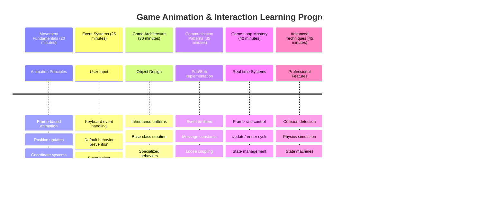

<!--
CO_OP_TRANSLATOR_METADATA:
{
  "original_hash": "8c55a2bd4bc0ebe4c88198fd563a9e09",
  "translation_date": "2025-11-04T00:34:50+00:00",
  "source_file": "6-space-game/3-moving-elements-around/README.md",
  "language_code": "it"
}
-->
# Costruire un Gioco Spaziale Parte 3: Aggiungere Movimento


Pensa ai tuoi giochi preferiti – ciò che li rende coinvolgenti non sono solo le belle grafiche, ma il modo in cui tutto si muove e risponde alle tue azioni. Al momento, il tuo gioco spaziale è come un bel dipinto, ma stiamo per aggiungere movimento che lo farà prendere vita.

Quando gli ingegneri della NASA hanno programmato il computer di guida per le missioni Apollo, hanno affrontato una sfida simile: come far rispondere una navicella spaziale ai comandi del pilota mantenendo automaticamente le correzioni di rotta? I principi che impareremo oggi riecheggiano quegli stessi concetti – gestire il movimento controllato dal giocatore insieme ai comportamenti automatici del sistema.

In questa lezione, imparerai come far scivolare le astronavi sullo schermo, rispondere ai comandi del giocatore e creare schemi di movimento fluidi. Suddivideremo tutto in concetti gestibili che si costruiscono naturalmente l'uno sull'altro.

Alla fine, i giocatori potranno far volare la loro nave eroica sullo schermo mentre le navi nemiche pattugliano sopra. Ancora più importante, comprenderai i principi fondamentali che alimentano i sistemi di movimento nei giochi.


## Quiz Pre-Lettura

[Quiz pre-lettura](https://ff-quizzes.netlify.app/web/quiz/33)

## Comprendere il Movimento nei Giochi

I giochi prendono vita quando le cose iniziano a muoversi, e ci sono fondamentalmente due modi in cui ciò accade:

- **Movimento controllato dal giocatore**: Quando premi un tasto o clicchi con il mouse, qualcosa si muove. Questo è il collegamento diretto tra te e il mondo del gioco.
- **Movimento automatico**: Quando il gioco stesso decide di muovere le cose – come quelle navi nemiche che devono pattugliare lo schermo indipendentemente da ciò che fai.

Far muovere gli oggetti su uno schermo di computer è più semplice di quanto pensi. Ricordi quelle coordinate x e y delle lezioni di matematica? È esattamente ciò con cui stiamo lavorando qui. Quando Galileo ha tracciato le lune di Giove nel 1610, stava essenzialmente facendo la stessa cosa – tracciando posizioni nel tempo per comprendere i modelli di movimento.

Muovere le cose sullo schermo è come creare un'animazione a flipbook – devi seguire questi tre semplici passaggi:


1. **Aggiornare la posizione** – Cambiare dove dovrebbe essere il tuo oggetto (magari spostarlo di 5 pixel a destra)
2. **Cancellare il vecchio frame** – Pulire lo schermo per evitare di vedere scie fantasma ovunque
3. **Disegnare il nuovo frame** – Posizionare il tuo oggetto nel suo nuovo punto

Fallo abbastanza velocemente, e boom! Hai un movimento fluido che sembra naturale ai giocatori.

Ecco come potrebbe apparire nel codice:

```javascript
// Set the hero's location
hero.x += 5;
// Clear the rectangle that hosts the hero
ctx.clearRect(0, 0, canvas.width, canvas.height);
// Redraw the game background and hero
ctx.fillRect(0, 0, canvas.width, canvas.height);
ctx.fillStyle = "black";
ctx.drawImage(heroImg, hero.x, hero.y);
```

**Cosa fa questo codice:**
- **Aggiorna** la coordinata x dell'eroe di 5 pixel per spostarlo orizzontalmente
- **Cancella** l'intera area del canvas per rimuovere il frame precedente
- **Riempie** il canvas con un colore di sfondo nero
- **Ridisegna** l'immagine dell'eroe nella sua nuova posizione

✅ Riesci a pensare a un motivo per cui ridisegnare il tuo eroe molti frame al secondo potrebbe comportare costi di prestazioni? Leggi di più su [alternative a questo modello](https://developer.mozilla.org/en-US/docs/Web/API/Canvas_API/Tutorial/Optimizing_canvas).

## Gestire gli eventi della tastiera

Qui è dove colleghiamo l'input del giocatore all'azione del gioco. Quando qualcuno preme la barra spaziatrice per sparare un laser o tocca una freccia per schivare un asteroide, il tuo gioco deve rilevare e rispondere a quell'input.

Gli eventi della tastiera avvengono a livello di finestra, il che significa che l'intera finestra del browser sta ascoltando quelle pressioni di tasti. I clic del mouse, invece, possono essere legati a elementi specifici (come cliccare un pulsante). Per il nostro gioco spaziale, ci concentreremo sui controlli della tastiera poiché è ciò che dà ai giocatori quella classica sensazione da sala giochi.

Questo mi ricorda come gli operatori del telegrafo nel 1800 dovevano tradurre l'input del codice Morse in messaggi significativi – stiamo facendo qualcosa di simile, traducendo le pressioni dei tasti in comandi di gioco.

Per gestire un evento, devi usare il metodo `addEventListener()` della finestra e fornire due parametri di input. Il primo parametro è il nome dell'evento, ad esempio `keyup`. Il secondo parametro è la funzione che dovrebbe essere invocata come risultato dell'evento.

Ecco un esempio:

```javascript
window.addEventListener('keyup', (evt) => {
  // evt.key = string representation of the key
  if (evt.key === 'ArrowUp') {
    // do something
  }
});
```

**Analisi di ciò che accade qui:**
- **Ascolta** gli eventi della tastiera sull'intera finestra
- **Cattura** l'oggetto evento che contiene informazioni su quale tasto è stato premuto
- **Controlla** se il tasto premuto corrisponde a un tasto specifico (in questo caso, la freccia su)
- **Esegue** il codice quando la condizione è soddisfatta

Per gli eventi dei tasti ci sono due proprietà sull'evento che puoi usare per vedere quale tasto è stato premuto:

- `key` - questa è una rappresentazione stringa del tasto premuto, ad esempio `'ArrowUp'`
- `keyCode` - questa è una rappresentazione numerica, ad esempio `37`, corrisponde a `ArrowLeft`

✅ La manipolazione degli eventi dei tasti è utile anche al di fuori dello sviluppo di giochi. Quali altri usi puoi immaginare per questa tecnica?


### Tasti speciali: attenzione!

Alcuni tasti hanno comportamenti integrati nel browser che possono interferire con il tuo gioco. Le frecce scorrono la pagina e la barra spaziatrice salta in basso – comportamenti che non vuoi quando qualcuno sta cercando di pilotare la sua navicella.

Possiamo prevenire questi comportamenti predefiniti e lasciare che il nostro gioco gestisca l'input. Questo è simile a come i primi programmatori di computer dovevano sovrascrivere gli interrupt di sistema per creare comportamenti personalizzati – lo stiamo facendo a livello di browser. Ecco come:

```javascript
const onKeyDown = function (e) {
  console.log(e.keyCode);
  switch (e.keyCode) {
    case 37:
    case 39:
    case 38:
    case 40: // Arrow keys
    case 32:
      e.preventDefault();
      break; // Space
    default:
      break; // do not block other keys
  }
};

window.addEventListener('keydown', onKeyDown);
```

**Comprendere questo codice di prevenzione:**
- **Controlla** codici di tasti specifici che potrebbero causare comportamenti indesiderati del browser
- **Previene** l'azione predefinita del browser per le frecce e la barra spaziatrice
- **Permette** agli altri tasti di funzionare normalmente
- **Usa** `e.preventDefault()` per fermare il comportamento integrato del browser

### 🔄 **Verifica Pedagogica**
**Comprensione della gestione degli eventi**: Prima di passare al movimento automatico, assicurati di poter:
- ✅ Spiegare la differenza tra gli eventi `keydown` e `keyup`
- ✅ Comprendere perché preveniamo i comportamenti predefiniti del browser
- ✅ Descrivere come i listener di eventi collegano l'input dell'utente alla logica del gioco
- ✅ Identificare quali tasti potrebbero interferire con i controlli del gioco

**Auto-Test Rapido**: Cosa accadrebbe se non prevenissi il comportamento predefinito per le frecce?
*Risposta: Il browser scorrerebbe la pagina, interferendo con il movimento del gioco*

**Architettura del Sistema di Eventi**: Ora comprendi:
- **Ascolto a livello di finestra**: Catturare eventi a livello di browser
- **Proprietà dell'oggetto evento**: stringhe `key` vs numeri `keyCode`
- **Prevenzione predefinita**: Fermare comportamenti indesiderati del browser
- **Logica condizionale**: Rispondere a combinazioni di tasti specifiche

## Movimento indotto dal gioco

Ora parliamo di oggetti che si muovono senza input del giocatore. Pensa alle navi nemiche che attraversano lo schermo, ai proiettili che volano in linea retta o alle nuvole che si spostano sullo sfondo. Questo movimento autonomo fa sembrare il tuo mondo di gioco vivo anche quando nessuno tocca i controlli.

Usiamo i timer integrati di JavaScript per aggiornare le posizioni a intervalli regolari. Questo concetto è simile a come funzionano gli orologi a pendolo – un meccanismo regolare che attiva azioni temporizzate costanti. Ecco quanto può essere semplice:

```javascript
const id = setInterval(() => {
  // Move the enemy on the y axis
  enemy.y += 10;
}, 100);
```

**Cosa fa questo codice di movimento:**
- **Crea** un timer che si attiva ogni 100 millisecondi
- **Aggiorna** la coordinata y del nemico di 10 pixel ogni volta
- **Memorizza** l'ID dell'intervallo per poterlo fermare in seguito, se necessario
- **Muove** automaticamente il nemico verso il basso sullo schermo

## Il ciclo del gioco

Ecco il concetto che lega tutto insieme – il ciclo del gioco. Se il tuo gioco fosse un film, il ciclo del gioco sarebbe il proiettore, mostrando frame dopo frame così velocemente che tutto sembra muoversi fluidamente.

Ogni gioco ha uno di questi cicli che gira dietro le quinte. È una funzione che aggiorna tutti gli oggetti del gioco, ridisegna lo schermo e ripete questo processo continuamente. Tiene traccia del tuo eroe, di tutti i nemici, di eventuali laser che volano in giro – l'intero stato del gioco.

Questo concetto mi ricorda come i primi animatori cinematografici come Walt Disney dovevano ridisegnare i personaggi frame per frame per creare l'illusione del movimento. Stiamo facendo la stessa cosa, solo con il codice invece che con le matite.

Ecco come potrebbe apparire un ciclo del gioco, espresso in codice:


```javascript
const gameLoopId = setInterval(() => {
  function gameLoop() {
    ctx.clearRect(0, 0, canvas.width, canvas.height);
    ctx.fillStyle = "black";
    ctx.fillRect(0, 0, canvas.width, canvas.height);
    drawHero();
    drawEnemies();
    drawStaticObjects();
  }
  gameLoop();
}, 200);
```

**Comprendere la struttura del ciclo del gioco:**
- **Cancella** l'intero canvas per rimuovere il frame precedente
- **Riempie** lo sfondo con un colore solido
- **Disegna** tutti gli oggetti del gioco nelle loro posizioni attuali
- **Ripete** questo processo ogni 200 millisecondi per creare un'animazione fluida
- **Gestisce** il frame rate controllando il tempo dell'intervallo

## Continuare il Gioco Spaziale

Ora aggiungeremo movimento alla scena statica che hai costruito in precedenza. La trasformeremo da uno screenshot a un'esperienza interattiva. Lavoreremo passo dopo passo per garantire che ogni pezzo si costruisca sul precedente.

Prendi il codice da dove ci siamo fermati nella lezione precedente (o inizia con il codice nella cartella [Part II- starter](../../../../6-space-game/3-moving-elements-around/your-work) se hai bisogno di un nuovo inizio).

**Ecco cosa costruiremo oggi:**
- **Controlli dell'eroe**: Le frecce piloteranno la tua navicella sullo schermo
- **Movimento dei nemici**: Quelle navi aliene inizieranno il loro avanzamento

Iniziamo a implementare queste funzionalità.

## Passaggi consigliati

Trova i file che sono stati creati per te nella sottocartella `your-work`. Dovrebbe contenere quanto segue:

```bash
-| assets
  -| enemyShip.png
  -| player.png
-| index.html
-| app.js
-| package.json
```

Inizia il tuo progetto nella cartella `your-work` digitando:

```bash
cd your-work
npm start
```

**Cosa fa questo comando:**
- **Naviga** nella directory del tuo progetto
- **Avvia** un server HTTP all'indirizzo `http://localhost:5000`
- **Serve** i file del tuo gioco in modo che tu possa testarli in un browser

Quanto sopra avvierà un server HTTP all'indirizzo `http://localhost:5000`. Apri un browser e inserisci quell'indirizzo, al momento dovrebbe visualizzare l'eroe e tutti i nemici; nulla si muove – ancora!

### Aggiungi codice

1. **Aggiungi oggetti dedicati** per `hero`, `enemy` e `game object`, dovrebbero avere proprietà `x` e `y`. (Ricorda la parte su [Ereditarietà o composizione](../README.md)).

   *SUGGERIMENTO* `game object` dovrebbe essere quello con `x` e `y` e la capacità di disegnarsi su un canvas.

   > **Suggerimento**: Inizia aggiungendo una nuova classe `GameObject` con il suo costruttore delineato come segue, e poi disegnalo sul canvas:

    ```javascript
    class GameObject {
      constructor(x, y) {
        this.x = x;
        this.y = y;
        this.dead = false;
        this.type = "";
        this.width = 0;
        this.height = 0;
        this.img = undefined;
      }
    
      draw(ctx) {
        ctx.drawImage(this.img, this.x, this.y, this.width, this.height);
      }
    }
    ```

    **Comprendere questa classe base:**
    - **Definisce** proprietà comuni che tutti gli oggetti di gioco condividono (posizione, dimensione, immagine)
    - **Include** un flag `dead` per tracciare se l'oggetto dovrebbe essere rimosso
    - **Fornisce** un metodo `draw()` che rende l'oggetto sul canvas
    - **Imposta** valori predefiniti per tutte le proprietà che le classi figlie possono sovrascrivere

    ```mermaid
    classDiagram
        class GameObject {
            +x: number
            +y: number
            +dead: boolean
            +type: string
            +width: number
            +height: number
            +img: Image
            +draw(ctx)
        }
        
        class Hero {
            +speed: number
            +type: "Hero"
            +width: 98
            +height: 75
        }
        
        class Enemy {
            +type: "Enemy"
            +width: 98
            +height: 50
            +setInterval()
        }
        
        GameObject <|-- Hero
        GameObject <|-- Enemy
        
        class EventEmitter {
            +listeners: object
            +on(message, listener)
            +emit(message, payload)
        }
    ```

    Ora, estendi questo `GameObject` per creare `Hero` e `Enemy`:
    
    ```javascript
    class Hero extends GameObject {
      constructor(x, y) {
        super(x, y);
        this.width = 98;
        this.height = 75;
        this.type = "Hero";
        this.speed = 5;
      }
    }
    ```

    ```javascript
    class Enemy extends GameObject {
      constructor(x, y) {
        super(x, y);
        this.width = 98;
        this.height = 50;
        this.type = "Enemy";
        const id = setInterval(() => {
          if (this.y < canvas.height - this.height) {
            this.y += 5;
          } else {
            console.log('Stopped at', this.y);
            clearInterval(id);
          }
        }, 300);
      }
    }
    ```

    **Concetti chiave in queste classi:**
    - **Eredita** da `GameObject` usando la parola chiave `extends`
    - **Chiama** il costruttore del genitore con `super(x, y)`
    - **Imposta** dimensioni e proprietà specifiche per ogni tipo di oggetto
    - **Implementa** il movimento automatico per i nemici usando `setInterval()`

2. **Aggiungi gestori di eventi per i tasti** per gestire la navigazione con i tasti (muovi l'eroe su/giù sinistra/destra)

   *RICORDA* è un sistema cartesiano, in alto a sinistra è `0,0`. Ricorda anche di aggiungere codice per fermare il *comportamento predefinito*

   > **Suggerimento**: Crea la tua funzione `onKeyDown` e collegala alla finestra:

   ```javascript
   const onKeyDown = function (e) {
     console.log(e.keyCode);
     // Add the code from the lesson above to stop default behavior
     switch (e.keyCode) {
       case 37:
       case 39:
       case 38:
       case 40: // Arrow keys
       case 32:
         e.preventDefault();
         break; // Space
       default:
         break; // do not block other keys
     }
   };

   window.addEventListener("keydown", onKeyDown);
   ```
    
   **Cosa fa questo gestore di eventi:**
   - **Ascolta** gli eventi di pressione dei tasti sull'intera finestra
   - **Registra** il codice del tasto per aiutarti a debuggare quali tasti vengono premuti
   - **Previene** il comportamento predefinito del browser per le frecce e la barra spaziatrice
   - **Permette** agli altri tasti di funzionare normalmente
   
   Controlla la console del tuo browser a questo punto e osserva le pressioni dei tasti registrate.

3. **Implementa** il [modello Pub-Sub](../README.md), questo manterrà il tuo codice pulito mentre segui le parti rimanenti.

   Il modello Publish-Subscribe aiuta a organizzare il tuo codice separando il rilevamento degli eventi dalla gestione degli eventi. Questo rende il tuo codice più modulare e facile da mantenere.

   Per fare quest'ultima parte, puoi:

   1. **Aggiungere un listener di eventi** alla finestra:

       ```javascript
       window.addEventListener("keyup", (evt) => {
         if (evt.key === "ArrowUp") {
           eventEmitter.emit(Messages.KEY_EVENT_UP);
         } else if (evt.key === "ArrowDown") {
           eventEmitter.emit(Messages.KEY_EVENT_DOWN);
         } else if (evt.key === "ArrowLeft") {
           eventEmitter.emit(Messages.KEY_EVENT_LEFT);
         } else if (evt.key === "ArrowRight") {
           eventEmitter.emit(Messages.KEY_EVENT_RIGHT);
         }
       });
       ```

   **Cosa fa questo sistema di eventi:**
   - **Rileva** l'input della tastiera e lo converte in eventi di gioco personalizzati
   - **Separa** il rilevamento dell'input dalla logica del gioco
   - **Rende** facile cambiare i controlli in seguito senza influenzare il codice del gioco
   - **Permette** a più sistemi di rispondere allo stesso input

   ```mermaid
   flowchart TD
       A["Keyboard Input"] --> B["Window Event Listener"]
       B --> C["Event Emitter"]
       C --> D["KEY_EVENT_UP"]
       C --> E["KEY_EVENT_DOWN"]
       C --> F["KEY_EVENT_LEFT"]
       C --> G["KEY_EVENT_RIGHT"]
       
       D --> H["Hero Movement"]
       D --> I["Sound System"]
       D --> J["Visual Effects"]
       
       E --> H
       F --> H
       G --> H
       
       style A fill:#e1f5fe
       style C fill:#e8f5e8
       style H fill:#fff3e0
   ```

   2. **Creare una classe EventEmitter** per pubblicare e sottoscrivere messaggi:

       ```javascript
       class EventEmitter {
         constructor() {
           this.listeners = {};
         }
       
         on(message, listener) {
           if (!this.listeners[message]) {
             this.listeners[message] = [];
           }
           this.listeners[message].push(listener);
         }
       
   3. **Aggiungere costanti** e configurare l'EventEmitter:

       ```javascript
       const Messages = {
         KEY_EVENT_UP: "KEY_EVENT_UP",
         KEY_EVENT_DOWN: "KEY_EVENT_DOWN",
         KEY_EVENT_LEFT: "KEY_EVENT_LEFT",
         KEY_EVENT_RIGHT: "KEY_EVENT_RIGHT",
       };
       
       let heroImg, 
           enemyImg, 
           laserImg,
           canvas, ctx, 
           gameObjects = [], 
           hero, 
           eventEmitter = new EventEmitter();
       ```

   **Comprendere la configurazione:**
   - **Definisce** costanti di messaggio per evitare errori di battitura e facilitare la ristrutturazione
   - **Dichiara** variabili per immagini, contesto del canvas e stato del gioco
   - **Crea** un emettitore di eventi globale per il sistema Pub-Sub
   - **Inizializza** un array per contenere tutti gli oggetti di gioco

   4. **Inizializza il gioco**

       ```javascript
       function initGame() {
         gameObjects = [];
         createEnemies();
         createHero();
       
         eventEmitter.on(Messages.KEY_EVENT_UP, () => {
           hero.y -= 5;
         });
       
         eventEmitter.on(Messages.KEY_EVENT_DOWN, () => {
           hero.y += 5;
         });
       
         eventEmitter.on(Messages.KEY_EVENT_LEFT, () => {
           hero.x -= 5;
         });
       
4. **Configura il ciclo di gioco**

   Rifattorizza la funzione `window.onload` per inizializzare il gioco e impostare un ciclo di gioco con un buon intervallo. Aggiungerai anche un raggio laser:

    ```javascript
    window.onload = async () => {
      canvas = document.getElementById("canvas");
      ctx = canvas.getContext("2d");
      heroImg = await loadTexture("assets/player.png");
      enemyImg = await loadTexture("assets/enemyShip.png");
      laserImg = await loadTexture("assets/laserRed.png");
    
      initGame();
      const gameLoopId = setInterval(() => {
        ctx.clearRect(0, 0, canvas.width, canvas.height);
        ctx.fillStyle = "black";
        ctx.fillRect(0, 0, canvas.width, canvas.height);
        drawGameObjects(ctx);
      }, 100);
    };
    ```

   **Comprendere la configurazione del gioco:**
   - **Attende** che la pagina sia completamente caricata prima di iniziare
   - **Ottiene** l'elemento canvas e il suo contesto di rendering 2D
   - **Carica** tutte le risorse immagine in modo asincrono usando `await`
   - **Avvia** il ciclo di gioco con intervalli di 100ms (10 FPS)
   - **Cancella** e ridisegna l'intero schermo a ogni frame

5. **Aggiungi codice** per muovere i nemici a intervalli regolari

    Rifattorizza la funzione `createEnemies()` per creare i nemici e aggiungerli alla nuova classe gameObjects:

    ```javascript
    function createEnemies() {
      const MONSTER_TOTAL = 5;
      const MONSTER_WIDTH = MONSTER_TOTAL * 98;
      const START_X = (canvas.width - MONSTER_WIDTH) / 2;
      const STOP_X = START_X + MONSTER_WIDTH;
    
      for (let x = START_X; x < STOP_X; x += 98) {
        for (let y = 0; y < 50 * 5; y += 50) {
          const enemy = new Enemy(x, y);
          enemy.img = enemyImg;
          gameObjects.push(enemy);
        }
      }
    }
    ```

    **Cosa fa la creazione dei nemici:**
    - **Calcola** le posizioni per centrare i nemici sullo schermo
    - **Crea** una griglia di nemici usando cicli annidati
    - **Assegna** l'immagine del nemico a ogni oggetto nemico
    - **Aggiunge** ogni nemico all'array globale degli oggetti di gioco
    
    e aggiungi una funzione `createHero()` per fare un processo simile per l'eroe.
    
    ```javascript
    function createHero() {
      hero = new Hero(
        canvas.width / 2 - 45,
        canvas.height - canvas.height / 4
      );
      hero.img = heroImg;
      gameObjects.push(hero);
    }
    ```

    **Cosa fa la creazione dell'eroe:**
    - **Posiziona** l'eroe al centro inferiore dello schermo
    - **Assegna** l'immagine dell'eroe all'oggetto eroe
    - **Aggiunge** l'eroe all'array degli oggetti di gioco per il rendering

    Infine, aggiungi una funzione `drawGameObjects()` per iniziare il disegno:

    ```javascript
    function drawGameObjects(ctx) {
      gameObjects.forEach(go => go.draw(ctx));
    }
    ```

    **Comprendere la funzione di disegno:**
    - **Itera** attraverso tutti gli oggetti di gioco nell'array
    - **Chiama** il metodo `draw()` su ogni oggetto
    - **Passa** il contesto del canvas in modo che gli oggetti possano disegnarsi da soli

    ### 🔄 **Verifica Pedagogica**
    **Comprensione Completa del Sistema di Gioco**: Verifica la tua padronanza dell'intera architettura:
    - ✅ Come l'ereditarietà permette a Hero e Enemy di condividere proprietà comuni di GameObject?
    - ✅ Perché il pattern pub/sub rende il tuo codice più manutenibile?
    - ✅ Qual è il ruolo del ciclo di gioco nella creazione di animazioni fluide?
    - ✅ Come i listener di eventi collegano l'input dell'utente al comportamento degli oggetti di gioco?

    **Integrazione del Sistema**: Il tuo gioco ora dimostra:
    - **Design Orientato agli Oggetti**: Classi base con ereditarietà specializzata
    - **Architettura Event-Driven**: Pattern pub/sub per un accoppiamento debole
    - **Framework di Animazione**: Ciclo di gioco con aggiornamenti costanti dei frame
    - **Gestione dell'Input**: Eventi della tastiera con prevenzione predefinita
    - **Gestione delle Risorse**: Caricamento delle immagini e rendering degli sprite

    **Pattern Professionali**: Hai implementato:
    - **Separazione delle Responsabilità**: Input, logica e rendering separati
    - **Polimorfismo**: Tutti gli oggetti di gioco condividono un'interfaccia di disegno comune
    - **Passaggio di Messaggi**: Comunicazione pulita tra componenti
    - **Gestione delle Risorse**: Gestione efficiente di sprite e animazioni

    I tuoi nemici dovrebbero iniziare ad avanzare verso la tua navicella eroica!
      }
    }
    ```
    
    and add a `createHero()` function to do a similar process for the hero.
    
    ```javascript
    function createHero() {
      hero = new Hero(
        canvas.width / 2 - 45,
        canvas.height - canvas.height / 4
      );
      hero.img = heroImg;
      gameObjects.push(hero);
    }
    ```

    Infine, aggiungi una funzione `drawGameObjects()` per iniziare il disegno:

    ```javascript
    function drawGameObjects(ctx) {
      gameObjects.forEach(go => go.draw(ctx));
    }
    ```

    I tuoi nemici dovrebbero iniziare ad avanzare verso la tua navicella eroica!

---

## Sfida GitHub Copilot Agent 🚀

Ecco una sfida che migliorerà la rifinitura del tuo gioco: aggiungere confini e controlli fluidi. Attualmente, il tuo eroe può volare fuori dallo schermo e il movimento potrebbe sembrare a scatti.

**La tua missione:** Fai sentire la tua navicella spaziale più realistica implementando confini dello schermo e movimenti fluidi. Questo è simile a come i sistemi di controllo di volo della NASA impediscono alle navicelle spaziali di superare parametri operativi sicuri.

**Cosa costruire:** Crea un sistema che mantenga la navicella eroica sullo schermo e renda i controlli fluidi. Quando i giocatori tengono premuto un tasto freccia, la navicella dovrebbe scivolare continuamente anziché muoversi a passi discreti. Considera di aggiungere un feedback visivo quando la navicella raggiunge i confini dello schermo – magari un effetto sottile per indicare il bordo dell'area di gioco.

Scopri di più su [agent mode](https://code.visualstudio.com/blogs/2025/02/24/introducing-copilot-agent-mode) qui.

## 🚀 Sfida

L'organizzazione del codice diventa sempre più importante man mano che i progetti crescono. Potresti aver notato che il tuo file si sta affollando di funzioni, variabili e classi tutte mescolate insieme. Questo mi ricorda come gli ingegneri che organizzavano il codice della missione Apollo dovevano creare sistemi chiari e manutenibili su cui più team potessero lavorare contemporaneamente.

**La tua missione:**
Pensa come un architetto software. Come organizzeresti il tuo codice in modo che tra sei mesi tu (o un collega) possa capire cosa sta succedendo? Anche se tutto rimane in un unico file per ora, puoi creare una migliore organizzazione:

- **Raggruppare funzioni correlate** con intestazioni di commento chiare
- **Separare le responsabilità** - mantieni la logica di gioco separata dal rendering
- **Usare convenzioni di denominazione** coerenti per variabili e funzioni
- **Creare moduli** o namespace per organizzare diversi aspetti del tuo gioco
- **Aggiungere documentazione** che spieghi lo scopo di ogni sezione principale

**Domande di riflessione:**
- Quali parti del tuo codice sono più difficili da capire quando ci torni?
- Come potresti organizzare il tuo codice per renderlo più facile per qualcun altro contribuire?
- Cosa succederebbe se volessi aggiungere nuove funzionalità come potenziamenti o tipi di nemici diversi?

## Quiz Post-Lecture

[Quiz post-lezione](https://ff-quizzes.netlify.app/web/quiz/34)

## Revisione e Studio Autonomo

Abbiamo costruito tutto da zero, il che è fantastico per imparare, ma ecco un piccolo segreto – ci sono alcuni incredibili framework JavaScript là fuori che possono gestire gran parte del lavoro pesante per te. Una volta che ti senti a tuo agio con i fondamenti che abbiamo trattato, vale la pena [esplorare ciò che è disponibile](https://github.com/collections/javascript-game-engines).

Pensa ai framework come avere una cassetta degli attrezzi ben fornita invece di creare ogni strumento a mano. Possono risolvere molte di quelle sfide di organizzazione del codice di cui abbiamo parlato, oltre a offrire funzionalità che richiederebbero settimane per essere costruite da soli.

**Cose da esplorare:**
- Come i motori di gioco organizzano il codice – rimarrai stupito dai modelli intelligenti che usano
- Trucchi di prestazione per far funzionare i giochi su canvas in modo fluido  
- Funzionalità moderne di JavaScript che possono rendere il tuo codice più pulito e manutenibile
- Approcci diversi per gestire gli oggetti di gioco e le loro relazioni

## 🎯 La tua Timeline di Padronanza dell'Animazione di Gioco



### 🛠️ Riepilogo del tuo Toolkit di Sviluppo di Giochi

Dopo aver completato questa lezione, ora hai padroneggiato:
- **Principi di Animazione**: Movimento basato su frame e transizioni fluide
- **Programmazione Event-Driven**: Gestione dell'input della tastiera con corretta gestione degli eventi
- **Design Orientato agli Oggetti**: Gerarchie di ereditarietà e interfacce polimorfiche
- **Pattern di Comunicazione**: Architettura pub/sub per codice manutenibile
- **Architettura del Ciclo di Gioco**: Aggiornamento in tempo reale e cicli di rendering
- **Sistemi di Input**: Mappatura dei controlli utente con prevenzione del comportamento predefinito
- **Gestione delle Risorse**: Caricamento degli sprite e tecniche di rendering efficienti

### ⚡ **Cosa puoi fare nei prossimi 5 minuti**
- [ ] Apri la console del browser e prova `addEventListener('keydown', console.log)` per vedere gli eventi della tastiera
- [ ] Crea un semplice elemento div e muovilo usando i tasti freccia
- [ ] Esperimenta con `setInterval` per creare un movimento continuo
- [ ] Prova a prevenire il comportamento predefinito con `event.preventDefault()`

### 🎯 **Cosa puoi realizzare in quest'ora**
- [ ] Completa il quiz post-lezione e comprendi la programmazione event-driven
- [ ] Costruisci la navicella eroica in movimento con controlli completi della tastiera
- [ ] Implementa modelli di movimento fluidi per i nemici
- [ ] Aggiungi confini per impedire agli oggetti di gioco di uscire dallo schermo
- [ ] Crea una rilevazione di collisione di base tra gli oggetti di gioco

### 📅 **Il tuo Viaggio di Animazione di una Settimana**
- [ ] Completa il gioco spaziale completo con movimenti e interazioni rifiniti
- [ ] Aggiungi modelli di movimento avanzati come curve, accelerazione e fisica
- [ ] Implementa transizioni fluide e funzioni di easing
- [ ] Crea effetti particellari e sistemi di feedback visivo
- [ ] Ottimizza le prestazioni del gioco per un gameplay fluido a 60fps
- [ ] Aggiungi controlli touch per dispositivi mobili e design responsivo

### 🌟 **Il tuo Sviluppo Interattivo di un Mese**
- [ ] Costruisci applicazioni interattive complesse con sistemi di animazione avanzati
- [ ] Impara librerie di animazione come GSAP o crea il tuo motore di animazione
- [ ] Contribuisci a progetti open source di sviluppo di giochi e animazione
- [ ] Padroneggia l'ottimizzazione delle prestazioni per applicazioni grafiche intensive
- [ ] Crea contenuti educativi sullo sviluppo di giochi e animazione
- [ ] Costruisci un portfolio che mostri competenze avanzate di programmazione interattiva

**Applicazioni nel Mondo Reale**: Le tue competenze di animazione di gioco si applicano direttamente a:
- **Applicazioni Web Interattive**: Dashboard dinamici e interfacce in tempo reale
- **Visualizzazione dei Dati**: Grafici animati e grafica interattiva
- **Software Educativo**: Simulazioni interattive e strumenti di apprendimento
- **Sviluppo Mobile**: Giochi basati su touch e gestione dei gesti
- **Applicazioni Desktop**: App Electron con animazioni fluide
- **Animazioni Web**: Librerie di animazione CSS e JavaScript

**Competenze Professionali Acquisite**: Ora puoi:
- **Progettare** sistemi event-driven che scalano con la complessità
- **Implementare** animazioni fluide usando principi matematici
- **Debuggare** sistemi di interazione complessi usando gli strumenti di sviluppo del browser
- **Ottimizzare** le prestazioni del gioco per diversi dispositivi e browser
- **Progettare** strutture di codice manutenibili usando pattern comprovati

**Concetti di Sviluppo di Giochi Padroneggiati**:
- **Gestione del Frame Rate**: Comprensione di FPS e controlli temporali
- **Gestione dell'Input**: Sistemi di tastiera e eventi cross-platform
- **Ciclo di Vita degli Oggetti**: Modelli di creazione, aggiornamento e distruzione
- **Sincronizzazione dello Stato**: Mantenere lo stato del gioco coerente tra i frame
- **Architettura degli Eventi**: Comunicazione decentrata tra i sistemi di gioco

**Livello Successivo**: Sei pronto per aggiungere rilevamento delle collisioni, sistemi di punteggio, effetti sonori o esplorare framework di gioco moderni come Phaser o Three.js!

🌟 **Obiettivo Raggiunto**: Hai costruito un sistema di gioco interattivo completo con pattern di architettura professionali!

## Compito

[Commenta il tuo codice](assignment.md)

---

**Disclaimer**:  
Questo documento è stato tradotto utilizzando il servizio di traduzione AI [Co-op Translator](https://github.com/Azure/co-op-translator). Sebbene ci impegniamo per garantire l'accuratezza, si prega di notare che le traduzioni automatiche possono contenere errori o imprecisioni. Il documento originale nella sua lingua nativa dovrebbe essere considerato la fonte autorevole. Per informazioni critiche, si raccomanda una traduzione professionale umana. Non siamo responsabili per eventuali incomprensioni o interpretazioni errate derivanti dall'uso di questa traduzione.