# Costruire un Gioco Spaziale Parte 4: Aggiungere un Laser e Rilevare le Collisioni


## Quiz Pre-Lettura

[Quiz pre-lettura](https://ff-quizzes.netlify.app/web/quiz/35)

Pensa al momento in Star Wars in cui i siluri protonici di Luke colpiscono il condotto di scarico della Morte Nera. Quella precisa rilevazione della collisione ha cambiato il destino della galassia! Nei giochi, la rilevazione delle collisioni funziona allo stesso modo: determina quando gli oggetti interagiscono e cosa accade dopo.

In questa lezione, aggiungerai armi laser al tuo gioco spaziale e implementerai la rilevazione delle collisioni. Proprio come i pianificatori di missioni della NASA calcolano le traiettorie delle navicelle spaziali per evitare detriti, imparerai a rilevare quando gli oggetti del gioco si intersecano. Suddivideremo il processo in passaggi gestibili che si costruiscono l'uno sull'altro.

Alla fine, avrai un sistema di combattimento funzionante in cui i laser distruggono i nemici e le collisioni attivano eventi di gioco. Questi stessi principi di collisione sono utilizzati in tutto, dalle simulazioni fisiche alle interfacce web interattive.


✅ Fai una piccola ricerca sul primo videogioco mai scritto. Qual era la sua funzionalità?

## Rilevazione delle collisioni

La rilevazione delle collisioni funziona come i sensori di prossimità del modulo lunare Apollo: controlla costantemente le distanze e attiva avvisi quando gli oggetti si avvicinano troppo. Nei giochi, questo sistema determina quando gli oggetti interagiscono e cosa dovrebbe accadere.

L'approccio che utilizzeremo tratta ogni oggetto del gioco come un rettangolo, simile a come i sistemi di controllo del traffico aereo utilizzano forme geometriche semplificate per tracciare gli aeromobili. Questo metodo rettangolare potrebbe sembrare semplice, ma è efficiente dal punto di vista computazionale e funziona bene per la maggior parte degli scenari di gioco.

### Rappresentazione del rettangolo

Ogni oggetto del gioco ha bisogno di confini di coordinate, proprio come il rover Mars Pathfinder ha mappato la sua posizione sulla superficie marziana. Ecco come definiamo queste coordinate di confine:

```mermaid
flowchart TD
    A["🎯 Game Object"] --> B["📍 Position (x, y)"]
    A --> C["📏 Dimensions (width, height)"]
    
    B --> D["Top: y"]
    B --> E["Left: x"]
    
    C --> F["Bottom: y + height"]
    C --> G["Right: x + width"]
    
    D --> H["🔲 Rectangle Bounds"]
    E --> H
    F --> H
    G --> H
    
    H --> I["Collision Detection Ready"]
    
    style A fill:#e3f2fd
    style H fill:#e8f5e8
    style I fill:#fff3e0
```



```javascript
rectFromGameObject() {
  return {
    top: this.y,
    left: this.x,
    bottom: this.y + this.height,
    right: this.x + this.width
  }
}
```

**Analizziamo questo concetto:**
- **Bordo superiore**: È semplicemente il punto in cui l'oggetto inizia verticalmente (la sua posizione y)
- **Bordo sinistro**: Dove inizia orizzontalmente (la sua posizione x)
- **Bordo inferiore**: Aggiungi l'altezza alla posizione y - ora sai dove finisce!
- **Bordo destro**: Aggiungi la larghezza alla posizione x - e hai il confine completo

### Algoritmo di intersezione

Rilevare le intersezioni tra rettangoli utilizza una logica simile a quella con cui il telescopio spaziale Hubble determina se gli oggetti celesti si sovrappongono nel suo campo visivo. L'algoritmo verifica la separazione:


```javascript
function intersectRect(r1, r2) {
  return !(r2.left > r1.right ||
    r2.right < r1.left ||
    r2.top > r1.bottom ||
    r2.bottom < r1.top);
}
```

**Il test di separazione funziona come i sistemi radar:**
- Il rettangolo 2 è completamente a destra del rettangolo 1?
- Il rettangolo 2 è completamente a sinistra del rettangolo 1?
- Il rettangolo 2 è completamente sotto il rettangolo 1?
- Il rettangolo 2 è completamente sopra il rettangolo 1?

Se nessuna di queste condizioni è vera, i rettangoli devono sovrapporsi. Questo approccio rispecchia il modo in cui gli operatori radar determinano se due aeromobili sono a distanze di sicurezza.

## Gestione dei cicli di vita degli oggetti

Quando un laser colpisce un nemico, entrambi gli oggetti devono essere rimossi dal gioco. Tuttavia, eliminare oggetti a metà ciclo può causare crash - una lezione appresa duramente nei primi sistemi informatici come il Computer di Guida Apollo. Invece, utilizziamo un approccio "segna per eliminazione" che rimuove gli oggetti in sicurezza tra i frame.


Ecco come si segna qualcosa per la rimozione:

```javascript
// Mark object for removal
enemy.dead = true;
```

**Perché questo approccio funziona:**
- Segniamo l'oggetto come "morto" ma non lo eliminiamo subito
- Questo permette al frame corrente del gioco di terminare in sicurezza
- Nessun crash derivante dal tentativo di utilizzare qualcosa che è già stato eliminato!

Poi filtriamo gli oggetti segnati prima del ciclo di rendering successivo:

```javascript
gameObjects = gameObjects.filter(go => !go.dead);
```

**Cosa fa questo filtro:**
- Crea una lista nuova con solo gli oggetti "vivi"
- Elimina tutto ciò che è stato segnato come morto
- Mantiene il gioco fluido
- Previene l'accumulo di oggetti distrutti nella memoria

## Implementazione della meccanica del laser

I proiettili laser nei giochi funzionano sullo stesso principio dei siluri fotonici in Star Trek: sono oggetti discreti che viaggiano in linea retta fino a colpire qualcosa. Ogni pressione della barra spaziatrice crea un nuovo oggetto laser che si muove sullo schermo.

Per far funzionare tutto questo, dobbiamo coordinare alcuni elementi diversi:

**Componenti chiave da implementare:**
- **Creare** oggetti laser che si generano dalla posizione dell'eroe
- **Gestire** l'input da tastiera per attivare la creazione del laser
- **Gestire** il movimento e il ciclo di vita del laser
- **Implementare** una rappresentazione visiva per i proiettili laser

## Implementazione del controllo della frequenza di fuoco

Frequenze di fuoco illimitate sovraccaricherebbero il motore del gioco e renderebbero il gameplay troppo facile. Anche i sistemi di armi reali affrontano vincoli simili: persino i phaser della USS Enterprise avevano bisogno di tempo per ricaricarsi tra un colpo e l'altro.

Implementeremo un sistema di cooldown che impedisce lo spam di fuoco rapido mantenendo controlli reattivi:


```javascript
class Cooldown {
  constructor(time) {
    this.cool = false;
    setTimeout(() => {
      this.cool = true;
    }, time);
  }
}

class Weapon {
  constructor() {
    this.cooldown = null;
  }
  
  fire() {
    if (!this.cooldown || this.cooldown.cool) {
      // Create laser projectile
      this.cooldown = new Cooldown(500);
    } else {
      // Weapon is still cooling down
    }
  }
}
```

**Come funziona il cooldown:**
- Quando viene creato, l'arma inizia "calda" (non può ancora sparare)
- Dopo il periodo di timeout, diventa "fredda" (pronta per sparare)
- Prima di sparare, controlliamo: "L'arma è fredda?"
- Questo impedisce lo spam di clic mantenendo i controlli reattivi

✅ Consulta la lezione 1 della serie di giochi spaziali per ricordarti dei cooldown.

## Costruire il sistema di rilevazione delle collisioni

Estenderai il codice del tuo gioco spaziale esistente per creare un sistema di rilevazione delle collisioni. Come il sistema di evitamento delle collisioni automatizzato della Stazione Spaziale Internazionale, il tuo gioco monitorerà continuamente le posizioni degli oggetti e risponderà alle intersezioni.

Partendo dal codice della lezione precedente, aggiungerai la rilevazione delle collisioni con regole specifiche che governano le interazioni degli oggetti.

> 💡 **Suggerimento Pro**: Lo sprite del laser è già incluso nella tua cartella delle risorse e referenziato nel tuo codice, pronto per l'implementazione.

### Regole di collisione da implementare

**Meccaniche di gioco da aggiungere:**
1. **Laser colpisce nemico**: L'oggetto nemico viene distrutto quando colpito da un proiettile laser
2. **Laser colpisce il bordo dello schermo**: Il laser viene rimosso quando raggiunge il bordo superiore dello schermo
3. **Collisione tra nemico ed eroe**: Entrambi gli oggetti vengono distrutti quando si intersecano
4. **Nemico raggiunge il fondo**: Condizione di game over quando i nemici raggiungono il fondo dello schermo

### 🔄 **Verifica Pedagogica**
**Fondamenti della Rilevazione delle Collisioni**: Prima di implementare, assicurati di comprendere:
- ✅ Come i confini dei rettangoli definiscono le zone di collisione
- ✅ Perché il test di separazione è più efficiente del calcolo delle intersezioni
- ✅ L'importanza della gestione del ciclo di vita degli oggetti nei loop di gioco
- ✅ Come i sistemi basati su eventi coordinano le risposte alle collisioni

**Auto-Test Rapido**: Cosa accadrebbe se eliminassi gli oggetti immediatamente invece di segnarli?
*Risposta: L'eliminazione a metà ciclo potrebbe causare crash o saltare oggetti nell'iterazione*

**Comprensione della Fisica**: Ora hai capito:
- **Sistemi di Coordinate**: Come posizione e dimensioni creano confini
- **Logica di Intersezione**: Principi matematici alla base della rilevazione delle collisioni
- **Ottimizzazione delle Prestazioni**: Perché gli algoritmi efficienti sono importanti nei sistemi in tempo reale
- **Gestione della Memoria**: Modelli sicuri di ciclo di vita degli oggetti per la stabilità

## Configurazione dell'ambiente di sviluppo

Buone notizie: abbiamo già preparato gran parte del lavoro per te! Tutte le risorse del tuo gioco e la struttura di base sono pronte nella sottocartella `your-work`, pronte per aggiungere le fantastiche funzionalità di collisione.

### Struttura del progetto

```bash
-| assets
  -| enemyShip.png
  -| player.png
  -| laserRed.png
-| index.html
-| app.js
-| package.json
```

**Comprensione della struttura dei file:**
- **Contiene** tutte le immagini sprite necessarie per gli oggetti del gioco
- **Include** il documento HTML principale e il file dell'applicazione JavaScript
- **Fornisce** la configurazione del pacchetto per il server di sviluppo locale

### Avviare il server di sviluppo

Naviga nella tua cartella di progetto e avvia il server locale:

```bash
cd your-work
npm start
```

**Questa sequenza di comandi:**
- **Cambia** directory nella tua cartella di lavoro del progetto
- **Avvia** un server HTTP locale su `http://localhost:5000`
- **Serve** i file del tuo gioco per test e sviluppo
- **Abilita** lo sviluppo live con ricaricamento automatico

Apri il tuo browser e naviga su `http://localhost:5000` per vedere lo stato attuale del tuo gioco con l'eroe e i nemici renderizzati sullo schermo.

### Implementazione passo-passo

Come l'approccio sistematico utilizzato dalla NASA per programmare la navicella Voyager, implementeremo la rilevazione delle collisioni in modo metodico, costruendo ogni componente passo dopo passo.

```mermaid
flowchart TD
    A["1. Rectangle Bounds"] --> B["2. Intersection Detection"]
    B --> C["3. Laser System"]
    C --> D["4. Event Handling"]
    D --> E["5. Collision Rules"]
    E --> F["6. Cooldown System"]
    
    G["Object Boundaries"] --> A
    H["Physics Algorithm"] --> B
    I["Projectile Creation"] --> C
    J["Keyboard Input"] --> D
    K["Game Logic"] --> E
    L["Rate Limiting"] --> F
    
    F --> M["🎮 Complete Game"]
    
    style A fill:#e3f2fd
    style B fill:#e8f5e8
    style C fill:#fff3e0
    style D fill:#f3e5f5
    style E fill:#e0f2f1
    style F fill:#fce4ec
    style M fill:#e1f5fe
```



#### 1. Aggiungere i confini di collisione rettangolari

Per prima cosa, insegniamo agli oggetti del gioco come descrivere i loro confini. Aggiungi questo metodo alla tua classe `GameObject`:

```javascript
rectFromGameObject() {
    return {
      top: this.y,
      left: this.x,
      bottom: this.y + this.height,
      right: this.x + this.width,
    };
  }
```

**Questo metodo realizza:**
- **Crea** un oggetto rettangolare con coordinate di confine precise
- **Calcola** i bordi inferiore e destro utilizzando posizione più dimensioni
- **Restituisce** un oggetto pronto per gli algoritmi di rilevazione delle collisioni
- **Fornisce** un'interfaccia standardizzata per tutti gli oggetti del gioco

#### 2. Implementare la rilevazione delle intersezioni

Ora creiamo il nostro detective delle collisioni: una funzione che può dire quando due rettangoli si sovrappongono:

```javascript
function intersectRect(r1, r2) {
  return !(
    r2.left > r1.right ||
    r2.right < r1.left ||
    r2.top > r1.bottom ||
    r2.bottom < r1.top
  );
}
```

**Questo algoritmo funziona:**
- **Testa** quattro condizioni di separazione tra rettangoli
- **Restituisce** `false` se una qualsiasi condizione di separazione è vera
- **Indica** collisione quando non esiste separazione
- **Utilizza** logica di negazione per test di intersezione efficienti

#### 3. Implementare il sistema di sparo del laser

Ecco dove le cose diventano emozionanti! Configuriamo il sistema di sparo del laser.

##### Costanti di messaggio

Per prima cosa, definiamo alcuni tipi di messaggi in modo che le diverse parti del nostro gioco possano comunicare tra loro:

```javascript
KEY_EVENT_SPACE: "KEY_EVENT_SPACE",
COLLISION_ENEMY_LASER: "COLLISION_ENEMY_LASER",
COLLISION_ENEMY_HERO: "COLLISION_ENEMY_HERO",
```

**Queste costanti forniscono:**
- **Standardizzano** i nomi degli eventi in tutta l'applicazione
- **Abilitano** una comunicazione coerente tra i sistemi di gioco
- **Prevengono** errori di battitura nella registrazione dei gestori di eventi

##### Gestione dell'input da tastiera

Aggiungi il rilevamento della barra spaziatrice al tuo listener di eventi di tasti:

```javascript
} else if(evt.keyCode === 32) {
  eventEmitter.emit(Messages.KEY_EVENT_SPACE);
}
```

**Questo gestore di input:**
- **Rileva** le pressioni della barra spaziatrice utilizzando il codice tasto 32
- **Emette** un messaggio di evento standardizzato
- **Abilita** una logica di sparo decentrata

##### Configurazione del listener di eventi

Registra il comportamento di sparo nella tua funzione `initGame()`:

```javascript
eventEmitter.on(Messages.KEY_EVENT_SPACE, () => {
 if (hero.canFire()) {
   hero.fire();
 }
});
```

**Questo listener di eventi:**
- **Risponde** agli eventi della barra spaziatrice
- **Controlla** lo stato di cooldown del fuoco
- **Attiva** la creazione del laser quando consentito

Aggiungi la gestione delle collisioni per le interazioni laser-nemico:

```javascript
eventEmitter.on(Messages.COLLISION_ENEMY_LASER, (_, { first, second }) => {
  first.dead = true;
  second.dead = true;
});
```

**Questo gestore di collisioni:**
- **Riceve** i dati dell'evento di collisione con entrambi gli oggetti
- **Segna** entrambi gli oggetti per la rimozione
- **Garantisce** una corretta pulizia dopo la collisione

#### 4. Creare la classe Laser

Implementa un proiettile laser che si muove verso l'alto e gestisce il proprio ciclo di vita:

```javascript
class Laser extends GameObject {
  constructor(x, y) {
    super(x, y);
    this.width = 9;
    this.height = 33;
    this.type = 'Laser';
    this.img = laserImg;
    
    let id = setInterval(() => {
      if (this.y > 0) {
        this.y -= 15;
      } else {
        this.dead = true;
        clearInterval(id);
      }
    }, 100);
  }
}
```

**Questa implementazione della classe:**
- **Estende** GameObject per ereditare la funzionalità di base
- **Imposta** dimensioni appropriate per lo sprite del laser
- **Crea** movimento automatico verso l'alto utilizzando `setInterval()`
- **Gestisce** l'auto-distruzione quando raggiunge la parte superiore dello schermo
- **Gestisce** il proprio timing di animazione e pulizia

#### 5. Implementare il sistema di rilevazione delle collisioni

Crea una funzione completa di rilevazione delle collisioni:

```javascript
function updateGameObjects() {
  const enemies = gameObjects.filter(go => go.type === 'Enemy');
  const lasers = gameObjects.filter(go => go.type === "Laser");
  
  // Test laser-enemy collisions
  lasers.forEach((laser) => {
    enemies.forEach((enemy) => {
      if (intersectRect(laser.rectFromGameObject(), enemy.rectFromGameObject())) {
        eventEmitter.emit(Messages.COLLISION_ENEMY_LASER, {
          first: laser,
          second: enemy,
        });
      }
    });
  });

  // Remove destroyed objects
  gameObjects = gameObjects.filter(go => !go.dead);
}
```

**Questo sistema di collisioni:**
- **Filtra** gli oggetti del gioco per tipo per test efficienti
- **Testa** ogni laser contro ogni nemico per intersezioni
- **Emette** eventi di collisione quando vengono rilevate intersezioni
- **Pulisce** gli oggetti distrutti dopo l'elaborazione delle collisioni

> ⚠️ **Importante**: Aggiungi `updateGameObjects()` al tuo ciclo principale del gioco in `window.onload` per abilitare la rilevazione delle collisioni.

#### 6. Aggiungere il sistema di cooldown alla classe Hero

Migliora la classe Hero con meccaniche di sparo e limitazione della frequenza:

```javascript
class Hero extends GameObject {
  constructor(x, y) {
    super(x, y);
    this.width = 99;
    this.height = 75;
    this.type = "Hero";
    this.speed = { x: 0, y: 0 };
    this.cooldown = 0;
  }
  
  fire() {
    gameObjects.push(new Laser(this.x + 45, this.y - 10));
    this.cooldown = 500;

    let id = setInterval(() => {
      if (this.cooldown > 0) {
        this.cooldown -= 100;
      } else {
        clearInterval(id);
      }
    }, 200);
  }
  
  canFire() {
    return this.cooldown === 0;
  }
}
```

**Comprensione della classe Hero migliorata:**
- **Inizializza** il timer di cooldown a zero (pronto per sparare)
- **Crea** oggetti laser posizionati sopra la nave dell'eroe
- **Imposta** un periodo di cooldown per prevenire spari rapidi
- **Decrementa** il timer di cooldown utilizzando aggiornamenti basati su intervalli
- **Fornisce** un controllo dello stato di sparo tramite il metodo `canFire()`

### 🔄 **Verifica Pedagogica**
**Comprensione del Sistema Completo**: Verifica la tua padronanza del sistema di rilevazione delle collisioni:
- ✅ Come i confini rettangolari consentono una rilevazione delle collisioni efficiente?
- ✅ Perché la gestione del ciclo di vita degli oggetti è critica per la stabilità del gioco?
- ✅ Come il sistema di cooldown previene problemi di prestazioni?
- ✅ Qual è il ruolo dell'architettura basata su eventi nella gestione delle collisioni?

**Integrazione del Sistema**: La tua rilevazione delle collisioni dimostra:
- **Precisione Matematica**: Algoritmi di intersezione rettangolare
- **Ottimizzazione delle Prestazioni**: Modelli di test di collisione efficienti
- **Gestione della Memoria**: Creazione e distruzione sicura degli oggetti
- **Coordinazione degli Eventi**: Comunicazione decentrata del sistema
- **Elaborazione in Tempo Reale**: Cicli di aggiornamento basati sui frame

**Modelli Professionali**: Hai implementato:
- **Separazione delle Responsabilità**: Fisica, rendering e input separati
- **Design Orientato agli Oggetti**: Ereditarietà e polimorfismo
- **Gestione dello Stato**: Tracciamento del ciclo di vita degli oggetti e dello stato del gioco
- **Ottimizzazione delle Prestazioni**: Algoritmi efficienti per l'uso in tempo reale

### Testare la tua implementazione

Il tuo gioco spaziale ora presenta rilevazione delle collisioni completa e meccaniche di combattimento. 🚀 Testa queste nuove funzionalità:
- **Naviga** con i tasti freccia per verificare i controlli di movimento
- **Spara laser** con la barra spaziatrice - nota come il cooldown impedisce lo spam di clic
- **Osserva le collisioni** quando i laser colpiscono i nemici, attivando la rimozione
- **Verifica la pulizia** mentre gli oggetti distrutti scompaiono dal gioco

Hai implementato con successo un sistema di rilevazione delle collisioni utilizzando gli stessi principi matematici che guidano la navigazione spaziale e la robotica.

### ⚡ **Cosa Puoi Fare nei Prossimi 5 Minuti**
- [ ] Apri gli strumenti di sviluppo del
- [ ] Aggiungi istruzioni `console.log` per monitorare gli eventi di collisione in tempo reale

### 🎯 **Cosa Puoi Realizzare in Quest'Ora**
- [ ] Completa il quiz post-lezione e comprendi gli algoritmi di rilevamento delle collisioni
- [ ] Aggiungi effetti visivi come esplosioni quando si verificano collisioni
- [ ] Implementa diversi tipi di proiettili con proprietà variabili
- [ ] Crea potenziamenti che migliorano temporaneamente le abilità del giocatore
- [ ] Aggiungi effetti sonori per rendere le collisioni più soddisfacenti

### 📅 **La Tua Programmazione Fisica Settimanale**
- [ ] Completa il gioco spaziale completo con sistemi di collisione perfezionati
- [ ] Implementa forme di collisione avanzate oltre ai rettangoli (cerchi, poligoni)
- [ ] Aggiungi sistemi di particelle per effetti di esplosione realistici
- [ ] Crea comportamenti complessi dei nemici con evitamento delle collisioni
- [ ] Ottimizza il rilevamento delle collisioni per migliorare le prestazioni con molti oggetti
- [ ] Aggiungi simulazioni fisiche come il momento e il movimento realistico

### 🌟 **La Tua Maestria nella Fisica dei Giochi in un Mese**
- [ ] Crea giochi con motori fisici avanzati e simulazioni realistiche
- [ ] Impara il rilevamento delle collisioni in 3D e gli algoritmi di partizionamento spaziale
- [ ] Contribuisci a librerie open source di fisica e motori di gioco
- [ ] Padroneggia l'ottimizzazione delle prestazioni per applicazioni grafiche intensive
- [ ] Crea contenuti educativi sulla fisica dei giochi e il rilevamento delle collisioni
- [ ] Costruisci un portfolio che mostri competenze avanzate nella programmazione fisica

## 🎯 La Tua Timeline per la Maestria nel Rilevamento delle Collisioni


### 🛠️ Riepilogo del Tuo Toolkit per la Fisica dei Giochi

Dopo aver completato questa lezione, hai padroneggiato:
- **Matematica delle Collisioni**: Algoritmi di intersezione dei rettangoli e sistemi di coordinate
- **Ottimizzazione delle Prestazioni**: Rilevamento delle collisioni efficiente per applicazioni in tempo reale
- **Gestione del Ciclo di Vita degli Oggetti**: Modelli sicuri di creazione, aggiornamento e distruzione
- **Architettura Event-Driven**: Sistemi decoupled per la risposta alle collisioni
- **Integrazione nel Ciclo di Gioco**: Aggiornamenti fisici basati su frame e coordinamento del rendering
- **Sistemi di Input**: Controlli reattivi con limitazione della velocità e feedback
- **Gestione della Memoria**: Strategie efficienti di pooling e pulizia degli oggetti

**Applicazioni nel Mondo Reale**: Le tue competenze nel rilevamento delle collisioni si applicano direttamente a:
- **Simulazioni Interattive**: Modellazione scientifica e strumenti educativi
- **Design dell'Interfaccia Utente**: Interazioni drag-and-drop e rilevamento del tocco
- **Visualizzazione dei Dati**: Grafici interattivi ed elementi cliccabili
- **Sviluppo Mobile**: Riconoscimento dei gesti touch e gestione delle collisioni
- **Programmazione Robotica**: Pianificazione dei percorsi ed evitamento degli ostacoli
- **Grafica Computerizzata**: Ray tracing e algoritmi spaziali

**Competenze Professionali Acquisite**: Ora puoi:
- **Progettare** algoritmi efficienti per il rilevamento delle collisioni in tempo reale
- **Implementare** sistemi fisici che si adattano alla complessità degli oggetti
- **Debuggare** sistemi di interazione complessi utilizzando principi matematici
- **Ottimizzare** le prestazioni per diversi hardware e capacità dei browser
- **Progettare** sistemi di gioco mantenibili utilizzando pattern di design comprovati

**Concetti di Sviluppo di Giochi Padroneggiati**:
- **Simulazione Fisica**: Rilevamento e risposta alle collisioni in tempo reale
- **Ingegneria delle Prestazioni**: Algoritmi ottimizzati per applicazioni interattive
- **Sistemi di Eventi**: Comunicazione decoupled tra i componenti del gioco
- **Gestione degli Oggetti**: Modelli di ciclo di vita efficienti per contenuti dinamici
- **Gestione degli Input**: Controlli reattivi con feedback appropriato

**Livello Successivo**: Sei pronto per esplorare motori fisici avanzati come Matter.js, implementare il rilevamento delle collisioni in 3D o costruire sistemi di particelle complessi!

🌟 **Obiettivo Raggiunto**: Hai costruito un sistema completo di interazione basato sulla fisica con rilevamento delle collisioni di livello professionale!

## Sfida GitHub Copilot Agent 🚀

Usa la modalità Agent per completare la seguente sfida:

**Descrizione:** Migliora il sistema di rilevamento delle collisioni implementando potenziamenti che si generano casualmente e forniscono abilità temporanee quando raccolti dalla nave dell'eroe.

**Prompt:** Crea una classe PowerUp che estenda GameObject e implementa il rilevamento delle collisioni tra l'eroe e i potenziamenti. Aggiungi almeno due tipi di potenziamenti: uno che aumenta la velocità di fuoco (riduce il cooldown) e un altro che crea uno scudo temporaneo. Includi la logica di generazione che crea potenziamenti a intervalli e posizioni casuali.

---

## 🚀 Sfida

Aggiungi un'esplosione! Dai un'occhiata agli asset del gioco nel [repo Space Art](../../../../6-space-game/solution/spaceArt/readme.txt) e prova ad aggiungere un'esplosione quando il laser colpisce un alieno.

## Quiz Post-Lezione

[Quiz post-lezione](https://ff-quizzes.netlify.app/web/quiz/36)

## Revisione e Studio Autonomo

Sperimenta con gli intervalli nel tuo gioco fino ad ora. Cosa succede quando li modifichi? Leggi di più sugli [eventi temporali di JavaScript](https://www.freecodecamp.org/news/javascript-timing-events-settimeout-and-setinterval/).

## Compito

[Esplora le collisioni](assignment.md)

---

**Disclaimer**:  
Questo documento è stato tradotto utilizzando il servizio di traduzione AI [Co-op Translator](https://github.com/Azure/co-op-translator). Sebbene ci impegniamo per garantire l'accuratezza, si prega di notare che le traduzioni automatiche possono contenere errori o imprecisioni. Il documento originale nella sua lingua nativa dovrebbe essere considerato la fonte autorevole. Per informazioni critiche, si raccomanda una traduzione professionale umana. Non siamo responsabili per eventuali incomprensioni o interpretazioni errate derivanti dall'uso di questa traduzione.