<!--
CO_OP_TRANSLATOR_METADATA:
{
  "original_hash": "2ed9145a16cf576faa2a973dff84d099",
  "translation_date": "2025-11-04T00:38:00+00:00",
  "source_file": "6-space-game/5-keeping-score/README.md",
  "language_code": "it"
}
-->
# Costruisci un Gioco Spaziale Parte 5: Punteggio e Vite


## Quiz Pre-Lettura

[Quiz pre-lettura](https://ff-quizzes.netlify.app/web/quiz/37)

Pronto a rendere il tuo gioco spaziale un vero gioco? Aggiungiamo il sistema di punteggio e la gestione delle vite - le meccaniche fondamentali che hanno trasformato i primi giochi arcade come Space Invaders da semplici dimostrazioni a intrattenimento coinvolgente. È qui che il tuo gioco diventa davvero giocabile.


## Disegnare Testo sullo Schermo - La Voce del Tuo Gioco

Per mostrare il tuo punteggio, dobbiamo imparare a rendere il testo sulla tela. Il metodo `fillText()` è il tuo strumento principale per questo - è la stessa tecnica usata nei classici giochi arcade per mostrare punteggi e informazioni di stato.

```mermaid
flowchart LR
    A["📝 Text Content"] --> B["🎨 Styling"]
    B --> C["📍 Positioning"]
    C --> D["🖼️ Canvas Render"]
    
    E["Font Family"] --> B
    F["Font Size"] --> B
    G["Color"] --> B
    H["Alignment"] --> B
    
    I["X Coordinate"] --> C
    J["Y Coordinate"] --> C
    
    style A fill:#e3f2fd
    style B fill:#e8f5e8
    style C fill:#fff3e0
    style D fill:#f3e5f5
```



Hai il controllo completo sull'aspetto del testo:

```javascript
ctx.font = "30px Arial";
ctx.fillStyle = "red";
ctx.textAlign = "right";
ctx.fillText("show this on the screen", 0, 0);
```

✅ Approfondisci [l'aggiunta di testo a una tela](https://developer.mozilla.org/docs/Web/API/Canvas_API/Tutorial/Drawing_text) - potresti essere sorpreso da quanto puoi essere creativo con font e stile!

## Vite - Più di un Semplice Numero

Nel design dei giochi, una "vita" rappresenta il margine di errore del giocatore. Questo concetto risale ai flipper, dove si avevano più palline con cui giocare. Nei primi videogiochi come Asteroids, le vite davano ai giocatori il permesso di rischiare e imparare dagli errori.

```mermaid
flowchart TD
    A["🎮 Player Action"] --> B{"Risk Assessment"}
    
    B --> C["High Risk, High Reward"]
    B --> D["Safe Strategy"]
    
    C --> E{"Outcome"}
    D --> F["Steady Progress"]
    
    E -->|Success| G["🏆 Big Points"]
    E -->|Failure| H["💔 Lose Life"]
    
    H --> I{"Lives Remaining?"}
    I -->|Yes| J["🔄 Try Again"]
    I -->|No| K["💀 Game Over"]
    
    J --> B
    G --> B
    F --> B
    
    style C fill:#ffebee
    style D fill:#e8f5e8
    style G fill:#e3f2fd
    style H fill:#fff3e0
```



La rappresentazione visiva è molto importante - mostrare icone di navi invece di un semplice "Vite: 3" crea un riconoscimento visivo immediato, simile a come i primi cabinati arcade usavano l'iconografia per comunicare oltre le barriere linguistiche.

## Costruire il Sistema di Ricompense del Tuo Gioco

Ora implementeremo i sistemi di feedback fondamentali che mantengono i giocatori coinvolti:


- **Sistema di punteggio**: Ogni nave nemica distrutta assegna 100 punti (i numeri tondi sono più facili da calcolare mentalmente per i giocatori). Il punteggio viene mostrato nell'angolo in basso a sinistra.
- **Contatore delle vite**: Il tuo eroe parte con tre vite - uno standard stabilito dai primi giochi arcade per bilanciare la sfida con la giocabilità. Ogni collisione con un nemico costa una vita. Mostreremo le vite rimanenti nell'angolo in basso a destra usando icone di navi .

## Cominciamo a Costruire!

Per prima cosa, configura il tuo spazio di lavoro. Vai ai file nella sottocartella `your-work`. Dovresti vedere questi file:

```bash
-| assets
  -| enemyShip.png
  -| player.png
  -| laserRed.png
-| index.html
-| app.js
-| package.json
```

Per testare il tuo gioco, avvia il server di sviluppo dalla cartella `your_work`:

```bash
cd your-work
npm start
```

Questo avvia un server locale su `http://localhost:5000`. Apri questo indirizzo nel tuo browser per vedere il tuo gioco. Testa i controlli con i tasti freccia e prova a sparare ai nemici per verificare che tutto funzioni.

```mermaid
flowchart TD
    A["1. Asset Loading"] --> B["2. Game Variables"]
    B --> C["3. Collision Detection"]
    C --> D["4. Hero Enhancement"]
    D --> E["5. Display Functions"]
    E --> F["6. Event Handlers"]
    
    G["Life Icon Image"] --> A
    H["Score & Lives Tracking"] --> B
    I["Hero-Enemy Intersections"] --> C
    J["Points & Life Methods"] --> D
    K["Text & Icon Rendering"] --> E
    L["Reward & Penalty Logic"] --> F
    
    F --> M["🎮 Complete Game"]
    
    style A fill:#e3f2fd
    style B fill:#e8f5e8
    style C fill:#fff3e0
    style D fill:#f3e5f5
    style E fill:#e0f2f1
    style F fill:#fce4ec
    style M fill:#e1f5fe
```



### È Ora di Codificare!

1. **Prendi gli asset visivi di cui hai bisogno**. Copia l'asset `life.png` dalla cartella `solution/assets/` nella tua cartella `your-work`. Poi aggiungi il lifeImg alla tua funzione window.onload:

    ```javascript
    lifeImg = await loadTexture("assets/life.png");
    ```

1. Non dimenticare di aggiungere il `lifeImg` alla tua lista di asset:

    ```javascript
    let heroImg,
    ...
    lifeImg,
    ...
    eventEmitter = new EventEmitter();
    ```
  
2. **Configura le variabili del gioco**. Aggiungi del codice per tracciare il punteggio totale (partendo da 0) e le vite rimanenti (partendo da 3). Mostreremo questi valori sullo schermo così i giocatori sapranno sempre la loro situazione.

3. **Implementa il rilevamento delle collisioni**. Estendi la tua funzione `updateGameObjects()` per rilevare quando i nemici si scontrano con il tuo eroe:

    ```javascript
    enemies.forEach(enemy => {
        const heroRect = hero.rectFromGameObject();
        if (intersectRect(heroRect, enemy.rectFromGameObject())) {
          eventEmitter.emit(Messages.COLLISION_ENEMY_HERO, { enemy });
        }
      })
    ```

4. **Aggiungi il tracciamento delle vite e dei punti al tuo Eroe**. 
   1. **Inizializza i contatori**. Sotto `this.cooldown = 0` nella tua classe `Hero`, configura vite e punti:

        ```javascript
        this.life = 3;
        this.points = 0;
        ```

   1. **Mostra questi valori al giocatore**. Crea funzioni per disegnare questi valori sullo schermo:

        ```javascript
        function drawLife() {
          // TODO, 35, 27
          const START_POS = canvas.width - 180;
          for(let i=0; i < hero.life; i++ ) {
            ctx.drawImage(
              lifeImg, 
              START_POS + (45 * (i+1) ), 
              canvas.height - 37);
          }
        }
        
        function drawPoints() {
          ctx.font = "30px Arial";
          ctx.fillStyle = "red";
          ctx.textAlign = "left";
          drawText("Points: " + hero.points, 10, canvas.height-20);
        }
        
        function drawText(message, x, y) {
          ctx.fillText(message, x, y);
        }

        ```

   1. **Collega tutto al ciclo del gioco**. Aggiungi queste funzioni alla tua funzione window.onload subito dopo `updateGameObjects()`:

        ```javascript
        drawPoints();
        drawLife();
        ```

### 🔄 **Verifica Pedagogica**
**Comprensione del Design del Gioco**: Prima di implementare le conseguenze, assicurati di capire:
- ✅ Come il feedback visivo comunica lo stato del gioco ai giocatori
- ✅ Perché il posizionamento coerente degli elementi UI migliora l'usabilità
- ✅ La psicologia dietro i valori dei punti e la gestione delle vite
- ✅ Come il rendering del testo su canvas differisce dal testo HTML

**Auto-Test Rapido**: Perché i giochi arcade usano tipicamente numeri tondi per i valori dei punti?
*Risposta: I numeri tondi sono più facili da calcolare mentalmente e creano ricompense psicologiche soddisfacenti*

**Principi di Esperienza Utente**: Ora stai applicando:
- **Gerarchia Visiva**: Informazioni importanti posizionate in modo prominente
- **Feedback Immediato**: Aggiornamenti in tempo reale alle azioni del giocatore
- **Carico Cognitivo**: Presentazione di informazioni semplici e chiare
- **Design Emotivo**: Icone e colori che creano connessione con il giocatore

1. **Implementa conseguenze e ricompense nel gioco**. Ora aggiungeremo i sistemi di feedback che rendono significative le azioni del giocatore:

   1. **Le collisioni costano vite**. Ogni volta che il tuo eroe si scontra con un nemico, perdi una vita.
   
      Aggiungi questo metodo alla tua classe `Hero`:

        ```javascript
        decrementLife() {
          this.life--;
          if (this.life === 0) {
            this.dead = true;
          }
        }
        ```

   2. **Sparare ai nemici guadagna punti**. Ogni colpo riuscito assegna 100 punti, fornendo un feedback positivo immediato per una mira accurata.

      Estendi la tua classe Hero con questo metodo di incremento:
    
        ```javascript
          incrementPoints() {
            this.points += 100;
          }
        ```

        Ora collega queste funzioni agli eventi di collisione:

        ```javascript
        eventEmitter.on(Messages.COLLISION_ENEMY_LASER, (_, { first, second }) => {
           first.dead = true;
           second.dead = true;
           hero.incrementPoints();
        })

        eventEmitter.on(Messages.COLLISION_ENEMY_HERO, (_, { enemy }) => {
           enemy.dead = true;
           hero.decrementLife();
        });
        ```

✅ Curioso di altri giochi costruiti con JavaScript e Canvas? Fai qualche esplorazione - potresti essere sorpreso da ciò che è possibile!

Dopo aver implementato queste funzionalità, testa il tuo gioco per vedere il sistema di feedback completo in azione. Dovresti vedere le icone delle vite nell'angolo in basso a destra, il punteggio nell'angolo in basso a sinistra, e osservare come le collisioni riducono le vite mentre i colpi riusciti aumentano il punteggio.

Il tuo gioco ora ha le meccaniche essenziali che hanno reso i primi giochi arcade così coinvolgenti - obiettivi chiari, feedback immediato e conseguenze significative per le azioni del giocatore.

### 🔄 **Verifica Pedagogica**
**Sistema Completo di Design del Gioco**: Verifica la tua padronanza dei sistemi di feedback per i giocatori:
- ✅ Come le meccaniche di punteggio creano motivazione e coinvolgimento nei giocatori?
- ✅ Perché la coerenza visiva è importante per il design dell'interfaccia utente?
- ✅ Come il sistema delle vite bilancia la sfida con la fidelizzazione del giocatore?
- ✅ Qual è il ruolo del feedback immediato nella creazione di un gameplay soddisfacente?

**Integrazione del Sistema**: Il tuo sistema di feedback dimostra:
- **Design dell'Esperienza Utente**: Comunicazione visiva chiara e gerarchia delle informazioni
- **Architettura Event-Driven**: Aggiornamenti reattivi alle azioni del giocatore
- **Gestione dello Stato**: Tracciamento e visualizzazione dei dati dinamici del gioco
- **Maestria del Canvas**: Rendering del testo e posizionamento degli sprite
- **Psicologia del Gioco**: Comprensione della motivazione e del coinvolgimento del giocatore

**Pattern Professionali**: Hai implementato:
- **Architettura MVC**: Separazione della logica del gioco, dei dati e della presentazione
- **Pattern Observer**: Aggiornamenti basati su eventi per i cambiamenti dello stato del gioco
- **Design dei Componenti**: Funzioni riutilizzabili per il rendering e la logica
- **Ottimizzazione delle Prestazioni**: Rendering efficiente nei cicli di gioco

### ⚡ **Cosa Puoi Fare nei Prossimi 5 Minuti**
- [ ] Sperimenta con diverse dimensioni e colori dei font per la visualizzazione del punteggio
- [ ] Prova a cambiare i valori dei punti e osserva come influisce sulla sensazione del gioco
- [ ] Aggiungi dichiarazioni console.log per tracciare quando i punti e le vite cambiano
- [ ] Testa casi limite come esaurire le vite o raggiungere punteggi alti

### 🎯 **Cosa Puoi Realizzare in Quest'Ora**
- [ ] Completa il quiz post-lezione e comprendi la psicologia del design del gioco
- [ ] Aggiungi effetti sonori per il punteggio e la perdita di vite
- [ ] Implementa un sistema di punteggio massimo usando localStorage
- [ ] Crea valori di punti diversi per diversi tipi di nemici
- [ ] Aggiungi effetti visivi come il tremolio dello schermo quando si perde una vita

### 📅 **Il Tuo Viaggio Settimanale nel Design del Gioco**
- [ ] Completa il gioco spaziale completo con sistemi di feedback perfezionati
- [ ] Implementa meccaniche di punteggio avanzate come moltiplicatori di combo
- [ ] Aggiungi obiettivi e contenuti sbloccabili
- [ ] Crea sistemi di progressione e bilanciamento della difficoltà
- [ ] Progetta interfacce utente per menu e schermate di game over
- [ ] Studia altri giochi per comprendere i meccanismi di coinvolgimento

### 🌟 **La Tua Maestria nello Sviluppo di Giochi in un Mese**
- [ ] Costruisci giochi completi con sistemi di progressione sofisticati
- [ ] Impara analisi dei giochi e misurazione del comportamento dei giocatori
- [ ] Contribuisci a progetti di sviluppo di giochi open source
- [ ] Padroneggia pattern avanzati di design dei giochi e monetizzazione
- [ ] Crea contenuti educativi sul design dei giochi e sull'esperienza utente
- [ ] Costruisci un portfolio che mostri le tue competenze nel design e sviluppo di giochi

## 🎯 La Tua Timeline di Maestria nel Design del Gioco


### 🛠️ Riepilogo del Tuo Toolkit di Design del Gioco

Dopo aver completato questa lezione, hai ora padroneggiato:
- **Psicologia del Giocatore**: Comprensione della motivazione, del rischio/ricompensa e dei cicli di coinvolgimento
- **Comunicazione Visiva**: Design UI efficace usando testo, icone e layout
- **Sistemi di Feedback**: Risposta in tempo reale alle azioni dei giocatori e agli eventi del gioco
- **Gestione dello Stato**: Tracciamento e visualizzazione efficiente dei dati dinamici del gioco
- **Rendering del Testo su Canvas**: Visualizzazione professionale del testo con stile e posizionamento
- **Integrazione degli Eventi**: Collegare le azioni degli utenti a conseguenze significative nel gioco
- **Bilanciamento del Gioco**: Progettazione di curve di difficoltà e sistemi di progressione dei giocatori

**Applicazioni nel Mondo Reale**: Le tue competenze nel design dei giochi si applicano direttamente a:
- **Design dell'Interfaccia Utente**: Creazione di interfacce coinvolgenti e intuitive
- **Sviluppo di Prodotti**: Comprensione della motivazione degli utenti e dei cicli di feedback
- **Tecnologia Educativa**: Gamification e sistemi di coinvolgimento per l'apprendimento
- **Visualizzazione dei Dati**: Rendere accessibili e coinvolgenti informazioni complesse
- **Sviluppo di App Mobile**: Meccaniche di fidelizzazione e design dell'esperienza utente
- **Tecnologia di Marketing**: Comprensione del comportamento degli utenti e ottimizzazione delle conversioni

**Competenze Professionali Acquisite**: Ora puoi:
- **Progettare** esperienze utente che motivano e coinvolgono gli utenti
- **Implementare** sistemi di feedback che guidano efficacemente il comportamento degli utenti
- **Bilanciare** sfida e accessibilità nei sistemi interattivi
- **Creare** comunicazione visiva che funziona per diversi gruppi di utenti
- **Analizzare** il comportamento degli utenti e iterare sui miglioramenti del design

**Concetti di Sviluppo di Giochi Padroneggiati**:
- **Motivazione del Giocatore**: Comprensione di ciò che guida il coinvolgimento e la fidelizzazione
- **Design Visivo**: Creazione di interfacce chiare, attraenti e funzionali
- **Integrazione del Sistema**: Collegamento di più sistemi di gioco per un'esperienza coesa
- **Ottimizzazione delle Prestazioni**: Rendering efficiente e gestione dello stato
- **Accessibilità**: Progettazione per diversi livelli di abilità e necessità dei giocatori

**Livello Successivo**: Sei pronto per esplorare pattern avanzati di design dei giochi, implementare sistemi di analisi o studiare strategie di monetizzazione e fidelizzazione dei giocatori!

🌟 **Obiettivo Raggiunto**: Hai costruito un sistema completo di feedback per i giocatori con principi professionali di design dei giochi!

---

## Sfida GitHub Copilot Agent 🚀

Usa la modalità Agent per completare la seguente sfida:

**Descrizione:** Migliora il sistema di punteggio del gioco spaziale implementando una funzione di punteggio massimo con archiviazione persistente e meccaniche di punteggio bonus.

**Prompt:** Crea un sistema di punteggio massimo che salvi il miglior punteggio del giocatore su localStorage. Aggiungi punti bonus per uccisioni consecutive di nemici (sistema di combo) e implementa valori di punti diversi per diversi tipi di nemici. Includi un indicatore visivo quando il giocatore raggiunge un nuovo punteggio massimo e mostra il punteggio massimo corrente sullo schermo del gioco.


## 🚀 Sfida

Ora hai un gioco funzionante con punteggio e vite. Pensa a quali funzionalità aggiuntive potrebbero migliorare l'esperienza del giocatore.

## Quiz Post-Lettura

[Quiz post-lettura](https://ff-quizzes.netlify.app/web/quiz/38)

## Revisione & Studio Autonomo

Vuoi esplorare di più? Ricerca diversi approcci ai sistemi di punteggio e vite nei giochi. Esistono motori di gioco affascinanti come [PlayFab](https://playfab.com) che gestiscono punteggi, classifiche e progressione dei giocatori. Come potrebbe l'integrazione di qualcosa del genere portare il tuo gioco al livello successivo?

## Compito

[Costruisci un Gioco con Punteggio](assignment.md)

---

**Disclaimer**:  
Questo documento è stato tradotto utilizzando il servizio di traduzione AI [Co-op Translator](https://github.com/Azure/co-op-translator). Sebbene ci impegniamo per garantire l'accuratezza, si prega di notare che le traduzioni automatiche possono contenere errori o imprecisioni. Il documento originale nella sua lingua nativa dovrebbe essere considerato la fonte autorevole. Per informazioni critiche, si consiglia una traduzione professionale umana. Non siamo responsabili per eventuali incomprensioni o interpretazioni errate derivanti dall'uso di questa traduzione.