# Costruisci un Gioco Spaziale Parte 6: Fine e Riavvio


Ogni grande gioco ha bisogno di condizioni di fine chiare e di un meccanismo di riavvio fluido. Hai creato un impressionante gioco spaziale con movimento, combattimento e punteggio - ora è il momento di aggiungere gli ultimi pezzi che lo rendono completo.

Attualmente il tuo gioco va avanti all'infinito, come le sonde Voyager lanciate dalla NASA nel 1977 - che continuano a viaggiare nello spazio decenni dopo. Sebbene questo sia perfetto per l'esplorazione spaziale, i giochi necessitano di punti finali definiti per creare esperienze soddisfacenti.

Oggi implementeremo condizioni di vittoria/sconfitta e un sistema di riavvio. Alla fine di questa lezione, avrai un gioco rifinito che i giocatori possono completare e rigiocare, proprio come i classici giochi arcade che hanno definito il medium.


## Quiz Pre-Lettura

[Quiz pre-lettura](https://ff-quizzes.netlify.app/web/quiz/39)

## Comprendere le Condizioni di Fine del Gioco

Quando dovrebbe finire il tuo gioco? Questa domanda fondamentale ha plasmato il design dei giochi fin dall'era dei primi arcade. Pac-Man finisce quando vieni catturato dai fantasmi o quando hai mangiato tutti i puntini, mentre Space Invaders finisce quando gli alieni raggiungono il fondo o quando li distruggi tutti.

Come creatore del gioco, sei tu a definire le condizioni di vittoria e sconfitta. Per il nostro gioco spaziale, ecco approcci comprovati che creano un gameplay coinvolgente:

```mermaid
flowchart TD
    A["🎮 Game Start"] --> B{"Check Conditions"}
    
    B --> C["Enemy Count"]
    B --> D["Hero Lives"]
    B --> E["Score Threshold"]
    B --> F["Level Progress"]
    
    C --> C1{"Enemies = 0?"}
    D --> D1{"Lives = 0?"}
    E --> E1{"Score ≥ Target?"}
    F --> F1{"Objectives Complete?"}
    
    C1 -->|Yes| G["🏆 Victory"]
    D1 -->|Yes| H["💀 Defeat"]
    E1 -->|Yes| G
    F1 -->|Yes| G
    
    C1 -->|No| B
    D1 -->|No| B
    E1 -->|No| B
    F1 -->|No| B
    
    G --> I["🔄 Restart Option"]
    H --> I
    
    style G fill:#e8f5e8
    style H fill:#ffebee
    style I fill:#e3f2fd
```



- **`N` Navi nemiche sono state distrutte**: È abbastanza comune, se dividi un gioco in diversi livelli, che tu debba distruggere `N` Navi nemiche per completare un livello.
- **La tua nave è stata distrutta**: Ci sono sicuramente giochi in cui perdi se la tua nave viene distrutta. Un altro approccio comune è il concetto di vite. Ogni volta che la tua nave viene distrutta, perdi una vita. Una volta che tutte le vite sono esaurite, perdi il gioco.
- **Hai raccolto `N` punti**: Un'altra condizione di fine comune è raccogliere punti. Come ottieni i punti dipende da te, ma è abbastanza comune assegnare punti a varie attività come distruggere una nave nemica o raccogliere oggetti che vengono *lasciati cadere* quando vengono distrutti.
- **Completa un livello**: Questo potrebbe coinvolgere diverse condizioni come `X` navi nemiche distrutte, `Y` punti raccolti o magari un oggetto specifico raccolto.

## Implementare la Funzionalità di Riavvio del Gioco

I buoni giochi incoraggiano la rigiocabilità attraverso meccanismi di riavvio fluidi. Quando i giocatori completano un gioco (o subiscono una sconfitta), spesso vogliono riprovare immediatamente - sia per battere il loro punteggio che per migliorare le loro prestazioni.


Tetris ne è un esempio perfetto: quando i tuoi blocchi raggiungono la cima, puoi iniziare immediatamente una nuova partita senza dover navigare in menu complessi. Costruiremo un sistema di riavvio simile che resetta pulitamente lo stato del gioco e riporta i giocatori in azione rapidamente.

✅ **Riflessione**: Pensa ai giochi che hai giocato. In quali condizioni finiscono e come ti invitano a ricominciare? Cosa rende un'esperienza di riavvio fluida rispetto a frustrante?

## Cosa Costruirai

Implementerai le funzionalità finali che trasformeranno il tuo progetto in un'esperienza di gioco completa. Questi elementi distinguono i giochi rifiniti dai prototipi di base.

**Ecco cosa aggiungeremo oggi:**

1. **Condizione di vittoria**: Distruggi tutti i nemici e goditi una celebrazione adeguata (te la sei meritata!)
2. **Condizione di sconfitta**: Esaurisci le vite e affronta la sconfitta con una schermata dedicata
3. **Meccanismo di riavvio**: Premi Invio per tornare subito in azione - perché una partita non basta mai
4. **Gestione dello stato**: Riparti da zero ogni volta - senza nemici residui o strani glitch dalla partita precedente

## Iniziamo

Prepariamo il tuo ambiente di sviluppo. Dovresti avere tutti i file del gioco spaziale dalle lezioni precedenti pronti.

**Il tuo progetto dovrebbe apparire qualcosa del genere:**

```bash
-| assets
  -| enemyShip.png
  -| player.png
  -| laserRed.png
  -| life.png
-| index.html
-| app.js
-| package.json
```

**Avvia il tuo server di sviluppo:**

```bash
cd your-work
npm start
```

**Questo comando:**
- Esegue un server locale su `http://localhost:5000`
- Serve correttamente i tuoi file
- Si aggiorna automaticamente quando apporti modifiche

Apri `http://localhost:5000` nel tuo browser e verifica che il gioco funzioni. Dovresti essere in grado di muoverti, sparare e interagire con i nemici. Una volta confermato, possiamo procedere con l'implementazione.

> 💡 **Suggerimento Pro**: Per evitare avvisi in Visual Studio Code, dichiara `gameLoopId` in cima al tuo file come `let gameLoopId;` invece di dichiararlo all'interno della funzione `window.onload`. Questo segue le migliori pratiche moderne di dichiarazione delle variabili in JavaScript.


## Passi di Implementazione

### Passo 1: Creare Funzioni di Monitoraggio delle Condizioni di Fine

Abbiamo bisogno di funzioni per monitorare quando il gioco dovrebbe finire. Come i sensori sulla Stazione Spaziale Internazionale che monitorano costantemente i sistemi critici, queste funzioni controlleranno continuamente lo stato del gioco.

```javascript
function isHeroDead() {
  return hero.life <= 0;
}

function isEnemiesDead() {
  const enemies = gameObjects.filter((go) => go.type === "Enemy" && !go.dead);
  return enemies.length === 0;
}
```

**Ecco cosa succede dietro le quinte:**
- **Controlla** se il nostro eroe ha esaurito le vite (ahi!)
- **Conta** quanti nemici sono ancora vivi e attivi
- **Restituisce** `true` quando il campo di battaglia è libero dai nemici
- **Utilizza** una logica semplice di vero/falso per mantenere tutto chiaro
- **Filtra** tutti gli oggetti del gioco per trovare i sopravvissuti

### Passo 2: Aggiornare i Gestori di Eventi per le Condizioni di Fine

Ora collegheremo questi controlli delle condizioni al sistema di eventi del gioco. Ogni volta che si verifica una collisione, il gioco valuterà se attiva una condizione di fine. Questo crea un feedback immediato per eventi critici del gioco.


```javascript
eventEmitter.on(Messages.COLLISION_ENEMY_LASER, (_, { first, second }) => {
    first.dead = true;
    second.dead = true;
    hero.incrementPoints();

    if (isEnemiesDead()) {
      eventEmitter.emit(Messages.GAME_END_WIN);
    }
});

eventEmitter.on(Messages.COLLISION_ENEMY_HERO, (_, { enemy }) => {
    enemy.dead = true;
    hero.decrementLife();
    if (isHeroDead())  {
      eventEmitter.emit(Messages.GAME_END_LOSS);
      return; // loss before victory
    }
    if (isEnemiesDead()) {
      eventEmitter.emit(Messages.GAME_END_WIN);
    }
});

eventEmitter.on(Messages.GAME_END_WIN, () => {
    endGame(true);
});
  
eventEmitter.on(Messages.GAME_END_LOSS, () => {
  endGame(false);
});
```

**Cosa sta succedendo qui:**
- **Il laser colpisce il nemico**: Entrambi scompaiono, ottieni punti e controlliamo se hai vinto
- **Il nemico ti colpisce**: Perdi una vita e controlliamo se sei ancora in gioco
- **Ordine intelligente**: Controlliamo prima la sconfitta (nessuno vuole vincere e perdere allo stesso tempo!)
- **Reazioni istantanee**: Appena accade qualcosa di importante, il gioco lo sa

### Passo 3: Aggiungere Nuove Costanti di Messaggio

Dovrai aggiungere nuovi tipi di messaggio al tuo oggetto costante `Messages`. Queste costanti aiutano a mantenere la coerenza e a prevenire errori di battitura nel sistema di eventi.

```javascript
GAME_END_LOSS: "GAME_END_LOSS",
GAME_END_WIN: "GAME_END_WIN",
```

**Nel codice sopra, abbiamo:**
- **Aggiunto** costanti per gli eventi di fine gioco per mantenere la coerenza
- **Utilizzato** nomi descrittivi che indicano chiaramente lo scopo dell'evento
- **Seguito** la convenzione di denominazione esistente per i tipi di messaggio

### Passo 4: Implementare i Controlli di Riavvio

Ora aggiungerai controlli da tastiera che permettono ai giocatori di riavviare il gioco. Il tasto Invio è una scelta naturale poiché è comunemente associato alla conferma di azioni e all'avvio di nuovi giochi.

**Aggiungi il rilevamento del tasto Invio al tuo listener di eventi keydown esistente:**

```javascript
else if(evt.key === "Enter") {
   eventEmitter.emit(Messages.KEY_EVENT_ENTER);
}
```

**Aggiungi la nuova costante di messaggio:**

```javascript
KEY_EVENT_ENTER: "KEY_EVENT_ENTER",
```

**Cosa devi sapere:**
- **Estende** il tuo sistema di gestione degli eventi da tastiera esistente
- **Utilizza** il tasto Invio come trigger di riavvio per un'esperienza utente intuitiva
- **Emette** un evento personalizzato che altre parti del gioco possono ascoltare
- **Mantiene** lo stesso schema dei tuoi altri controlli da tastiera

### Passo 5: Creare il Sistema di Visualizzazione dei Messaggi

Il tuo gioco deve comunicare chiaramente i risultati ai giocatori. Creeremo un sistema di messaggi che visualizza gli stati di vittoria e sconfitta utilizzando testo codificato a colori, simile alle interfacce dei terminali dei primi sistemi informatici, dove il verde indicava successo e il rosso segnalava errori.

**Crea la funzione `displayMessage()`:**

```javascript
function displayMessage(message, color = "red") {
  ctx.font = "30px Arial";
  ctx.fillStyle = color;
  ctx.textAlign = "center";
  ctx.fillText(message, canvas.width / 2, canvas.height / 2);
}
```

**Passo dopo passo, ecco cosa succede:**
- **Imposta** la dimensione e la famiglia del font per un testo chiaro e leggibile
- **Applica** un parametro colore con "rosso" come predefinito per gli avvisi
- **Centra** il testo orizzontalmente e verticalmente sulla canvas
- **Utilizza** parametri predefiniti moderni di JavaScript per opzioni di colore flessibili
- **Sfrutta** il contesto 2D della canvas per il rendering diretto del testo

**Crea la funzione `endGame()`:**

```javascript
function endGame(win) {
  clearInterval(gameLoopId);

  // Set a delay to ensure any pending renders complete
  setTimeout(() => {
    ctx.clearRect(0, 0, canvas.width, canvas.height);
    ctx.fillStyle = "black";
    ctx.fillRect(0, 0, canvas.width, canvas.height);
    if (win) {
      displayMessage(
        "Victory!!! Pew Pew... - Press [Enter] to start a new game Captain Pew Pew",
        "green"
      );
    } else {
      displayMessage(
        "You died !!! Press [Enter] to start a new game Captain Pew Pew"
      );
    }
  }, 200)  
}
```

**Cosa fa questa funzione:**
- **Congela** tutto sul posto - niente più navi o laser in movimento
- **Prende** una piccola pausa (200ms) per permettere all'ultimo frame di completare il disegno
- **Pulisce** lo schermo e lo dipinge di nero per un effetto drammatico
- **Mostra** messaggi diversi per vincitori e perdenti
- **Codifica** le notizie con colori - verde per buone notizie, rosso per... beh, non così buone
- **Dice** ai giocatori esattamente come tornare in gioco

### 🔄 **Check-in Pedagogico**
**Gestione dello Stato del Gioco**: Prima di implementare la funzionalità di reset, assicurati di comprendere:
- ✅ Come le condizioni di fine creano obiettivi di gioco chiari
- ✅ Perché il feedback visivo è essenziale per la comprensione del giocatore
- ✅ L'importanza di una corretta pulizia per prevenire perdite di memoria
- ✅ Come l'architettura basata su eventi consente transizioni di stato pulite

**Test Rapido**: Cosa accadrebbe se non cancellassi i listener di eventi durante il reset?
*Risposta: Perdite di memoria e gestori di eventi duplicati che causano comportamenti imprevedibili*

**Principi di Design del Gioco**: Ora stai implementando:
- **Obiettivi Chiari**: I giocatori sanno esattamente cosa definisce successo e fallimento
- **Feedback Immediato**: I cambiamenti di stato del gioco vengono comunicati istantaneamente
- **Controllo Utente**: I giocatori possono riavviare quando sono pronti
- **Affidabilità del Sistema**: Una corretta pulizia previene bug e problemi di prestazioni

### Passo 6: Implementare la Funzionalità di Reset del Gioco

Il sistema di reset deve pulire completamente lo stato attuale del gioco e inizializzare una nuova sessione di gioco. Questo garantisce ai giocatori un nuovo inizio senza dati residui dalla partita precedente.

**Crea la funzione `resetGame()`:**

```javascript
function resetGame() {
  if (gameLoopId) {
    clearInterval(gameLoopId);
    eventEmitter.clear();
    initGame();
    gameLoopId = setInterval(() => {
      ctx.clearRect(0, 0, canvas.width, canvas.height);
      ctx.fillStyle = "black";
      ctx.fillRect(0, 0, canvas.width, canvas.height);
      drawPoints();
      drawLife();
      updateGameObjects();
      drawGameObjects(ctx);
    }, 100);
  }
}
```

**Capire ogni parte:**
- **Controlla** se un ciclo di gioco è attualmente in esecuzione prima di resettare
- **Pulisce** il ciclo di gioco esistente per fermare tutte le attività attuali
- **Rimuove** tutti i listener di eventi per prevenire perdite di memoria
- **Reinizializza** lo stato del gioco con oggetti e variabili fresche
- **Avvia** un nuovo ciclo di gioco con tutte le funzioni essenziali
- **Mantiene** lo stesso intervallo di 100ms per prestazioni di gioco costanti

**Aggiungi il gestore di eventi del tasto Invio alla tua funzione `initGame()`:**

```javascript
eventEmitter.on(Messages.KEY_EVENT_ENTER, () => {
  resetGame();
});
```

**Aggiungi il metodo `clear()` alla tua classe EventEmitter:**

```javascript
clear() {
  this.listeners = {};
}
```

**Punti chiave da ricordare:**
- **Collega** la pressione del tasto Invio alla funzionalità di reset del gioco
- **Registra** questo listener di eventi durante l'inizializzazione del gioco
- **Fornisce** un modo pulito per rimuovere tutti i listener di eventi durante il reset
- **Previene** perdite di memoria cancellando i gestori di eventi tra le partite
- **Resetta** l'oggetto listener a uno stato vuoto per una nuova inizializzazione

## Congratulazioni! 🎉

👽 💥 🚀 Hai costruito con successo un gioco completo da zero. Come i programmatori che hanno creato i primi videogiochi negli anni '70, hai trasformato linee di codice in un'esperienza interattiva con meccaniche di gioco e feedback utente adeguati. 🚀 💥 👽

**Hai raggiunto:**
- **Implementato** condizioni di vittoria e sconfitta complete con feedback utente
- **Creato** un sistema di riavvio fluido per un gameplay continuo
- **Progettato** una comunicazione visiva chiara per gli stati del gioco
- **Gestito** transizioni di stato del gioco complesse e pulizia
- **Assemblato** tutti i componenti in un gioco coeso e giocabile

### 🔄 **Check-in Pedagogico**
**Sistema Completo di Sviluppo del Gioco**: Celebra la tua padronanza del ciclo completo di sviluppo del gioco:
- ✅ Come le condizioni di fine creano esperienze soddisfacenti per i giocatori?
- ✅ Perché la gestione corretta dello stato è fondamentale per la stabilità del gioco?
- ✅ Come il feedback visivo migliora la comprensione del giocatore?
- ✅ Qual è il ruolo del sistema di riavvio nella fidelizzazione dei giocatori?

**Padronanza del Sistema**: Il tuo gioco completo dimostra:
- **Sviluppo Completo del Gioco**: Dai grafici agli input alla gestione dello stato
- **Architettura Professionale**: Sistemi basati su eventi con pulizia adeguata
- **Design dell'Esperienza Utente**: Feedback chiaro e controlli intuitivi
- **Ottimizzazione delle Prestazioni**: Rendering efficiente e gestione della memoria
- **Finitura e Completezza**: Tutti i dettagli che fanno sentire un gioco completo

**Competenze Pronte per l'Industria**: Hai implementato:
- **Architettura del Ciclo di Gioco**: Sistemi in tempo reale con prestazioni costanti
- **Programmazione Basata su Eventi**: Sistemi decoupled che scalano efficacemente
- **Gestione dello Stato**: Gestione complessa dei dati e del ciclo di vita
- **Design dell'Interfaccia Utente**: Comunicazione chiara e controlli reattivi
- **Test e Debugging**: Sviluppo iterativo e risoluzione dei problemi

### ⚡ **Cosa Puoi Fare nei Prossimi 5 Minuti**
- [ ] Gioca al tuo gioco completo e testa tutte le condizioni di vittoria e sconfitta
- [ ] Sperimenta con diversi parametri delle condizioni di fine
- [ ] Prova ad aggiungere dichiarazioni console.log per tracciare i cambiamenti di stato del gioco
- [ ] Condividi il tuo gioco con amici e raccogli feedback

### 🎯 **Cosa Puoi Realizzare in Quest'Ora**
- [ ] Completa il quiz post-lezione e rifletti sul tuo percorso di sviluppo del gioco
- [ ] Aggiungi effetti audio per gli stati di vittoria e sconfitta
- [ ] Implementa condizioni di fine aggiuntive come limiti di tempo o obiettivi bonus
- [ ] Crea diversi livelli di difficoltà con quantità variabili di nemici
- [ ] Rifinisci la presentazione visiva con font e colori migliori

### 📅 **La Tua Padronanza dello Sviluppo del Gioco in Una Settimana**
- [ ] Completa il gioco spaziale avanzato con più livelli e progressione
- [ ] Aggiungi funzionalità avanzate come potenziamenti, tipi di nemici diversi e armi speciali
- [ ] Crea un sistema di punteggio alto con archiviazione persistente
- [ ] Progetta interfacce utente per menu, impostazioni e opzioni di gioco
- [ ] Ottimizza le prestazioni per diversi dispositivi e browser
- [ ] Distribuisci il tuo gioco online e condividilo con la comunità
### 🌟 **La tua carriera di sviluppo di giochi in un mese**
- [ ] Crea diversi giochi completi esplorando generi e meccaniche differenti
- [ ] Impara framework avanzati per lo sviluppo di giochi come Phaser o Three.js
- [ ] Contribuisci a progetti open source di sviluppo di giochi
- [ ] Studia i principi del game design e la psicologia del giocatore
- [ ] Crea un portfolio che metta in mostra le tue competenze nello sviluppo di giochi
- [ ] Connettiti con la comunità di sviluppo di giochi e continua a imparare

## 🎯 La tua timeline completa per la padronanza dello sviluppo di giochi


### 🛠️ Riepilogo del tuo toolkit completo per lo sviluppo di giochi

Dopo aver completato l'intera serie di giochi spaziali, hai ora padroneggiato:
- **Architettura di gioco**: Sistemi basati su eventi, cicli di gioco e gestione degli stati
- **Programmazione grafica**: API Canvas, rendering di sprite ed effetti visivi
- **Sistemi di input**: Gestione della tastiera, rilevamento delle collisioni e controlli reattivi
- **Game Design**: Feedback del giocatore, sistemi di progressione e meccaniche di coinvolgimento
- **Ottimizzazione delle prestazioni**: Rendering efficiente, gestione della memoria e controllo del frame rate
- **Esperienza utente**: Comunicazione chiara, controlli intuitivi e dettagli di rifinitura
- **Pattern professionali**: Codice pulito, tecniche di debug e organizzazione dei progetti

**Applicazioni nel mondo reale**: Le tue competenze nello sviluppo di giochi si applicano direttamente a:
- **Applicazioni web interattive**: Interfacce dinamiche e sistemi in tempo reale
- **Visualizzazione dei dati**: Grafici animati e grafica interattiva
- **Tecnologia educativa**: Gamification ed esperienze di apprendimento coinvolgenti
- **Sviluppo mobile**: Interazioni touch e ottimizzazione delle prestazioni
- **Software di simulazione**: Motori fisici e modellazione in tempo reale
- **Industrie creative**: Arte interattiva, intrattenimento ed esperienze digitali

**Competenze professionali acquisite**: Ora sei in grado di:
- **Progettare** sistemi interattivi complessi da zero
- **Debuggare** applicazioni in tempo reale utilizzando approcci sistematici
- **Ottimizzare** le prestazioni per esperienze utente fluide
- **Progettare** interfacce utente coinvolgenti e modelli di interazione
- **Collaborare** efficacemente su progetti tecnici con una corretta organizzazione del codice

**Concetti di sviluppo di giochi padroneggiati**:
- **Sistemi in tempo reale**: Cicli di gioco, gestione del frame rate e prestazioni
- **Architettura basata su eventi**: Sistemi decentrati e passaggio di messaggi
- **Gestione degli stati**: Gestione complessa dei dati e del ciclo di vita
- **Programmazione dell'interfaccia utente**: Grafica Canvas e design reattivo
- **Teoria del game design**: Psicologia del giocatore e meccaniche di coinvolgimento

**Prossimo livello**: Sei pronto per esplorare framework di gioco avanzati, grafica 3D, sistemi multiplayer o per passare a ruoli professionali nello sviluppo di giochi!

🌟 **Obiettivo raggiunto**: Hai completato un percorso completo di sviluppo di giochi e creato un'esperienza interattiva di qualità professionale da zero!

**Benvenuto nella comunità di sviluppo di giochi!** 🎮✨

## Sfida GitHub Copilot Agent 🚀

Usa la modalità Agent per completare la seguente sfida:

**Descrizione:** Migliora il gioco spaziale implementando un sistema di progressione dei livelli con difficoltà crescente e funzionalità bonus.

**Prompt:** Crea un sistema di gioco spaziale multi-livello in cui ogni livello presenta più navi nemiche con velocità e salute aumentate. Aggiungi un moltiplicatore di punteggio che aumenta con ogni livello e implementa potenziamenti (come fuoco rapido o scudo) che appaiono casualmente quando i nemici vengono distrutti. Includi un bonus per il completamento del livello e visualizza il livello corrente sullo schermo insieme al punteggio e alle vite esistenti.

Scopri di più sulla [modalità agent](https://code.visualstudio.com/blogs/2025/02/24/introducing-copilot-agent-mode) qui.

## 🚀 Sfida di miglioramento opzionale

**Aggiungi audio al tuo gioco**: Migliora l'esperienza di gioco implementando effetti sonori! Considera di aggiungere audio per:

- **Colpi laser** quando il giocatore spara
- **Distruzione nemica** quando le navi vengono colpite
- **Danno all'eroe** quando il giocatore subisce colpi
- **Musica di vittoria** quando il gioco viene vinto
- **Suono di sconfitta** quando il gioco viene perso

**Esempio di implementazione audio:**

```javascript
// Create audio objects
const laserSound = new Audio('assets/laser.wav');
const explosionSound = new Audio('assets/explosion.wav');

// Play sounds during game events
function playLaserSound() {
  laserSound.currentTime = 0; // Reset to beginning
  laserSound.play();
}
```

**Cosa devi sapere:**
- **Crea** oggetti Audio per diversi effetti sonori
- **Reimposta** il `currentTime` per consentire effetti sonori rapidi
- **Gestisce** le politiche di autoplay del browser attivando i suoni dalle interazioni dell'utente
- **Gestisce** il volume e il timing audio per una migliore esperienza di gioco

> 💡 **Risorsa di apprendimento**: Esplora questo [audio sandbox](https://www.w3schools.com/jsref/tryit.asp?filename=tryjsref_audio_play) per saperne di più sull'implementazione dell'audio nei giochi JavaScript.

## Quiz post-lezione

[Quiz post-lezione](https://ff-quizzes.netlify.app/web/quiz/40)

## Revisione e studio autonomo

Il tuo compito è creare un nuovo gioco di esempio, quindi esplora alcuni dei giochi interessanti disponibili per vedere che tipo di gioco potresti costruire.

## Compito

[Crea un gioco di esempio](assignment.md)

---

**Disclaimer**:  
Questo documento è stato tradotto utilizzando il servizio di traduzione AI [Co-op Translator](https://github.com/Azure/co-op-translator). Sebbene ci impegniamo per garantire l'accuratezza, si prega di notare che le traduzioni automatiche possono contenere errori o imprecisioni. Il documento originale nella sua lingua nativa dovrebbe essere considerato la fonte autorevole. Per informazioni critiche, si raccomanda una traduzione professionale umana. Non siamo responsabili per eventuali incomprensioni o interpretazioni errate derivanti dall'uso di questa traduzione.