```mermaid
flowchart LR
    A["🌐 URL Path<br/>/dashboard"] --> B["🗺️ Routes Object<br/>Lookup"]
    B --> C["🎯 Template ID<br/>'dashboard'"]
    C --> D["📄 Find Template<br/>getElementById"]
    D --> E["👁️ Display Screen<br/>Clone & Append"]
    
    F["📍 /login"] --> G["🎯 'login'"]
    H["📍 /unknown"] --> I["❌ Not Found"]
    I --> J["🔄 Redirect to /login"]
    
    style B fill:#e3f2fd
    style E fill:#e8f5e8
    style I fill:#ffebee
    style J fill:#fff3e0
```

<!--
CO_OP_TRANSLATOR_METADATA:
{
  "original_hash": "5d259f6962464ad91e671083aa0398f4",
  "translation_date": "2025-10-22T23:34:37+00:00",
  "source_file": "7-bank-project/1-template-route/README.md",
  "language_code": "it"
}
-->
# Crea un'app bancaria Parte 1: Modelli HTML e rotte in un'app web

Quando il computer di guida dell'Apollo 11 navigò verso la luna nel 1969, dovette passare da un programma all'altro senza riavviare l'intero sistema. Le moderne applicazioni web funzionano in modo simile: cambiano ciò che vedi senza ricaricare tutto da zero. Questo crea l'esperienza fluida e reattiva che gli utenti si aspettano oggi.

A differenza dei siti web tradizionali che ricaricano intere pagine per ogni interazione, le moderne app web aggiornano solo le parti che necessitano di modifiche. Questo approccio, simile a come il centro di controllo passa da un display all'altro mantenendo una comunicazione costante, crea quell'esperienza fluida che ci aspettiamo.

Ecco cosa rende la differenza così evidente:

| App tradizionali multi-pagina | App moderne a pagina singola |
|------------------------------|------------------------------|
| **Navigazione** | Ricarica completa della pagina per ogni schermata | Cambio istantaneo dei contenuti |
| **Prestazioni** | Più lente a causa del download completo di HTML | Più veloci con aggiornamenti parziali |
| **Esperienza utente** | Flash di pagina bruschi | Transizioni fluide, simili a un'app |
| **Condivisione dati** | Difficile tra le pagine | Gestione dello stato semplificata |
| **Sviluppo** | Molti file HTML da mantenere | Un unico HTML con modelli dinamici |

**Comprendere l'evoluzione:**
- **App tradizionali** richiedono richieste al server per ogni azione di navigazione
- **SPA moderne** si caricano una volta e aggiornano i contenuti dinamicamente usando JavaScript
- **Le aspettative degli utenti** ora favoriscono interazioni istantanee e senza interruzioni
- **Vantaggi prestazionali** includono una riduzione della larghezza di banda e risposte più rapide

In questa lezione, costruiremo un'app bancaria con più schermate che fluiscono insieme senza interruzioni. Come gli scienziati usano strumenti modulari che possono essere riconfigurati per esperimenti diversi, utilizzeremo modelli HTML come componenti riutilizzabili che possono essere visualizzati quando necessario.

Lavorerai con modelli HTML (progetti riutilizzabili per diverse schermate), routing JavaScript (il sistema che passa da una schermata all'altra) e l'API di cronologia del browser (che mantiene il funzionamento del pulsante "indietro" come previsto). Queste sono le stesse tecniche fondamentali utilizzate dai framework come React, Vue e Angular.

Alla fine, avrai un'app bancaria funzionante che dimostra i principi professionali delle applicazioni a pagina singola.

## Quiz Pre-Lettura

[Quiz pre-lettura](https://ff-quizzes.netlify.app/web/quiz/41)

### Cosa ti serve

Avremo bisogno di un server web locale per testare la nostra app bancaria – non preoccuparti, è più semplice di quanto sembri! Se non ne hai già uno configurato, installa semplicemente [Node.js](https://nodejs.org) e esegui `npx lite-server` dalla cartella del tuo progetto. Questo comando utile avvia un server locale e apre automaticamente la tua app nel browser.

### Preparazione

Sul tuo computer, crea una cartella chiamata `bank` con un file chiamato `index.html` al suo interno. Partiremo da questo [boilerplate HTML](https://en.wikipedia.org/wiki/Boilerplate_code):

```html
<!DOCTYPE html>
<html lang="en">
  <head>
    <meta charset="UTF-8">
    <meta name="viewport" content="width=device-width, initial-scale=1.0">
    <title>Bank App</title>
  </head>
  <body>
    <!-- This is where you'll work -->
  </body>
</html>
```

**Ecco cosa fornisce questo boilerplate:**
- **Stabilisce** la struttura del documento HTML5 con una dichiarazione DOCTYPE corretta
- **Configura** la codifica dei caratteri come UTF-8 per il supporto del testo internazionale
- **Abilita** il design responsivo con il tag meta viewport per la compatibilità mobile
- **Imposta** un titolo descrittivo che appare nella scheda del browser
- **Crea** una sezione corpo pulita dove costruiremo la nostra applicazione

> 📁 **Anteprima della struttura del progetto**
> 
> **Alla fine di questa lezione, il tuo progetto conterrà:**
> ```
> bank/
> ├── index.html      <!-- Main HTML with templates -->
> ├── app.js          <!-- Routing and navigation logic -->
> └── style.css       <!-- (Optional for future lessons) -->
> ```
> 
> **Responsabilità dei file:**
> - **index.html**: Contiene tutti i modelli e fornisce la struttura dell'app
> - **app.js**: Gestisce il routing, la navigazione e la gestione dei modelli
> - **Modelli**: Definiscono l'interfaccia utente per il login, la dashboard e altre schermate

---

## Modelli HTML

I modelli risolvono un problema fondamentale nello sviluppo web. Quando Gutenberg inventò la stampa a caratteri mobili negli anni '40 del Quattrocento, si rese conto che invece di scolpire intere pagine, poteva creare blocchi di lettere riutilizzabili e disporli secondo necessità. I modelli HTML funzionano sullo stesso principio: invece di creare file HTML separati per ogni schermata, si definiscono strutture riutilizzabili che possono essere visualizzate quando necessario.

Pensa ai modelli come a progetti per diverse parti della tua app. Proprio come un architetto crea un progetto e lo utilizza più volte invece di ridisegnare stanze identiche, noi creiamo i modelli una volta e li utilizziamo quando necessario. Il browser tiene nascosti questi modelli fino a quando JavaScript li attiva.

Se vuoi creare più schermate per una pagina web, una soluzione potrebbe essere creare un file HTML per ogni schermata che vuoi visualizzare. Tuttavia, questa soluzione presenta alcune difficoltà:

- Devi ricaricare l'intero HTML quando cambi schermata, il che può essere lento.
- È difficile condividere dati tra le diverse schermate.

Un altro approccio è avere un solo file HTML e definire più [modelli HTML](https://developer.mozilla.org/docs/Web/HTML/Element/template) usando l'elemento `<template>`. Un modello è un blocco HTML riutilizzabile che non viene visualizzato dal browser e deve essere istanziato a runtime usando JavaScript.

### Costruiamolo

Creeremo un'app bancaria con due schermate principali: una pagina di login e una dashboard. Per prima cosa, aggiungiamo un elemento segnaposto al corpo del nostro HTML – questo è il punto in cui appariranno tutte le nostre diverse schermate:

```html
<div id="app">Loading...</div>
```

**Comprendere questo segnaposto:**
- **Crea** un contenitore con l'ID "app" dove verranno visualizzate tutte le schermate
- **Mostra** un messaggio di caricamento fino a quando JavaScript inizializza la prima schermata
- **Fornisce** un unico punto di montaggio per i nostri contenuti dinamici
- **Consente** un facile targeting da parte di JavaScript usando `document.getElementById()`

> 💡 **Suggerimento utile**: Poiché il contenuto di questo elemento verrà sostituito, possiamo inserire un messaggio o un indicatore di caricamento che verrà mostrato mentre l'app si sta caricando.

Successivamente, aggiungiamo sotto il modello HTML per la pagina di login. Per ora inseriremo solo un titolo e una sezione contenente un link che useremo per effettuare la navigazione.

```html
<template id="login">
  <h1>Bank App</h1>
  <section>
    <a href="/dashboard">Login</a>
  </section>
</template>
```

**Analisi di questo modello di login:**
- **Definisce** un modello con l'identificatore unico "login" per il targeting JavaScript
- **Include** un'intestazione principale che stabilisce il branding dell'app
- **Contiene** un elemento semantico `<section>` per raggruppare contenuti correlati
- **Fornisce** un link di navigazione che indirizzerà gli utenti alla dashboard

Poi aggiungeremo un altro modello HTML per la pagina della dashboard. Questa pagina conterrà diverse sezioni:

- Un'intestazione con un titolo e un link per il logout
- Il saldo corrente del conto bancario
- Un elenco di transazioni, visualizzato in una tabella

```html
<template id="dashboard">
  <header>
    <h1>Bank App</h1>
    <a href="/login">Logout</a>
  </header>
  <section>
    Balance: 100$
  </section>
  <section>
    <h2>Transactions</h2>
    <table>
      <thead>
        <tr>
          <th>Date</th>
          <th>Object</th>
          <th>Amount</th>
        </tr>
      </thead>
      <tbody></tbody>
    </table>
  </section>
</template>
```

**Comprendiamo ogni parte di questa dashboard:**
- **Struttura** la pagina con un elemento semantico `<header>` contenente la navigazione
- **Mostra** il titolo dell'app in modo coerente tra le schermate per il branding
- **Fornisce** un link per il logout che riporta alla schermata di login
- **Mostra** il saldo corrente del conto in una sezione dedicata
- **Organizza** i dati delle transazioni usando una tabella HTML strutturata correttamente
- **Definisce** le intestazioni della tabella per le colonne Data, Oggetto e Importo
- **Lascia** il corpo della tabella vuoto per l'inserimento dinamico dei contenuti in seguito

> 💡 **Suggerimento utile**: Quando crei modelli HTML, se vuoi vedere come appariranno, puoi commentare le righe `<template>` e `</template>` racchiudendole con `<!-- -->`.

✅ Perché pensi che usiamo gli attributi `id` sui modelli? Potremmo usare qualcos'altro come le classi?

## Dare vita ai modelli con JavaScript

Ora dobbiamo rendere i nostri modelli funzionali. Come una stampante 3D che prende un progetto digitale e crea un oggetto fisico, JavaScript prende i nostri modelli nascosti e crea elementi visibili e interattivi che gli utenti possono vedere e utilizzare.

Il processo segue tre passaggi costanti che formano la base dello sviluppo web moderno. Una volta compreso questo schema, lo riconoscerai in molti framework e librerie.

Se provi il tuo file HTML attuale in un browser, vedrai che rimane bloccato su `Loading...`. Questo perché dobbiamo aggiungere del codice JavaScript per istanziare e visualizzare i modelli HTML.

L'istanza di un modello di solito avviene in 3 passaggi:

1. Recupera l'elemento modello nel DOM, ad esempio usando [`document.getElementById`](https://developer.mozilla.org/docs/Web/API/Document/getElementById).
2. Clona l'elemento modello, usando [`cloneNode`](https://developer.mozilla.org/docs/Web/API/Node/cloneNode).
3. Lo collega al DOM sotto un elemento visibile, ad esempio usando [`appendChild`](https://developer.mozilla.org/docs/Web/API/Node/appendChild).



```mermaid
flowchart TD
    A[🔍 Step 1: Find Template] --> B[📋 Step 2: Clone Template]
    B --> C[🔗 Step 3: Attach to DOM]
    
    A1["document.getElementById('login')"] --> A
    B1["template.content.cloneNode(true)"] --> B  
    C1["app.appendChild(view)"] --> C
    
    C --> D[👁️ Template Visible to User]
    
    style A fill:#e1f5fe
    style B fill:#f3e5f5
    style C fill:#e8f5e8
    style D fill:#fff3e0
```

**Analisi visiva del processo:**
- **Passaggio 1** individua il modello nascosto nella struttura del DOM
- **Passaggio 2** crea una copia funzionante che può essere modificata in sicurezza
- **Passaggio 3** inserisce la copia nell'area visibile della pagina
- **Risultato** è una schermata funzionale con cui gli utenti possono interagire

✅ Perché dobbiamo clonare il modello prima di collegarlo al DOM? Cosa pensi che accadrebbe se saltassimo questo passaggio?

### Compito

Crea un nuovo file chiamato `app.js` nella tua cartella del progetto e importa quel file nella sezione `<head>` del tuo HTML:

```html
<script src="app.js" defer></script>
```

**Comprendere questa importazione dello script:**
- **Collega** il file JavaScript al nostro documento HTML
- **Usa** l'attributo `defer` per garantire che lo script venga eseguito dopo il completamento dell'analisi HTML
- **Consente** l'accesso a tutti gli elementi del DOM poiché sono completamente caricati prima dell'esecuzione dello script
- **Segue** le migliori pratiche moderne per il caricamento degli script e le prestazioni

Ora in `app.js`, creeremo una nuova funzione `updateRoute`:

```js
function updateRoute(templateId) {
  const template = document.getElementById(templateId);
  const view = template.content.cloneNode(true);
  const app = document.getElementById('app');
  app.innerHTML = '';
  app.appendChild(view);
}
```

**Passo dopo passo, ecco cosa succede:**
- **Individua** l'elemento modello usando il suo ID unico
- **Crea** una copia profonda del contenuto del modello usando `cloneNode(true)`
- **Trova** il contenitore dell'app dove verrà visualizzato il contenuto
- **Cancella** qualsiasi contenuto esistente dal contenitore dell'app
- **Inserisce** il contenuto del modello clonato nel DOM visibile

Ora chiama questa funzione con uno dei modelli e guarda il risultato.

```js
updateRoute('login');
```

**Cosa realizza questa chiamata alla funzione:**
- **Attiva** il modello di login passando il suo ID come parametro
- **Dimostra** come passare programmaticamente da una schermata all'altra dell'app
- **Mostra** la schermata di login al posto del messaggio "Loading..."

✅ Qual è lo scopo di questo codice `app.innerHTML = '';`? Cosa succede senza di esso?

## Creare le rotte

Il routing riguarda essenzialmente il collegamento degli URL al contenuto corretto. Considera come i primi operatori telefonici usavano le centraline per connettere le chiamate: prendevano una richiesta in arrivo e la indirizzavano alla destinazione corretta. Il routing web funziona in modo simile, prendendo una richiesta URL e determinando quale contenuto visualizzare.

Tradizionalmente, i server web gestivano questo servendo file HTML diversi per URL diversi. Poiché stiamo costruendo un'app a pagina singola, dobbiamo gestire questo routing noi stessi con JavaScript. Questo approccio ci dà maggiore controllo sull'esperienza utente e sulle prestazioni.



**Comprendere il flusso del routing:**
- **Cambiamenti URL** attivano una ricerca nella configurazione delle rotte
- **Rotte valide** si collegano a ID di modelli specifici per il rendering
- **Rotte non valide** attivano un comportamento di fallback per prevenire stati interrotti
- **Rendering dei modelli** segue il processo in tre passaggi che abbiamo imparato

Quando parliamo di un'app web, chiamiamo *Routing* l'intento di mappare **URL** a schermate specifiche che devono essere visualizzate. Su un sito web con più file HTML, questo viene fatto automaticamente poiché i percorsi dei file si riflettono sull'URL. Ad esempio, con questi file nella tua cartella del progetto:

```
mywebsite/index.html
mywebsite/login.html
mywebsite/admin/index.html
```

Se crei un server web con `mywebsite` come root, la mappatura degli URL sarà:

```
https://site.com            --> mywebsite/index.html
https://site.com/login.html --> mywebsite/login.html
https://site.com/admin/     --> mywebsite/admin/index.html
```

Tuttavia, per la nostra app web stiamo usando un unico file HTML contenente tutte le schermate, quindi questo comportamento predefinito non ci sarà utile. Dobbiamo creare questa mappatura manualmente e aggiornare la schermata visualizzata usando JavaScript.

### Compito

Utilizzeremo un semplice oggetto per implementare una [mappa](https://en.wikipedia.org/wiki/Associative_array) tra i percorsi URL e i nostri modelli. Aggiungi questo oggetto all'inizio del tuo file `app.js`.

```js
const routes = {
  '/login': { templateId: 'login' },
  '/dashboard': { templateId: 'dashboard' },
};
```

**Comprendere questa configurazione delle rotte:**
- **Definisce** una mappatura tra i percorsi URL e gli identificatori dei modelli
- **Usa** la sintassi degli oggetti in cui le chiavi sono i percorsi URL e i valori contengono informazioni sui modelli
- **Consente** una facile ricerca di quale modello visualizzare per un determinato URL
- **Fornisce** una struttura scalabile per aggiungere nuove rotte in futuro

Ora modifichiamo un po' la funzione `updateRoute`. Invece di passare direttamente il `templateId` come argomento, vogliamo recuperarlo prima guardando l'URL corrente e poi usare la nostra mappa per ottenere il valore corrispondente dell'ID del modello. Possiamo usare [`window.location.pathname`](https://developer.mozilla.org/docs/Web/API/Location/pathname) per ottenere solo la sezione del percorso dall'URL.

```js
function updateRoute() {
  const path = window.location.pathname;
  const route = routes[path];

  const template = document.getElementById(route.templateId);
  const view = template.content.cloneNode(true);
  const app = document.getElementById('app');
  app.innerHTML = '';
  app.appendChild(view);
}
```

**Analisi di ciò che accade qui:**
- **Estrae** il percorso corrente dall'URL del browser usando `window.location.pathname`
- **Cerca** la configurazione della rotta corrispondente nel nostro oggetto delle rotte
- **Recupera** l'ID del modello dalla configurazione della rotta
- **Segue** lo stesso processo di rendering del modello di prima
- **Crea** un sistema dinamico che risponde ai cambiamenti dell'URL

Qui abbiamo mappato le rotte dichiarate al modello corrispondente. Puoi verificare che funzioni correttamente cambiando manualmente l'URL nel tuo browser.
✅ Cosa succede se inserisci un percorso sconosciuto nell'URL? Come potremmo risolverlo?

## Aggiungere Navigazione

Con il routing stabilito, gli utenti hanno bisogno di un modo per navigare nell'app. I siti web tradizionali ricaricano intere pagine quando si cliccano i link, ma noi vogliamo aggiornare sia l'URL che il contenuto senza ricaricare la pagina. Questo crea un'esperienza più fluida, simile a come le applicazioni desktop passano da una vista all'altra.

Dobbiamo coordinare due cose: aggiornare l'URL del browser in modo che gli utenti possano salvare pagine nei segnalibri e condividere i link, e visualizzare il contenuto appropriato. Quando implementato correttamente, questo crea la navigazione fluida che gli utenti si aspettano dalle applicazioni moderne.

> 🏗️ **Approfondimento sull'Architettura**: Componenti del Sistema di Navigazione
>
> **Cosa stai costruendo:**
> - **🔄 Gestione URL**: Aggiorna la barra degli indirizzi del browser senza ricaricare la pagina
> - **📋 Sistema di Template**: Cambia dinamicamente il contenuto in base al percorso corrente  
> - **📚 Integrazione con la Cronologia**: Mantiene la funzionalità dei pulsanti avanti/indietro del browser
> - **🛡️ Gestione Errori**: Soluzioni di fallback per percorsi non validi o mancanti
>
> **Come lavorano insieme i componenti:**
> - **Ascolta** gli eventi di navigazione (clic, cambiamenti nella cronologia)
> - **Aggiorna** l'URL usando l'API History
> - **Renderizza** il template appropriato per il nuovo percorso
> - **Mantiene** un'esperienza utente fluida

Il prossimo passo per la nostra app è aggiungere la possibilità di navigare tra le pagine senza dover cambiare manualmente l'URL. Questo implica due cose:

  1. Aggiornare l'URL corrente
  2. Aggiornare il template visualizzato in base al nuovo URL

Abbiamo già gestito la seconda parte con la funzione `updateRoute`, quindi dobbiamo capire come aggiornare l'URL corrente.

Dovremo usare JavaScript e, più specificamente, [`history.pushState`](https://developer.mozilla.org/docs/Web/API/History/pushState), che consente di aggiornare l'URL e creare una nuova voce nella cronologia di navigazione, senza ricaricare l'HTML.

> ⚠️ **Nota Importante**: Sebbene l'elemento HTML di ancoraggio [`<a href>`](https://developer.mozilla.org/docs/Web/HTML/Element/a) possa essere utilizzato da solo per creare collegamenti ipertestuali a diversi URL, farà sì che il browser ricarichi l'HTML per impostazione predefinita. È necessario prevenire questo comportamento quando si gestisce il routing con JavaScript personalizzato, utilizzando la funzione preventDefault() sull'evento di clic.

### Compito

Creiamo una nuova funzione che possiamo utilizzare per navigare nella nostra app:

```js
function navigate(path) {
  window.history.pushState({}, path, path);
  updateRoute();
}
```

**Comprendere questa funzione di navigazione:**
- **Aggiorna** l'URL del browser al nuovo percorso utilizzando `history.pushState`
- **Aggiunge** una nuova voce nello stack della cronologia del browser per supportare correttamente i pulsanti avanti/indietro
- **Attiva** la funzione `updateRoute()` per visualizzare il template corrispondente
- **Mantiene** l'esperienza di applicazione a pagina singola senza ricaricare la pagina

Questo metodo prima aggiorna l'URL corrente in base al percorso fornito, poi aggiorna il template. La proprietà `window.location.origin` restituisce la radice dell'URL, permettendoci di ricostruire un URL completo da un percorso dato.

Ora che abbiamo questa funzione, possiamo occuparci del problema che si verifica se un percorso non corrisponde a nessuna rotta definita. Modificheremo la funzione `updateRoute` aggiungendo un fallback a una delle rotte esistenti se non riusciamo a trovare una corrispondenza.

```js
function updateRoute() {
  const path = window.location.pathname;
  const route = routes[path];

  if (!route) {
    return navigate('/login');
  }

  const template = document.getElementById(route.templateId);
  const view = template.content.cloneNode(true);
  const app = document.getElementById('app');
  app.innerHTML = '';
  app.appendChild(view);
}
```

**Punti chiave da ricordare:**
- **Controlla** se esiste una rotta per il percorso corrente
- **Reindirizza** alla pagina di login quando si accede a una rotta non valida
- **Fornisce** un meccanismo di fallback che previene una navigazione interrotta
- **Garantisce** che gli utenti vedano sempre una schermata valida, anche con URL errati

Se non si trova una rotta, ora reindirizzeremo alla pagina `login`.

Ora creiamo una funzione per ottenere l'URL quando si clicca su un link e per prevenire il comportamento predefinito del browser:

```js
function onLinkClick(event) {
  event.preventDefault();
  navigate(event.target.href);
}
```

**Analisi di questo gestore di clic:**
- **Previene** il comportamento predefinito del browser sui link utilizzando `preventDefault()`
- **Estrae** l'URL di destinazione dall'elemento del link cliccato
- **Chiama** la nostra funzione di navigazione personalizzata invece di ricaricare la pagina
- **Mantiene** l'esperienza fluida dell'applicazione a pagina singola

```html
<a href="/dashboard" onclick="onLinkClick(event)">Login</a>
...
<a href="/login" onclick="onLinkClick(event)">Logout</a>
```

**Cosa realizza questo binding onclick:**
- **Collega** ogni link al nostro sistema di navigazione personalizzato
- **Passa** l'evento di clic alla funzione `onLinkClick` per l'elaborazione
- **Abilita** una navigazione fluida senza ricaricare la pagina
- **Mantiene** una struttura URL corretta che gli utenti possono salvare nei segnalibri o condividere

L'attributo [`onclick`](https://developer.mozilla.org/docs/Web/API/GlobalEventHandlers/onclick) collega l'evento di clic al codice JavaScript, qui la chiamata alla funzione `navigate()`.

Prova a cliccare su questi link, ora dovresti essere in grado di navigare tra le diverse schermate della tua app.

✅ Il metodo `history.pushState` fa parte dello standard HTML5 ed è implementato in [tutti i browser moderni](https://caniuse.com/?search=pushState). Se stai costruendo un'app web per browser più vecchi, c'è un trucco che puoi usare al posto di questa API: utilizzando un [hash (`#`)](https://en.wikipedia.org/wiki/URI_fragment) prima del percorso, puoi implementare un routing che funziona con la navigazione regolare tramite ancore e non ricarica la pagina, poiché il suo scopo era creare collegamenti interni all'interno di una pagina.

## Far Funzionare i Pulsanti Indietro e Avanti

I pulsanti indietro e avanti sono fondamentali per la navigazione web, proprio come i controllori di missione della NASA possono rivedere gli stati precedenti del sistema durante le missioni spaziali. Gli utenti si aspettano che questi pulsanti funzionino, e quando non lo fanno, si rompe l'esperienza di navigazione prevista.

La nostra applicazione a pagina singola necessita di una configurazione aggiuntiva per supportare questo. Il browser mantiene uno stack di cronologia (che abbiamo aggiunto con `history.pushState`), ma quando gli utenti navigano attraverso questa cronologia, la nostra app deve rispondere aggiornando il contenuto visualizzato di conseguenza.


**Punti di interazione chiave:**
- **Le azioni dell'utente** attivano la navigazione tramite clic o pulsanti del browser
- **L'app intercetta** i clic sui link per prevenire il ricaricamento della pagina
- **L'API History** gestisce i cambiamenti di URL e lo stack della cronologia del browser
- **I template** forniscono la struttura del contenuto per ogni schermata
- **I listener di eventi** garantiscono che l'app risponda a tutti i tipi di navigazione

Utilizzando `history.pushState` si creano nuove voci nella cronologia di navigazione del browser. Puoi verificarlo tenendo premuto il *pulsante indietro* del tuo browser, dovrebbe mostrare qualcosa del genere:


Se provi a cliccare sul pulsante indietro alcune volte, vedrai che l'URL corrente cambia e la cronologia viene aggiornata, ma lo stesso template continua a essere visualizzato.

Questo perché l'applicazione non sa che dobbiamo chiamare `updateRoute()` ogni volta che la cronologia cambia. Se dai un'occhiata alla [documentazione di `history.pushState`](https://developer.mozilla.org/docs/Web/API/History/pushState), puoi vedere che se lo stato cambia - il che significa che ci siamo spostati su un URL diverso - viene attivato l'evento [`popstate`](https://developer.mozilla.org/docs/Web/API/Window/popstate_event). Useremo questo per risolvere il problema.

### Compito

Per assicurarci che il template visualizzato venga aggiornato quando la cronologia del browser cambia, collegheremo una nuova funzione che chiama `updateRoute()`. Lo faremo alla fine del file `app.js`:

```js
window.onpopstate = () => updateRoute();
updateRoute();
```

**Comprendere questa integrazione con la cronologia:**
- **Ascolta** gli eventi `popstate` che si verificano quando gli utenti navigano con i pulsanti del browser
- **Utilizza** una funzione freccia per una sintassi concisa del gestore di eventi
- **Chiama** automaticamente `updateRoute()` ogni volta che lo stato della cronologia cambia
- **Inizializza** l'app chiamando `updateRoute()` quando la pagina viene caricata per la prima volta
- **Garantisce** che il template corretto venga visualizzato indipendentemente da come gli utenti navigano

> 💡 **Suggerimento Pro**: Abbiamo utilizzato una [funzione freccia](https://developer.mozilla.org/docs/Web/JavaScript/Reference/Functions/Arrow_functions) qui per dichiarare il nostro gestore di eventi `popstate` per concisione, ma una funzione regolare funzionerebbe allo stesso modo.

Ecco un video di ripasso sulle funzioni freccia:

[](https://youtube.com/watch?v=OP6eEbOj2sc "Funzioni Freccia")

> 🎥 Clicca sull'immagine sopra per un video sulle funzioni freccia.

Ora prova a utilizzare i pulsanti indietro e avanti del tuo browser e verifica che il percorso visualizzato venga aggiornato correttamente questa volta.

---

## Sfida GitHub Copilot Agent 🚀

Usa la modalità Agent per completare la seguente sfida:

**Descrizione:** Migliora l'app bancaria implementando la gestione degli errori e un template per la pagina 404 per percorsi non validi, migliorando l'esperienza utente quando si naviga verso pagine inesistenti.

**Prompt:** Crea un nuovo template HTML con id "not-found" che visualizzi una pagina di errore 404 user-friendly con stile. Poi modifica la logica di routing JavaScript per mostrare questo template quando gli utenti navigano verso URL non validi, e aggiungi un pulsante "Vai alla Home" che reindirizza alla pagina di login.

Scopri di più sulla [modalità agent](https://code.visualstudio.com/blogs/2025/02/24/introducing-copilot-agent-mode) qui.

## 🚀 Sfida

Aggiungi un nuovo template e una rotta per una terza pagina che mostri i crediti di questa app.

**Obiettivi della sfida:**
- **Crea** un nuovo template HTML con una struttura di contenuto appropriata
- **Aggiungi** la nuova rotta al tuo oggetto di configurazione delle rotte
- **Includi** link di navigazione verso e dalla pagina dei crediti
- **Testa** che tutta la navigazione funzioni correttamente con la cronologia del browser

## Quiz post-lezione

[Quiz post-lezione](https://ff-quizzes.netlify.app/web/quiz/42)

## Revisione e Studio Autonomo

Il routing è una delle parti sorprendentemente complesse dello sviluppo web, specialmente mentre il web si sposta dai comportamenti di ricarica delle pagine alle applicazioni a pagina singola. Leggi un po' su [come il servizio Azure Static Web App](https://docs.microsoft.com/azure/static-web-apps/routes/?WT.mc_id=academic-77807-sagibbon) gestisce il routing. Riesci a spiegare perché alcune delle decisioni descritte in quel documento sono necessarie?

**Risorse di apprendimento aggiuntive:**
- **Esplora** come i framework popolari come React Router e Vue Router implementano il routing lato client
- **Ricerca** le differenze tra il routing basato su hash e il routing con l'API History
- **Impara** il rendering lato server (SSR) e come influisce sulle strategie di routing
- **Indaga** su come le Progressive Web Apps (PWAs) gestiscono il routing e la navigazione

## Compito

[Migliora il routing](assignment.md)

---

**Disclaimer**:  
Questo documento è stato tradotto utilizzando il servizio di traduzione AI [Co-op Translator](https://github.com/Azure/co-op-translator). Sebbene ci impegniamo per garantire l'accuratezza, si prega di notare che le traduzioni automatiche possono contenere errori o imprecisioni. Il documento originale nella sua lingua nativa dovrebbe essere considerato la fonte autorevole. Per informazioni critiche, si raccomanda una traduzione professionale umana. Non siamo responsabili per eventuali incomprensioni o interpretazioni errate derivanti dall'uso di questa traduzione.