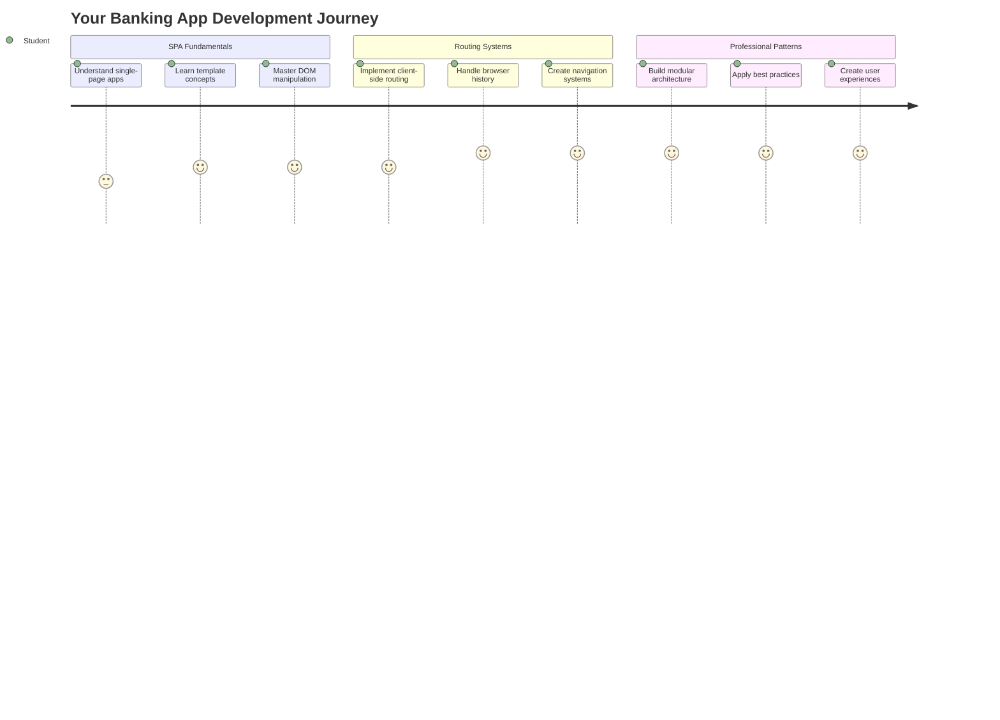
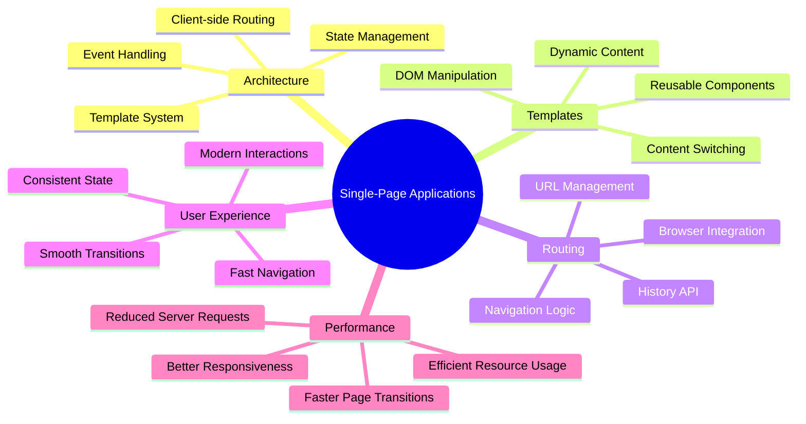
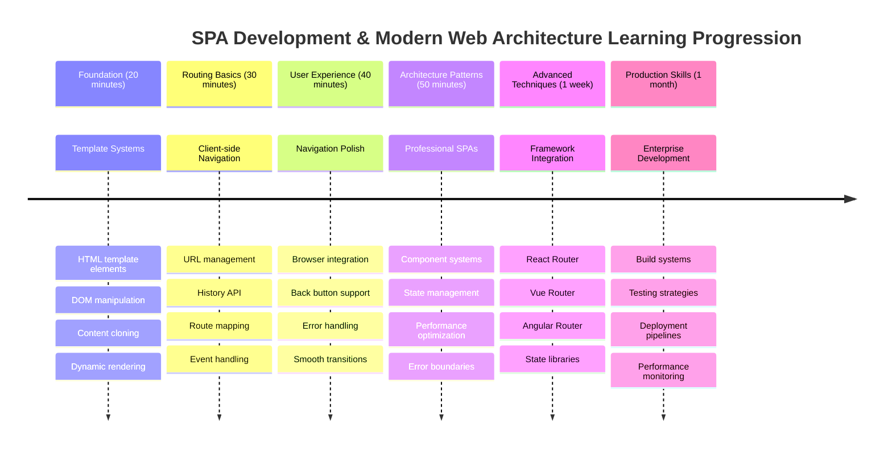

# Costruire un'app bancaria Parte 1: Modelli HTML e rotte in un'app web



Quando il computer di guida dell'Apollo 11 navigò verso la luna nel 1969, doveva passare tra diversi programmi senza riavviare l'intero sistema. Le moderne applicazioni web funzionano in modo simile: cambiano ciò che vedi senza ricaricare tutto da zero. Questo crea l'esperienza fluida e reattiva che gli utenti si aspettano oggi.

A differenza dei siti web tradizionali che ricaricano intere pagine per ogni interazione, le moderne app web aggiornano solo le parti che necessitano di modifiche. Questo approccio, simile a come il controllo missione passa tra diversi display mantenendo una comunicazione costante, crea quell'esperienza fluida a cui siamo abituati.

Ecco cosa rende la differenza così evidente:

| App tradizionali multi-pagina | App moderne a pagina singola |
|------------------------------|-----------------------------|
| **Navigazione** | Ricarica completa della pagina per ogni schermata | Cambio istantaneo dei contenuti |
| **Prestazioni** | Più lente a causa del download completo di HTML | Più veloci con aggiornamenti parziali |
| **Esperienza utente** | Flash di pagina bruschi | Transizioni fluide, simili a un'app |
| **Condivisione dati** | Difficile tra le pagine | Gestione dello stato facile |
| **Sviluppo** | Più file HTML da mantenere | Un singolo HTML con modelli dinamici |

**Comprendere l'evoluzione:**
- **App tradizionali** richiedono richieste al server per ogni azione di navigazione
- **SPA moderne** si caricano una volta e aggiornano i contenuti dinamicamente usando JavaScript
- **Le aspettative degli utenti** ora favoriscono interazioni istantanee e senza interruzioni
- **Benefici prestazionali** includono una riduzione della larghezza di banda e risposte più rapide

In questa lezione, costruiremo un'app bancaria con più schermate che fluiscono insieme senza interruzioni. Come gli scienziati usano strumenti modulari che possono essere riconfigurati per diversi esperimenti, utilizzeremo modelli HTML come componenti riutilizzabili che possono essere visualizzati secondo necessità.

Lavorerai con modelli HTML (progetti riutilizzabili per diverse schermate), routing JavaScript (il sistema che passa tra le schermate) e l'API di cronologia del browser (che mantiene il pulsante indietro funzionante come previsto). Queste sono le stesse tecniche fondamentali utilizzate da framework come React, Vue e Angular.

Alla fine, avrai un'app bancaria funzionante che dimostra i principi professionali delle applicazioni a pagina singola.



## Quiz Pre-Lezione

[Quiz pre-lezione](https://ff-quizzes.netlify.app/web/quiz/41)

### Cosa Ti Serve

Avremo bisogno di un server web locale per testare la nostra app bancaria – non preoccuparti, è più facile di quanto sembri! Se non ne hai già uno configurato, installa semplicemente [Node.js](https://nodejs.org) e esegui `npx lite-server` dalla tua cartella di progetto. Questo comando pratico avvia un server locale e apre automaticamente la tua app nel browser.

### Preparazione

Sul tuo computer, crea una cartella chiamata `bank` con un file chiamato `index.html` al suo interno. Partiremo da questo [boilerplate HTML](https://en.wikipedia.org/wiki/Boilerplate_code):

```html
<!DOCTYPE html>
<html lang="en">
  <head>
    <meta charset="UTF-8">
    <meta name="viewport" content="width=device-width, initial-scale=1.0">
    <title>Bank App</title>
  </head>
  <body>
    <!-- This is where you'll work -->
  </body>
</html>
```

**Ecco cosa fornisce questo boilerplate:**
- **Stabilisce** la struttura del documento HTML5 con una corretta dichiarazione DOCTYPE
- **Configura** la codifica dei caratteri come UTF-8 per il supporto del testo internazionale
- **Abilita** il design responsivo con il meta tag viewport per la compatibilità mobile
- **Imposta** un titolo descrittivo che appare nella scheda del browser
- **Crea** una sezione corpo pulita dove costruiremo la nostra applicazione

> 📁 **Anteprima della Struttura del Progetto**
> 
> **Alla fine di questa lezione, il tuo progetto conterrà:**
> ```
> bank/
> ├── index.html      <!-- Main HTML with templates -->
> ├── app.js          <!-- Routing and navigation logic -->
> └── style.css       <!-- (Optional for future lessons) -->
> ```
> 
> **Responsabilità dei file:**
> - **index.html**: Contiene tutti i modelli e fornisce la struttura dell'app
> - **app.js**: Gestisce il routing, la navigazione e la gestione dei modelli
> - **Modelli**: Definiscono l'interfaccia utente per login, dashboard e altre schermate

---

## Modelli HTML

I modelli risolvono un problema fondamentale nello sviluppo web. Quando Gutenberg inventò la stampa a caratteri mobili negli anni '40 del Quattrocento, si rese conto che invece di scolpire intere pagine, poteva creare blocchi di lettere riutilizzabili e disporli secondo necessità. I modelli HTML funzionano sullo stesso principio: invece di creare file HTML separati per ogni schermata, definisci strutture riutilizzabili che possono essere visualizzate quando necessario.

```mermaid
flowchart TD
    A["📋 Template Definition"] --> B["💬 Hidden in DOM"]
    B --> C["🔍 JavaScript Finds Template"]
    C --> D["📋 Clone Template Content"]
    D --> E["🔗 Attach to Visible DOM"]
    E --> F["👁️ User Sees Content"]
    
    G["Login Template"] --> A
    H["Dashboard Template"] --> A
    I["Future Templates"] --> A
    
    style A fill:#e3f2fd
    style D fill:#e8f5e8
    style F fill:#fff3e0
    style B fill:#f3e5f5
```



Pensa ai modelli come progetti per diverse parti della tua app. Proprio come un architetto crea un progetto e lo utilizza più volte invece di ridisegnare stanze identiche, noi creiamo modelli una volta e li istanziamo secondo necessità. Il browser mantiene questi modelli nascosti fino a quando JavaScript li attiva.

Se vuoi creare più schermate per una pagina web, una soluzione sarebbe creare un file HTML per ogni schermata che vuoi visualizzare. Tuttavia, questa soluzione comporta alcune difficoltà:

- Devi ricaricare l'intero HTML quando cambi schermata, il che può essere lento.
- È difficile condividere dati tra le diverse schermate.

Un altro approccio è avere un solo file HTML e definire più [modelli HTML](https://developer.mozilla.org/docs/Web/HTML/Element/template) usando l'elemento `<template>`. Un modello è un blocco HTML riutilizzabile che non viene visualizzato dal browser e deve essere istanziato a runtime usando JavaScript.

### Costruiamolo

Creeremo un'app bancaria con due schermate principali: una pagina di login e una dashboard. Per prima cosa, aggiungiamo un elemento segnaposto al corpo del nostro HTML – questo è dove appariranno tutte le nostre diverse schermate:

```html
<div id="app">Loading...</div>
```

**Comprendere questo segnaposto:**
- **Crea** un contenitore con l'ID "app" dove verranno visualizzate tutte le schermate
- **Mostra** un messaggio di caricamento fino a quando JavaScript inizializza la prima schermata
- **Fornisce** un unico punto di montaggio per i nostri contenuti dinamici
- **Abilita** un facile targeting da JavaScript usando `document.getElementById()`

> 💡 **Suggerimento Pro**: Poiché il contenuto di questo elemento verrà sostituito, possiamo inserire un messaggio o un indicatore di caricamento che verrà mostrato mentre l'app si carica.

Successivamente, aggiungiamo sotto il modello HTML per la pagina di login. Per ora metteremo solo un titolo e una sezione contenente un link che useremo per effettuare la navigazione.

```html
<template id="login">
  <h1>Bank App</h1>
  <section>
    <a href="/dashboard">Login</a>
  </section>
</template>
```

**Analisi di questo modello di login:**
- **Definisce** un modello con l'identificatore unico "login" per il targeting JavaScript
- **Include** un'intestazione principale che stabilisce il branding dell'app
- **Contiene** un elemento `<section>` semantico per raggruppare contenuti correlati
- **Fornisce** un link di navigazione che indirizzerà gli utenti alla dashboard

Poi aggiungeremo un altro modello HTML per la pagina della dashboard. Questa pagina conterrà diverse sezioni:

- Un'intestazione con un titolo e un link per il logout
- Il saldo corrente del conto bancario
- Un elenco di transazioni, visualizzato in una tabella

```html
<template id="dashboard">
  <header>
    <h1>Bank App</h1>
    <a href="/login">Logout</a>
  </header>
  <section>
    Balance: 100$
  </section>
  <section>
    <h2>Transactions</h2>
    <table>
      <thead>
        <tr>
          <th>Date</th>
          <th>Object</th>
          <th>Amount</th>
        </tr>
      </thead>
      <tbody></tbody>
    </table>
  </section>
</template>
```

**Comprendiamo ogni parte di questa dashboard:**
- **Struttura** la pagina con un elemento `<header>` semantico contenente la navigazione
- **Visualizza** il titolo dell'app in modo coerente tra le schermate per il branding
- **Fornisce** un link per il logout che indirizza nuovamente alla schermata di login
- **Mostra** il saldo corrente del conto in una sezione dedicata
- **Organizza** i dati delle transazioni usando una tabella HTML strutturata correttamente
- **Definisce** intestazioni di tabella per le colonne Data, Oggetto e Importo
- **Lascia** il corpo della tabella vuoto per l'iniezione dinamica dei contenuti in seguito

> 💡 **Suggerimento Pro**: Quando crei modelli HTML, se vuoi vedere come appariranno, puoi commentare le righe `<template>` e `</template>` racchiudendole con `<!-- -->`.

### 🔄 **Verifica Pedagogica**
**Comprensione del Sistema di Modelli**: Prima di implementare JavaScript, assicurati di comprendere:
- ✅ Come i modelli differiscono dagli elementi HTML regolari
- ✅ Perché i modelli rimangono nascosti fino a quando non vengono attivati da JavaScript
- ✅ L'importanza della struttura HTML semantica nei modelli
- ✅ Come i modelli abilitano componenti UI riutilizzabili

**Auto-Test Rapido**: Cosa succede se rimuovi i tag `<template>` dal tuo HTML?
*Risposta: Il contenuto diventa immediatamente visibile e perde la sua funzionalità di modello*

**Benefici Architetturali**: I modelli forniscono:
- **Riutilizzabilità**: Una definizione, più istanze
- **Prestazioni**: Nessuna analisi HTML ridondante
- **Manutenibilità**: Struttura UI centralizzata
- **Flessibilità**: Cambio dinamico dei contenuti

✅ Perché pensi che usiamo attributi `id` sui modelli? Potremmo usare qualcos'altro come le classi?

## Dare Vita ai Modelli con JavaScript

Ora dobbiamo rendere i nostri modelli funzionali. Proprio come una stampante 3D prende un progetto digitale e crea un oggetto fisico, JavaScript prende i nostri modelli nascosti e crea elementi visibili e interattivi che gli utenti possono vedere e utilizzare.

Il processo segue tre passaggi coerenti che formano la base dello sviluppo web moderno. Una volta compreso questo schema, lo riconoscerai in molti framework e librerie.

Se provi il tuo file HTML attuale in un browser, vedrai che rimane bloccato su `Loading...`. Questo perché dobbiamo aggiungere del codice JavaScript per istanziare e visualizzare i modelli HTML.

L'istanza di un modello viene solitamente eseguita in 3 passaggi:

1. Recupera l'elemento modello nel DOM, ad esempio usando [`document.getElementById`](https://developer.mozilla.org/docs/Web/API/Document/getElementById).
2. Clona l'elemento modello, usando [`cloneNode`](https://developer.mozilla.org/docs/Web/API/Node/cloneNode).
3. Allegalo al DOM sotto un elemento visibile, ad esempio usando [`appendChild`](https://developer.mozilla.org/docs/Web/API/Node/appendChild).

```mermaid
flowchart TD
    A[🔍 Step 1: Find Template] --> B[📋 Step 2: Clone Template]
    B --> C[🔗 Step 3: Attach to DOM]
    
    A1["document.getElementById('login')"] --> A
    B1["template.content.cloneNode(true)"] --> B  
    C1["app.appendChild(view)"] --> C
    
    C --> D[👁️ Template Visible to User]
    
    style A fill:#e1f5fe
    style B fill:#f3e5f5
    style C fill:#e8f5e8
    style D fill:#fff3e0
```



**Analisi visiva del processo:**
- **Passaggio 1** individua il modello nascosto nella struttura del DOM
- **Passaggio 2** crea una copia funzionante che può essere modificata in sicurezza
- **Passaggio 3** inserisce la copia nell'area visibile della pagina
- **Risultato** è una schermata funzionale con cui gli utenti possono interagire

✅ Perché dobbiamo clonare il modello prima di allegarlo al DOM? Cosa pensi che accadrebbe se saltassimo questo passaggio?

### Compito

Crea un nuovo file chiamato `app.js` nella tua cartella di progetto e importa quel file nella sezione `<head>` del tuo HTML:

```html
<script src="app.js" defer></script>
```

**Comprendere questo import dello script:**
- **Collega** il file JavaScript al nostro documento HTML
- **Usa** l'attributo `defer` per garantire che lo script venga eseguito dopo il completamento dell'analisi HTML
- **Abilita** l'accesso a tutti gli elementi DOM poiché sono completamente caricati prima dell'esecuzione dello script
- **Segue** le migliori pratiche moderne per il caricamento degli script e le prestazioni

Ora in `app.js`, creeremo una nuova funzione `updateRoute`:

```js
function updateRoute(templateId) {
  const template = document.getElementById(templateId);
  const view = template.content.cloneNode(true);
  const app = document.getElementById('app');
  app.innerHTML = '';
  app.appendChild(view);
}
```

**Passo dopo passo, ecco cosa sta accadendo:**
- **Individua** l'elemento modello usando il suo ID unico
- **Crea** una copia profonda del contenuto del modello usando `cloneNode(true)`
- **Trova** il contenitore dell'app dove verrà visualizzato il contenuto
- **Cancella** qualsiasi contenuto esistente dal contenitore dell'app
- **Inserisce** il contenuto del modello clonato nel DOM visibile

Ora chiama questa funzione con uno dei modelli e guarda il risultato.

```js
updateRoute('login');
```

**Cosa realizza questa chiamata alla funzione:**
- **Attiva** il modello di login passando il suo ID come parametro
- **Dimostra** come passare programmaticamente tra le diverse schermate dell'app
- **Mostra** la schermata di login al posto del messaggio "Loading..."

✅ Qual è lo scopo di questo codice `app.innerHTML = '';`? Cosa accade senza di esso?

## Creare Rotte

Il routing riguarda essenzialmente il collegamento degli URL al contenuto corretto. Considera come i primi operatori telefonici usavano le centraline per connettere le chiamate: prendevano una richiesta in arrivo e la indirizzavano alla destinazione corretta. Il routing web funziona in modo simile, prendendo una richiesta URL e determinando quale contenuto visualizzare.

```mermaid
flowchart LR
    A["🌐 URL Path<br/>/dashboard"] --> B["🗺️ Routes Object<br/>Lookup"]
    B --> C["🎯 Template ID<br/>'dashboard'"]
    C --> D["📌 Find Template<br/>getElementById"]
    D --> E["👁️ Display Screen<br/>Clone & Append"]
    
    F["📍 /login"] --> G["🎯 'login'"]
    H["📍 /unknown"] --> I["❌ Not Found"]
    I --> J["🔄 Redirect to /login"]
    
    style B fill:#e3f2fd
    style E fill:#e8f5e8
    style I fill:#ffebee
    style J fill:#fff3e0
```



Tradizionalmente, i server web gestivano questo servendo diversi file HTML per diversi URL. Poiché stiamo costruendo un'app a pagina singola, dobbiamo gestire questo routing noi stessi con JavaScript. Questo approccio ci dà più controllo sull'esperienza utente e sulle prestazioni.

```mermaid
flowchart LR
    A["🌐 URL Path<br/>/dashboard"] --> B["🗺️ Routes Object<br/>Lookup"]
    B --> C["🎯 Template ID<br/>'dashboard'"]
    C --> D["📄 Find Template<br/>getElementById"]
    D --> E["👁️ Display Screen<br/>Clone & Append"]
    
    F["📍 /login"] --> G["🎯 'login'"]
    H["📍 /unknown"] --> I["❌ Not Found"]
    I --> J["🔄 Redirect to /login"]
    
    style B fill:#e3f2fd
    style E fill:#e8f5e8
    style I fill:#ffebee
    style J fill:#fff3e0
```



**Comprendere il flusso di routing:**
- **I cambiamenti di URL** attivano una ricerca nella configurazione delle rotte
- **Rotte valide** mappano a specifici ID di modelli per il rendering
- **Rotte non valide** attivano un comportamento di fallback per prevenire stati interrotti
- **Il rendering dei modelli** segue il processo in tre passaggi che abbiamo imparato prima

Quando si parla di un'app web, chiamiamo *Routing* l'intento di mappare **URL** a specifiche schermate che devono essere visualizzate. Su un sito web con più file HTML, questo viene fatto automaticamente poiché i percorsi dei file si riflettono sull'URL. Ad esempio, con questi file nella tua cartella di progetto:

```
mywebsite/index.html
mywebsite/login.html
mywebsite/admin/index.html
```

Se crei un server web con `mywebsite` come root, la mappatura degli URL sarà:

```
https://site.com            --> mywebsite/index.html
https://site.com/login.html --> mywebsite/login.html
https://site.com/admin/     --> mywebsite/admin/index.html
```

Tuttavia, per la nostra app web stiamo usando un singolo file HTML contenente tutte le schermate, quindi questo comportamento predefinito non ci sarà utile. Dobbiamo creare questa mappa manualmente e aggiornare la schermata visualizzata usando JavaScript.

### Compito

Utilizzeremo un semplice oggetto per implementare una [mappa](https://en.wikipedia.org/wiki/Associative_array) tra i percorsi URL e i nostri modelli. Aggiungi questo oggetto all'inizio del tuo file `app.js`.

```js
const routes = {
  '/login': { templateId: 'login' },
  '/dashboard': { templateId: 'dashboard' },
};
```

**Comprendere questa configurazione delle rotte:**
- **Definisce** una mappatura tra percorsi URL e identificatori di modelli
- **Usa** la sintassi degli oggetti dove le chiavi sono percorsi URL e i valori contengono informazioni sui modelli
- **Abilita** una facile ricerca di quale modello visualizzare per un dato URL
- **Fornisce** una struttura scalabile per aggiungere nuove rotte in futuro
Ora modifichiamo un po' la funzione `updateRoute`. Invece di passare direttamente il `templateId` come argomento, vogliamo recuperarlo prima guardando l'URL corrente e poi utilizzare la nostra mappa per ottenere il valore corrispondente dell'ID del template. Possiamo usare [`window.location.pathname`](https://developer.mozilla.org/docs/Web/API/Location/pathname) per ottenere solo la sezione del percorso dall'URL.

```js
function updateRoute() {
  const path = window.location.pathname;
  const route = routes[path];

  const template = document.getElementById(route.templateId);
  const view = template.content.cloneNode(true);
  const app = document.getElementById('app');
  app.innerHTML = '';
  app.appendChild(view);
}
```

**Analisi di ciò che accade qui:**
- **Estrae** il percorso corrente dall'URL del browser utilizzando `window.location.pathname`
- **Cerca** la configurazione del percorso corrispondente nel nostro oggetto routes
- **Recupera** l'ID del template dalla configurazione del percorso
- **Segue** lo stesso processo di rendering del template di prima
- **Crea** un sistema dinamico che risponde ai cambiamenti dell'URL

Qui abbiamo mappato i percorsi dichiarati al template corrispondente. Puoi verificare che funzioni correttamente cambiando manualmente l'URL nel tuo browser.

✅ Cosa succede se inserisci un percorso sconosciuto nell'URL? Come potremmo risolvere questo problema?

## Aggiungere la Navigazione

Con il routing stabilito, gli utenti hanno bisogno di un modo per navigare nell'app. I siti web tradizionali ricaricano intere pagine quando si cliccano i link, ma noi vogliamo aggiornare sia l'URL che il contenuto senza ricaricare le pagine. Questo crea un'esperienza più fluida, simile a come le applicazioni desktop passano da una vista all'altra.

Dobbiamo coordinare due cose: aggiornare l'URL del browser in modo che gli utenti possano salvare le pagine nei segnalibri e condividere i link, e visualizzare il contenuto appropriato. Quando implementato correttamente, questo crea la navigazione fluida che gli utenti si aspettano dalle applicazioni moderne.


### 🔄 **Verifica Pedagogica**
**Architettura delle Applicazioni Single-Page**: Verifica la tua comprensione del sistema completo:
- ✅ In che modo il routing lato client differisce dal routing tradizionale lato server?
- ✅ Perché l'API History è essenziale per una corretta navigazione SPA?
- ✅ Come i template consentono contenuti dinamici senza ricaricare la pagina?
- ✅ Qual è il ruolo della gestione degli eventi nell'intercettare la navigazione?

**Integrazione del Sistema**: La tua SPA dimostra:
- **Gestione dei Template**: Componenti UI riutilizzabili con contenuti dinamici
- **Routing lato client**: Gestione degli URL senza richieste al server
- **Architettura basata sugli eventi**: Navigazione reattiva e interazioni utente
- **Integrazione con il Browser**: Supporto corretto per i pulsanti indietro/avanti
- **Ottimizzazione delle Prestazioni**: Transizioni rapide e ridotto carico sul server

**Pattern Professionali**: Hai implementato:
- **Separazione Modello-Vista**: Template separati dalla logica dell'applicazione
- **Gestione dello Stato**: Stato dell'URL sincronizzato con il contenuto visualizzato
- **Miglioramento Progressivo**: JavaScript migliora la funzionalità HTML di base
- **Esperienza Utente**: Navigazione fluida, simile a un'app, senza ricaricare la pagina

> 💡 **Approfondimento Architetturale**: Componenti del Sistema di Navigazione
>
> **Cosa stai costruendo:**
> - **🔄 Gestione degli URL**: Aggiorna la barra degli indirizzi del browser senza ricaricare la pagina
> - **📋 Sistema di Template**: Cambia il contenuto dinamicamente in base al percorso corrente  
> - **📚 Integrazione con la Cronologia**: Mantiene la funzionalità dei pulsanti indietro/avanti del browser
> - **🛡️ Gestione degli Errori**: Soluzioni eleganti per percorsi non validi o mancanti
>
> **Come i componenti lavorano insieme:**
> - **Ascolta** gli eventi di navigazione (clic, cambiamenti nella cronologia)
> - **Aggiorna** l'URL utilizzando l'API History
> - **Renderizza** il template appropriato per il nuovo percorso
> - **Mantiene** un'esperienza utente fluida durante tutto il processo

Il prossimo passo per la nostra app è aggiungere la possibilità di navigare tra le pagine senza dover cambiare manualmente l'URL. Questo implica due cose:

  1. Aggiornare l'URL corrente
  2. Aggiornare il template visualizzato in base al nuovo URL

Abbiamo già gestito la seconda parte con la funzione `updateRoute`, quindi dobbiamo capire come aggiornare l'URL corrente.

Dovremo usare JavaScript e, più specificamente, [`history.pushState`](https://developer.mozilla.org/docs/Web/API/History/pushState) che consente di aggiornare l'URL e creare una nuova voce nella cronologia di navigazione, senza ricaricare l'HTML.

> ⚠️ **Nota Importante**: Sebbene l'elemento HTML anchor [`<a href>`](https://developer.mozilla.org/docs/Web/HTML/Element/a) possa essere utilizzato da solo per creare collegamenti ipertestuali a diversi URL, farà sì che il browser ricarichi l'HTML per impostazione predefinita. È necessario prevenire questo comportamento quando si gestisce il routing con JavaScript personalizzato, utilizzando la funzione preventDefault() sull'evento di clic.

### Compito

Creiamo una nuova funzione che possiamo utilizzare per navigare nella nostra app:

```js
function navigate(path) {
  window.history.pushState({}, path, path);
  updateRoute();
}
```

**Comprendere questa funzione di navigazione:**
- **Aggiorna** l'URL del browser al nuovo percorso utilizzando `history.pushState`
- **Aggiunge** una nuova voce alla cronologia del browser per supportare correttamente i pulsanti indietro/avanti
- **Attiva** la funzione `updateRoute()` per visualizzare il template corrispondente
- **Mantiene** l'esperienza della single-page app senza ricaricare la pagina

Questo metodo prima aggiorna l'URL corrente in base al percorso fornito, poi aggiorna il template. La proprietà `window.location.origin` restituisce la radice dell'URL, consentendoci di ricostruire un URL completo da un percorso dato.

Ora che abbiamo questa funzione, possiamo occuparci del problema che abbiamo se un percorso non corrisponde a nessuna route definita. Modificheremo la funzione `updateRoute` aggiungendo un fallback a una delle route esistenti se non riusciamo a trovare una corrispondenza.

```js
function updateRoute() {
  const path = window.location.pathname;
  const route = routes[path];

  if (!route) {
    return navigate('/login');
  }

  const template = document.getElementById(route.templateId);
  const view = template.content.cloneNode(true);
  const app = document.getElementById('app');
  app.innerHTML = '';
  app.appendChild(view);
}
```

**Punti chiave da ricordare:**
- **Verifica** se esiste una route per il percorso corrente
- **Reindirizza** alla pagina di login quando si accede a una route non valida
- **Fornisce** un meccanismo di fallback che previene una navigazione interrotta
- **Garantisce** che gli utenti vedano sempre una schermata valida, anche con URL errati

Se non si riesce a trovare una route, ora reindirizzeremo alla pagina `login`.

Creiamo ora una funzione per ottenere l'URL quando si clicca su un link e per prevenire il comportamento predefinito del browser:

```js
function onLinkClick(event) {
  event.preventDefault();
  navigate(event.target.href);
}
```

**Analisi di questo gestore di clic:**
- **Previene** il comportamento predefinito del browser sui link utilizzando `preventDefault()`
- **Estrae** l'URL di destinazione dall'elemento del link cliccato
- **Chiama** la nostra funzione di navigazione personalizzata invece di ricaricare la pagina
- **Mantiene** l'esperienza fluida della single-page application

```html
<a href="/dashboard" onclick="onLinkClick(event)">Login</a>
...
<a href="/login" onclick="onLinkClick(event)">Logout</a>
```

**Cosa realizza questo binding onclick:**
- **Collega** ogni link al nostro sistema di navigazione personalizzato
- **Passa** l'evento di clic alla nostra funzione `onLinkClick` per l'elaborazione
- **Abilita** una navigazione fluida senza ricaricare la pagina
- **Mantiene** una struttura URL corretta che gli utenti possono salvare nei segnalibri o condividere

L'attributo [`onclick`](https://developer.mozilla.org/docs/Web/API/GlobalEventHandlers/onclick) collega l'evento `click` al codice JavaScript, qui la chiamata alla funzione `navigate()`.

Prova a cliccare su questi link, ora dovresti essere in grado di navigare tra le diverse schermate della tua app.

✅ Il metodo `history.pushState` fa parte dello standard HTML5 ed è implementato in [tutti i browser moderni](https://caniuse.com/?search=pushState). Se stai sviluppando un'app web per browser più vecchi, c'è un trucco che puoi utilizzare al posto di questa API: usando un [hash (`#`)](https://en.wikipedia.org/wiki/URI_fragment) prima del percorso puoi implementare un routing che funziona con la normale navigazione tramite anchor e non ricarica la pagina, poiché il suo scopo era creare collegamenti interni all'interno di una pagina.

## Far Funzionare i Pulsanti Indietro e Avanti

I pulsanti indietro e avanti sono fondamentali per la navigazione web, proprio come i controllori di missione della NASA possono rivedere gli stati precedenti del sistema durante le missioni spaziali. Gli utenti si aspettano che questi pulsanti funzionino, e quando non lo fanno, si rompe l'esperienza di navigazione prevista.

La nostra single-page app necessita di una configurazione aggiuntiva per supportare questo. Il browser mantiene una cronologia di navigazione (che abbiamo aggiunto con `history.pushState`), ma quando gli utenti navigano attraverso questa cronologia, la nostra app deve rispondere aggiornando di conseguenza il contenuto visualizzato.


**Punti chiave di interazione:**
- **Le azioni dell'utente** attivano la navigazione tramite clic o pulsanti del browser
- **L'app intercetta** i clic sui link per prevenire il ricaricamento della pagina
- **L'API History** gestisce i cambiamenti di URL e la cronologia del browser
- **I template** forniscono la struttura del contenuto per ogni schermata
- **I listener degli eventi** garantiscono che l'app risponda a tutti i tipi di navigazione

Utilizzando `history.pushState` si creano nuove voci nella cronologia di navigazione del browser. Puoi verificarlo tenendo premuto il *pulsante indietro* del tuo browser, dovrebbe mostrare qualcosa del genere:


Se provi a cliccare sul pulsante indietro alcune volte, vedrai che l'URL corrente cambia e la cronologia viene aggiornata, ma lo stesso template continua a essere visualizzato.

Questo perché l'applicazione non sa che dobbiamo chiamare `updateRoute()` ogni volta che la cronologia cambia. Se dai un'occhiata alla [documentazione di `history.pushState`](https://developer.mozilla.org/docs/Web/API/History/pushState), puoi vedere che se lo stato cambia - cioè ci spostiamo su un URL diverso - viene attivato l'evento [`popstate`](https://developer.mozilla.org/docs/Web/API/Window/popstate_event). Useremo questo per risolvere il problema.

### Compito

Per assicurarci che il template visualizzato venga aggiornato quando la cronologia del browser cambia, collegheremo una nuova funzione che chiama `updateRoute()`. Lo faremo alla fine del file `app.js`:

```js
window.onpopstate = () => updateRoute();
updateRoute();
```

**Comprendere questa integrazione con la cronologia:**
- **Ascolta** gli eventi `popstate` che si verificano quando gli utenti navigano con i pulsanti del browser
- **Utilizza** una funzione freccia per una sintassi concisa del gestore degli eventi
- **Chiama** automaticamente `updateRoute()` ogni volta che lo stato della cronologia cambia
- **Inizializza** l'app chiamando `updateRoute()` quando la pagina viene caricata per la prima volta
- **Garantisce** che il template corretto venga visualizzato indipendentemente da come gli utenti navigano

> 💡 **Suggerimento Pro**: Abbiamo utilizzato una [funzione freccia](https://developer.mozilla.org/docs/Web/JavaScript/Reference/Functions/Arrow_functions) qui per dichiarare il nostro gestore dell'evento `popstate` per concisione, ma una funzione regolare funzionerebbe allo stesso modo.

Ecco un video di approfondimento sulle funzioni freccia:

[](https://youtube.com/watch?v=OP6eEbOj2sc "Funzioni Freccia")

> 🎥 Clicca sull'immagine sopra per un video sulle funzioni freccia.

Ora prova a utilizzare i pulsanti indietro e avanti del tuo browser e verifica che il percorso visualizzato venga aggiornato correttamente questa volta.

### ⚡ **Cosa Puoi Fare nei Prossimi 5 Minuti**
- [ ] Testa la navigazione della tua app bancaria utilizzando i pulsanti indietro/avanti del browser
- [ ] Prova a digitare manualmente diversi URL nella barra degli indirizzi per testare il routing
- [ ] Apri gli strumenti di sviluppo del browser e ispeziona come i template vengono clonati nel DOM
- [ ] Sperimenta aggiungendo dichiarazioni console.log per tracciare il flusso del routing

### 🎯 **Cosa Puoi Realizzare in Quest'ora**
- [ ] Completa il quiz post-lezione e comprendi i concetti di architettura SPA
- [ ] Aggiungi uno stile CSS per rendere i template della tua app bancaria più professionali
- [ ] Implementa la sfida della pagina di errore 404 con una corretta gestione degli errori
- [ ] Crea la sfida della pagina dei crediti con funzionalità di routing aggiuntive
- [ ] Aggiungi stati di caricamento e transizioni tra i cambi di template

### 📅 **Il Tuo Viaggio di Sviluppo SPA di Una Settimana**
- [ ] Completa l'app bancaria completa con moduli, gestione dei dati e persistenza
- [ ] Aggiungi funzionalità di routing avanzate come parametri di route e route nidificate
- [ ] Implementa guardie di navigazione e routing basato sull'autenticazione
- [ ] Crea componenti template riutilizzabili e una libreria di componenti
- [ ] Aggiungi animazioni e transizioni per un'esperienza utente più fluida
- [ ] Distribuisci la tua SPA su una piattaforma di hosting e configura correttamente il routing

### 🌟 **La Tua Maestria nell'Architettura Frontend di Un Mese**
- [ ] Costruisci SPA complesse utilizzando framework moderni come React, Vue o Angular
- [ ] Impara pattern avanzati di gestione dello stato e librerie
- [ ] Padroneggia strumenti di build e flussi di lavoro di sviluppo per SPA
- [ ] Implementa funzionalità Progressive Web App e funzionalità offline
- [ ] Studia tecniche di ottimizzazione delle prestazioni per SPA su larga scala
- [ ] Contribuisci a progetti open source SPA e condividi le tue conoscenze

## 🎯 La Tua Timeline di Maestria nelle Applicazioni Single-Page



### 🛠️ Riepilogo del Toolkit di Sviluppo SPA

Dopo aver completato questa lezione, ora hai padroneggiato:
- **Architettura dei Template**: Componenti HTML riutilizzabili con rendering di contenuti dinamici
- **Routing lato client**: Gestione degli URL e navigazione senza ricaricare la pagina
- **Integrazione con il Browser**: Utilizzo dell'API History e supporto per i pulsanti indietro/avanti
- **Sistemi basati sugli Eventi**: Gestione della navigazione e delle interazioni utente
- **Manipolazione del DOM**: Clonazione dei template, cambio dei contenuti e gestione degli elementi
- **Gestione degli Errori**: Soluzioni eleganti per route non valide e contenuti mancanti
- **Pattern di Prestazioni**: Strategie efficienti di caricamento e rendering dei contenuti

**Applicazioni nel Mondo Reale**: Le tue competenze nello sviluppo SPA si applicano direttamente a:
- **Applicazioni Web Moderne**: Sviluppo con React, Vue, Angular e altri framework
- **Progressive Web Apps**: Applicazioni offline con esperienze simili a quelle delle app
- **Dashboard Aziendali**: Applicazioni aziendali complesse con viste multiple
- **Piattaforme E-commerce**: Cataloghi di prodotti, carrelli e flussi di checkout
- **Gestione dei Contenuti**: Creazione e modifica dinamica dei contenuti
- **Sviluppo Mobile**: App ibride utilizzando tecnologie web

**Competenze Professionali Acquisite**: Ora puoi:
- **Progetta** applicazioni a pagina singola con una corretta separazione delle responsabilità
- **Implementa** sistemi di routing lato client che si adattano alla complessità dell'applicazione
- **Debugga** flussi di navigazione complessi utilizzando gli strumenti di sviluppo del browser
- **Ottimizza** le prestazioni dell'applicazione attraverso una gestione efficiente dei template
- **Progetta** esperienze utente che sembrano native e reattive

**Concetti di sviluppo frontend padroneggiati**:
- **Architettura dei componenti**: Modelli UI riutilizzabili e sistemi di template
- **Sincronizzazione dello stato**: Gestione dello stato URL e cronologia del browser
- **Programmazione basata su eventi**: Gestione delle interazioni utente e navigazione
- **Ottimizzazione delle prestazioni**: Manipolazione efficiente del DOM e caricamento dei contenuti
- **Progettazione dell'esperienza utente**: Transizioni fluide e navigazione intuitiva

**Prossimo livello**: Sei pronto per esplorare framework frontend moderni, gestione avanzata dello stato o costruire applicazioni aziendali complesse!

🌟 **Obiettivo raggiunto**: Hai costruito una solida base per applicazioni a pagina singola con modelli di architettura web moderni!

---

## Sfida GitHub Copilot Agent 🚀

Usa la modalità Agent per completare la seguente sfida:

**Descrizione:** Migliora l'app bancaria implementando la gestione degli errori e un template per la pagina 404 per le rotte non valide, migliorando l'esperienza utente durante la navigazione verso pagine inesistenti.

**Prompt:** Crea un nuovo template HTML con id "not-found" che mostri una pagina di errore 404 user-friendly con stile. Modifica poi la logica di routing JavaScript per mostrare questo template quando gli utenti navigano verso URL non validi, e aggiungi un pulsante "Vai alla Home" che riporti alla pagina di login.

Scopri di più sulla [modalità agent](https://code.visualstudio.com/blogs/2025/02/24/introducing-copilot-agent-mode) qui.

## 🚀 Sfida

Aggiungi un nuovo template e una rotta per una terza pagina che mostri i crediti di questa app.

**Obiettivi della sfida:**
- **Crea** un nuovo template HTML con una struttura di contenuti appropriata
- **Aggiungi** la nuova rotta al tuo oggetto di configurazione delle rotte
- **Includi** link di navigazione verso e dalla pagina dei crediti
- **Testa** che tutta la navigazione funzioni correttamente con la cronologia del browser

## Quiz post-lezione

[Quiz post-lezione](https://ff-quizzes.netlify.app/web/quiz/42)

## Revisione e studio autonomo

Il routing è una delle parti sorprendentemente complesse dello sviluppo web, specialmente mentre il web si sposta dai comportamenti di aggiornamento della pagina alle applicazioni a pagina singola. Leggi un po' su [come il servizio Azure Static Web App](https://docs.microsoft.com/azure/static-web-apps/routes/?WT.mc_id=academic-77807-sagibbon) gestisce il routing. Riesci a spiegare perché alcune delle decisioni descritte in quel documento sono necessarie?

**Risorse di apprendimento aggiuntive**:
- **Esplora** come framework popolari come React Router e Vue Router implementano il routing lato client
- **Ricerca** le differenze tra il routing basato su hash e il routing con API di cronologia
- **Impara** il rendering lato server (SSR) e come influisce sulle strategie di routing
- **Indaga** su come le Progressive Web Apps (PWAs) gestiscono il routing e la navigazione

## Compito

[Migliora il routing](assignment.md)

---

**Disclaimer**:  
Questo documento è stato tradotto utilizzando il servizio di traduzione AI [Co-op Translator](https://github.com/Azure/co-op-translator). Sebbene ci impegniamo per garantire l'accuratezza, si prega di notare che le traduzioni automatiche potrebbero contenere errori o imprecisioni. Il documento originale nella sua lingua nativa dovrebbe essere considerato la fonte autorevole. Per informazioni critiche, si raccomanda una traduzione professionale umana. Non siamo responsabili per eventuali incomprensioni o interpretazioni errate derivanti dall'uso di questa traduzione.