<!--
CO_OP_TRANSLATOR_METADATA:
{
  "original_hash": "7cbdbd132d39a2bb493e85bc2a9387cc",
  "translation_date": "2025-11-04T00:32:58+00:00",
  "source_file": "7-bank-project/2-forms/README.md",
  "language_code": "it"
}
-->
# Creare un'app bancaria Parte 2: Creare un modulo di login e registrazione

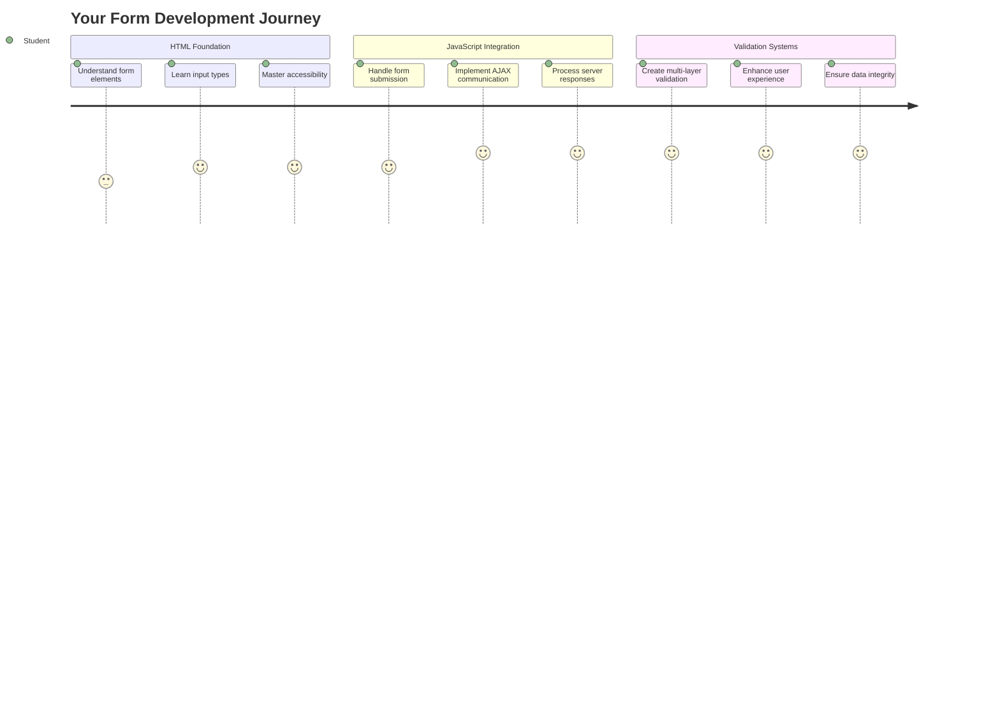

## Quiz Pre-Lezione

[Quiz pre-lezione](https://ff-quizzes.netlify.app/web/quiz/43)

Hai mai compilato un modulo online e ti è stato rifiutato il formato dell'email? O hai perso tutte le informazioni quando hai cliccato su "Invia"? Tutti abbiamo vissuto queste esperienze frustranti.

I moduli sono il ponte tra gli utenti e la funzionalità della tua applicazione. Come i protocolli accurati che i controllori di volo usano per guidare gli aerei in sicurezza verso le loro destinazioni, i moduli ben progettati forniscono feedback chiari e prevengono errori costosi. I moduli mal progettati, invece, possono allontanare gli utenti più velocemente di una comunicazione errata in un aeroporto affollato.

In questa lezione trasformeremo la tua app bancaria statica in un'applicazione interattiva. Imparerai a creare moduli che convalidano l'input degli utenti, comunicano con i server e forniscono feedback utili. Pensalo come la costruzione dell'interfaccia di controllo che consente agli utenti di navigare tra le funzionalità della tua applicazione.

Alla fine, avrai un sistema completo di login e registrazione con validazione che guida gli utenti verso il successo piuttosto che la frustrazione.

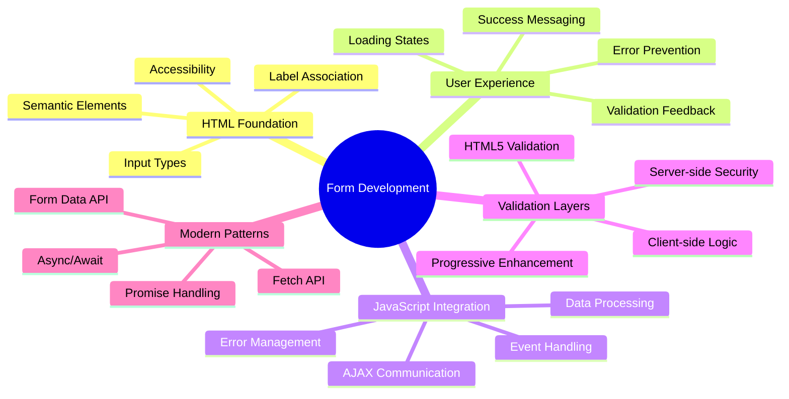

## Prerequisiti

Prima di iniziare a creare moduli, assicuriamoci che tutto sia configurato correttamente. Questa lezione riprende esattamente da dove ci siamo fermati nella precedente, quindi se hai saltato qualche passaggio, potresti voler tornare indietro e far funzionare le basi prima di procedere.

### Configurazione Necessaria

| Componente | Stato | Descrizione |
|------------|-------|-------------|
| [Template HTML](../1-template-route/README.md) | ✅ Necessario | La struttura di base della tua app bancaria |
| [Node.js](https://nodejs.org) | ✅ Necessario | Runtime JavaScript per il server |
| [Server API Bancario](../api/README.md) | ✅ Necessario | Servizio backend per l'archiviazione dei dati |

> 💡 **Consiglio per lo sviluppo**: Dovrai eseguire due server separati contemporaneamente – uno per la tua app bancaria front-end e un altro per l'API backend. Questa configurazione rispecchia lo sviluppo reale, dove i servizi frontend e backend operano indipendentemente.

### Configurazione del Server

**Il tuo ambiente di sviluppo includerà:**
- **Server frontend**: Serve la tua app bancaria (tipicamente porta `3000`)
- **Server API backend**: Gestisce l'archiviazione e il recupero dei dati (porta `5000`)
- **Entrambi i server** possono funzionare contemporaneamente senza conflitti

**Test della connessione API:**
```bash
curl http://localhost:5000/api
# Expected response: "Bank API v1.0.0"
```

**Se vedi la risposta della versione API, sei pronto per procedere!**

---

## Comprendere i moduli HTML e i controlli

I moduli HTML sono il modo in cui gli utenti comunicano con la tua applicazione web. Pensali come il sistema telegrafico che collegava luoghi lontani nel XIX secolo – sono il protocollo di comunicazione tra l'intento dell'utente e la risposta dell'applicazione. Quando progettati con attenzione, catturano errori, guidano la formattazione degli input e forniscono suggerimenti utili.

I moduli moderni sono significativamente più sofisticati rispetto ai semplici input di testo. HTML5 ha introdotto tipi di input specializzati che gestiscono automaticamente la validazione delle email, la formattazione dei numeri e la selezione delle date. Questi miglioramenti favoriscono sia l'accessibilità che le esperienze degli utenti mobili.

### Elementi Essenziali del Modulo

**Blocchi fondamentali di ogni modulo:**

```html
<!-- Basic form structure -->
<form id="userForm" method="POST">
  <label for="username">Username</label>
  <input id="username" name="username" type="text" required>
  
  <button type="submit">Submit</button>
</form>
```

**Ecco cosa fa questo codice:**
- **Crea** un contenitore per il modulo con un identificatore unico
- **Specifica** il metodo HTTP per l'invio dei dati
- **Associa** etichette agli input per l'accessibilità
- **Definisce** un pulsante di invio per elaborare il modulo

### Tipi di Input Moderni e Attributi

| Tipo di Input | Scopo | Esempio di Utilizzo |
|---------------|-------|---------------------|
| `text` | Input di testo generico | `<input type="text" name="username">` |
| `email` | Validazione email | `<input type="email" name="email">` |
| `password` | Inserimento di testo nascosto | `<input type="password" name="password">` |
| `number` | Input numerico | `<input type="number" name="balance" min="0">` |
| `tel` | Numeri di telefono | `<input type="tel" name="phone">` |

> 💡 **Vantaggio HTML5 Moderno**: Usare tipi di input specifici fornisce validazione automatica, tastiere mobili appropriate e un migliore supporto per l'accessibilità senza bisogno di JavaScript aggiuntivo!

### Tipi di Pulsanti e Comportamento

```html
<!-- Different button behaviors -->
<button type="submit">Save Data</button>     <!-- Submits the form -->
<button type="reset">Clear Form</button>    <!-- Resets all fields -->
<button type="button">Custom Action</button> <!-- No default behavior -->
```

**Ecco cosa fa ogni tipo di pulsante:**
- **Pulsanti di invio**: Attivano l'invio del modulo e inviano i dati al punto finale specificato
- **Pulsanti di reset**: Ripristinano tutti i campi del modulo al loro stato iniziale
- **Pulsanti regolari**: Non forniscono alcun comportamento predefinito, richiedendo JavaScript personalizzato per la funzionalità

> ⚠️ **Nota Importante**: L'elemento `<input>` è auto-chiudente e non richiede un tag di chiusura. La pratica moderna è scrivere `<input>` senza la barra.

### Creare il Modulo di Login

Ora creiamo un modulo di login pratico che dimostra le pratiche moderne dei moduli HTML. Inizieremo con una struttura di base e la miglioreremo gradualmente con funzionalità di accessibilità e validazione.

```html
<template id="login">
  <h1>Bank App</h1>
  <section>
    <h2>Login</h2>
    <form id="loginForm" novalidate>
      <div class="form-group">
        <label for="username">Username</label>
        <input id="username" name="user" type="text" required 
               autocomplete="username" placeholder="Enter your username">
      </div>
      <button type="submit">Login</button>
    </form>
  </section>
</template>
```

**Analisi di ciò che accade qui:**
- **Struttura** il modulo con elementi semantici HTML5
- **Raggruppa** elementi correlati usando contenitori `div` con classi significative
- **Associa** etichette agli input usando gli attributi `for` e `id`
- **Include** attributi moderni come `autocomplete` e `placeholder` per una migliore UX
- **Aggiunge** `novalidate` per gestire la validazione con JavaScript invece delle impostazioni predefinite del browser

### L'importanza delle Etichette Corrette

**Perché le etichette sono importanti per lo sviluppo web moderno:**

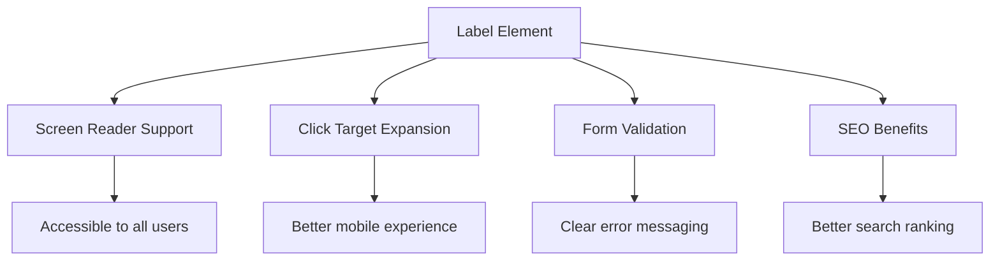

**Cosa ottengono le etichette corrette:**
- **Permettono** ai lettori di schermo di annunciare chiaramente i campi del modulo
- **Espandono** l'area cliccabile (cliccando sull'etichetta si focalizza l'input)
- **Migliorano** l'usabilità mobile con target di tocco più grandi
- **Supportano** la validazione del modulo con messaggi di errore significativi
- **Migliorano** la SEO fornendo significato semantico agli elementi del modulo

> 🎯 **Obiettivo Accessibilità**: Ogni input del modulo dovrebbe avere un'etichetta associata. Questa semplice pratica rende i tuoi moduli utilizzabili da tutti, inclusi gli utenti con disabilità, e migliora l'esperienza per tutti gli utenti.

### Creare il Modulo di Registrazione

Il modulo di registrazione richiede informazioni più dettagliate per creare un account utente completo. Costruiamolo con funzionalità moderne di HTML5 e accessibilità migliorata.

```html
<hr/>
<h2>Register</h2>
<form id="registerForm" novalidate>
  <div class="form-group">
    <label for="user">Username</label>
    <input id="user" name="user" type="text" required 
           autocomplete="username" placeholder="Choose a username">
  </div>
  
  <div class="form-group">
    <label for="currency">Currency</label>
    <input id="currency" name="currency" type="text" value="$" 
           required maxlength="3" placeholder="USD, EUR, etc.">
  </div>
  
  <div class="form-group">
    <label for="description">Account Description</label>
    <input id="description" name="description" type="text" 
           maxlength="100" placeholder="Personal savings, checking, etc.">
  </div>
  
  <div class="form-group">
    <label for="balance">Starting Balance</label>
    <input id="balance" name="balance" type="number" value="0" 
           min="0" step="0.01" placeholder="0.00">
  </div>
  
  <button type="submit">Create Account</button>
</form>
```

**Nel codice sopra abbiamo:**
- **Organizzato** ogni campo in contenitori div per uno stile e layout migliori
- **Aggiunto** attributi `autocomplete` appropriati per il supporto di riempimento automatico del browser
- **Incluso** testo placeholder utile per guidare l'input dell'utente
- **Impostato** valori predefiniti sensati usando l'attributo `value`
- **Applicato** attributi di validazione come `required`, `maxlength` e `min`
- **Usato** `type="number"` per il campo saldo con supporto decimale

### Esplorare Tipi di Input e Comportamento

**I tipi di input moderni offrono funzionalità avanzate:**

| Funzione | Beneficio | Esempio |
|----------|-----------|---------|
| `type="number"` | Tastierino numerico su mobile | Inserimento saldo più semplice |
| `step="0.01"` | Controllo della precisione decimale | Permette i centesimi nella valuta |
| `autocomplete` | Riempimento automatico del browser | Completamento del modulo più veloce |
| `placeholder` | Suggerimenti contestuali | Guida le aspettative dell'utente |

> 🎯 **Sfida Accessibilità**: Prova a navigare nei moduli usando solo la tastiera! Usa `Tab` per spostarti tra i campi, `Space` per selezionare le caselle e `Enter` per inviare. Questa esperienza ti aiuta a capire come gli utenti con lettori di schermo interagiscono con i tuoi moduli.

### 🔄 **Verifica Pedagogica**
**Comprensione delle Basi del Modulo**: Prima di implementare JavaScript, assicurati di comprendere:
- ✅ Come l'HTML semantico crea strutture di moduli accessibili
- ✅ Perché i tipi di input sono importanti per tastiere mobili e validazione
- ✅ La relazione tra etichette e controlli del modulo
- ✅ Come gli attributi del modulo influenzano il comportamento predefinito del browser

**Auto-Test Rapido**: Cosa succede se invii un modulo senza gestione JavaScript?
*Risposta: Il browser esegue l'invio predefinito, solitamente reindirizzando all'URL di azione*

**Benefici dei Moduli HTML5**: I moduli moderni offrono:
- **Validazione Integrata**: Controllo automatico del formato email e numerico
- **Ottimizzazione Mobile**: Tastiere appropriate per diversi tipi di input
- **Accessibilità**: Supporto per lettori di schermo e navigazione tramite tastiera
- **Miglioramento Progressivo**: Funziona anche quando JavaScript è disabilitato

## Comprendere i Metodi di Invio del Modulo

Quando qualcuno compila il tuo modulo e clicca su "Invia", quei dati devono andare da qualche parte – solitamente a un server che può salvarli. Ci sono diversi modi in cui questo può accadere, e sapere quale usare può evitarti problemi in futuro.

Vediamo cosa succede realmente quando qualcuno clicca su quel pulsante di invio.

### Comportamento Predefinito del Modulo

Per prima cosa, osserviamo cosa accade con l'invio di un modulo di base:

**Testa i tuoi moduli attuali:**
1. Clicca sul pulsante *Registrati* nel tuo modulo
2. Osserva i cambiamenti nella barra degli indirizzi del browser
3. Nota come la pagina si ricarica e i dati appaiono nell'URL


### Confronto tra Metodi HTTP

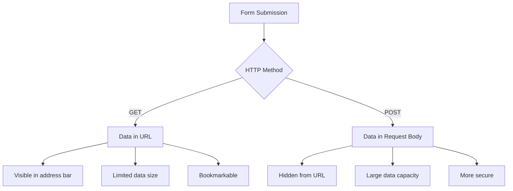

**Comprendere le differenze:**

| Metodo | Caso d'uso | Posizione dei dati | Livello di sicurezza | Limite di dimensione |
|--------|------------|--------------------|----------------------|----------------------|
| `GET` | Query di ricerca, filtri | Parametri URL | Basso (visibile) | ~2000 caratteri |
| `POST` | Account utente, dati sensibili | Corpo della richiesta | Alto (nascosto) | Nessun limite pratico |

**Comprendere le differenze fondamentali:**
- **GET**: Aggiunge i dati del modulo all'URL come parametri di query (appropriato per operazioni di ricerca)
- **POST**: Include i dati nel corpo della richiesta (essenziale per informazioni sensibili)
- **Limitazioni GET**: Vincoli di dimensione, dati visibili, cronologia persistente del browser
- **Vantaggi POST**: Capacità di dati elevata, protezione della privacy, supporto per il caricamento di file

> 💡 **Migliore Pratica**: Usa `GET` per moduli di ricerca e filtri (recupero dati), usa `POST` per registrazione utente, login e creazione di dati.

### Configurare l'Invio del Modulo

Configuriamo il tuo modulo di registrazione per comunicare correttamente con l'API backend usando il metodo POST:

```html
<form id="registerForm" action="//localhost:5000/api/accounts" 
      method="POST" novalidate>
```

**Ecco cosa fa questa configurazione:**
- **Indirizza** l'invio del modulo al punto finale dell'API
- **Usa** il metodo POST per una trasmissione sicura dei dati
- **Include** `novalidate` per gestire la validazione con JavaScript

### Testare l'Invio del Modulo

**Segui questi passaggi per testare il tuo modulo:**
1. **Compila** il modulo di registrazione con le tue informazioni
2. **Clicca** sul pulsante "Crea Account"
3. **Osserva** la risposta del server nel tuo browser

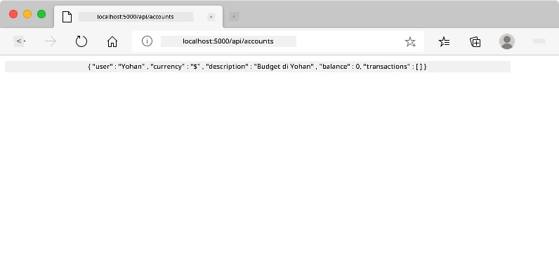

**Cosa dovresti vedere:**
- **Il browser si reindirizza** all'URL del punto finale dell'API
- **Risposta JSON** contenente i dati del tuo nuovo account
- **Conferma del server** che l'account è stato creato con successo

> 🧪 **Tempo di Esperimento**: Prova a registrarti di nuovo con lo stesso nome utente. Che risposta ottieni? Questo ti aiuta a capire come il server gestisce dati duplicati e condizioni di errore.

### Comprendere le Risposte JSON

**Quando il server elabora correttamente il tuo modulo:**
```json
{
  "user": "john_doe",
  "currency": "$",
  "description": "Personal savings",
  "balance": 100,
  "id": "unique_account_id"
}
```

**Questa risposta conferma:**
- **Crea** un nuovo account con i dati specificati
- **Assegna** un identificatore unico per riferimento futuro
- **Restituisce** tutte le informazioni dell'account per la verifica
- **Indica** l'archiviazione riuscita nel database

## Gestione Moderna dei Moduli con JavaScript

Gli invii tradizionali dei moduli causano il ricaricamento completo della pagina, simile a come le prime missioni spaziali richiedevano il reset completo del sistema per correggere la rotta. Questo approccio interrompe l'esperienza utente e perde lo stato dell'applicazione.

La gestione dei moduli con JavaScript funziona come i sistemi di guida continua utilizzati dalle moderne navicelle spaziali – apportando regolazioni in tempo reale senza perdere il contesto di navigazione. Possiamo intercettare gli invii dei moduli, fornire feedback immediati, gestire gli errori in modo elegante e aggiornare l'interfaccia in base alle risposte del server mantenendo la posizione dell'utente nell'applicazione.

### Perché Evitare il Ricaricamento della Pagina?

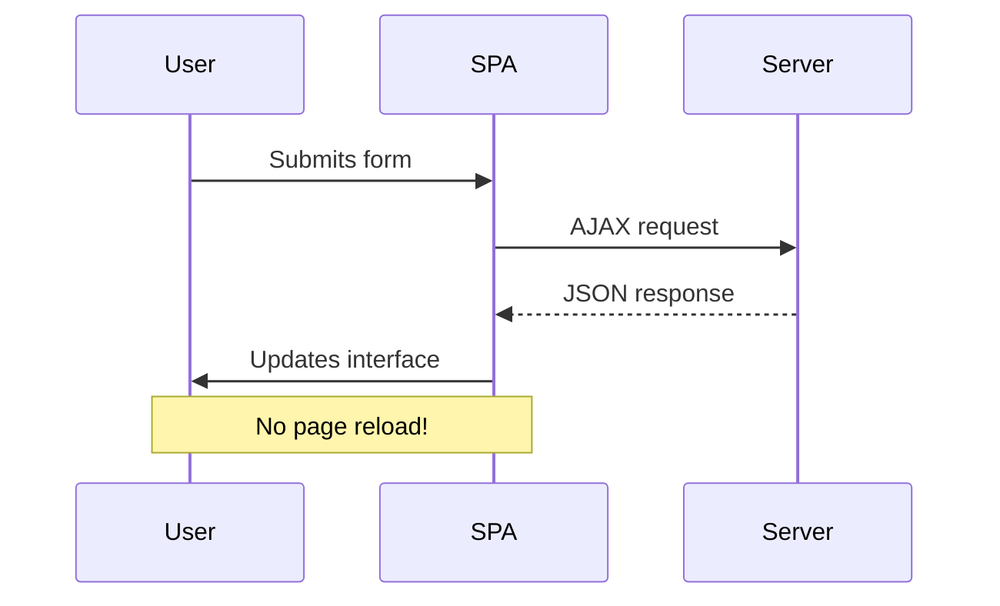

**Vantaggi della gestione dei moduli con JavaScript:**
- **Mantiene** lo stato dell'applicazione e il contesto dell'utente
- **Fornisce** feedback immediati e indicatori di caricamento
- **Abilita** la gestione dinamica degli errori e la validazione
- **Crea** esperienze utente fluide, simili a quelle delle app
- **Permette** logiche condizionali basate sulle risposte del server

### Passare dai Moduli Tradizionali a quelli Moderni

**Sfide dell'approccio tradizionale:**
- **Reindirizza** gli utenti lontano dalla tua applicazione
- **Perde** lo stato e il contesto attuale dell'applicazione
- **Richiede** il ricaricamento completo della pagina per operazioni semplici
- **Fornisce** un controllo limitato sul feedback dell'utente

**Vantaggi dell'approccio moderno con JavaScript:**
- **Mantiene** gli utenti all'interno della tua applicazione
- **Preserva** tutto lo stato e i dati dell'applicazione
- **Abilita** la validazione e il feedback in tempo reale
- **Supporta** il miglioramento progressivo e l'accessibilità

### Implementare la Gestione dei Moduli con JavaScript

Sostituiamo l'invio tradizionale del modulo con la gestione moderna degli eventi JavaScript:

```html
<!-- Remove the action attribute and add event handling -->
<form id="registerForm" method="POST" novalidate>
```

**Aggiungi la logica di registrazione al tuo file `app.js`:**

```javascript
// Modern event-driven form handling
function register() {
  const registerForm = document.getElementById('registerForm');
  const formData = new FormData(registerForm);
  const data = Object.fromEntries(formData);
  const jsonData = JSON.stringify(data);
  
  console.log('Form data prepared:', data);
}

// Attach event listener when the page loads
document.addEventListener('DOMContentLoaded', () => {
  const registerForm = document.getElementById('registerForm');
  registerForm.addEventListener('submit', (event) => {
    event.preventDefault(); // Prevent default form submission
    register();
  });
});
```

**Analisi di ciò che accade qui:**
- **Previene** l'invio predefinito del modulo usando `event.preventDefault()`
- **Recupera** l'elemento del modulo usando la selezione moderna del DOM
- **Estrae** i dati del modulo usando l'API potente `FormData`
- **Converte** FormData in un oggetto semplice con `Object.fromEntries()`
- **Serializza** i dati in formato JSON per la comunicazione con il server
- **Registra** i dati elaborati per il debug e la verifica

### Comprendere l'API FormData

**L'API FormData offre una gestione potente dei moduli:**
```javascript
// Example of what FormData captures
const formData = new FormData(registerForm);

// FormData automatically captures:
// {
//   "user": "john_doe",
//   "currency": "$", 
//   "description": "Personal account",
//   "balance": "100"
// }
```

**Vantaggi dell'API FormData:**
- **Raccolta completa**: Acquisisce tutti gli elementi del modulo, inclusi testo, file e input complessi
- **Consapevolezza del tipo**: Gestisce automaticamente diversi tipi di input senza necessità di codifica personalizzata
- **Efficienza**: Elimina la raccolta manuale dei campi con una singola chiamata API
- **Adattabilità**: Mantiene la funzionalità anche quando la struttura del modulo evolve

### Creazione della funzione di comunicazione con il server

Ora costruiamo una funzione robusta per comunicare con il tuo server API utilizzando i modelli moderni di JavaScript:

```javascript
async function createAccount(account) {
  try {
    const response = await fetch('//localhost:5000/api/accounts', {
      method: 'POST',
      headers: { 
        'Content-Type': 'application/json',
        'Accept': 'application/json'
      },
      body: account
    });
    
    // Check if the response was successful
    if (!response.ok) {
      throw new Error(`HTTP error! status: ${response.status}`);
    }
    
    return await response.json();
  } catch (error) {
    console.error('Account creation failed:', error);
    return { error: error.message || 'Network error occurred' };
  }
}
```

**Comprendere JavaScript asincrono:**

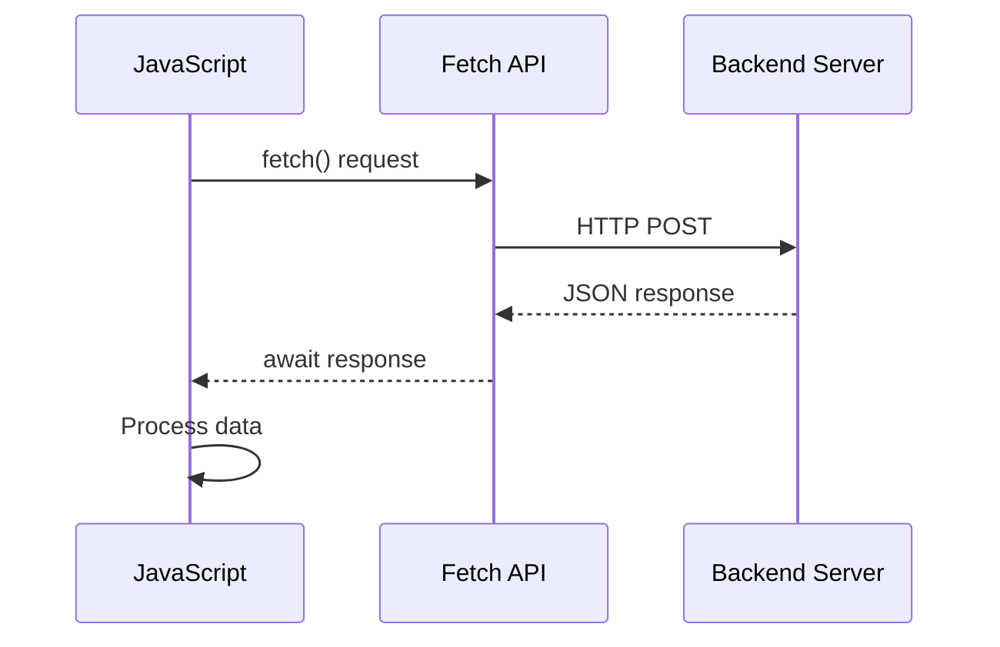

**Cosa realizza questa implementazione moderna:**
- **Utilizza** `async/await` per un codice asincrono leggibile
- **Include** una gestione degli errori appropriata con blocchi try/catch
- **Controlla** lo stato della risposta prima di elaborare i dati
- **Imposta** intestazioni appropriate per la comunicazione JSON
- **Fornisce** messaggi di errore dettagliati per il debug
- **Restituisce** una struttura dati coerente per i casi di successo e di errore

### La potenza della Fetch API moderna

**Vantaggi della Fetch API rispetto ai metodi più vecchi:**

| Caratteristica | Vantaggio | Implementazione |
|----------------|-----------|-----------------|
| Basata su Promise | Codice asincrono pulito | `await fetch()` |
| Personalizzazione della richiesta | Controllo completo HTTP | Intestazioni, metodi, corpo |
| Gestione della risposta | Parsing flessibile dei dati | `.json()`, `.text()`, `.blob()` |
| Gestione degli errori | Cattura completa degli errori | Blocchi try/catch |

> 🎥 **Scopri di più**: [Tutorial Async/Await](https://youtube.com/watch?v=YwmlRkrxvkk) - Comprendere i modelli asincroni di JavaScript per lo sviluppo web moderno.

**Concetti chiave per la comunicazione con il server:**
- **Funzioni asincrone** permettono di sospendere l'esecuzione per attendere le risposte del server
- **Parola chiave await** rende il codice asincrono leggibile come codice sincrono
- **Fetch API** fornisce richieste HTTP moderne basate su Promise
- **Gestione degli errori** garantisce che la tua app risponda in modo adeguato ai problemi di rete

### Completare la funzione di registrazione

Mettiamo insieme tutto con una funzione di registrazione completa e pronta per la produzione:

```javascript
async function register() {
  const registerForm = document.getElementById('registerForm');
  const submitButton = registerForm.querySelector('button[type="submit"]');
  
  try {
    // Show loading state
    submitButton.disabled = true;
    submitButton.textContent = 'Creating Account...';
    
    // Process form data
    const formData = new FormData(registerForm);
    const jsonData = JSON.stringify(Object.fromEntries(formData));
    
    // Send to server
    const result = await createAccount(jsonData);
    
    if (result.error) {
      console.error('Registration failed:', result.error);
      alert(`Registration failed: ${result.error}`);
      return;
    }
    
    console.log('Account created successfully!', result);
    alert(`Welcome, ${result.user}! Your account has been created.`);
    
    // Reset form after successful registration
    registerForm.reset();
    
  } catch (error) {
    console.error('Unexpected error:', error);
    alert('An unexpected error occurred. Please try again.');
  } finally {
    // Restore button state
    submitButton.disabled = false;
    submitButton.textContent = 'Create Account';
  }
}
```

**Questa implementazione avanzata include:**
- **Fornisce** un feedback visivo durante l'invio del modulo
- **Disabilita** il pulsante di invio per prevenire invii duplicati
- **Gestisce** sia errori previsti che imprevisti in modo adeguato
- **Mostra** messaggi di successo e di errore user-friendly
- **Reimposta** il modulo dopo una registrazione riuscita
- **Ripristina** lo stato dell'interfaccia utente indipendentemente dal risultato

### Testare la tua implementazione

**Apri gli strumenti per sviluppatori del browser e testa la registrazione:**

1. **Apri** la console del browser (F12 → scheda Console)
2. **Compila** il modulo di registrazione
3. **Clicca** su "Crea Account"
4. **Osserva** i messaggi della console e il feedback dell'utente

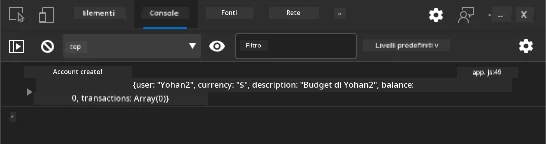

**Cosa dovresti vedere:**
- **Stato di caricamento** appare sul pulsante di invio
- **Log della console** mostrano informazioni dettagliate sul processo
- **Messaggio di successo** appare quando la creazione dell'account ha successo
- **Il modulo si reimposta** automaticamente dopo l'invio riuscito

> 🔒 **Considerazione sulla sicurezza**: Attualmente, i dati viaggiano su HTTP, che non è sicuro per la produzione. Nelle applicazioni reali, utilizza sempre HTTPS per crittografare la trasmissione dei dati. Scopri di più su [sicurezza HTTPS](https://en.wikipedia.org/wiki/HTTPS) e perché è essenziale per proteggere i dati degli utenti.

### 🔄 **Verifica pedagogica**
**Integrazione di JavaScript moderno**: Verifica la tua comprensione della gestione asincrona dei moduli:
- ✅ Come cambia il comportamento predefinito del modulo con `event.preventDefault()`?
- ✅ Perché l'API FormData è più efficiente rispetto alla raccolta manuale dei campi?
- ✅ Come i modelli async/await migliorano la leggibilità del codice?
- ✅ Qual è il ruolo della gestione degli errori nell'esperienza utente?

**Architettura del sistema**: La gestione del modulo dimostra:
- **Programmazione basata sugli eventi**: I moduli rispondono alle azioni dell'utente senza ricaricare la pagina
- **Comunicazione asincrona**: Le richieste al server non bloccano l'interfaccia utente
- **Gestione degli errori**: Degradazione graduale quando le richieste di rete falliscono
- **Gestione dello stato**: Gli aggiornamenti dell'interfaccia utente riflettono le risposte del server
- **Miglioramento progressivo**: La funzionalità di base funziona, JavaScript la migliora

**Modelli professionali**: Hai implementato:
- **Responsabilità singola**: Le funzioni hanno scopi chiari e mirati
- **Confini degli errori**: I blocchi try/catch prevengono i crash dell'applicazione
- **Feedback utente**: Stati di caricamento e messaggi di successo/errore
- **Trasformazione dei dati**: FormData in JSON per la comunicazione con il server

## Validazione completa del modulo

La validazione del modulo previene l'esperienza frustrante di scoprire errori solo dopo l'invio. Come i sistemi ridondanti sulla Stazione Spaziale Internazionale, una validazione efficace impiega più livelli di controlli di sicurezza.

L'approccio ottimale combina la validazione a livello di browser per un feedback immediato, la validazione JavaScript per migliorare l'esperienza utente e la validazione lato server per la sicurezza e l'integrità dei dati. Questa ridondanza garantisce sia la soddisfazione dell'utente che la protezione del sistema.

### Comprendere i livelli di validazione

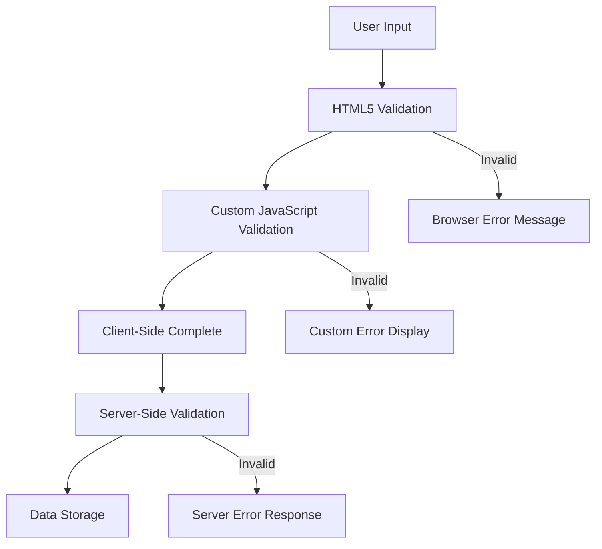

**Strategia di validazione multilivello:**
- **Validazione HTML5**: Controlli immediati basati sul browser
- **Validazione JavaScript**: Logica personalizzata e esperienza utente migliorata
- **Validazione lato server**: Controlli finali di sicurezza e integrità dei dati
- **Miglioramento progressivo**: Funziona anche se JavaScript è disabilitato

### Attributi di validazione HTML5

**Strumenti di validazione moderni a tua disposizione:**

| Attributo | Scopo | Esempio di utilizzo | Comportamento del browser |
|-----------|-------|---------------------|---------------------------|
| `required` | Campi obbligatori | `<input required>` | Impedisce l'invio vuoto |
| `minlength`/`maxlength` | Limiti di lunghezza del testo | `<input maxlength="20">` | Impone limiti di caratteri |
| `min`/`max` | Intervalli numerici | `<input min="0" max="1000">` | Valida i limiti numerici |
| `pattern` | Regole regex personalizzate | `<input pattern="[A-Za-z]+">` | Corrisponde a formati specifici |
| `type` | Validazione del tipo di dati | `<input type="email">` | Validazione specifica per formato |

### Stile di validazione CSS

**Crea un feedback visivo per gli stati di validazione:**

```css
/* Valid input styling */
input:valid {
  border-color: #28a745;
  background-color: #f8fff9;
}

/* Invalid input styling */
input:invalid {
  border-color: #dc3545;
  background-color: #fff5f5;
}

/* Focus states for better accessibility */
input:focus:valid {
  box-shadow: 0 0 0 0.2rem rgba(40, 167, 69, 0.25);
}

input:focus:invalid {
  box-shadow: 0 0 0 0.2rem rgba(220, 53, 69, 0.25);
}
```

**Cosa realizzano questi segnali visivi:**
- **Bordi verdi**: Indicano una validazione riuscita, come i semafori verdi
- **Bordi rossi**: Segnalano errori di validazione che richiedono attenzione
- **Evidenziazione del focus**: Fornisce un contesto visivo chiaro per la posizione corrente dell'input
- **Stile coerente**: Stabilisce modelli di interfaccia prevedibili che gli utenti possono imparare

> 💡 **Suggerimento professionale**: Usa le pseudo-classi CSS `:valid` e `:invalid` per fornire un feedback visivo immediato mentre gli utenti digitano, creando un'interfaccia reattiva e utile.

### Implementazione di una validazione completa

Miglioriamo il tuo modulo di registrazione con una validazione robusta che offre un'eccellente esperienza utente e qualità dei dati:

```html
<form id="registerForm" method="POST" novalidate>
  <div class="form-group">
    <label for="user">Username <span class="required">*</span></label>
    <input id="user" name="user" type="text" required 
           minlength="3" maxlength="20" 
           pattern="[a-zA-Z0-9_]+" 
           autocomplete="username"
           title="Username must be 3-20 characters, letters, numbers, and underscores only">
    <small class="form-text">Choose a unique username (3-20 characters)</small>
  </div>
  
  <div class="form-group">
    <label for="currency">Currency <span class="required">*</span></label>
    <input id="currency" name="currency" type="text" required 
           value="$" maxlength="3" 
           pattern="[A-Z$€£¥₹]+" 
           title="Enter a valid currency symbol or code">
    <small class="form-text">Currency symbol (e.g., $, €, £)</small>
  </div>
  
  <div class="form-group">
    <label for="description">Account Description</label>
    <input id="description" name="description" type="text" 
           maxlength="100" 
           placeholder="Personal savings, checking, etc.">
    <small class="form-text">Optional description (up to 100 characters)</small>
  </div>
  
  <div class="form-group">
    <label for="balance">Starting Balance</label>
    <input id="balance" name="balance" type="number" 
           value="0" min="0" step="0.01" 
           title="Enter a positive number for your starting balance">
    <small class="form-text">Initial account balance (minimum $0.00)</small>
  </div>
  
  <button type="submit">Create Account</button>
</form>
```

**Comprendere la validazione avanzata:**
- **Combina** indicatori di campi obbligatori con descrizioni utili
- **Include** attributi `pattern` per la validazione del formato
- **Fornisce** attributi `title` per l'accessibilità e i tooltip
- **Aggiunge** testo di aiuto per guidare l'input dell'utente
- **Utilizza** una struttura HTML semantica per una migliore accessibilità

### Regole di validazione avanzate

**Cosa realizza ogni regola di validazione:**

| Campo | Regole di validazione | Vantaggio per l'utente |
|-------|-----------------------|------------------------|
| Nome utente | `required`, `minlength="3"`, `maxlength="20"`, `pattern="[a-zA-Z0-9_]+"` | Garantisce identificatori validi e unici |
| Valuta | `required`, `maxlength="3"`, `pattern="[A-Z$€£¥₹]+"` | Accetta simboli di valuta comuni |
| Saldo | `min="0"`, `step="0.01"`, `type="number"` | Impedisce saldi negativi |
| Descrizione | `maxlength="100"` | Limiti di lunghezza ragionevoli |

### Testare il comportamento della validazione

**Prova questi scenari di validazione:**
1. **Invia** il modulo con campi obbligatori vuoti
2. **Inserisci** un nome utente più corto di 3 caratteri
3. **Prova** caratteri speciali nel campo nome utente
4. **Inserisci** un importo di saldo negativo

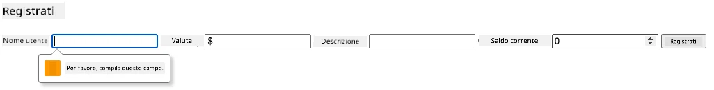

**Cosa osserverai:**
- **Il browser mostra** messaggi di validazione nativi
- **Cambiamenti di stile** basati sugli stati `:valid` e `:invalid`
- **L'invio del modulo** è impedito finché tutte le validazioni non sono superate
- **Il focus si sposta automaticamente** sul primo campo non valido

### Validazione lato client vs lato server

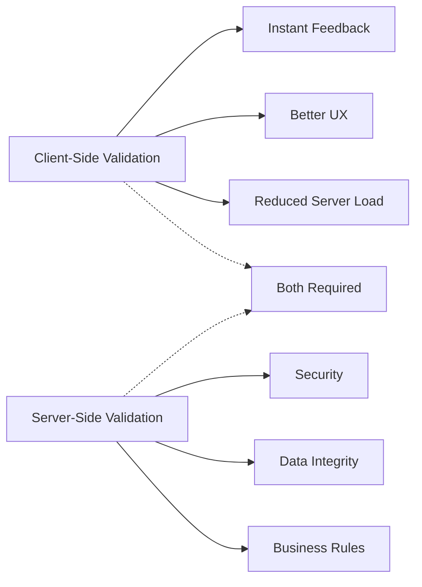

**Perché hai bisogno di entrambi i livelli:**
- **Validazione lato client**: Fornisce feedback immediato e migliora l'esperienza utente
- **Validazione lato server**: Garantisce sicurezza e gestisce regole aziendali complesse
- **Approccio combinato**: Crea applicazioni robuste, user-friendly e sicure
- **Miglioramento progressivo**: Funziona anche quando JavaScript è disabilitato

> 🛡️ **Promemoria sulla sicurezza**: Non fidarti mai solo della validazione lato client! Gli utenti malintenzionati possono bypassare i controlli lato client, quindi la validazione lato server è essenziale per la sicurezza e l'integrità dei dati.

### ⚡ **Cosa puoi fare nei prossimi 5 minuti**
- [ ] Testa il tuo modulo con dati non validi per vedere i messaggi di validazione
- [ ] Prova a inviare il modulo con JavaScript disabilitato per vedere la validazione HTML5
- [ ] Apri gli strumenti per sviluppatori del browser e ispeziona i dati del modulo inviati al server
- [ ] Sperimenta con diversi tipi di input per vedere i cambiamenti della tastiera su dispositivi mobili

### 🎯 **Cosa puoi realizzare in quest'ora**
- [ ] Completa il quiz post-lezione e comprendi i concetti di gestione dei moduli
- [ ] Implementa la sfida di validazione completa con feedback in tempo reale
- [ ] Aggiungi uno stile CSS per creare moduli dall'aspetto professionale
- [ ] Crea una gestione degli errori per nomi utente duplicati e errori del server
- [ ] Aggiungi campi di conferma password con validazione corrispondente

### 📅 **Il tuo viaggio settimanale per la padronanza dei moduli**
- [ ] Completa l'app bancaria completa con funzionalità avanzate del modulo
- [ ] Implementa la capacità di caricare file per foto profilo o documenti
- [ ] Aggiungi moduli a più passaggi con indicatori di progresso e gestione dello stato
- [ ] Crea moduli dinamici che si adattano in base alle selezioni dell'utente
- [ ] Implementa il salvataggio automatico del modulo e il recupero per una migliore esperienza utente
- [ ] Aggiungi validazioni avanzate come la verifica e-mail e la formattazione del numero di telefono

### 🌟 **Il tuo mese di padronanza dello sviluppo frontend**
- [ ] Crea applicazioni di moduli complessi con logica condizionale e flussi di lavoro
- [ ] Impara librerie e framework per moduli per uno sviluppo rapido
- [ ] Padroneggia le linee guida sull'accessibilità e i principi di design inclusivo
- [ ] Implementa l'internazionalizzazione e la localizzazione per moduli globali
- [ ] Crea librerie di componenti per moduli riutilizzabili e sistemi di design
- [ ] Contribuisci a progetti open source sui moduli e condividi le migliori pratiche

## 🎯 La tua timeline per la padronanza dello sviluppo dei moduli

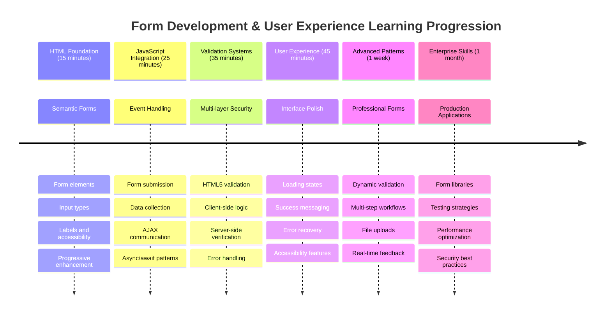

### 🛠️ Riepilogo del tuo toolkit per lo sviluppo dei moduli

Dopo aver completato questa lezione, hai ora padroneggiato:
- **Moduli HTML5**: Struttura semantica, tipi di input e funzionalità di accessibilità
- **Gestione dei moduli in JavaScript**: Gestione degli eventi, raccolta dati e comunicazione AJAX
- **Architettura di validazione**: Validazione multilivello per sicurezza ed esperienza utente
- **Programmazione asincrona**: Fetch API moderna e modelli async/await
- **Gestione degli errori**: Gestione completa degli errori e sistemi di feedback per gli utenti
- **Progettazione dell'esperienza utente**: Stati di caricamento, messaggi di successo e recupero dagli errori
- **Miglioramento progressivo**: Moduli che funzionano su tutti i browser e capacità

**Applicazioni reali**: Le tue competenze nello sviluppo di moduli si applicano direttamente a:
- **Applicazioni di e-commerce**: Processi di checkout, registrazione account e moduli di pagamento
- **Software aziendale**: Sistemi di inserimento dati, interfacce di reportistica e applicazioni di flusso di lavoro
- **Gestione dei contenuti**: Piattaforme di pubblicazione, contenuti generati dagli utenti e interfacce amministrative
- **Applicazioni finanziarie**: Interfacce bancarie, piattaforme di investimento e sistemi di transazione
- **Sistemi sanitari**: Portali per pazienti, prenotazione di appuntamenti e moduli per cartelle cliniche
- **Piattaforme educative**: Registrazione ai corsi, strumenti di valutazione e gestione dell'apprendimento

**Competenze professionali acquisite**: Ora puoi:
- **Progettare** moduli accessibili che funzionano per tutti gli utenti, inclusi quelli con disabilità
- **Implementare** una validazione sicura dei moduli che previene la corruzione dei dati e le vulnerabilità di sicurezza
- **Creare** interfacce utente reattive che forniscono feedback e indicazioni chiare
- **Debuggare** interazioni complesse dei moduli utilizzando strumenti per sviluppatori del browser e analisi di rete
- **Ottimizzare** le prestazioni dei moduli attraverso strategie di gestione e validazione dei dati efficienti

**Concetti di sviluppo frontend padroneggiati**:
- **Architettura basata sugli eventi**: Gestione delle interazioni utente e dei sistemi di risposta
- **Programmazione asincrona**: Comunicazione con il server non bloccante e gestione degli errori
- **Validazione dei dati**: Controlli di sicurezza e integrità lato client e server
- **Progettazione dell'esperienza utente**: Interfacce intuitive che guidano gli utenti verso il successo
- **Ingegneria dell'accessibilità**: Design inclusivo che funziona per le diverse esigenze degli utenti

**Livello successivo**: Sei pronto per esplorare librerie avanzate per moduli, implementare regole di validazione complesse o costruire sistemi di raccolta dati di livello aziendale!

🌟 **Obiettivo raggiunto**: Hai costruito un sistema completo di gestione dei moduli con validazione professionale, gestione degli errori e modelli di esperienza utente!

---


---

## Sfida GitHub Copilot Agent 🚀

Usa la modalità Agent per completare la seguente sfida:

**Descrizione:** Migliora il modulo di registrazione con una validazione completa lato client e un feedback per l'utente. Questa sfida ti aiuterà a praticare la validazione dei moduli, la gestione degli errori e il miglioramento dell'esperienza utente con feedback interattivi.
**Prompt:** Crea un sistema completo di validazione per il modulo di registrazione che includa: 1) Feedback di validazione in tempo reale per ogni campo mentre l'utente digita, 2) Messaggi di validazione personalizzati che appaiono sotto ogni campo di input, 3) Un campo di conferma della password con validazione di corrispondenza, 4) Indicatori visivi (come segni di spunta verdi per i campi validi e avvisi rossi per quelli non validi), 5) Un pulsante di invio che si abilita solo quando tutte le validazioni sono superate. Usa gli attributi di validazione di HTML5, CSS per lo stile degli stati di validazione e JavaScript per il comportamento interattivo.

Scopri di più su [agent mode](https://code.visualstudio.com/blogs/2025/02/24/introducing-copilot-agent-mode) qui.

## 🚀 Sfida

Mostra un messaggio di errore nell'HTML se l'utente esiste già.

Ecco un esempio di come potrebbe apparire la pagina di login finale dopo un po' di styling:

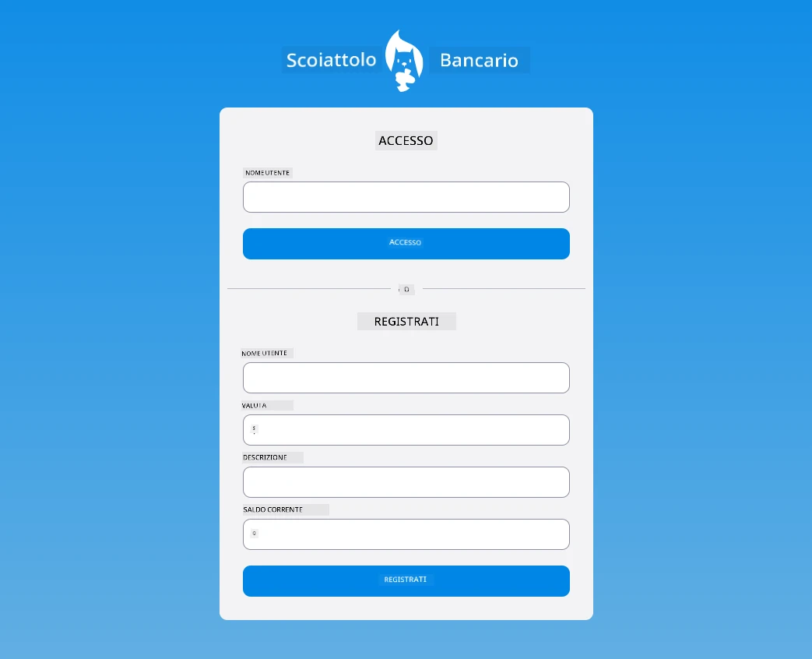

## Quiz post-lezione

[Quiz post-lezione](https://ff-quizzes.netlify.app/web/quiz/44)

## Revisione e studio autonomo

Gli sviluppatori sono diventati molto creativi nella costruzione dei moduli, specialmente per quanto riguarda le strategie di validazione. Scopri diversi flussi di moduli dando un'occhiata a [CodePen](https://codepen.com); riesci a trovare moduli interessanti e ispiratori?

## Compito

[Stilizza la tua app bancaria](assignment.md)

---

**Disclaimer**:  
Questo documento è stato tradotto utilizzando il servizio di traduzione AI [Co-op Translator](https://github.com/Azure/co-op-translator). Sebbene ci impegniamo per garantire l'accuratezza, si prega di notare che le traduzioni automatiche possono contenere errori o imprecisioni. Il documento originale nella sua lingua nativa dovrebbe essere considerato la fonte autorevole. Per informazioni critiche, si raccomanda una traduzione professionale umana. Non siamo responsabili per eventuali incomprensioni o interpretazioni errate derivanti dall'uso di questa traduzione.