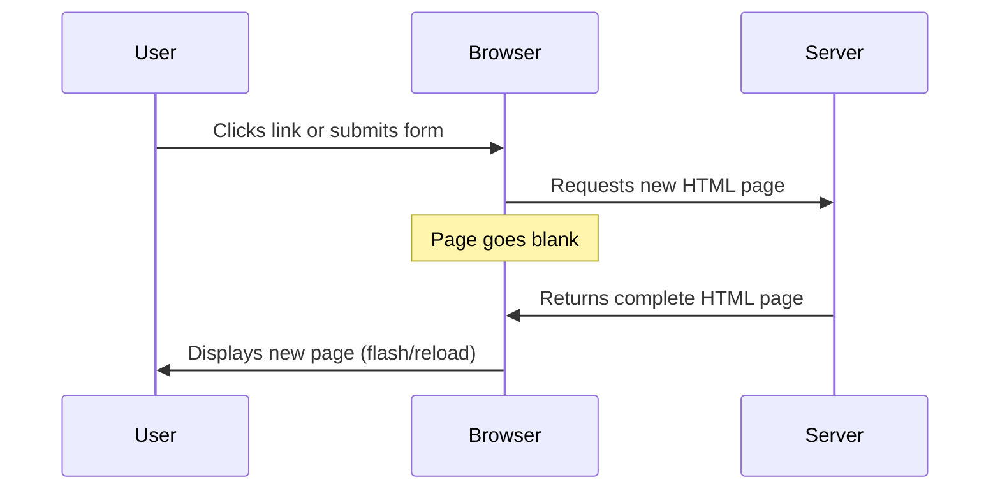
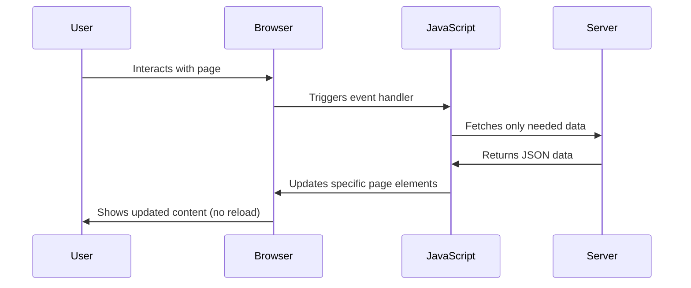
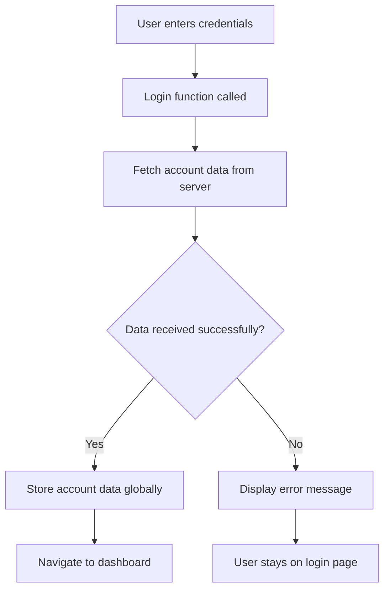
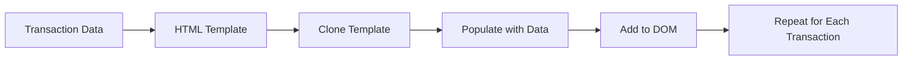

<!--
CO_OP_TRANSLATOR_METADATA:
{
  "original_hash": "2c1164912414820c8efd699b43f64954",
  "translation_date": "2025-10-22T23:33:30+00:00",
  "source_file": "7-bank-project/3-data/README.md",
  "language_code": "it"
}
-->
# Costruire un'app bancaria Parte 3: Metodi per recuperare e utilizzare i dati

Pensa al computer dell'Enterprise in Star Trek: quando il Capitano Picard chiede lo stato della nave, le informazioni appaiono istantaneamente senza che l'interfaccia si blocchi o si ricostruisca completamente. Quel flusso continuo di informazioni è esattamente ciò che stiamo costruendo qui con il recupero dinamico dei dati.

Al momento, la tua app bancaria è come un giornale stampato: informativa ma statica. La trasformeremo in qualcosa di simile al centro di controllo della NASA, dove i dati fluiscono continuamente e si aggiornano in tempo reale senza interrompere il flusso di lavoro dell'utente.

Imparerai a comunicare con i server in modo asincrono, gestire i dati che arrivano in momenti diversi e trasformare informazioni grezze in qualcosa di significativo per i tuoi utenti. Questa è la differenza tra una demo e un software pronto per la produzione.

## Quiz Pre-Lettura

[Quiz pre-lettura](https://ff-quizzes.netlify.app/web/quiz/45)

### Prerequisiti

Prima di immergerti nel recupero dei dati, assicurati di avere questi componenti pronti:

- **Lezione precedente**: Completa il [Modulo di Login e Registrazione](../2-forms/README.md) - costruiremo su questa base
- **Server locale**: Installa [Node.js](https://nodejs.org) e [esegui l'API del server](../api/README.md) per fornire i dati dell'account
- **Connessione API**: Testa la connessione al server con questo comando:

```bash
curl http://localhost:5000/api
# Expected response: "Bank API v1.0.0"
```

Questo rapido test garantisce che tutti i componenti comunichino correttamente:
- Verifica che Node.js funzioni correttamente sul tuo sistema
- Conferma che il server API sia attivo e risponda
- Valida che la tua app possa raggiungere il server (come controllare il contatto radio prima di una missione)

---

## Comprendere il recupero dei dati nelle moderne app web

Il modo in cui le applicazioni web gestiscono i dati è evoluto drasticamente negli ultimi due decenni. Comprendere questa evoluzione ti aiuterà ad apprezzare perché tecniche moderne come AJAX e l'API Fetch sono così potenti e perché sono diventate strumenti essenziali per gli sviluppatori web.

Esploriamo come funzionavano i siti web tradizionali rispetto alle applicazioni dinamiche e reattive che costruiamo oggi.

### Applicazioni Multi-Pagina Tradizionali (MPA)

Nei primi giorni del web, ogni clic era come cambiare canale su una vecchia televisione: lo schermo diventava nero, poi lentamente si sintonizzava sul nuovo contenuto. Questa era la realtà delle prime applicazioni web, dove ogni interazione significava ricostruire completamente l'intera pagina da zero.




**Perché questo approccio sembrava macchinoso:**
- Ogni clic significava ricostruire l'intera pagina da zero
- Gli utenti venivano interrotti nel bel mezzo dei loro pensieri da quei fastidiosi lampeggiamenti della pagina
- La tua connessione internet lavorava il doppio scaricando ripetutamente la stessa intestazione e il piè di pagina
- Le app sembravano più simili a un archivio di documenti che a un software

### Applicazioni Single-Page Moderne (SPA)

AJAX (Asynchronous JavaScript and XML) ha completamente cambiato questo paradigma. Come il design modulare della Stazione Spaziale Internazionale, dove gli astronauti possono sostituire singoli componenti senza ricostruire l'intera struttura, AJAX ci consente di aggiornare parti specifiche di una pagina web senza ricaricare tutto. Nonostante il nome menzioni XML, oggi usiamo principalmente JSON, ma il principio di base rimane: aggiornare solo ciò che deve cambiare.




**Perché le SPA sono migliori:**
- Vengono aggiornate solo le parti che effettivamente cambiano (intelligente, vero?)
- Niente più interruzioni brusche: gli utenti rimangono concentrati
- Meno dati viaggiano sulla rete, il che significa caricamenti più veloci
- Tutto sembra fluido e reattivo, come le app sul tuo telefono

### L'evoluzione verso l'API Fetch moderna

I browser moderni forniscono l'[`API Fetch`](https://developer.mozilla.org/docs/Web/API/Fetch_API), che sostituisce la vecchia [`XMLHttpRequest`](https://developer.mozilla.org/docs/Web/API/XMLHttpRequest/Using_XMLHttpRequest). Come la differenza tra usare un telegrafo e inviare un'email, l'API Fetch utilizza le promesse per un codice asincrono più pulito e gestisce naturalmente JSON.

| Caratteristica | XMLHttpRequest | API Fetch |
|----------------|----------------|-----------|
| **Sintassi** | Complessa basata su callback | Pulita basata su promesse |
| **Gestione JSON** | Richiede parsing manuale | Metodo `.json()` integrato |
| **Gestione errori** | Informazioni limitate sugli errori | Dettagli completi sugli errori |
| **Supporto moderno** | Compatibilità legacy | Promesse ES6+ e async/await |

> 💡 **Compatibilità Browser**: Buone notizie: l'API Fetch funziona in tutti i browser moderni! Se sei curioso di conoscere versioni specifiche, [caniuse.com](https://caniuse.com/fetch) ha la storia completa sulla compatibilità.
> 
**In sintesi:**
- Funziona perfettamente su Chrome, Firefox, Safari e Edge (praticamente ovunque si trovino i tuoi utenti)
- Solo Internet Explorer necessita di aiuto extra (e onestamente, è ora di lasciarlo andare)
- Ti prepara perfettamente per i modelli eleganti async/await che useremo più avanti

### Implementare il Login Utente e il Recupero dei Dati

Ora implementeremo il sistema di login che trasforma la tua app bancaria da una visualizzazione statica a un'applicazione funzionale. Come i protocolli di autenticazione utilizzati in strutture militari sicure, verificheremo le credenziali dell'utente e poi forniremo accesso ai loro dati specifici.

Costruiremo questo gradualmente, partendo dall'autenticazione di base e poi aggiungendo le capacità di recupero dei dati.

#### Passo 1: Creare la base della funzione di Login

Apri il file `app.js` e aggiungi una nuova funzione `login`. Questa gestirà il processo di autenticazione dell'utente:

```javascript
async function login() {
  const loginForm = document.getElementById('loginForm');
  const user = loginForm.user.value;
}
```

**Analizziamo questo codice:**
- La parola chiave `async`? Sta dicendo a JavaScript "ehi, questa funzione potrebbe dover aspettare qualcosa"
- Stiamo recuperando il nostro modulo dalla pagina (niente di complicato, lo troviamo semplicemente tramite il suo ID)
- Poi estraiamo ciò che l'utente ha digitato come nome utente
- Ecco un trucco interessante: puoi accedere a qualsiasi input del modulo tramite il suo attributo `name` - niente bisogno di chiamate extra a getElementById!

> 💡 **Pattern di Accesso ai Moduli**: Ogni controllo del modulo può essere accessibile tramite il suo nome (impostato nell'HTML usando l'attributo `name`) come proprietà dell'elemento modulo. Questo fornisce un modo pulito e leggibile per ottenere i dati del modulo.

#### Passo 2: Creare la funzione di recupero dei dati dell'account

Successivamente, creeremo una funzione dedicata per recuperare i dati dell'account dal server. Questo segue lo stesso schema della funzione di registrazione ma si concentra sul recupero dei dati:

```javascript
async function getAccount(user) {
  try {
    const response = await fetch('//localhost:5000/api/accounts/' + encodeURIComponent(user));
    return await response.json();
  } catch (error) {
    return { error: error.message || 'Unknown error' };
  }
}
```

**Cosa fa questo codice:**
- **Utilizza** l'API `fetch` moderna per richiedere dati in modo asincrono
- **Costruisce** un URL di richiesta GET con il parametro del nome utente
- **Applica** `encodeURIComponent()` per gestire in modo sicuro i caratteri speciali negli URL
- **Converte** la risposta in formato JSON per una facile manipolazione dei dati
- **Gestisce** gli errori in modo elegante restituendo un oggetto di errore invece di bloccarsi

> ⚠️ **Nota di Sicurezza**: La funzione `encodeURIComponent()` gestisce i caratteri speciali negli URL. Come i sistemi di codifica utilizzati nelle comunicazioni navali, garantisce che il tuo messaggio arrivi esattamente come previsto, impedendo che caratteri come "#" o "&" vengano interpretati erroneamente.
> 
**Perché è importante:**
- Impedisce ai caratteri speciali di rompere gli URL
- Protegge da attacchi di manipolazione degli URL
- Garantisce che il server riceva i dati previsti
- Segue pratiche di codifica sicure

#### Comprendere le richieste HTTP GET

Ecco qualcosa che potrebbe sorprenderti: quando usi `fetch` senza opzioni extra, crea automaticamente una richiesta [`GET`](https://developer.mozilla.org/docs/Web/HTTP/Methods/GET). Questo è perfetto per ciò che stiamo facendo: chiedere al server "ehi, posso vedere i dati dell'account di questo utente?"

Pensa alle richieste GET come chiedere gentilmente di prendere in prestito un libro dalla biblioteca: stai chiedendo di vedere qualcosa che già esiste. Le richieste POST (che abbiamo usato per la registrazione) sono più simili a inviare un nuovo libro da aggiungere alla collezione.

| Richiesta GET | Richiesta POST |
|---------------|---------------|
| **Scopo** | Recuperare dati esistenti | Inviare nuovi dati al server |
| **Parametri** | Nel percorso/query string dell'URL | Nel corpo della richiesta |
| **Caching** | Può essere memorizzata dai browser | Non tipicamente memorizzata |
| **Sicurezza** | Visibile nell'URL/log | Nascosta nel corpo della richiesta |

#### Passo 3: Unire tutto insieme

Ora arriva la parte soddisfacente: colleghiamo la funzione di recupero dei dati dell'account al processo di login. Questo è il momento in cui tutto si incastra:

```javascript
async function login() {
  const loginForm = document.getElementById('loginForm');
  const user = loginForm.user.value;
  const data = await getAccount(user);

  if (data.error) {
    return console.log('loginError', data.error);
  }

  account = data;
  navigate('/dashboard');
}
```

Questa funzione segue una sequenza chiara:
- Estrae il nome utente dall'input del modulo
- Richiede i dati dell'account dell'utente al server
- Gestisce eventuali errori che si verificano durante il processo
- Memorizza i dati dell'account e naviga al dashboard in caso di successo

> 🎯 **Pattern Async/Await**: Poiché `getAccount` è una funzione asincrona, utilizziamo la parola chiave `await` per sospendere l'esecuzione fino a quando il server non risponde. Questo impedisce al codice di continuare con dati non definiti.

#### Passo 4: Creare una memoria per i tuoi dati

La tua app ha bisogno di un posto dove ricordare le informazioni dell'account una volta caricate. Pensa a questo come alla memoria a breve termine della tua app: un luogo per tenere i dati dell'utente corrente a portata di mano. Aggiungi questa riga all'inizio del tuo file `app.js`:

```javascript
// This holds the current user's account data
let account = null;
```

**Perché ne abbiamo bisogno:**
- Mantiene i dati dell'account accessibili da qualsiasi parte della tua app
- Iniziare con `null` significa "nessuno è ancora loggato"
- Viene aggiornato quando qualcuno effettua il login o la registrazione con successo
- Funziona come una fonte unica di verità - nessuna confusione su chi è loggato

#### Passo 5: Collegare il modulo

Ora colleghiamo la tua nuova funzione di login al modulo HTML. Aggiorna il tag del modulo in questo modo:

```html
<form id="loginForm" action="javascript:login()">
  <!-- Your existing form inputs -->
</form>
```

**Cosa fa questa piccola modifica:**
- Impedisce al modulo di eseguire il comportamento predefinito "ricarica l'intera pagina"
- Chiama la tua funzione JavaScript personalizzata
- Mantiene tutto fluido e simile a un'app single-page
- Ti dà il controllo completo su ciò che accade quando gli utenti cliccano su "Login"

#### Passo 6: Migliorare la funzione di registrazione

Per coerenza, aggiorna la tua funzione `register` per memorizzare anche i dati dell'account e navigare al dashboard:

```javascript
// Add these lines at the end of your register function
account = result;
navigate('/dashboard');
```

**Questo miglioramento offre:**
- **Transizione fluida** dalla registrazione al dashboard
- **Esperienza utente coerente** tra i flussi di login e registrazione
- **Accesso immediato** ai dati dell'account dopo una registrazione riuscita

#### Testare la tua implementazione



**È ora di metterlo alla prova:**
1. Crea un nuovo account per assicurarti che tutto funzioni
2. Prova a effettuare il login con le stesse credenziali
3. Dai un'occhiata alla console del tuo browser (F12) se qualcosa sembra non funzionare
4. Assicurati di arrivare al dashboard dopo un login riuscito

Se qualcosa non funziona, non farti prendere dal panico! La maggior parte dei problemi sono semplici da risolvere, come errori di battitura o dimenticare di avviare il server API.

#### Una parola veloce sulla magia Cross-Origin

Potresti chiederti: "Come fa la mia app web a comunicare con questo server API se funzionano su porte diverse?" Ottima domanda! Questo tocca qualcosa che ogni sviluppatore web incontra prima o poi.

> 🔒 **Sicurezza Cross-Origin**: I browser applicano una "same-origin policy" per impedire comunicazioni non autorizzate tra domini diversi. Come il sistema di controllo degli accessi al Pentagono, verificano che la comunicazione sia autorizzata prima di consentire il trasferimento dei dati.
> 
**Nel nostro setup:**
- La tua app web funziona su `localhost:3000` (server di sviluppo)
- Il tuo server API funziona su `localhost:5000` (server backend)
- Il server API include intestazioni [CORS](https://developer.mozilla.org/docs/Web/HTTP/CORS) che autorizzano esplicitamente la comunicazione dalla tua app web

Questa configurazione rispecchia lo sviluppo nel mondo reale, dove le applicazioni frontend e backend funzionano tipicamente su server separati.

> 📚 **Per saperne di più**: Approfondisci gli API e il recupero dei dati con questo modulo completo di [Microsoft Learn sugli API](https://docs.microsoft.com/learn/modules/use-apis-discover-museum-art/?WT.mc_id=academic-77807-sagibbon).

## Dare vita ai tuoi dati in HTML

Ora renderemo i dati recuperati visibili agli utenti attraverso la manipolazione del DOM. Come il processo di sviluppo delle fotografie in una camera oscura, trasformeremo i dati invisibili in qualcosa che gli utenti possono vedere e con cui possono interagire.

La manipolazione del DOM è la tecnica che trasforma le pagine web statiche in applicazioni dinamiche che aggiornano il loro contenuto in base alle interazioni degli utenti e alle risposte del server.

### Scegliere lo strumento giusto per il lavoro

Quando si tratta di aggiornare il tuo HTML con JavaScript, hai diverse opzioni. Pensa a queste come a diversi strumenti in una cassetta degli attrezzi: ognuno perfetto per lavori specifici.

| Metodo | Per cosa è ottimo | Quando usarlo | Livello di sicurezza |
|--------|-------------------|---------------|-----------------------|
| `textContent` | Mostrare dati utente in modo sicuro | Ogni volta che mostri testo | ✅ Molto sicuro |
| `createElement()` + `append()` | Creare layout complessi | Creare nuove sezioni/liste | ✅ Molto sicuro |
| `innerHTML` | Impostare contenuti HTML | ⚠️ Cerca di evitarlo | ❌ Rischioso |

#### Il modo sicuro per mostrare il testo: textContent

La proprietà [`textContent`](https://developer.mozilla.org/docs/Web/API/Node/textContent) è la tua migliore amica quando si tratta di mostrare i dati degli utenti. È come avere un buttafuori per la tua pagina web: niente di dannoso passa:

```javascript
// The safe, reliable way to update text
const balanceElement = document.getElementById('balance');
balanceElement.textContent = account.balance;
```

**Vantaggi di textContent:**
- Tratta tutto come testo semplice (impedisce l'esecuzione di script)
- Cancella automaticamente il contenuto esistente
- Efficiente per aggiornamenti di testo semplici
- Fornisce sicurezza integrata contro contenuti dannosi

#### Creare elementi HTML dinamici
Per contenuti più complessi, combina [`document.createElement()`](https://developer.mozilla.org/docs/Web/API/Document/createElement) con il metodo [`append()`](https://developer.mozilla.org/docs/Web/API/ParentNode/append):

```javascript
// Safe way to create new elements
const transactionItem = document.createElement('div');
transactionItem.className = 'transaction-item';
transactionItem.textContent = `${transaction.date}: ${transaction.description}`;
container.append(transactionItem);
```

**Comprendere questo approccio:**
- **Crea** nuovi elementi DOM in modo programmatico
- **Mantiene** il pieno controllo sugli attributi e sui contenuti degli elementi
- **Consente** strutture di elementi complesse e nidificate
- **Preserva** la sicurezza separando la struttura dal contenuto

> ⚠️ **Considerazione sulla sicurezza**: Sebbene [`innerHTML`](https://developer.mozilla.org/docs/Web/API/Element/innerHTML) appaia in molti tutorial, può eseguire script incorporati. Come i protocolli di sicurezza al CERN che impediscono l'esecuzione di codice non autorizzato, l'uso di `textContent` e `createElement` offre alternative più sicure.
> 
**Rischi di innerHTML:**
- Esegue qualsiasi tag `<script>` nei dati dell'utente
- Vulnerabile agli attacchi di iniezione di codice
- Crea potenziali vulnerabilità di sicurezza
- Le alternative più sicure che stiamo utilizzando offrono funzionalità equivalenti

### Rendere gli errori comprensibili per gli utenti

Attualmente, gli errori di accesso appaiono solo nella console del browser, che è invisibile agli utenti. Come la differenza tra le diagnosi interne di un pilota e il sistema di informazioni per i passeggeri, dobbiamo comunicare informazioni importanti attraverso il canale appropriato.

Implementare messaggi di errore visibili fornisce agli utenti un feedback immediato su cosa è andato storto e su come procedere.

#### Passaggio 1: Aggiungi uno spazio per i messaggi di errore

Per prima cosa, diamo ai messaggi di errore una posizione nel tuo HTML. Aggiungi questo proprio prima del pulsante di accesso, in modo che gli utenti lo vedano naturalmente:

```html
<!-- This is where error messages will appear -->
<div id="loginError" role="alert"></div>
<button>Login</button>
```

**Cosa sta succedendo qui:**
- Stiamo creando un contenitore vuoto che rimane invisibile fino a quando non è necessario
- È posizionato dove gli utenti guardano naturalmente dopo aver cliccato su "Accedi"
- Quel `role="alert"` è un tocco carino per i lettori di schermo - dice alla tecnologia assistiva "ehi, questo è importante!"
- L'`id` univoco offre al nostro JavaScript un facile bersaglio

#### Passaggio 2: Crea una funzione helper utile

Creiamo una piccola funzione di utilità che può aggiornare il testo di qualsiasi elemento. Questa è una di quelle funzioni "scrivi una volta, usa ovunque" che ti farà risparmiare tempo:

```javascript
function updateElement(id, text) {
  const element = document.getElementById(id);
  element.textContent = text;
}
```

**Vantaggi della funzione:**
- Interfaccia semplice che richiede solo un ID elemento e il contenuto del testo
- Localizza e aggiorna in modo sicuro gli elementi DOM
- Modello riutilizzabile che riduce la duplicazione del codice
- Mantiene un comportamento di aggiornamento coerente in tutta l'applicazione

#### Passaggio 3: Mostra gli errori dove gli utenti possono vederli

Ora sostituiamo quel messaggio nascosto nella console con qualcosa che gli utenti possano effettivamente vedere. Aggiorna la tua funzione di accesso:

```javascript
// Instead of just logging to console, show the user what's wrong
if (data.error) {
  return updateElement('loginError', data.error);
}
```

**Questa piccola modifica fa una grande differenza:**
- I messaggi di errore appaiono proprio dove gli utenti stanno guardando
- Niente più fallimenti silenziosi e misteriosi
- Gli utenti ricevono un feedback immediato e azionabile
- La tua app inizia a sembrare professionale e attenta

Ora, quando testi con un account non valido, vedrai un utile messaggio di errore direttamente sulla pagina!


#### Passaggio 4: Essere inclusivi con l'accessibilità

Ecco qualcosa di interessante su quel `role="alert"` che abbiamo aggiunto prima - non è solo decorativo! Questo piccolo attributo crea ciò che viene chiamato una [Live Region](https://developer.mozilla.org/docs/Web/Accessibility/ARIA/ARIA_Live_Regions) che annuncia immediatamente le modifiche ai lettori di schermo:

```html
<div id="loginError" role="alert"></div>
```

**Perché è importante:**
- Gli utenti di lettori di schermo sentono il messaggio di errore non appena appare
- Tutti ricevono le stesse informazioni importanti, indipendentemente da come navigano
- È un modo semplice per far funzionare la tua app per più persone
- Dimostra che ti importa di creare esperienze inclusive

Piccoli dettagli come questo distinguono i buoni sviluppatori dai grandi!

#### Passaggio 5: Applica lo stesso modello alla registrazione

Per coerenza, implementa la gestione degli errori identica nel tuo modulo di registrazione:

1. **Aggiungi** un elemento di visualizzazione degli errori al tuo HTML di registrazione:
```html
<div id="registerError" role="alert"></div>
```

2. **Aggiorna** la tua funzione di registrazione per utilizzare lo stesso modello di visualizzazione degli errori:
```javascript
if (data.error) {
  return updateElement('registerError', data.error);
}
```

**Vantaggi della gestione coerente degli errori:**
- **Fornisce** un'esperienza utente uniforme in tutti i moduli
- **Riduce** il carico cognitivo utilizzando modelli familiari
- **Semplifica** la manutenzione con codice riutilizzabile
- **Garantisce** che gli standard di accessibilità siano rispettati in tutta l'app

## Creare il tuo dashboard dinamico

Ora trasformeremo il tuo dashboard statico in un'interfaccia dinamica che mostra i dati reali dell'account. Come la differenza tra un orario di volo stampato e i tabelloni delle partenze in tempo reale negli aeroporti, stiamo passando da informazioni statiche a display reattivi e in tempo reale.

Utilizzando le tecniche di manipolazione del DOM che hai imparato, creeremo un dashboard che si aggiorna automaticamente con le informazioni correnti dell'account.

### Conoscere i tuoi dati

Prima di iniziare a costruire, diamo un'occhiata al tipo di dati che il tuo server invia indietro. Quando qualcuno accede con successo, ecco il tesoro di informazioni con cui puoi lavorare:

```json
{
  "user": "test",
  "currency": "$",
  "description": "Test account",
  "balance": 75,
  "transactions": [
    { "id": "1", "date": "2020-10-01", "object": "Pocket money", "amount": 50 },
    { "id": "2", "date": "2020-10-03", "object": "Book", "amount": -10 },
    { "id": "3", "date": "2020-10-04", "object": "Sandwich", "amount": -5 }
  ]
}
```

**Questa struttura dati fornisce:**
- **`user`**: Perfetto per personalizzare l'esperienza ("Bentornata, Sarah!")
- **`currency`**: Garantisce che visualizziamo correttamente gli importi monetari
- **`description`**: Un nome amichevole per l'account
- **`balance`**: L'importante saldo corrente
- **`transactions`**: La cronologia completa delle transazioni con tutti i dettagli

Tutto ciò di cui hai bisogno per costruire un dashboard bancario dall'aspetto professionale!

> 💡 **Suggerimento Pro**: Vuoi vedere subito il tuo dashboard in azione? Usa il nome utente `test` quando accedi - viene pre-caricato con dati di esempio realistici, così puoi vedere tutto funzionare senza dover creare prima transazioni.
> 
**Perché l'account di test è utile:**
- Viene fornito con dati di esempio realistici già caricati
- Perfetto per vedere come vengono visualizzate le transazioni
- Ottimo per testare le funzionalità del tuo dashboard
- Ti risparmia dal dover creare manualmente dati fittizi

### Creare gli elementi di visualizzazione del dashboard

Costruiamo la tua interfaccia del dashboard passo dopo passo, iniziando con le informazioni di riepilogo dell'account e poi passando a funzionalità più complesse come le liste di transazioni.

#### Passaggio 1: Aggiorna la struttura HTML

Per prima cosa, sostituisci la sezione "Saldo" statica con elementi segnaposto dinamici che il tuo JavaScript può popolare:

```html
<section>
  Balance: <span id="balance"></span><span id="currency"></span>
</section>
```

Successivamente, aggiungi una sezione per la descrizione dell'account. Poiché questa funge da titolo per il contenuto del dashboard, utilizza HTML semantico:

```html
<h2 id="description"></h2>
```

**Comprendere la struttura HTML:**
- **Utilizza** elementi `<span>` separati per saldo e valuta per un controllo individuale
- **Applica** ID univoci a ciascun elemento per il targeting JavaScript
- **Segue** HTML semantico utilizzando `<h2>` per la descrizione dell'account
- **Crea** una gerarchia logica per i lettori di schermo e SEO

> ✅ **Approfondimento sull'accessibilità**: La descrizione dell'account funziona come un titolo per il contenuto del dashboard, quindi è contrassegnata semanticamente come intestazione. Scopri di più su come [la struttura delle intestazioni](https://www.nomensa.com/blog/2017/how-structure-headings-web-accessibility) influisce sull'accessibilità. Riesci a identificare altri elementi sulla tua pagina che potrebbero beneficiare dei tag di intestazione?

#### Passaggio 2: Crea la funzione di aggiornamento del dashboard

Ora crea una funzione che popola il tuo dashboard con dati reali dell'account:

```javascript
function updateDashboard() {
  if (!account) {
    return navigate('/login');
  }

  updateElement('description', account.description);
  updateElement('balance', account.balance.toFixed(2));
  updateElement('currency', account.currency);
}
```

**Passo dopo passo, ecco cosa fa questa funzione:**
- **Convalida** che i dati dell'account esistano prima di procedere
- **Reindirizza** gli utenti non autenticati alla pagina di accesso
- **Aggiorna** la descrizione dell'account utilizzando la funzione riutilizzabile `updateElement`
- **Formatta** il saldo per mostrare sempre due decimali
- **Visualizza** il simbolo della valuta appropriato

> 💰 **Formattazione del denaro**: Quel metodo [`toFixed(2)`](https://developer.mozilla.org/docs/Web/JavaScript/Reference/Global_Objects/Number/toFixed) è un salvavita! Garantisce che il tuo saldo sembri sempre denaro reale - "75,00" invece di solo "75". I tuoi utenti apprezzeranno vedere una formattazione familiare della valuta.

#### Passaggio 3: Assicurarsi che il tuo dashboard si aggiorni

Per garantire che il tuo dashboard si aggiorni con i dati correnti ogni volta che qualcuno lo visita, dobbiamo collegarci al tuo sistema di navigazione. Se hai completato l'[esercizio della lezione 1](../1-template-route/assignment.md), questo dovrebbe sembrare familiare. In caso contrario, non preoccuparti - ecco cosa ti serve:

Aggiungi questo alla fine della tua funzione `updateRoute()`:

```javascript
if (typeof route.init === 'function') {
  route.init();
}
```

Quindi aggiorna le tue rotte per includere l'inizializzazione del dashboard:

```javascript
const routes = {
  '/login': { templateId: 'login' },
  '/dashboard': { templateId: 'dashboard', init: updateDashboard }
};
```

**Cosa fa questa configurazione intelligente:**
- Controlla se una rotta ha un codice di inizializzazione speciale
- Esegue automaticamente quel codice quando la rotta viene caricata
- Garantisce che il tuo dashboard mostri sempre dati freschi e attuali
- Mantiene la logica di routing pulita e organizzata

#### Testare il tuo dashboard

Dopo aver implementato queste modifiche, testa il tuo dashboard:

1. **Accedi** con un account di test
2. **Verifica** che vieni reindirizzato al dashboard
3. **Controlla** che la descrizione dell'account, il saldo e la valuta siano visualizzati correttamente
4. **Prova a disconnetterti e rientrare** per garantire che i dati vengano aggiornati correttamente

Il tuo dashboard dovrebbe ora visualizzare informazioni dinamiche sull'account che si aggiornano in base ai dati dell'utente connesso!

## Creare liste di transazioni intelligenti con i template

Invece di creare manualmente l'HTML per ogni transazione, utilizzeremo i template per generare automaticamente una formattazione coerente. Come i componenti standardizzati utilizzati nella produzione di veicoli spaziali, i template garantiscono che ogni riga di transazione segua la stessa struttura e aspetto.

Questa tecnica si adatta efficacemente da poche transazioni a migliaia, mantenendo prestazioni e presentazione coerenti.



### Passaggio 1: Crea il template per le transazioni

Per prima cosa, aggiungi un template riutilizzabile per le righe delle transazioni nel tuo `<body>` HTML:

```html
<template id="transaction">
  <tr>
    <td></td>
    <td></td>
    <td></td>
  </tr>
</template>
```

**Comprendere i template HTML:**
- **Definisce** la struttura per una singola riga della tabella
- **Rimane** invisibile fino a quando non viene clonata e popolata con JavaScript
- **Include** tre celle per data, descrizione e importo
- **Fornisce** un modello riutilizzabile per una formattazione coerente

### Passaggio 2: Prepara la tua tabella per contenuti dinamici

Successivamente, aggiungi un `id` al corpo della tua tabella in modo che JavaScript possa facilmente individuarlo:

```html
<tbody id="transactions"></tbody>
```

**Cosa ottiene questo:**
- **Crea** un chiaro obiettivo per l'inserimento delle righe delle transazioni
- **Separa** la struttura della tabella dal contenuto dinamico
- **Consente** una facile cancellazione e ripopolamento dei dati delle transazioni

### Passaggio 3: Costruisci la funzione di fabbrica delle righe delle transazioni

Ora crea una funzione che trasforma i dati delle transazioni in elementi HTML:

```javascript
function createTransactionRow(transaction) {
  const template = document.getElementById('transaction');
  const transactionRow = template.content.cloneNode(true);
  const tr = transactionRow.querySelector('tr');
  tr.children[0].textContent = transaction.date;
  tr.children[1].textContent = transaction.object;
  tr.children[2].textContent = transaction.amount.toFixed(2);
  return transactionRow;
}
```

**Analisi di questa funzione di fabbrica:**
- **Recupera** l'elemento del template tramite il suo ID
- **Clona** il contenuto del template per una manipolazione sicura
- **Seleziona** la riga della tabella all'interno del contenuto clonato
- **Popola** ogni cella con i dati delle transazioni
- **Formatta** l'importo per mostrare i decimali corretti
- **Restituisce** la riga completata pronta per l'inserimento

### Passaggio 4: Genera più righe di transazioni in modo efficiente

Aggiungi questo codice alla tua funzione `updateDashboard()` per visualizzare tutte le transazioni:

```javascript
const transactionsRows = document.createDocumentFragment();
for (const transaction of account.transactions) {
  const transactionRow = createTransactionRow(transaction);
  transactionsRows.appendChild(transactionRow);
}
updateElement('transactions', transactionsRows);
```

**Comprendere questo approccio efficiente:**
- **Crea** un frammento di documento per raggruppare le operazioni DOM
- **Itera** attraverso tutte le transazioni nei dati dell'account
- **Genera** una riga per ogni transazione utilizzando la funzione di fabbrica
- **Raccoglie** tutte le righe nel frammento prima di aggiungerle al DOM
- **Esegue** un singolo aggiornamento del DOM invece di molteplici inserimenti individuali

> ⚡ **Ottimizzazione delle prestazioni**: [`document.createDocumentFragment()`](https://developer.mozilla.org/docs/Web/API/Document/createDocumentFragment) funziona come il processo di assemblaggio alla Boeing - i componenti vengono preparati fuori dalla linea principale, quindi installati come unità completa. Questo approccio di raggruppamento minimizza i ricalcoli del DOM eseguendo un'unica operazione di inserimento invece di molteplici operazioni individuali.

### Passaggio 5: Migliora la funzione di aggiornamento per contenuti misti

La tua funzione `updateElement()` attualmente gestisce solo contenuti testuali. Aggiornala per funzionare sia con stringhe di testo che con nodi DOM:

```javascript
function updateElement(id, textOrNode) {
  const element = document.getElementById(id);
  element.textContent = ''; // Removes all children
  element.append(textOrNode);
}
```

**Miglioramenti chiave in questo aggiornamento:**
- **Cancella** il contenuto esistente prima di aggiungere nuovi contenuti
- **Accetta** sia stringhe di testo che nodi DOM come parametri
- **Utilizza** il metodo [`append()`](https://developer.mozilla.org/docs/Web/API/ParentNode/append) per maggiore flessibilità
- **Mantiene** la compatibilità con l'uso basato su testo esistente

### Metti alla prova il tuo dashboard

È il momento della verità! Vediamo il tuo dashboard dinamico in azione:

1. Accedi utilizzando l'account `test` (ha già dati di esempio pronti)
2. Vai al tuo dashboard
3. Controlla che le righe delle transazioni appaiano con la formattazione corretta
4. Assicurati che date, descrizioni e importi siano tutti corretti

Se tutto funziona, dovresti vedere un elenco di transazioni completamente funzionante sul tuo dashboard! 🎉

**Cosa hai realizzato:**
- Hai costruito un dashboard che si adatta a qualsiasi quantità di dati
- Hai creato template riutilizzabili per una formattazione coerente
- Hai implementato tecniche efficienti di manipolazione del DOM
- Hai sviluppato funzionalità comparabili alle applicazioni bancarie di produzione

Hai trasformato con successo una pagina web statica in un'applicazione web dinamica.

---

## Sfida dell'Agente GitHub Copilot 🚀

Usa la modalità Agent per completare la seguente sfida:

**Descrizione:** Migliora l'app bancaria implementando una funzione di ricerca e filtro delle transazioni che consenta agli utenti di trovare transazioni specifiche per intervallo di date, importo o descrizione.
**Prompt:** Crea una funzionalità di ricerca per l'app bancaria che includa: 1) Un modulo di ricerca con campi di input per l'intervallo di date (da/a), importo minimo/massimo e parole chiave nella descrizione della transazione, 2) Una funzione `filterTransactions()` che filtri l'array account.transactions in base ai criteri di ricerca, 3) Aggiorna la funzione `updateDashboard()` per mostrare i risultati filtrati, e 4) Aggiungi un pulsante "Cancella filtri" per reimpostare la visualizzazione. Usa metodi moderni degli array JavaScript come `filter()` e gestisci i casi limite per criteri di ricerca vuoti.

Scopri di più su [agent mode](https://code.visualstudio.com/blogs/2025/02/24/introducing-copilot-agent-mode) qui.

## 🚀 Sfida

Pronto a portare la tua app bancaria al livello successivo? Rendiamola qualcosa che vorresti davvero usare. Ecco alcune idee per stimolare la tua creatività:

**Rendila bella**: Aggiungi uno stile CSS per trasformare il tuo dashboard funzionale in qualcosa di visivamente accattivante. Pensa a linee pulite, spaziatura ben curata e magari anche qualche animazione sottile.

**Rendila reattiva**: Prova a usare [media queries](https://developer.mozilla.org/docs/Web/CSS/Media_Queries) per creare un [design reattivo](https://developer.mozilla.org/docs/Web/Progressive_web_apps/Responsive/responsive_design_building_blocks) che funzioni perfettamente su telefoni, tablet e desktop. I tuoi utenti te ne saranno grati!

**Aggiungi un tocco di stile**: Considera di colorare le transazioni (verde per le entrate, rosso per le spese), aggiungere icone o creare effetti hover che rendano l'interfaccia più interattiva.

Ecco come potrebbe apparire un dashboard rifinito:


Non sentirti obbligato a replicarlo esattamente - usalo come ispirazione e personalizzalo a tuo piacimento!

## Quiz post-lezione

[Quiz post-lezione](https://ff-quizzes.netlify.app/web/quiz/46)

## Compito

[Refattorizza e commenta il tuo codice](assignment.md)

---

**Disclaimer**:  
Questo documento è stato tradotto utilizzando il servizio di traduzione AI [Co-op Translator](https://github.com/Azure/co-op-translator). Sebbene ci impegniamo per garantire l'accuratezza, si prega di notare che le traduzioni automatiche potrebbero contenere errori o imprecisioni. Il documento originale nella sua lingua nativa dovrebbe essere considerato la fonte autorevole. Per informazioni critiche, si raccomanda una traduzione professionale umana. Non siamo responsabili per eventuali incomprensioni o interpretazioni errate derivanti dall'uso di questa traduzione.