<!--
CO_OP_TRANSLATOR_METADATA:
{
  "original_hash": "b807b09df716dc48a2b750835bf8e933",
  "translation_date": "2025-11-04T00:30:12+00:00",
  "source_file": "7-bank-project/4-state-management/README.md",
  "language_code": "it"
}
-->
# Creare un'app bancaria Parte 4: Concetti di gestione dello stato

## ⚡ Cosa puoi fare nei prossimi 5 minuti

**Percorso rapido per sviluppatori impegnati**

```mermaid
flowchart LR
    A[⚡ 5 minutes] --> B[Diagnose state issues]
    B --> C[Create central state object]
    C --> D[Add updateState function]
    D --> E[See immediate improvements]
```



- **Minuto 1**: Testa il problema attuale dello stato - accedi, aggiorna la pagina, osserva il logout
- **Minuto 2**: Sostituisci `let account = null` con `let state = { account: null }`
- **Minuto 3**: Crea una semplice funzione `updateState()` per aggiornamenti controllati
- **Minuto 4**: Aggiorna una funzione per utilizzare il nuovo schema
- **Minuto 5**: Testa la maggiore prevedibilità e capacità di debug migliorata

**Test diagnostico rapido**:
```javascript
// Before: Scattered state
let account = null; // Lost on refresh!

// After: Centralized state
let state = Object.freeze({ account: null }); // Controlled and trackable!
```

**Perché è importante**: In 5 minuti, sperimenterai la trasformazione da una gestione dello stato caotica a schemi prevedibili e facilmente debuggabili. Questa è la base che rende le applicazioni complesse più gestibili.

## 🗺️ Il tuo percorso di apprendimento verso la padronanza della gestione dello stato


**Obiettivo del tuo percorso**: Alla fine di questa lezione, avrai costruito un sistema di gestione dello stato di livello professionale che gestisce la persistenza, la freschezza dei dati e aggiornamenti prevedibili - gli stessi schemi utilizzati nelle applicazioni in produzione.

## Quiz preliminare alla lezione

[Quiz preliminare alla lezione](https://ff-quizzes.netlify.app/web/quiz/47)

## Introduzione

La gestione dello stato è come il sistema di navigazione della sonda Voyager: quando tutto funziona senza problemi, quasi non ti accorgi della sua presenza. Ma quando qualcosa va storto, fa la differenza tra raggiungere lo spazio interstellare e perdersi nel vuoto cosmico. Nel web development, lo stato rappresenta tutto ciò che la tua applicazione deve ricordare: lo stato di accesso dell'utente, i dati dei moduli, la cronologia di navigazione e gli stati temporanei dell'interfaccia.

Man mano che la tua app bancaria si è evoluta da un semplice modulo di accesso a un'applicazione più sofisticata, probabilmente hai incontrato alcune sfide comuni. Aggiorna la pagina e gli utenti vengono disconnessi inaspettatamente. Chiudi il browser e tutti i progressi scompaiono. Debugga un problema e ti ritrovi a cercare tra più funzioni che modificano gli stessi dati in modi diversi.

Questi non sono segni di cattiva programmazione: sono i naturali dolori della crescita che si verificano quando le applicazioni raggiungono una certa soglia di complessità. Ogni sviluppatore affronta queste sfide quando le sue app passano da "prova di concetto" a "pronte per la produzione".

In questa lezione, implementeremo un sistema di gestione dello stato centralizzato che trasformerà la tua app bancaria in un'applicazione affidabile e professionale. Imparerai a gestire i flussi di dati in modo prevedibile, a mantenere le sessioni utente in modo appropriato e a creare un'esperienza utente fluida che le moderne applicazioni web richiedono.

## Prerequisiti

Prima di immergerti nei concetti di gestione dello stato, è necessario che il tuo ambiente di sviluppo sia configurato correttamente e che la base della tua app bancaria sia pronta. Questa lezione si basa direttamente sui concetti e sul codice delle parti precedenti di questa serie.

Assicurati di avere i seguenti componenti pronti prima di procedere:

**Configurazione necessaria:**
- Completa la [lezione sul recupero dei dati](../3-data/README.md) - la tua app dovrebbe caricare e visualizzare correttamente i dati dell'account
- Installa [Node.js](https://nodejs.org) sul tuo sistema per eseguire l'API backend
- Avvia l'[API del server](../api/README.md) localmente per gestire le operazioni sui dati dell'account

**Verifica del tuo ambiente:**

Verifica che il server API sia in esecuzione correttamente eseguendo questo comando in un terminale:

```sh
curl http://localhost:5000/api
# -> should return "Bank API v1.0.0" as a result
```

**Cosa fa questo comando:**
- **Invia** una richiesta GET al server API locale
- **Testa** la connessione e verifica che il server stia rispondendo
- **Restituisce** le informazioni sulla versione dell'API se tutto funziona correttamente

## 🧠 Panoramica dell'architettura di gestione dello stato


**Principio fondamentale**: La gestione professionale dello stato bilancia prevedibilità, persistenza e prestazioni per creare esperienze utente affidabili che si adattano da interazioni semplici a flussi di lavoro applicativi complessi.

---

## Diagnosi dei problemi attuali di gestione dello stato

Come Sherlock Holmes che esamina una scena del crimine, dobbiamo capire esattamente cosa sta accadendo nella nostra implementazione attuale prima di poter risolvere il mistero delle sessioni utente che scompaiono.

Facciamo un semplice esperimento che rivela le sfide sottostanti della gestione dello stato:

**🧪 Prova questo test diagnostico:**
1. Accedi alla tua app bancaria e vai alla dashboard
2. Aggiorna la pagina del browser
3. Osserva cosa accade al tuo stato di accesso

Se vieni reindirizzato alla schermata di accesso, hai scoperto il classico problema di persistenza dello stato. Questo comportamento si verifica perché la nostra implementazione attuale memorizza i dati utente in variabili JavaScript che si azzerano ad ogni caricamento della pagina.

**Problemi dell'implementazione attuale:**

La semplice variabile `account` della nostra [lezione precedente](../3-data/README.md) crea tre problemi significativi che influenzano sia l'esperienza utente che la manutenibilità del codice:

| Problema | Causa tecnica | Impatto sull'utente |
|---------|--------|----------------|
| **Perdita della sessione** | L'aggiornamento della pagina cancella le variabili JavaScript | Gli utenti devono autenticarsi frequentemente |
| **Aggiornamenti sparsi** | Più funzioni modificano direttamente lo stato | Il debug diventa sempre più difficile |
| **Pulizia incompleta** | Il logout non cancella tutti i riferimenti allo stato | Potenziali problemi di sicurezza e privacy |

**La sfida architettonica:**

Come il design compartimentato del Titanic che sembrava robusto fino a quando più compartimenti si sono allagati contemporaneamente, risolvere questi problemi individualmente non affronterà il problema architettonico sottostante. Abbiamo bisogno di una soluzione completa per la gestione dello stato.

> 💡 **Cosa stiamo cercando di ottenere qui?**

La [gestione dello stato](https://en.wikipedia.org/wiki/State_management) riguarda fondamentalmente la risoluzione di due enigmi fondamentali:

1. **Dove sono i miei dati?**: Tenere traccia delle informazioni che abbiamo e da dove provengono
2. **Siamo tutti sulla stessa pagina?**: Assicurarsi che ciò che gli utenti vedono corrisponda a ciò che sta realmente accadendo

**Il nostro piano d'azione:**

Invece di inseguire i nostri errori, creeremo un sistema di **gestione dello stato centralizzato**. Pensalo come avere una persona davvero organizzata incaricata di tutte le cose importanti:


**Comprendere questo flusso di dati:**
- **Centralizza** tutto lo stato dell'applicazione in un'unica posizione
- **Instrada** tutte le modifiche dello stato attraverso funzioni controllate
- **Garantisce** che l'interfaccia utente rimanga sincronizzata con lo stato corrente
- **Fornisce** uno schema chiaro e prevedibile per la gestione dei dati

> 💡 **Approfondimento professionale**: Questa lezione si concentra sui concetti fondamentali. Per applicazioni complesse, librerie come [Redux](https://redux.js.org) offrono funzionalità di gestione dello stato più avanzate. Comprendere questi principi di base ti aiuterà a padroneggiare qualsiasi libreria di gestione dello stato.

> ⚠️ **Argomento avanzato**: Non tratteremo gli aggiornamenti automatici dell'interfaccia utente attivati dai cambiamenti dello stato, poiché ciò implica concetti di [programmazione reattiva](https://en.wikipedia.org/wiki/Reactive_programming). Consideralo un eccellente passo successivo per il tuo percorso di apprendimento!

### Compito: Centralizzare la struttura dello stato

Iniziamo a trasformare la nostra gestione dello stato sparsa in un sistema centralizzato. Questo primo passo stabilisce la base per tutti i miglioramenti che seguiranno.

**Passo 1: Crea un oggetto di stato centralizzato**

Sostituisci la semplice dichiarazione `account`:

```js
let account = null;
```

Con un oggetto di stato strutturato:

```js
let state = {
  account: null
};
```

**Ecco perché questo cambiamento è importante:**
- **Centralizza** tutti i dati dell'applicazione in un'unica posizione
- **Prepara** la struttura per aggiungere più proprietà dello stato in seguito
- **Crea** un confine chiaro tra stato e altre variabili
- **Stabilisce** uno schema che si adatta alla crescita della tua app

**Passo 2: Aggiorna i modelli di accesso allo stato**

Aggiorna le tue funzioni per utilizzare la nuova struttura dello stato:

**Nelle funzioni `register()` e `login()`**, sostituisci:
```js
account = ...
```

Con:
```js
state.account = ...
```

**Nella funzione `updateDashboard()`**, aggiungi questa riga all'inizio:
```js
const account = state.account;
```

**Cosa ottengono questi aggiornamenti:**
- **Mantengono** la funzionalità esistente migliorando la struttura
- **Preparano** il tuo codice per una gestione dello stato più sofisticata
- **Creano** schemi coerenti per accedere ai dati dello stato
- **Stabiliscono** la base per aggiornamenti centralizzati dello stato

> 💡 **Nota**: Questo refactoring non risolve immediatamente i nostri problemi, ma crea la base essenziale per i potenti miglioramenti che seguiranno!

### 🎯 Verifica pedagogica: Principi di centralizzazione

**Pausa e riflessione**: Hai appena implementato la base della gestione dello stato centralizzata. Questa è una decisione architettonica cruciale.

**Auto-valutazione rapida**:
- Puoi spiegare perché centralizzare lo stato in un unico oggetto è meglio che utilizzare variabili sparse?
- Cosa accadrebbe se dimenticassi di aggiornare una funzione per utilizzare `state.account`?
- In che modo questo schema prepara il tuo codice per funzionalità più avanzate?

**Connessione con il mondo reale**: Lo schema di centralizzazione che hai imparato è la base dei framework moderni come Redux, Vuex e React Context. Stai costruendo lo stesso pensiero architettonico utilizzato nelle principali applicazioni.

**Domanda sfidante**: Se dovessi aggiungere le preferenze utente (tema, lingua) alla tua app, dove le aggiungeresti nella struttura dello stato? Come si adatterebbe questo schema?

## Implementazione di aggiornamenti controllati dello stato

Con il nostro stato centralizzato, il passo successivo consiste nello stabilire meccanismi controllati per le modifiche ai dati. Questo approccio garantisce cambiamenti dello stato prevedibili e un debug più semplice.

Il principio di base somiglia al controllo del traffico aereo: invece di consentire a più funzioni di modificare lo stato in modo indipendente, canalizzeremo tutte le modifiche attraverso una singola funzione controllata. Questo schema fornisce una supervisione chiara su quando e come avvengono i cambiamenti dei dati.

**Gestione immutabile dello stato:**

Tratteremo il nostro oggetto `state` come [*immutabile*](https://en.wikipedia.org/wiki/Immutable_object), il che significa che non lo modificheremo direttamente. Invece, ogni cambiamento creerà un nuovo oggetto di stato con i dati aggiornati.

Sebbene questo approccio possa inizialmente sembrare inefficiente rispetto alle modifiche dirette, offre vantaggi significativi per il debug, il testing e il mantenimento della prevedibilità dell'applicazione.

**Vantaggi della gestione immutabile dello stato:**

| Vantaggio | Descrizione | Impatto |
|---------|-------------|--------|
| **Prevedibilità** | I cambiamenti avvengono solo attraverso funzioni controllate | Più facile da debug e testare |
| **Tracciamento della storia** | Ogni cambiamento dello stato crea un nuovo oggetto | Abilita funzionalità di annullamento/ripristino |
| **Prevenzione degli effetti collaterali** | Nessuna modifica accidentale | Previene bug misteriosi |
| **Ottimizzazione delle prestazioni** | Facile rilevare quando lo stato è effettivamente cambiato | Abilita aggiornamenti efficienti dell'interfaccia utente |

**Immutabilità in JavaScript con `Object.freeze()`:**

JavaScript fornisce [`Object.freeze()`](https://developer.mozilla.org/docs/Web/JavaScript/Reference/Global_Objects/Object/freeze) per impedire modifiche agli oggetti:

```js
const immutableState = Object.freeze({ account: userData });
// Any attempt to modify immutableState will throw an error
```

**Analisi di ciò che accade qui:**
- **Impedisce** assegnazioni o eliminazioni dirette delle proprietà
- **Genera** eccezioni se vengono tentate modifiche
- **Garantisce** che le modifiche dello stato debbano passare attraverso funzioni controllate
- **Crea** un contratto chiaro su come lo stato può essere aggiornato

> 💡 **Approfondimento**: Scopri la differenza tra oggetti immutabili *superficiali* e *profondi* nella [documentazione MDN](https://developer.mozilla.org/docs/Web/JavaScript/Reference/Global_Objects/Object/freeze#What_is_shallow_freeze). Comprendere questa distinzione è cruciale per strutture di stato complesse.


### Compito

Creiamo una nuova funzione `updateState()`:

```js
function updateState(property, newData) {
  state = Object.freeze({
    ...state,
    [property]: newData
  });
}
```

In questa funzione, stiamo creando un nuovo oggetto di stato e copiando i dati dallo stato precedente utilizzando l'[*operatore spread (`...`)*](https://developer.mozilla.org/docs/Web/JavaScript/Reference/Operators/Spread_syntax#Spread_in_object_literals). Poi sovrascriviamo una particolare proprietà dell'oggetto stato con i nuovi dati utilizzando la [notazione a parentesi](https://developer.mozilla.org/docs/Web/JavaScript/Guide/Working_with_Objects#Objects_and_properties) `[property]` per l'assegnazione. Infine, blocchiamo l'oggetto per impedire modifiche utilizzando `Object.freeze()`. Al momento abbiamo solo la proprietà `account` memorizzata nello stato, ma con questo approccio puoi aggiungere quante proprietà vuoi nello stato.

Aggiorneremo anche l'inizializzazione dello stato per assicurarci che lo stato iniziale sia congelato:

```js
let state = Object.freeze({
  account: null
});
```

Dopo di ciò, aggiorna la funzione `register` sostituendo l'assegnazione `state.account = result;` con:

```js
updateState('account', result);
```

Fai lo stesso con la funzione `login`, sostituendo `state.account = data;` con:

```js
updateState('account', data);
```

Ora cogliamo l'occasione per risolvere il problema dei dati dell'account che non vengono cancellati quando l'utente clicca su *Logout*.

Crea una nuova funzione `logout()`:

```js
function logout() {
  updateState('account', null);
  navigate('/login');
}
```

In `updateDashboard()`, sostituisci il reindirizzamento `return navigate('/login');` con `return logout();`

Prova a registrare un nuovo account, disconnetterti e accedere di nuovo per verificare che tutto funzioni ancora correttamente.

> Suggerimento: puoi dare un'occhiata a tutti i cambiamenti dello stato aggiungendo `console.log(state)` alla fine di `updateState()` e aprendo la console negli strumenti di sviluppo del tuo browser.

## Implementazione della persistenza dei dati

Il problema della perdita della sessione che abbiamo identificato in precedenza richiede una soluzione di persistenza che mantenga lo stato dell'utente tra le sessioni del browser. Questo trasforma la nostra applicazione da un'esperienza temporanea a uno strumento affidabile e professionale.

Considera come gli orologi atomici mantengono il tempo preciso anche durante le interruzioni di corrente memorizzando lo stato critico in una memoria non volatile. Allo stesso modo, le applicazioni web necessitano di meccanismi di archiviazione persistente per preservare i dati essenziali degli utenti tra le sessioni del browser e gli aggiornamenti della pagina.

**Domande strategiche per la persistenza dei dati:**

Prima di implementare la persistenza, considera questi fattori critici:

| Domanda | Contesto dell'app bancaria | Impatto della decisione |
|----------|-------------------|----------------|
| **I dati sono sensibili?** | Saldo dell'account, cronologia delle transazioni | Scegli metodi di archiviazione sicuri |
| **Quanto dovrebbe persistere?** | Stato di login vs. preferenze temporanee dell'interfaccia utente | Seleziona una durata di archiviazione appropriata |
| **Il server ne ha bisogno?** | Token di autenticazione vs. impostazioni dell'interfaccia utente | Determina i requisiti di condivisione |

**Opzioni di archiviazione del browser:**

I browser moderni offrono diversi meccanismi di archiviazione, ciascuno progettato per casi d'uso specifici:

**API di archiviazione principali:**

1. **[`localStorage`](https://developer.mozilla.org/docs/Web/API/Window/localStorage)**: Archiviazione persistente [Key/Value storage](https://en.wikipedia.org/wiki/Key%E2%80%93value_database)
   - **Persiste** i dati tra le sessioni del browser indefinitamente  
   - **Sopravvive** ai riavvii del browser e del computer
   - **Limitata** al dominio specifico del sito web
   - **Perfetta** per preferenze utente e stati di login

2. **[`sessionStorage`](https://developer.mozilla.org/docs/Web/API/Window/sessionStorage)**: Archiviazione temporanea della sessione
   - **Funziona** in modo identico a localStorage durante le sessioni attive
   - **Si cancella** automaticamente alla chiusura della scheda del browser
   - **Ideale** per dati temporanei che non devono persistere

3. **[HTTP Cookies](https://developer.mozilla.org/docs/Web/HTTP/Cookies)**: Archiviazione condivisa con il server
   - **Inviati automaticamente** con ogni richiesta al server
   - **Perfetti** per i [token di autenticazione](https://en.wikipedia.org/wiki/Authentication)
   - **Limitati** in dimensione e possono influire sulle prestazioni

**Requisiti di serializzazione dei dati:**

Sia `localStorage` che `sessionStorage` archiviano solo [stringhe](https://developer.mozilla.org/docs/Web/JavaScript/Reference/Global_Objects/String):

```js
// Convert objects to JSON strings for storage
const accountData = { user: 'john', balance: 150 };
localStorage.setItem('account', JSON.stringify(accountData));

// Parse JSON strings back to objects when retrieving
const savedAccount = JSON.parse(localStorage.getItem('account'));
```

**Comprendere la serializzazione:**
- **Converte** oggetti JavaScript in stringhe JSON usando [`JSON.stringify()`](https://developer.mozilla.org/docs/Web/JavaScript/Reference/Global_Objects/JSON/stringify)
- **Ricostruisce** oggetti da JSON usando [`JSON.parse()`](https://developer.mozilla.org/docs/Web/JavaScript/Reference/Global_Objects/JSON/parse)
- **Gestisce** automaticamente oggetti complessi annidati e array
- **Fallisce** con funzioni, valori undefined e riferimenti circolari

> 💡 **Opzione avanzata**: Per applicazioni offline complesse con grandi dataset, considera l'API [`IndexedDB`](https://developer.mozilla.org/docs/Web/API/IndexedDB_API). Fornisce un database completo lato client ma richiede un'implementazione più complessa.


### Compito: Implementare la persistenza con localStorage

Implementiamo un'archiviazione persistente in modo che gli utenti rimangano loggati fino a quando non effettuano esplicitamente il logout. Utilizzeremo `localStorage` per archiviare i dati dell'account tra le sessioni del browser.

**Passaggio 1: Definire la configurazione di archiviazione**

```js
const storageKey = 'savedAccount';
```

**Cosa fornisce questa costante:**
- **Crea** un identificatore coerente per i dati archiviati
- **Previene** errori di battitura nei riferimenti alle chiavi di archiviazione
- **Rende** facile modificare la chiave di archiviazione se necessario
- **Segue** le migliori pratiche per un codice manutenibile

**Passaggio 2: Aggiungere la persistenza automatica**

Aggiungi questa riga alla fine della funzione `updateState()`:

```js
localStorage.setItem(storageKey, JSON.stringify(state.account));
```

**Analisi di ciò che accade qui:**
- **Converte** l'oggetto account in una stringa JSON per l'archiviazione
- **Salva** i dati utilizzando la nostra chiave di archiviazione coerente
- **Esegue** automaticamente ogni volta che si verificano modifiche allo stato
- **Garantisce** che i dati archiviati siano sempre sincronizzati con lo stato corrente

> 💡 **Vantaggio architetturale**: Poiché abbiamo centralizzato tutti gli aggiornamenti dello stato tramite `updateState()`, aggiungere la persistenza ha richiesto solo una riga di codice. Questo dimostra la potenza delle buone decisioni architetturali!

**Passaggio 3: Ripristinare lo stato al caricamento dell'app**

Crea una funzione di inizializzazione per ripristinare i dati salvati:

```js
function init() {
  const savedAccount = localStorage.getItem(storageKey);
  if (savedAccount) {
    updateState('account', JSON.parse(savedAccount));
  }

  // Our previous initialization code
  window.onpopstate = () => updateRoute();
  updateRoute();
}

init();
```

**Comprendere il processo di inizializzazione:**
- **Recupera** eventuali dati dell'account precedentemente salvati da localStorage
- **Analizza** la stringa JSON in un oggetto JavaScript
- **Aggiorna** lo stato utilizzando la nostra funzione di aggiornamento controllata
- **Ripristina** automaticamente la sessione dell'utente al caricamento della pagina
- **Esegue** prima degli aggiornamenti delle rotte per garantire che lo stato sia disponibile

**Passaggio 4: Ottimizzare la rotta predefinita**

Aggiorna la rotta predefinita per sfruttare la persistenza:

In `updateRoute()`, sostituisci:
```js
// Replace: return navigate('/login');
return navigate('/dashboard');
```

**Perché questa modifica ha senso:**
- **Sfrutta** efficacemente il nostro nuovo sistema di persistenza
- **Permette** alla dashboard di gestire i controlli di autenticazione
- **Reindirizza** automaticamente al login se non esiste una sessione salvata
- **Crea** un'esperienza utente più fluida

**Testare la tua implementazione:**

1. Accedi alla tua app bancaria
2. Aggiorna la pagina del browser
3. Verifica di rimanere loggato e sulla dashboard
4. Chiudi e riapri il browser
5. Torna alla tua app e conferma di essere ancora loggato

🎉 **Obiettivo raggiunto**: Hai implementato con successo la gestione dello stato persistente! La tua app ora si comporta come una vera applicazione web professionale.

### 🎯 Verifica pedagogica: Architettura della persistenza

**Comprensione dell'architettura**: Hai implementato un sofisticato livello di persistenza che bilancia l'esperienza utente con la complessità della gestione dei dati.

**Concetti chiave acquisiti**:
- **Serializzazione JSON**: Conversione di oggetti complessi in stringhe archiviabili
- **Sincronizzazione automatica**: Le modifiche dello stato attivano l'archiviazione persistente
- **Recupero della sessione**: Le app possono ripristinare il contesto utente dopo interruzioni
- **Persistenza centralizzata**: Una funzione di aggiornamento gestisce tutta l'archiviazione

**Connessione con l'industria**: Questo modello di persistenza è fondamentale per le Progressive Web Apps (PWAs), le applicazioni offline-first e le moderne esperienze web mobili. Stai costruendo capacità di livello professionale.

**Domanda di riflessione**: Come modificheresti questo sistema per gestire più account utente sullo stesso dispositivo? Considera le implicazioni di privacy e sicurezza.

## Bilanciare persistenza e freschezza dei dati

Il nostro sistema di persistenza mantiene con successo le sessioni utente, ma introduce una nuova sfida: la staleness dei dati. Quando più utenti o applicazioni modificano gli stessi dati sul server, le informazioni memorizzate localmente diventano obsolete.

Questa situazione ricorda i navigatori vichinghi che si affidavano sia a mappe stellari archiviate che a osservazioni celesti attuali. Le mappe fornivano coerenza, ma i navigatori avevano bisogno di osservazioni fresche per tenere conto delle condizioni mutevoli. Allo stesso modo, la nostra applicazione necessita sia dello stato utente persistente che dei dati aggiornati del server.

**🧪 Scoprire il problema della freschezza dei dati:**

1. Accedi alla dashboard utilizzando l'account `test`
2. Esegui questo comando in un terminale per simulare una transazione da un'altra fonte:

```sh
curl --request POST \
     --header "Content-Type: application/json" \
     --data "{ \"date\": \"2020-07-24\", \"object\": \"Bought book\", \"amount\": -20 }" \
     http://localhost:5000/api/accounts/test/transactions
```

3. Aggiorna la pagina della dashboard nel browser
4. Osserva se vedi la nuova transazione

**Cosa dimostra questo test:**
- **Mostra** come l'archiviazione locale può diventare "obsoleta" (non aggiornata)
- **Simula** scenari reali in cui i dati cambiano al di fuori della tua app
- **Rivela** la tensione tra persistenza e freschezza dei dati

**La sfida della staleness dei dati:**

| Problema | Causa | Impatto sull'utente |
|----------|-------|---------------------|
| **Dati obsoleti** | localStorage non scade automaticamente | Gli utenti vedono informazioni non aggiornate |
| **Modifiche del server** | Altre app/utenti modificano gli stessi dati | Visioni incoerenti tra le piattaforme |
| **Cache vs. Realtà** | La cache locale non corrisponde allo stato del server | Esperienza utente scadente e confusione |

**Strategia di soluzione:**

Implementeremo un modello di "aggiornamento al caricamento" che bilancia i vantaggi della persistenza con la necessità di dati aggiornati. Questo approccio mantiene un'esperienza utente fluida garantendo al contempo l'accuratezza dei dati.


### Compito: Implementare un sistema di aggiornamento dei dati

Creeremo un sistema che recupera automaticamente i dati aggiornati dal server mantenendo i vantaggi della gestione dello stato persistente.

**Passaggio 1: Creare un aggiornamento dei dati dell'account**

```js
async function updateAccountData() {
  const account = state.account;
  if (!account) {
    return logout();
  }

  const data = await getAccount(account.user);
  if (data.error) {
    return logout();
  }

  updateState('account', data);
}
```

**Comprendere la logica di questa funzione:**
- **Verifica** se un utente è attualmente loggato (state.account esiste)
- **Reindirizza** al logout se non viene trovata una sessione valida
- **Recupera** i dati aggiornati dell'account dal server utilizzando la funzione `getAccount()` esistente
- **Gestisce** gli errori del server in modo appropriato disconnettendo le sessioni non valide
- **Aggiorna** lo stato con i dati aggiornati utilizzando il nostro sistema di aggiornamento controllato
- **Attiva** automaticamente la persistenza di localStorage tramite la funzione `updateState()`

**Passaggio 2: Creare un gestore di aggiornamento della dashboard**

```js
async function refresh() {
  await updateAccountData();
  updateDashboard();
}
```

**Cosa realizza questa funzione di aggiornamento:**
- **Coordina** il processo di aggiornamento dei dati e dell'interfaccia utente
- **Attende** che i dati aggiornati vengano caricati prima di aggiornare la visualizzazione
- **Garantisce** che la dashboard mostri le informazioni più attuali
- **Mantiene** una separazione chiara tra gestione dei dati e aggiornamenti dell'interfaccia utente

**Passaggio 3: Integrare con il sistema di rotte**

Aggiorna la configurazione delle rotte per attivare automaticamente l'aggiornamento:

```js
const routes = {
  '/login': { templateId: 'login' },
  '/dashboard': { templateId: 'dashboard', init: refresh }
};
```

**Come funziona questa integrazione:**
- **Esegue** la funzione di aggiornamento ogni volta che viene caricata la rotta della dashboard
- **Garantisce** che i dati aggiornati vengano sempre visualizzati quando gli utenti navigano alla dashboard
- **Mantiene** la struttura delle rotte esistente aggiungendo la freschezza dei dati
- **Fornisce** un modello coerente per l'inizializzazione specifica delle rotte

**Testare il sistema di aggiornamento dei dati:**

1. Accedi alla tua app bancaria
2. Esegui il comando curl di prima per creare una nuova transazione
3. Aggiorna la pagina della dashboard o naviga via e ritorna
4. Verifica che la nuova transazione appaia immediatamente

🎉 **Equilibrio perfetto raggiunto**: La tua app ora combina l'esperienza fluida dello stato persistente con l'accuratezza dei dati aggiornati dal server!

## 📈 La tua timeline di padronanza della gestione dello stato


**🎓 Traguardo di laurea**: Hai costruito con successo un sistema completo di gestione dello stato utilizzando gli stessi principi che alimentano Redux, Vuex e altre librerie di stato professionali. Questi modelli si adattano da app semplici ad applicazioni aziendali.

**🔄 Capacità di livello successivo**:
- Pronto a padroneggiare i framework di gestione dello stato (Redux, Zustand, Pinia)
- Preparato per implementare funzionalità in tempo reale con WebSockets
- Equipaggiato per costruire Progressive Web Apps offline-first
- Fondazione impostata per modelli avanzati come macchine a stati e osservatori

## Sfida GitHub Copilot Agent 🚀

Usa la modalità Agent per completare la seguente sfida:

**Descrizione:** Implementa un sistema completo di gestione dello stato con funzionalità di annullamento/ripristino per l'app bancaria. Questa sfida ti aiuterà a praticare concetti avanzati di gestione dello stato, inclusa la tracciabilità della cronologia dello stato, aggiornamenti immutabili e sincronizzazione dell'interfaccia utente.

**Prompt:** Crea un sistema di gestione dello stato avanzato che includa: 1) Un array di cronologia dello stato che traccia tutti gli stati precedenti, 2) Funzioni di annullamento e ripristino che possono tornare agli stati precedenti, 3) Pulsanti dell'interfaccia utente per le operazioni di annullamento/ripristino sulla dashboard, 4) Un limite massimo di cronologia di 10 stati per prevenire problemi di memoria, e 5) Pulizia appropriata della cronologia quando l'utente effettua il logout. Assicurati che la funzionalità di annullamento/ripristino funzioni con le modifiche al saldo dell'account e persista tra i refresh del browser.

Scopri di più sulla [modalità agent](https://code.visualstudio.com/blogs/2025/02/24/introducing-copilot-agent-mode) qui.

## 🚀 Sfida: Ottimizzazione dell'archiviazione

La tua implementazione ora gestisce efficacemente le sessioni utente, l'aggiornamento dei dati e la gestione dello stato. Tuttavia, considera se il nostro approccio attuale bilancia in modo ottimale l'efficienza di archiviazione con la funzionalità.

Come i maestri di scacchi che distinguono tra pezzi essenziali e pedine sacrificabili, una gestione efficace dello stato richiede di identificare quali dati devono persistere rispetto a quelli che dovrebbero sempre essere aggiornati dal server.

**Analisi dell'ottimizzazione:**

Valuta la tua implementazione attuale di localStorage e considera queste domande strategiche:
- Quali sono le informazioni minime necessarie per mantenere l'autenticazione dell'utente?
- Quali dati cambiano abbastanza frequentemente da rendere poco utile la cache locale?
- Come può l'ottimizzazione dell'archiviazione migliorare le prestazioni senza degradare l'esperienza utente?

**Strategia di implementazione:**
- **Identifica** i dati essenziali che devono persistere (probabilmente solo l'identificazione dell'utente)
- **Modifica** la tua implementazione di localStorage per archiviare solo i dati critici della sessione
- **Assicurati** che i dati aggiornati vengano sempre caricati dal server durante le visite alla dashboard
- **Testa** che il tuo approccio ottimizzato mantenga la stessa esperienza utente

**Considerazione avanzata:**
- **Confronta** i compromessi tra l'archiviazione dei dati completi dell'account e solo dei token di autenticazione
- **Documenta** le tue decisioni e motivazioni per i futuri membri del team

Questa sfida ti aiuterà a pensare come uno sviluppatore professionista che considera sia l'esperienza utente che l'efficienza dell'applicazione. Prenditi il tempo per sperimentare approcci diversi!

## Quiz post-lezione

[Quiz post-lezione](https://ff-quizzes.netlify.app/web/quiz/48)

## Compito

[Implementare la finestra di dialogo "Aggiungi transazione"](assignment.md)

Ecco un esempio di risultato dopo aver completato il compito:


---

**Disclaimer**:  
Questo documento è stato tradotto utilizzando il servizio di traduzione AI [Co-op Translator](https://github.com/Azure/co-op-translator). Sebbene ci impegniamo per garantire l'accuratezza, si prega di notare che le traduzioni automatiche potrebbero contenere errori o imprecisioni. Il documento originale nella sua lingua nativa dovrebbe essere considerato la fonte autorevole. Per informazioni critiche, si raccomanda una traduzione professionale umana. Non siamo responsabili per eventuali incomprensioni o interpretazioni errate derivanti dall'uso di questa traduzione.