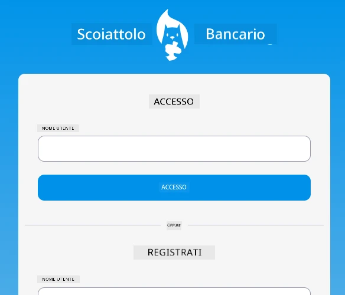
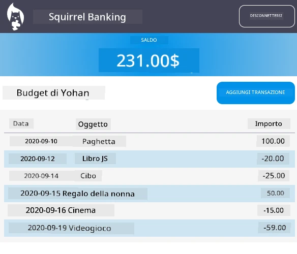

<!--
CO_OP_TRANSLATOR_METADATA:
{
  "original_hash": "830359535306594b448db6575ce5cdee",
  "translation_date": "2025-08-26T00:03:38+00:00",
  "source_file": "7-bank-project/README.md",
  "language_code": "it"
}
-->
# :dollar: Costruisci una Banca

In questo progetto, imparerai come costruire una banca fittizia. Queste lezioni includono istruzioni su come strutturare un'app web e fornire percorsi, creare moduli, gestire lo stato e recuperare dati da un'API da cui puoi ottenere i dati della banca.

|  |  |
|--------------------------------|--------------------------------|

## Lezioni

1. [Template HTML e Percorsi in un'App Web](1-template-route/README.md)
2. [Crea un Modulo di Login e Registrazione](2-forms/README.md)
3. [Metodi per Recuperare e Utilizzare Dati](3-data/README.md)
4. [Concetti di Gestione dello Stato](4-state-management/README.md)

### Crediti

Queste lezioni sono state scritte con :hearts: da [Yohan Lasorsa](https://twitter.com/sinedied).

Se sei interessato a imparare come costruire l'[API del server](/7-bank-project/api/README.md) utilizzata in queste lezioni, puoi seguire [questa serie di video](https://aka.ms/NodeBeginner) (in particolare i video dal 17 al 21).

Puoi anche dare un'occhiata a [questo tutorial interattivo su Learn](https://aka.ms/learn/express-api).

**Disclaimer (Avvertenza)**:  
Questo documento è stato tradotto utilizzando il servizio di traduzione automatica [Co-op Translator](https://github.com/Azure/co-op-translator). Sebbene ci impegniamo per garantire l'accuratezza, si prega di tenere presente che le traduzioni automatiche possono contenere errori o imprecisioni. Il documento originale nella sua lingua nativa dovrebbe essere considerato la fonte autorevole. Per informazioni critiche, si raccomanda una traduzione professionale effettuata da un traduttore umano. Non siamo responsabili per eventuali malintesi o interpretazioni errate derivanti dall'uso di questa traduzione.