<!--
CO_OP_TRANSLATOR_METADATA:
{
  "original_hash": "a9a3bcc037a447e2d8994d99e871cd9f",
  "translation_date": "2025-11-04T00:20:53+00:00",
  "source_file": "8-code-editor/1-using-a-code-editor/README.md",
  "language_code": "it"
}
-->
# Utilizzare un Editor di Codice: Padroneggiare VSCode.dev

Ricordi in *Matrix* quando Neo doveva collegarsi a un enorme terminale per accedere al mondo digitale? Gli strumenti di sviluppo web di oggi raccontano una storia completamente diversa: capacità incredibilmente potenti accessibili ovunque. VSCode.dev è un editor di codice basato su browser che porta strumenti di sviluppo professionali su qualsiasi dispositivo connesso a Internet.

Proprio come la stampa ha reso i libri accessibili a tutti, non solo agli scribi nei monasteri, VSCode.dev democratizza la programmazione. Puoi lavorare su progetti da un computer in biblioteca, un laboratorio scolastico o ovunque tu abbia accesso al browser. Niente installazioni, niente limitazioni legate a configurazioni specifiche.

Alla fine di questa lezione, capirai come navigare in VSCode.dev, aprire repository GitHub direttamente nel browser e utilizzare Git per il controllo delle versioni – tutte competenze su cui gli sviluppatori professionisti fanno affidamento ogni giorno.

## ⚡ Cosa puoi fare nei prossimi 5 minuti

**Percorso rapido per sviluppatori impegnati**


- **Minuto 1**: Vai su [vscode.dev](https://vscode.dev) - non è necessaria alcuna installazione
- **Minuto 2**: Accedi con GitHub per connettere i tuoi repository
- **Minuto 3**: Prova il trucco dell'URL: cambia `github.com` in `vscode.dev/github` in qualsiasi URL di repository
- **Minuto 4**: Crea un nuovo file e osserva il funzionamento automatico dell'evidenziazione della sintassi
- **Minuto 5**: Apporta una modifica e confermala tramite il pannello di controllo della sorgente

**URL di test rapido**:
```
# Transform this:
github.com/microsoft/Web-Dev-For-Beginners

# Into this:
vscode.dev/github/microsoft/Web-Dev-For-Beginners
```

**Perché è importante**: In 5 minuti, sperimenterai la libertà di programmare ovunque con strumenti professionali. Questo rappresenta il futuro dello sviluppo: accessibile, potente e immediato.

## 🗺️ Il tuo percorso di apprendimento nello sviluppo basato su cloud


**Destinazione del tuo percorso**: Alla fine di questa lezione, avrai padroneggiato un ambiente di sviluppo cloud professionale che funziona su qualsiasi dispositivo, permettendoti di programmare con gli stessi strumenti utilizzati dagli sviluppatori delle principali aziende tecnologiche.

## Cosa imparerai

Dopo aver seguito questa guida, sarai in grado di:

- Navigare in VSCode.dev come se fosse la tua seconda casa – trovando tutto ciò di cui hai bisogno senza perderti
- Aprire qualsiasi repository GitHub nel browser e iniziare a modificarlo immediatamente (questa è davvero magica!)
- Utilizzare Git per tracciare le modifiche e salvare i progressi come un professionista
- Potenziare il tuo editor con estensioni che rendono la programmazione più veloce e divertente
- Creare e organizzare file di progetto con sicurezza

## Cosa ti serve

I requisiti sono semplici:

- Un account gratuito [GitHub](https://github.com) (ti guideremo nella creazione se necessario)
- Familiarità di base con i browser web
- La lezione sulle basi di GitHub fornisce un utile background, anche se non è essenziale

> 💡 **Nuovo su GitHub?** Creare un account è gratuito e richiede pochi minuti. Proprio come una tessera della biblioteca ti dà accesso ai libri in tutto il mondo, un account GitHub apre le porte ai repository di codice su Internet.

## 🧠 Panoramica dell'ecosistema di sviluppo cloud


**Principio fondamentale**: Gli ambienti di sviluppo basati su cloud rappresentano il futuro della programmazione – fornendo strumenti di livello professionale accessibili, collaborativi e indipendenti dalla piattaforma.

## Perché gli editor di codice basati sul web sono importanti

Prima di Internet, gli scienziati di diverse università non potevano facilmente condividere le loro ricerche. Poi arrivò ARPANET negli anni '60, collegando computer a distanza. Gli editor di codice basati sul web seguono lo stesso principio – rendendo gli strumenti potenti accessibili indipendentemente dalla tua posizione fisica o dal dispositivo.

Un editor di codice serve come spazio di lavoro per lo sviluppo, dove scrivi, modifichi e organizzi file di codice. A differenza dei semplici editor di testo, gli editor di codice professionali offrono evidenziazione della sintassi, rilevamento degli errori e funzionalità di gestione dei progetti.

VSCode.dev porta queste capacità nel tuo browser:

**Vantaggi dell'editing basato sul web:**

| Funzione | Descrizione | Vantaggio pratico |
|----------|-------------|-------------------|
| **Indipendenza dalla piattaforma** | Funziona su qualsiasi dispositivo con un browser | Lavora senza problemi da computer diversi |
| **Nessuna installazione richiesta** | Accesso tramite URL web | Supera le restrizioni di installazione del software |
| **Aggiornamenti automatici** | Sempre con la versione più recente | Accedi a nuove funzionalità senza aggiornamenti manuali |
| **Integrazione con repository** | Connessione diretta a GitHub | Modifica il codice senza gestione locale dei file |

**Implicazioni pratiche:**
- Continuità del lavoro in ambienti diversi
- Interfaccia coerente indipendentemente dal sistema operativo
- Capacità di collaborazione immediata
- Riduzione delle esigenze di archiviazione locale

## Esplorare VSCode.dev

Proprio come il laboratorio di Marie Curie conteneva attrezzature sofisticate in uno spazio relativamente semplice, VSCode.dev racchiude strumenti di sviluppo professionali in un'interfaccia browser. Questa applicazione web offre la stessa funzionalità principale degli editor di codice desktop.

Inizia navigando su [vscode.dev](https://vscode.dev) nel tuo browser. L'interfaccia si carica senza download o installazioni di sistema – un'applicazione diretta dei principi del cloud computing.

### Collegare il tuo account GitHub

Proprio come il telefono di Alexander Graham Bell collegava luoghi distanti, collegare il tuo account GitHub collega VSCode.dev ai tuoi repository di codice. Quando ti viene chiesto di accedere con GitHub, è consigliabile accettare questa connessione.

**L'integrazione con GitHub offre:**
- Accesso diretto ai tuoi repository all'interno dell'editor
- Impostazioni e estensioni sincronizzate tra dispositivi
- Flusso di lavoro semplificato per il salvataggio su GitHub
- Ambiente di sviluppo personalizzato

### Conoscere il tuo nuovo spazio di lavoro

Una volta caricato tutto, vedrai uno spazio di lavoro pulito e progettato per mantenerti concentrato su ciò che conta – il tuo codice!


**Ecco il tuo tour del quartiere:**
- **Barra delle attività** (quella striscia a sinistra): La tua navigazione principale con Esplora 📁, Cerca 🔍, Controllo sorgente 🌿, Estensioni 🧩 e Impostazioni ⚙️
- **Barra laterale** (il pannello accanto): Cambia per mostrarti informazioni pertinenti in base a ciò che hai selezionato
- **Area dell'editor** (lo spazio grande al centro): Qui avviene la magia – la tua area principale di programmazione

**Prenditi un momento per esplorare:**
- Clicca sulle icone della Barra delle attività e scopri cosa fa ciascuna
- Nota come la barra laterale si aggiorna per mostrare informazioni diverse – interessante, vero?
- La vista Esplora (📁) è probabilmente dove passerai la maggior parte del tempo, quindi prenditi confidenza con essa

```mermaid
flowchart TB
    subgraph "VSCode.dev Interface Architecture"
        A[Activity Bar] --> B[Explorer 📁]
        A --> C[Search 🔍]
        A --> D[Source Control 🌿]
        A --> E[Extensions 🧩]
        A --> F[Settings ⚙️]
        
        B --> G[File Tree]
        C --> H[Find & Replace]
        D --> I[Git Status]
        E --> J[Extension Marketplace]
        F --> K[Configuration]
        
        L[Sidebar] --> M[Context Panel]
        N[Editor Area] --> O[Code Files]
        P[Terminal/Output] --> Q[Command Line]
    end
```



## Aprire repository GitHub

Prima di Internet, i ricercatori dovevano viaggiare fisicamente nelle biblioteche per accedere ai documenti. I repository GitHub funzionano in modo simile – sono raccolte di codice archiviate in remoto. VSCode.dev elimina il passaggio tradizionale di scaricare i repository sul tuo computer locale prima di modificarli.

Questa capacità consente l'accesso immediato a qualsiasi repository pubblico per visualizzare, modificare o contribuire. Ecco due metodi per aprire i repository:

### Metodo 1: Il modo punta e clicca

Questo è perfetto quando inizi da zero in VSCode.dev e vuoi aprire un repository specifico. È semplice e adatto ai principianti:

**Ecco come fare:**

1. Vai su [vscode.dev](https://vscode.dev) se non ci sei già
2. Cerca il pulsante "Apri repository remoto" nella schermata di benvenuto e cliccaci sopra

   

3. Incolla l'URL di un repository GitHub (prova questo: `https://github.com/microsoft/Web-Dev-For-Beginners`)
4. Premi Invio e guarda la magia accadere!

**Suggerimento professionale - Scorciatoia per il Command Palette:**

Vuoi sentirti un mago della programmazione? Prova questa scorciatoia da tastiera: Ctrl+Shift+P (o Cmd+Shift+P su Mac) per aprire il Command Palette:


**Il Command Palette è come avere un motore di ricerca per tutto ciò che puoi fare:**
- Digita "open remote" e troverà l'apertura del repository per te
- Ricorda i repository che hai aperto di recente (super utile!)
- Una volta che ti abitui, ti sentirai come se stessi programmando alla velocità della luce
- È praticamente la versione di VSCode.dev di "Ehi Siri, ma per la programmazione"

### Metodo 2: Tecnica di modifica dell'URL

Proprio come HTTP e HTTPS utilizzano protocolli diversi mantenendo la stessa struttura di dominio, VSCode.dev utilizza un modello di URL che rispecchia il sistema di indirizzamento di GitHub. Qualsiasi URL di repository GitHub può essere modificato per aprirlo direttamente in VSCode.dev.

**Modello di trasformazione dell'URL:**

| Tipo di repository | URL GitHub | URL VSCode.dev |
|--------------------|------------|----------------|
| **Repository pubblico** | `github.com/microsoft/Web-Dev-For-Beginners` | `vscode.dev/github/microsoft/Web-Dev-For-Beginners` |
| **Progetto personale** | `github.com/tuo-username/mio-progetto` | `vscode.dev/github/tuo-username/mio-progetto` |
| **Qualsiasi repo accessibile** | `github.com/username-loro/repo-fantastico` | `vscode.dev/github/username-loro/repo-fantastico` |

**Implementazione:**
- Sostituisci `github.com` con `vscode.dev/github`
- Mantieni invariati tutti gli altri componenti dell'URL
- Funziona con qualsiasi repository pubblico accessibile
- Fornisce accesso immediato alla modifica

> 💡 **Suggerimento che cambia la vita**: Salva nei segnalibri le versioni VSCode.dev dei tuoi repository preferiti. Io ho segnalibri come "Modifica il mio portfolio" e "Correggi la documentazione" che mi portano direttamente alla modalità di modifica!

**Quale metodo dovresti usare?**
- **Il metodo dell'interfaccia**: Ottimo quando stai esplorando o non ricordi i nomi esatti dei repository
- **Il trucco dell'URL**: Perfetto per un accesso ultra rapido quando sai esattamente dove stai andando

### 🎯 Verifica pedagogica: Accesso allo sviluppo cloud

**Pausa e riflessione**: Hai appena imparato due metodi per accedere ai repository di codice tramite un browser web. Questo rappresenta un cambiamento fondamentale nel modo in cui funziona lo sviluppo.

**Autovalutazione rapida**:
- Puoi spiegare perché l'editing basato sul web elimina la tradizionale "configurazione dell'ambiente di sviluppo"?
- Quali vantaggi offre la tecnica di modifica dell'URL rispetto al clonare localmente con git?
- In che modo questo approccio potrebbe cambiare il modo in cui contribuisci ai progetti open source?

**Connessione al mondo reale**: Grandi aziende come GitHub, GitLab e Replit hanno costruito le loro piattaforme di sviluppo attorno a questi principi orientati al cloud. Stai imparando gli stessi flussi di lavoro utilizzati dai team di sviluppo professionali in tutto il mondo.

**Domanda di sfida**: In che modo lo sviluppo basato sul cloud potrebbe cambiare il modo in cui la programmazione viene insegnata nelle scuole? Considera i requisiti dei dispositivi, la gestione del software e le possibilità di collaborazione.

## Lavorare con file e progetti

Ora che hai aperto un repository, iniziamo a costruire! VSCode.dev ti offre tutto ciò di cui hai bisogno per creare, modificare e organizzare i tuoi file di codice. Pensalo come il tuo laboratorio digitale – ogni strumento è proprio dove ti serve.

Immergiamoci nelle attività quotidiane che costituiranno la maggior parte del tuo flusso di lavoro di programmazione.

### Creare nuovi file

Proprio come organizzare i progetti in uno studio di architettura, la creazione di file in VSCode.dev segue un approccio strutturato. Il sistema supporta tutti i tipi di file standard per lo sviluppo web.

**Processo di creazione dei file:**

1. Vai alla cartella di destinazione nella barra laterale Esplora
2. Passa il mouse sopra il nome della cartella per rivelare l'icona "Nuovo file" (📄+)
3. Inserisci il nome del file incluso l'estensione appropriata (`style.css`, `script.js`, `index.html`)
4. Premi Invio per creare il file


**Convenzioni di denominazione:**
- Usa nomi descrittivi che indicano lo scopo del file
- Includi le estensioni dei file per una corretta evidenziazione della sintassi
- Segui modelli di denominazione coerenti in tutti i progetti
- Usa lettere minuscole e trattini invece di spazi

### Modificare e salvare i file

Qui inizia il vero divertimento! L'editor di VSCode.dev è ricco di funzionalità utili che rendono la programmazione fluida e intuitiva. È come avere un assistente di scrittura molto intelligente, ma per il codice.

**Il tuo flusso di lavoro di modifica:**

1. Clicca su qualsiasi file nell'Esplora per aprirlo nell'area principale
2. Inizia a digitare e osserva VSCode.dev aiutarti con colori, suggerimenti e rilevamento degli errori
3. Salva il tuo lavoro con Ctrl+S (Windows/Linux) o Cmd+S (Mac) – anche se salva automaticamente!


**Le cose interessanti che accadono mentre programmi:**
- Il tuo codice viene evidenziato con colori bellissimi, rendendolo facile da leggere
- VSCode.dev suggerisce completamenti mentre digiti (come l'autocorrezione, ma molto più intelligente)
- Rileva errori e refusi prima ancora che tu salvi
- Puoi avere più file aperti in schede, proprio come in un browser
- Tutto viene salvato automaticamente in background

> ⚠️ **Suggerimento rapido**: Anche se il salvataggio automatico ti protegge, premere Ctrl+S o Cmd+S è comunque una buona abitudine. Salva immediatamente tutto e attiva alcune funzionalità extra utili come il controllo degli errori.

### Controllo delle versioni con Git

Proprio come gli archeologi creano registri dettagliati degli strati di scavo, Git tiene traccia delle modifiche nel tuo codice nel tempo. Questo sistema preserva la storia del progetto e ti consente di tornare a versioni precedenti quando necessario. VSCode.dev include funzionalità integrate di Git.

**Interfaccia di controllo della sorgente:**

1. Accedi al pannello di controllo della sorgente tramite l'icona 🌿 nella barra delle attività
2. I file modificati appaiono nella sezione "Modifiche"
3. La codifica a colori indica i tipi di modifica: verde per le aggiunte, rosso per le eliminazioni


**Salvare il tuo lavoro (il flusso di lavoro di commit):**


**Ecco il processo passo dopo passo:**
- Clicca sull'icona "+" accanto ai file che vuoi salvare (questo li "staggia")
- Controlla attentamente che tutte le modifiche messe in stage ti soddisfino
- Scrivi una breve nota che spieghi cosa hai fatto (questo è il tuo "messaggio di commit")
- Clicca sul pulsante con il segno di spunta per salvare tutto su GitHub
- Se cambi idea su qualcosa, l'icona di annullamento ti permette di scartare le modifiche

**Scrivere buoni messaggi di commit (è più facile di quanto pensi!):**
- Descrivi semplicemente cosa hai fatto, come "Aggiungi modulo di contatto" o "Correggi navigazione non funzionante"
- Tienilo breve e conciso – pensa alla lunghezza di un tweet, non di un saggio
- Inizia con verbi d'azione come "Aggiungi", "Correggi", "Aggiorna" o "Rimuovi"
- **Esempi validi**: "Aggiungi menu di navigazione responsive", "Correggi problemi di layout su mobile", "Aggiorna colori per migliorare l'accessibilità"

> 💡 **Consiglio rapido per la navigazione**: Usa il menu hamburger (☰) in alto a sinistra per tornare al tuo repository GitHub e vedere le modifiche salvate online. È come un portale tra il tuo ambiente di modifica e la "casa" del tuo progetto su GitHub!

## Migliorare la funzionalità con le estensioni

Proprio come la bottega di un artigiano contiene strumenti specializzati per diversi compiti, VSCode.dev può essere personalizzato con estensioni che aggiungono capacità specifiche. Questi plugin sviluppati dalla comunità rispondono a esigenze comuni di sviluppo come la formattazione del codice, l'anteprima in tempo reale e l'integrazione avanzata con Git.

Il marketplace delle estensioni ospita migliaia di strumenti gratuiti creati da sviluppatori di tutto il mondo. Ogni estensione risolve particolari sfide di workflow, permettendoti di costruire un ambiente di sviluppo personalizzato adatto alle tue esigenze e preferenze specifiche.


### Trovare le estensioni perfette

Il marketplace delle estensioni è davvero ben organizzato, quindi non ti perderai cercando ciò di cui hai bisogno. È progettato per aiutarti a scoprire sia strumenti specifici che cose interessanti che non sapevi nemmeno esistessero!

**Come accedere al marketplace:**

1. Clicca sull'icona delle Estensioni (🧩) nella Barra delle Attività
2. Sfoglia o cerca qualcosa di specifico
3. Clicca su ciò che ti sembra interessante per saperne di più


**Cosa troverai lì dentro:**

| Sezione | Contenuto | Perché è utile |
|----------|---------|----------|
| **Installate** | Estensioni che hai già aggiunto | La tua cassetta degli attrezzi personale per il coding |
| **Popolari** | I preferiti della comunità | Quelli che la maggior parte degli sviluppatori consiglia |
| **Consigliate** | Suggerimenti intelligenti per il tuo progetto | I consigli utili di VSCode.dev |

**Cosa rende facile la navigazione:**
- Ogni estensione mostra valutazioni, conteggi di download e recensioni reali degli utenti
- Trovi screenshot e descrizioni chiare di ciò che ogni estensione fa
- Tutto è chiaramente contrassegnato con informazioni sulla compatibilità
- Vengono suggerite estensioni simili per confrontare le opzioni

### Installare le estensioni (è facilissimo!)

Aggiungere nuove funzionalità al tuo editor è semplice come cliccare un pulsante. Le estensioni si installano in pochi secondi e iniziano a funzionare immediatamente – senza riavvii, senza attese.

**Ecco cosa devi fare:**

1. Cerca ciò che ti serve (prova a cercare "live server" o "prettier")
2. Clicca su quella che ti sembra interessante per vedere più dettagli
3. Leggi cosa fa e controlla le valutazioni
4. Premi il pulsante blu "Installa" e il gioco è fatto!


**Cosa succede dietro le quinte:**
- L'estensione viene scaricata e configurata automaticamente
- Le nuove funzionalità appaiono subito nella tua interfaccia
- Tutto inizia a funzionare immediatamente (davvero, è così veloce!)
- Se hai effettuato l'accesso, l'estensione si sincronizza su tutti i tuoi dispositivi

**Alcune estensioni che ti consiglio di provare:**
- **Live Server**: Guarda il tuo sito web aggiornarsi in tempo reale mentre scrivi il codice (è magico!)
- **Prettier**: Rende il tuo codice pulito e professionale automaticamente
- **Auto Rename Tag**: Cambia un tag HTML e il suo partner si aggiorna automaticamente
- **Bracket Pair Colorizer**: Colora le parentesi per non perderti mai
- **GitLens**: Potenzia le funzionalità di Git con tantissime informazioni utili

### Personalizzare le tue estensioni

La maggior parte delle estensioni ha impostazioni che puoi modificare per farle funzionare esattamente come preferisci. Pensalo come regolare il sedile e gli specchietti in un'auto – ognuno ha le sue preferenze!

**Modificare le impostazioni delle estensioni:**

1. Trova l'estensione installata nel pannello delle Estensioni
2. Cerca l'icona dell'ingranaggio (⚙️) accanto al suo nome e cliccala
3. Scegli "Impostazioni Estensione" dal menu a tendina
4. Regola le impostazioni finché non si adattano perfettamente al tuo workflow


**Cose comuni che potresti voler modificare:**
- Come viene formattato il codice (tab vs spazi, lunghezza delle righe, ecc.)
- Quali scorciatoie da tastiera attivano diverse azioni
- Con quali tipi di file l'estensione dovrebbe funzionare
- Attivare o disattivare funzionalità specifiche per mantenere tutto ordinato

### Organizzare le tue estensioni

Man mano che scopri nuove estensioni interessanti, vorrai mantenere la tua collezione ordinata e funzionante senza problemi. VSCode.dev rende davvero facile gestirle.

**Opzioni di gestione delle estensioni:**

| Cosa puoi fare | Quando è utile | Consiglio |
|--------|---------|----------|
| **Disabilitare** | Testare se un'estensione causa problemi | Meglio che disinstallare se pensi di volerla riutilizzare |
| **Disinstallare** | Rimuovere completamente estensioni che non ti servono | Mantiene il tuo ambiente pulito e veloce |
| **Aggiornare** | Ottenere le ultime funzionalità e correzioni di bug | Di solito avviene automaticamente, ma vale la pena controllare |

**Come mi piace gestire le estensioni:**
- Ogni pochi mesi, rivedo ciò che ho installato e rimuovo ciò che non uso
- Mantengo le estensioni aggiornate per ottenere gli ultimi miglioramenti e correzioni di sicurezza
- Se qualcosa sembra lento, disabilito temporaneamente le estensioni per vedere se una di esse è la causa
- Leggo le note di aggiornamento quando le estensioni ricevono aggiornamenti importanti – a volte ci sono nuove funzionalità interessanti!

> ⚠️ **Consiglio per le prestazioni**: Le estensioni sono fantastiche, ma averne troppe può rallentare il sistema. Concentrati su quelle che ti semplificano davvero la vita e non esitare a disinstallare quelle che non usi mai.

### 🎯 Verifica Pedagogica: Personalizzazione dell'Ambiente di Sviluppo

**Comprensione dell'Architettura**: Hai imparato a personalizzare un ambiente di sviluppo professionale utilizzando estensioni create dalla comunità. Questo rispecchia il modo in cui i team di sviluppo aziendali costruiscono toolchain standardizzate.

**Concetti Chiave Appresi**:
- **Scoperta delle Estensioni**: Trovare strumenti che risolvono sfide specifiche di sviluppo
- **Configurazione dell'Ambiente**: Personalizzare gli strumenti per adattarli alle preferenze personali o del team
- **Ottimizzazione delle Prestazioni**: Bilanciare funzionalità e prestazioni del sistema
- **Collaborazione Comunitaria**: Sfruttare strumenti creati dalla comunità globale di sviluppatori

**Connessione con l'Industria**: Gli ecosistemi di estensioni alimentano le principali piattaforme di sviluppo come VS Code, Chrome DevTools e gli IDE moderni. Comprendere come valutare, installare e configurare le estensioni è essenziale per i workflow di sviluppo professionale.

**Domanda di riflessione**: Come affronteresti la configurazione di un ambiente di sviluppo standardizzato per un team di 10 sviluppatori? Considera coerenza, prestazioni e preferenze individuali.

## 📈 La tua Timeline di Padronanza dello Sviluppo Cloud


**🎓 Traguardo di Laurea**: Hai padroneggiato con successo lo sviluppo basato su cloud utilizzando gli stessi strumenti e workflow impiegati dagli sviluppatori professionisti delle principali aziende tecnologiche. Queste competenze rappresentano il futuro dello sviluppo software.

**🔄 Capacità di Livello Successivo**:
- Pronto a esplorare piattaforme avanzate di sviluppo cloud (Codespaces, GitPod)
- Preparato a lavorare in team di sviluppo distribuiti
- Equipaggiato per contribuire a progetti open source a livello globale
- Fondamenti impostati per pratiche moderne di DevOps e integrazione continua

## Sfida Agente GitHub Copilot 🚀

Come l'approccio strutturato che la NASA utilizza per le missioni spaziali, questa sfida prevede l'applicazione sistematica delle competenze di VSCode.dev in uno scenario di workflow completo.

**Obiettivo:** Dimostrare la padronanza di VSCode.dev stabilendo un workflow completo per lo sviluppo web.

**Requisiti del progetto:** Utilizzando l'assistenza in modalità Agente, completa questi compiti:
1. Effettua un fork di un repository esistente o creane uno nuovo
2. Stabilisci una struttura di progetto funzionale con file HTML, CSS e JavaScript
3. Installa e configura tre estensioni che migliorano lo sviluppo
4. Pratica il controllo di versione con messaggi di commit descrittivi
5. Sperimenta la creazione e modifica di branch di funzionalità
6. Documenta il processo e le lezioni apprese in un file README.md

Questo esercizio consolida tutti i concetti di VSCode.dev in un workflow pratico che può essere applicato a progetti di sviluppo futuri.

Scopri di più sulla [modalità agente](https://code.visualstudio.com/blogs/2025/02/24/introducing-copilot-agent-mode) qui.

## Compito

È ora di mettere alla prova queste competenze! Ho un progetto pratico che ti permetterà di esercitarti su tutto ciò che abbiamo trattato: [Crea un sito web per il tuo curriculum usando VSCode.dev](./assignment.md)

Questo compito ti guida nella creazione di un sito web professionale per il tuo curriculum interamente nel browser. Utilizzerai tutte le funzionalità di VSCode.dev che abbiamo esplorato e, alla fine, avrai sia un sito web dall'aspetto professionale che una solida fiducia nel tuo nuovo workflow.

## Continua a Esplorare e a Crescere le Tue Competenze

Hai una solida base ora, ma c'è ancora tanto da scoprire! Ecco alcune risorse e idee per portare le tue competenze con VSCode.dev al livello successivo:

**Documentazione ufficiale da salvare nei preferiti:**
- [Documentazione Web di VSCode](https://code.visualstudio.com/docs/editor/vscode-web?WT.mc_id=academic-0000-alfredodeza) – La guida completa per l'editing basato su browser
- [GitHub Codespaces](https://docs.github.com/en/codespaces) – Per quando vuoi ancora più potenza nel cloud

**Funzionalità interessanti da sperimentare:**
- **Scorciatoie da tastiera**: Impara le combinazioni di tasti che ti faranno sentire un ninja del coding
- **Impostazioni dell'ambiente di lavoro**: Configura ambienti diversi per diversi tipi di progetti
- **Workspace multi-root**: Lavora su più repository contemporaneamente (super utile!)
- **Integrazione del terminale**: Accedi agli strumenti da riga di comando direttamente nel browser

**Idee per esercitarti:**
- Partecipa a progetti open source e contribuisci utilizzando VSCode.dev – è un ottimo modo per restituire qualcosa!
- Prova diverse estensioni per trovare la configurazione perfetta
- Crea modelli di progetto per i tipi di siti che costruisci più spesso
- Esercitati con i workflow Git come la creazione e la fusione di branch – queste competenze sono preziose nei progetti di team

---

**Hai padroneggiato lo sviluppo basato su browser!** 🎉 Proprio come l'invenzione degli strumenti portatili ha permesso agli scienziati di condurre ricerche in luoghi remoti, VSCode.dev consente di programmare professionalmente da qualsiasi dispositivo connesso a Internet.

Queste competenze riflettono le pratiche attuali del settore – molti sviluppatori professionisti utilizzano ambienti di sviluppo basati su cloud per la loro flessibilità e accessibilità. Hai imparato un workflow che si adatta sia ai progetti individuali che alle collaborazioni di grandi team.

Applica queste tecniche al tuo prossimo progetto di sviluppo! 🚀

---

**Disclaimer**:  
Questo documento è stato tradotto utilizzando il servizio di traduzione AI [Co-op Translator](https://github.com/Azure/co-op-translator). Sebbene ci impegniamo per garantire l'accuratezza, si prega di notare che le traduzioni automatiche possono contenere errori o imprecisioni. Il documento originale nella sua lingua nativa dovrebbe essere considerato la fonte autorevole. Per informazioni critiche, si raccomanda una traduzione professionale umana. Non siamo responsabili per eventuali incomprensioni o interpretazioni errate derivanti dall'uso di questa traduzione.