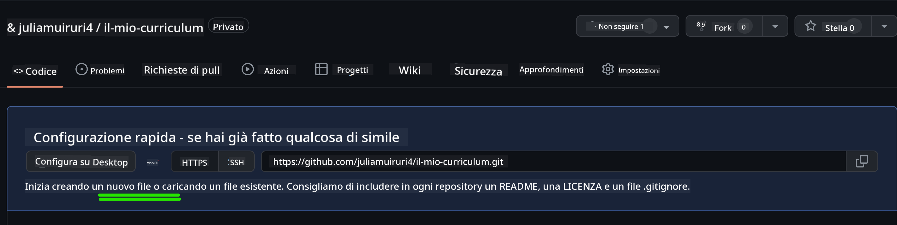
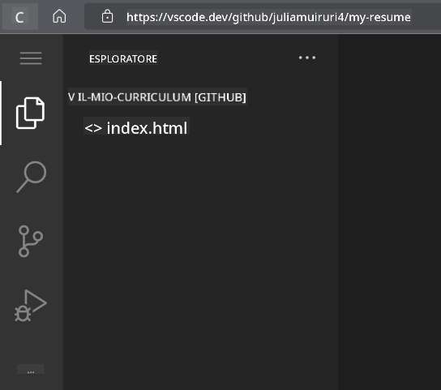
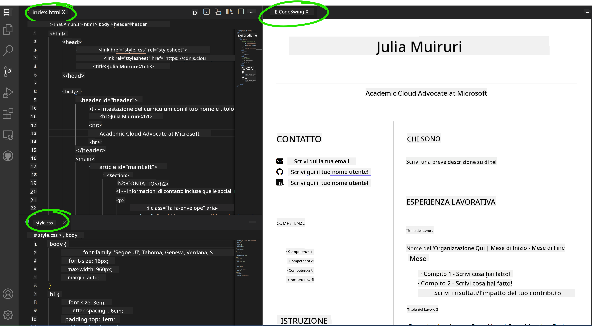

<!--
CO_OP_TRANSLATOR_METADATA:
{
  "original_hash": "bd3aa6d2b879c30ea496c43aec1c49ed",
  "translation_date": "2025-08-29T00:13:21+00:00",
  "source_file": "8-code-editor/1-using-a-code-editor/assignment.md",
  "language_code": "it"
}
-->
# Crea un sito web per il tuo curriculum usando vscode.dev

_Quanto sarebbe fantastico se un recruiter ti chiedesse il curriculum e tu gli inviassi un URL?_ 😎

<!----
TODO: aggiungere un'immagine opzionale

> Sketchnote di [Nome Autore](https://example.com)
---->

<!---
## Quiz Pre-Lettura
[Quiz pre-lettura](https://ff-quizzes.netlify.app/web/quiz/3)
---->

## Obiettivi

Dopo questo compito, imparerai a:

- Creare un sito web per mostrare il tuo curriculum

### Prerequisiti

1. Un account GitHub. Vai su [GitHub](https://github.com/) e crea un account se non lo hai già fatto.

## Passaggi

**Passaggio 1:** Crea un nuovo repository GitHub e assegnagli il nome `my-resume`

**Passaggio 2:** Crea un file `index.html` nel tuo repository. Aggiungeremo almeno un file direttamente su github.com perché non è possibile aprire un repository vuoto su vscode.dev.

Clicca sul link `creating a new file`, digita il nome `index.html` e seleziona il pulsante `Commit new file`.



**Passaggio 3:** Apri [VSCode.dev](https://vscode.dev) e seleziona il pulsante `Open Remote Repository`.

Copia l'URL del repository che hai appena creato per il tuo sito del curriculum e incollalo nella casella di input:

_Sostituisci `your-username` con il tuo username GitHub._

```
https://github.com/your-username/my-resume
```

✅ Se il processo è andato a buon fine, vedrai il tuo progetto e il file index.html aperti nell'editor di testo nel browser.



**Passaggio 4:** Apri il file `index.html`, incolla il codice qui sotto nell'area di codice e salva.

<details>
    <summary><b>Codice HTML responsabile del contenuto del tuo sito web per il curriculum.</b></summary>
    
        <html>

            <head>
                <link href="style.css" rel="stylesheet">
                <link rel="stylesheet" href="https://cdnjs.cloudflare.com/ajax/libs/font-awesome/5.15.4/css/all.min.css">
                <title>Il tuo nome qui!</title>
            </head>
            <body>
                <header id="header">
                    <!-- intestazione del curriculum con il tuo nome e titolo -->
                    <h1>Il tuo nome qui!</h1>
                    <hr>
                    Il tuo ruolo!
                    <hr>
                </header>
                <main>
                    <article id="mainLeft">
                        <section>
                            <h2>CONTATTI</h2>
                            <!-- informazioni di contatto inclusi i social media -->
                            <p>
                                <i class="fa fa-envelope" aria-hidden="true"></i>
                                <a href="mailto:username@domain.top-level domain">Scrivi qui la tua email</a>
                            </p>
                            <p>
                                <i class="fab fa-github" aria-hidden="true"></i>
                                <a href="github.com/yourGitHubUsername">Scrivi qui il tuo username!</a>
                            </p>
                            <p>
                                <i class="fab fa-linkedin" aria-hidden="true"></i>
                                <a href="linkedin.com/yourLinkedInUsername">Scrivi qui il tuo username!</a>
                            </p>
                        </section>
                        <section>
                            <h2>COMPETENZE</h2>
                            <!-- le tue competenze -->
                            <ul>
                                <li>Competenza 1!</li>
                                <li>Competenza 2!</li>
                                <li>Competenza 3!</li>
                                <li>Competenza 4!</li>
                            </ul>
                        </section>
                        <section>
                            <h2>ISTRUZIONE</h2>
                            <!-- la tua istruzione -->
                            <h3>Scrivi qui il tuo corso!</h3>
                            <p>
                                Scrivi qui la tua istituzione!
                            </p>
                            <p>
                                Data di inizio - Data di fine
                            </p>
                        </section>            
                    </article>
                    <article id="mainRight">
                        <section>
                            <h2>CHI SONO</h2>
                            <!-- informazioni su di te -->
                            <p>Scrivi una breve descrizione su di te!</p>
                        </section>
                        <section>
                            <h2>ESPERIENZA LAVORATIVA</h2>
                            <!-- la tua esperienza lavorativa -->
                            <h3>Titolo del lavoro</h3>
                            <p>
                                Nome dell'organizzazione | Mese di inizio – Mese di fine
                            </p>
                            <ul>
                                    <li>Attività 1 - Scrivi cosa hai fatto!</li>
                                    <li>Attività 2 - Scrivi cosa hai fatto!</li>
                                    <li>Scrivi i risultati/impatti del tuo contributo</li>
                                    
                            </ul>
                            <h3>Titolo del lavoro 2</h3>
                            <p>
                                Nome dell'organizzazione | Mese di inizio – Mese di fine
                            </p>
                            <ul>
                                    <li>Attività 1 - Scrivi cosa hai fatto!</li>
                                    <li>Attività 2 - Scrivi cosa hai fatto!</li>
                                    <li>Scrivi i risultati/impatti del tuo contributo</li>
                                    
                            </ul>
                        </section>
                    </article>
                </main>
            </body>
        </html>
</details>

Aggiungi i dettagli del tuo curriculum per sostituire il _testo segnaposto_ nel codice HTML.

**Passaggio 5:** Passa con il mouse sulla cartella My-Resume, clicca sull'icona `New File ...` e crea 2 nuovi file nel tuo progetto: `style.css` e `codeswing.json`.

**Passaggio 6:** Apri il file `style.css`, incolla il codice qui sotto e salva.

<details>
        <summary><b>Codice CSS per formattare il layout del sito.</b></summary>
            
            body {
                font-family: 'Segoe UI', Tahoma, Geneva, Verdana, sans-serif;
                font-size: 16px;
                max-width: 960px;
                margin: auto;
            }
            h1 {
                font-size: 3em;
                letter-spacing: .6em;
                padding-top: 1em;
                padding-bottom: 1em;
            }

            h2 {
                font-size: 1.5em;
                padding-bottom: 1em;
            }

            h3 {
                font-size: 1em;
                padding-bottom: 1em;
            }
            main { 
                display: grid;
                grid-template-columns: 40% 60%;
                margin-top: 3em;
            }
            header {
                text-align: center;
                margin: auto 2em;
            }

            section {
                margin: auto 1em 4em 2em;
            }

            i {
                margin-right: .5em;
            }

            p {
                margin: .2em auto
            }

            hr {
                border: none;
                background-color: lightgray;
                height: 1px;
            }

            h1, h2, h3 {
                font-weight: 100;
                margin-bottom: 0;
            }
            #mainLeft {
                border-right: 1px solid lightgray;
            }
            
</details>

**Passaggio 6:** Apri il file `codeswing.json`, incolla il codice qui sotto e salva.

    {
    "scripts": [],
    "styles": []
    }

**Passaggio 7:** Installa l'estensione `Codeswing` per visualizzare il sito web del curriculum nell'area di codice.

Clicca sull'icona _`Extensions`_ nella barra delle attività e digita Codeswing. Clicca sul pulsante _blu install_ nella barra delle attività espansa per installare oppure usa il pulsante di installazione che appare nell'area di codice una volta selezionata l'estensione per caricare ulteriori informazioni. Subito dopo aver installato l'estensione, osserva l'area di codice per vedere i cambiamenti nel tuo progetto 😃.


Questo è ciò che vedrai sullo schermo dopo aver installato l'estensione.



Se sei soddisfatto delle modifiche che hai apportato, passa con il mouse sulla cartella `Changes` e clicca sul pulsante `+` per mettere in stage le modifiche.

Digita un messaggio di commit _(Una descrizione delle modifiche apportate al progetto)_ e conferma le modifiche cliccando sul `check`. Una volta terminato il lavoro sul progetto, seleziona l'icona del menu hamburger in alto a sinistra per tornare al repository su GitHub.

Congratulazioni 🎉 Hai appena creato il tuo sito web per il curriculum usando vscode.dev in pochi passaggi.

## 🚀 Sfida

Apri un repository remoto su cui hai i permessi per apportare modifiche e aggiorna alcuni file. Successivamente, prova a creare un nuovo branch con le tue modifiche e fai una Pull Request.

<!----
## Quiz Post-Lettura
[Quiz post-lettura](https://ff-quizzes.netlify.app/web/quiz/4)
---->

## Revisione e Studio Autonomo

Leggi di più su [VSCode.dev](https://code.visualstudio.com/docs/editor/vscode-web?WT.mc_id=academic-0000-alfredodeza) e alcune delle sue altre funzionalità.

---

**Disclaimer**:  
Questo documento è stato tradotto utilizzando il servizio di traduzione automatica [Co-op Translator](https://github.com/Azure/co-op-translator). Sebbene ci impegniamo per garantire l'accuratezza, si prega di notare che le traduzioni automatiche possono contenere errori o imprecisioni. Il documento originale nella sua lingua nativa dovrebbe essere considerato la fonte autorevole. Per informazioni critiche, si raccomanda una traduzione professionale effettuata da un traduttore umano. Non siamo responsabili per eventuali incomprensioni o interpretazioni errate derivanti dall'uso di questa traduzione.