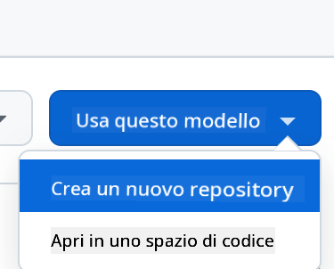
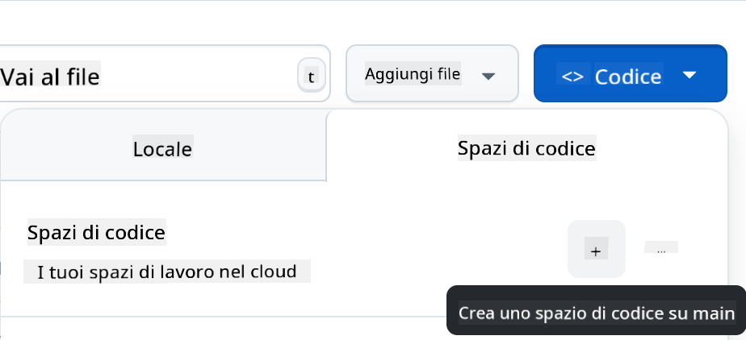

<!--
CO_OP_TRANSLATOR_METADATA:
{
  "original_hash": "002304ffe0059e55b33e2ee5283788ad",
  "translation_date": "2025-09-01T15:28:54+00:00",
  "source_file": "9-chat-project/README.md",
  "language_code": "it"
}
-->
# Progetto Chat

Questo progetto di chat mostra come costruire un Assistente Chat utilizzando i Modelli di GitHub.

Ecco come appare il progetto finito:

<div>
  
</div>

Un po' di contesto: costruire assistenti chat utilizzando l'AI generativa è un ottimo modo per iniziare a imparare sull'AI. In questa lezione imparerai a integrare l'AI generativa in un'app web. Iniziamo!

## Collegarsi all'AI generativa

Per il backend, utilizziamo i Modelli di GitHub. È un ottimo servizio che ti permette di utilizzare l'AI gratuitamente. Vai al suo playground e prendi il codice corrispondente al linguaggio backend che hai scelto. Ecco come appare il [GitHub Models Playground](https://github.com/marketplace/models/azure-openai/gpt-4o-mini/playground)

<div>
  
</div>

Come detto, seleziona la scheda "Code" e il runtime che preferisci.

<div>
  
</div>

### Utilizzo di Python

In questo caso selezioniamo Python, il che significa che scegliamo questo codice:

```python
"""Run this model in Python

> pip install openai
"""
import os
from openai import OpenAI

# To authenticate with the model you will need to generate a personal access token (PAT) in your GitHub settings. 
# Create your PAT token by following instructions here: https://docs.github.com/en/authentication/keeping-your-account-and-data-secure/managing-your-personal-access-tokens
client = OpenAI(
    base_url="https://models.github.ai/inference",
    api_key=os.environ["GITHUB_TOKEN"],
)

response = client.chat.completions.create(
    messages=[
        {
            "role": "system",
            "content": "",
        },
        {
            "role": "user",
            "content": "What is the capital of France?",
        }
    ],
    model="openai/gpt-4o-mini",
    temperature=1,
    max_tokens=4096,
    top_p=1
)

print(response.choices[0].message.content)
```

Puliamo un po' questo codice per renderlo riutilizzabile:

```python
def call_llm(prompt: str, system_message: str):
    response = client.chat.completions.create(
        messages=[
            {
                "role": "system",
                "content": system_message,
            },
            {
                "role": "user",
                "content": prompt,
            }
        ],
        model="openai/gpt-4o-mini",
        temperature=1,
        max_tokens=4096,
        top_p=1
    )

    return response.choices[0].message.content
```

Con questa funzione `call_llm` possiamo ora prendere un prompt e un system prompt, e la funzione restituirà il risultato.

### Personalizzare l'Assistente AI

Se vuoi personalizzare l'assistente AI, puoi specificare come vuoi che si comporti popolando il system prompt in questo modo:

```python
call_llm("Tell me about you", "You're Albert Einstein, you only know of things in the time you were alive")
```

## Esponilo tramite una Web API

Ottimo, abbiamo completato la parte AI. Vediamo ora come possiamo integrarla in una Web API. Per la Web API, scegliamo di utilizzare Flask, ma qualsiasi framework web andrà bene. Ecco il codice:

### Utilizzo di Python

```python
# api.py
from flask import Flask, request, jsonify
from llm import call_llm
from flask_cors import CORS

app = Flask(__name__)
CORS(app)   # *   example.com

@app.route("/", methods=["GET"])
def index():
    return "Welcome to this API. Call POST /hello with 'message': 'my message' as JSON payload"


@app.route("/hello", methods=["POST"])
def hello():
    # get message from request body  { "message": "do this taks for me" }
    data = request.get_json()
    message = data.get("message", "")

    response = call_llm(message, "You are a helpful assistant.")
    return jsonify({
        "response": response
    })

if __name__ == "__main__":
    app.run(host="0.0.0.0", port=5000)
```

Qui creiamo un'API Flask e definiamo una route di default "/" e "/chat". Quest'ultima è pensata per essere utilizzata dal nostro frontend per inviare domande.

Per integrare *llm.py*, ecco cosa dobbiamo fare:

- Importare la funzione `call_llm`:

   ```python
   from llm import call_llm
   from flask import Flask, request
   ```

- Chiamarla dalla route "/chat":

   ```python
   @app.route("/hello", methods=["POST"])
   def hello():
      # get message from request body  { "message": "do this taks for me" }
      data = request.get_json()
      message = data.get("message", "")

      response = call_llm(message, "You are a helpful assistant.")
      return jsonify({
         "response": response
      })
   ```

   Qui analizziamo la richiesta in arrivo per recuperare la proprietà `message` dal corpo JSON. Successivamente chiamiamo l'LLM con questa chiamata:

   ```python
   response = call_llm(message, "You are a helpful assistant")

   # return the response as JSON
   return jsonify({
      "response": response 
   })
   ```

Ottimo, ora abbiamo fatto ciò che era necessario.

## Configurare Cors

Dobbiamo sottolineare che abbiamo configurato qualcosa come CORS, ovvero il cross-origin resource sharing. Questo significa che, poiché il nostro backend e frontend gireranno su porte diverse, dobbiamo consentire al frontend di chiamare il backend.

### Utilizzo di Python

C'è un pezzo di codice in *api.py* che lo configura:

```python
from flask_cors import CORS

app = Flask(__name__)
CORS(app)   # *   example.com
```

Al momento è configurato per consentire "*" (tutte le origini), il che è un po' insicuro. Dovremmo restringerlo una volta che andiamo in produzione.

## Esegui il tuo progetto

Per eseguire il tuo progetto, devi prima avviare il backend e poi il frontend.

### Utilizzo di Python

Ok, abbiamo *llm.py* e *api.py*. Come possiamo far funzionare tutto con un backend? Ci sono due cose da fare:

- Installare le dipendenze:

   ```sh
   cd backend
   python -m venv venv
   source ./venv/bin/activate

   pip install openai flask flask-cors openai
   ```

- Avviare l'API:

   ```sh
   python api.py
   ```

   Se stai utilizzando Codespaces, devi andare su Ports nella parte inferiore dell'editor, fare clic destro su di esso, selezionare "Port Visibility" e scegliere "Public".

### Lavorare su un frontend

Ora che abbiamo un'API funzionante, creiamo un frontend per essa. Un frontend minimo che miglioreremo passo dopo passo. Nella cartella *frontend*, crea quanto segue:

```text
backend/
frontend/
index.html
app.js
styles.css
```

Iniziamo con **index.html**:

```html
<html>
    <head>
        <link rel="stylesheet" href="styles.css">
    </head>
    <body>
      <form>
        <textarea id="messages"></textarea>
        <input id="input" type="text" />
        <button type="submit" id="sendBtn">Send</button>  
      </form>  
      <script src="app.js" />
    </body>
</html>    
```

Quanto sopra è il minimo indispensabile per supportare una finestra di chat, poiché consiste in una textarea dove verranno visualizzati i messaggi, un input per digitare il messaggio e un pulsante per inviare il messaggio al backend. Passiamo ora al JavaScript in *app.js*.

**app.js**

```js
// app.js

(function(){
  // 1. set up elements  
  const messages = document.getElementById("messages");
  const form = document.getElementById("form");
  const input = document.getElementById("input");

  const BASE_URL = "change this";
  const API_ENDPOINT = `${BASE_URL}/hello`;

  // 2. create a function that talks to our backend
  async function callApi(text) {
    const response = await fetch(API_ENDPOINT, {
      method: "POST",
      headers: { "Content-Type": "application/json" },
      body: JSON.stringify({ message: text })
    });
    let json = await response.json();
    return json.response;
  }

  // 3. add response to our textarea
  function appendMessage(text, role) {
    const el = document.createElement("div");
    el.className = `message ${role}`;
    el.innerHTML = text;
    messages.appendChild(el);
  }

  // 4. listen to submit events
  form.addEventListener("submit", async(e) => {
    e.preventDefault();
   // someone clicked the button in the form
   
   // get input
   const text = input.value.trim();

   appendMessage(text, "user")

   // reset it
   input.value = '';

   const reply = await callApi(text);

   // add to messages
   appendMessage(reply, "assistant");

  })
})();
```

Analizziamo il codice per sezioni:

- 1) Qui otteniamo un riferimento a tutti gli elementi che utilizzeremo nel codice.
- 2) In questa sezione, creiamo una funzione che utilizza il metodo `fetch` integrato per chiamare il nostro backend.
- 3) `appendMessage` aiuta ad aggiungere le risposte e ciò che digiti come utente.
- 4) Qui ascoltiamo l'evento di submit, leggiamo il campo di input, posizioniamo il messaggio dell'utente nella textarea, chiamiamo l'API e visualizziamo la risposta nella textarea.

Passiamo ora allo stile. Qui puoi sbizzarrirti e personalizzarlo come preferisci, ma ecco alcuni suggerimenti:

**styles.css**

```
.message {
    background: #222;
    box-shadow: 0 0 0 10px orange;
    padding: 10px:
    margin: 5px;
}

.message.user {
    background: blue;
}

.message.assistant {
    background: grey;
} 
```

Con queste tre classi, puoi stilizzare i messaggi in modo diverso a seconda che provengano dall'assistente o dall'utente. Se vuoi ispirarti, dai un'occhiata alla cartella `solution/frontend/styles.css`.

### Cambiare la Base Url

C'è una cosa che non abbiamo impostato: `BASE_URL`. Questo valore non è noto finché il backend non è avviato. Per impostarlo:

- Se esegui l'API localmente, dovrebbe essere qualcosa come `http://localhost:5000`.
- Se esegui in un Codespaces, dovrebbe essere qualcosa come "[name]app.github.dev".

## Compito

Crea la tua cartella *project* con il contenuto seguente:

```text
project/
  frontend/
    index.html
    app.js
    styles.css
  backend/
    ...
```

Copia il contenuto delle istruzioni sopra, ma sentiti libero di personalizzarlo a tuo piacimento.

## Soluzione

[Soluzione](./solution/README.md)

## Bonus

Prova a cambiare la personalità dell'assistente AI.

### Per Python

Quando chiami `call_llm` in *api.py*, puoi cambiare il secondo argomento come preferisci, ad esempio:

```python
call_llm(message, "You are Captain Picard")
```

### Frontend

Cambia anche il CSS e il testo a tuo piacimento, quindi modifica *index.html* e *styles.css*.

## Riepilogo

Ottimo, hai imparato da zero come creare un assistente personale utilizzando l'AI. Lo abbiamo fatto utilizzando i Modelli di GitHub, un backend in Python e un frontend in HTML, CSS e JavaScript.

## Configurazione con Codespaces

- Vai su: [Web Dev For Beginners repo](https://github.com/microsoft/Web-Dev-For-Beginners)
- Crea da un template (assicurati di essere loggato su GitHub) nell'angolo in alto a destra:

    

- Una volta nel tuo repository, crea un Codespace:

    

    Questo avvierà un ambiente con cui puoi lavorare.

---

**Disclaimer**:  
Questo documento è stato tradotto utilizzando il servizio di traduzione automatica [Co-op Translator](https://github.com/Azure/co-op-translator). Sebbene ci impegniamo per garantire l'accuratezza, si prega di notare che le traduzioni automatiche possono contenere errori o imprecisioni. Il documento originale nella sua lingua nativa dovrebbe essere considerato la fonte autorevole. Per informazioni critiche, si raccomanda una traduzione professionale effettuata da un esperto umano. Non siamo responsabili per eventuali incomprensioni o interpretazioni errate derivanti dall'uso di questa traduzione.