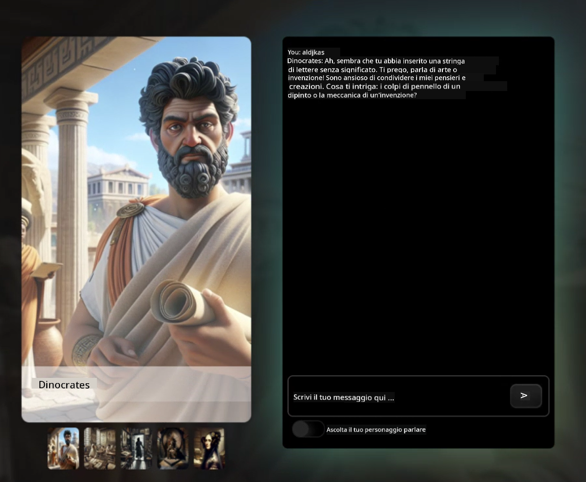
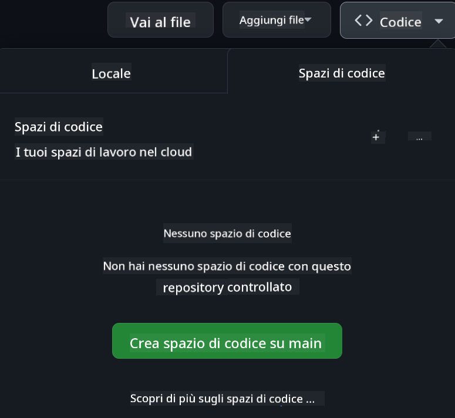

<!--
CO_OP_TRANSLATOR_METADATA:
{
  "original_hash": "fea3a0fceb8ad86fd640c09cf63a2aac",
  "translation_date": "2026-01-06T18:39:04+00:00",
  "source_file": "README.md",
  "language_code": "it"
}
-->
# Sviluppo Web per Principianti - Un Curriculum

Impara le basi dello sviluppo web con il nostro corso completo di 12 settimane condotto dai Microsoft Cloud Advocates. Ognuna delle 24 lezioni approfondisce JavaScript, CSS e HTML attraverso progetti pratici come terrari, estensioni per browser e giochi spaziali. Partecipa a quiz, discussioni e compiti pratici. Migliora le tue competenze e ottimizza la ritenzione delle conoscenze con la nostra efficace pedagogia basata su progetti. Inizia oggi il tuo percorso di programmazione!

Unisciti alla community Discord di Azure AI Foundry

Segui questi passaggi per iniziare a utilizzare queste risorse:
1. **Fork del Repository**: Clicca [](https://GitHub.com/microsoft/Web-Dev-For-Beginners/fork)
2. **Clona il Repository**:   `git clone https://github.com/microsoft/Web-Dev-For-Beginners.git`
3. [**Unisciti al Discord di Azure AI Foundry e incontra esperti e altri sviluppatori**](https://discord.com/invite/ByRwuEEgH4)

### 🌐 Supporto Multilingue

#### Supportato tramite GitHub Action (Automatizzato e Sempre Aggiornato)

<!-- CO-OP TRANSLATOR LANGUAGES TABLE START -->
[Arabo](../ar/README.md) | [Bengalese](../bn/README.md) | [Bulgaro](../bg/README.md) | [Birmano (Myanmar)](../my/README.md) | [Cinese (Semplificato)](../zh/README.md) | [Cinese (Tradizionale, Hong Kong)](../hk/README.md) | [Cinese (Tradizionale, Macao)](../mo/README.md) | [Cinese (Tradizionale, Taiwan)](../tw/README.md) | [Croato](../hr/README.md) | [Ceco](../cs/README.md) | [Danese](../da/README.md) | [Olandese](../nl/README.md) | [Estone](../et/README.md) | [Finlandese](../fi/README.md) | [Francese](../fr/README.md) | [Tedesco](../de/README.md) | [Greco](../el/README.md) | [Ebraico](../he/README.md) | [Hindi](../hi/README.md) | [Ungherese](../hu/README.md) | [Indonesiano](../id/README.md) | [Italiano](./README.md) | [Giapponese](../ja/README.md) | [Kannada](../kn/README.md) | [Coreano](../ko/README.md) | [Lituano](../lt/README.md) | [Malese](../ms/README.md) | [Malayalam](../ml/README.md) | [Marathi](../mr/README.md) | [Nepalese](../ne/README.md) | [Pidgin Nigeriano](../pcm/README.md) | [Norvegese](../no/README.md) | [Persiano (Farsi)](../fa/README.md) | [Polacco](../pl/README.md) | [Portoghese (Brasile)](../br/README.md) | [Portoghese (Portogallo)](../pt/README.md) | [Punjabi (Gurmukhi)](../pa/README.md) | [Rumeno](../ro/README.md) | [Russo](../ru/README.md) | [Serbo (Cirillico)](../sr/README.md) | [Slovacco](../sk/README.md) | [Sloveno](../sl/README.md) | [Spagnolo](../es/README.md) | [Swahili](../sw/README.md) | [Svedese](../sv/README.md) | [Tagalog (Filippino)](../tl/README.md) | [Tamil](../ta/README.md) | [Telugu](../te/README.md) | [Tailandese](../th/README.md) | [Turco](../tr/README.md) | [Ucraino](../uk/README.md) | [Urdu](../ur/README.md) | [Vietnamita](../vi/README.md)

> **Preferisci clonare localmente?**

> Questo repository include oltre 50 traduzioni linguistiche che aumentano significativamente la dimensione del download. Per clonare senza traduzioni, usa il checkout sparso:
> ```bash
> git clone --filter=blob:none --sparse https://github.com/microsoft/Web-Dev-For-Beginners.git
> cd Web-Dev-For-Beginners
> git sparse-checkout set --no-cone '/*' '!translations' '!translated_images'
> ```
> Questo ti permette di avere tutto ciò che ti serve per completare il corso con un download molto più veloce.
<!-- CO-OP TRANSLATOR LANGUAGES TABLE END -->

**Se desideri avere ulteriori lingue di traduzione supportate, sono elencate [qui](https://github.com/Azure/co-op-translator/blob/main/getting_started/supported-languages.md)**

#### 🧑‍🎓 _Sei uno studente?_

Visita la [**pagina Student Hub**](https://docs.microsoft.com/learn/student-hub/?WT.mc_id=academic-77807-sagibbon) dove troverai risorse per principianti, pacchetti per studenti e persino modi per ottenere un voucher gratuito per il certificato. Questa è la pagina che ti consigliamo di aggiungere ai preferiti e controllare di tanto in tanto, poiché aggiorniamo i contenuti mensilmente.

### 📣 Annuncio - Nuove sfide modalità GitHub Copilot Agent da completare!

Nuova sfida aggiunta, cerca "GitHub Copilot Agent Challenge 🚀" nella maggior parte dei capitoli. È una nuova sfida da completare utilizzando GitHub Copilot e la modalità Agent. Se non hai mai usato la modalità Agent, è capace non solo di generare testo ma anche di creare e modificare file, eseguire comandi e altro.

### 📣 Annuncio - _Nuovo progetto da costruire usando AI Generativa_ 

Nuovo progetto Assistente AI appena aggiunto, dai un’occhiata al [progetto](./9-chat-project/README.md)

### 📣 Annuncio - _Nuovo curriculum_ su AI Generativa per JavaScript appena rilasciato

Non perdere il nostro nuovo curriculum su AI Generativa!

Visita [https://aka.ms/genai-js-course](https://aka.ms/genai-js-course) per iniziare!


- Lezioni che coprono tutto, dalle basi a RAG.
- Interagisci con personaggi storici usando GenAI e la nostra app companion.
- Narrazione divertente e coinvolgente, faremo viaggi nel tempo!



Ogni lezione include un compito da completare, un controllo della conoscenza e una sfida per guidarti nell’apprendimento di argomenti come:
- Prompt e ingegneria del prompt
- Generazione di app di testo e immagini
- App di ricerca

Visita [https://aka.ms/genai-js-course](../../[https:/aka.ms/genai-js-course) per iniziare!

## 🌱 Come Iniziare

> **Insegnanti**, abbiamo [incluso alcuni suggerimenti](for-teachers.md) su come usare questo curriculum. Ci farebbe piacere ricevere il vostro feedback [nel nostro forum di discussione](https://github.com/microsoft/Web-Dev-For-Beginners/discussions/categories/teacher-corner)!

**[Studenti](https://aka.ms/student-page/?WT.mc_id=academic-77807-sagibbon)**, per ogni lezione, inizia con un quiz pre-lezione e prosegui leggendo il materiale della lezione, completando le varie attività e verificando la tua comprensione con il quiz post-lezione.

Per migliorare la tua esperienza di apprendimento, connettiti con i tuoi coetanei per lavorare insieme ai progetti! Le discussioni sono incoraggiate nel nostro [forum di discussione](https://github.com/microsoft/Web-Dev-For-Beginners/discussions) dove il nostro team di moderator sarà disponibile a rispondere alle tue domande.

Per approfondire la tua formazione, ti consigliamo vivamente di esplorare [Microsoft Learn](https://learn.microsoft.com/users/wirelesslife/collections/p1ddcy5jwy0jkm?WT.mc_id=academic-77807-sagibbon) per materiali di studio aggiuntivi.

### 📋 Configurazione dell'ambiente

Questo curriculum ha un ambiente di sviluppo pronto all’uso! All’inizio puoi scegliere di eseguirlo in un [Codespace](https://github.com/features/codespaces/) (_un ambiente basato su browser, senza necessità di installazioni_), oppure localmente sul tuo computer usando un editor di testo come [Visual Studio Code](https://code.visualstudio.com/?WT.mc_id=academic-77807-sagibbon).

#### Crea il tuo repository
Per salvare facilmente il tuo lavoro, si consiglia di creare una tua copia di questo repository. Puoi farlo cliccando il pulsante **Usa questo modello** in alto alla pagina. Questo creerà un nuovo repository nel tuo account GitHub con una copia del curriculum.

Segui questi passaggi:
1. **Fork del Repository**: Clicca sul pulsante "Fork" in alto a destra di questa pagina.
2. **Clona il Repository**:   `git clone https://github.com/microsoft/Web-Dev-For-Beginners.git`

#### Eseguire il curriculum in un Codespace

Nella tua copia del repository creata, clicca il pulsante **Code** e seleziona **Open with Codespaces**. Questo creerà un nuovo Codespace per lavorare.



#### Eseguire il curriculum localmente sul tuo computer

Per eseguire questo curriculum localmente sul tuo computer, ti serviranno un editor di testo, un browser e uno strumento da linea di comando. La nostra prima lezione, [Introduzione ai Linguaggi di Programmazione e Strumenti del Mestiere](../../1-getting-started-lessons/1-intro-to-programming-languages), ti guiderà attraverso varie opzioni per ciascuno di questi strumenti per aiutarti a scegliere cosa funziona meglio per te.

La nostra raccomandazione è di usare [Visual Studio Code](https://code.visualstudio.com/?WT.mc_id=academic-77807-sagibbon) come editor, che include anche un [Terminale](https://code.visualstudio.com/docs/terminal/basics/?WT.mc_id=academic-77807-sagibbon). Puoi scaricare Visual Studio Code [qui](https://code.visualstudio.com/?WT.mc_id=academic-77807-sagibbon).

1. Clona il tuo repository sul computer. Puoi farlo cliccando il pulsante **Code** e copiando l’URL:

    [CodeSpace](./images/createcodespace.png)
    Poi, apri il [Terminale](https://code.visualstudio.com/docs/terminal/basics/?WT.mc_id=academic-77807-sagibbon) all'interno di [Visual Studio Code](https://code.visualstudio.com/?WT.mc_id=academic-77807-sagibbon) ed esegui il seguente comando, sostituendo `<your-repository-url>` con l'URL che hai appena copiato:

    ```bash 
    git clone <your-repository-url>
    ```

2. Apri la cartella in Visual Studio Code. Puoi farlo cliccando su **File** > **Apri Cartella** e selezionando la cartella appena clonata.


>  Estensioni consigliate per Visual Studio Code:
>
> * [Live Server](https://marketplace.visualstudio.com/items?itemName=ritwickdey.LiveServer&WT.mc_id=academic-77807-sagibbon) - per visualizzare in anteprima le pagine HTML all’interno di Visual Studio Code
> * [Copilot](https://marketplace.visualstudio.com/items?itemName=GitHub.copilot&WT.mc_id=academic-77807-sagibbon) - per aiutarti a scrivere codice più velocemente

## 📂 Ogni lezione include:

- sketchnote opzionale
- video supplementare opzionale
- quiz di riscaldamento pre-lezione
- lezione scritta
- per le lezioni basate su progetto, guide passo passo su come costruire il progetto
- verifiche di conoscenza
- una sfida
- letture supplementari
- compito
- [quiz post-lezione](https://ff-quizzes.netlify.app/web/)

> **Una nota sui quiz**: Tutti i quiz sono contenuti nella cartella Quiz-app, 48 quiz totali da tre domande ciascuno. Sono disponibili [qui](https://ff-quizzes.netlify.app/web/), l'app dei quiz può essere eseguita localmente o distribuita su Azure; segui le istruzioni nella cartella `quiz-app`.

## 🗃️ Lezioni

|     |                       Nome Progetto                        |                            Concetti Insegnati                            | Obiettivi di Apprendimento                                                                                                          |                                                         Lezione Collegata                                                          |         Autore          |
| :-: | :--------------------------------------------------------: | :---------------------------------------------------------------------: | ---------------------------------------------------------------------------------------------------------------------------------- | :----------------------------------------------------------------------------------------------------------------------------: | :---------------------: |
| 01  |                     Iniziare                              |           Introduzione alla Programmazione e Strumenti del Mestiere    | Impara le basi che stanno dietro la maggior parte dei linguaggi di programmazione e sui software che aiutano gli sviluppatori professionisti | [Introduzione ai Linguaggi di Programmazione e Strumenti del Mestiere](./1-getting-started-lessons/1-intro-to-programming-languages/README.md) |         Jasmine         |
| 02  |                     Iniziare                              |             Nozioni base di GitHub, incluso lavorare in team           | Come usare GitHub nel tuo progetto, come collaborare con altri su una base di codice                                                |                            [Introduzione a GitHub](./1-getting-started-lessons/2-github-basics/README.md)                             |          Floor          |
| 03  |                     Iniziare                              |                             Accessibilità                               | Impara le basi dell'accessibilità web                                                                                               |                       [Fondamenti di Accessibilità](./1-getting-started-lessons/3-accessibility/README.md)                       |       Christopher       |
| 04  |                        Fondamenti JS                      |                         Tipi di Dati in JavaScript                     | Le basi dei tipi di dati in JavaScript                                                                                              |                                       [Tipi di Dati](./2-js-basics/1-data-types/README.md)                                        |         Jasmine         |
| 05  |                        Fondamenti JS                      |                         Funzioni e Metodi                              | Impara su funzioni e metodi per gestire il flusso logico di un’applicazione                                                        |                              [Funzioni e Metodi](./2-js-basics/2-functions-methods/README.md)                               | Jasmine e Christopher   |
| 06  |                        Fondamenti JS                      |                        Prendere Decisioni con JS                       | Impara come creare condizioni nel tuo codice usando metodi di decisione                                                           |                                 [Prendere Decisioni](./2-js-basics/3-making-decisions/README.md)                                  |         Jasmine         |
| 07  |                        Fondamenti JS                      |                            Array e Cicli                               | Lavora con dati usando array e cicli in JavaScript                                                                                  |                                   [Array e Cicli](./2-js-basics/4-arrays-loops/README.md)                                    |         Jasmine         |
| 08  |       [Terrarium](./3-terrarium/solution/README.md)       |                            HTML in Pratica                             | Costruisci l’HTML per creare un terrario online, concentrandoti sul layout                                                         |                                 [Introduzione a HTML](./3-terrarium/1-intro-to-html/README.md)                                 |           Jen           |
| 09  |       [Terrarium](./3-terrarium/solution/README.md)       |                            CSS in Pratica                              | Costruisci il CSS per stilizzare il terrario online, concentrandoti sulle basi del CSS incluso rendere la pagina responsive         |                                  [Introduzione a CSS](./3-terrarium/2-intro-to-css/README.md)                                  |           Jen           |
| 10  |            [Terrarium](./3-terrarium/solution/README.md)            |                 Closures JavaScript, manipolazione DOM                  | Costruisci il JavaScript per rendere il terrario funzionante come interfaccia drag/drop, concentrandoti su closures e manipolazione del DOM |                  [Closures JavaScript, manipolazione DOM](./3-terrarium/3-intro-to-DOM-and-closures/README.md)                   |           Jen           |
| 11  |          [Typing Game](./4-typing-game/solution/README.md)          |                          Costruisci un Gioco di Digitazione            | Impara a usare eventi da tastiera per gestire la logica della tua app JavaScript                                                   |                                [Programmazione Event-Driven](./4-typing-game/typing-game/README.md)                                |       Christopher       |
| 12  | [Green Browser Extension](./5-browser-extension/solution/README.md) |                         Lavorare con Browser                           | Impara come funzionano i browser, la loro storia, e come creare i primi elementi di un'estensione browser                           |                               [Informazioni sui Browsers](./5-browser-extension/1-about-browsers/README.md)                                |           Jen           |
| 13  | [Green Browser Extension](./5-browser-extension/solution/README.md) | Costruire un modulo, chiamare un API e memorizzare variabili in local storage | Costruisci gli elementi JavaScript della tua estensione browser per chiamare un API usando variabili memorizzate localmente        |                [API, Form e Local Storage](./5-browser-extension/2-forms-browsers-local-storage/README.md)                 |           Jen           |
| 14  | [Green Browser Extension](./5-browser-extension/solution/README.md) |          Processi in background nel browser, prestazioni web          | Usa i processi in background del browser per gestire l’icona dell’estensione; impara sulle prestazioni web e alcune ottimizzazioni  |             [Attività in Background e Prestazioni](./5-browser-extension/3-background-tasks-and-performance/README.md)              |           Jen           |
| 15  |           [Space Game](./6-space-game/solution/README.md)           |             Sviluppo Avanzato di Giochi con JavaScript                 | Impara l’Ereditarietà usando sia Classi che Composizione e il modello Pub/Sub, in preparazione per costruire un gioco              |                      [Introduzione allo Sviluppo Avanzato di Giochi](./6-space-game/1-introduction/README.md)                       |          Chris          |
| 16  |           [Space Game](./6-space-game/solution/README.md)           |                           Disegnare su canvas                           | Impara la Canvas API, usata per disegnare elementi su uno schermo                                                                   |                                [Disegnare su Canvas](./6-space-game/2-drawing-to-canvas/README.md)                                |          Chris          |
| 17  |           [Space Game](./6-space-game/solution/README.md)           |                   Muovere elementi sullo schermo                       | Scopri come gli elementi possono acquisire movimento usando coordinate cartesiane e la Canvas API                                  |                           [Muovere Elementi](./6-space-game/3-moving-elements-around/README.md)                           |          Chris          |
| 18  |           [Space Game](./6-space-game/solution/README.md)           |                          Rilevamento collisioni                       | Fai scontrare e reagire gli elementi l’uno con l’altro usando keypress e fornisci una funzione di cooldown per garantire le prestazioni del gioco |                              [Rilevamento Collisioni](./6-space-game/4-collision-detection/README.md)                              |          Chris          |
| 19  |           [Space Game](./6-space-game/solution/README.md)           |                             Tenere il punteggio                        | Effettua calcoli matematici basati sullo stato e sulle prestazioni del gioco                                                        |                                    [Tenere il Punteggio](./6-space-game/5-keeping-score/README.md)                                    |          Chris          |
| 20  |           [Space Game](./6-space-game/solution/README.md)           |                     Terminare e riavviare il gioco                     | Impara a terminare e riavviare il gioco, incluso pulire le risorse e resettare i valori delle variabili                            |                                [Condizione di Fine](./6-space-game/6-end-condition/README.md)                                 |          Chris          |
| 21  |         [Banking App](./7-bank-project/solution/README.md)          |                 Template HTML e Routing in un’App Web                 | Impara a creare lo scheletro dell’architettura di un sito multipagina usando routing e template HTML                                |                            [Template HTML e Routing](./7-bank-project/1-template-route/README.md)                             |          Yohan          |
| 22  |         [Banking App](./7-bank-project/solution/README.md)          |                  Costruire un modulo di Login e Registrazione         | Impara a costruire moduli e gestire routine di validazione                                                                           |                                           [Moduli](./7-bank-project/2-forms/README.md)                                           |          Yohan          |
| 23  |         [Banking App](./7-bank-project/solution/README.md)          |                   Metodi di Recupero e Utilizzo dei Dati               | Come i dati fluiscono dentro e fuori dalla tua app, come recuperarli, memorizzarli, e smaltirli                                     |                                            [Dati](./7-bank-project/3-data/README.md)                                            |          Yohan          |
| 24  |         [Banking App](./7-bank-project/solution/README.md)          |                      Concetti di Gestione dello Stato                  | Impara come la tua app mantiene lo stato e come gestirlo programmaticamente                                                         |                                [Gestione dello Stato](./7-bank-project/4-state-management/README.md)                                |          Yohan          |
| 25 | [Browser/VScode Code](../../8-code-editor) | Lavorare con VScode | Impara a Usare un editor di codice| [Usa l’Editor VScode](./8-code-editor/1-using-a-code-editor/README.md) | Chris |
| 26 | [AI Assistants](./9-chat-project/README.md) | Lavorare con l’AI | Impara a costruire il tuo assistente AI | [Progetto Assistente AI](./9-chat-project/README.md) | Chris |

## 🏫 Pedagogia

Il nostro curriculum è progettato su due principi pedagogici chiave:
* apprendimento basato su progetti
* quiz frequenti

Il programma insegna le basi di JavaScript, HTML e CSS, così come gli ultimi strumenti e tecniche usati dagli sviluppatori web odierni. Gli studenti avranno l’opportunità di sviluppare esperienza pratica costruendo un gioco di digitazione, un terrario virtuale, un’estensione browser eco-friendly, un gioco stile space invader e un’app bancaria per aziende. Alla fine della serie, gli studenti avranno acquisito una solida comprensione dello sviluppo web.

> 🎓 Puoi seguire le prime lezioni di questo curriculum come un [Percorso di Apprendimento](https://docs.microsoft.com/learn/paths/web-development-101/?WT.mc_id=academic-77807-sagibbon) su Microsoft Learn!

Assicurando che i contenuti siano allineati con i progetti, il processo diventa più coinvolgente per gli studenti e il mantenimento dei concetti sarà aumentato. Abbiamo anche scritto diverse lezioni introduttive sulle basi di JavaScript per introdurre i concetti, abbinate a un video dalla collezione di tutorial video "[Serie per principianti su: JavaScript](https://channel9.msdn.com/Series/Beginners-Series-to-JavaScript/?WT.mc_id=academic-77807-sagibbon)", alcuni dei cui autori hanno contribuito a questo curriculum.

Inoltre, un quiz a basso rischio prima della lezione imposta l’intento dello studente verso l’apprendimento di un argomento, mentre un secondo quiz dopo la lezione assicura un ulteriore mantenimento. Questo curriculum è stato progettato per essere flessibile e divertente e può essere seguito completamente o parzialmente. I progetti iniziano piccoli e diventano progressivamente più complessi entro la fine del ciclo di 12 settimane.

Sebbene abbiamo volutamente evitato di introdurre framework JavaScript per concentrare l’attenzione sulle competenze di base necessarie come sviluppatore web prima di adottare un framework, un buon passo successivo per completare questo curriculum sarebbe imparare Node.js tramite un’altra collezione di video: "[Serie per principianti su: Node.js](https://channel9.msdn.com/Series/Beginners-Series-to-Nodejs/?WT.mc_id=academic-77807-sagibbon)".

> Visita le nostre linee guida su [Codice di Condotta](CODE_OF_CONDUCT.md) e [Contributi](CONTRIBUTING.md). Accogliamo con piacere i tuoi feedback costruttivi!


## 🧭 Accesso offline

Puoi eseguire questa documentazione offline utilizzando [Docsify](https://docsify.js.org/#/). Fai un fork di questo repo, [installa Docsify](https://docsify.js.org/#/quickstart) sulla tua macchina locale e quindi nella cartella root di questo repo, digita `docsify serve`. Il sito web sarà servito sulla porta 3000 sul tuo localhost: `localhost:3000`.

## 📘 PDF

Un PDF di tutte le lezioni può essere trovato [qui](https://microsoft.github.io/Web-Dev-For-Beginners/pdf/readme.pdf).


## 🎒 Altri Corsi
Il nostro team produce altri corsi! Dai un'occhiata:

<!-- CO-OP TRANSLATOR OTHER COURSES START -->
### LangChain
[](https://aka.ms/langchain4j-for-beginners)
[](https://aka.ms/langchainjs-for-beginners?WT.mc_id=m365-94501-dwahlin)

---

### Azure / Edge / MCP / Agenti
[](https://github.com/microsoft/AZD-for-beginners?WT.mc_id=academic-105485-koreyst)
[](https://github.com/microsoft/edgeai-for-beginners?WT.mc_id=academic-105485-koreyst)
[](https://github.com/microsoft/mcp-for-beginners?WT.mc_id=academic-105485-koreyst)
[](https://github.com/microsoft/ai-agents-for-beginners?WT.mc_id=academic-105485-koreyst)

---
 
### Serie AI Generativa
[](https://github.com/microsoft/generative-ai-for-beginners?WT.mc_id=academic-105485-koreyst)
[-9333EA?style=for-the-badge&labelColor=E5E7EB&color=9333EA)](https://github.com/microsoft/Generative-AI-for-beginners-dotnet?WT.mc_id=academic-105485-koreyst)
[-C084FC?style=for-the-badge&labelColor=E5E7EB&color=C084FC)](https://github.com/microsoft/generative-ai-for-beginners-java?WT.mc_id=academic-105485-koreyst)
[-E879F9?style=for-the-badge&labelColor=E5E7EB&color=E879F9)](https://github.com/microsoft/generative-ai-with-javascript?WT.mc_id=academic-105485-koreyst)

---
 
### Apprendimento Base
[](https://aka.ms/ml-beginners?WT.mc_id=academic-105485-koreyst)
[](https://aka.ms/datascience-beginners?WT.mc_id=academic-105485-koreyst)
[](https://aka.ms/ai-beginners?WT.mc_id=academic-105485-koreyst)
[](https://github.com/microsoft/Security-101?WT.mc_id=academic-96948-sayoung)
[](https://aka.ms/webdev-beginners?WT.mc_id=academic-105485-koreyst)
[](https://aka.ms/iot-beginners?WT.mc_id=academic-105485-koreyst)
[](https://github.com/microsoft/xr-development-for-beginners?WT.mc_id=academic-105485-koreyst)

---
 
### Serie Copilot
[](https://aka.ms/GitHubCopilotAI?WT.mc_id=academic-105485-koreyst)
[](https://github.com/microsoft/mastering-github-copilot-for-dotnet-csharp-developers?WT.mc_id=academic-105485-koreyst)
[](https://github.com/microsoft/CopilotAdventures?WT.mc_id=academic-105485-koreyst)
<!-- CO-OP TRANSLATOR OTHER COURSES END -->

## Ottenere Aiuto

Se rimani bloccato o hai domande sulla creazione di app AI, unisciti ad altri studenti e sviluppatori esperti nelle discussioni su MCP. È una comunità di supporto dove le domande sono benvenute e la conoscenza viene condivisa liberamente.

[](https://discord.gg/nTYy5BXMWG)

Se hai feedback sul prodotto o errori durante lo sviluppo visita:

[](https://aka.ms/foundry/forum)

## Licenza

Questo repository è concesso in licenza secondo la licenza MIT. Consulta il file [LICENSE](../../LICENSE) per maggiori informazioni.

---

<!-- CO-OP TRANSLATOR DISCLAIMER START -->
**Disclaimer**:
Questo documento è stato tradotto utilizzando il servizio di traduzione automatica [Co-op Translator](https://github.com/Azure/co-op-translator). Pur impegnandoci per l’accuratezza, si prega di notare che le traduzioni automatiche possono contenere errori o inesattezze. Il documento originale nella sua lingua nativa deve essere considerato la fonte autorevole. Per informazioni critiche si raccomanda una traduzione professionale effettuata da un umano. Non siamo responsabili per eventuali malintesi o interpretazioni errate derivanti dall’uso di questa traduzione.
<!-- CO-OP TRANSLATOR DISCLAIMER END -->