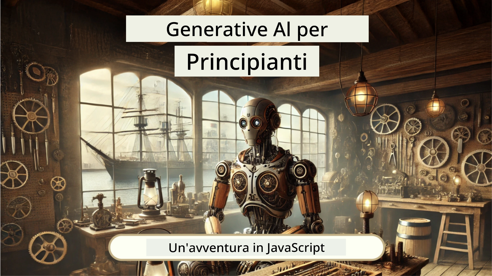
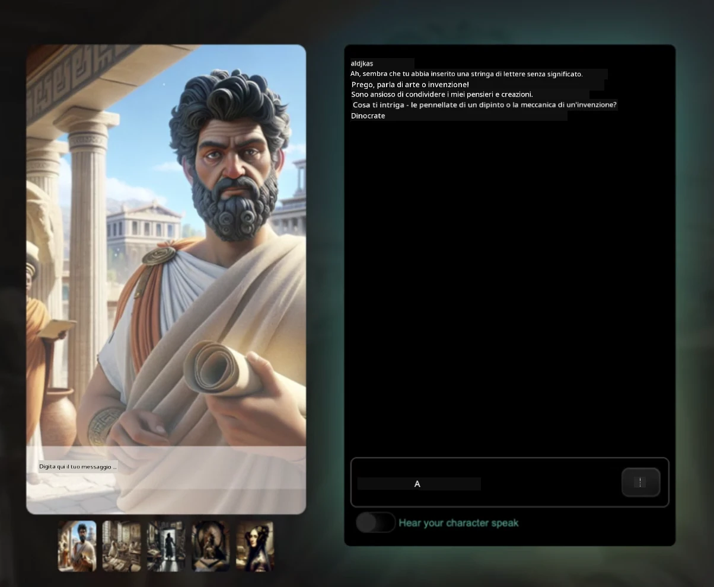
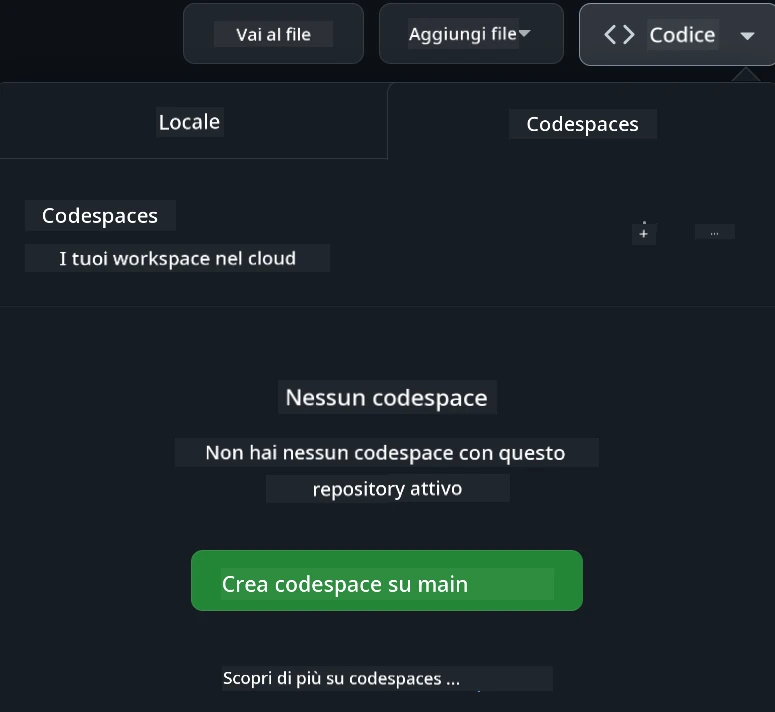

[](https://github.com/microsoft/Web-Dev-For-Beginners/blob/master/LICENSE)
[](https://GitHub.com/microsoft/Web-Dev-For-Beginners/graphs/contributors/)
[](https://GitHub.com/microsoft/Web-Dev-For-Beginners/issues/)
[](https://GitHub.com/microsoft/Web-Dev-For-Beginners/pulls/)
[](http://makeapullrequest.com) 

[](https://GitHub.com/microsoft/Web-Dev-For-Beginners/watchers/)
[](https://GitHub.com/microsoft/Web-Dev-For-Beginners/network/)
[](https://GitHub.com/microsoft/Web-Dev-For-Beginners/stargazers/)

[](https://discord.gg/nTYy5BXMWG)

# Sviluppo Web per Principianti - Un Curriculum

Impara le basi dello sviluppo web con il nostro corso completo di 12 settimane tenuto dai Microsoft Cloud Advocates. Ognuna delle 24 lezioni esplora JavaScript, CSS e HTML attraverso progetti pratici come terrari, estensioni per browser e giochi spaziali. Partecipa a quiz, discussioni e compiti pratici. Migliora le tue competenze e ottimizza la ritenzione delle conoscenze con la nostra efficace metodologia basata su progetti. Inizia oggi il tuo percorso di coding!

Unisciti alla Community Discord di Azure AI Foundry

[](https://discord.gg/nTYy5BXMWG)

Segui questi passaggi per iniziare a usare queste risorse:
1. **Effettua il Fork del Repository**: Clicca [](https://GitHub.com/microsoft/Web-Dev-For-Beginners/fork)
2. **Clona il Repository**:   `git clone https://github.com/microsoft/Web-Dev-For-Beginners.git`
3. [**Unisciti alla Azure AI Foundry Discord e incontra esperti e altri sviluppatori**](https://discord.com/invite/ByRwuEEgH4)

### 🌐 Supporto Multilingua

#### Supportato tramite GitHub Action (Automatizzato e Sempre Aggiornato)

<!-- CO-OP TRANSLATOR LANGUAGES TABLE START -->
[Arabic](../ar/README.md) | [Bengali](../bn/README.md) | [Bulgarian](../bg/README.md) | [Burmese (Myanmar)](../my/README.md) | [Chinese (Simplified)](../zh-CN/README.md) | [Chinese (Traditional, Hong Kong)](../zh-HK/README.md) | [Chinese (Traditional, Macau)](../zh-MO/README.md) | [Chinese (Traditional, Taiwan)](../zh-TW/README.md) | [Croatian](../hr/README.md) | [Czech](../cs/README.md) | [Danish](../da/README.md) | [Dutch](../nl/README.md) | [Estonian](../et/README.md) | [Finnish](../fi/README.md) | [French](../fr/README.md) | [German](../de/README.md) | [Greek](../el/README.md) | [Hebrew](../he/README.md) | [Hindi](../hi/README.md) | [Hungarian](../hu/README.md) | [Indonesian](../id/README.md) | [Italian](./README.md) | [Japanese](../ja/README.md) | [Kannada](../kn/README.md) | [Korean](../ko/README.md) | [Lithuanian](../lt/README.md) | [Malay](../ms/README.md) | [Malayalam](../ml/README.md) | [Marathi](../mr/README.md) | [Nepali](../ne/README.md) | [Nigerian Pidgin](../pcm/README.md) | [Norwegian](../no/README.md) | [Persian (Farsi)](../fa/README.md) | [Polish](../pl/README.md) | [Portuguese (Brazil)](../pt-BR/README.md) | [Portuguese (Portugal)](../pt-PT/README.md) | [Punjabi (Gurmukhi)](../pa/README.md) | [Romanian](../ro/README.md) | [Russian](../ru/README.md) | [Serbian (Cyrillic)](../sr/README.md) | [Slovak](../sk/README.md) | [Slovenian](../sl/README.md) | [Spanish](../es/README.md) | [Swahili](../sw/README.md) | [Swedish](../sv/README.md) | [Tagalog (Filipino)](../tl/README.md) | [Tamil](../ta/README.md) | [Telugu](../te/README.md) | [Thai](../th/README.md) | [Turkish](../tr/README.md) | [Ukrainian](../uk/README.md) | [Urdu](../ur/README.md) | [Vietnamese](../vi/README.md)

> **Preferisci Clonare Localmente?**

> Questo repository include oltre 50 traduzioni linguistiche che aumentano significativamente la dimensione del download. Per clonare senza traduzioni, usa il sparse checkout:
> ```bash
> git clone --filter=blob:none --sparse https://github.com/microsoft/Web-Dev-For-Beginners.git
> cd Web-Dev-For-Beginners
> git sparse-checkout set --no-cone '/*' '!translations' '!translated_images'
> ```
> Questo ti darà tutto ciò che ti serve per completare il corso con un download molto più veloce.
<!-- CO-OP TRANSLATOR LANGUAGES TABLE END -->

**Se desideri che vengano supportate ulteriori lingue di traduzione, troverai l’elenco [qui](https://github.com/Azure/co-op-translator/blob/main/getting_started/supported-languages.md)**

[](https://open.vscode.dev/microsoft/Web-Dev-For-Beginners)

#### 🧑‍🎓 _Sei uno studente?_

Visita la [**pagina Student Hub**](https://docs.microsoft.com/learn/student-hub/?WT.mc_id=academic-77807-sagibbon) dove troverai risorse per principianti, pacchetti per studenti e anche modi per ottenere un voucher gratuito per il certificato. Questa è la pagina che vuoi aggiungere ai preferiti e consultare di tanto in tanto, poiché i contenuti vengono aggiornati mensilmente.

### 📣 Annuncio - Nuove sfide per la modalità GitHub Copilot Agent da completare!

Nuova sfida aggiunta, cerca "GitHub Copilot Agent Challenge 🚀" nella maggior parte dei capitoli. È una nuova sfida da completare usando GitHub Copilot e la modalità Agent. Se non hai mai usato la modalità Agent, essa è in grado non solo di generare testo ma anche di creare e modificare file, eseguire comandi e altro.

### 📣 Annuncio - _Nuovo progetto da costruire utilizzando l’IA Generativa_ 

Nuovo progetto AI Assistant appena aggiunto, dai un’occhiata al [progetto](./9-chat-project/README.md)

### 📣 Annuncio - _Nuovo Curriculum_ sull’IA Generativa per JavaScript appena rilasciato

Non perdere il nostro nuovo curriculum sull’IA Generativa!

Visita [https://aka.ms/genai-js-course](https://aka.ms/genai-js-course) per iniziare!



- Lezioni che coprono tutto, dalle basi fino a RAG.
- Interagisci con personaggi storici usando GenAI e la nostra app companion.
- Narrazione divertente e coinvolgente, viaggerai nel tempo!




Ogni lezione include un compito da completare, un controllo delle conoscenze e una sfida per guidarti nell’apprendimento di argomenti come:
- Prompting e ingegneria dei prompt
- Generazione di app testuali e di immagini
- App di ricerca

Visita [https://aka.ms/genai-js-course](https://aka.ms/genai-js-course) per iniziare!


## 🌱 Iniziare

> **Insegnanti**, abbiamo [incluso alcuni suggerimenti](for-teachers.md) su come usare questo curriculum. Ci piacerebbe ricevere il vostro feedback [nel nostro forum di discussione](https://github.com/microsoft/Web-Dev-For-Beginners/discussions/categories/teacher-corner)!

**[Studenti](https://aka.ms/student-page/?WT.mc_id=academic-77807-sagibbon)**, per ogni lezione, iniziate con un quiz pre-lezione, seguite leggendo il materiale della lezione, completate le varie attività e verificate la vostra comprensione con il quiz post-lezione.

Per migliorare la tua esperienza di apprendimento, connettiti con i tuoi compagni di corso per lavorare insieme sui progetti! Le discussioni sono incoraggiate nel nostro [forum di discussione](https://github.com/microsoft/Web-Dev-For-Beginners/discussions) dove il nostro team di moderatori sarà disponibile per rispondere alle tue domande.

Per approfondire la tua formazione, ti consigliamo vivamente di esplorare [Microsoft Learn](https://learn.microsoft.com/users/wirelesslife/collections/p1ddcy5jwy0jkm?WT.mc_id=academic-77807-sagibbon) per materiali di studio aggiuntivi.

### 📋 Configura il tuo ambiente

Questo curriculum ha un ambiente di sviluppo pronto all’uso! Quando inizi puoi scegliere di eseguire il curriculum in un [Codespace](https://github.com/features/codespaces/) (_un ambiente basato su browser, senza necessità di installazioni_), oppure localmente sul tuo computer usando un editor di testo come [Visual Studio Code](https://code.visualstudio.com/?WT.mc_id=academic-77807-sagibbon).

#### Crea il tuo repository
Per salvare facilmente il tuo lavoro, è consigliato creare una tua copia di questo repository. Puoi farlo cliccando sul pulsante **Usa questo modello** in cima alla pagina. Questo creerà un nuovo repository nel tuo account GitHub con una copia del curriculum.

Segui questi passaggi:
1. **Effettua il Fork del Repository**: Clicca sul pulsante "Fork" in alto a destra di questa pagina.
2. **Clona il Repository**:   `git clone https://github.com/microsoft/Web-Dev-For-Beginners.git`

#### Esecuzione del curriculum in un Codespace

Nella tua copia di questo repository che hai creato, clicca sul pulsante **Code** e seleziona **Open with Codespaces**. Questo creerà un nuovo Codespace in cui lavorare.



#### Esecuzione del curriculum localmente sul tuo computer

Per eseguire questo curriculum localmente sul tuo computer, avrai bisogno di un editor di testo, un browser e uno strumento da linea di comando. La nostra prima lezione, [Introduzione ai Linguaggi di Programmazione e agli Strumenti del mestiere](../../1-getting-started-lessons/1-intro-to-programming-languages), ti guiderà attraverso varie opzioni per ciascuno di questi strumenti in modo che tu possa scegliere ciò che funziona meglio per te.

La nostra raccomandazione è di utilizzare [Visual Studio Code](https://code.visualstudio.com/?WT.mc_id=academic-77807-sagibbon) come editor, che include anche un [Terminale integrato](https://code.visualstudio.com/docs/terminal/basics/?WT.mc_id=academic-77807-sagibbon). Puoi scaricare Visual Studio Code [qui](https://code.visualstudio.com/?WT.mc_id=academic-77807-sagibbon).


1. Clona il tuo repository sul computer. Puoi farlo cliccando sul pulsante **Code** e copiando l'URL:

    [CodeSpace](./images/createcodespace.png)
    Quindi, apri [Terminale](https://code.visualstudio.com/docs/terminal/basics/?WT.mc_id=academic-77807-sagibbon) all'interno di [Visual Studio Code](https://code.visualstudio.com/?WT.mc_id=academic-77807-sagibbon) ed esegui il seguente comando, sostituendo `<your-repository-url>` con l'URL appena copiato:

    ```bash 
    git clone <your-repository-url>
    ```

2. Apri la cartella in Visual Studio Code. Puoi farlo cliccando su **File** > **Apri cartella** e selezionando la cartella appena clonata.


>  Estensioni consigliate per Visual Studio Code:
>
> * [Live Server](https://marketplace.visualstudio.com/items?itemName=ritwickdey.LiveServer&WT.mc_id=academic-77807-sagibbon) - per visualizzare in anteprima pagine HTML all'interno di Visual Studio Code
> * [Copilot](https://marketplace.visualstudio.com/items?itemName=GitHub.copilot&WT.mc_id=academic-77807-sagibbon) - per aiutarti a scrivere codice più velocemente

## 📂 Ogni lezione include:

- sketchnote opzionale
- video supplementare opzionale
- quiz preparatorio alla lezione
- lezione scritta
- per le lezioni basate su progetti, guide passo passo su come realizzare il progetto
- verifiche della conoscenza
- una sfida
- letture supplementari
- compito
- [quiz post-lezione](https://ff-quizzes.netlify.app/web/)

> **Una nota sui quiz**: tutti i quiz si trovano nella cartella Quiz-app, 48 quiz totali di tre domande ciascuno. Sono disponibili [qui](https://ff-quizzes.netlify.app/web/). L'app dei quiz può essere eseguita localmente o distribuita su Azure; segui le istruzioni nella cartella `quiz-app`.

## 🗃️ Lezioni

|     |                       Nome Progetto                        |                            Concetti Insegnati                             | Obiettivi di Apprendimento                                                                                                        |                                                         Lezione Collegata                                                          |         Autore          |
| :-: | :--------------------------------------------------------: | :----------------------------------------------------------------------: | --------------------------------------------------------------------------------------------------------------------------------- | :------------------------------------------------------------------------------------------------------------------------------: | :---------------------: |
| 01  |                     Getting Started                        |           Introduzione alla Programmazione e Strumenti del Mestiere        | Imparare i fondamenti di base della maggior parte dei linguaggi di programmazione e del software che aiuta gli sviluppatori      | [Intro to Programming Languages and Tools of the Trade](./1-getting-started-lessons/1-intro-to-programming-languages/README.md) |         Jasmine         |
| 02  |                     Getting Started                        |             Nozioni base di GitHub, compreso lavorare in team             | Come usare GitHub nel tuo progetto, come collaborare con altri su una base di codice                                             |                            [Intro to GitHub](./1-getting-started-lessons/2-github-basics/README.md)                             |          Floor          |
| 03  |                     Getting Started                        |                             Accessibilità                                 | Imparare le basi dell'accessibilità web                                                                                            |                       [Accessibility Fundamentals](./1-getting-started-lessons/3-accessibility/README.md)                       |       Christopher       |
| 04  |                        JS Basics                           |                         Tipi di Dati in JavaScript                        | Le basi dei tipi di dati in JavaScript                                                                                            |                                       [Data Types](./2-js-basics/1-data-types/README.md)                                        |         Jasmine         |
| 05  |                        JS Basics                           |                         Funzioni e Metodi                                | Impara a conoscere funzioni e metodi per gestire il flusso logico di un'applicazione                                              |                              [Functions and Methods](./2-js-basics/2-functions-methods/README.md)                               | Jasmine and Christopher |
| 06  |                        JS Basics                           |                      Prendere decisioni con JS                           | Impara a creare condizioni nel tuo codice usando metodi decisionali                                                               |                                 [Making Decisions](./2-js-basics/3-making-decisions/README.md)                                  |         Jasmine         |
| 07  |                        JS Basics                           |                          Array e Cicli                                   | Lavora con i dati usando array e cicli in JavaScript                                                                               |                                   [Arrays and Loops](./2-js-basics/4-arrays-loops/README.md)                                    |         Jasmine         |
| 08  |       [Terrarium](./3-terrarium/solution/README.md)       |                           HTML in Pratica                                | Costruisci l'HTML per creare un terrario online, concentrandoti sulla creazione del layout                                         |                                 [Introduction to HTML](./3-terrarium/1-intro-to-html/README.md)                                 |           Jen           |
| 09  |       [Terrarium](./3-terrarium/solution/README.md)       |                            CSS in Pratica                                | Costruisci il CSS per stilizzare il terrario online, concentrandoti sulle basi del CSS inclusa la realizzazione di una pagina responsiva |                                  [Introduction to CSS](./3-terrarium/2-intro-to-css/README.md)                                  |           Jen           |
| 10  |            [Terrarium](./3-terrarium/solution/README.md)            |                 Closure in JavaScript, manipolazione del DOM              | Costruisci il JavaScript per far funzionare il terrario come interfaccia drag/drop, concentrandoti su closure e manipolazione del DOM |                  [JavaScript Closures, DOM manipulation](./3-terrarium/3-intro-to-DOM-and-closures/README.md)                   |           Jen           |
| 11  |          [Typing Game](./4-typing-game/solution/README.md)          |                          Costruire un gioco di digitazione                | Impara a usare eventi da tastiera per guidare la logica dell'app JavaScript                                                       |                                [Event-Driven Programming](./4-typing-game/typing-game/README.md)                                |       Christopher       |
| 12  | [Green Browser Extension](./5-browser-extension/solution/README.md) |                         Lavorare con i Browser                          | Impara come funzionano i browser, la loro storia, e come strutturare i primi elementi di un'estensione browser                     |                               [About Browsers](./5-browser-extension/1-about-browsers/README.md)                                |           Jen           |
| 13  | [Green Browser Extension](./5-browser-extension/solution/README.md) | Costruire un form, chiamare un'API e memorizzare variabili in local storage | Costruisci gli elementi JavaScript dell'estensione browser per chiamare un'API usando variabili memorizzate in local storage        |                [APIs, Forms, and Local Storage](./5-browser-extension/2-forms-browsers-local-storage/README.md)                 |           Jen           |
| 14  | [Green Browser Extension](./5-browser-extension/solution/README.md) |          Processi in background nel browser, prestazioni web             | Usa i processi in background del browser per gestire l'icona dell'estensione; imparare sulle prestazioni web e alcune ottimizzazioni per migliorare |             [Background Tasks and Performance](./5-browser-extension/3-background-tasks-and-performance/README.md)              |           Jen           |
| 15  |           [Space Game](./6-space-game/solution/README.md)           |             Sviluppo di giochi avanzato con JavaScript                    | Impara l'Ereditarietà usando sia Classi che Composizione e il modello Pub/Sub, in preparazione alla costruzione di un gioco       |                      [Introduction to Advanced Game Development](./6-space-game/1-introduction/README.md)                       |          Chris          |
| 16  |           [Space Game](./6-space-game/solution/README.md)           |                           Disegnare su canvas                             | Impara l'API Canvas, usata per disegnare elementi su uno schermo                                                                   |                                [Drawing to Canvas](./6-space-game/2-drawing-to-canvas/README.md)                                |          Chris          |
| 17  |           [Space Game](./6-space-game/solution/README.md)           |                   Spostare elementi sullo schermo                        | Scopri come gli elementi possono ottenere movimento usando coordinate cartesiane e l'API Canvas                                    |                           [Moving Elements Around](./6-space-game/3-moving-elements-around/README.md)                           |          Chris          |
| 18  |           [Space Game](./6-space-game/solution/README.md)           |                          Rilevamento collisioni                          | Fai collidere gli elementi e reagire tra di loro usando i tasti premuti e fornisci una funzione di cooldown per assicurare le prestazioni del gioco |                              [Collision Detection](./6-space-game/4-collision-detection/README.md)                              |          Chris          |
| 19  |           [Space Game](./6-space-game/solution/README.md)           |                             Tenere il punteggio                           | Esegui calcoli matematici basati sullo stato e sulle prestazioni del gioco                                                        |                                    [Keeping Score](./6-space-game/5-keeping-score/README.md)                                    |          Chris          |
| 20  |           [Space Game](./6-space-game/solution/README.md)           |                     Terminare e riavviare il gioco                       | Impara come terminare e riavviare il gioco, inclusa la pulizia delle risorse e il reset dei valori delle variabili                |                                [The Ending Condition](./6-space-game/6-end-condition/README.md)                                 |          Chris          |
| 21  |         [Banking App](./7-bank-project/solution/README.md)          |                Template HTML e Routing in un'app web                     | Impara a creare la struttura architettonica di un sito multipagina usando routing e template HTML                                |                            [HTML Templates and Routes](./7-bank-project/1-template-route/README.md)                             |          Yohan          |
| 22  |         [Banking App](./7-bank-project/solution/README.md)          |                  Costruire un form di Login e Registrazione              | Impara a costruire form e gestire routine di validazione                                                                           |                                           [Forms](./7-bank-project/2-forms/README.md)                                           |          Yohan          |
| 23  |         [Banking App](./7-bank-project/solution/README.md)          |                   Metodi per recuperare e usare dati                      | Come i dati entrano ed escono dalla tua app, come recuperarli, conservarli e smaltirli                                            |                                            [Data](./7-bank-project/3-data/README.md)                                            |          Yohan          |
| 24  |         [Banking App](./7-bank-project/solution/README.md)          |                     Concetti di gestione dello stato                      | Impara come la tua app conserva lo stato e come gestirlo programmativamente                                                      |                                [State Management](./7-bank-project/4-state-management/README.md)                                |          Yohan          |
| 25 | [Browser/VScode Code](../../8-code-editor) | Lavorare con VScode | Impara a usare un editor di codice| [Usa l’editor di codice VScode](./8-code-editor/1-using-a-code-editor/README.md) | Chris |
| 26 | [AI Assistants](./9-chat-project/README.md) | Lavorare con l’AI | Impara a costruire il tuo assistente AI | [Progetto Assistente AI](./9-chat-project/README.md) | Chris |

## 🏫 Pedagogia

Il nostro curriculum è progettato con due principi pedagogici chiave in mente:
* apprendimento basato su progetti
* quiz frequenti

Il programma insegna le basi di JavaScript, HTML e CSS, così come gli strumenti più recenti e le tecniche usate dagli sviluppatori web di oggi. Gli studenti avranno l'opportunità di sviluppare esperienza pratica costruendo un gioco di digitazione, un terrario virtuale, un'estensione browser eco-friendly, un gioco in stile space invaders e un'app bancaria per aziende. Alla fine della serie, gli studenti avranno acquisito una solida comprensione dello sviluppo web.

> 🎓 Puoi seguire le prime lezioni di questo curriculum come un [Percorso di Apprendimento](https://docs.microsoft.com/learn/paths/web-development-101/?WT.mc_id=academic-77807-sagibbon) su Microsoft Learn!

Garantendo che i contenuti siano allineati ai progetti, il processo diventa più coinvolgente per gli studenti e la ritenzione dei concetti aumenterà. Abbiamo anche scritto alcune lezioni introduttive sulle basi di JavaScript per introdurre i concetti, abbinate a un video della collezione di tutorial video "[Beginners Series to: JavaScript](https://channel9.msdn.com/Series/Beginners-Series-to-JavaScript/?WT.mc_id=academic-77807-sagibbon)", alcuni dei cui autori hanno contribuito a questo curriculum.

Inoltre, un quiz a bassa pressione prima di una lezione stabilisce l'intenzione dello studente verso l'apprendimento di un argomento, mentre un secondo quiz dopo la lezione assicura una maggiore ritenzione. Questo curriculum è progettato per essere flessibile e divertente e può essere seguito interamente o in parte. I progetti partono piccoli e diventano progressivamente più complessi entro la fine del ciclo di 12 settimane.

Pur avendo volutamente evitato di introdurre framework JavaScript per concentrare l'attenzione sulle competenze di base necessarie come sviluppatore web prima di adottare un framework, una buona fase successiva per completare questo curriculum sarebbe imparare Node.js tramite un'altra raccolta di video: "[Beginner Series to: Node.js](https://channel9.msdn.com/Series/Beginners-Series-to-Nodejs/?WT.mc_id=academic-77807-sagibbon)".

> Consulta il nostro [Codice di Condotta](CODE_OF_CONDUCT.md) e le linee guida su [Come Contribuire](CONTRIBUTING.md). Accogliamo con piacere il tuo feedback costruttivo!


## 🧭 Accesso offline

Puoi eseguire questa documentazione offline usando [Docsify](https://docsify.js.org/#/). Fai il fork di questo repository, [installa Docsify](https://docsify.js.org/#/quickstart) sulla tua macchina locale, e poi nella cartella radice di questo repository, digita `docsify serve`. Il sito sarà servito sulla porta 3000 sul tuo localhost: `localhost:3000`.

## 📘 PDF

Un PDF di tutte le lezioni può essere trovato [qui](https://microsoft.github.io/Web-Dev-For-Beginners/pdf/readme.pdf).


## 🎒 Altri Corsi
Il nostro team produce altri corsi! Dai un'occhiata a:

<!-- CO-OP TRANSLATOR OTHER COURSES START -->
### LangChain
[](https://aka.ms/langchain4j-for-beginners)
[](https://aka.ms/langchainjs-for-beginners?WT.mc_id=m365-94501-dwahlin)
[](https://github.com/microsoft/langchain-for-beginners?WT.mc_id=m365-94501-dwahlin)
---

### Azure / Edge / MCP / Agents
[](https://github.com/microsoft/AZD-for-beginners?WT.mc_id=academic-105485-koreyst)
[](https://github.com/microsoft/edgeai-for-beginners?WT.mc_id=academic-105485-koreyst)
[](https://github.com/microsoft/mcp-for-beginners?WT.mc_id=academic-105485-koreyst)
[](https://github.com/microsoft/ai-agents-for-beginners?WT.mc_id=academic-105485-koreyst)

---
 
### Serie Intelligenza Artificiale Generativa
[](https://github.com/microsoft/generative-ai-for-beginners?WT.mc_id=academic-105485-koreyst)
[-9333EA?style=for-the-badge&labelColor=E5E7EB&color=9333EA)](https://github.com/microsoft/Generative-AI-for-beginners-dotnet?WT.mc_id=academic-105485-koreyst)
[-C084FC?style=for-the-badge&labelColor=E5E7EB&color=C084FC)](https://github.com/microsoft/generative-ai-for-beginners-java?WT.mc_id=academic-105485-koreyst)
[-E879F9?style=for-the-badge&labelColor=E5E7EB&color=E879F9)](https://github.com/microsoft/generative-ai-with-javascript?WT.mc_id=academic-105485-koreyst)

---
 
### Apprendimento di Base
[](https://aka.ms/ml-beginners?WT.mc_id=academic-105485-koreyst)
[](https://aka.ms/datascience-beginners?WT.mc_id=academic-105485-koreyst)
[](https://aka.ms/ai-beginners?WT.mc_id=academic-105485-koreyst)
[](https://github.com/microsoft/Security-101?WT.mc_id=academic-96948-sayoung)
[](https://aka.ms/webdev-beginners?WT.mc_id=academic-105485-koreyst)
[](https://aka.ms/iot-beginners?WT.mc_id=academic-105485-koreyst)
[](https://github.com/microsoft/xr-development-for-beginners?WT.mc_id=academic-105485-koreyst)

---
 
### Serie Copilot
[](https://aka.ms/GitHubCopilotAI?WT.mc_id=academic-105485-koreyst)
[](https://github.com/microsoft/mastering-github-copilot-for-dotnet-csharp-developers?WT.mc_id=academic-105485-koreyst)
[](https://github.com/microsoft/CopilotAdventures?WT.mc_id=academic-105485-koreyst)
<!-- CO-OP TRANSLATOR OTHER COURSES END -->

## Ottenere Aiuto

Se rimani bloccato o hai domande sulla creazione di app AI. Unisciti ad altri studenti e sviluppatori esperti nelle discussioni su MCP. È una comunità di supporto dove le domande sono benvenute e la conoscenza viene condivisa liberamente.

[](https://discord.gg/nTYy5BXMWG)

Se hai feedback sul prodotto o errori mentre costruisci, visita:

[](https://aka.ms/foundry/forum)

## Licenza

Questo repository è concesso in licenza sotto la licenza MIT. Consulta il file [LICENSE](../../LICENSE) per maggiori informazioni.

---

<!-- CO-OP TRANSLATOR DISCLAIMER START -->
**Disclaimer**:  
Questo documento è stato tradotto utilizzando il servizio di traduzione automatica [Co-op Translator](https://github.com/Azure/co-op-translator). Pur impegnandoci per garantire l’accuratezza, si prega di considerare che le traduzioni automatiche possono contenere errori o imprecisioni. Il documento originale nella sua lingua nativa deve essere considerato la fonte autorevole. Per informazioni critiche, si raccomanda una traduzione professionale effettuata da un umano. Non ci assumiamo alcuna responsabilità per eventuali malintesi o interpretazioni errate derivanti dall’uso di questa traduzione.
<!-- CO-OP TRANSLATOR DISCLAIMER END -->