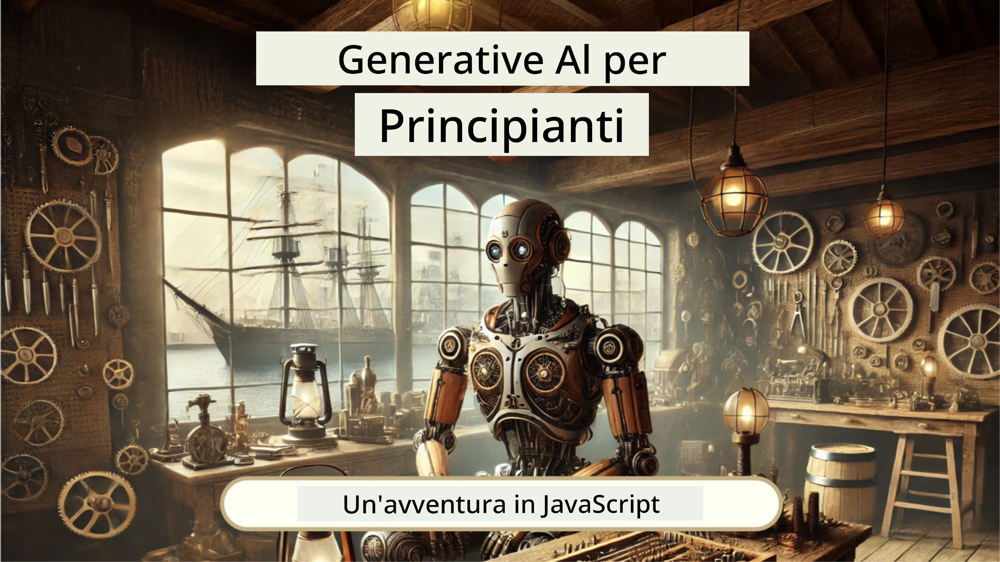
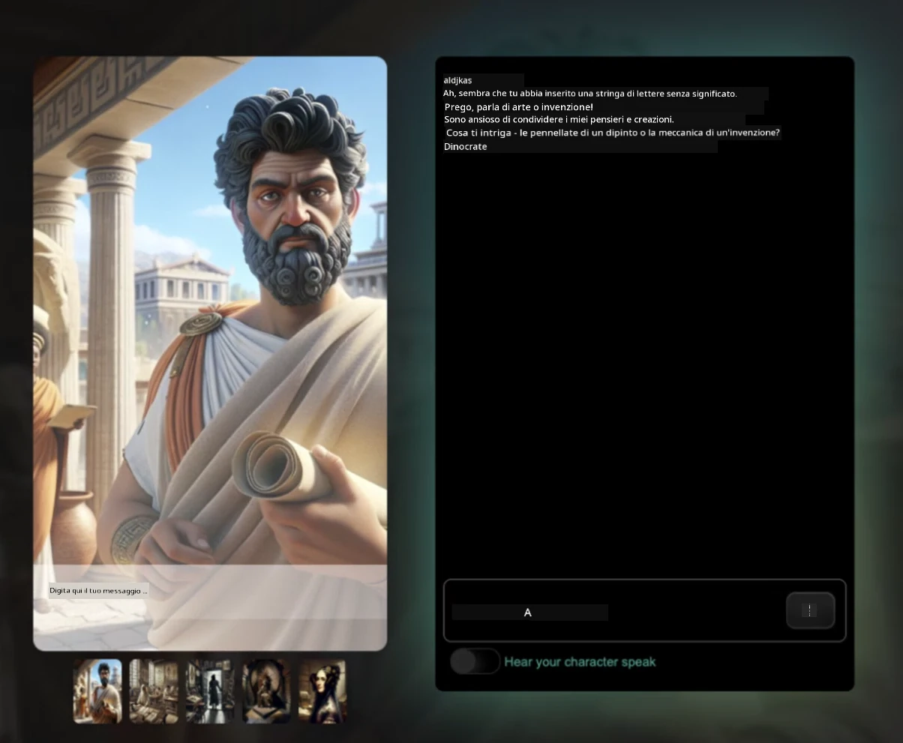
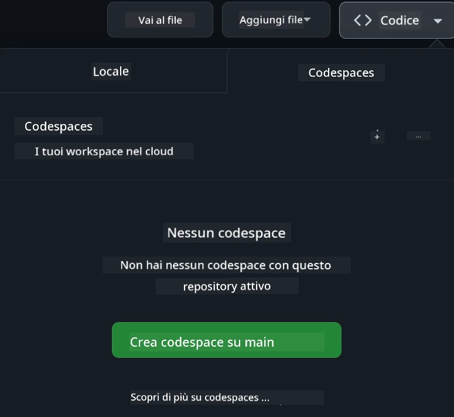

[](https://github.com/microsoft/Web-Dev-For-Beginners/blob/master/LICENSE)
[](https://GitHub.com/microsoft/Web-Dev-For-Beginners/graphs/contributors/)
[](https://GitHub.com/microsoft/Web-Dev-For-Beginners/issues/)
[](https://GitHub.com/microsoft/Web-Dev-For-Beginners/pulls/)
[](http://makeapullrequest.com) 

[](https://GitHub.com/microsoft/Web-Dev-For-Beginners/watchers/)
[](https://GitHub.com/microsoft/Web-Dev-For-Beginners/network/)
[](https://GitHub.com/microsoft/Web-Dev-For-Beginners/stargazers/)

[](https://discord.gg/nTYy5BXMWG)

# Sviluppo Web per Principianti - Un Curriculum

Impara i fondamenti dello sviluppo web con il nostro corso completo di 12 settimane tenuto dai Microsoft Cloud Advocates. Ognuna delle 24 lezioni esplora JavaScript, CSS e HTML attraverso progetti pratici come terrari, estensioni per browser e giochi spaziali. Partecipa a quiz, discussioni e compiti pratici. Migliora le tue abilità e ottimizza la ritenzione della conoscenza con la nostra pedagogia efficace basata su progetti. Inizia oggi il tuo percorso di programmazione!

Unisciti al Discord di Azure AI Foundry e incontra esperti e sviluppatori.

[](https://discord.gg/nTYy5BXMWG)

Segui questi passaggi per iniziare a usare queste risorse:
1. **Forka il Repository**: Clicca [](https://GitHub.com/microsoft/Web-Dev-For-Beginners/fork)
2. **Clona il Repository**:   `git clone https://github.com/microsoft/Web-Dev-For-Beginners.git`
3. [**Unisciti al Discord di Azure AI Foundry e incontra esperti e altri sviluppatori**](https://discord.com/invite/ByRwuEEgH4)

### 🌐 Supporto Multilingue

#### Supportato tramite GitHub Action (Automatizzato e Sempre Aggiornato)

<!-- CO-OP TRANSLATOR LANGUAGES TABLE START -->
[Arabo](../ar/README.md) | [Bengalese](../bn/README.md) | [Bulgaro](../bg/README.md) | [Birmano (Myanmar)](../my/README.md) | [Cinese (Semplificato)](../zh-CN/README.md) | [Cinese (Tradizionale, Hong Kong)](../zh-HK/README.md) | [Cinese (Tradizionale, Macau)](../zh-MO/README.md) | [Cinese (Tradizionale, Taiwan)](../zh-TW/README.md) | [Croato](../hr/README.md) | [Ceco](../cs/README.md) | [Danese](../da/README.md) | [Olandese](../nl/README.md) | [Estone](../et/README.md) | [Finlandese](../fi/README.md) | [Francese](../fr/README.md) | [Tedesco](../de/README.md) | [Greco](../el/README.md) | [Ebraico](../he/README.md) | [Hindi](../hi/README.md) | [Ungherese](../hu/README.md) | [Indonesiano](../id/README.md) | [Italiano](./README.md) | [Giapponese](../ja/README.md) | [Kannada](../kn/README.md) | [Khmer](../km/README.md) | [Coreano](../ko/README.md) | [Lituano](../lt/README.md) | [Malese](../ms/README.md) | [Malayalam](../ml/README.md) | [Marathi](../mr/README.md) | [Nepalese](../ne/README.md) | [Pidgin Nigeriano](../pcm/README.md) | [Norvegese](../no/README.md) | [Persiano (Farsi)](../fa/README.md) | [Polacco](../pl/README.md) | [Portoghese (Brasile)](../pt-BR/README.md) | [Portoghese (Portogallo)](../pt-PT/README.md) | [Punjabi (Gurmukhi)](../pa/README.md) | [Rumeno](../ro/README.md) | [Russo](../ru/README.md) | [Serbo (Cirillico)](../sr/README.md) | [Slovacco](../sk/README.md) | [Sloveno](../sl/README.md) | [Spagnolo](../es/README.md) | [Swahili](../sw/README.md) | [Svedese](../sv/README.md) | [Tagalog (Filippino)](../tl/README.md) | [Tamil](../ta/README.md) | [Telugu](../te/README.md) | [Thailandese](../th/README.md) | [Turco](../tr/README.md) | [Ucraino](../uk/README.md) | [Urdu](../ur/README.md) | [Vietnamita](../vi/README.md)

> **Preferisci clonare localmente?**
>
> Questo repository include più di 50 traduzioni che aumentano significativamente la dimensione del download. Per clonare senza traduzioni, usa lo sparse checkout:
>
> **Bash / macOS / Linux:**
> ```bash
> git clone --filter=blob:none --sparse https://github.com/microsoft/Web-Dev-For-Beginners.git
> cd Web-Dev-For-Beginners
> git sparse-checkout set --no-cone '/*' '!translations' '!translated_images'
> ```
>
> **CMD (Windows):**
> ```cmd
> git clone --filter=blob:none --sparse https://github.com/microsoft/Web-Dev-For-Beginners.git
> cd Web-Dev-For-Beginners
> git sparse-checkout set --no-cone "/*" "!translations" "!translated_images"
> ```
>
> Questo ti fornisce tutto il necessario per completare il corso con un download molto più veloce.
<!-- CO-OP TRANSLATOR LANGUAGES TABLE END -->

**Se desideri traduzioni aggiuntive, le lingue supportate sono elencate [qui](https://github.com/Azure/co-op-translator/blob/main/getting_started/supported-languages.md)**

[](https://open.vscode.dev/microsoft/Web-Dev-For-Beginners)

#### 🧑‍🎓 _Sei uno studente?_

Visita la [**pagina Student Hub**](https://docs.microsoft.com/learn/student-hub/?WT.mc_id=academic-77807-sagibbon) dove troverai risorse per principianti, pacchetti per studenti e persino modi per ottenere un voucher gratuito per il certificato. Questa è la pagina da aggiungere ai preferiti e consultare di tanto in tanto, poiché i contenuti vengono aggiornati mensilmente.

### 📣 Annuncio - Nuove sfide in modalità GitHub Copilot Agent da completare!

Nuova sfida aggiunta, cerca "GitHub Copilot Agent Challenge 🚀" nella maggior parte dei capitoli. È una nuova sfida da completare usando GitHub Copilot e la modalità Agent. Se non hai mai usato la modalità Agent prima, essa non si limita a generare testo, ma può anche creare e modificare file, eseguire comandi e altro.

### 📣 Annuncio - _Nuovo progetto da costruire usando l'IA Generativa_ 

Nuovo progetto AI Assistant appena aggiunto, dai un'occhiata [progetto](./9-chat-project/README.md)

### 📣 Annuncio - _Nuovo curriculum_ sull’IA Generativa per JavaScript è stato appena rilasciato

Non perdere il nostro nuovo curriculum sull’IA Generativa!

Visita [https://aka.ms/genai-js-course](https://aka.ms/genai-js-course) per iniziare!



- Lezioni che coprono tutto dalle basi al RAG.
- Interagisci con personaggi storici usando GenAI e la nostra app companion.
- Narrativa divertente e coinvolgente, viaggerai nel tempo!




Ogni lezione include un compito da completare, un controllo della conoscenza e una sfida per guidarti nell’apprendimento di argomenti come:
- Prompting e ingegneria dei prompt
- Generazione di app di testo e immagini
- App di ricerca

Visita [https://aka.ms/genai-js-course](https://aka.ms/genai-js-course) per iniziare!


## 🌱 Iniziare

> **Insegnanti**, abbiamo [incluso alcuni suggerimenti](for-teachers.md) su come usare questo curriculum. Ci piacerebbe avere il vostro feedback [nel nostro forum di discussione](https://github.com/microsoft/Web-Dev-For-Beginners/discussions/categories/teacher-corner)!

**[Studenti](https://aka.ms/student-page/?WT.mc_id=academic-77807-sagibbon)**, per ogni lezione, iniziate con un quiz pre-lezione e proseguite leggendo il materiale didattico, completando le varie attività e verificando la comprensione con il quiz post-lezione.

Per migliorare la tua esperienza di apprendimento, connettiti con i tuoi pari per lavorare insieme ai progetti! Le discussioni sono incoraggiate nel nostro [forum di discussione](https://github.com/microsoft/Web-Dev-For-Beginners/discussions) dove il nostro team di moderatori sarà disponibile a rispondere alle tue domande.

Per approfondire ulteriormente, ti consigliamo di esplorare [Microsoft Learn](https://learn.microsoft.com/users/wirelesslife/collections/p1ddcy5jwy0jkm?WT.mc_id=academic-77807-sagibbon) per materiali di studio aggiuntivi.

### 📋 Configurare l’ambiente

Questo curriculum ha un ambiente di sviluppo pronto all’uso! Quando inizi puoi scegliere di eseguire il curriculum in un [Codespace](https://github.com/features/codespaces/) (_un ambiente basato su browser, senza installazioni necessarie_), oppure localmente sul tuo computer usando un editor di testo come [Visual Studio Code](https://code.visualstudio.com/?WT.mc_id=academic-77807-sagibbon).

#### Crea il tuo repository
Per salvare facilmente il tuo lavoro, si consiglia di creare una copia di questo repository. Puoi farlo cliccando sul pulsante **Usa questo modello** in cima alla pagina. Questo creerà un nuovo repository nel tuo account GitHub con una copia del curriculum.

Segui questi passaggi:
1. **Forka il Repository**: Clicca sul pulsante "Fork" nell’angolo in alto a destra di questa pagina.
2. **Clona il Repository**:   `git clone https://github.com/microsoft/Web-Dev-For-Beginners.git`

#### Eseguire il curriculum in un Codespace

Nella tua copia di questo repository, clicca il pulsante **Code** e seleziona **Apri con Codespaces**. Questo creerà un nuovo Codespace in cui lavorare.



#### Eseguire il curriculum localmente sul tuo computer

Per eseguire questo curriculum localmente sul tuo computer, avrai bisogno di un editor di testo, un browser e uno strumento da linea di comando. La nostra prima lezione, [Introduzione ai linguaggi di programmazione e agli strumenti del mestiere](../../1-getting-started-lessons/1-intro-to-programming-languages), ti guiderà attraverso varie opzioni per ciascuno di questi strumenti per selezionare ciò che funziona meglio per te.

La nostra raccomandazione è di usare [Visual Studio Code](https://code.visualstudio.com/?WT.mc_id=academic-77807-sagibbon) come editor, che include anche un [Terminale integrato](https://code.visualstudio.com/docs/terminal/basics/?WT.mc_id=academic-77807-sagibbon). Puoi scaricare Visual Studio Code [qui](https://code.visualstudio.com/?WT.mc_id=academic-77807-sagibbon).
1. Clona il tuo repository sul computer. Puoi farlo cliccando il pulsante **Code** e copiando l'URL:

    [CodeSpace](./images/createcodespace.png)

    Poi, apri il [Terminal](https://code.visualstudio.com/docs/terminal/basics/?WT.mc_id=academic-77807-sagibbon) all'interno di [Visual Studio Code](https://code.visualstudio.com/?WT.mc_id=academic-77807-sagibbon) ed esegui il seguente comando, sostituendo `<your-repository-url>` con l'URL che hai appena copiato:

    ```bash 
    git clone <your-repository-url>
    ```

2. Apri la cartella in Visual Studio Code. Puoi farlo cliccando su **File** > **Open Folder** e selezionando la cartella appena clonata.


>  Estensioni consigliate di Visual Studio Code:
>
> * [Live Server](https://marketplace.visualstudio.com/items?itemName=ritwickdey.LiveServer&WT.mc_id=academic-77807-sagibbon) - per visualizzare le pagine HTML all'interno di Visual Studio Code
> * [Copilot](https://marketplace.visualstudio.com/items?itemName=GitHub.copilot&WT.mc_id=academic-77807-sagibbon) - per aiutarti a scrivere codice più velocemente

## 📂 Ogni lezione include:

- sketchnote opzionale
- video supplementare opzionale
- quiz di riscaldamento prima della lezione
- lezione scritta
- per le lezioni basate su progetti, guide passo-passo su come costruire il progetto
- verifiche di conoscenza
- una sfida
- lettura supplementare
- compito
- [quiz post-lezione](https://ff-quizzes.netlify.app/web/)

> **Una nota sui quiz**: Tutti i quiz sono contenuti nella cartella Quiz-app, in totale 48 quiz da tre domande ciascuno. Sono disponibili [qui](https://ff-quizzes.netlify.app/web/), l'app del quiz può essere eseguita localmente o distribuita su Azure; segui le istruzioni nella cartella `quiz-app`.

## 🗃️ Lezioni

|     |                       Nome del Progetto                       |                            Concetti Insegnati                             | Obiettivi di Apprendimento                                                                                                                 |                                                         Lezione Collegata                                                          |         Autore          |
| :-: | :------------------------------------------------------------: | :------------------------------------------------------------------------: | ------------------------------------------------------------------------------------------------------------------------------------------- | :----------------------------------------------------------------------------------------------------------------------------------: | :---------------------: |
| 01  |                     Iniziando                               |           Introduzione alla Programmazione e agli Strumenti del Mestiere           | Impara le basi alla base della maggior parte dei linguaggi di programmazione e il software che aiuta gli sviluppatori professionisti a fare il loro lavoro | [Introduzione ai Linguaggi di Programmazione e Strumenti del Mestiere](./1-getting-started-lessons/1-intro-to-programming-languages/README.md) |         Jasmine         |
| 02  |                     Iniziando                               |             Nozioni di base di GitHub, inclusa la collaborazione in team             | Come usare GitHub nel tuo progetto, come collaborare con altri su una base di codice                                                  |                            [Introduzione a GitHub](./1-getting-started-lessons/2-github-basics/README.md)                             |          Floor          |
| 03  |                     Iniziando                               |                             Accessibilità                              | Impara le basi dell'accessibilità web                                                                                               |                       [Fondamenti di Accessibilità](./1-getting-started-lessons/3-accessibility/README.md)                       |       Christopher       |
| 04  |                        Basi di JS                          |                         Tipi di Dati in JavaScript                          | Le basi dei tipi di dati in JavaScript                                                                                                 |                                       [Tipi di Dati](./2-js-basics/1-data-types/README.md)                                        |         Jasmine         |
| 05  |                        Basi di JS                          |                         Funzioni e Metodi                          | Impara a conoscere funzioni e metodi per gestire il flusso logico di un'applicazione                                                             |                              [Funzioni e Metodi](./2-js-basics/2-functions-methods/README.md)                               | Jasmine e Christopher |
| 06  |                        Basi di JS                          |                        Fare decisioni con JS                        | Impara a creare condizioni nel tuo codice usando metodi decisionali                                                           |                                 [Prendere decisioni](./2-js-basics/3-making-decisions/README.md)                                  |         Jasmine         |
| 07  |                        Basi di JS                          |                            Array e Cicli                            | Lavora con i dati usando array e cicli in JavaScript                                                                                 |                                   [Array e Cicli](./2-js-basics/4-arrays-loops/README.md)                                    |         Jasmine         |
| 08  |       [Terrarium](./3-terrarium/solution/README.md)       |                            HTML in Pratica                            | Costruisci l'HTML per creare un terrario online, focalizzandoti sulla costruzione di un layout                                                         |                                 [Introduzione a HTML](./3-terrarium/1-intro-to-html/README.md)                                 |           Jen           |
| 09  |       [Terrarium](./3-terrarium/solution/README.md)       |                            CSS in Pratica                             | Costruisci il CSS per stilizzare il terrario online, focalizzandoti sulle basi di CSS incluso il rendere la pagina responsive                     |                                  [Introduzione a CSS](./3-terrarium/2-intro-to-css/README.md)                                  |           Jen           |
| 10  |            [Terrarium](./3-terrarium/solution/README.md)            |                 Chiusure in JavaScript, manipolazione del DOM                  | Costruisci il JavaScript per far funzionare il terrario come interfaccia drag/drop, focalizzandoti su chiusure e manipolazione del DOM             |                  [Chiusure in JavaScript, manipolazione del DOM](./3-terrarium/3-intro-to-DOM-and-closures/README.md)                   |           Jen           |
| 11  |          [Typing Game](./4-typing-game/solution/README.md)          |                          Costruire un Gioco di Digitazione                           | Impara a usare gli eventi da tastiera per guidare la logica della tua app JavaScript                                                          |                                [Programmazione Event-Driven](./4-typing-game/typing-game/README.md)                                |       Christopher       |
| 12  | [Estensione Browser Verde](./5-browser-extension/solution/README.md) |                         Lavorare con i Browser                          | Impara come funzionano i browser, la loro storia e come strutturare i primi elementi di un'estensione per browser                               |                               [Informazioni sui Browser](./5-browser-extension/1-about-browsers/README.md)                                |           Jen           |
| 13  | [Estensione Browser Verde](./5-browser-extension/solution/README.md) | Costruire un modulo, chiamare un'API e memorizzare variabili in memoria locale | Costruisci gli elementi JavaScript della tua estensione per browser per chiamare un'API usando variabili memorizzate in memoria locale                      |                [API, Moduli e Memoria Locale](./5-browser-extension/2-forms-browsers-local-storage/README.md)                 |           Jen           |
| 14  | [Estensione Browser Verde](./5-browser-extension/solution/README.md) |          Processi in background nel browser, prestazioni web          | Usa i processi in background del browser per gestire l'icona dell'estensione; impara sulle prestazioni web e alcune ottimizzazioni per migliorare   |             [Attività in background e prestazioni](./5-browser-extension/3-background-tasks-and-performance/README.md)              |           Jen           |
| 15  |           [Gioco Spaziale](./6-space-game/solution/README.md)           |             Sviluppo avanzato di giochi con JavaScript             | Impara l'ereditarietà usando sia Classi che Composizione e il pattern Pub/Sub, in preparazione per costruire un gioco              |                      [Introduzione allo Sviluppo Avanzato di Giochi](./6-space-game/1-introduction/README.md)                       |          Chris          |
| 16  |           [Gioco Spaziale](./6-space-game/solution/README.md)           |                           Disegnare su canvas                            | Impara l'API Canvas, usata per disegnare elementi su schermo                                                                       |                                [Disegnare su Canvas](./6-space-game/2-drawing-to-canvas/README.md)                                |          Chris          |
| 17  |           [Gioco Spaziale](./6-space-game/solution/README.md)           |                   Muovere elementi intorno allo schermo                    | Scopri come gli elementi possono acquisire movimento usando le coordinate cartesiane e l'API Canvas                                            |                           [Spostare Elementi](./6-space-game/3-moving-elements-around/README.md)                           |          Chris          |
| 18  |           [Gioco Spaziale](./6-space-game/solution/README.md)           |                          Rilevamento collisioni                           | Fai collidere gli elementi e fai reagire l'uno all'altro usando pressioni di tasti e fornisci una funzione di cooldown per garantire le prestazioni del gioco    |                              [Rilevamento Collisioni](./6-space-game/4-collision-detection/README.md)                              |          Chris          |
| 19  |           [Gioco Spaziale](./6-space-game/solution/README.md)           |                             Tenere il punteggio                              | Esegui calcoli matematici basati sullo stato e sulle prestazioni del gioco                                                                |                                    [Tenere il punteggio](./6-space-game/5-keeping-score/README.md)                                    |          Chris          |
| 20  |           [Gioco Spaziale](./6-space-game/solution/README.md)           |                     Terminare e riavviare il gioco                     | Impara a terminare e riavviare il gioco, incluso pulire le risorse e resettare i valori delle variabili                              |                                [La Condizione di Fine](./6-space-game/6-end-condition/README.md)                                 |          Chris          |
| 21  |         [App Bancaria](./7-bank-project/solution/README.md)          |                 Template HTML e Routing in un'app web                 | Impara a creare lo scheletro dell'architettura di un sito multipagina usando routing e template HTML                             |                            [Template HTML e Routing](./7-bank-project/1-template-route/README.md)                             |          Yohan          |
| 22  |         [App Bancaria](./7-bank-project/solution/README.md)          |                  Costruire un modulo di Login e Registrazione                   | Impara a costruire moduli e gestire routine di validazione                                                                          |                                           [Moduli](./7-bank-project/2-forms/README.md)                                           |          Yohan          |
| 23  |         [App Bancaria](./7-bank-project/solution/README.md)          |                   Metodi per recuperare e usare dati                   | Come i dati fluiscono dentro e fuori dalla tua app, come recuperarli, conservarli e smaltirli                                                 |                                            [Dati](./7-bank-project/3-data/README.md)                                            |          Yohan          |
| 24  |         [App Bancaria](./7-bank-project/solution/README.md)          |                      Concetti di Gestione dello Stato                      | Impara come la tua app mantiene lo stato e come gestirlo programmaticamente                                                              |                                [Gestione dello Stato](./7-bank-project/4-state-management/README.md)                                |          Yohan          |
| 25 | [Codice Browser/VScode](../../8-code-editor) | Lavorare con VScode | Impara a usare un editor di codice | [Usare l'editor di codice VScode](./8-code-editor/1-using-a-code-editor/README.md) | Chris |
| 26 | [Assistenti AI](./9-chat-project/README.md) | Lavorare con l'AI | Impara a costruire il tuo assistente AI | [Progetto Assistente AI](./9-chat-project/README.md) | Chris |

## 🏫 Pedagogia

Il nostro curriculum è progettato con due principi pedagogici chiave in mente:
* apprendimento basato su progetti
* quiz frequenti

Il programma insegna i fondamenti di JavaScript, HTML e CSS, così come gli strumenti e le tecniche più recenti usate dagli sviluppatori web di oggi. Gli studenti avranno l'opportunità di acquisire esperienza pratica costruendo un gioco di digitazione, un terrario virtuale, un'estensione browser ecologica, un gioco in stile space invader e un'app bancaria per aziende. Alla fine della serie, gli studenti avranno acquisito una solida comprensione dello sviluppo web.

> 🎓 Puoi seguire le prime lezioni di questo curriculum come un [Percorso di Apprendimento](https://docs.microsoft.com/learn/paths/web-development-101/?WT.mc_id=academic-77807-sagibbon) su Microsoft Learn!

Assicurando che i contenuti siano allineati ai progetti, il processo è reso più coinvolgente per gli studenti e la ritenzione dei concetti sarà aumentata. Abbiamo anche scritto diverse lezioni introduttive sulle basi di JavaScript per introdurre i concetti, abbinate a un video della collezione "[Beginners Series to: JavaScript](https://channel9.msdn.com/Series/Beginners-Series-to-JavaScript/?WT.mc_id=academic-77807-sagibbon)", alcuni dei cui autori hanno contribuito a questo curriculum.

Inoltre, un quiz a bassa pressione prima della lezione stabilisce l'intento dello studente verso l'apprendimento di un argomento, mentre un secondo quiz dopo la lezione assicura ulteriore ritenzione. Questo curriculum è stato progettato per essere flessibile e divertente e può essere seguito interamente o in parte. I progetti iniziano piccoli e diventano sempre più complessi verso la fine del ciclo di 12 settimane.

Mentre abbiamo volutamente evitato di introdurre framework JavaScript per concentrarci sulle competenze di base necessarie come sviluppatore web prima di adottare un framework, un buon passo successivo per completare questo curriculum sarebbe imparare Node.js tramite un'altra collezione di video: "[Beginner Series to: Node.js](https://channel9.msdn.com/Series/Beginners-Series-to-Nodejs/?WT.mc_id=academic-77807-sagibbon)".

> Visita le nostre linee guida [Codice di Condotta](CODE_OF_CONDUCT.md) e [Contributi](CONTRIBUTING.md). Accogliamo con favore il tuo feedback costruttivo!


## 🧭 Accesso offline

Puoi eseguire questa documentazione offline usando [Docsify](https://docsify.js.org/#/). Forka questo repo, [installa Docsify](https://docsify.js.org/#/quickstart) sulla tua macchina locale, e poi nella cartella radice di questo repo, digita `docsify serve`. Il sito web sarà servito sulla porta 3000 del tuo localhost: `localhost:3000`.

## 📘 PDF
Un PDF di tutte le lezioni può essere trovato [qui](https://microsoft.github.io/Web-Dev-For-Beginners/pdf/readme.pdf).


## 🎒 Altri Corsi

Il nostro team produce altri corsi! Dai un'occhiata a:

<!-- CO-OP TRANSLATOR OTHER COURSES START -->
### LangChain
[](https://aka.ms/langchain4j-for-beginners)
[](https://aka.ms/langchainjs-for-beginners?WT.mc_id=m365-94501-dwahlin)
[](https://github.com/microsoft/langchain-for-beginners?WT.mc_id=m365-94501-dwahlin)
---

### Azure / Edge / MCP / Agents
[](https://github.com/microsoft/AZD-for-beginners?WT.mc_id=academic-105485-koreyst)
[](https://github.com/microsoft/edgeai-for-beginners?WT.mc_id=academic-105485-koreyst)
[](https://github.com/microsoft/mcp-for-beginners?WT.mc_id=academic-105485-koreyst)
[](https://github.com/microsoft/ai-agents-for-beginners?WT.mc_id=academic-105485-koreyst)

---
 
### Series AI Generativa
[](https://github.com/microsoft/generative-ai-for-beginners?WT.mc_id=academic-105485-koreyst)
[-9333EA?style=for-the-badge&labelColor=E5E7EB&color=9333EA)](https://github.com/microsoft/Generative-AI-for-beginners-dotnet?WT.mc_id=academic-105485-koreyst)
[-C084FC?style=for-the-badge&labelColor=E5E7EB&color=C084FC)](https://github.com/microsoft/generative-ai-for-beginners-java?WT.mc_id=academic-105485-koreyst)
[-E879F9?style=for-the-badge&labelColor=E5E7EB&color=E879F9)](https://github.com/microsoft/generative-ai-with-javascript?WT.mc_id=academic-105485-koreyst)

---
 
### Apprendimento Base
[](https://aka.ms/ml-beginners?WT.mc_id=academic-105485-koreyst)
[](https://aka.ms/datascience-beginners?WT.mc_id=academic-105485-koreyst)
[](https://aka.ms/ai-beginners?WT.mc_id=academic-105485-koreyst)
[](https://github.com/microsoft/Security-101?WT.mc_id=academic-96948-sayoung)
[](https://aka.ms/webdev-beginners?WT.mc_id=academic-105485-koreyst)
[](https://aka.ms/iot-beginners?WT.mc_id=academic-105485-koreyst)
[](https://github.com/microsoft/xr-development-for-beginners?WT.mc_id=academic-105485-koreyst)

---
 
### Serie Copilot
[](https://aka.ms/GitHubCopilotAI?WT.mc_id=academic-105485-koreyst)
[](https://github.com/microsoft/mastering-github-copilot-for-dotnet-csharp-developers?WT.mc_id=academic-105485-koreyst)
[](https://github.com/microsoft/CopilotAdventures?WT.mc_id=academic-105485-koreyst)
<!-- CO-OP TRANSLATOR OTHER COURSES END -->

## Ottenere Aiuto

Se rimani bloccato o hai domande sulla creazione di app AI. Unisciti a studenti e sviluppatori esperti nelle discussioni su MCP. È una comunità di supporto dove le domande sono benvenute e la conoscenza è condivisa liberamente.

[](https://discord.gg/nTYy5BXMWG)

Se hai feedback sul prodotto o errori durante la creazione, visita:

[](https://aka.ms/foundry/forum)

## Licenza

Questo repository è concesso in licenza sotto la licenza MIT. Vedi il file [LICENSE](../../LICENSE) per maggiori informazioni.

---

<!-- CO-OP TRANSLATOR DISCLAIMER START -->
**Disclaimer**:
Questo documento è stato tradotto utilizzando il servizio di traduzione AI [Co-op Translator](https://github.com/Azure/co-op-translator). Pur impegnandoci per l'accuratezza, si prega di notare che le traduzioni automatiche possono contenere errori o inesattezze. Il documento originale nella sua lingua nativa deve essere considerato la fonte autorevole. Per informazioni critiche, si consiglia una traduzione professionale umana. Non siamo responsabili per eventuali fraintendimenti o interpretazioni errate derivanti dall'uso di questa traduzione.
<!-- CO-OP TRANSLATOR DISCLAIMER END -->