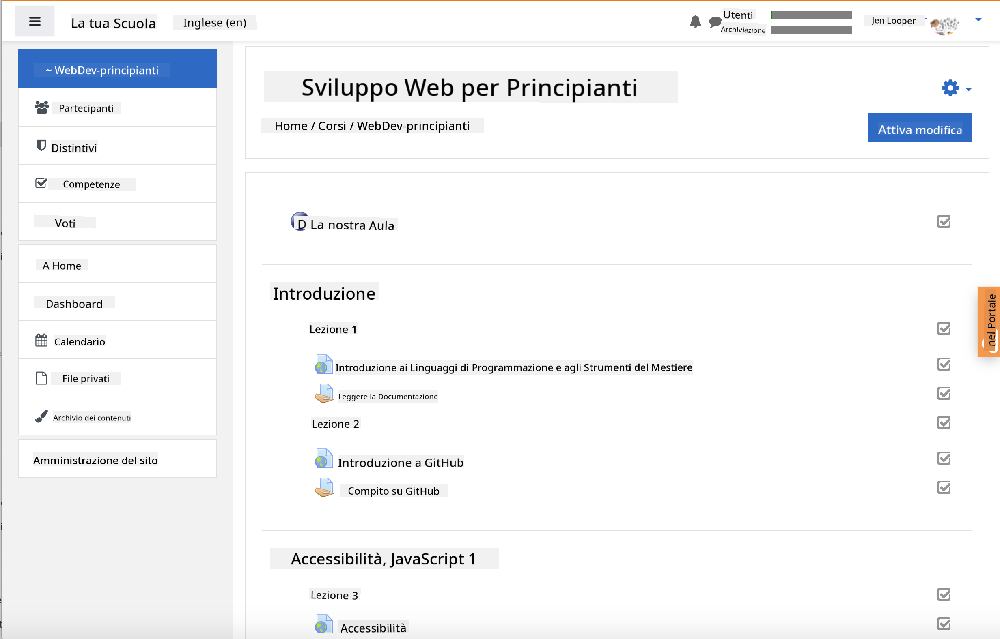
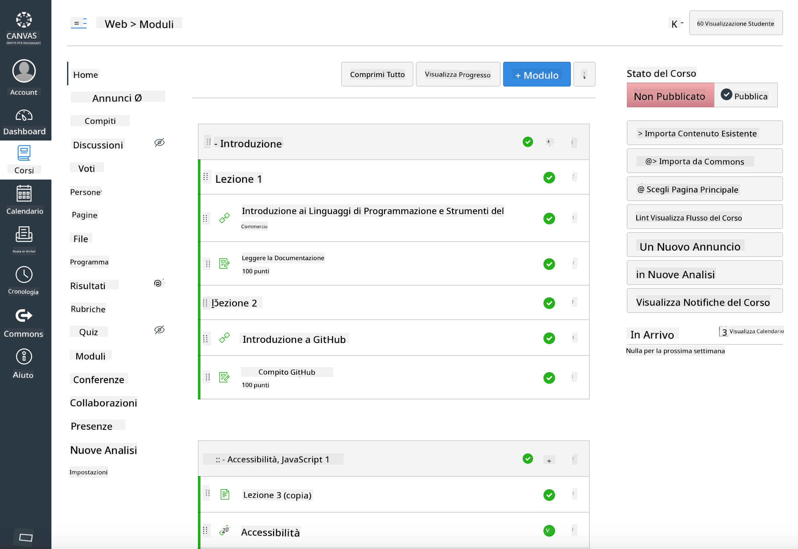

<!--
CO_OP_TRANSLATOR_METADATA:
{
  "original_hash": "75cb51f7ca9ea0b097ef4a1287e9290c",
  "translation_date": "2025-08-25T20:57:22+00:00",
  "source_file": "for-teachers.md",
  "language_code": "it"
}
-->
## Per gli Educatori

Vorresti utilizzare questo curriculum nella tua classe? Sentiti libero di farlo!

Infatti, puoi usarlo direttamente su GitHub utilizzando GitHub Classroom.

Per farlo, fai un fork di questo repository. Avrai bisogno di creare un repository per ogni lezione, quindi dovrai estrarre ogni cartella in un repository separato. In questo modo, [GitHub Classroom](https://classroom.github.com/classrooms) potrà gestire ogni lezione separatamente.

Queste [istruzioni complete](https://github.blog/2020-03-18-set-up-your-digital-classroom-with-github-classroom/) ti daranno un'idea di come configurare la tua classe.

## Utilizzarlo in Moodle, Canvas o Blackboard

Questo curriculum funziona bene in questi Sistemi di Gestione dell'Apprendimento! Usa il [file di caricamento per Moodle](../../../../../../../teaching-files/webdev-moodle.mbz) per il contenuto completo, oppure prova il [file Common Cartridge](../../../../../../../teaching-files/webdev-common-cartridge.imscc) che contiene parte del contenuto. Moodle Cloud non supporta esportazioni complete in formato Common Cartridge, quindi è preferibile utilizzare il file di download per Moodle, che può essere caricato in Canvas. Facci sapere come possiamo migliorare questa esperienza.

  
> Il curriculum in una classe Moodle

  
> Il curriculum in Canvas

## Utilizzare il repository così com'è

Se desideri utilizzare questo repository nello stato attuale, senza passare per GitHub Classroom, è possibile farlo. Dovrai comunicare ai tuoi studenti quale lezione seguire insieme.

In un formato online (Zoom, Teams o altri), potresti creare stanze di gruppo per i quiz e fare da mentore agli studenti per aiutarli a prepararsi all'apprendimento. Poi invita gli studenti a partecipare ai quiz e a inviare le loro risposte come 'issue' a un orario stabilito. Potresti fare lo stesso con i compiti, se desideri che gli studenti lavorino in modo collaborativo e in modo aperto.

Se preferisci un formato più privato, chiedi ai tuoi studenti di fare un fork del curriculum, lezione per lezione, nei loro repository GitHub privati, e di darti accesso. In questo modo, potranno completare quiz e compiti in privato e inviarteli tramite issue sul tuo repository della classe.

Ci sono molti modi per far funzionare questo approccio in un'aula online. Facci sapere quale funziona meglio per te!

## Dacci il tuo feedback!

Vogliamo rendere questo curriculum utile per te e i tuoi studenti. Connettiti con noi nella [Teacher corner](https://github.com/microsoft/Web-Dev-For-Beginners/discussions/categories/teacher-corner) e apri una [**nuova issue**](https://github.com/microsoft/Web-Dev-For-Beginners/issues/new/choose) per qualsiasi richiesta, bug o feedback.

**Disclaimer (Avvertenza)**:  
Questo documento è stato tradotto utilizzando il servizio di traduzione automatica [Co-op Translator](https://github.com/Azure/co-op-translator). Sebbene ci impegniamo per garantire l'accuratezza, si prega di tenere presente che le traduzioni automatiche possono contenere errori o imprecisioni. Il documento originale nella sua lingua nativa dovrebbe essere considerato la fonte autorevole. Per informazioni critiche, si raccomanda una traduzione professionale eseguita da un traduttore umano. Non siamo responsabili per eventuali malintesi o interpretazioni errate derivanti dall'uso di questa traduzione.