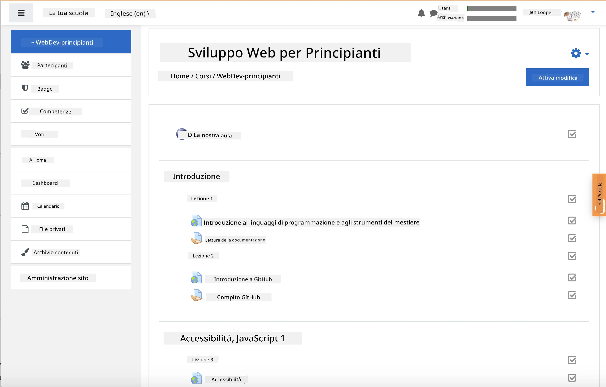
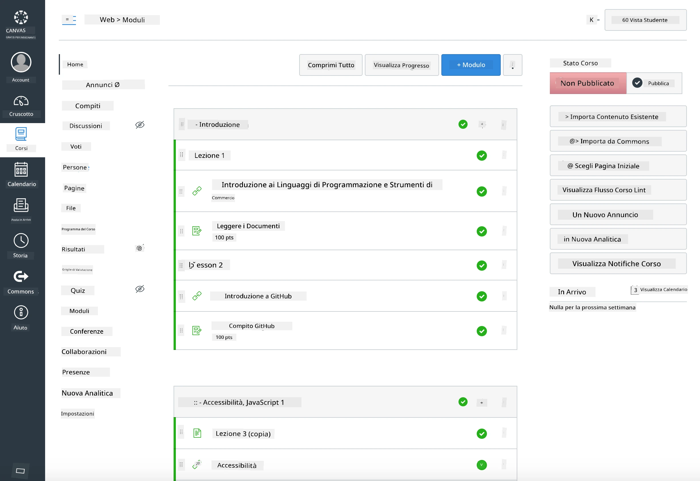

<!--
CO_OP_TRANSLATOR_METADATA:
{
  "original_hash": "71009af209f81cc01a1f2d324200375f",
  "translation_date": "2025-10-03T09:35:25+00:00",
  "source_file": "for-teachers.md",
  "language_code": "it"
}
-->
### Per gli educatori

Siete invitati a utilizzare questo curriculum nella vostra classe. Funziona perfettamente con GitHub Classroom e le principali piattaforme LMS, e può anche essere utilizzato come repository autonomo con i vostri studenti.

### Utilizzo con GitHub Classroom

Per gestire lezioni e compiti per ogni gruppo, create un repository per ogni lezione in modo che GitHub Classroom possa collegare ogni compito in modo indipendente.

- Forkate questo repository nella vostra organizzazione.
- Create un repository separato per ogni lezione estraendo ogni cartella della lezione in un proprio repository.
  - Opzione A: Create repository vuoti (uno per lezione) e copiate i contenuti della cartella della lezione in ciascuno.
  - Opzione B: Utilizzate un approccio che preservi la cronologia Git (ad esempio, dividere una cartella in un nuovo repository) se avete bisogno della provenienza.
- In GitHub Classroom, create un compito per ogni lezione e collegatelo al repository corrispondente.
- Impostazioni consigliate:
  - Visibilità del repository: privata per il lavoro degli studenti.
  - Utilizzate il codice iniziale dal branch predefinito del repository della lezione.
  - Aggiungete modelli di issue e pull request per quiz e consegne.
  - Configurate opzionalmente autovalutazioni e test se le vostre lezioni li includono.
- Convenzioni utili:
  - Nomi dei repository come lesson-01-intro, lesson-02-html, ecc.
  - Etichette: quiz, assignment, needs-review, late, resubmission.
  - Tag/rilasci per gruppo (ad esempio, v2025-term1).

Suggerimento: Evitate di archiviare i repository in cartelle sincronizzate (ad esempio, OneDrive/Google Drive) per prevenire conflitti Git su Windows.

### Utilizzo con Moodle, Canvas o Blackboard

Questo curriculum include pacchetti importabili per flussi di lavoro comuni su LMS.

- Moodle: Utilizzate il file di caricamento Moodle [Moodle upload file](../../../../../../../teaching-files/webdev-moodle.mbz) per caricare l'intero corso.
- Common Cartridge: Utilizzate il file Common Cartridge [Common Cartridge file](../../../../../../../teaching-files/webdev-common-cartridge.imscc) per una compatibilità più ampia con gli LMS.
- Note:
  - Moodle Cloud ha un supporto limitato per Common Cartridge. Preferite il file Moodle sopra, che può anche essere caricato in Canvas.
  - Dopo l'importazione, rivedete i moduli, le date di scadenza e le impostazioni dei quiz per adattarli al vostro calendario.

> Il curriculum in una classe Moodle

> Il curriculum in Canvas

### Utilizzo diretto del repository (senza Classroom)

Se preferite non utilizzare GitHub Classroom, potete gestire il corso direttamente da questo repository.

- Formati sincroni/online (Zoom/Teams):
  - Organizzate brevi sessioni introduttive guidate da un mentore; utilizzate le breakout rooms per i quiz.
  - Annunciate una finestra temporale per i quiz; gli studenti inviano le risposte come Issues su GitHub.
  - Per i compiti collaborativi, gli studenti lavorano nei repository pubblici delle lezioni e aprono pull request.
- Formati privati/asincroni:
  - Gli studenti forkano ogni lezione nei propri repository **privati** e vi aggiungono come collaboratore.
  - Consegne tramite Issues (quiz) e Pull Requests (compiti) sul vostro repository della classe o sui loro fork privati.

### Migliori pratiche

- Fornite una lezione di orientamento sulle basi di Git/GitHub, Issues e PRs.
- Utilizzate checklist negli Issues per quiz/compiti a più passaggi.
- Aggiungete CONTRIBUTING.md e CODE_OF_CONDUCT.md per stabilire le norme della classe.
- Aggiungete note sull'accessibilità (testo alternativo, didascalie) e offrite PDF stampabili.
- Versionate i vostri contenuti per ogni termine e bloccate i repository delle lezioni dopo la pubblicazione.

### Feedback e supporto

Vogliamo che questo curriculum funzioni per voi e i vostri studenti. Aprite un nuovo Issue in questo repository per segnalare bug, richieste o miglioramenti, oppure avviate una discussione nella Teacher Corner.

---

**Disclaimer**:  
Questo documento è stato tradotto utilizzando il servizio di traduzione AI [Co-op Translator](https://github.com/Azure/co-op-translator). Sebbene ci impegniamo per garantire l'accuratezza, si prega di notare che le traduzioni automatiche possono contenere errori o imprecisioni. Il documento originale nella sua lingua nativa dovrebbe essere considerato la fonte autorevole. Per informazioni critiche, si raccomanda una traduzione professionale effettuata da un esperto umano. Non siamo responsabili per eventuali incomprensioni o interpretazioni errate derivanti dall'uso di questa traduzione.