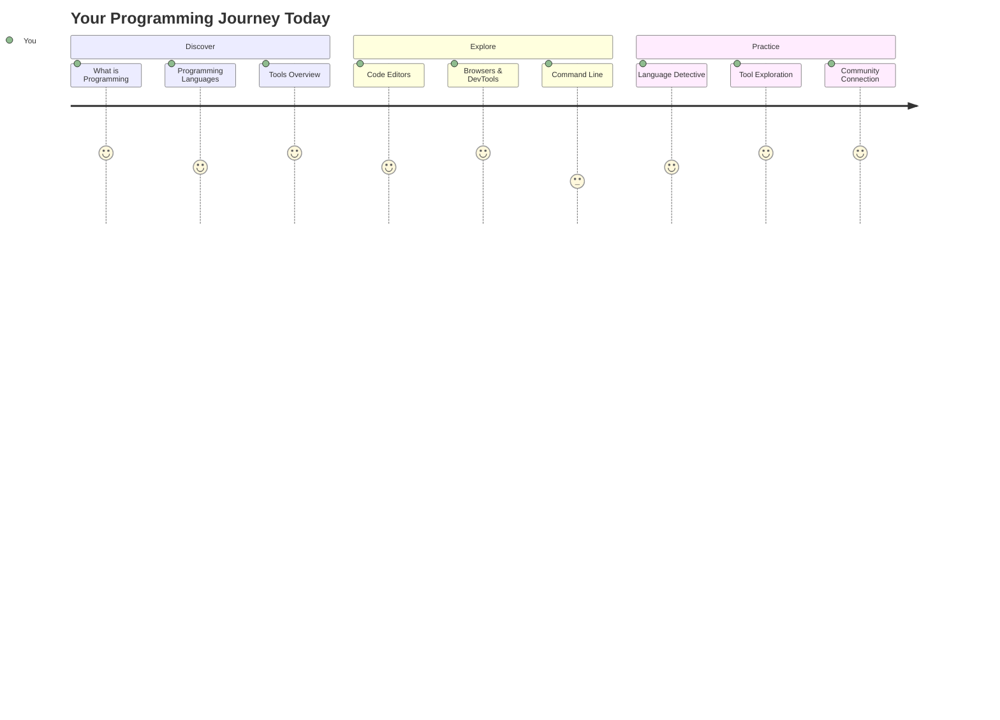
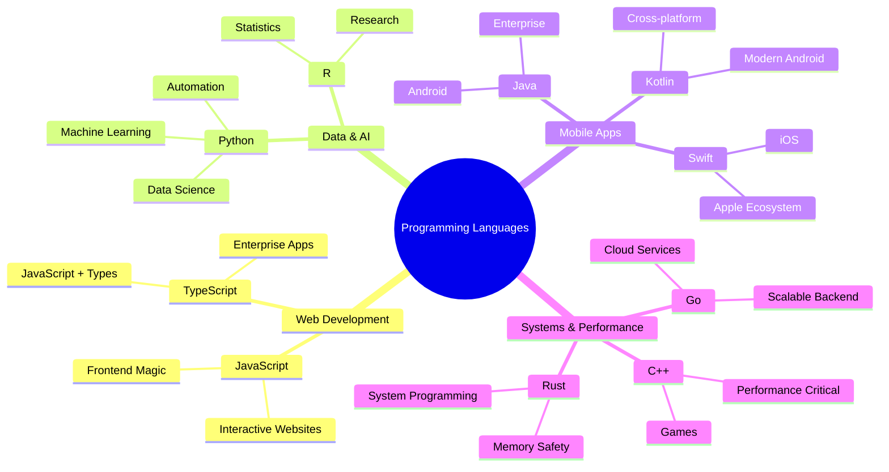
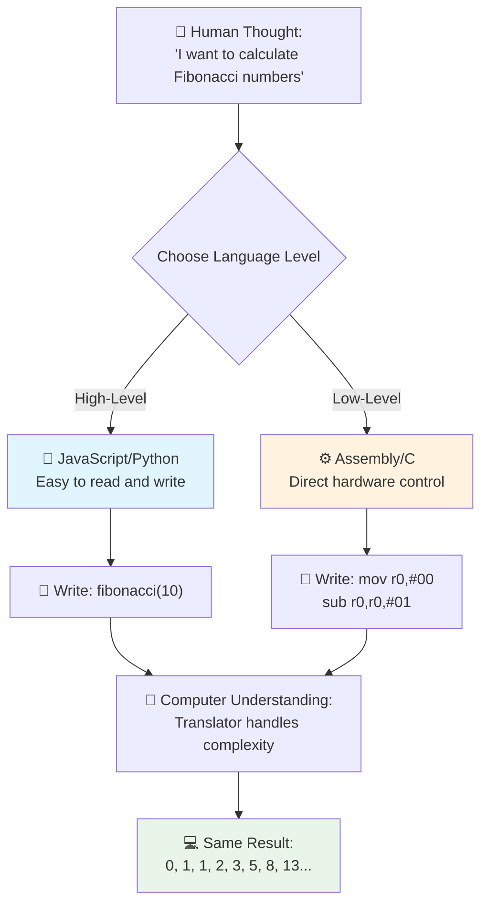
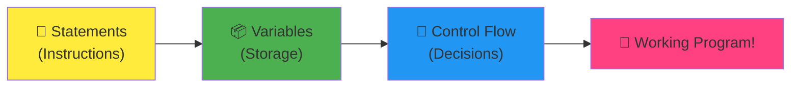
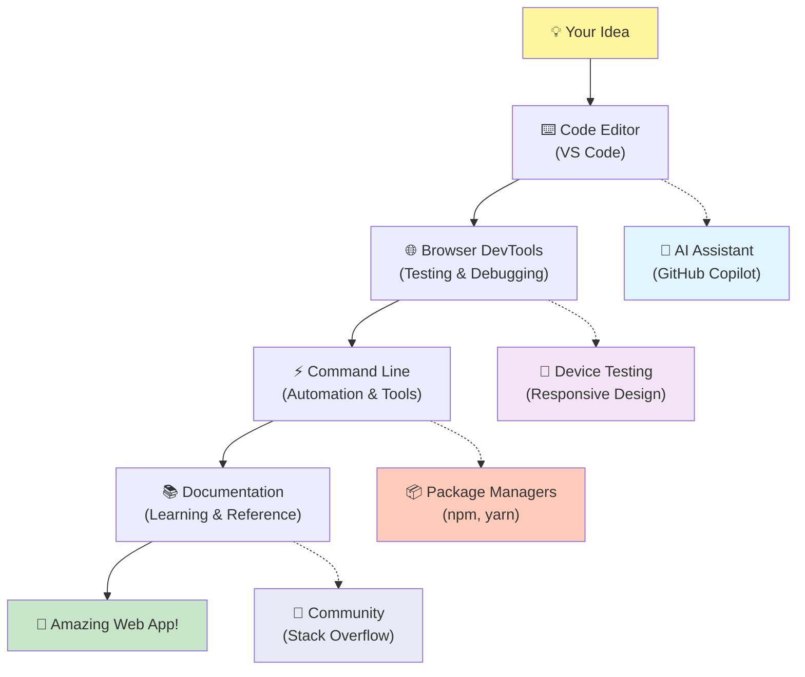
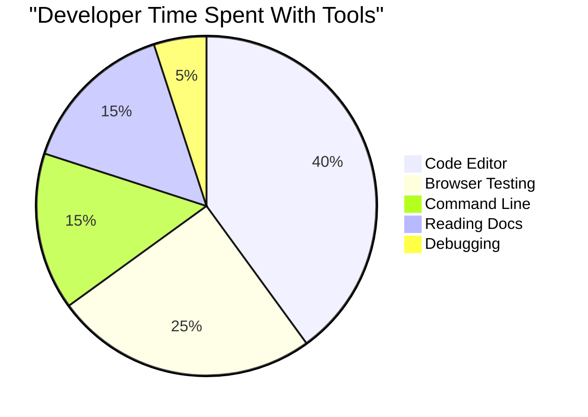
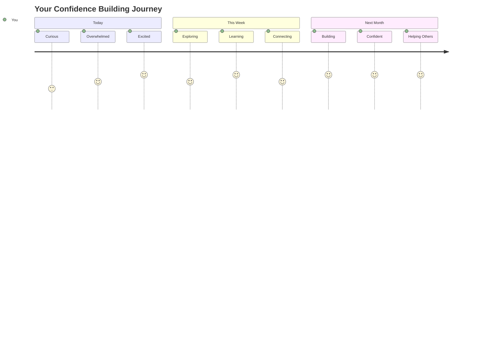

# プログラミング言語と現代の開発ツールの紹介

こんにちは、未来の開発者さん！👋 毎日ワクワクすることをお伝えしてもいいですか？プログラミングは単なるコンピューターの操作ではなく、自分のアイデアを形にするための実際のスーパーパワーを手に入れることなんです！

お気に入りのアプリを使っていて、すべてが完璧に動いている瞬間を感じたことはありませんか？ボタンをタップすると、魔法のようなことが起こり、「どうやってこんなことを実現したの？」と思う瞬間です。それを作ったのは、あなたと同じような人かもしれません。お気に入りのカフェで深夜2時にエスプレッソを飲みながらコードを書いていたかもしれません。そして驚くべきことに、このレッスンが終わる頃には、彼らがどうやってそれを実現したのか理解できるだけでなく、自分でも試してみたくなるでしょう！

正直に言うと、プログラミングが今はちょっと怖いと感じるかもしれません。私が初めて始めたとき、数学の天才である必要があるとか、5歳の頃からコードを書いている必要があると思っていました。でも、私の考えを完全に変えたのはこれです：プログラミングは新しい言語で会話を学ぶのとまったく同じなんです。「こんにちは」や「ありがとう」から始めて、コーヒーを注文できるようになり、気づけば深い哲学的な議論をしているような感じです。ただし、この場合、コンピューターと会話しているわけで、正直言って、コンピューターは最も忍耐強い会話相手です。間違いを判断せず、何度でも試すことにワクワクしてくれます！

今日は、現代のウェブ開発を可能にするだけでなく、夢中にさせる素晴らしいツールを探求します。NetflixやSpotify、そしてお気に入りのインディーアプリスタジオの開発者が毎日使っているエディター、ブラウザ、ワークフローについて話します。そして、これがあなたを踊りたくさせる部分です：これらのプロ仕様の業界標準ツールのほとんどが完全に無料なんです！


> スケッチノート提供：[Tomomi Imura](https://twitter.com/girlie_mac)



## まずはあなたの知識をチェック！

楽しい部分に入る前に、あなたがこのプログラミングの世界について何を知っているか知りたいです。そして、もしこれらの質問を見て「全然わからない」と思ったとしても、それは完璧です！それは、まさにここがあなたにぴったりの場所だということです。このクイズは、運動前のストレッチのようなものです。脳の筋肉をウォームアップしているだけです！

[事前レッスンのクイズを受ける](https://forms.office.com/r/dru4TE0U9n?origin=lprLink)

## これから始まる冒険

さて、今日探求することについて本当にワクワクしています！正直言って、いくつかの概念が理解できたときのあなたの顔を見たいくらいです。これが私たちが一緒に進む素晴らしい旅です：

- **プログラミングとは何か（そしてなぜそれが最高にクールなのか！）** – コードが目に見えない魔法のように、周りのすべてを動かしていることを発見します。月曜日の朝を知らせるアラームからNetflixのおすすめを完璧に選ぶアルゴリズムまで。
- **プログラミング言語とその驚くべき個性** – 問題解決の方法が全く異なるスーパーパワーを持つ人々が集まるパーティーに入るようなものです。プログラミング言語の世界を知るのが楽しくなるはずです！
- **デジタルマジックを実現する基本的な構成要素** – これらは究極のクリエイティブLEGOセットのようなものです。これらのピースがどのように組み合わさるかを理解すると、想像力が描くものを何でも作れることに気づくでしょう。
- **プロ仕様のツールで魔法の杖を手に入れた気分に** – これは大げさではありません。このツールは本当にスーパーパワーを持っているように感じさせてくれます。そして最高なのは？プロが使っているものと同じツールです！

> 💡 **重要なこと**: 今日すべてを暗記しようとしないでください！今は、可能性にワクワクする気持ちを感じてほしいだけです。詳細は一緒に練習するうちに自然と身につきます。それが本当の学びの方法です！

> このレッスンは [Microsoft Learn](https://docs.microsoft.com/learn/modules/web-development-101/introduction-programming/?WT.mc_id=academic-77807-sagibbon) で受けることができます！

## では、プログラミングって何？

さて、百万ドルの質問に取り組みましょう：プログラミングって何でしょう？

私がこの考え方を完全に変えた話をお伝えします。先週、母に新しいスマートテレビのリモコンの使い方を説明しようとしていました。「赤いボタンを押して、でも大きい赤いボタンじゃなくて、小さい赤いボタンを左側に…いや、あなたの左側じゃなくて…OK、2秒間押して、1秒でも3秒でもなく…」こんな感じです。😅

これがプログラミングです！非常に強力でありながら、すべてを完璧に説明する必要があるものに、詳細なステップバイステップの指示を与える技術です。ただし、母に説明する代わりに（「どの赤いボタン？」と聞かれるかもしれません）、コンピューターに説明します（コンピューターは言った通りに実行しますが、それが意図したことではない場合でも）。

これを初めて知ったときに驚いたのは、コンピューターは実際には非常にシンプルだということです。彼らが理解できるのは、1と0だけです。つまり、「はい」と「いいえ」または「オン」と「オフ」だけです。それだけです！でもここで魔法が起こります – 私たちは1と0で話す必要はありません。**プログラミング言語**が助けてくれるからです。それは、あなたの普通の人間の考えをコンピューター言語に変換してくれる世界最高の翻訳者のようなものです。

そして、毎朝目が覚めるたびにまだ鳥肌が立つのはこれです：あなたの生活の中のすべてのデジタルなものは、パジャマを着てコーヒーを飲みながらラップトップでコードを打っていた誰かから始まったのです。あなたを完璧に見せるInstagramフィルター？誰かがそれをコード化しました。あなたの新しいお気に入りの曲に導いたおすすめ？開発者がそのアルゴリズムを作りました。友達と夕食代を分割するのを助けるアプリ？そうです、誰かが「これ面倒だな、解決できるかも」と思って…そして実現しました！

プログラミングを学ぶとき、単に新しいスキルを身につけるだけではありません。この素晴らしい問題解決者のコミュニティの一員になるのです。彼らは毎日「何かを作って誰かの一日を少しでも良くすることができるかも」と考えています。正直言って、それ以上にクールなことってありますか？

✅ **楽しい事実を探してみよう**: 時間があるときに調べてみてください – 世界初のコンピュータープログラマーは誰だと思いますか？ヒントをあげます：意外な人物かもしれません！この人の物語は非常に興味深く、プログラミングが常に創造的な問題解決と型破りな考え方に関するものであったことを示しています。

### 🧠 **チェックインタイム：今の気持ちはどうですか？**

**少し考えてみましょう：**
- 「コンピューターに指示を与える」というアイデアは今理解できますか？
- プログラミングで自動化したい日常のタスクを思いつきますか？
- このプログラミングの世界についてどんな質問が湧いてきていますか？

> **覚えておいてください**: 今はまだいくつかの概念がぼんやりしているのは普通です。プログラミングを学ぶのは新しい言語を学ぶのと同じで、脳がその神経経路を作るのに時間がかかります。あなたは素晴らしいです！

## プログラミング言語は魔法の異なるフレーバーのようなもの

ちょっと変な話に聞こえるかもしれませんが、ついてきてください – プログラミング言語は音楽のジャンルのようなものです。考えてみてください：ジャズはスムーズで即興的、ロックは力強くてストレート、クラシックは優雅で構造的、ヒップホップは創造的で表現力豊か。それぞれのスタイルには独自の雰囲気、情熱的なファンのコミュニティがあり、それぞれ異なる気分や場面にぴったりです。

プログラミング言語もまったく同じです！楽しいモバイルゲームを作るのに使う言語と、大量の気候データを処理するのに使う言語は同じではありません。ちょうどヨガクラスでデスメタルを流すことがないのと同じです（まあ、ほとんどのヨガクラスでは！😄）。

でもこれが毎回私を驚かせることです：これらの言語は、最も忍耐強くて賢い通訳が隣に座っているようなものです。人間の脳にとって自然に感じる方法でアイデアを表現でき、彼らはそのアイデアをコンピューターが実際に話す1と0に変換するという非常に複雑な作業をすべて処理してくれます。それは「人間の創造性」と「コンピューターロジック」の両方に完全に精通している友人がいるようなものです – そして彼らは疲れないし、コーヒーブレイクも必要なく、同じ質問を2回聞いても決して判断しません！

### 人気のプログラミング言語とその用途



| 言語 | 最適な用途 | 人気の理由 |
|----------|----------|------------------|
| **JavaScript** | ウェブ開発、ユーザーインターフェース | ブラウザで動作し、インタラクティブなウェブサイトを実現 |
| **Python** | データサイエンス、自動化、AI | 読みやすく学びやすい、強力なライブラリ |
| **Java** | エンタープライズアプリケーション、Androidアプリ | プラットフォームに依存せず、大規模システムに適している |
| **C#** | Windowsアプリケーション、ゲーム開発 | Microsoftエコシステムの強力なサポート |
| **Go** | クラウドサービス、バックエンドシステム | 高速でシンプル、現代のコンピューティング向けに設計 |

### 高レベル言語と低レベル言語

正直に言うと、これが私が最初に学んだときに頭が混乱した概念でした。だから、私が最終的に理解できたアナロジーを共有します – これがあなたにも役立つことを願っています！

あなたが言語を話せない国を訪れていて、必死に最寄りのトイレを探す必要があると想像してください（誰でも経験したことありますよね？😅）：

- **低レベルプログラミング**は、その国の方言を完璧に学び、文化的な参照や地元のスラング、地元の人だけが理解するジョークを使って果物を売るおばあさんと会話できるようなものです。非常に印象的で効率的ですが、流暢でない場合は圧倒されるかもしれません。

- **高レベルプログラミング**は、あなたを完全に理解してくれる素晴らしい地元の友人がいるようなものです。「トイレを探したい」と普通の英語で言うと、彼らが文化的な翻訳をすべて処理して、あなたの非地元の脳に完璧に理解できる方法で道案内をしてくれます。

プログラミング用語では：
- **低レベル言語**（例えばAssemblyやC）は、コンピューターの実際のハードウェアと非常に詳細な会話をすることができますが、機械のように考える必要があります。それは…まあ、かなり大きな精神的なシフトです！
- **高レベル言語**（例えばJavaScript、Python、C#）は、人間のように考えることができるようにしながら、機械の言葉をすべて裏で処理してくれます。さらに、初心者だった頃を覚えている人々が集まる非常に歓迎的なコミュニティがあり、本当に助けたいと思っています！

どちらを最初に学ぶことをお勧めすると思いますか？😉 高レベル言語は、経験をはるかに楽しいものにしてくれる補助輪のようなものです！



### 高レベル言語がなぜ親しみやすいかをお見せします

さて、高レベル言語がなぜ私を魅了したのかを完璧に示すものをお見せしますが、まず – 約束してください。最初のコード例を見たときにパニックにならないでください！それは威圧的に見えるように意図されています。それが私が伝えたいポイントです！

同じタスクを完全に異なるスタイルで書いたものを見てみましょう。どちらもフィボナッチ数列を作成します – これは美しい数学的パターンで、各数値がその前の2つの数値の合計になるものです：0, 1, 1, 2, 3, 5, 8, 13...（面白い事実：このパターンは自然界の至る所で見られます – ヒマワリの種の渦巻き、松ぼっくりの模様、銀河の形成方法まで！）

違いを見てみる準備はできましたか？行きましょう！

**高レベル言語（JavaScript） – 人間に優しい：**

```javascript
// Step 1: Basic Fibonacci setup
const fibonacciCount = 10;
let current = 0;
let next = 1;

console.log('Fibonacci sequence:');
```

**このコードがすること：**
- フィボナッチ数列を生成する数を指定する定数を**宣言**
- 数列の現在の数値と次の数値を追跡するための変数を**初期化**
- フィボナッチパターンを定義する開始値（0と1）を**設定**
- 出力を識別するヘッダーメッセージを**表示**

```javascript
// Step 2: Generate the sequence with a loop
for (let i = 0; i < fibonacciCount; i++) {
  console.log(`Position ${i + 1}: ${current}`);
  
  // Calculate next number in sequence
  const sum = current + next;
  current = next;
  next = sum;
}
```

**ここで何が起こるかを分解：**
- `for`ループを使用して数列の各位置を**ループ**
- テンプレートリテラルフォーマットを使用して各数値をその位置とともに**表示**
- 現在の値と次の値を加算して次のフィボナッチ数を**計算**
- 次のイテレーションに進むために追跡変数を**更新**

```javascript
// Step 3: Modern functional approach
const generateFibonacci = (count) => {
  const sequence = [0, 1];
  
  for (let i = 2; i < count; i++) {
    sequence[i] = sequence[i - 1] + sequence[i - 2];
  }
  
  return sequence;
};

// Usage example
const fibSequence = generateFibonacci(10);
console.log(fibSequence);
```

**上記では：**
- モダンなアロー関数構文を使用して再利用可能な関数を**作成**
- 数列全体を一つずつ表示するのではなく格納する配列を**構築**
- 配列インデックスを使用して前の値から各新しい数値を**計算**
- プログラムの他の部分で柔軟に使用できるように完全な数列を**返却**

**低
- **コメント**: 高水準言語は、コードを自己文書化する説明的なコメントを奨励します。
- **構造**: JavaScriptの論理的な流れは、人間が問題をステップバイステップで考える方法に一致しています。
- **保守性**: JavaScriptのバージョンを異なる要件に合わせて更新するのは簡単で明確です。

✅ **フィボナッチ数列について**: この美しい数列（各数がその前の2つの数の合計になる：0, 1, 1, 2, 3, 5, 8...）は、自然界の至る所で見られます！ひまわりの螺旋、松ぼっくりの模様、オウムガイの殻の曲線、さらには木の枝の成長の仕方にまで現れます。数学とコードが自然が美を創造するパターンを理解し再現するのに役立つなんて、本当に驚きですよね！

## 魔法を生み出す基本要素

さて、プログラミング言語がどのように動作するかを見たところで、これまでに書かれたすべてのプログラムを構成する基本的な要素を分解してみましょう。これらをお気に入りのレシピの必須の材料と考えてください。各要素が何をするのか理解すれば、ほぼどんな言語でもコードを読み書きできるようになります！

これはプログラミングの文法を学ぶようなものです。学校で名詞や動詞、文の構成方法を学んだことを覚えていますか？プログラミングにも独自の文法があり、正直なところ英語の文法よりもずっと論理的で寛容です！😄

### ステートメント: 一連の指示

まずは**ステートメント**から始めましょう。これらはコンピュータとの会話における個々の文のようなものです。各ステートメントはコンピュータに特定のことをするよう指示します。例えば、「ここで左に曲がる」「赤信号で止まる」「その場所に駐車する」といった具合です。

ステートメントの素晴らしいところは、通常とても読みやすいことです。見てみましょう:

```javascript
// Basic statements that perform single actions
const userName = "Alex";                    
console.log("Hello, world!");              
const sum = 5 + 3;                         
```

**このコードがすること:**
- ユーザーの名前を保存する定数変数を**宣言**
- コンソール出力に挨拶メッセージを**表示**
- 数学的な操作の結果を計算して保存

```javascript
// Statements that interact with web pages
document.title = "My Awesome Website";      
document.body.style.backgroundColor = "lightblue";
```

**ステップバイステップで起こること:**
- ブラウザタブに表示されるウェブページのタイトルを**変更**
- ページ全体の背景色を**変更**

### 変数: プログラムの記憶システム

さて、**変数**は教えるのが本当に楽しい概念の一つです。なぜなら、日常的に使っているものととても似ているからです！

例えば、スマートフォンの連絡先リストを考えてみてください。すべての電話番号を暗記するのではなく、「母」「親友」「深夜2時まで配達してくれるピザ屋」などの名前で保存し、実際の番号はスマホに覚えさせます。変数もまったく同じように機能します！ラベル付きのコンテナのようなもので、プログラムが情報を保存し、後で意味のある名前を使ってそれを取り出すことができます。

さらにすごいのは、プログラムが実行されるにつれて変数が変化することができる点です（だから「variable」と呼ばれるのです！）。例えば、より良いピザ屋を見つけたら連絡先を更新するように、プログラムが新しい情報を学んだり状況が変化したりするたびに変数を更新できます！

これがどれほどシンプルで美しいかをお見せします:

```javascript
// Step 1: Creating basic variables
const siteName = "Weather Dashboard";        
let currentWeather = "sunny";               
let temperature = 75;                       
let isRaining = false;                      
```

**これらの概念を理解する:**
- `const`変数に変更されない値を**保存**（例: サイト名）
- プログラム中で値が変化する可能性がある場合は`let`を**使用**
- さまざまなデータ型を**割り当て**: 文字列（テキスト）、数値、ブール値（true/false）
- 各変数が含む内容を説明する**わかりやすい名前を選択**

```javascript
// Step 2: Working with objects to group related data
const weatherData = {                       
  location: "San Francisco",
  humidity: 65,
  windSpeed: 12
};
```

**上記では以下を行っています:**
- 関連する天気情報をまとめるためのオブジェクトを**作成**
- 複数のデータを1つの変数名の下に**整理**
- 各情報を明確にラベル付けするためにキーと値のペアを**使用**

```javascript
// Step 3: Using and updating variables
console.log(`${siteName}: Today is ${currentWeather} and ${temperature}°F`);
console.log(`Wind speed: ${weatherData.windSpeed} mph`);

// Updating changeable variables
currentWeather = "cloudy";                  
temperature = 68;                          
```

**各部分を理解する:**
- `${}`構文を使用してテンプレートリテラルで情報を**表示**
- ドット記法（`weatherData.windSpeed`）を使用してオブジェクトのプロパティに**アクセス**
- `let`で宣言された変数を更新して変化する条件を反映
- 複数の変数を組み合わせて意味のあるメッセージを**作成**

```javascript
// Step 4: Modern destructuring for cleaner code
const { location, humidity } = weatherData; 
console.log(`${location} humidity: ${humidity}%`);
```

**知っておくべきこと:**
- オブジェクトから特定のプロパティを**抽出**するために分割代入を使用
- オブジェクトキーと同じ名前の新しい変数を自動的に**作成**
- 繰り返しのドット記法を避けてコードを**簡素化**

### 制御フロー: プログラムに考える力を教える

さて、ここからプログラミングが本当に驚くべきものになります！**制御フロー**は、プログラムに賢い決定を下す方法を教えることです。これは、あなたが毎日無意識に行っていることとまったく同じです。

例えば、今朝「雨が降っていたら傘を持っていく」「寒かったらジャケットを着る」「遅刻しそうなら朝食を抜いて途中でコーヒーを買う」といったことを考えたかもしれません。あなたの脳は自然にこのようなif-thenロジックを毎日何十回も実行しています！

これがプログラムを単なる退屈で予測可能なスクリプトではなく、知的で生き生きとしたものにするのです。プログラムは実際に状況を見て、何が起こっているかを評価し、適切に反応することができます。これは、プログラムに適応し、選択を行う能力を与えるようなものです！

これがどれほど美しく機能するか見てみましょう:

```javascript
// Step 1: Basic conditional logic
const userAge = 17;

if (userAge >= 18) {
  console.log("You can vote!");
} else {
  const yearsToWait = 18 - userAge;
  console.log(`You'll be able to vote in ${yearsToWait} year(s).`);
}
```

**このコードがすること:**
- ユーザーの年齢が投票要件を満たしているか**確認**
- 条件の結果に基づいて異なるコードブロックを**実行**
- 18歳未満の場合、投票資格までの期間を**計算**して表示
- 各シナリオに対して具体的で役立つフィードバックを**提供**

```javascript
// Step 2: Multiple conditions with logical operators
const userAge = 17;
const hasPermission = true;

if (userAge >= 18 && hasPermission) {
  console.log("Access granted: You can enter the venue.");
} else if (userAge >= 16) {
  console.log("You need parent permission to enter.");
} else {
  console.log("Sorry, you must be at least 16 years old.");
}
```

**ここで起こることを分解すると:**
- `&&`（and）演算子を使用して複数の条件を**組み合わせ**
- 複数のシナリオに対して`else if`を使用して条件の階層を**作成**
- 最後の`else`ステートメントですべての可能なケースを**処理**
- 各異なる状況に対して明確で実用的なフィードバックを**提供**

```javascript
// Step 3: Concise conditional with ternary operator
const votingStatus = userAge >= 18 ? "Can vote" : "Cannot vote yet";
console.log(`Status: ${votingStatus}`);
```

**覚えておくべきこと:**
- 簡単な2つの選択肢の条件には三項演算子（`? :`）を**使用**
- 条件を最初に記述し、次に`?`、その後にtrueの結果、次に`:`、最後にfalseの結果を記述
- 条件に基づいて値を割り当てる必要がある場合にこのパターンを**適用**

```javascript
// Step 4: Handling multiple specific cases
const dayOfWeek = "Tuesday";

switch (dayOfWeek) {
  case "Monday":
  case "Tuesday":
  case "Wednesday":
  case "Thursday":
  case "Friday":
    console.log("It's a weekday - time to work!");
    break;
  case "Saturday":
  case "Sunday":
    console.log("It's the weekend - time to relax!");
    break;
  default:
    console.log("Invalid day of the week");
}
```

**このコードが達成すること:**
- 変数の値を複数の特定のケースと**一致**
- 似たようなケースを（平日と週末など）**グループ化**
- 一致が見つかった場合に適切なコードブロックを**実行**
- 予期しない値を処理するために`default`ケースを**含める**
- 次のケースに進むのを防ぐために`break`ステートメントを**使用**

> 💡 **現実世界の例え**: 制御フローは、世界で最も忍耐強いGPSが道案内をしてくれるようなものだと考えてください。「もしメインストリートが渋滞していたら、高速道路を使う。もし高速道路が工事中なら、景色の良いルートを試してみる。」プログラムはまさにこのような条件付きロジックを使用して、異なる状況に賢く対応し、常にユーザーに最適な体験を提供します。

### 🎯 **概念チェック: 基本要素の習得**

**基本を理解しているか確認してみましょう:**
- 変数とステートメントの違いを自分の言葉で説明できますか？
- if-thenの決定を使用する現実世界のシナリオを考えてみてください（例: 投票の例）
- プログラミングロジックについて驚いたことは何ですか？

**自信を高めるための一言:**


✅ **次に進む内容**: これからこれらの概念をさらに深く掘り下げていくのが本当に楽しみです！今は、これからの素晴らしい可能性にワクワクする気持ちを大切にしてください。具体的なスキルやテクニックは一緒に練習するうちに自然と身につきます – これが予想以上に楽しいものになることを約束します！

## 開発のためのツール

さて、ここからが本当に興奮するところです！🚀 これから、デジタル宇宙船の鍵を手渡されたような気分になる素晴らしいツールについて話します。

シェフが手に馴染む完璧なナイフを持っているように、またはミュージシャンが触れるだけで歌うようなギターを持っているように、開発者にも魔法のようなツールがあります。そして驚くべきことに、そのほとんどが完全に無料です！

これらのツールを共有することに興奮している理由は、これらがソフトウェアの構築方法を完全に変革したからです。AIがコードを書くのを手伝ってくれる（冗談ではありません！）、Wi-Fiがあればどこからでもアプリケーションを構築できるクラウド環境、そしてプログラムをX線のように分析する高度なデバッグツールなどです。

そしてこれがまだ鳥肌が立つ部分ですが、これらは「初心者向けツール」ではありません。これらはGoogleやNetflix、あなたが好きなインディーアプリスタジオの開発者が今まさに使用しているプロフェッショナルグレードのツールです。これらを使うことで、プロのような気分になること間違いなしです！



### コードエディタとIDE: あなたの新しいデジタル親友

コードエディタについて話しましょう – これらは間違いなくあなたの新しいお気に入りの場所になるでしょう！これらは、デジタル作品を作り上げ、完成させるためにほとんどの時間を過ごす個人的なコーディングの聖域のようなものです。

しかし、現代のエディタが本当に魔法のようなのは、単なる高機能なテキストエディタではないという点です。まるで最も賢く、支援的なコーディングメンターが24時間365日あなたの隣に座っているようなものです。タイポを見つける前に修正し、あなたを天才のように見せる改善を提案し、コードの各部分が何をするのかを理解する手助けをし、さらにはあなたが入力しようとしていることを予測して考えを完成させる提案をしてくれることもあります！

オートコンプリートを初めて発見したときのことを覚えていますが、まるで未来に生きているような気分でした。何かを入力し始めると、エディタが「ねえ、これがあなたが必要としている機能じゃない？」と言ってくれるんです。まるで心を読んでくれるコーディング仲間のようです！

**これらのエディタが素晴らしい理由は？**

現代のコードエディタは、生産性を向上させるための驚くべき機能を提供します:

| 機能 | 何をするか | なぜ役立つか |
|------|------------|--------------|
| **構文ハイライト** | コードの異なる部分を色分け | コードを読みやすくし、エラーを見つけやすくする |
| **オートコンプリート** | タイプ中にコードを提案 | コーディングを高速化し、タイポを減らす |
| **デバッグツール** | エラーを見つけて修正 | トラブルシューティングの時間を節約 |
| **拡張機能** | 専門的な機能を追加 | 任意の技術に合わせてエディタをカスタマイズ |
| **AIアシスタント** | コードと説明を提案 | 学習と生産性を加速 |

> 🎥 **ビデオリソース**: これらのツールがどのように動作するかを見たいですか？[Tools of the Trade video](https://youtube.com/watch?v=69WJeXGBdxg)で包括的な概要をチェックしてください。

#### Web開発におすすめのエディタ

**[Visual Studio Code](https://code.visualstudio.com/?WT.mc_id=academic-77807-sagibbon)**（無料）
- Web開発者の間で最も人気
- 優れた拡張機能エコシステム
- 組み込みターミナルとGit統合
- **必須拡張機能**:
  - [GitHub Copilot](https://marketplace.visualstudio.com/items?itemName=GitHub.copilot) - AIによるコード提案
  - [Live Share](https://marketplace.visualstudio.com/items?itemName=MS-vsliveshare.vsliveshare) - リアルタイムコラボレーション
  - [Prettier](https://marketplace.visualstudio.com/items?itemName=esbenp.prettier-vscode) - 自動コード整形
  - [Code Spell Checker](https://marketplace.visualstudio.com/items?itemName=streetsidesoftware.code-spell-checker) - コード内のタイポを検出

**[JetBrains WebStorm](https://www.jetbrains.com/webstorm/)**（有料、学生は無料）
- 高度なデバッグとテストツール
- インテリジェントなコード補完
- 組み込みバージョン管理

**クラウドベースのIDE**（価格は様々）
- [GitHub Codespaces](https://github.com/features/codespaces) - ブラウザ内で完全なVS Code
- [Replit](https://replit.com/) - 学習とコード共有に最適
- [StackBlitz](https://stackblitz.com/) - 即時のフルスタックWeb開発

> 💡 **始めるためのヒント**: Visual Studio Codeから始めましょう – 無料で、業界で広く使用されており、役立つチュートリアルや拡張機能を作成する巨大なコミュニティがあります。

### Webブラウザ: あなたの秘密の開発実験室

さて、完全に驚く準備をしてください！ブラウザを使ってソーシャルメディアをスクロールしたり動画を見たりしていたことがありますよね？実は、それらはこの驚くべき秘密の開発実験室をずっと隠していたのです。
初めて誰かにブラウザのDevToolsを見せてもらったとき、3時間くらいずっとクリックして「えっ、これもできるの?!」って驚きっぱなしでした。リアルタイムでどんなウェブサイトでも編集できるし、読み込み速度を正確に確認できるし、異なるデバイスでサイトがどう見えるかテストできるし、JavaScriptのデバッグまでプロ級にできちゃうんです。本当に衝撃的でした！

**ブラウザが秘密兵器である理由:**

ウェブサイトやウェブアプリを作るとき、実際の環境でどう見えるか、どう動作するかを確認する必要があります。ブラウザは単にあなたの作品を表示するだけでなく、パフォーマンス、アクセシビリティ、潜在的な問題について詳細なフィードバックを提供してくれます。

#### ブラウザ開発者ツール (DevTools)

現代のブラウザには包括的な開発スイートが含まれています:

| ツールカテゴリ | 機能 | 使用例 |
|---------------|--------------|------------------|
| **Element Inspector** | HTML/CSSをリアルタイムで表示・編集 | スタイリングを調整して即座に結果を確認 |
| **Console** | エラーメッセージの表示とJavaScriptのテスト | 問題をデバッグし、コードを試す |
| **Network Monitor** | リソースの読み込み状況を追跡 | パフォーマンスと読み込み時間を最適化 |
| **Accessibility Checker** | インクルーシブデザインのテスト | すべてのユーザーに対応するサイトを確保 |
| **Device Simulator** | 異なる画面サイズでプレビュー | 複数のデバイスなしでレスポンシブデザインをテスト |

#### 開発におすすめのブラウザ

- **[Chrome](https://developers.google.com/web/tools/chrome-devtools/)** - 業界標準のDevToolsと充実したドキュメント
- **[Firefox](https://developer.mozilla.org/docs/Tools)** - 優れたCSS Gridとアクセシビリティツール
- **[Edge](https://docs.microsoft.com/microsoft-edge/devtools-guide-chromium/?WT.mc_id=academic-77807-sagibbon)** - ChromiumベースでMicrosoftの開発者リソースを活用

> ⚠️ **重要なテストのヒント**: ウェブサイトは必ず複数のブラウザでテストしましょう！Chromeで完璧に動作しても、SafariやFirefoxでは異なる見え方をすることがあります。プロの開発者は主要なブラウザすべてでテストを行い、一貫したユーザー体験を確保します。

### コマンドラインツール: 開発者のスーパーパワーへの入り口

正直に言いますね。コマンドラインを初めて見たとき、ただの黒い画面に点滅するテキストを見て、「無理、絶対無理！これって1980年代のハッカー映画みたいだし、私には絶対無理！」って思いました。😅

でも、あの時誰かが教えてくれたらよかったなと思うことを今あなたに伝えます。コマンドラインは怖いものじゃないんです。実際にはコンピュータと直接会話しているようなものなんです。例えるなら、写真やメニューがあるおしゃれなアプリで食べ物を注文するのと、地元のレストランに行ってシェフに「何か美味しいものをお願い」と言うのとの違いみたいなものです。

コマンドラインは開発者が魔法使いのように感じる場所です。いくつかの魔法のような言葉（実際にはただのコマンドですが！）を入力してEnterキーを押すと、プロジェクト構造を作成したり、世界中の強力なツールをインストールしたり、アプリをインターネットに公開して何百万人もの人々に見てもらうことができます。一度その力を味わうと、正直言ってかなりクセになります！

**コマンドラインが好きになる理由:**

グラフィカルインターフェースは多くのタスクに便利ですが、コマンドラインは自動化、精度、速度に優れています。多くの開発ツールは主にコマンドラインインターフェースを通じて動作し、それを効率的に使いこなすことで生産性が劇的に向上します。

```bash
# Step 1: Create and navigate to project directory
mkdir my-awesome-website
cd my-awesome-website
```

**このコードがすること:**
- プロジェクト用の新しいディレクトリ「my-awesome-website」を作成
- 作成したばかりのディレクトリに移動して作業を開始

```bash
# Step 2: Initialize project with package.json
npm init -y

# Install modern development tools
npm install --save-dev vite prettier eslint
npm install --save-dev @eslint/js
```

**ステップごとの説明:**
- `npm init -y`を使用してデフォルト設定で新しいNode.jsプロジェクトを初期化
- Viteをインストールして高速な開発と本番ビルドを実現
- Prettierを追加して自動コードフォーマットを行い、ESLintでコード品質をチェック
- `--save-dev`フラグを使用してこれらを開発専用の依存関係としてマーク

```bash
# Step 3: Create project structure and files
mkdir src assets
echo '<!DOCTYPE html><html><head><title>My Site</title></head><body><h1>Hello World</h1></body></html>' > index.html

# Start development server
npx vite
```

**上記で行ったこと:**
- ソースコードとアセット用のフォルダを作成してプロジェクトを整理
- 適切なドキュメント構造を持つ基本的なHTMLファイルを生成
- Vite開発サーバーを起動してライブリロードとホットモジュール置換を実現

#### ウェブ開発に必須のコマンドラインツール

| ツール | 目的 | 必要な理由 |
|------|---------|-----------------|
| **[Git](https://git-scm.com/)** | バージョン管理 | 変更を追跡し、他者と共同作業し、作業をバックアップ |
| **[Node.js & npm](https://nodejs.org/)** | JavaScriptランタイム & パッケージ管理 | ブラウザ外でJavaScriptを実行し、最新の開発ツールをインストール |
| **[Vite](https://vitejs.dev/)** | ビルドツール & 開発サーバー | ホットモジュール置換を備えた超高速開発 |
| **[ESLint](https://eslint.org/)** | コード品質 | JavaScriptの問題を自動的に検出して修正 |
| **[Prettier](https://prettier.io/)** | コードフォーマット | コードを一貫してフォーマットし、読みやすくする |

#### プラットフォーム別オプション

**Windows:**
- **[Windows Terminal](https://docs.microsoft.com/windows/terminal/?WT.mc_id=academic-77807-sagibbon)** - モダンで機能豊富なターミナル
- **[PowerShell](https://docs.microsoft.com/powershell/?WT.mc_id=academic-77807-sagibbon)** 💻 - 強力なスクリプト環境
- **[Command Prompt](https://docs.microsoft.com/windows-server/administration/windows-commands/?WT.mc_id=academic-77807-sagibbon)** 💻 - 従来のWindowsコマンドライン

**macOS:**
- **[Terminal](https://support.apple.com/guide/terminal/)** 💻 - 標準搭載のターミナルアプリ
- **[iTerm2](https://iterm2.com/)** - 高度な機能を備えたターミナル

**Linux:**
- **[Bash](https://www.gnu.org/software/bash/)** 💻 - 標準的なLinuxシェル
- **[KDE Konsole](https://docs.kde.org/trunk5/en/konsole/konsole/index.html)** - 高度なターミナルエミュレーター

> 💻 = OSにプリインストール済み

> 🎯 **学習パス**: `cd`（ディレクトリ変更）、`ls`または`dir`（ファイル一覧表示）、`mkdir`（フォルダ作成）などの基本コマンドから始めましょう。`npm install`、`git status`、`code .`（現在のディレクトリをVS Codeで開く）などのモダンなワークフローコマンドを練習してください。慣れてくると、より高度なコマンドや自動化技術を自然に習得できます。

### ドキュメント: いつでも利用可能な学習メンター

初心者であることに対して安心感を持てる秘密を教えますね。実は、最も経験豊富な開発者でも、作業時間のかなりの部分をドキュメントを読むことに費やしています。それは彼らが何をしているのか分からないからではなく、むしろ賢いからなんです！

ドキュメントは、世界で最も忍耐強く知識豊富な教師に24時間365日アクセスできるようなものです。深夜2時に問題に行き詰まったら？ドキュメントが温かい仮想の抱擁と必要な答えを提供してくれます。みんなが話題にしている新しい機能について学びたい？ドキュメントがステップバイステップの例でサポートしてくれます。なぜ何かがそのように機能するのか理解したい？そうです、ドキュメントがそれを説明してくれます！

これが私の視点を完全に変えたことです: ウェブ開発の世界は非常に速く進化しており、誰も（本当に誰も！）すべてを暗記しているわけではありません。15年以上の経験を持つシニア開発者が基本的な構文を調べるのを見たことがありますが、それは恥ずかしいことではなく、むしろ賢いことです！完璧な記憶を持つことではなく、信頼できる答えを迅速に見つけ、それを適用する方法を知ることが重要です。

**ここが本当の魔法が起こる場所です:**

プロの開発者は、時間の大部分をドキュメントを読むことに費やします。それは彼らが何をしているのか分からないからではなく、ウェブ開発の世界が非常に速く進化するため、最新の情報を得るには継続的な学習が必要だからです。優れたドキュメントは、単に「どうやって使うか」だけでなく、「なぜ」そして「いつ」使うべきかを理解するのに役立ちます。

#### 必須のドキュメントリソース

**[Mozilla Developer Network (MDN)](https://developer.mozilla.org/docs/Web)**
- ウェブ技術ドキュメントのゴールドスタンダード
- HTML、CSS、JavaScriptの包括的なガイド
- ブラウザ互換性情報を含む
- 実用的な例やインタラクティブなデモを提供

**[Web.dev](https://web.dev)** (Google提供)
- モダンなウェブ開発のベストプラクティス
- パフォーマンス最適化ガイド
- アクセシビリティとインクルーシブデザインの原則
- 実際のプロジェクトからのケーススタディ

**[Microsoft Developer Documentation](https://docs.microsoft.com/microsoft-edge/#microsoft-edge-for-developers)**
- Edgeブラウザ開発リソース
- プログレッシブウェブアプリガイド
- クロスプラットフォーム開発の洞察

**[Frontend Masters Learning Paths](https://frontendmasters.com/learn/)**
- 構造化された学習カリキュラム
- 業界の専門家によるビデオコース
- 実践的なコーディング演習

> 📚 **学習戦略**: ドキュメントを暗記しようとせず、効率的にナビゲートする方法を学びましょう。頻繁に使用するリファレンスをブックマークし、検索機能を使って特定の情報を迅速に見つける練習をしてください。

### 🔧 **ツール習熟度チェック: あなたに響くものは？**

**少し考えてみてください:**
- 最初に試してみたいツールはどれですか？（どれを選んでも正解です！）
- コマンドラインはまだ怖いと感じますか、それとも興味が湧いてきましたか？
- お気に入りのウェブサイトの裏側をブラウザDevToolsで覗いてみるのを想像できますか？



> **面白い洞察**: 開発者はコードエディタで約40%の時間を過ごしますが、テスト、学習、問題解決に費やす時間も注目してください。プログラミングは単にコードを書くことではなく、体験を作り上げることなのです！

✅ **考えるべきこと**: ウェブサイトを構築するためのツール（開発）と、見た目をデザインするためのツール（デザイン）はどう違うと思いますか？美しい家を設計する建築家と実際にそれを建てる施工者の違いのようなものです。どちらも重要ですが、必要なツールボックスは異なります！このような考え方をすることで、ウェブサイトがどのように生まれるかの全体像を理解するのに役立ちます。

## GitHub Copilot Agent Challenge 🚀

Agentモードを使用して以下のチャレンジを完了してください:

**説明:** モダンなコードエディタまたはIDEの機能を探求し、それがウェブ開発者としてのワークフローをどのように改善できるかを示してください。

**プロンプト:** Visual Studio Code、WebStorm、またはクラウドベースのIDEなどのコードエディタまたはIDEを選択してください。コードの記述、デバッグ、または保守を効率化する3つの機能または拡張機能を挙げ、それぞれがワークフローにどのように役立つかを簡単に説明してください。

---

## 🚀 チャレンジ

**さて、探偵さん、最初の事件に挑む準備はできましたか？**

この素晴らしい基礎を手に入れた今、プログラミングの世界がどれほど多様で魅力的かを実感できる冒険を用意しました。そして、これはまだコードを書くことではないので、プレッシャーはありません！自分をプログラミング言語探偵として、初めてのエキサイティングな事件に挑むと考えてください！

**あなたのミッション、受け入れるならば:**
1. **言語探検家になる**: 完全に異なる世界のプログラミング言語を3つ選びましょう。例えば、ウェブサイトを作る言語、モバイルアプリを作る言語、科学者がデータを処理する言語など。同じ簡単なタスクをそれぞれの言語で書いた例を探してみてください。全く同じことをするのに、見た目がこんなに違うなんて驚くはずです！

2. **起源を探る**: 各言語の特別な点は何でしょうか？面白い事実ですが、すべてのプログラミング言語は「もっと効率的にこの問題を解決する方法があるはずだ」と誰かが考えた結果生まれました。それらの問題が何だったのかを調べてみてください。これらの話は本当に興味深いものです！

3. **コミュニティに出会う**: 各言語のコミュニティがどれほど歓迎的で情熱的かをチェックしてみてください。何百万人もの開発者が知識を共有し助け合うコミュニティもあれば、小規模だけど非常に結束力がありサポートが充実しているコミュニティもあります。それぞれのコミュニティの個性を見るのが楽しいはずです！

4. **直感に従う**: 今のところどの言語が最も親しみやすく感じますか？「完璧な」選択をすることに悩む必要はありません。直感に従ってください！ここで間違った選択はありませんし、後で他の言語を探求することもできます。

**ボーナス探偵作業**: 各言語で構築された主要なウェブサイトやアプリを発見してみてください。Instagram、Netflix、または止められないあのモバイルゲームが何で動いているかを知ったら驚くこと間違いなしです！

> 💡 **覚えておいてください**: 今日これらの言語の専門家になる必要はありません。ただ、どの言語がどんな「街並み」なのかを知ることが目的
## レビューと自己学習

**じっくり楽しみながら進めてください！**

今日はたくさんのことを学びましたね。それは誇るべきことです！これからが楽しい部分です。興味を引かれたトピックを探求してみましょう。これは宿題ではありません。冒険です！

**興味を持ったことを深掘りしてみましょう:**

**プログラミング言語を実際に触ってみる:**
- 気になった2～3つの言語の公式サイトを訪れてみましょう。それぞれ独自の個性やストーリーがあります！
- [CodePen](https://codepen.io/)、[JSFiddle](https://jsfiddle.net/)、[Replit](https://replit.com/)のようなオンラインのコーディングプレイグラウンドを試してみてください。実験することを恐れないでください。何かを壊すことはありません！
- お気に入りの言語がどのように誕生したかについて読んでみましょう。本当に面白い起源の話があり、言語がどのように機能するのかを理解する助けになります。

**新しいツールに慣れる:**
- まだダウンロードしていない場合は、Visual Studio Codeをダウンロードしましょう。無料で使えて、きっと気に入るはずです！
- 拡張機能マーケットプレイスを数分間ブラウズしてみてください。コードエディタのためのアプリストアのようなものです！
- ブラウザの開発者ツールを開いて、いろいろクリックしてみましょう。すべてを理解する必要はありません。まずは何があるのかを知ることが大切です。

**コミュニティに参加する:**
- [Dev.to](https://dev.to/)、[Stack Overflow](https://stackoverflow.com/)、[GitHub](https://github.com/)などの開発者コミュニティをフォローしてみましょう。プログラミングコミュニティは初心者を歓迎してくれます！
- YouTubeで初心者向けのコーディング動画を見てみましょう。初心者の気持ちを覚えている素晴らしいクリエイターがたくさんいます。
- 地元のミートアップやオンラインコミュニティに参加することを検討してみてください。開発者は初心者を助けるのが大好きです！

> 🎯 **覚えておいてほしいこと**: 一晩でコーディングの達人になる必要はありません！今は、この素晴らしい新しい世界を知る段階です。時間をかけて旅を楽しんでください。そして、尊敬するすべての開発者もかつてはあなたと同じように、興奮しつつ少し圧倒されていたことを忘れないでください。それは完全に普通のことで、正しい道を進んでいる証拠です。


## 課題

[ドキュメントを読む](assignment.md)

> 💡 **課題へのちょっとしたヒント**: まだ触れていないツールを探求してみてほしいです！すでに話したエディタやブラウザ、コマンドラインツールはスキップして、まだ見ぬ素晴らしい開発ツールの世界を発見してください。活発にメンテナンスされていて、親切なコミュニティがあるツールを探してみましょう（こうしたツールは最高のチュートリアルがあり、困ったときに助けてくれる人がたくさんいます）。

---

## 🚀 あなたのプログラミング旅のタイムライン

### ⚡ **次の5分間でできること**
- [ ] 気になったプログラミング言語の公式サイトを2～3つブックマークする
- [ ] Visual Studio Codeをまだダウンロードしていない場合はダウンロードする
- [ ] ブラウザの開発者ツール（F12）を開いて、どのウェブサイトでもクリックしてみる
- [ ] プログラミングコミュニティに1つ参加する（Dev.to、Reddit r/webdev、またはStack Overflow）

### ⏰ **次の1時間で達成できること**
- [ ] レッスン後のクイズを完了し、回答を振り返る
- [ ] VS CodeにGitHub Copilot拡張機能をセットアップする
- [ ] オンラインで2つの異なるプログラミング言語で「Hello World」を試してみる
- [ ] YouTubeで「開発者の1日」の動画を見る
- [ ] プログラミング言語の探求を始める（チャレンジから）

### 📅 **1週間の冒険**
- [ ] 課題を完了し、新しい開発ツールを3つ探求する
- [ ] ソーシャルメディアで開発者やプログラミング関連のアカウントを5つフォローする
- [ ] CodePenやReplitで小さなものを作ってみる（「Hello, [あなたの名前]！」でもOK）
- [ ] 開発者のブログ記事を1つ読んで、誰かのコーディングの旅について知る
- [ ] バーチャルミートアップに参加するか、プログラミングの講演を視聴する
- [ ] 選んだ言語をオンラインチュートリアルで学び始める

### 🗓️ **1か月間の変化**
- [ ] 初めての小さなプロジェクトを作る（シンプルなウェブページでもOK！）
- [ ] オープンソースプロジェクトに貢献する（まずはドキュメントの修正から始める）
- [ ] プログラミングを始めたばかりの人をメンターする
- [ ] 開発者ポートフォリオウェブサイトを作成する
- [ ] 地元の開発者コミュニティや勉強会に参加する
- [ ] 次の学習目標を計画し始める

### 🎯 **最終的な振り返りチェックイン**

**次に進む前に、少し立ち止まって祝福しましょう:**
- 今日、プログラミングについて何が一番ワクワクしましたか？
- 最初に探求したいツールや概念は何ですか？
- このプログラミングの旅を始めることについてどう感じていますか？
- 今、開発者に聞いてみたい質問は何ですか？



> 🌟 **覚えておいてください**: すべての専門家もかつては初心者でした。すべてのシニア開発者も、あなたと同じように、興奮しつつ少し圧倒されていた時期がありました。あなたは素晴らしい仲間に囲まれています。この旅は素晴らしいものになるでしょう。プログラミングの素晴らしい世界へようこそ！ 🎉

---

**免責事項**:  
この文書はAI翻訳サービス[Co-op Translator](https://github.com/Azure/co-op-translator)を使用して翻訳されています。正確性を追求しておりますが、自動翻訳には誤りや不正確な部分が含まれる可能性があります。元の言語で記載された文書を正式な情報源としてご参照ください。重要な情報については、専門の人間による翻訳を推奨します。この翻訳の使用に起因する誤解や誤認について、当方は一切の責任を負いません。