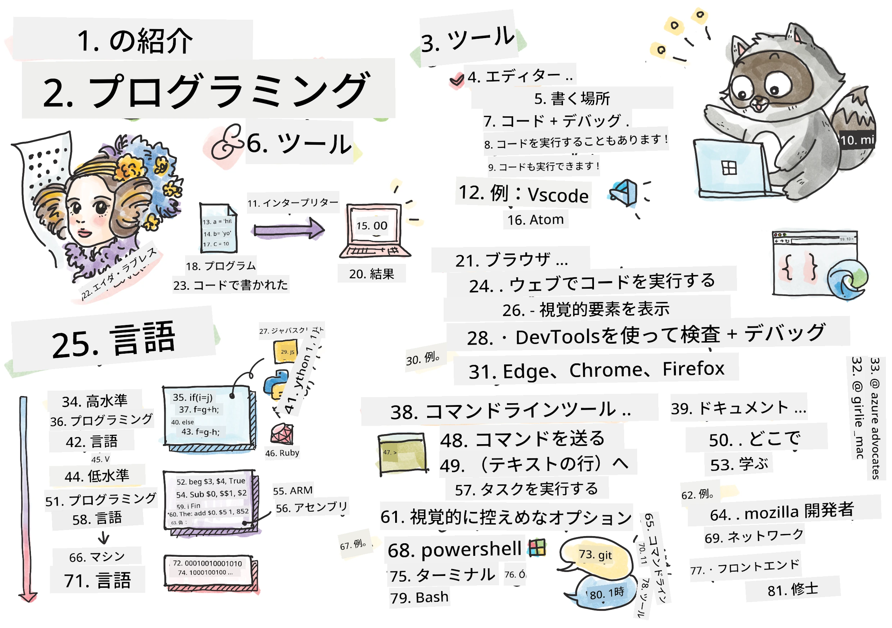
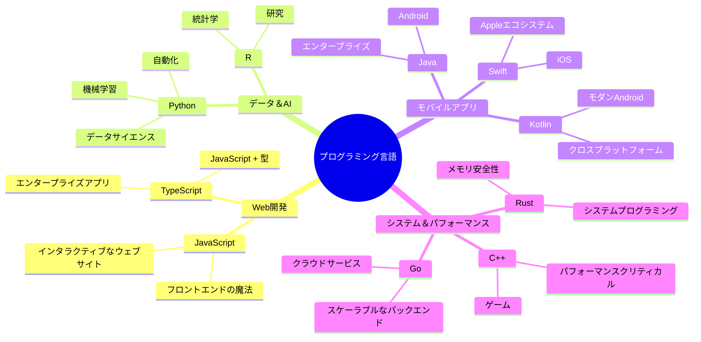
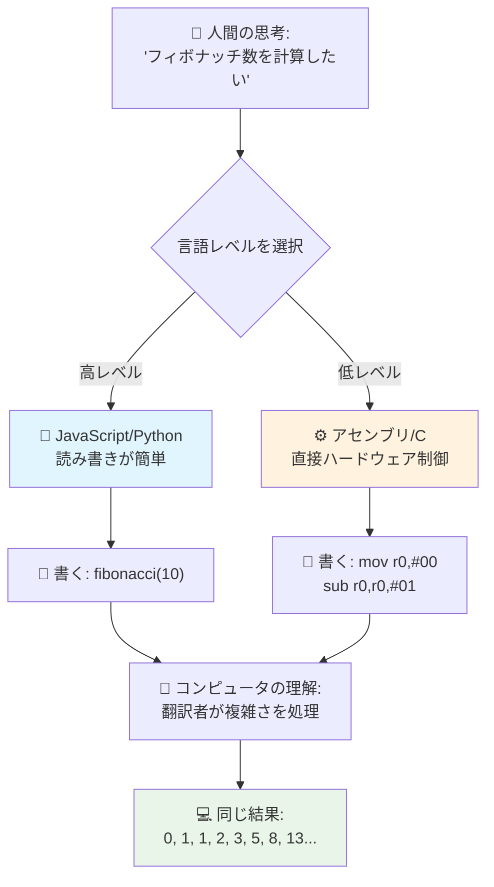
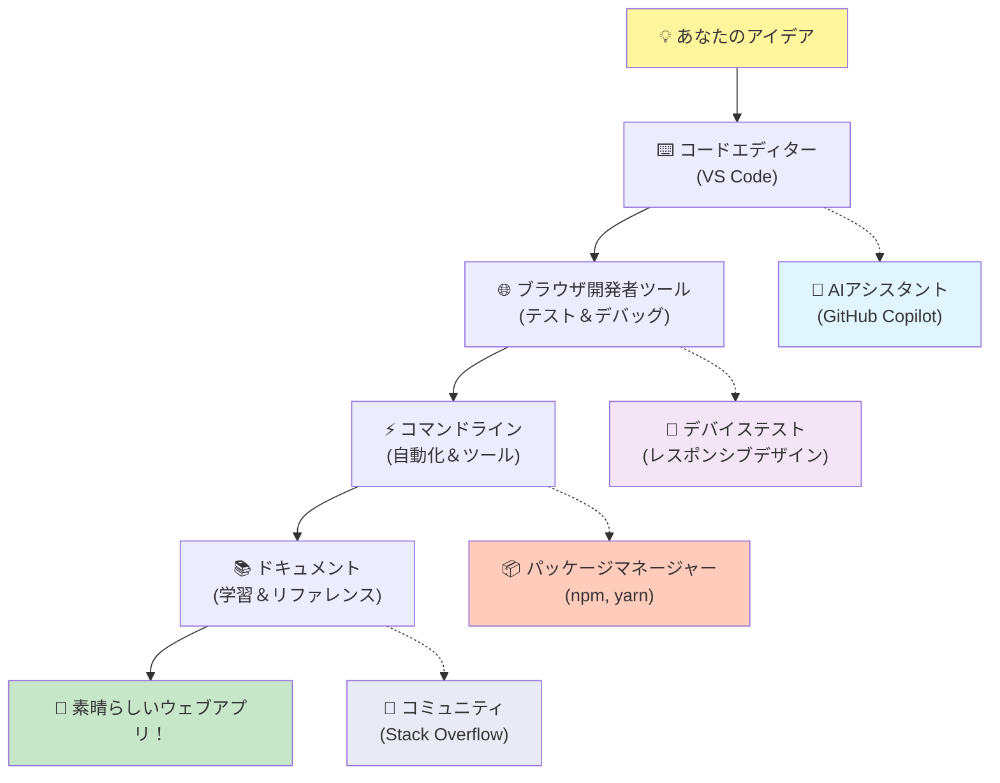
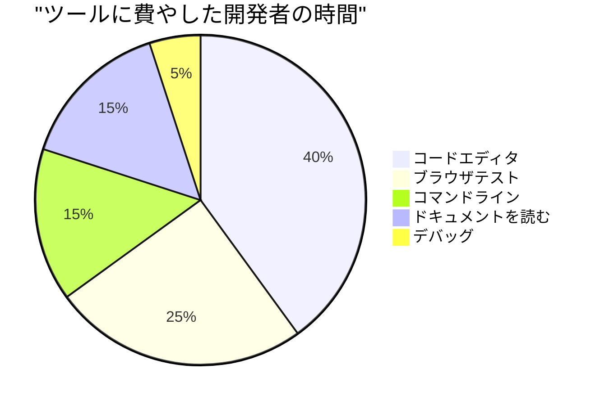
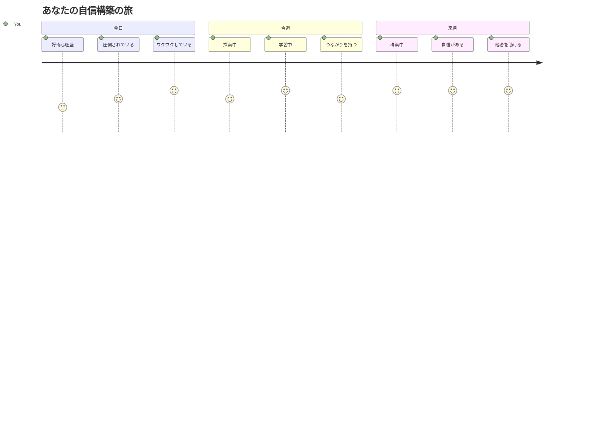

# プログラミング言語とモダン開発ツール入門
 
こんにちは、未来の開発者さん！👋 毎日これを考えると今でも鳥肌が立つんだけど言っていい？プログラミングは単なるコンピューターの話じゃないんだよ。あなたの最も奇想天外なアイデアを実現するための、まさに超能力を手に入れることなんだ！

お気に入りのアプリを使っていて、全てが完璧に噛み合う瞬間ってあるよね？ボタンをタップすると、まるで魔法みたいなことが起きて「うわー、どうやってあれやったんだろう？」って思わず感動しちゃうあの瞬間。実は、あなたみたいな誰かが—多分午前2時にお気に入りのカフェで三杯目のエスプレッソを飲みながら—その魔法を生み出すコードを書いたんだよ。そして驚くことに、このレッスンの最後には、彼らがどうやってそれを成し遂げたのか理解できるだけじゃなく、あなた自身もすぐに試してみたくなるはず！

たしかに、今プログラミングが難しく感じる気持ちすごくわかるよ。僕も最初は、数学の天才じゃないとなれないとか、5歳からずっとコードを書いてる人じゃないと無理だと思ってたから。でも僕の考えを180度変えたのは、プログラミングはまるで新しい言語で会話を学ぶようなものだって気づいたこと。「こんにちは」「ありがとう」から始めて、コーヒーを注文するくらいになって、気づけば深い哲学的な議論もできるようになる！って感じなんだ。ただし今回は相手がコンピューターで、しかも彼らは最高に辛抱強い会話の相手なんだよ。間違えても決して責めないし、何度だって喜んで挑戦し直してくれるんだ！

今日は、モダンなウェブ開発を可能にし、しかも中毒になるほどハマってしまう素晴らしいツールを一緒に探検しよう。話しているのはNetflixやSpotify、そしてあなたの好きなインディーズアプリスタジオの開発者たちが毎日使っている、まさに同じ編集ツールやブラウザ、ワークフローのこと。そしてこれが超嬉しい話だけど、こうしたプロ仕様の業界標準ツールのほとんどは完全に無料なんだよ！


> スケッチノート： [Tomomi Imura](https://twitter.com/girlie_mac)


```mermaid
journey
    title あなたの今日のプログラミングの旅
    section 発見
      プログラミングとは何か: 5: You
      プログラミング言語: 4: You
      ツール概要: 5: You
    section 探索
      コードエディター: 4: You
      ブラウザと開発ツール: 5: You
      コマンドライン: 3: You
    section 練習
      言語探偵: 4: You
      ツール探検: 5: You
      コミュニティ接続: 5: You
```
## あなたがすでに知っていることを見てみよう！

楽しいことに飛び込む前に気になるんだけど、あなたはこのプログラミングの世界について何を知っているかな？もしこれらの質問を見て「全くわからない！」と思ったなら、それは全然問題じゃなくて、むしろ最高のスタート場所なんだ！このクイズは運動前のストレッチみたいなもの。脳の筋肉をほぐして温めているところなんだよ！

[レッスン前のクイズに挑戦する](https://ff-quizzes.netlify.app/web/)


## これから一緒に冒険すること

さて、今日探求する内容に本当にワクワクしていて仕方がないんだ！このコンセプトが理解できた時のあなたの表情が見たい！こちらが私たちの素晴らしい旅の概要：

- **プログラミングとは実際何か（そしてなぜ最高にクールなのか！）** – コードがどうやって目に見えない魔法となって、月曜日の朝だと分かる目覚まし時計からNetflixのおすすめを完璧にキュレーションするアルゴリズムまで、あなたの周りの全てを動かしているのかを発見しよう
- **プログラミング言語とその個性豊かな特徴たち** – パーティーに入ったらみんながそれぞれ違うスーパーパワーと問題解決方法を持っている、そんな世界と似ていると思って。プログラミング言語の世界はそんな場所で、きっと彼らに会うのが楽しみになるはず！
- **デジタルの魔法を実現する基本の部品たち** – これらは最高のクリエイティブなLEGOセットみたいなもの。これらのパーツの組み合わせ方が分かると、想像できるものなら何でも作れると気づくよ
- **まるで魔法使いの杖を手に入れたように感じさせるプロフェッショナルツール** – これは大げさじゃないよ。本当になんだか超能力を持った気分になれるツールたちで、しかもプロが使うものと全く同じなんだ！

> 💡 **覚えておくこと**：今日全部を暗記しようとしちゃだめだよ！今は、何ができるかという「ワクワク感」を感じてもらうのが目的。練習を重ねるうちに詳細は自然に身についていくからね。これが本当の学び方なんだ！

> このレッスンは[Microsoft Learn](https://learn.microsoft.com/en-us/learn/modules/web-development-101/introduction-programming/?WT.mc_id=academic-77807-sagibbon)でも受講できるよ！

## そもそもプログラミングって何？

さて、100万ドルの疑問に挑戦しよう：プログラミングとは本当は何か？

僕の考え方を変えた話を聞いてほしい。先週、母に新しいスマートテレビのリモコンの使い方を説明しようとしてたんだ。気づいたら「赤いボタンを押して、でも大きい赤いボタンじゃなくて左側の小さい赤いボタン……いや、その左じゃなくて……はーい、今度は2秒間押して、1秒じゃなくて3秒でもない……」なんて言ってた。わかる？😅

それがプログラミングなんだよ！非常にパワフルだけど、すべてを完全に説明しないといけない何かに、とても細かく段階的な指示を与える技術のこと。違いは、ママは「どの赤いボタン？！」って問い返せるけど、コンピューターはそのまま言われた通りに動くだけということ。

僕が最初にこれを知った時にびっくりしたのは、実はコンピューターは本質的にはとてもシンプルだってこと。コンピューターが理解するのは文字通り1と0の2つだけで、これはつまり「はい」と「いいえ」、あるいは「オン」と「オフ」だけ。これだけなんだ！でもここからが魔法みたいなところで、マトリックスみたいに1と0の言葉だけで話す必要はないんだ。ここで登場するのが**プログラミング言語**。これは普通の人間の考えをコンピューターの言葉に変換してくれる、世界最高の通訳みたいなもの。

そしてまだ毎朝鳥肌が立つのは、あなたの生活の中のすべてのデジタルなものは、あなたと同じような誰かがパジャマ姿でコーヒーを飲みながらノートパソコンに向かいコードを書き始めたことから生まれたんだってこと。完璧に見えるInstagramのフィルター？誰かがそのコードを書いた。あなたのお気に入りの新曲に導いてくれたおすすめアルゴリズム？開発者が作ったもの。友達と食事代を割るのを助けるアプリ？「面倒だな、直せるはず！」と思った誰かが本当に作ったんだ。

プログラムを学ぶことで、ただ新しいスキルを身につけるだけじゃなくて、「誰かの一日をちょっと良くできるものを作れたらどうだろう？」と考える問題解決者の素敵なコミュニティの一員になれるんだ。正直言って、それ以上にクールなことなんてある？

✅ **楽しい豆知識探し**：暇な時に調べてみてほしいことがあるよ—世界初のコンピューター・プログラマーは誰だと思う？ヒントをあげると、意外な人かもしれない！その人の話は本当に面白くて、プログラミングはいつでも創造的な問題解決と枠にとらわれない発想でできていることがわかるよ。

### 🧠 **チェックイン：今の気持ちは？**

**少し考えてみよう：**
- 「コンピューターに指示を出す」ことの意味はわかってきた？
- 毎日の作業でプログラミングで自動化したいことはある？
- 今、プログラミングのことで気になっていることや疑問は？

> **覚えててね**：今はまだモヤモヤしているのは普通だよ。プログラミングは新しい言語を覚えるのと同じで、脳の神経回路ができるまで時間がかかるんだ。あなたは十分すごくやっているよ！

## プログラミング言語は異なる魔法の味みたいなもの

ちょっと変に聞こえるかもしれないけど、よくついてきてね—プログラミング言語は色んな種類の音楽みたいなものなんだ。例えばジャズは滑らかで即興的、ロックは力強くストレート、クラシックは優雅で構造的、ヒップホップは創造的で表現が豊か。各スタイルはそれぞれの雰囲気とファンのコミュニティがあって、気分や場面に合わせて完璧なんだよね。

プログラミング言語も全く同じ働き方をするんだ！楽しいモバイルゲームを作るのに気候変動の大規模データを処理する言語は使わないだろうし、ヨガ教室でデスメタルを流すこともしないよね（まあ、大半のヨガクラスはそうだけど😄）。

でもいつも感動するのは、この言語たちはまるで世界で最も辛抱強い、素晴らしい通訳がそばにいるみたいだってこと。あなたは自然な人間の感覚で考えを表現できて、彼らが複雑な裏側の1と0に変換してくれる。まるで「人間の創造性」と「コンピューターの論理」を両方完璧に話す友達がいて、決して疲れず、休憩もいらず、同じ質問を何度聞いても怒らないみたいなもの！

### 人気のプログラミング言語とその用途


```mermaid
mindmap
  root((プログラミング言語))
    Web開発
      JavaScript
        フロントエンドの魔法
        インタラクティブなウェブサイト
      TypeScript
        JavaScript + 型
        エンタープライズアプリ
    データ＆AI
      Python
        データサイエンス
        機械学習
        自動化
      R
        統計学
        研究
    モバイルアプリ
      Java
        Android
        エンタープライズ
      Swift
        iOS
        Appleエコシステム
      Kotlin
        モダンAndroid
        クロスプラットフォーム
    システム＆パフォーマンス
      C++
        ゲーム
        パフォーマンスクリティカル
      Rust
        メモリ安全性
        システムプログラミング
      Go
        クラウドサービス
        スケーラブルなバックエンド
```
| 言語 | 得意分野 | 人気の理由 |
|----------|----------|------------------|
| **JavaScript** | ウェブ開発、ユーザーインターフェース | ブラウザ上で動作しインタラクティブなウェブサイトを支える |
| **Python** | データサイエンス、自動化、AI | 読みやすく学びやすい、強力なライブラリが豊富 |
| **Java** | エンタープライズアプリ、Androidアプリ | プラットフォーム非依存、大規模システムに強力 |
| **C#** | Windowsアプリ、ゲーム開発 | Microsoftの強力なエコシステムが支援 |
| **Go** | クラウドサービス、バックエンドシステム | 高速でシンプル、現代のコンピューティング向け設計 |

### 高水準言語と低水準言語

正直に言うと、僕が最初に学んだ時に頭が混乱したコンセプトがこれだから、僕がそれを理解できた例え話を紹介するよ。きっと君の助けにもなると思う！

言語がわからない国に旅行して、どうしても近くのトイレを探さなきゃいけない場面を想像してみて（みんな経験あるでしょ？😅）：

- **低水準プログラミング**は、その国の方言を完璧に覚えて、角の果物屋のおばあちゃんと文化的参照や現地スラング、地元の冗談を交えて会話できるようになるようなもの。超すごいし効率的……もしその言葉が流暢ならね！でもただトイレを見つけたいだけなら大変すぎて困るよね。

- **高水準プログラミング**は、その素晴らしい現地の友達がいて、「トイレが必要です」と普通に英語で言うだけで、文化的な解釈を全部やってくれて、非ネイティブのあなたに分かりやすい指示をくれる感じ。

プログラミングで言うと：
- **低水準言語**（AssemblyやCみたいなもの）はコンピューターの実際のハードウェアと非常に詳しい会話ができるけど、機械のように考える必要がある…心理的ハードルがかなり高い！
- **高水準言語**（JavaScript、Python、C#など）は、あなたが人間らしく考えている間に、機械語の裏側のややこしい部分を処理してくれる。それに新参者への親切なコミュニティもあって、初心者時代を思い出して本当に助けてくれる人ばかり！

さて、どれから始めるのがおすすめか分かる？😉 高水準言語は補助輪みたいなもので、補助輪を外したくなくなるくらい快適で楽しい体験をもたらすよ！


```mermaid
flowchart TB
    A["👤 人間の思考:<br/>'フィボナッチ数を計算したい'"] --> B{言語レベルを選択}
    
    B -->|高レベル| C["🌟 JavaScript/Python<br/>読み書きが簡単"]
    B -->|低レベル| D["⚙️ アセンブリ/C<br/>直接ハードウェア制御"]
    
    C --> E["📝 書く: fibonacci(10)"]
    D --> F["📝 書く: mov r0,#00<br/>sub r0,r0,#01"]
    
    E --> G["🤖 コンピュータの理解:<br/>翻訳者が複雑さを処理"]
    F --> G
    
    G --> H["💻 同じ結果:<br/>0, 1, 1, 2, 3, 5, 8, 13..."]
    
    style C fill:#e1f5fe
    style D fill:#fff3e0
    style H fill:#e8f5e8
```
### 高水準言語がなぜこんなに使いやすいのか見てみよう

これから僕が高水準言語に惚れ込んだ理由を完璧に示す例をお見せするよ。でもまず約束してほしいことがある。最初のコード例を見て恐れないこと！あれは怖く見えるようにできているんだ。そこが僕が伝えたいポイント！

同じタスクを２つのまったく違うスタイルで書いたものを見るよ。両方ともフィボナッチ数列と呼ばれるすばらしい数学的パターンを作るもの。これは各数が前の二つの合計になる並びで、0、1、1、2、3、5、8、13…（ちなみにこのパターンは自然界のあらゆるところにあって、ヒマワリの種の渦巻きや松ぼっくりの模様、銀河の形成にも見られるんだ！）

さあ、違いを見てみよう！

**高水準言語（JavaScript）– 人間に優しい：**

```javascript
// ステップ1: 基本的なフィボナッチの設定
const fibonacciCount = 10;
let current = 0;
let next = 1;

console.log('Fibonacci sequence:');
```

**このコードの動きは次の通り：**
- **定数を宣言**して生成したいフィボナッチ数の数を指定する
- **２つの変数を初期化**して現在と次の数を追跡する
- フィボナッチ数列の出発点となる値（0と1）を**セットアップ**
- 出力を示すヘッダーメッセージを**表示**

```javascript
// ステップ2: ループでシーケンスを生成する
for (let i = 0; i < fibonacciCount; i++) {
  console.log(`Position ${i + 1}: ${current}`);
  
  // シーケンスの次の数を計算する
  const sum = current + next;
  current = next;
  next = sum;
}
```

**処理の詳しい説明：**
- `for`ループを使い、数列のそれぞれの位置を**繰り返し処理**
- 算出した各数を位置とともにテンプレートリテラルで**表示**
- 現在の数と次の数を足して次のフィボナッチ数を**計算**
- カウンタ変数を更新して次の繰り返しに備える

```javascript
// ステップ3：現代的な関数型アプローチ
const generateFibonacci = (count) => {
  const sequence = [0, 1];
  
  for (let i = 2; i < count; i++) {
    sequence[i] = sequence[i - 1] + sequence[i - 2];
  }
  
  return sequence;
};

// 使用例
const fibSequence = generateFibonacci(10);
console.log(fibSequence);
```

**ここでは：**
- モダンなアロー関数で**再利用可能な関数を作成**
- 数を1つずつ表示する代わりに、完成した数列を格納する配列を**構築**
- 配列のインデックスを使い、前の値から新しい数を**計算**
- 完成した数列を**返して**他の部分で柔軟に使えるようにする

**低水準言語（ARMアセンブリ）– コンピューターに優しい：**

```assembly
 area ascen,code,readonly
 entry
 code32
 adr r0,thumb+1
 bx r0
 code16
thumb
 mov r0,#00
 sub r0,r0,#01
 mov r1,#01
 mov r4,#10
 ldr r2,=0x40000000
back add r0,r1
 str r0,[r2]
 add r2,#04
 mov r3,r0
 mov r0,r1
 mov r1,r3
 sub r4,#01
 cmp r4,#00
 bne back
 end
```

JavaScript版はほぼ英語の指示文みたいに読めるのに対して、アセンブリ版はコンピューターのプロセッサを直接操作する難解な命令で書かれているのが分かると思う。どちらも同じタスクを達成しているけれど、高水準言語のほうが人間にずっと理解しやすく、書きやすく、メンテナンスしやすいんだ。

**主な違いはこんな感じ：**
- **読みやすさ**: JavaScriptは`fibonacciCount`のように説明的な名前を使うのに対し、Assemblyは`r0`、`r1`のような暗号的なラベルを使います  
- **コメント**: 高水準言語はコードを自己文書化する説明的なコメントを奨励します  
- **構造**: JavaScriptの論理の流れは、人間が問題を段階的に考えるやり方と一致します  
- **保守性**: JavaScriptのバージョンを異なる要件に合わせて更新するのは簡単かつ明確です  

✅ **フィボナッチ数列について**: これは本当に美しい数のパターンです（各数字がその前の2つの数字の合計になっている: 0, 1, 1, 2, 3, 5, 8...）。自然界のほぼ*どこにでも*現れます！ヒマワリの渦巻き、松ぼっくりのパターン、オウムガイの殻の曲線、さらには木の枝の成長の仕方にも見られます。数学とコードが、自然が美しさを作り出すために使うパターンを理解し再現する助けになるのはかなり驚きです！


## 魔法を起こす基本要素

さて、プログラミング言語が実際にどのように動くかを見たところで、今度は基本的な要素を分解してみましょう。これらはどんなプログラムにも絶対必要な材料だと思ってください。各要素の役割を理解すれば、ほぼどんな言語でもコードを読み書きできるようになります！

これはプログラミングの文法を学ぶようなものです。学校で名詞や動詞、文の作り方を習ったことを思い出してください。プログラミングにも独自の文法があり、正直言って英語の文法よりずっと論理的で親切です！😄

### 文（Statements）：一歩ずつの指示

まずは**文**から始めましょう。これはコンピュータとの会話における一つの文のようなものです。各文はコンピュータに対して一つの具体的なことをするよう指示します。たとえば、「ここを左に曲がって」「赤信号で止まって」「あの場所に駐車して」といった具合です。

文の大好きなところは、普通とても読みやすいことです。これを見てください:

```javascript
// 単一のアクションを実行する基本的な文
const userName = "Alex";                    
console.log("Hello, world!");              
const sum = 5 + 3;                         
```
  
**このコードのやっていること:**  
- ユーザーの名前を格納する定数変数を**宣言**する  
- コンソール出力に挨拶メッセージを**表示**する  
- 数学的計算の結果を**計算**して保存する  

```javascript
// ウェブページと対話するステートメント
document.title = "My Awesome Website";      
document.body.style.backgroundColor = "lightblue";
```
  
**ひとつずつ、何が起こっているか:**  
- ブラウザのタブに表示されるウェブページのタイトルを**変更**する  
- ページ全体の背景色を**変更**する  

### 変数：プログラムの記憶システム

さて、**変数**は正直言って私が教えるのが大好きなコンセプトの一つです。なぜなら、皆さんが日常的に使っているものにとても似ているからです！

少しだけスマホの連絡先リストのことを考えてみてください。みんなの電話番号を覚えているわけではありませんよね？代わりに「ママ」や「親友」や「深夜2時までやってるピザ屋」といったラベルをつけて保存して、実際の番号はスマホに覚えさせています。変数もまさにそれと同じです！プログラムが情報を保存して、あとで意味の通る名前で取り出せるようにする入れ物のようなものなんです。

面白いのは、変数はプログラムの実行中に変わることができるという点です（だから「variable」という名前になっているのがわかりますよね？）。たとえばもっと良いピザ屋を見つけたら、その連絡先を更新しますよね。それと同じで、変数はプログラムが新しい情報を学んだり状況が変わったりするときに更新されることがあります！

これがどれほど簡単か、見てみましょう:

```javascript
// ステップ1: 基本変数の作成
const siteName = "Weather Dashboard";        
let currentWeather = "sunny";               
let temperature = 75;                       
let isRaining = false;                      
```
  
**このコンセプトで分かること:**  
- 変わらない値は`const`変数に**保存**する（サイト名のように）  
- プログラム中に変わる値は`let`を**使う**  
- 文字列、数値、ブール値（true/false）などの異なるデータ型を**代入**する  
- 何を含むか説明するわかりやすい名前を**選ぶ**  

```javascript
// ステップ2: 関連するデータをグループ化するためにオブジェクトを扱う
const weatherData = {                       
  location: "San Francisco",
  humidity: 65,
  windSpeed: 12
};
```
  
**上の例でやったこと:**  
- 関連する天気情報をまとめたオブジェクトを**作成**した  
- 複数のデータをひとつの変数名で**整理**した  
- キーと値のペアでそれぞれの情報をわかりやすく**ラベル付け**した  

```javascript
// ステップ3: 変数の使用と更新
console.log(`${siteName}: Today is ${currentWeather} and ${temperature}°F`);
console.log(`Wind speed: ${weatherData.windSpeed} mph`);

// 変更可能な変数の更新
currentWeather = "cloudy";                  
temperature = 68;                          
```
  
**ここで理解すること:**  
- `${}`構文を使ったテンプレートリテラルで情報を**表示**する  
- ドット表記（`weatherData.windSpeed`）でオブジェクトのプロパティに**アクセス**する  
- `let`で宣言した変数を条件変化に合わせて**更新**する  
- 複数の変数を組み合わせて意味のあるメッセージを**作成**する  

```javascript
// ステップ4: クリーンなコードのための最新の分割代入
const { location, humidity } = weatherData; 
console.log(`${location} humidity: ${humidity}%`);
```
  
**知っておきたいこと:**  
- 分割代入でオブジェクトから特定のプロパティを**抽出**する  
- オブジェクトのキー名と同じ名前の新しい変数を自動的に**作成**する  
- 繰り返されるドット表記を避けてコードを**簡潔化**する  

### 制御フロー：プログラムに考えさせる

さて、ここからプログラミングが本当にすごく楽しくなる部分です！**制御フロー**とは、プログラムに賢い判断の仕方を教えることです。人間が毎日何気なくやっているようなことそのものです。

たとえば今朝のことを思い出してみてください。「雨が降っているなら傘を持っていこう。寒ければジャケットを着よう。もし遅れているなら朝食は抜いて途中でコーヒーを買おう。」脳は自然とこうしたif-thenの論理を何十回も毎日繰り返しているのです！

これこそがプログラムが単なる退屈で予測可能なスクリプトではなく、知的で生きているように感じられる理由です。プログラムは状況を見て、何が起こっているか評価し、適切に応答できます。これをプログラムに「脳」を授けて選択肢を作れるようにするようなものです！

どうやってうまく動くか見たいですか？見てみましょう:

```javascript
// ステップ1：基本的な条件ロジック
const userAge = 17;

if (userAge >= 18) {
  console.log("You can vote!");
} else {
  const yearsToWait = 18 - userAge;
  console.log(`You'll be able to vote in ${yearsToWait} year(s).`);
}
```
  
**このコードのやっていること:**  
- ユーザーの年齢が投票資格を満たしているか**チェック**する  
- 条件の結果に応じて異なるコードブロックを**実行**する  
- 18歳未満なら投票資格までの期間を**計算**して表示する  
- ケースごとに具体的で役立つフィードバックを**提供**する  

```javascript
// ステップ2: 論理演算子を使った複数条件
const userAge = 17;
const hasPermission = true;

if (userAge >= 18 && hasPermission) {
  console.log("Access granted: You can enter the venue.");
} else if (userAge >= 16) {
  console.log("You need parent permission to enter.");
} else {
  console.log("Sorry, you must be at least 16 years old.");
}
```
  
**ここで何が起きているかの内訳:**  
- `&&`（かつ）演算子で複数の条件を**結合**する  
- 複数シナリオに対して`else if`で条件の階層を**作成**する  
- 最終的な`else`ステートメントで全ての可能なケースを**処理**する  
- 各ケースに対して明確で具体的なフィードバックを**提供**する  

```javascript
// ステップ3：三項演算子を使った簡潔な条件式
const votingStatus = userAge >= 18 ? "Can vote" : "Cannot vote yet";
console.log(`Status: ${votingStatus}`);
```
  
**覚えておきたいこと:**  
- 単純な2択条件には三項演算子（`? :`）を**使う**  
- 最初に条件、その次に`?`、真の場合の結果、そのあと`:`、偽の場合の結果を書く  
- 条件に基づいて値を割り当てる必要があるときにこのパターンを**適用**する  

```javascript
// ステップ4: 複数の特定のケースを処理する
const dayOfWeek = "Tuesday";

switch (dayOfWeek) {
  case "Monday":
  case "Tuesday":
  case "Wednesday":
  case "Thursday":
  case "Friday":
    console.log("It's a weekday - time to work!");
    break;
  case "Saturday":
  case "Sunday":
    console.log("It's the weekend - time to relax!");
    break;
  default:
    console.log("Invalid day of the week");
}
```
  
**このコードで達成していること:**  
- 変数の値を複数の具体的なケースに**照合**する  
- 似たケースをグループ分けする（平日と週末）  
- マッチしたときに適切なコードブロックを**実行**する  
- 予期しない値に対応する`default`ケースを**含める**  
- `break`ステートメントで次のケースに進むのを防ぐ  

> 💡 **現実の例え**: 制御フローは世界で最も辛抱強いGPSのようなものです。たとえば「メインストリートで渋滞があったら高速道路に乗れ。高速が工事で塞がれていたら景色の良い道を試せ」と指示するイメージです。プログラムは同じ種類の条件付き論理を使って、異なる状況に賢く対応し、ユーザーに最高の体験を提供します。

### 🎯 **コンセプトチェック：基本要素の理解度**

**基本がどれくらい理解できているか見てみましょう:**  
- 変数と文の違いを自分の言葉で説明できますか？  
- if-thenの決定を使う実生活のシナリオを考えてみてください（投票例のような）  
- プログラミングの論理で驚いたことは何ですか？  

**自信をちょっとアップ:**  

```mermaid
flowchart LR
    A["📝 文<rb/>(命令)"] --> B["📦 変数<br/>(記憶)"] --> C["🔀 制御フロー<br/>(決定)"] --> D["🎉 動作中のプログラム!"]
    
    style A fill:#ffeb3b
    style B fill:#4caf50
    style C fill:#2196f3
    style D fill:#ff4081
```  
✅ **次に来るもの**: これからこの素晴らしい旅をさらに深く掘り下げていきます！今は、これから体験する素晴らしい可能性にワクワクすることだけに集中してください。具体的なスキルやテクニックは、一緒に練習するうちに自然に身につきます。これが予想以上に楽しいことになると約束します！

## 仕事道具

さて、ここからが私が興奮して我慢できなくなるところです！🚀 これから、まるでデジタル宇宙船の鍵を手にしたかのように感じられる、とんでもなく素晴らしい道具について話します。

シェフが手の延長のように感じる完璧なバランスのナイフを持っているのを知っていますか？ミュージシャンが触れただけで歌い出すようなギターを持っているのと同じように、開発者にはこうした魔法の道具のバージョンがあります。そしてこれがあなたの度肝を抜くこと間違いなしですが、ほとんどが完全無料なのです！

私はこれらを皆さんと共有できるのが本当に楽しみで仕方ありません。なぜならソフトウェア開発のやり方を完全に変革してしまったからです。AI搭載のコーディングアシスタントがコードを書くのを手伝ってくれたり（冗談ではなく！）、Wi-Fiがあればどこからでもアプリを作れるクラウド環境、プログラムのX線のように詳細に解析できる高度なデバッグツールなどが存在します。

そしてここが鳥肌ものなのですが、これらは「初心者ツール」ではないのです。Google、Netflix、そして皆さんが好きなインディーズアプリスタジオがまさに今使っているのと同じプロフェッショナルなツール群なのです。使いこなせば一気にプロの気分になれますよ！


```mermaid
graph TD
    A["💡 あなたのアイデア"] --> B["⌨️ コードエディター<br/>(VS Code)"] 
    B --> C["🌐 ブラウザ開発者ツール<br/>(テスト＆デバッグ)"]
    C --> D["⚡ コマンドライン<br/>(自動化＆ツール)"]
    D --> E["📚 ドキュメント<br/>(学習＆リファレンス)"]
    E --> F["🚀 素晴らしいウェブアプリ！"]
    
    B -.-> G["🤖 AIアシスタント<br/>(GitHub Copilot)"]
    C -.-> H["📱 デバイステスト<br/>(レスポンシブデザイン)"]
    D -.-> I["📦 パッケージマネージャー<br/>(npm, yarn)"]
    E -.-> J["👥 コミュニティ<br/>(Stack Overflow)"]
    
    style A fill:#fff59d
    style F fill:#c8e6c9
    style G fill:#e1f5fe
    style H fill:#f3e5f5
    style I fill:#ffccbc
    style J fill:#e8eaf6
```  
### コードエディターとIDE：あなたの新しいデジタル親友

コードエディターについて話しましょう。これはあなたの新しいお気に入りの場所になるでしょう！自分だけのコーディングサンクチュアリで、そこにいる時間が一番長くなるはずです。

でも現代のエディターには魔法のような特徴があります。ただの高機能テキストエディターではありません。まるできらりと輝く最高のメンターが24時間あなたの隣に座っているような感じです。打ち間違いをあなたが気づく前に見抜き、すごい改善案を示し、コードの意味を理解する手助けをしてくれて、さらにはあなたがこれからタイプしそうなことを予測して続きを提案してくれます！

オートコンプリートを初めて使ったときのことは今でも忘れません。本当に未来に生きている感覚でした。何かタイプし始めるとエディターが「これが欲しい関数ですか？」って感じで提案してくれるのです。まるで心を読んでくれるコーディング仲間のようです！

**これらエディターがすごい理由は？**

現代のコードエディターは、生産性を爆上げする機能が満載です：

| 機能 | 役割 | 助けになる理由 |
|---------|--------------|--------------|
| **構文ハイライト** | コードの各部分を色分け | 読みやすくエラーを見つけやすくする |
| **オートコンプリート** | タイプ中にコードを提案 | コーディング速度アップ＆タイプミス削減 |
| **デバッグツール** | エラー発見と修正を支援 | 問題解決の時間を大幅短縮 |
| **拡張機能** | 専用機能を追加可能 | あらゆる技術にカスタマイズできる |
| **AIアシスタント** | コードや説明の提案 | 学習効率と生産性を加速する |

> 🎥 **動画リソース**: これらのツールの動作を見るには、この[Tools of the Tradeビデオ](https://youtube.com/watch?v=69WJeXGBdxg)をご覧ください。

#### Web開発におすすめのエディター

**[Visual Studio Code](https://code.visualstudio.com/?WT.mc_id=academic-77807-sagibbon)**（無料）  
- ウェブ開発者に最も人気  
- 優れた拡張機能エコシステム  
- 組み込みターミナルとGit連携  
- **必須拡張機能**:  
  - [GitHub Copilot](https://marketplace.visualstudio.com/items?itemName=GitHub.copilot) - AIによるコード提案  
  - [Live Share](https://marketplace.visualstudio.com/items?itemName=MS-vsliveshare.vsliveshare) - リアルタイム共同編集  
  - [Prettier](https://marketplace.visualstudio.com/items?itemName=esbenp.prettier-vscode) - 自動コード整形  
  - [Code Spell Checker](https://marketplace.visualstudio.com/items?itemName=streetsidesoftware.code-spell-checker) - コードの綴りミス検出  

**[JetBrains WebStorm](https://www.jetbrains.com/webstorm/)**（有料、学生無料）  
- 高度なデバッグとテストツール  
- インテリジェントなコード補完  
- 組み込みバージョン管理  

**クラウドベースIDE**（価格はさまざま）  
- [GitHub Codespaces](https://github.com/features/codespaces) - ブラウザで使える完全なVS Code  
- [Replit](https://replit.com/) - 学習やコード共有に最適  
- [StackBlitz](https://stackblitz.com/) - 即時フルスタックウェブ開発  

> 💡 **はじめの一歩のヒント**: 最初はVisual Studio Codeから始めましょう。無料で業界でも広く使われており、コミュニティによるチュートリアルや拡張機能が豊富です。


### ウェブブラウザ：秘密の開発実験室

さあ、心の準備をしてください！あなたが普段ソーシャルメディアをスクロールしたり動画を見たりするのに使っているブラウザが、実はすごい秘密の開発実験室を隠していることを知っていましたか？

ウェブページで右クリックして「要素を検証」を選ぶたびに、ある秘密の世界が開きます。これは、私が昔何百ドルも出していた高価なソフトよりも強力な開発者ツールです。まるで、普段使っている普通のキッチンの奥にプロのシェフの実験室が隠されていたのを発見したみたいなものです！
誰かが初めてブラウザのDevToolsを見せてくれたとき、私はただクリックしまくって「えっ、それもできるの？！」と3時間ぐらい騒いでいました。リアルタイムでどんなウェブサイトでも編集でき、読み込み速度も正確にわかり、異なるデバイスでの見え方をテストし、さらにはJavaScriptをプロ並みにデバッグできるのです。これは本当に衝撃的です！

**ブラウザがあなたの秘密兵器である理由：**

ウェブサイトやウェブアプリケーションを作るとき、現実世界での見た目や挙動を知る必要があります。ブラウザは単に作品を表示するだけでなく、パフォーマンス、アクセシビリティ、潜在的な問題について詳しいフィードバックを提供します。

#### ブラウザの開発者ツール（DevTools）

モダンブラウザには包括的な開発ツールが搭載されています：

| ツールカテゴリ | できること | 具体的な使い方例 |
|---------------|-------------|------------------|
| **Element Inspector** | HTML/CSSをリアルタイムで閲覧・編集 | スタイリングを調整して即座に結果を確認 |
| **Console** | エラーメッセージの確認やJavaScriptのテスト | 問題をデバッグし、コードを試す |
| **Network Monitor** | リソースの読み込み状況を追跡 | パフォーマンスや読み込み時間を最適化 |
| **Accessibility Checker** | インクルーシブデザインのテスト | すべてのユーザーに対応しているか確認 |
| **Device Simulator** | 様々な画面サイズでプレビュー | 複数デバイスなしでレスポンシブをテスト |

#### 開発におすすめのブラウザ

- **[Chrome](https://developers.google.com/web/tools/chrome-devtools/)** - 業界標準のDevToolsで豊富なドキュメントあり
- **[Firefox](https://developer.mozilla.org/docs/Tools)** - 優れたCSS Gridとアクセシビリティツール
- **[Edge](https://docs.microsoft.com/microsoft-edge/devtools-guide-chromium/?WT.mc_id=academic-77807-sagibbon)** - ChromiumベースでMicrosoftの開発者リソース付き

> ⚠️ **重要なテストのヒント**：ウェブサイトは複数のブラウザで必ずテストしてください！Chromeで完璧に動いてもSafariやFirefoxでは見え方が違うかもしれません。プロの開発者は主要なブラウザ全てで確認し、一貫したユーザー体験を保証します。


### コマンドラインツール：開発者のスーパーパワーへの入り口

では、コマンドラインについて正直に話しましょう。実は私も最初に見たとき、あの黒くて点滅する文字が怖くて、「絶対無理！1980年代のハッカームービーに出てくるみたいで、自分には到底無理だ！」と思いました 😅

でもここで言いたいのは、コマンドラインは怖いものではなく、コンピューターと直接会話しているようなものだということ。高級なアプリで写真とメニューを見ながら注文するのと、地元のレストランに行ってシェフに「何か驚くものをお願い」とだけ言う違いみたいなものです。

コマンドラインは開発者がまるで魔法使いのように感じられる場所。数語（正確にはコマンド）を打ってEnterを押すと、プロジェクト構造を作成したり、世界中から強力なツールをインストールしたり、アプリを公開したりできます。一度その力を味わうと、結構クセになります！

**コマンドラインがあなたのお気に入りツールになる理由：**

グラフィカルインターフェースは多くの作業に便利ですが、コマンドラインは自動化、正確さ、速度に優れています。多くの開発ツールは主にコマンドラインで動作し、効率的に使いこなせば生産性が大幅に上がります。

```bash
# ステップ1：プロジェクトディレクトリを作成し、移動する
mkdir my-awesome-website
cd my-awesome-website
```

**このコードがやっていること：**
- プロジェクト用の「my-awesome-website」という新しいディレクトリを作成
- 作成したディレクトリに移動して作業開始

```bash
# ステップ2: package.jsonでプロジェクトを初期化する
npm init -y

# 最新の開発ツールをインストールする
npm install --save-dev vite prettier eslint
npm install --save-dev @eslint/js
```

**手順ごとに説明：**
- `npm init -y`でデフォルト設定のNode.jsプロジェクトを初期化
- 開発と本番ビルド用に高速なビルドツールViteをインストール
- 自動フォーマット用のPrettierとコード品質チェック用のESLintを追加
- `--save-dev`フラグで開発専用依存関係としてマーク

```bash
# ステップ3：プロジェクトの構造とファイルを作成する
mkdir src assets
echo '<!DOCTYPE html><html><head><title>My Site</title></head><body><h1>Hello World</h1></body></html>' > index.html

# 開発サーバーを起動する
npx vite
```

**上記で行ったこと：**
- ソースコードとアセット用にフォルダを分けて整理
- 基本的なドキュメント構造を持つHTMLファイルを生成
- ライブリロードとホットモジュール交換対応のVite開発サーバーを起動

#### ウェブ開発に必須のコマンドラインツール

| ツール | 目的 | 必要な理由 |
|------|---------|-----------------|
| **[Git](https://git-scm.com/)** | バージョン管理 | 変更履歴の管理、共同作業、バックアップ |
| **[Node.js & npm](https://nodejs.org/)** | JavaScript実行環境＆パッケージ管理 | ブラウザ外でJavaScript実行、最新開発ツールの導入 |
| **[Vite](https://vitejs.dev/)** | ビルドツール＆開発サーバー | 高速な開発環境とホットモジュール交換 |
| **[ESLint](https://eslint.org/)** | コード品質 | JavaScriptの問題を自動検出・修正 |
| **[Prettier](https://prettier.io/)** | コード整形 | コードを一貫して読みやすく保つ |

#### プラットフォーム別のオプション

**Windows:**
- **[Windows Terminal](https://docs.microsoft.com/windows/terminal/?WT.mc_id=academic-77807-sagibbon)** - 最新機能豊富なターミナル
- **[PowerShell](https://docs.microsoft.com/powershell/?WT.mc_id=academic-77807-sagibbon)** 💻 - 強力なスクリプト環境
- **[Command Prompt](https://docs.microsoft.com/windows-server/administration/windows-commands/?WT.mc_id=academic-77807-sagibbon)** 💻 - 伝統的なWindowsコマンドライン

**macOS:**
- **[Terminal](https://support.apple.com/guide/terminal/)** 💻 - 標準搭載のターミナルアプリ
- **[iTerm2](https://iterm2.com/)** - 高機能ターミナルエミュレーター

**Linux:**
- **[Bash](https://www.gnu.org/software/bash/)** 💻 - Linux標準シェル
- **[KDE Konsole](https://docs.kde.org/trunk5/en/konsole/konsole/index.html)** - 高機能ターミナル

> 💻 = OSにプリインストール済み

> 🎯 **学習の進め方**：`cd`（ディレクトリ移動）、`ls`や`dir`（ファイルリスト表示）、`mkdir`（フォルダ作成）など基本コマンドから始めましょう。`npm install`、`git status`、`code .`など現代的なワークフローコマンドも練習すると良いです。慣れてくると自然に高度なコマンドや自動化技術が身につきます。


### ドキュメント：いつでも頼れる学びのメンター

初心者であることを気楽に感じられる秘密を教えましょう。経験豊富な開発者でも時間の大部分をドキュメント読みに費やしています。これは「わからないから」ではなく、むしろ賢明な行動なのです！

ドキュメントは24時間いつでも利用可能な、世界で最も根気強くて知識豊富な教師がいるようなもの。夜中の2時に問題で詰まっても、ドキュメントは温かく正確な答えを用意しています。みんなが注目する新機能を学びたいときも、段階的な解説付きでサポートしてくれます。なぜ動くのか理解できないことも、ドキュメントが「なるほど！」と思わせる説明をしてくれます。

私の考え方を変えたことがあります。ウェブ開発の世界は信じられないほど速く変わり、誰も（本当に誰も）すべてを暗記しているわけではありません。15年以上の経験があるシニア開発者が基本的な構文を調べているのを見て、恥ずかしいことではなく賢いと感じました。記憶力ではなく、信頼できる答えを迅速に見つけ、使いこなせることが重要だと実感したのです。

**ここに本当の魔法が起きます：**

プロの開発者は多くの時間をドキュメント読みに費やします。これは知識不足ではなく、急速に進化するウェブ開発に対応するための継続的な学習です。良いドキュメントは「使い方」だけでなく「なぜ・いつ使うか」も教えてくれます。

#### 必須ドキュメントリソース

**[Mozilla Developer Network (MDN)](https://developer.mozilla.org/docs/Web)**
- ウェブ技術ドキュメントのゴールドスタンダード
- HTML、CSS、JavaScriptの包括的ガイド
- ブラウザ対応情報も掲載
- 実用的な例やインタラクティブデモもあり

**[Web.dev](https://web.dev)** （Google提供）
- モダンなウェブ開発ベストプラクティス
- パフォーマンス最適化ガイド
- アクセシビリティとインクルーシブデザイン原則
- 実際のプロジェクトの事例研究

**[Microsoft Developer Documentation](https://docs.microsoft.com/microsoft-edge/#microsoft-edge-for-developers)**
- Edgeブラウザ開発リソース
- プログレッシブウェブアプリのガイド
- クロスプラットフォーム開発の洞察

**[Frontend Masters Learning Paths](https://frontendmasters.com/learn/)**
- 構造化された学習カリキュラム
- 業界エキスパートによるビデオコース
- 実践的なコーディング演習付き

> 📚 **学習戦略**：ドキュメントを暗記しようとせず、効率的に検索・閲覧する方法を習得しましょう。よく使う参考資料はブックマークし、検索機能で必要な情報を素早く見つける練習を。

### 🔧 **ツールマスタリーチェック：どれが響く？**

**ちょっと考えてみてください：**
- まず試してみたいツールはどれですか？（間違いはありません！）
- コマンドラインはまだ怖いですか？それとも興味が出てきましたか？
- ブラウザのDevToolsを使って、お気に入りのウェブサイトの裏側を覗くイメージはできますか？


```mermaid
pie title "ツールに費やした開発者の時間"
    "コードエディタ" : 40
    "ブラウザテスト" : 25
    "コマンドライン" : 15
    "ドキュメントを読む" : 15
    "デバッグ" : 5
```
> **面白いインサイト**：多くの開発者はコードエディターで過ごす時間が約40%ですが、テストや学習、問題解決に使う時間にも注目しましょう。プログラミングは単にコードを書くことではなく、体験を作ることなのです！

✅ **考える材料**：ウェブサイトの作成（開発）に使うツールは、見た目をデザインするツールとどう違うと思いますか？建築家が美しい家を設計し、施工業者がそれを実際に建てるのと似ています。どちらも重要ですが、必要な道具は違います。こんな考え方が、ウェブサイトがどうやって生まれるかを大きな視点で理解する助けになります。

## GitHub Copilot エージェントチャレンジ 🚀

エージェントモードを使って次のチャレンジを完成させましょう：

**説明:** モダンなコードエディターまたはIDEの機能を探り、ウェブ開発者としての作業効率をどう向上できるかを示してください。

**プロンプト:** Visual Studio Code、WebStorm、クラウドIDEなどのコードエディターやIDEを選びましょう。コードを書く、デバッグする、コードを維持管理するのに役立つ3つの機能や拡張機能をリストアップしてください。それぞれについて、作業効率向上の理由を簡単に説明してください。

---

## 🚀 チャレンジ

**さあ探偵さん、最初の事件に挑戦する準備はいいですか？**

この素晴らしい基礎ができた今、プログラミングの世界がどれだけ多様で魅力的か知る冒険に出ましょう。なおこれはまだコードを書く話ではないので、プレッシャーは不要です！初めての案件を追うプログラミング言語探偵になったつもりで！

**ミッション（受け入れる場合のみ）：**
1. **言語探検者になる**：ウェブ構築用、モバイルアプリ用、科学者のデータ処理用など、全く違う宇宙から3つのプログラミング言語を選びましょう。同じ単純なタスクの例を各言語で見つけてください。同じことをしていても見た目が全然違うことにきっと驚きますよ！

2. **起源を探る**：それぞれの言語の特徴は何でしょう？面白いのは、すべてのプログラミング言語は「これを解決するにはもっと良い方法があるはず」と考えた誰かが生み出したことです。その背景にある問題は何か考えてみましょう。その話は本当に魅力的ですよ！

3. **コミュニティに触れる**：それぞれの言語のコミュニティがどれくらい歓迎的で情熱的か調査しましょう。何百万もの開発者が知識を共有し助け合うものもあれば、小さいけれど非常に結束の強いコミュニティもあります。多様な個性が見られて楽しいですよ！

4. **直感で選ぶ**：今あなたにとって一番親しみやすい言語はどれですか？「完璧な」選択を心配せず、感じるままに！誤答はありませんし、後で他も探求できます。

**追加探偵活動**：主なウェブサイトやアプリがどの言語で作られているか調べてみましょう。Instagram、Netflix、または止められないあのモバイルゲームの技術スタックを知れば驚くはずです！

> 💡 **覚えておいて**：今日はどの言語もマスターする必要はありません。まずは周辺を知って、どこに拠点を作りたいか考える準備期間です。じっくり楽しみ、好奇心の赴くままに！


## 発見を祝おう！

すごいですね、今日たくさんの素晴らしい情報を吸収しました！この旅でどれだけ多くが心に残ったか楽しみです。覚えておいてください—これは完璧を求めるテストではなく、あなたがこの魅惑的な世界について学んだことすべてを祝う機会です！

[レッスン後クイズを受ける](https://ff-quizzes.netlify.app/web/)

## 復習＆自主学習

**時間をかけて楽しみながら探求してください！**
今日はたくさんのことを学びましたね、それは誇るべきことです！さて、ここからが楽しい部分です—あなたの好奇心を刺激したトピックを探求しましょう。これが宿題ではなく、冒険だということを忘れないでください！

**あなたが興味を持ったことをもっと深く掘り下げましょう：**

**プログラミング言語に触れてみる：**
- 気になった2～3つの言語の公式ウェブサイトを訪れてみましょう。それぞれに個性と物語があります！
- [CodePen](https://codepen.io/)、[JSFiddle](https://jsfiddle.net/)、[Replit](https://replit.com/)のようなオンラインのコーディングプレイグラウンドを試してみてください。実験を恐れないでください—何も壊れません！
- お気に入りの言語がどのように誕生したかを読んでみましょう。実際、いくつかの起源の物語はとても興味深く、その言語がなぜそのように動くのか理解を助けてくれます。

**新しいツールに慣れましょう：**
- まだならVisual Studio Codeをダウンロードしてください—無料で、きっと気に入るはずです！
- 数分だけエクステンションマーケットプレイスを見て回りましょう。コードエディタのためのアプリストアのようなものです！
- ブラウザの開発者ツールを開いて、いろいろクリックしてみてください。すべてを理解する必要はありません—ただ何があるか慣れておきましょう。

**コミュニティに参加しましょう：**
- [Dev.to](https://dev.to/)、[Stack Overflow](https://stackoverflow.com/)、[GitHub](https://github.com/)のような開発者コミュニティをフォローしましょう。プログラミングコミュニティは新参者にとても親切です！
- YouTubeで初心者向けのコーディング動画を見ましょう。始めたばかりの頃の気持ちを覚えている素晴らしいクリエイターがたくさんいます。
- 地元のミートアップやオンラインコミュニティに参加することを検討してください。開発者は新参者を助けるのが大好きです！

> 🎯 **覚えておいてほしいこと**：一晩でコーディングの達人になることは期待されていません！今は、これから参加する素晴らしい新しい世界を知りはじめているところです。時間をかけて旅を楽しみましょう。そして、あなたが尊敬するすべての開発者は、かつて今まさにあなたがいる場所で、ワクワクして少し圧倒されていたことを忘れないでください。それは全く普通のことで、あなたが正しい道を歩んでいる証拠です。


## 課題

[Reading the Docs](assignment.md)

> 💡 **課題へのちょっとした後押し**：まだ触れていないツールをぜひ探求してみてください！これまで話したエディタ、ブラウザ、コマンドラインツールはスキップして—まだ発見されていない素晴らしい開発ツールの世界が広がっています。積極的にメンテナンスされ、活気があり助け合うコミュニティが存在するもの（こうしたツールには最高のチュートリアルがあり、つまずいても手助けしてくれる人が多いです）を探してください。

---

## 🚀 あなたのプログラミング旅のタイムライン

### ⚡ **次の5分でできること**
- [ ] 気になったプログラミング言語のウェブサイトを2〜3件ブックマークする
- [ ] まだならVisual Studio Codeをダウンロードする
- [ ] ブラウザのDevTools（F12）を開いてどこかのウェブサイトをクリックしてみる
- [ ] どれか1つプログラミングコミュニティに参加する（Dev.to、Reddit r/webdev、またはStack Overflow）

### ⏰ **この1時間で達成できること**
- [ ] レッスン後のクイズを終えて答えを振り返る
- [ ] GitHub Copilot拡張機能を使ってVS Codeをセットアップする
- [ ] 2種類のプログラミング言語で「Hello World」例をオンラインで試す
- [ ] YouTubeで「開発者の一日」動画を視聴する
- [ ] 課題の中のプログラミング言語探偵活動を始める

### 📅 **1週間の冒険**
- [ ] 課題を終え、3つの新しい開発ツールを探求する
- [ ] 5人の開発者またはプログラミングアカウントをSNSでフォローする
- [ ] CodePenやReplitで何か小さなものを作ってみる（たとえ「Hello, [あなたの名前]！」だけでも！）
- [ ] ある開発者のコーディングの旅についてのブログ記事を読む
- [ ] バーチャルミートアップに参加するかプログラミングトークを見る
- [ ] 選んだ言語をオンラインチュートリアルで学び始める

### 🗓️ **1ヶ月の変身**
- [ ] 最初の小さなプロジェクトを作る（シンプルなウェブページでもOK！）
- [ ] オープンソースプロジェクトに貢献する（ドキュメントの修正から始める）
- [ ] これからプログラミングを始める誰かをメンターとして助ける
- [ ] 自分の開発者ポートフォリオウェブサイトを作る
- [ ] 地元の開発者コミュニティや勉強会とつながる
- [ ] 次の学習マイルストーンの計画を始める

### 🎯 **最後の振り返りチェックイン**

**次に進む前に、少し自分を褒めてあげてください：**
- 今日、プログラミングでワクワクしたことは何でしたか？
- どのツールやコンセプトを最初に探求したいですか？
- このプログラミングの旅を始めることについてどう感じますか？
- 今すぐ開発者に質問したいことは何ですか？


```mermaid
journey
    title あなたの自信構築の旅
    section 今日
      好奇心旺盛: 3: You
      圧倒されている: 4: You
      ワクワクしている: 5: You
    section 今週
      探索中: 4: You
      学習中: 5: You
      つながりを持つ: 4: You
    section 来月
      構築中: 5: You
      自信がある: 5: You
      他者を助ける: 5: You
```
> 🌟 **覚えておいてほしいこと**：すべてのエキスパートはかつて初心者でした。すべてのシニア開発者は、かつて今あなたが感じているようなワクワクし、少し圧倒され、そして何が可能かについて好奇心でいっぱいの気持ちを経験しています。あなたは素晴らしい仲間に囲まれており、この旅は信じられないほど素敵なものになるでしょう。プログラミングの素晴らしい世界へようこそ！ 🎉

---

<!-- CO-OP TRANSLATOR DISCLAIMER START -->
**免責事項**：  
本書類はAI翻訳サービス「Co-op Translator」（https://github.com/Azure/co-op-translator）を使用して翻訳されました。正確性を期しておりますが、自動翻訳には誤りや不正確な部分が含まれる場合があります。原文書はあくまで正確な情報源としてご参照ください。重要な情報については、専門の人間による翻訳を推奨いたします。本翻訳の利用により生じた誤解や誤訳に対して、一切の責任を負いかねます。
<!-- CO-OP TRANSLATOR DISCLAIMER END -->