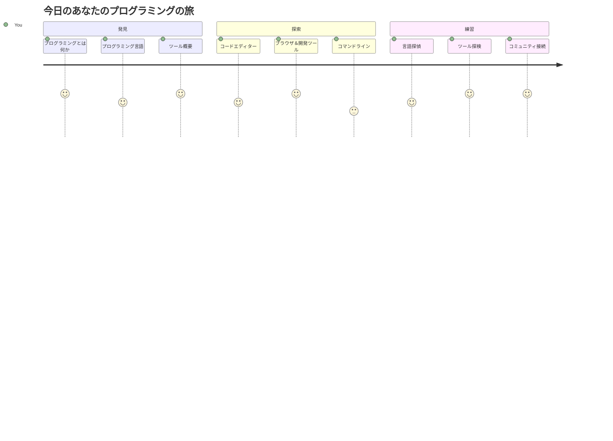
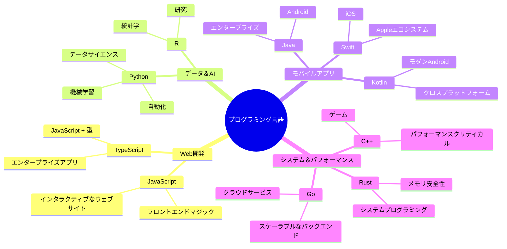
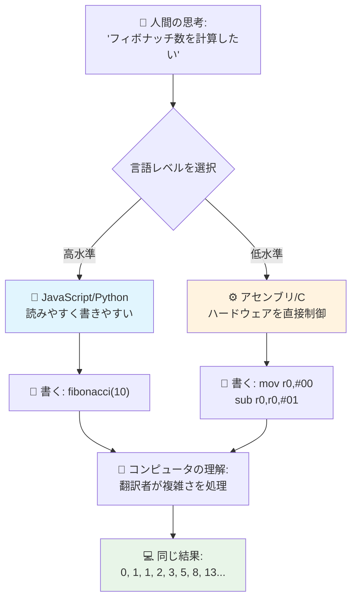
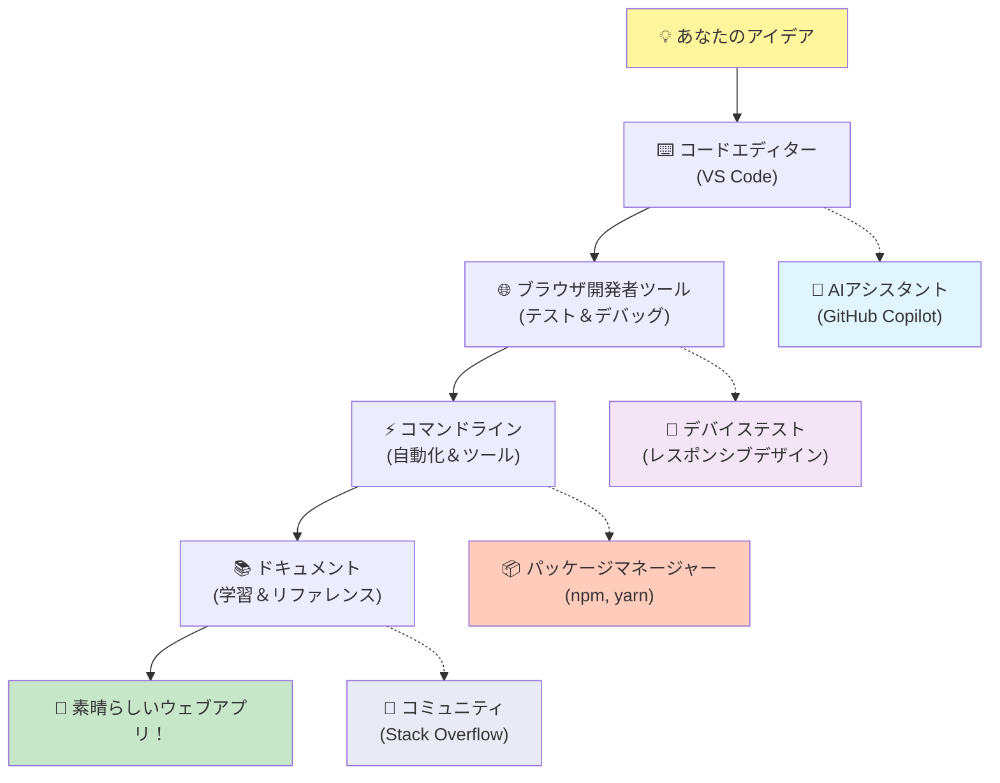
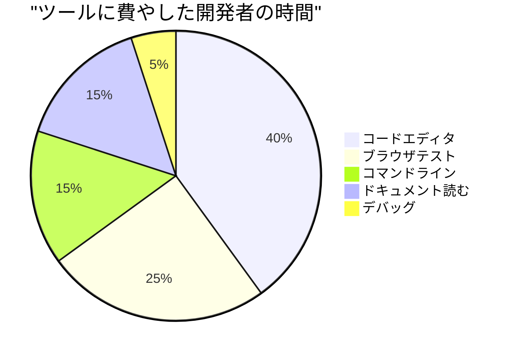

# プログラミング言語と最新開発者ツールの紹介
 
こんにちは、未来の開発者さん！👋 毎日ゾクゾクする話をしてもいいですか？プログラミングはただのコンピューターの話じゃなくて、あなたの最もワイルドなアイデアを実現する本当のスーパーパワーを持つことなんです！

あなたが好きなアプリを使っていて、すべてが完璧にかみ合う瞬間ってありますよね？ボタンをタップすると、まさに「わぁ、どうやってこれをやったんだろう？」という魔法のようなことが起こる。実はその魔法を作り出したのは、あなたと同じ誰か、たぶん真夜中の2時にお気に入りのコーヒーショップで3杯目のエスプレッソを飲みながら書いたコードなんです。そして衝撃の事実：このレッスンの終わりには、彼らがどうやってそれをやったのか理解できるだけでなく、自分でもやってみたくてたまらなくなるでしょう！

今プログラミングが難しそうに感じても大丈夫。私も最初は、数学の天才か5歳からずっとコードを書いている人じゃないとダメだと思っていました。でも考え方が変わったのは、プログラミングは新しい言語の会話を学ぶのと同じだと気づいた時です。「こんにちは」「ありがとう」から始めて、コーヒーを注文できるようになり、気づいたら哲学的なディスカッションをしている！今回はコンピューターと会話しているようなもので、正直に言うと？コンピューターは最も辛抱強い会話相手ですよ。間違いを決して責めず、何度でもチャレンジするのを喜んでくれます！

今日は、最新のウェブ開発を可能にし、しかもやみつきにするすばらしいツールを探検します。NetflixやSpotify、あなたの好きなインディーアプリスタジオの開発者が毎日使っている、まさに同じエディター、ブラウザ、ワークフローのことです。そして、ここが嬉しいところ：これらの業界標準ツールの多くは完全に無料です！


> スケッチノート： [Tomomi Imura](https://twitter.com/girlie_mac)


```mermaid
journey
    title 今日のあなたのプログラミングの旅
    section 発見
      プログラミングとは何か: 5: You
      プログラミング言語: 4: You
      ツール概要: 5: You
    section 探索
      コードエディター: 4: You
      ブラウザ＆開発ツール: 5: You
      コマンドライン: 3: You
    section 練習
      言語探偵: 4: You
      ツール探検: 5: You
      コミュニティ接続: 5: You
```
## まずはあなたの知識を見てみよう！

楽しい話に入る前に、プログラミングのことをどれくらい知っていますか？もし「まったくわからない」と思っていても、それは全然問題なし！むしろ最高のスタート地点です。このクイズはウォームアップ、筋トレ前のストレッチのようなものなので、脳の筋肉をほぐしましょう！

[事前クイズを受ける](https://ff-quizzes.netlify.app/web/)


## これから一緒に旅する冒険

正直言って、今日探る内容にとてもワクワクしています！あなたのリアクションを見るのが待ちきれません。以下が一緒に進む素晴らしい旅です：

- **プログラミングとは何か（そしてなぜ最高なのか）** – コードがあなたの周りのすべてを動かす見えない魔法であることを一緒に発見しましょう。月曜の朝を知っている目覚ましからあなたのNetflixのおすすめを完璧にキュレーションするアルゴリズムまで
- <strong>プログラミング言語とその驚くべき個性</strong> – それぞれが異なるスーパーパワーや問題解決の方法を持つ人が集まるパーティを想像してください。それがプログラミング言語の世界で、あなたは彼らに会うのが楽しみになります！
- <strong>デジタルマジックを生みだす基本構成要素</strong> – まるで究極のクリエイティブなレゴセットのようなもの。これらのピースがどう組み合わさるか理解したら、あなたの想像が叶うものなら何でも作れることに気づくでしょう
- <strong>まるで魔法使いの杖を渡されたかのように感じさせるプロフェッショナルツール</strong> – 大げさではなく、本当にスーパーパワーを持った気分にさせてくれるツールで、それがプロたちと同じものなのです！

> 💡 <strong>ここで一つ</strong>：今日すべてを暗記しようなんて思わないでください！今は「何ができるか」というワクワク感を感じてほしいだけです。詳細は練習を重ねる中で自然に身についていきます。これが本当の学び方です！

> このレッスンは [Microsoft Learn](https://learn.microsoft.com/en-us/learn/modules/web-development-101/introduction-programming/?WT.mc_id=academic-77807-sagibbon) でも受講可能です！

## そもそもプログラミングって何？

さて、大問題に取り組みましょう：プログラミングとは本当に何？

私の考え方をガラリと変えた話をしましょう。先週、母に新しいスマートテレビのリモコンの使い方を説明しようとしていました。「赤いボタンを押して、いや大きい赤いボタンじゃなくて左の小さい赤いボタン…いや、反対の左…よし、今は2秒長押し、1秒じゃなくて3秒でもなく…」わかりますか？ 😅

これこそがプログラミングです！非常に強力だけど、すべてがパーフェクトに伝わる必要がある対象に、細かく段階的に指示を与える技術です。母に説明する時は「あの赤いボタンどれ？」と聞き返してもらえますが、コンピューターの場合は文字通り言われた通りに動きます。たとえ言ったことがあなたの意図と違っていても。

初めてこれを知った時私が驚いたのは、コンピューターの核は意外と単純だということです。理解できるのはたった2つ、1と0。つまり「はい」と「いいえ」か、「電源オン」と「オフ」だけ！でも魔法的なのは、マトリックスみたいに1か0だけで話す必要はないこと。そこに登場するのが <strong>プログラミング言語</strong> です。私たちの普通の人間の考えをコンピューター言語に変換してくれる、最高の通訳のような存在です。

そして、朝起きて今でもゾクゾクする事実は、あなたの生活のすべてのデジタルが、パジャマ姿でコーヒーを飲みながらラップトップでコードを書いている誰かから始まったこと。あなたを完璧に見せるInstagramのフィルター？誰かがあれをコーディングした。あなたのお気に入りの新しい曲にたどり着いた推薦システム？開発者がそのアルゴリズムを作った。友人とディナーの割り勘を助けるアプリ？「これめんどくさいな、直せるかも」と思った誰かが作った。

プログラミングを学ぶことで単に新しいスキルを身に付けるだけではなく、「誰かの一日をちょっと良くするものを作れたら？」と日々考える素晴らしい問題解決者のコミュニティの一員になるのです。本当に、これ以上クールなことがあるでしょうか？

✅ <strong>面白い豆知識探し</strong>：空いた時間にぜひ調べてみてほしいことがあります。世界で最初のコンピューター・プログラマーは誰だと思いますか？ヒントは、あなたの予想とは違うかもしれません！その人物の物語は非常に興味深く、プログラミングは常に創造的な問題解決と枠を超えた思考だったことを示しています。

### 🧠 **今の気持ちはどう？**

**ちょっと振り返ってみて：**
- 「コンピューターに指示を出す」という考え、今は理解できていますか？
- 日常のどんな作業をプログラミングで自動化したいと思いますか？
- 今感じている疑問や考えは何ですか？

> <strong>覚えていて</strong>：まだぼんやりしていても全然普通です。プログラミングは新しい言語を学ぶのと同じで、脳が神経回路を作るのに時間がかかります。あなたはしっかりやっていますよ！

## プログラミング言語は魔法の異なる味わいのようなもの

少し変な話に聞こえるかもしれませんが、付き合ってください。プログラミング言語は色々なタイプの音楽によく似ています。ジャズはスムーズで即興的、ロックは力強くストレート、クラシックは優雅で構造的、ヒップホップは創造的で表現力豊か。どれも独自の雰囲気、熱狂的なファンコミュニティがあり、気分やシチュエーションに応じて使い分けます。

プログラミング言語もまったく同じです！大規模な気候データを処理するのにジュースアップなモバイルゲームを作るときと同じ言語を使いませんよね？ヨガクラスでデスメタルを流さないのと同じです（まあほとんどのヨガクラスはそうですが😄）。

でもいつも驚くのは、これらの言語が「世界で最も辛抱強い聡明な通訳」みたいにあなたの隣に座っているかのような存在であること。あなたが人間の脳にとって自然な方法でアイデアを表現しても、それをコンピューターが理解する1と0に翻訳してくれます。まるで「人間の創造性」と「コンピューターロジック」の両方に完全に堪能な友達がいるみたいなもの。それに疲れ知らずで、コーヒーブレイクもいらず、同じ質問を何度聞いても決して怒らない！

### 人気プログラミング言語と用途


```mermaid
mindmap
  root((プログラミング言語))
    Web開発
      JavaScript
        フロントエンドマジック
        インタラクティブなウェブサイト
      TypeScript
        JavaScript + 型
        エンタープライズアプリ
    データ＆AI
      Python
        データサイエンス
        機械学習
        自動化
      R
        統計学
        研究
    モバイルアプリ
      Java
        Android
        エンタープライズ
      Swift
        iOS
        Appleエコシステム
      Kotlin
        モダンAndroid
        クロスプラットフォーム
    システム＆パフォーマンス
      C++
        ゲーム
        パフォーマンスクリティカル
      Rust
        メモリ安全性
        システムプログラミング
      Go
        クラウドサービス
        スケーラブルなバックエンド
```
| 言語 | 得意分野 | 人気の理由 |
|----------|----------|------------------|
| **JavaScript** | ウェブ開発、ユーザーインターフェイス | ブラウザで動作し、インタラクティブなサイトに最適 |
| **Python** | データサイエンス、自動化、AI | 読みやすく学びやすい、強力なライブラリを持つ |
| **Java** | 企業向けアプリ、Androidアプリ | プラットフォーム非依存、大規模システムに強い |
| **C#** | Windowsアプリ、ゲーム開発 | マイクロソフトの強力なエコシステムサポート |
| **Go** | クラウドサービス、バックエンドシステム | 高速でシンプル、現代のコンピューティング向け |

### 高水準言語と低水準言語

正直、これが私の脳を破壊した概念だったので、私の気づきをアナロジーで共有します。これがあなたにも役立つことを願っています！

言語が通じない国に行き、トイレを必死で探している状況を想像してください（誰もが経験ありますよね？😅）：

- <strong>低水準プログラミング</strong>は地元の方言を完璧に理解し、角の果物売りのおばあちゃんと文化的な話題やスラング、地元のジョークで会話ができる状態。流暢で素晴らしいですが、トイレを探すだけの時には圧倒されるかも。

- <strong>高水準プログラミング</strong>はあなたが英語で「トイレを探しています」と言うと、地元の友人が対話も翻訳もしてくれて、あなたの異文化脳にぴったりわかりやすい案内をくれるようなもの。

プログラミングだと：
- <strong>低水準言語</strong>（AssemblyやCなど）はコンピューターの実際のハードウェアと非常に詳細にやり取りできますが、機械のように考える必要があり…まあかなりの脳の切り替えが必要です！
- <strong>高水準言語</strong>（JavaScript、Python、C#など）は人間の思考に近い状態で考えられて、機械語は裏で処理してくれます。しかも、新人の気持ちを覚えた優しいコミュニティもあります！

どちらをオススメするかというと？😉 高水準言語がいいですよ！トレーニングホイールみたいに、始めてみたら外すのが惜しくなるくらい快適だからです！


```mermaid
flowchart TB
    A["👤 人間の思考:<br/>'フィボナッチ数を計算したい'"] --> B{言語レベルを選択}
    
    B -->|高水準| C["🌟 JavaScript/Python<br/>読みやすく書きやすい"]
    B -->|低水準| D["⚙️ アセンブリ/C<br/>ハードウェアを直接制御"]
    
    C --> E["📝 書く: fibonacci(10)"]
    D --> F["📝 書く: mov r0,#00<br/>sub r0,r0,#01"]
    
    E --> G["🤖 コンピュータの理解:<br/>翻訳者が複雑さを処理"]
    F --> G
    
    G --> H["💻 同じ結果:<br/>0, 1, 1, 2, 3, 5, 8, 13..."]
    
    style C fill:#e1f5fe
    style D fill:#fff3e0
    style H fill:#e8f5e8
```
### 高水準言語がこんなに優しい理由をお見せします

これから高水準言語に惚れた理由を示す例をお見せします。まず、約束してください。最初のコード例を見て怖がらないで！あえて見た目が難しそうにしているのがポイントなんです！

同じタスクを全く異なる2つのスタイルで書いたものを見てみましょう。両方とも「フィボナッチ数列」を作っています。これは0, 1, 1, 2, 3, 5, 8, 13...という美しい数学パターンで、各数字がその前の2つの合計になる仕組みです。（豆知識：このパターンは自然界にあふれています。ひまわりの種の渦巻き、松ぼっくりの模様、銀河の形成にも！）

違いを見る準備はいいですか？さあ、行きましょう！

**高水準言語（JavaScript） – 人間に優しい：**

```javascript
// ステップ1：基本的なフィボナッチのセットアップ
const fibonacciCount = 10;
let current = 0;
let next = 1;

console.log('Fibonacci sequence:');
```

**このコードがすること：**
- <strong>定数を宣言</strong>し、何個のフィボナッチ数を作るか指定
- <strong>2つの変数を初期化</strong>して、現在の数と次の数を追跡
- <strong>開始値を設定</strong>（0と1）してフィボナッチパターンを定義
- <strong>出力用にヘッダー表示</strong>をセットアップ

```javascript
// ステップ2：ループを使用してシーケンスを生成する
for (let i = 0; i < fibonacciCount; i++) {
  console.log(`Position ${i + 1}: ${current}`);
  
  // シーケンスの次の数字を計算する
  const sum = current + next;
  current = next;
  next = sum;
}
```

**ここで何が起きているか：**
- **`for`ループ**で数列のそれぞれの位置を繰り返し処理
- <strong>テンプレートリテラルで</strong>番号と数字を表示
- <strong>現在と次の値を足して</strong>次のフィボナッチ数を計算
- <strong>追跡変数を更新</strong>して次の繰り返しへ移行

```javascript
// ステップ 3: モダンな関数型アプローチ
const generateFibonacci = (count) => {
  const sequence = [0, 1];
  
  for (let i = 2; i < count; i++) {
    sequence[i] = sequence[i - 1] + sequence[i - 2];
  }
  
  return sequence;
};

// 使用例
const fibSequence = generateFibonacci(10);
console.log(fibSequence);
```

**上のコードで行ったこと：**
- <strong>最新のアロー関数構文で</strong>再利用可能な関数を作成
- <strong>配列を作り</strong>数列を一つずつ表示する代わりに格納
- <strong>配列のインデックスを使い</strong>前の値から新しい数を計算
- <strong>完成した数列を返し</strong>他の箇所でフレキシブルに使用可能

**低水準言語（ARMアセンブリ） – コンピューターに優しい：**

```assembly
 area ascen,code,readonly
 entry
 code32
 adr r0,thumb+1
 bx r0
 code16
thumb
 mov r0,#00
 sub r0,r0,#01
 mov r1,#01
 mov r4,#10
 ldr r2,=0x40000000
back add r0,r1
 str r0,[r2]
 add r2,#04
 mov r3,r0
 mov r0,r1
 mov r1,r3
 sub r4,#01
 cmp r4,#00
 bne back
 end
```

JavaScript版がほぼ英語の命令のように読めるのに対し、アセンブリ版はコンピューターのプロセッサを直接制御する難解な命令を使っているのがわかります。どちらも同じタスクを達成しますが、高水準言語は人間にとってはるかに理解しやすく、書きやすく、メンテナンスしやすいです。

**気づく重要な違い：**
- <strong>可読性</strong>：JavaScriptは`fibonacciCount`のように説明的な名前を使うのに対し、アセンブリでは`r0`や`r1`のような暗号のようなラベルを使います。
- <strong>コメント</strong>：高級言語はコードが自動的に説明的になるような解説コメントを推奨します。
- <strong>構造</strong>：JavaScriptの論理の流れは、人間が問題をステップごとに考える方法に合っています。
- <strong>メンテナンス</strong>：さまざまな要件に合わせてJavaScriptバージョンを更新するのは簡単で明確です。

✅ <strong>フィボナッチ数列について</strong>：この絶対に美しい数列のパターン（それぞれの数字がその前の二つの和になる：0, 1, 1, 2, 3, 5, 8…）は自然界の文字通り<em>あらゆる場所</em>に現れます！ヒマワリのらせん、松ぼっくりの模様、オウムガイの殻の曲がり方、さらには木の枝の成長の仕方にまで見られます。数学とコードが自然が美を創り出すパターンを理解し再現する助けになるのは、本当に驚くべきことです！

## 魔法を起こす構成要素

さあ、プログラミング言語が実際にどのように動いているのかを見たところで、実際に書かれたあらゆるプログラムを成り立たせている基本的なパーツを分解してみましょう。これらはあなたのお気に入りのレシピの必須材料のようなもので、それぞれの役割を理解すれば、ほぼどんな言語でもコードを読んだり書いたりできるようになります！

これはプログラミングの文法を学ぶようなものです。学校で名詞や動詞、文の組み立て方を学んだのを思い出してください。プログラミングには独自の文法があり、正直英語の文法よりもはるかに論理的で寛容なんです！😄

### ステートメント：ステップごとの指示

まずは<strong>ステートメント</strong>です。これはコンピューターとの会話における１つ１つの文のようなものです。各ステートメントはコンピューターに特定の1つのことをするよう指示します。たとえば「ここで左に曲がって」「赤信号で止まって」「あの場所に駐車して」みたいに方向を教える感じです。

ステートメントの素晴らしいところはその可読性の高さです。見てください：

```javascript
// 単一の動作を行う基本的な文
const userName = "Alex";                    
console.log("Hello, world!");              
const sum = 5 + 3;                         
```
  
**このコードの動作：**  
- ユーザー名を格納する定数変数を<strong>宣言</strong>  
- コンソール出力に挨拶メッセージを<strong>表示</strong>  
- 数学的演算の結果を計算して<strong>保存</strong>

```javascript
// ウェブページとやり取りするステートメント
document.title = "My Awesome Website";      
document.body.style.backgroundColor = "lightblue";
```
  
**ステップごとに説明すると：**  
- ブラウザタブに表示されるウェブページのタイトルを<strong>変更</strong>  
- ページ全体の背景色を<strong>変更</strong>

### 変数：プログラムの記憶システム

さて、<strong>変数</strong>は私が教える中でも本当に大好きなコンセプトの1つです。なぜなら、毎日あなたが使っているものにとても似ているからです！

ちょっとあなたのスマホの連絡先リストを思い出してください。全員の電話番号を覚えているわけではなく、「お母さん」「親友」「AM2時まで配達してくれるピザ屋」といった名前で保存し、電話が番号を記憶してくれていますよね。変数もまったく同じ仕組みです！名前がついたラベル付きの入れ物のようなものに情報を入れて、後で名前で取り出せるのです。

さらに素敵なのは、プログラムの実行中に変数の中身が変わることもできる点です（だから「variable＝変わるもの」という名前になっています）。例えば、新しいピザ屋を見つけて登録情報を更新するのと同じように、プログラムが新しい情報を学んだり状況が変わったら変数の値も更新できるのです！

こんなに簡単で美しい例をお見せしましょう：

```javascript
// ステップ1：基本的な変数の作成
const siteName = "Weather Dashboard";        
let currentWeather = "sunny";               
let temperature = 75;                       
let isRaining = false;                      
```
  
**理解すべきこと：**  
- `const`変数には変わらない値を<strong>保存</strong>（サイト名など）  
- `let`は変更可能な値に使う  
- 文字列（テキスト）、数値、真偽値（true/false）など異なるデータ型を<strong>代入</strong>  
- それぞれの変数が何を持っているか分かるように説明的な名前を<strong>選ぶ</strong>

```javascript
// ステップ2: 関連データをグループ化するためのオブジェクトの操作
const weatherData = {                       
  location: "San Francisco",
  humidity: 65,
  windSpeed: 12
};
```
  
**上記の内容としては：**  
- 関連する天気情報をまとめて管理するオブジェクトを<strong>作成</strong>  
- 複数のデータを1つの変数名で<strong>整理</strong>  
- キーと値のペアでそれぞれの情報をはっきり<strong>ラベル付け</strong>

```javascript
// ステップ3: 変数の使用と更新
console.log(`${siteName}: Today is ${currentWeather} and ${temperature}°F`);
console.log(`Wind speed: ${weatherData.windSpeed} mph`);

// 変更可能な変数の更新
currentWeather = "cloudy";                  
temperature = 68;                          
```
  
**各部分の理解：**  
- `${}`構文のテンプレートリテラルで情報を<strong>表示</strong>  
- ドット表記（`weatherData.windSpeed`）でオブジェクトのプロパティに<strong>アクセス</strong>  
- `let`で宣言した変数を<strong>更新</strong>して変化する条件に対応  
- 複数の変数を組み合わせて意味のあるメッセージを<strong>作成</strong>

```javascript
// ステップ4: より洗練されたコードのための最新の分割代入
const { location, humidity } = weatherData; 
console.log(`${location} humidity: ${humidity}%`);
```
  
**重要なポイント：**  
- 分割代入でオブジェクトの特定プロパティを<strong>抜き出す</strong>  
- オブジェクトのキーと同じ名前の新しい変数を自動的に<strong>作成</strong>  
- 重複するドット表記を避けてコードを<strong>簡素化</strong>

### 制御フロー：プログラムに考えさせる

ここからプログラミングが驚くほど面白くなってきます！<strong>制御フロー</strong>は簡単にいえば、あなたが日々何気なくしている賢い判断をプログラムに「教える」ことです。

今朝の自分を思い出してください。「雨が降っていたら傘を持って行く。寒ければジャケットを着る。遅刻しそうなら朝食抜きでコーヒーを買う」こうした if-thenの論理を頭は毎日何十回も無意識に扱っていますよね。

これがプログラムを単なる退屈なスクリプト以上に、知的で生きているように感じさせるのです。実際に状況を見て、何が起きているか評価し、それに応じて処理することができるのです。プログラムに適応し選択を可能にする脳を与えるようなもの！

この仕組みがいかに素晴らしいか見てみましょう：

```javascript
// ステップ1: 基本的な条件ロジック
const userAge = 17;

if (userAge >= 18) {
  console.log("You can vote!");
} else {
  const yearsToWait = 18 - userAge;
  console.log(`You'll be able to vote in ${yearsToWait} year(s).`);
}
```
  
**このコードの動き：**  
- ユーザーの年齢が投票資格に達しているかを<strong>チェック</strong>  
- 条件結果に応じて異なるコードブロックを<strong>実行</strong>  
- 18歳未満なら投票資格までの期間を計算し表示  
- 各シナリオに応じた具体的で役立つフィードバックを<strong>提供</strong>

```javascript
// ステップ2: 論理演算子を使った複数条件
const userAge = 17;
const hasPermission = true;

if (userAge >= 18 && hasPermission) {
  console.log("Access granted: You can enter the venue.");
} else if (userAge >= 16) {
  console.log("You need parent permission to enter.");
} else {
  console.log("Sorry, you must be at least 16 years old.");
}
```
  
**ここでの動作の内訳：**  
- `&&`（and）演算子で複数条件を<strong>組み合わせ</strong>  
- `else if`で条件を階層化して複数シナリオを対応  
- 最後の`else`で全ての可能ケースを<strong>処理</strong>  
- 各種状況に応じた明確なフィードバックを<strong>提供</strong>

```javascript
// ステップ3: 三項演算子を使った簡潔な条件式
const votingStatus = userAge >= 18 ? "Can vote" : "Cannot vote yet";
console.log(`Status: ${votingStatus}`);
```
  
**覚えておくべきこと：**  
- 単純な2択条件には三項演算子（`? :`）を<strong>使う</strong>  
- まず条件を書き、その後に`?`、真の結果、`:`、偽の結果を続ける  
- 条件に応じて値を代入するときにこのパターンを<strong>適用</strong>

```javascript
// ステップ4：複数の特定のケースを処理する
const dayOfWeek = "Tuesday";

switch (dayOfWeek) {
  case "Monday":
  case "Tuesday":
  case "Wednesday":
  case "Thursday":
  case "Friday":
    console.log("It's a weekday - time to work!");
    break;
  case "Saturday":
  case "Sunday":
    console.log("It's the weekend - time to relax!");
    break;
  default:
    console.log("Invalid day of the week");
}
```
  
**このコードでしていること：**  
- 変数の値を複数の具体的ケースに<strong>照合</strong>  
- 似たケースをグループ化（平日と週末など）  
- マッチしたら適切なコードブロックを<strong>実行</strong>  
- 予期しない値に備えて`default`ケースを含む  
- `break`文でコードの連続実行を防止

> 💡 <strong>実世界の例え</strong>：制御フローは世界で最も忍耐強いGPSのようなものです。例えば「メインストリートが混んでいたら高速道路を使いなさい。高速道路が工事で使えなければ景色の良い道を試しなさい」といった指示をします。プログラムも同じ条件付きのロジックで異なる状況に知的に対応し、ユーザーに最高の体験を提供します。

### 🎯 **コンセプトチェック：基本要素の習得度**

**基本はどのくらい理解できましたか？**  
- 変数とステートメントの違いを自分の言葉で説明できますか？  
- 日常のif-then判断（投票の例のような）を思い浮かべてください  
- プログラムの論理で意外だったことは何ですか？

**自信をちょっと高めるアップデート：**  

```mermaid
flowchart LR
    A["📝 文[命令]"] --> B["📦 変数[記憶域]"] --> C["🔀 制御フロー[判断]"] --> D["🎉 動作するプログラム!"]
    
    style A fill:#ffeb3b
    style B fill:#4caf50
    style C fill:#2196f3
    style D fill:#ff4081
```  
✅ <strong>次回予告</strong>：これからも一緒にこの素晴らしい旅を続けながら、これらの概念をもっと深めていきます！今は未来に待ち受ける無限の可能性に胸を高鳴らせてください。具体的なスキルやテクニックは、練習しながら自然と身についていきます。思ったよりずっと楽しいですよ、絶対に！

## ツールの紹介

さて、本当にワクワクが抑えきれないこの瞬間！🚀 今から、まるでデジタル宇宙船の鍵を手渡されたかのように感じさせてくれる素晴らしいツールたちについて話します。

シェフが完璧にバランスの取れた包丁を手の延長のように使う例や、ミュージシャンが触れた瞬間に歌いだすようなギターを持つ例を思い浮かべてください。開発者たちにも同じような魔法の道具があり、それらの多くが実は無料だということを聞いたらきっと驚くはずです！

私がこれらを皆さんに紹介できるのが本当に嬉しいのは、これらがソフトウェア開発のやり方を根本から変えてくれたからです。AI搭載のコード補助ツールがコードを書く手助けをしてくれたり（本当に冗談ではありません！）、Wi-Fiさえあればどこでもアプリを作れるクラウド環境、プログラムの透視能力のようなデバッグツールなどがあるのです。

そして今もゾクゾクするのですが、これらは「初心者用ツール」ではなく、GoogleやNetflix、あなたの好きなインディーアプリスタジオの開発者たちがまさに今この瞬間に使っている同じプロ向けの道具なのです。使いこなせばすごくプロっぽく感じることでしょう！


```mermaid
graph TD
    A["💡 あなたのアイデア"] --> B["⌨️ コードエディター<br/>(VS Code)"] 
    B --> C["🌐 ブラウザ開発者ツール<br/>(テスト＆デバッグ)"]
    C --> D["⚡ コマンドライン<br/>(自動化＆ツール)"]
    D --> E["📚 ドキュメント<br/>(学習＆リファレンス)"]
    E --> F["🚀 素晴らしいウェブアプリ！"]
    
    B -.-> G["🤖 AIアシスタント<br/>(GitHub Copilot)"]
    C -.-> H["📱 デバイステスト<br/>(レスポンシブデザイン)"]
    D -.-> I["📦 パッケージマネージャー<br/>(npm, yarn)"]
    E -.-> J["👥 コミュニティ<br/>(Stack Overflow)"]
    
    style A fill:#fff59d
    style F fill:#c8e6c9
    style G fill:#e1f5fe
    style H fill:#f3e5f5
    style I fill:#ffccbc
    style J fill:#e8eaf6
```  
### コードエディター＆IDE：新しいデジタルの親友

コードエディターの話をしましょう。これらはまさにあなたの新しいお気に入りの居場所になるはずです！個人的なコーディングの聖域のようなもので、ここでデジタルな作品をじっくり作り上げていくことになります。

近年のエディターは単なるテキストエディターではありません。24時間365日あなたのそばにいる最高のコーディングメンターのように、タイポを見つけたり、天才のように見える改善案を提案したり、コードの意味を理解するのを助けたり、あなたの入力を予測して先を補完してくれるものさえあります！

私が最初にオートコンプリートを体験したときは、まさに未来に生きている気分でした。何かをタイプし始めるとエディターが「あ、それ使おうとしてたでしょ？」と言ってくれるような感覚です。まさに心を読めるコーディング仲間！

**これらエディターが素晴らしい理由は？**

現代のコードエディターは生産性を高めるためのさまざまな機能を備えています：

| 機能 | できること | 利点 |
|---------|--------------|--------------|
| <strong>構文ハイライト</strong> | コードの異なる部分を色分け | コードが読みやすくエラーを見つけやすい |
| <strong>オートコンプリート</strong> | タイプ中にコードを提案 | コーディング速度アップ＆タイポ減少 |
| <strong>デバッグツール</strong> | エラーの発見と修正を支援 | トラブルシューティングの時間を大幅短縮 |
| <strong>拡張機能</strong> | 専門的な機能を追加可能 | 好きな技術に合わせてカスタマイズ |
| **AIアシスタント** | コードや説明を提案 | 学習と生産性を加速 |

> 🎥 <strong>動画リソース</strong>：これらのツールを実際に見てみたいですか？この[Tools of the Trade 動画](https://youtube.com/watch?v=69WJeXGBdxg)で総合的に紹介しています。

#### ウェブ開発におすすめのエディター

**[Visual Studio Code](https://code.visualstudio.com/?WT.mc_id=academic-77807-sagibbon)**（無料）  
- ウェブ開発者に最も人気  
- 優れた拡張機能エコシステム  
- 統合ターミナルとGit連携  
- <strong>必須拡張機能</strong>：  
  - [GitHub Copilot](https://marketplace.visualstudio.com/items?itemName=GitHub.copilot)：AIによるコード提案  
  - [Live Share](https://marketplace.visualstudio.com/items?itemName=MS-vsliveshare.vsliveshare)：リアルタイム共同作業  
  - [Prettier](https://marketplace.visualstudio.com/items?itemName=esbenp.prettier-vscode)：自動コード整形  
  - [Code Spell Checker](https://marketplace.visualstudio.com/items?itemName=streetsidesoftware.code-spell-checker)：タイプミス検出

**[JetBrains WebStorm](https://www.jetbrains.com/webstorm/)**（有料、学生は無料）  
- 高度なデバッグとテスト機能  
- インテリジェントなコード補完  
- 組み込みのバージョン管理

**クラウド型IDE**（各種料金プランあり）  
- [GitHub Codespaces](https://github.com/features/codespaces)：ブラウザでフルVS Code体験  
- [Replit](https://replit.com/)：学習やコード共有に最適  
- [StackBlitz](https://stackblitz.com/)：即時のフルスタックウェブ開発

> 💡 <strong>始めるためのヒント</strong>：まずはVisual Studio Codeを使ってみましょう。無料で業界で広く使われており、豊富なチュートリアルや拡張機能のコミュニティがあります。

### ウェブブラウザ：秘密の開発ラボ

さて、あなたの考え方を180度変える話をします！いつもSNSを見たり動画を見たりするのに使っているブラウザには、実はすごい秘密の開発ラボが隠れているのをご存知でしたか？

ウェブページ上で右クリックして「検証」（Inspect Element）を選ぶたびに、隠された開発者用ツールの世界を開いています。これらは私がかつて何百ドルも出して買っていた高価なソフトよりも強力です。まるで普段使っているキッチンの壁の背後にプロのシェフ専用ラボが隠されていたようなものです！
誰かが初めてブラウザのDevToolsを見せてくれたとき、私は3時間もクリックしまくって、「えっ、それもできるの？！」ってなっていました。実際にリアルタイムでどんなウェブサイトでも編集できて、すべての読み込み速度を正確に確認でき、異なるデバイスでのサイトの見え方をテストし、さらにはまるでプロのようにJavaScriptをデバッグできるんです。本当に驚きの連続でした！

**ブラウザがあなたの最強の武器である理由はこれです：**

ウェブサイトやウェブアプリケーションを作成する時は、実際の環境でどのように見え、動くかを確認する必要があります。ブラウザはあなたの作業を表示するだけでなく、パフォーマンス、アクセシビリティ、そして潜在的な問題について詳細なフィードバックも提供してくれます。

#### ブラウザ開発者ツール（DevTools）

現代のブラウザには包括的な開発スイートが搭載されています：

| ツールカテゴリ | できること | 例となる使い方 |
|---------------|------------|----------------|
| **Element Inspector** | HTML/CSSをリアルタイムで表示・編集 | スタイリングを調整して即座に結果を見る |
| **Console** | エラーメッセージを見たりJavaScriptをテスト | 問題のデバッグやコードの実験 |
| **Network Monitor** | リソースの読み込み状況を追跡 | パフォーマンスや読み込み時間の最適化 |
| **Accessibility Checker** | インクルーシブデザインのテスト | すべてのユーザーが使いやすいサイトの確保 |
| **Device Simulator** | 異なる画面サイズでプレビュー | 複数のデバイスがなくてもレスポンシブデザインをテスト |

#### 開発におすすめのブラウザ

- **[Chrome](https://developers.google.com/web/tools/chrome-devtools/)** - 業界標準のDevToolsで豊富なドキュメント付き
- **[Firefox](https://developer.mozilla.org/docs/Tools)** - 優れたCSSグリッドとアクセシビリティツール
- **[Edge](https://docs.microsoft.com/microsoft-edge/devtools-guide-chromium/?WT.mc_id=academic-77807-sagibbon)** - ChromiumベースでMicrosoftの開発リソースも充実

> ⚠️ <strong>重要なテストのヒント</strong>：ウェブサイトは複数のブラウザで必ずテストしましょう！Chromeで完璧に動いてもSafariやFirefoxでは見た目が違うことがあります。プロの開発者は主要なブラウザすべてで一貫したユーザー体験を保証します。


### コマンドラインツール：開発者のスーパーパワーへの入口

さて、本音で言いましょう。コマンドラインについて本当に理解している人からの言葉で聞いてほしいと思います。最初にこれを見たとき、ただの黒い画面に点滅するテキストがあるだけで、「絶対ダメ！これは1980年代のハッカー映画に出てくるやつで、自分には全然むり！」って思いました😅

でも、当時誰かが教えてくれたらよかったこと、今あなたに伝えたいことはこうです：コマンドラインは怖いものじゃなく、むしろコンピュータと直接会話しているようなものなんです。高機能で写真やメニューがあるおしゃれなアプリで料理を注文するのと、シェフがあなたの好みを知っていて「お任せでスペシャル作りますよ」と言ってくれるお店に直接行く違いのようなもの。

コマンドラインは開発者が魔法使いのように感じられる場所です。数語の「魔法の言葉」（実際はコマンドですが）を打ってEnterを押せば、プロジェクトの構造を丸ごと作ったり、強力なツールを世界からインストールしたり、数百万の人に見てもらうためにアプリをインターネットに公開したりできます。一度その力を体感すると、正直ちょっと中毒になりますよ！

**コマンドラインがあなたの好きなツールになる理由：**

GUIは多くの作業に便利ですが、コマンドラインは自動化、正確さ、速度で優れています。多くの開発ツールはコマンドラインインターフェースを中心に動いているため、効率的に使えるようになると生産性が大幅に向上します。

```bash
# ステップ1：プロジェクトディレクトリを作成して移動する
mkdir my-awesome-website
cd my-awesome-website
```

**このコードは以下を行います：**
- プロジェクト用に「my-awesome-website」という新しいディレクトリを作成
- 作成したディレクトリに移動して作業開始

```bash
# ステップ2：package.jsonでプロジェクトを初期化する
npm init -y

# 最新の開発ツールをインストールする
npm install --save-dev vite prettier eslint
npm install --save-dev @eslint/js
```

**手順としては：**
- `npm init -y`でデフォルト設定の新規Node.jsプロジェクトを初期化
- 高速な開発と本番ビルド用にViteをインストール
- コード整形用のPrettierとコード品質チェック用のESLintも追加
- `--save-dev`フラグで開発用依存としてマーク

```bash
# ステップ3：プロジェクトの構造とファイルを作成する
mkdir src assets
echo '<!DOCTYPE html><html><head><title>My Site</title></head><body><h1>Hello World</h1></body></html>' > index.html

# 開発サーバーを起動する
npx vite
```

**上記の内容については：**
- ソースコードとアセット用にフォルダを分けて整理
- 基本的なHTMLファイルを正しいドキュメント構造で生成
- Viteの開発サーバーを起動しライブリロードとホットモジュール交換を開始

#### ウェブ開発に必須のコマンドラインツール

| ツール | 用途 | なぜ必要か |
|------|---------|-------------|
| **[Git](https://git-scm.com/)** | バージョン管理 | 変更履歴の追跡、共同作業、バックアップ |
| **[Node.js & npm](https://nodejs.org/)** | JavaScript実行環境 & パッケージ管理 | ブラウザ外でJavaScriptを実行、最新開発ツールの導入 |
| **[Vite](https://vitejs.dev/)** | ビルドツール & 開発サーバー | ホットモジュール交換による超高速な開発 |
| **[ESLint](https://eslint.org/)** | コード品質 | JavaScriptの問題点を自動検出・修正 |
| **[Prettier](https://prettier.io/)** | コードフォーマット | コードを一貫性のある読みやすい形に整形 |

#### プラットフォーム別のおすすめ

**Windows:**
- **[Windows Terminal](https://docs.microsoft.com/windows/terminal/?WT.mc_id=academic-77807-sagibbon)** - 現代的で多機能なターミナル
- **[PowerShell](https://docs.microsoft.com/powershell/?WT.mc_id=academic-77807-sagibbon)** 💻 - 強力なスクリプト環境
- **[Command Prompt](https://learn.microsoft.com/windows-server/administration/windows-commands/windows-commands)** 💻 - 伝統的なコマンドライン

**macOS:**
- **[Terminal](https://support.apple.com/guide/terminal/)** 💻 - 標準搭載のターミナルアプリ
- **[iTerm2](https://iterm2.com/)** - 高機能を備えたターミナル

**Linux:**
- **[Bash](https://www.gnu.org/software/bash/)** 💻 - 標準的なシェル
- **[KDE Konsole](https://docs.kde.org/trunk5/en/konsole/konsole/index.html)** - 高機能なターミナルエミュレーター

> 💻 = OSにプリインストール済み

> 🎯 <strong>学習の進め方</strong>：まずは`cd`（ディレクトリ移動）、`ls`や`dir`（ファイル一覧表示）、`mkdir`（フォルダ作成）などの基本コマンドから始めましょう。`npm install`や`git status`、`code .`（現在のディレクトリをVS Codeで開く）といった現代的なワークフローのコマンドも練習しましょう。慣れてくればより高度なコマンドや自動化にも自然に取り組めるようになります。


### ドキュメント：いつでも頼れる学習のメンター

さて、初心者であることに少し安心できる秘密をお話ししましょう。経験豊富な開発者でさえ、かなりの時間をドキュメントの読み込みに費やしています。これは「知らないから」ではなく、むしろ「賢さの表れ」です！

ドキュメントは、24時間いつでも利用できる世界で最も忍耐強く知識豊富な教師がいるようなものです。午前2時に問題に詰まっても、ドキュメントは温かくそっと包み込み、必要な答えを提供してくれます。みんなが話題にしている新しい機能を学びたいときも、ドキュメントはステップバイステップの例と共にサポート。なぜその動作になるのか理解したいときも、分かりやすく説明してくれます。

私の考えを完全に変えたことがあります：ウェブ開発の世界は非常に速く進化していて、誰も（本当に誰も！）すべて覚えているわけではありません。15年以上のベテラン開発者が基本の構文を調べているのも見ましたが、それは恥ずかしいことではなく賢明な行動です。完璧な記憶力ではなく、信頼できる答えを素早く見つけ出し、適切に活用できることが重要なのです。

**ここにこそ本当の魔法があるのです：**

プロの開発者は多くの時間をドキュメントの読み込みに費やします。これは分からないからではなく、ウェブ開発の状況が日々変わるため、常に学び続ける必要があるからです。良質なドキュメントは「どう使うか」だけではなく、「なぜ使うか」「いつ使うか」も教えてくれます。

#### 必読ドキュメントリソース

**[Mozilla Developer Network (MDN)](https://developer.mozilla.org/docs/Web)**
- ウェブ技術ドキュメントのゴールドスタンダード
- HTML、CSS、JavaScriptの包括的ガイド
- ブラウザ互換性情報も豊富
- 実用的な例とインタラクティブなデモ付き

**[Web.dev](https://web.dev)** (Google提供)
- 最新のウェブ開発ベストプラクティス
- パフォーマンス最適化のガイド
- アクセシビリティとインクルーシブデザインの原則
- 実際のプロジェクトからのケーススタディ

**[Microsoft Developer Documentation](https://docs.microsoft.com/microsoft-edge/#microsoft-edge-for-developers)**
- Edgeブラウザ用開発リソース
- プログレッシブウェブアプリガイド
- クロスプラットフォーム開発の知見

**[Frontend Masters Learning Paths](https://frontendmasters.com/learn/)**
- 構造化された学習カリキュラム
- 業界の専門家による動画コース
- 実践的なコーディング演習

> 📚 <strong>学習戦略</strong>：ドキュメントを丸暗記しようとしないでください。代わりに効率的にナビゲートする方法を習得しましょう。よく使うリファレンスはブックマークし、検索機能を使って素早く必要な情報を見つける練習をしましょう。

### 🔧 **ツール習熟チェック：何があなたに響く？**

**少し考えてみてください：**
- どのツールを最初に試してみたいですか？（間違いはありません！）
- コマンドラインはまだ怖いですか？それとも興味が湧いてきましたか？
- ブラウザのDevToolsを使ってお気に入りのサイトの裏側を覗くことを想像できますか？


```mermaid
pie title "ツールに費やした開発者の時間"
    "コードエディタ" : 40
    "ブラウザテスト" : 25
    "コマンドライン" : 15
    "ドキュメント読む" : 15
    "デバッグ" : 5
```
> <strong>面白い事実</strong>：多くの開発者は編集作業の約40%をコードエディターで過ごしていますが、テストや学習、問題解決への時間もかなり使っています。プログラミングは単にコードを書くことではなく、体験を作り上げることです！

✅ <strong>考えてみよう</strong>：ウェブサイトを作る（開発）ためのツールと、見た目をデザインするためのツールはどう違うと思いますか？これは美しい家を設計する建築家と、実際に家を建てる建設業者の違いのようなものです。どちらも重要ですが、必要な道具は異なります！この考え方はウェブサイトがどうやって形になるかを理解するのに役立ちます。

## GitHub Copilot Agent チャレンジ 🚀

Agentモードを使って以下のチャレンジをクリアしてください：

**説明:** モダンなコードエディターやIDEの機能を探り、どのようにウェブ開発の作業効率を上げられるかを実演してください。

**プロンプト:** Visual Studio Code、WebStorm、またはクラウドベースのIDEなど、コードエディターやIDEを選択します。コード作成、デバッグ、メンテナンスに役立つ3つの機能や拡張機能を挙げ、それぞれがワークフローにどのように役立つか簡潔に説明してください。

---

## 🚀 チャレンジ

**さあ、探偵さん、最初の事件の準備はいいですか？**

この素晴らしい基礎を得たあなたに、プログラミングの世界がどれほど多様で魅力的かを体験してもらう冒険があります。まだコードを書く段階じゃないのでプレッシャーはなし！あなたはまるで初めてのワクワクする事件を追うプログラミング言語探偵のようです！

**あなたのミッション（もし受けるなら）：**
1. <strong>言語探検家になろう</strong>：まったく異なる3つのプログラミング言語を選びましょう。例えば、ウェブサイトを作る言語、モバイルアプリを作る言語、科学者向けのデータ処理言語など。同じ簡単なタスクをそれぞれで書いた例を見つけてください。同じことをしているのにどれだけ違うかに驚くでしょう！

2. <strong>起源の物語を探ろう</strong>：それぞれの言語の特徴は何でしょう？面白いことに、どの言語も「この特定の問題をもっと良く解決する方法があるはずだ」と考えた誰かが作ったものです。どんな問題があったのか調べてみましょう。実に興味深い話がたくさんあります！

3. <strong>コミュニティを知ろう</strong>：それぞれの言語のコミュニティはどれくらい歓迎的で情熱的でしょうか？数百万の開発者が知識を共有し支え合うものもあれば、小規模でも強い結束とサポート力を持つものもあります。それぞれの個性を知るのは楽しいですよ！

4. <strong>直感に従おう</strong>：今いちばん手が伸びそうな言語はどれですか？「完璧な」選択をする必要はありません。直感に従うだけでOK！間違いはありませんし、後から他の言語を試すこともできます。

<strong>探偵のボーナスワーク</strong>：それぞれの言語で作られている有名なウェブサイトやアプリを調べてみてください。InstagramやNetflix、あるいは止められないあのモバイルゲームが何で動いているか知ったら驚くでしょう！

> 💡 <strong>覚えておいてください</strong>：今日これらの言語の専門家になる必要はありません。どこに住みたいか決める前の「町の下見」みたいなものです。ゆっくり時間をかけて、楽しんで、好奇心に従ってください！

## あなたの発見を祝いましょう！

なんてことでしょう、今日はたくさんの素晴らしい情報を吸収しましたね！この素晴らしい旅があなたにどれだけ響いたかを見るのが本当に楽しみです。そして忘れないでください – これはすべて完璧に答えるテストではありません。これから飛び込むこの魅力的な世界について学んだ「すごいこと」を祝う時間です！

[ポストレッスンクイズを受ける](https://ff-quizzes.netlify.app/web/)

## 復習＆自主学習

**ゆっくりと探索し、楽しみながら学んでください！**
今日はたくさんのことを学びましたね、それは誇るべきことです！さあ、ここからが楽しいところです—あなたの好奇心を刺激したトピックを探求してみましょう。これは宿題ではなく、冒険です！

**興味を持ったことをもっと深掘りしましょう：**

**プログラミング言語を実際に触ってみる：**
- 気になった2～3つの言語の公式サイトを訪れてみましょう。それぞれに個性と物語があります！
- [CodePen](https://codepen.io/)、[JSFiddle](https://jsfiddle.net/)、または [Replit](https://replit.com/) のようなオンラインのコードプレイグラウンドを試してみてください。実験を恐れないでください—何も壊れません！
- お気に入りの言語がどのように生まれたかを読んでみてください。本当に、これらの起源の話は魅力的で、言語がなぜそう動くのかを理解する助けになります。

**新しいツールに慣れましょう：**
- まだダウンロードしていなければ Visual Studio Code をダウンロードしましょう—無料で、きっと気に入るはずです！
- 数分間、拡張機能マーケットプレイスをブラウズしてみましょう。コードエディターのためのアプリストアのようなものです！
- ブラウザの開発者ツールを開いて、いろいろクリックしてみてください。すべてを理解しようと心配しなくて大丈夫—何があるのかに慣れましょう。

**コミュニティに参加しましょう：**
- [Dev.to](https://dev.to/)、[Stack Overflow](https://stackoverflow.com/)、または [GitHub](https://github.com/) の開発者コミュニティをフォローしましょう。プログラミングコミュニティは新人にとてもフレンドリーです！
- 初心者向けのコーディング動画をYouTubeで見てみましょう。スタートしたばかりの頃の気持ちを覚えている素晴らしいクリエイターがたくさんいます。
- ローカルのミートアップやオンラインコミュニティへの参加も考えてみてください。開発者は新人を助けるのが大好きです！

> 🎯 <strong>覚えておいてほしいこと</strong>：あなたが一夜にしてコーディングの魔法使いになる必要はありません！今はただ、この素晴らしい新しい世界を知り始めているだけです。ゆっくり進んで、この旅を楽しんでください。そして—あなたが憧れるすべての開発者は、かつてまさに今のあなたの場所に座って、ワクワクしながら、もしかしたら少し圧倒されていたことを忘れないでください。それは完全に普通のことですし、あなたが正しい道を歩んでいる証拠です！


## 課題

[Reading the Docs](assignment.md)

> 💡 <strong>課題へのちょっとした後押し</strong>：まだ触れていないツールを探検してみるのもぜひ！すでに話したエディターやブラウザ、コマンドラインツールは飛ばしてください—まだ知られていない素晴らしい開発ツールの宇宙が広がっています。活発にメンテナンスされていて、活気があり親切なコミュニティを持つものを探しましょう（こういうツールには最高のチュートリアルがあり、つまずいた時に助けてくれる人がいます）。

---

## 🚀 あなたのプログラミングジャーニータイムライン

### ⚡ **これから5分でできること**
- [ ] 気になったプログラミング言語の公式サイトを2～3つブックマークする
- [ ] まだならVisual Studio Codeをダウンロードする
- [ ] ブラウザのDevTools（F12）を開いて任意のウェブサイトをクリックしてみる
- [ ] どれかプログラミングコミュニティに参加する（Dev.to、Reddit r/webdev、または Stack Overflow）

### ⏰ **この1時間で達成できること**
- [ ] レッスン終了後のクイズをクリアし、自分の回答を振り返る
- [ ] GitHub Copilot拡張機能を使ってVS Codeをセットアップする
- [ ] 2つの異なるプログラミング言語でオンライン上で「Hello World」例を試す
- [ ] YouTubeで「開発者の1日」動画を見る
- [ ] プログラミング言語の探偵仕事を始める（チャレンジから）

### 📅 **1週間の冒険**
- [ ] 課題を完了し、新しい開発ツールを3つ探索する
- [ ] 5人の開発者またはプログラミングアカウントをSNSでフォローする
- [ ] CodePenやReplitで小さなものを作ってみる（「Hello, [Your Name]!」でもOK）
- [ ] 誰かのコーディング体験についての開発者ブログ記事を1つ読む
- [ ] バーチャルミートアップに参加するか、プログラミングトークを見る
- [ ] 選んだ言語をオンラインチュートリアルで学び始める

### 🗓️ **1か月の変化**
- [ ] 最初の小さなプロジェクトを完成させる（単純なウェブページでもカウント）
- [ ] オープンソースプロジェクトに貢献する（まずはドキュメントの修正から）
- [ ] プログラミングを始めたばかりの誰かをメンターする
- [ ] 開発者ポートフォリオのウェブサイトを作成する
- [ ] 地元の開発者コミュニティや勉強会とつながる
- [ ] 次の学習マイルストーンを計画し始める

### 🎯 <strong>最終の振り返りチェックイン</strong>

**次のステップに進む前に、ちょっとお祝いしましょう：**
- 今日プログラミングでワクワクしたことは何ですか？
- 最初に探索したいツールや概念は何ですか？
- プログラミングの旅を始めることについてどう感じていますか？
- 今、開発者に聞いてみたい質問は何ですか？


```mermaid
journey
    title あなたの自信構築の旅
    section 今日
      興味津々: 3: You
      圧倒されている: 4: You
      ワクワクしている: 5: You
    section 今週
      探索中: 4: You
      学習中: 5: You
      つながり中: 4: You
    section 来月
      構築中: 5: You
      自信にあふれている: 5: You
      他者を支援している: 5: You
```
> 🌟 <strong>覚えておいてください</strong>：すべてのエキスパートはかつて初心者でした。すべてのシニア開発者は、かつて今のあなたのようにワクワクし、少し圧倒され、そして何が可能かを強く好奇心旺盛に感じていました。あなたは素晴らしい仲間入りをしたのです。この旅は驚くべきものになるでしょう。プログラミングの素晴らしい世界へようこそ！ 🎉

---

<!-- CO-OP TRANSLATOR DISCLAIMER START -->
**免責事項**:  
本書類はAI翻訳サービス [Co-op Translator](https://github.com/Azure/co-op-translator) を使用して翻訳されています。正確性には努めていますが、自動翻訳には誤りや不正確な箇所が含まれる可能性があることをご理解ください。原文のネイティブ言語版が正式な情報源として優先されます。重要な情報については、専門の人間による翻訳を推奨します。本翻訳の使用により生じる誤解や誤訳については責任を負いかねます。
<!-- CO-OP TRANSLATOR DISCLAIMER END -->