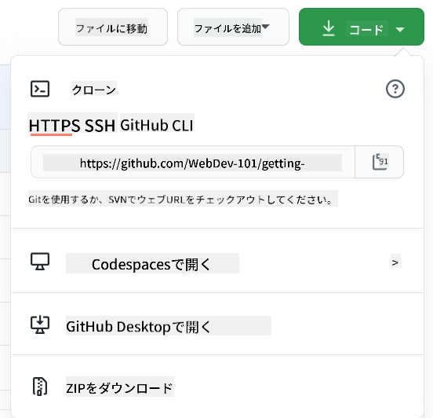

<!--
CO_OP_TRANSLATOR_METADATA:
{
  "original_hash": "ea65b75e488aa33a3cc5cb1c6c3f047a",
  "translation_date": "2025-10-03T13:44:29+00:00",
  "source_file": "1-getting-started-lessons/2-github-basics/README.md",
  "language_code": "ja"
}
-->
# GitHubの紹介

このレッスンでは、コードのホスティングと変更管理を行うプラットフォームであるGitHubの基本について学びます。


> スケッチノート: [Tomomi Imura](https://twitter.com/girlie_mac)

## 講義前のクイズ
[講義前のクイズ](https://ff-quizzes.netlify.app)

## はじめに

このレッスンでは以下を学びます:

- 自分のマシンでの作業を追跡する方法
- 他の人とプロジェクトを進める方法
- オープンソースソフトウェアに貢献する方法

### 前提条件

始める前に、Gitがインストールされているか確認してください。ターミナルで以下を入力します:  
`git --version`

Gitがインストールされていない場合は、[Gitをダウンロード](https://git-scm.com/downloads)してください。その後、ターミナルでローカルGitプロファイルを設定します:
* `git config --global user.name "your-name"`
* `git config --global user.email "your-email"`

Gitがすでに設定されているか確認するには以下を入力します:  
`git config --list`

また、GitHubアカウント、コードエディタ（例: Visual Studio Code）、ターミナル（またはコマンドプロンプト）が必要です。

[github.com](https://github.com/)にアクセスして、まだアカウントを作成していない場合は作成するか、ログインしてプロフィールを埋めてください。

✅ GitHubは世界で唯一のコードリポジトリではありませんが、最もよく知られています。

### 準備

ローカルマシン（ノートパソコンやPC）にコードプロジェクトのフォルダと、他の人のプロジェクトに貢献する方法を学ぶための例として使用するGitHub上の公開リポジトリが必要です。

---

## コード管理

ローカルにコードプロジェクトのフォルダがあり、Git（バージョン管理システム）を使って進捗を追跡したいとします。Gitを使うことは、未来の自分へのラブレターを書くようなものだと例えられることがあります。数日、数週間、数ヶ月後にコミットメッセージを読むことで、なぜその決定をしたのかを思い出したり、変更を「巻き戻す」ことができます。ただし、良い「コミットメッセージ」を書くことが重要です。

### タスク: リポジトリを作成してコードをコミットする  

> 動画をチェックしてください  
> 
> [](https://www.youtube.com/watch?v=9R31OUPpxU4)

1. **GitHubでリポジトリを作成する**。GitHub.comで、リポジトリタブまたは右上のナビゲーションバーから**新しいリポジトリ**ボタンを見つけます。

   1. リポジトリ（フォルダ）に名前を付けます。
   1. **リポジトリを作成**を選択します。

1. **作業フォルダに移動する**。ターミナルで、追跡を開始したいフォルダ（ディレクトリ）に移動します。以下を入力します:

   ```bash
   cd [name of your folder]
   ```

1. **Gitリポジトリを初期化する**。プロジェクト内で以下を入力します:

   ```bash
   git init
   ```

1. **ステータスを確認する**。リポジトリのステータスを確認するには以下を入力します:

   ```bash
   git status
   ```

   出力は以下のようになることがあります:

   ```output
   Changes not staged for commit:
   (use "git add <file>..." to update what will be committed)
   (use "git checkout -- <file>..." to discard changes in working directory)

        modified:   file.txt
        modified:   file2.txt
   ```

   通常、`git status`コマンドは、リポジトリに保存する準備ができているファイルや、変更が加えられたファイルなどを教えてくれます。

1. **すべてのファイルを追跡対象に追加する**  
   これはファイルをステージングエリアに追加することとも呼ばれます。

   ```bash
   git add .
   ```

   `git add`と`.`引数は、すべてのファイルと変更を追跡対象に追加することを示します。

1. **選択したファイルを追跡対象に追加する**

   ```bash
   git add [file or folder name]
   ```

   すべてのファイルを一度にコミットしたくない場合に、選択したファイルだけをステージングエリアに追加するのに役立ちます。

1. **すべてのファイルをステージング解除する**

   ```bash
   git reset
   ```

   このコマンドは、すべてのファイルを一度にステージング解除するのに役立ちます。

1. **特定のファイルをステージング解除する**

   ```bash
   git reset [file or folder name]
   ```

   このコマンドは、次のコミットに含めたくない特定のファイルだけをステージング解除するのに役立ちます。

1. **作業を永続化する**。この時点で、ファイルをいわゆるステージングエリアに追加しました。Gitがファイルを追跡している場所です。変更を永続化するには、ファイルをコミットする必要があります。コミットを作成するには、`git commit`コマンドを使用します。コミットはリポジトリの履歴における保存ポイントを表します。以下を入力してコミットを作成します:

   ```bash
   git commit -m "first commit"
   ```

   これにより、すべてのファイルがコミットされ、「first commit」というメッセージが追加されます。将来のコミットメッセージでは、変更の種類を伝えるためにもっと具体的な説明をすることをお勧めします。

1. **ローカルGitリポジトリをGitHubと接続する**。ローカルリポジトリはマシン上で便利ですが、ファイルのバックアップをどこかに保存したり、他の人をリポジトリに招待したりしたい場合があります。そのような場所としてGitHubは最適です。すでにGitHubでリポジトリを作成しているので、ローカルGitリポジトリをGitHubと接続するだけです。`git remote add`コマンドを使用します。以下のコマンドを入力してください:

   > 注意: コマンドを入力する前にGitHubリポジトリページに移動してリポジトリURLを見つけてください。このURLを以下のコマンドで使用します。```https://github.com/username/repository_name.git```をGitHubのURLに置き換えてください。

   ```bash
   git remote add origin https://github.com/username/repository_name.git
   ```

   これにより、以前に作成したGitHubリポジトリを指す「origin」という名前のリモート接続が作成されます。

1. **ローカルファイルをGitHubに送信する**。これまでのところ、ローカルリポジトリとGitHubリポジトリの間に接続を作成しました。次に、以下の`git push`コマンドを使用してこれらのファイルをGitHubに送信します:

   > 注意: デフォルトのブランチ名が```main```と異なる場合があります。

   ```bash
   git push -u origin main
   ```

   これにより、「main」ブランチのコミットがGitHubに送信されます。コマンドに`-u`を含めて`upstream`ブランチを設定することで、ローカルブランチとリモートブランチのリンクが確立され、今後はブランチ名を指定せずに`git push`や`git pull`を使用できるようになります。Gitは自動的にupstreamブランチを使用し、今後のコマンドでブランチ名を明示的に指定する必要がなくなります。

2. **さらに変更を加える**。変更を続けてGitHubにプッシュしたい場合は、以下の3つのコマンドを使用するだけです:

   ```bash
   git add .
   git commit -m "type your commit message here"
   git push
   ```

   > ヒント: `.gitignore`ファイルを採用して、GitHubに表示したくないファイルを追跡対象から除外することを検討してください。例えば、同じフォルダに保存しているメモファイルで、公開リポジトリには不要なものなどです。`.gitignore`ファイルのテンプレートは[.gitignore templates](https://github.com/github/gitignore)で見つけることができます。

#### コミットメッセージ

優れたGitコミットの件名行は以下の文を完成させます:  
「このコミットが適用されると、<件名行をここに記入>」

件名では命令形の現在形を使用します。「変更する」ではなく「変更した」や「変更すること」ではありません。  
件名と同様に、本文（任意）でも命令形の現在形を使用します。本文には変更の動機を含め、以前の動作と対比させます。`なぜ`を説明するのであって、`どのように`ではありません。

✅ GitHubを少し探索してみてください。非常に優れたコミットメッセージを見つけられますか？非常に簡素なものはどうですか？コミットメッセージで最も重要で有用な情報は何だと思いますか？

### タスク: コラボレーションする

GitHubにコードをアップロードする主な理由は、他の開発者とコラボレーションを可能にすることです。

## 他の人とプロジェクトを進める

> 動画をチェックしてください  
>
> [](https://www.youtube.com/watch?v=bFCM-PC3cu8)

リポジトリ内で、`Insights > Community`に移動して、プロジェクトが推奨されるコミュニティ標準とどのように比較されるかを確認します。

以下はGitHubリポジトリを改善するためのポイントです:
- **説明**。プロジェクトの説明を追加しましたか？
- **README**。READMEを追加しましたか？GitHubは[READMEの書き方](https://docs.github.com/articles/about-readmes/?WT.mc_id=academic-77807-sagibbon)についてのガイダンスを提供しています。
- **貢献ガイドライン**。プロジェクトに[貢献ガイドライン](https://docs.github.com/articles/setting-guidelines-for-repository-contributors/?WT.mc_id=academic-77807-sagibbon)がありますか？
- **行動規範**。[行動規範](https://docs.github.com/articles/adding-a-code-of-conduct-to-your-project/)がありますか？
- **ライセンス**。おそらく最も重要な[ライセンス](https://docs.github.com/articles/adding-a-license-to-a-repository/)がありますか？

これらのリソースは新しいチームメンバーのオンボーディングに役立ちます。そして、これらは通常、新しい貢献者がコードを見る前にプロジェクトが自分の時間を費やす価値があるかどうかを判断するために見るものです。

✅ READMEファイルは準備に時間がかかるものの、忙しいメンテナーによってしばしば無視されます。特に説明的なREADMEの例を見つけることができますか？注: [良いREADMEを作成するためのツール](https://www.makeareadme.com/)がいくつかありますので、試してみると良いでしょう。

### タスク: コードをマージする

貢献ドキュメントは人々がプロジェクトに貢献する方法を説明します。どのような種類の貢献を求めているか、プロセスがどのように機能するかを説明します。貢献者はGitHubのリポジトリに貢献するために一連のステップを経る必要があります:

1. **リポジトリをフォークする**。人々にプロジェクトをフォークするよう求めることが一般的です。フォークとは、自分のGitHubプロフィールにリポジトリの複製を作成することを意味します。
1. **クローン**。そこからプロジェクトをローカルマシンにクローンします。
1. **ブランチを作成する**。貢献者に作業用のブランチを作成するよう求めます。
1. **変更を1つの領域に集中させる**。貢献者に1度に1つのことに集中するよう求めます。そうすることで、彼らの作業をマージする可能性が高くなります。例えば、バグ修正、新機能の追加、いくつかのテストの更新を行った場合、3つのうち2つまたは1つしか実装できない場合を想像してください。

✅ ブランチが特に重要になる状況を想像してください。どのようなユースケースが考えられますか？

> 注意: 自分が望む変化を世界に示し、自分の作業にもブランチを作成してください。行ったコミットは現在「チェックアウト」しているブランチに行われます。`git status`を使用して、どのブランチにいるか確認してください。

貢献者のワークフローを見てみましょう。貢献者がすでにリポジトリをフォークし、クローンしていると仮定します。つまり、ローカルマシンで作業可能なGitリポジトリが準備されています:

1. **ブランチを作成する**。`git branch`コマンドを使用して、貢献する変更を含むブランチを作成します:

   ```bash
   git branch [branch-name]
   ```

1. **作業ブランチに切り替える**。指定したブランチに切り替え、`git switch`で作業ディレクトリを更新します:

   ```bash
   git switch [branch-name]
   ```

1. **作業を行う**。この時点で変更を加えます。以下のコマンドを使用してGitに変更を通知することを忘れないでください:

   ```bash
   git add .
   git commit -m "my changes"
   ```

   コミットに良い名前を付けることを忘れないでください。自分のためにも、リポジトリのメンテナーのためにも役立ちます。

1. **作業を`main`ブランチと統合する**。作業が完了したら、`main`ブランチの作業と統合したいと思うでしょう。その間に`main`ブランチが変更されている可能性があるため、以下のコマンドを使用して最新の状態に更新してください:

   ```bash
   git switch main
   git pull
   ```

   この時点で、Gitが変更を簡単に統合できない場合に備えて、作業ブランチで発生する可能性のある競合を確認してください。そのために以下のコマンドを実行します:

   ```bash
   git switch [branch_name]
   git merge main
   ```

   `git merge main`コマンドは`main`からのすべての変更をブランチに取り込みます。うまくいけばそのまま続行できます。そうでない場合は、VS CodeがGitが混乱している箇所を教えてくれるので、影響を受けたファイルを変更して最も正確な内容を指定します。

   別のブランチに切り替えるには、最新の`git switch`コマンドを使用します:
   ```bash
   git switch [branch_name]


1. **作業をGitHubに送信する**。作業をGitHubに送信するには2つのことを行います。ブランチをリポジトリにプッシュし、その後PR（プルリクエスト）を開きます。

   ```bash
   git push --set-upstream origin [branch-name]
   ```

   上記のコマンドはフォークしたリポジトリにブランチを作成します。
1. **PRを作成する**。次に、PRを作成します。GitHubでフォークしたリポジトリに移動すると、PRを作成するかどうか尋ねる表示が出ます。それをクリックすると、コミットメッセージのタイトルを変更したり、より適切な説明を追加したりできるインターフェースに移動します。これで、フォーク元のリポジトリのメンテナーがこのPRを確認し、_うまくいけば_ PRを気に入って _マージ_ してくれるでしょう。これであなたはコントリビューターになりました、やったね :)

1. **クリーンアップ**。PRを無事にマージした後は、_クリーンアップ_ するのが良い習慣とされています。ローカルブランチとGitHubにプッシュしたブランチの両方をクリーンアップします。まず、以下のコマンドでローカルブランチを削除します：

   ```bash
   git branch -d [branch-name]
   ```

次に、フォークしたリポジトリのGitHubページに移動し、プッシュしたリモートブランチを削除してください。

`Pull request`という言葉は少し変に思えるかもしれません。実際にはプロジェクトに変更をプッシュしたいのですが、メンテナー（プロジェクトの所有者）やコアチームが変更を検討してプロジェクトの「メイン」ブランチにマージする必要があるため、実際にはメンテナーに変更の決定をリクエストしていることになります。

Pull requestは、ブランチで導入された差分をレビュー、コメント、統合テストなどを通じて比較・議論する場です。良いPull requestはコミットメッセージとほぼ同じルールに従います。例えば、作業が問題を解決する場合、問題トラッカーの問題への参照を追加することができます。これは`#`の後に問題番号を付けて行います。例：`#97`

🤞すべてのチェックが通り、プロジェクトの所有者があなたの変更をプロジェクトにマージしてくれることを祈りましょう🤞

現在のローカル作業ブランチをGitHub上の対応するリモートブランチの新しいコミットで更新します：

`git pull`

## オープンソースへの貢献方法

まず、GitHubで興味のあるリポジトリ（**repo**）を見つけ、変更を加えたいと思うものを選びます。その内容を自分のマシンにコピーします。

✅ '初心者向け'のリポジトリを見つける良い方法は、[タグ 'good-first-issue' で検索すること](https://github.blog/2020-01-22-browse-good-first-issues-to-start-contributing-to-open-source/)です。



コードをコピーする方法はいくつかあります。一つの方法は、HTTPS、SSH、またはGitHub CLI（コマンドラインインターフェース）を使用してリポジトリの内容を"クローン"することです。

ターミナルを開き、以下のようにリポジトリをクローンします：
`git clone https://github.com/ProjectURL`

プロジェクトに取り組むには、正しいフォルダに移動します：
`cd ProjectURL`

また、[Codespaces](https://github.com/features/codespaces)（GitHubの埋め込みコードエディター/クラウド開発環境）や[GitHub Desktop](https://desktop.github.com/)を使用してプロジェクト全体を開くこともできます。

最後に、コードを圧縮フォルダとしてダウンロードすることもできます。

### GitHubについてのいくつかの興味深いこと

GitHub上の任意の公開リポジトリをスター、ウォッチ、または"フォーク"することができます。スターを付けたリポジトリは右上のドロップダウンメニューで見つけることができます。これはコードのブックマークのようなものです。

プロジェクトには通常、GitHubの「Issues」タブにある問題トラッカーがあり、そこでプロジェクトに関連する問題について議論します。また、Pull Requestsタブでは進行中の変更について議論やレビューが行われます。

プロジェクトには、フォーラム、メーリングリスト、Slack、Discord、IRCなどのチャットチャンネルで議論が行われることもあります。

✅ 新しいGitHubリポジトリを見て回り、設定を編集したり、リポジトリに情報を追加したり、プロジェクト（例えばカンバンボード）を作成したりしてみてください。できることはたくさんあります！

---

## 🚀 チャレンジ 

友達とペアを組んでお互いのコードに取り組みましょう。共同でプロジェクトを作成し、コードをフォークし、ブランチを作成し、変更をマージします。

## 講義後のクイズ
[講義後のクイズ](https://ff-quizzes.netlify.app/web/en/)

## レビューと自己学習

[オープンソースソフトウェアへの貢献について](https://opensource.guide/how-to-contribute/#how-to-submit-a-contribution)をさらに読む。

[Gitチートシート](https://training.github.com/downloads/github-git-cheat-sheet/)。

練習、練習、練習。GitHubには[skills.github.com](https://skills.github.com)で利用できる素晴らしい学習パスがあります：

- [GitHubでの最初の1週間](https://skills.github.com/#first-week-on-github)

さらに高度なコースも見つけることができます。

## 課題 

[GitHubでの最初の1週間コース](https://skills.github.com/#first-week-on-github)を完了してください。

---

**免責事項**:  
この文書は、AI翻訳サービス [Co-op Translator](https://github.com/Azure/co-op-translator) を使用して翻訳されています。正確性を追求しておりますが、自動翻訳には誤りや不正確な部分が含まれる可能性があることをご承知ください。元の言語で記載された文書が正式な情報源とみなされるべきです。重要な情報については、専門の人間による翻訳を推奨します。この翻訳の使用に起因する誤解や誤認について、当方は一切の責任を負いません。
