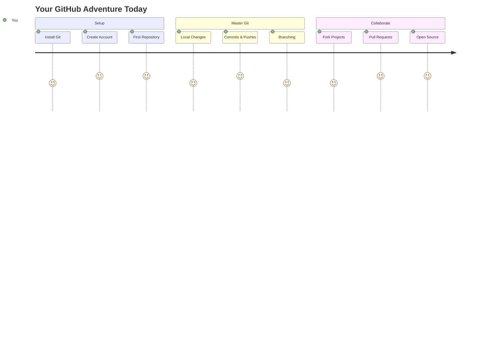
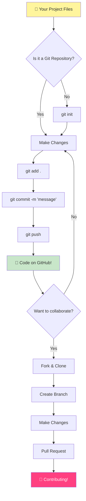
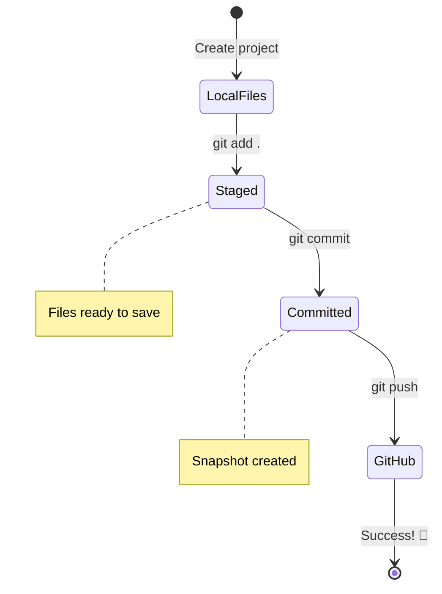
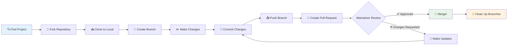
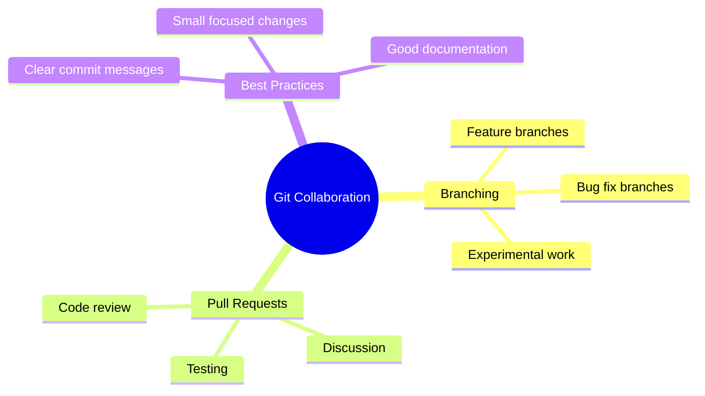
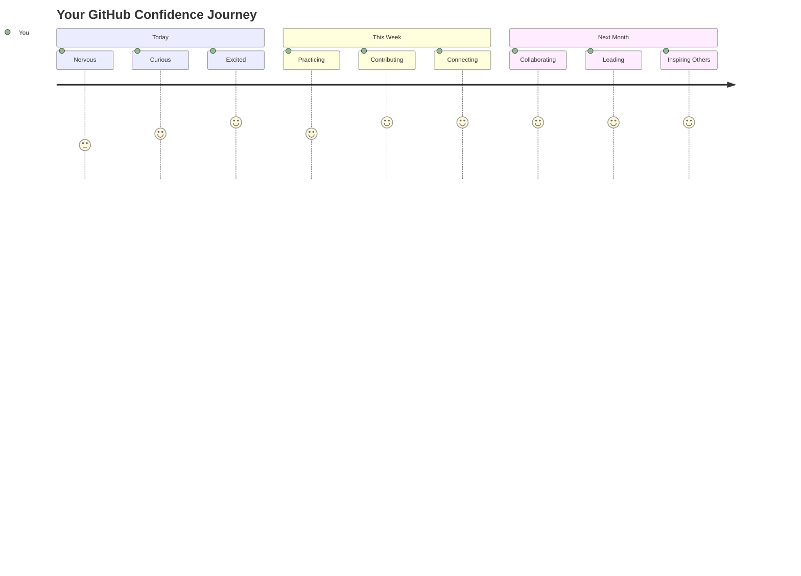

<!--
CO_OP_TRANSLATOR_METADATA:
{
  "original_hash": "0fe3ff66299b447f1c8cb34dcbf0c5ef",
  "translation_date": "2025-11-06T12:37:32+00:00",
  "source_file": "1-getting-started-lessons/2-github-basics/README.md",
  "language_code": "ja"
}
-->
# GitHubの紹介

こんにちは、未来の開発者さん！👋 世界中の何百万ものコーダーたちに仲間入りする準備はできていますか？GitHubを紹介するのが本当に楽しみです。これはプログラマーのためのソーシャルメディアプラットフォームのようなもので、ランチの写真を共有する代わりにコードを共有して一緒に素晴らしいものを作り上げるんです！

驚くべきことに、あなたのスマホのアプリ、訪れるウェブサイト、そして学ぶツールのほとんどは、GitHubのようなプラットフォームで開発者たちが協力して作り上げたものです。お気に入りの音楽アプリ？それに貢献した人がいるんです。やめられないゲーム？そう、それもおそらくGitHubでのコラボレーションで作られました。そして今、あなたもその素晴らしいコミュニティの一員になる方法を学ぶんです！

最初は少し難しく感じるかもしれません。私も最初のGitHubページを見たとき、「これって一体何のこと？」と思ったのを覚えています。でも、覚えておいてください。すべての開発者が今のあなたと同じところから始めています。このレッスンが終わる頃には、あなた自身のGitHubリポジトリ（クラウド上の個人プロジェクトのショーケースのようなもの）を持ち、作業を保存し、他の人と共有し、さらには何百万人が使うプロジェクトに貢献する方法を知ることができるでしょう。

一歩ずつ一緒に進んでいきましょう。急がず、プレッシャーもなしで、あなたと私、そしてこれからあなたの新しい親友になる本当にクールなツールたちと一緒に！


> スケッチノート: [Tomomi Imura](https://twitter.com/girlie_mac)



## 講義前のクイズ
[講義前のクイズ](https://ff-quizzes.netlify.app)

## はじめに

本当にワクワクする内容に入る前に、GitHubの魔法を使う準備をしましょう！これは、傑作を作る前にアート用品を整理するようなものです。適切なツールを準備することで、すべてがスムーズになり、ずっと楽しくなります。

セットアップの各ステップを個人的に案内しますが、最初は少し難しく見えるかもしれません。でも心配しないでください！すぐに慣れます。もしすぐに理解できなくても、それは完全に普通のことです！私も最初の開発環境をセットアップしたとき、古代の象形文字を読もうとしているような気分でした。すべての開発者が今のあなたと同じところから始めています。「これで合っているのかな？」と思いながら学んでいる時点で、すでに正しい道を進んでいます！🌟

このレッスンでは以下を学びます：

- 自分のマシンで行った作業を追跡する方法
- 他の人とプロジェクトを進める方法
- オープンソースソフトウェアに貢献する方法

### 前提条件

GitHubの魔法を使う準備をしましょう！心配しないでください。このセットアップは一度だけ行えばよく、その後はコーディングの旅全体で使えます。

まずは基礎から始めましょう！最初にGitがすでにあなたのコンピュータにインストールされているか確認する必要があります。Gitは、コードに加えたすべての変更を記憶してくれる超賢いアシスタントのようなものです。Ctrl+Sを何度も押すよりずっと便利です（みんな経験ありますよね！）。

ターミナルで以下の魔法のコマンドを入力してGitがインストールされているか確認しましょう：
`git --version`

もしGitがまだインストールされていなければ、心配しないでください！[Gitをダウンロード](https://git-scm.com/downloads)してインストールしてください。インストールが完了したら、Gitにあなたを紹介する必要があります：

> 💡 **初回セットアップ**: これらのコマンドはGitにあなたが誰であるかを伝えます。この情報はあなたが行うすべてのコミットに添付されるので、公開しても問題ない名前とメールアドレスを選びましょう。

```bash
git config --global user.name "your-name"
git config --global user.email "your-email"
```

Gitがすでに設定されているか確認するには以下を入力します：
```bash
git config --list
```

また、GitHubアカウント、コードエディタ（Visual Studio Codeなど）、そしてターミナル（またはコマンドプロンプト）を開く必要があります。

[github.com](https://github.com/)にアクセスして、まだアカウントを作成していない場合は作成するか、ログインしてプロフィールを埋めてください。

💡 **モダンなヒント**: [SSHキー](https://docs.github.com/en/authentication/connecting-to-github-with-ssh)を設定するか、[GitHub CLI](https://cli.github.com/)を使用して、パスワードなしで簡単に認証できるようにすることを検討してください。

✅ GitHubは世界で唯一のコードリポジトリではありません。他にもありますが、GitHubが最もよく知られています。

### 準備

ローカルマシン（ノートパソコンやPC）にコードプロジェクトのフォルダと、他の人のプロジェクトに貢献する方法を学ぶための例として使うGitHubの公開リポジトリが必要です。

### コードを安全に保つ

セキュリティについて少し話しましょう。でも心配しないでください、怖い話をするわけではありません！これらのセキュリティプラクティスは、車や家に鍵をかけるようなものです。簡単な習慣が自然になり、あなたの努力を守ります。

GitHubを使う際には、最初からモダンで安全な方法をお見せします。これにより、コーディングキャリア全体で役立つ良い習慣を身につけることができます。

GitHubを使用する際には、以下のセキュリティベストプラクティスを守ることが重要です：

| セキュリティ領域 | ベストプラクティス | なぜ重要か |
|------------------|------------------|------------------|
| **認証** | SSHキーまたは個人アクセストークンを使用 | パスワードは安全性が低く、廃止されつつある |
| **二要素認証** | GitHubアカウントで2FAを有効化 | アカウント保護の追加層を提供 |
| **リポジトリのセキュリティ** | 機密情報をコミットしない | APIキーやパスワードは公開リポジトリに含めない |
| **依存関係管理** | Dependabotを有効化して更新 | 依存関係を安全かつ最新に保つ |

> ⚠️ **重要なセキュリティリマインダー**: APIキー、パスワード、その他の機密情報をリポジトリにコミットしないでください。環境変数や`.gitignore`ファイルを使用して機密データを保護してください。

**モダンな認証セットアップ:**

```bash
# Generate SSH key (modern ed25519 algorithm)
ssh-keygen -t ed25519 -C "your_email@example.com"

# Set up Git to use SSH
git remote set-url origin git@github.com:username/repository.git
```

> 💡 **プロのヒント**: SSHキーはパスワードを繰り返し入力する必要がなく、従来の認証方法よりも安全です。

---

## コードをプロのように管理する

さて、ここからが本当にエキサイティングなところです！🎉 プロのようにコードを追跡・管理する方法を学びます。正直言って、これを教えるのが大好きです。なぜなら、これを学ぶと本当に世界が変わるからです。

想像してみてください：素晴らしい物語を書いていて、すべてのドラフト、素晴らしい編集、そして「これ天才的だ！」と思った瞬間を記録したいと思うでしょう。それがGitがコードに対して行うことです！すべてのキー入力、すべての変更、すべての「うわ、これ全部壊れた」瞬間を記憶して、すぐに元に戻せるんです。

正直に言うと、最初は圧倒されるかもしれません。私も最初は「普通にファイルを保存するだけじゃダメなの？」と思いました。でもこれだけは信じてください：Gitが理解できるようになると（必ずそうなります！）、あなたは「どうしてこれまでこれなしでコードを書いていたんだろう？」と思うでしょう。それは、歩いていたところから飛べるようになったような感覚です！

ローカルにコードプロジェクトのフォルダがあり、その進捗をバージョン管理システムであるGitを使って追跡したいとします。Gitを使うことは未来の自分へのラブレターを書くようなものだと言う人もいます。数日後、数週間後、数ヶ月後にコミットメッセージを読むことで、なぜその決定をしたのかを思い出したり、変更を「巻き戻す」ことができます。つまり、良い「コミットメッセージ」を書くことが重要です。



### タスク: 初めてのリポジトリを作成しよう！

> 🎯 **あなたのミッション（本当にワクワクします！）**: 初めてのGitHubリポジトリを一緒に作成しましょう！ここが終わる頃には、あなたのコードが住むインターネット上の小さなコーナーを持ち、初めての「コミット」（これは開発者の言葉で、非常に賢い方法で作業を保存することを意味します）を行います。
>
> これは本当に特別な瞬間です。あなたは世界中の開発者コミュニティに正式に参加しようとしています！私も初めてリポジトリを作成したときの興奮を覚えています。「わあ、本当にこれをやってるんだ！」と思いました。

この冒険を一緒に進めましょう。各部分をじっくり進めてください。急ぐ必要はありません。すべてのステップが意味を持つことを約束します。覚えておいてください、あなたが憧れるすべてのコーディングスターは、かつてあなたと同じ場所に座り、初めてのリポジトリを作成しようとしていました。なんて素晴らしいことでしょう！

> 動画をチェック
> 
> [](https://www.youtube.com/watch?v=9R31OUPpxU4)

**一緒にやってみましょう:**

1. **GitHubでリポジトリを作成する**。GitHub.comにアクセスして、明るい緑色の**New**ボタン（または右上の**+**記号）を探してください。それをクリックして**New repository**を選択します。

   以下を行いましょう：
   1. リポジトリに名前を付けます – あなたにとって意味のある名前にしましょう！
   1. 必要なら説明を追加します（これにより他の人があなたのプロジェクトが何であるかを理解しやすくなります）
   1. 公開（誰でも見られる）か非公開（自分だけのもの）を選択します
   1. READMEファイルを追加するチェックボックスをおすすめします – これはプロジェクトの表紙のようなものです
   1. **Create repository**をクリックしてお祝いしましょう – 初めてのリポジトリを作成しました！🎉

2. **プロジェクトフォルダに移動する**。次にターミナルを開きましょう（見た目ほど怖くありません！）。プロジェクトファイルがある場所をコンピュータに教える必要があります。このコマンドを入力してください：

   ```bash
   cd [name of your folder]
   ```

   **ここで何をしているか:**
   - コンピュータに「プロジェクトフォルダに移動して」と伝えています
   - これはデスクトップ上の特定のフォルダを開くようなものですが、テキストコマンドで行っています
   - `[name of your folder]`を実際のプロジェクトフォルダ名に置き換えてください

3. **フォルダをGitリポジトリに変える**。ここで魔法が起こります！以下を入力してください：

   ```bash
   git init
   ```

   **ここで起こったこと（かなりクールなこと！）:**
   - Gitがプロジェクト内に隠れた`.git`フォルダを作成しました – 見えませんが存在しています！
   - 通常のフォルダが「リポジトリ」に変わり、あなたが行うすべての変更を追跡できるようになりました
   - フォルダにすべてを記憶するスーパーパワーを与えたようなものです

4. **現在の状況を確認する**。Gitが今プロジェクトについてどう思っているか見てみましょう：

   ```bash
   git status
   ```

   **Gitが教えてくれることを理解する:**
   
   以下のようなものが表示されるかもしれません：

   ```output
   Changes not staged for commit:
   (use "git add <file>..." to update what will be committed)
   (use "git restore <file>..." to discard changes in working directory)

        modified:   file.txt
        modified:   file2.txt
   ```

   **慌てないでください！これはこういう意味です:**
   - **赤色**のファイルは変更があるがまだ保存する準備ができていないファイル
   - **緑色**のファイル（表示される場合）は保存する準備ができているファイル
   - Gitは次に何をすればいいかを正確に教えてくれています

   > 💡 **プロのヒント**: `git status`コマンドはあなたの親友です！何が起こっているのか混乱したときに使ってください。Gitに「今の状況はどう？」と尋ねるようなものです。

5. **ファイルを保存する準備をする**（これを「ステージング」と呼びます）：

   ```bash
   git add .
   ```

   **ここで行ったこと:**
   - Gitに「このフォルダ内のすべてのファイルを次の保存に含めたい」と伝えました
   - `.`は「このフォルダ内のすべて」を意味します
   - これでファイルが「ステージング」され、次のステップの準備が整いました

   **もっと選択的になりたい場合:** 特定のファイルだけを追加することもできます：

   ```bash
   git add [file or folder name]
   ```

   **なぜこれをしたいのか:**
   - 関連する変更をまとめて保存したい場合があります
   - 作業を論理的な塊に整理するのに役立ちます
   - 何がいつ変更されたのかを理解しやすくなります

   **気が変わった場合:** 心配しないでください！以下のようにしてファイルをステージングから外すことができます：

   ```bash
   # Unstage everything
   git reset
   
   # Unstage just one file
   git reset [file name]
   ```

   心配しないでください – これは作業を削除するわけではなく、「保存準備完了」の状態から外すだけです。

6. **作業を永久に保存する**（初めてのコミットを作成！）：

   ```bash
   git commit -m "first commit"
   ```

   **🎉 おめでとうございます！初めてのコミットを作成しました！**
   
   **ここで起こったこと:**
   - Gitがこの瞬間のすべてのステージングされたファイルの「スナップショット」を撮りました
   - コミットメッセージ「first commit」はこの保存ポイントが何であるかを説明しています
   - GitがこのスナップショットにユニークなIDを付けたので、後でいつでも見つけることができます
   - あなたのプロジェクトの履歴を追跡し始めました！

   > 💡 **次回のコミットメッセージ**: 次回のコミットではもっと具体的にしましょう！「updated stuff」ではなく、「Add contact form to homepage」や「Fix navigation menu bug」のように。未来の自分が感謝します！

7. **ローカルプロジェクトをGitHubに接続する**。現在、あなたのプロジェクトはコンピュータ上にしか存在していません。これをGitHubリポジトリに接続して、世界と共有しましょう！

   まず、GitHubリポジトリページに移動してURLを
**私たちが今やったこと:**
- ローカルプロジェクトとGitHubリポジトリの間に接続を作成しました
- "Origin"はGitHubリポジトリのニックネームのようなものです。電話帳に連絡先を追加するような感覚です
- これでローカルGitはコードを共有する準備ができたときにどこに送るべきかを知っています

💡 **簡単な方法**: GitHub CLIがインストールされている場合、これを1つのコマンドで実行できます:
   ```bash
   gh repo create my-repo --public --push --source=.
   ```

8. **コードをGitHubに送る** (いよいよ大事な瞬間です！):

   ```bash
   git push -u origin main
   ```

**🚀 これでコードをGitHubにアップロードします！**

**何が起きているのか:**
- コミットがコンピュータからGitHubに移動しています
- `-u`フラグは永続的な接続を設定し、次回以降のプッシュが簡単になります
- "main"は主要なブランチの名前です (メインフォルダのようなもの)
- これ以降、次回のアップロードでは単に`git push`と入力するだけでOKです！

💡 **注意**: ブランチ名が「master」など別の名前の場合、その名前を使用してください。`git branch --show-current`で確認できます。

9. **新しい日常のコーディングリズム** (これがクセになります！):

これからは、プロジェクトに変更を加えるたびに、この簡単な3ステップを繰り返します:

   ```bash
   git add .
   git commit -m "describe what you changed"
   git push
   ```

**これがコーディングの心拍リズムになります:**
- 素晴らしいコードの変更を加える ✨
- `git add`でステージング ("Gitさん、この変更に注目して！")
- `git commit`と説明的なメッセージで保存 (未来の自分が感謝します！)
- `git push`で世界と共有 🚀
- 繰り返し – 本当にこれが自然に感じるようになります！

このワークフローが好きなのは、ビデオゲームのセーブポイントを複数持つような感覚だからです。気に入った変更をしたらコミット！リスクのあることを試したい？問題ありません – もしうまくいかなくても、最後のコミットに戻ることができます！

> 💡 **ヒント**: `.gitignore`ファイルを採用して、GitHubに追跡したくないファイルが表示されないようにすることを検討してください。例えば、同じフォルダに保存しているけれど公開リポジトリには不要なメモファイルなどです。`.gitignore`ファイルのテンプレートは[.gitignore templates](https://github.com/github/gitignore)で見つけることができますし、[gitignore.io](https://www.toptal.com/developers/gitignore)を使って作成することもできます。

### 🧠 **最初のリポジトリチェックイン: どんな感じでしたか？**

**少し時間を取って祝福し、振り返りましょう:**
- 初めてGitHubにコードが表示されたとき、どんな気持ちでしたか？
- 最も混乱したステップはどれで、意外と簡単だったステップはどれでしたか？
- `git add`、`git commit`、`git push`の違いを自分の言葉で説明できますか？



> **覚えておいてください**: 経験豊富な開発者でもコマンドを正確に覚えていないことがあります。このワークフローを筋肉記憶にするには練習が必要です – あなたは素晴らしい進歩をしています！

#### モダンなGitワークフロー

以下のモダンなプラクティスを採用することを検討してください:

- **Conventional Commits**: `feat:`、`fix:`、`docs:`などの標準化されたコミットメッセージ形式を使用します。[conventionalcommits.org](https://www.conventionalcommits.org/)で詳細を学べます
- **Atomic commits**: 各コミットが単一の論理的変更を表すようにします
- **頻繁なコミット**: 大きなコミットではなく、頻繁に説明的なメッセージでコミットします

#### コミットメッセージ

優れたGitコミットの件名は次の文を完成させます:
このコミットが適用されると、<件名をここに記入>

件名では命令形の現在形を使用します。"変更する"ではなく"変更した"や"変更する予定"ではありません。件名と同様に、本文 (オプション) でも命令形の現在形を使用します。本文には変更の動機を含め、以前の動作との対比を示します。`どうやって`ではなく`なぜ`を説明します。

✅ GitHubを少し探索してみましょう。素晴らしいコミットメッセージを見つけられますか？非常に簡素なものを見つけられますか？コミットメッセージで最も重要で有用な情報は何だと思いますか？

## 他の人と一緒に作業する (楽しい部分！)

さあ、これからGitHubが本当に魔法のようになる部分に進みます！🪄 自分のコードを管理するスキルを習得しましたが、今度は私が最も好きな部分 – 世界中の素晴らしい人々とコラボレーションすること – に飛び込みます。

想像してみてください: 明日目を覚ますと、東京の誰かがあなたのコードを改善してくれている。そしてベルリンの誰かがあなたが悩んでいたバグを修正してくれる。午後にはサンパウロの開発者があなたが思いつかなかった機能を追加してくれる。それはSFではありません – それがGitHubの世界では普通の火曜日です！

私が本当に興奮するのは、これから学ぶコラボレーションスキルが、Google、Microsoft、そしてあなたが好きなスタートアップのチームが毎日使っているまさにそのワークフローだということです。単なる便利なツールを学ぶだけでなく、ソフトウェアの世界全体が協力するための秘密の言語を学んでいるのです。

本当に、初めてプルリクエストがマージされる感覚を経験すると、なぜ開発者がオープンソースに情熱を持つのかが理解できるでしょう。それは世界最大で最もクリエイティブなチームプロジェクトの一員になるようなものです！

> 動画をチェック
>
> [](https://www.youtube.com/watch?v=bFCM-PC3cu8)

GitHubにコードを置く主な理由は、他の開発者とコラボレーションを可能にすることでした。



リポジトリで`Insights > Community`に移動して、プロジェクトが推奨されるコミュニティ標準とどのように比較されるかを確認してください。

リポジトリをプロフェッショナルで歓迎的なものにしたいですか？リポジトリに移動して`Insights > Community`をクリックしてください。この素晴らしい機能は、GitHubコミュニティが「良いリポジトリのプラクティス」と考えるものとプロジェクトがどのように比較されるかを示します。

> 🎯 **プロジェクトを輝かせる**: 良く整理されたリポジトリと良いドキュメントは、清潔で歓迎的な店舗を持つようなものです。それはあなたが自分の仕事を大切にしていることを示し、他の人が貢献したいと思わせます！

**素晴らしいリポジトリを作るための要素:**

| 追加するもの | なぜ重要か | あなたにとって何をするか |
|-------------|-------------------|---------------------|
| **説明** | 第一印象が重要！ | プロジェクトが何をするかをすぐに理解できます |
| **README** | プロジェクトの表紙 | 新しい訪問者にとっての親切なガイド |
| **貢献ガイドライン** | 助けを歓迎していることを示す | 人々がどのように助けることができるかを正確に理解できます |
| **行動規範** | 友好的な空間を作る | 誰もが参加しやすいと感じます |
| **ライセンス** | 法的な明確さ | 他の人がコードをどのように使用できるかを理解します |
| **セキュリティポリシー** | 責任感を示す | プロフェッショナルなプラクティスを示します |

> 💡 **プロのヒント**: GitHubはこれらのファイルのテンプレートを提供しています。新しいリポジトリを作成するときに、これらのファイルを自動生成するチェックボックスを確認してください。

**モダンなGitHub機能を探索する:**

🤖 **自動化 & CI/CD:**
- **GitHub Actions**で自動テストとデプロイを実現
- **Dependabot**で依存関係を自動更新

💬 **コミュニティ & プロジェクト管理:**
- **GitHub Discussions**で問題以外のコミュニティ会話を実現
- **GitHub Projects**でカンバンスタイルのプロジェクト管理
- **ブランチ保護ルール**でコード品質基準を強制

これらのリソースは新しいチームメンバーのオンボーディングに役立ちます。そして、これらは通常、新しい貢献者がコードを見る前にプロジェクトが自分の時間を費やす価値があるかどうかを判断するために見るものです。

✅ READMEファイルは準備に時間がかかるものの、忙しいメンテナーによってしばしば無視されます。特に説明的なREADMEの例を見つけられますか？注: [良いREADMEを作成するためのツール](https://www.makeareadme.com/)も試してみると良いかもしれません。

### タスク: コードをマージする

貢献ドキュメントは人々がプロジェクトに貢献するのを助けます。どのような種類の貢献を求めているか、そしてプロセスがどのように機能するかを説明します。貢献者はGitHubでリポジトリに貢献するために一連のステップを経る必要があります:

1. **リポジトリをフォークする**。人々にプロジェクトをフォークするように求めることが一般的です。フォークとは、GitHubプロファイル上でリポジトリのレプリカを作成することを意味します。
1. **クローン**。そこからプロジェクトをローカルマシンにクローンします。
1. **ブランチを作成する**。作業用のブランチを作成するように求めます。
1. **変更を1つの領域に集中させる**。貢献者に1度に1つのことに集中するよう求めます。そうすることで、彼らの作業をマージする可能性が高くなります。例えば、バグ修正、新機能の追加、いくつかのテストの更新を行った場合、3つのうち2つまたは1つしか実装できない場合を想像してください。

✅ ブランチが特に重要になる状況を想像してみてください。どのようなユースケースが思い浮かびますか？

> 注: あなたが世界で見たい変化になり、自分の作業にもブランチを作成してください。行ったコミットは現在「チェックアウト」しているブランチに作成されます。`git status`を使用して、どのブランチかを確認してください。

貢献者のワークフローを見てみましょう。貢献者がすでにリポジトリをフォークし、クローンしていると仮定します。つまり、ローカルマシンで作業可能なGitリポジトリが準備されています:

1. **ブランチを作成する**。`git branch`コマンドを使用して、貢献する変更を含むブランチを作成します:

   ```bash
   git branch [branch-name]
   ```

   > 💡 **モダンなアプローチ**: 1つのコマンドで新しいブランチを作成して切り替えることもできます:
   ```bash
   git switch -c [branch-name]
   ```

1. **作業ブランチに切り替える**。指定されたブランチに切り替え、`git switch`で作業ディレクトリを更新します:

   ```bash
   git switch [branch-name]
   ```

   > 💡 **モダンな注意**: `git switch`はブランチを変更する際の`git checkout`のモダンな代替です。より明確で初心者にとって安全です。

1. **作業を行う**。この時点で変更を加えます。以下のコマンドでGitに知らせるのを忘れないでください:

   ```bash
   git add .
   git commit -m "my changes"
   ```

   > ⚠️ **コミットメッセージの品質**: 変更内容を具体的に記述した良い名前を付けてください。自分自身とリポジトリのメンテナーのために重要です！

1. **作業を`main`ブランチと統合する**。作業が完了したら、`main`ブランチの作業と統合したいと思うでしょう。その間に`main`ブランチが変更されている可能性があるので、以下のコマンドで最新の状態に更新してください:

   ```bash
   git switch main
   git pull
   ```

   この時点で、_競合_、つまりGitが変更を簡単に_統合_できない状況が作業ブランチで発生する可能性があります。そのため、以下のコマンドを実行してください:

   ```bash
   git switch [branch_name]
   git merge main
   ```

   `git merge main`コマンドは`main`からのすべての変更をブランチに取り込みます。うまくいけばそのまま続行できます。もしそうでなければ、VS CodeがGitが_混乱_している箇所を教えてくれるので、影響を受けたファイルを変更して最も正確な内容を記述します。

   💡 **モダンな代替案**: よりクリーンな履歴のために`git rebase`を検討してください:
   ```bash
   git rebase main
   ```
   これにより、最新の`main`ブランチの上にコミットを再生し、線形履歴を作成します。

1. **作業をGitHubに送る**。作業をGitHubに送るということは、ブランチをリポジトリにプッシュし、プルリクエスト (PR) を開くことを意味します。

   ```bash
   git push --set-upstream origin [branch-name]
   ```

   上記のコマンドはフォークされたリポジトリにブランチを作成します。

### 🤝 **コラボレーションスキルチェック: 他の人と作業する準備はできていますか？**

**コラボレーションについての感覚を確認しましょう:**
- フォークとプルリクエストのアイデアは今理解できますか？
- ブランチ作業についてもっと練習したいことは何ですか？
- 他の人のプロジェクトに貢献することにどれくらい自信がありますか？



> **自信を持ってください**: あなたが尊敬するすべての開発者は、最初のプルリクエストに緊張していたことがあります。GitHubコミュニティは新人に非常に歓迎的です！

1. **PRを開く**。次に、PRを開きます。フォークされたリポジトリに移動します。GitHubで新しいPRを作成するかどうかを尋ねる表示があり、それをクリックすると、コミットメッセージのタイトルを変更したり、より適切な説明を追加したりできるインターフェースに移動します。これでフォークしたリポジトリのメンテナーがこのPRを確認し、_うまくいけば_感謝してPRを_マージ_してくれるでしょう。これであなたは貢献者です、やったね :)

   💡 **モダンなヒント**: GitHub CLIを使用してPRを作成することもできます:
   ```bash
   gh pr create --title "Your PR title" --body "Description of changes"
   ```

   🔧 **PRのベストプラクティス**:
   - "Fixes #123"のようなキーワードを使用して関連する問題にリンクする
1. **クリーンアップ**。PRを正常にマージした後にクリーンアップすることは良い習慣とされています。ローカルブランチとGitHubにプッシュしたブランチの両方をクリーンアップしたいですね。まず、以下のコマンドでローカルブランチを削除しましょう：

   ```bash
   git branch -d [branch-name]
   ```

次に、フォークしたリポジトリのGitHubページに移動し、プッシュしたリモートブランチを削除してください。

`Pull request`という言葉は少し変に感じるかもしれません。実際にはプロジェクトに変更をプッシュしたいわけですが、メンテナー（プロジェクトの所有者）やコアチームがその変更をプロジェクトの「main」ブランチにマージする前に検討する必要があります。つまり、メンテナーに変更の決定をリクエストしているわけです。

プルリクエストは、レビュー、コメント、統合テストなどを通じてブランチに導入された差分を比較・議論する場です。良いプルリクエストはコミットメッセージとほぼ同じルールに従います。例えば、作業が問題を解決する場合、問題トラッカーの問題への参照を追加することができます。これは`#`の後に問題番号を付けることで行います。例：`#97`

🤞すべてのチェックが通り、プロジェクトの所有者があなたの変更をプロジェクトにマージしてくれることを祈りましょう🤞

現在のローカル作業ブランチをGitHub上の対応するリモートブランチの新しいコミットで更新しましょう：

`git pull`

## オープンソースへの貢献（あなたの影響を与えるチャンス！）

何か信じられないようなことをお話しする準備はできていますか？🤯 オープンソースプロジェクトへの貢献について話しましょう。これを共有することを考えるだけで鳥肌が立ちます！

これは本当に特別な何かの一部になるチャンスです。毎日何百万人もの開発者が使うツールを改善したり、友達が愛用するアプリのバグを修正したりすることを想像してください。それは夢ではありません。これがオープンソースへの貢献のすべてです！

これを考えるたびにいつも感動するのは、あなたが学んでいるすべてのツール—コードエディタ、これから探求するフレームワーク、さらにはこれを読んでいるブラウザ—が、まさにあなたのような人が最初の貢献をしたことから始まったということです。あなたの好きなVS Code拡張機能を作ったあの素晴らしい開発者も、かつては震える手で「プルリクエストを作成」をクリックしていた初心者でした。まさに今、あなたがしようとしていることです。

そして、これが最も美しい部分です。オープンソースコミュニティはインターネット最大のグループハグのようなものです。ほとんどのプロジェクトは新しい参加者を積極的に探しており、「good first issue」とタグ付けされた問題を持っています。これはまさにあなたのような人のためのものです！メンテナーは新しい貢献者を見ると本当に興奮します。なぜなら、彼ら自身の最初の一歩を覚えているからです。

```mermaid
flowchart TD
    A[🔍 Explore GitHub] --> B[🏷️ Find "good first issue"]
    B --> C[📖 Read Contributing Guidelines]
    C --> D[🍴 Fork Repository]
    D --> E[💻 Set Up Local Environment]
    E --> F[🌿 Create Feature Branch]
    F --> G[✨ Make Your Contribution]
    G --> H[🧪 Test Your Changes]
    H --> I[📝 Write Clear Commit]
    I --> J[📤 Push & Create PR]
    J --> K[💬 Engage with Feedback]
    K --> L[🎉 Merged! You're a Contributor!]
    L --> M[🌟 Find Next Issue]
    
    style A fill:#e1f5fe
    style L fill:#c8e6c9
    style M fill:#fff59d
```

ここで学んでいるのは単なるコーディングではありません。デジタルの世界を少しでも良くする方法を毎日考えるグローバルなビルダーの家族に参加する準備をしているのです。クラブへようこそ！🌟

まず、GitHubで興味のあるリポジトリ（**repo**）を見つけて、変更を加えたいと思うものを選びましょう。その内容を自分のマシンにコピーする必要があります。

✅ '初心者向け'のリポジトリを見つける良い方法は、[good-first-issueタグで検索すること](https://github.blog/2020-01-22-browse-good-first-issues-to-start-contributing-to-open-source/)です。


コードをコピーする方法はいくつかあります。一つの方法は、リポジトリの内容をHTTPS、SSH、またはGitHub CLI（コマンドラインインターフェース）を使用して「クローン」することです。

ターミナルを開いて、以下のようにリポジトリをクローンします：
```bash
# Using HTTPS
git clone https://github.com/ProjectURL

# Using SSH (requires SSH key setup)
git clone git@github.com:username/repository.git

# Using GitHub CLI
gh repo clone username/repository
```

プロジェクトに取り組むには、正しいフォルダに移動します：
`cd ProjectURL`

また、以下を使用してプロジェクト全体を開くこともできます：
- **[GitHub Codespaces](https://github.com/features/codespaces)** - ブラウザ内でVS Codeを使用できるGitHubのクラウド開発環境
- **[GitHub Desktop](https://desktop.github.com/)** - Git操作用のGUIアプリケーション  
- **[GitHub.dev](https://github.dev)** - 任意のGitHubリポジトリで`.`キーを押すとブラウザ内でVS Codeが開きます
- **VS Code** - GitHub Pull Requests拡張機能付き

最後に、コードを圧縮フォルダとしてダウンロードすることもできます。

### GitHubに関するいくつかの興味深いこと

GitHub上の任意の公開リポジトリをスターを付けたり、ウォッチしたり、フォークしたりすることができます。スターを付けたリポジトリは右上のドロップダウンメニューで見つけることができます。これはコードのブックマークのようなものです。

プロジェクトには通常、GitHubの「Issues」タブに問題トラッカーがあり、プロジェクトに関連する問題について議論されています。プルリクエストタブでは、進行中の変更について議論やレビューが行われます。

プロジェクトにはフォーラム、メーリングリスト、Slack、Discord、IRCなどのチャットチャンネルで議論が行われることもあります。

🔧 **GitHubの最新機能**:
- **GitHub Discussions** - コミュニティの会話のための組み込みフォーラム
- **GitHub Sponsors** - メンテナーを経済的に支援  
- **Securityタブ** - 脆弱性レポートとセキュリティアドバイザリ
- **Actionsタブ** - 自動化ワークフローとCI/CDパイプラインを確認
- **Insightsタブ** - コントリビューター、コミット、プロジェクトの健全性に関する分析
- **Projectsタブ** - GitHubの組み込みプロジェクト管理ツール

✅ 新しいGitHubリポジトリを見て、設定を編集したり、情報を追加したり、プロジェクト（例えばカンバンボード）を作成したり、GitHub Actionsを設定して自動化を試してみてください。できることはたくさんあります！

---

## 🚀 チャレンジ 

さて、あなたの新しいGitHubスーパーパワーを試す時が来ました！🚀 これを実行すると、すべてが最も満足のいく形で理解できるようになります：

友達（またはいつも「そのコンピュータのことは何してるの？」と聞いてくる家族）を誘って、一緒にコラボレーションコーディングの冒険に出かけましょう！ここが本当の魔法が起こる場所です。プロジェクトを作成し、彼らにフォークさせ、ブランチを作成し、プロのように変更をマージしてください。

正直に言うと、笑う瞬間があるかもしれません（特に同じ行を変更しようとしたとき）、混乱して頭をかきむしるかもしれませんが、すべての学びが価値あるものになる素晴らしい「なるほど！」の瞬間を必ず経験するでしょう。そして、誰かと最初の成功したマージを共有することには特別な何かがあります。それは、どれだけ成長したかを祝う小さな瞬間のようです！

まだコーディング仲間がいない？全く問題ありません！GitHubコミュニティには、初心者だった頃を覚えている非常に歓迎的な人々がたくさんいます。「good first issue」ラベルの付いたリポジトリを探してみてください。それは基本的に「初心者の皆さん、一緒に学びましょう！」と言っているようなものです。素晴らしいですね！

## 講義後のクイズ
[講義後のクイズ](https://ff-quizzes.netlify.app/web/en/)

## 復習と学び続ける

やったね！🎉 GitHubの基本を完全にマスターしました！もし今、頭が少しいっぱいになっていると感じたら、それは完全に正常で、実際には良い兆候です。これらのツールを習得するのに何週間もかかった私が最初に学んだことを、あなたは今学びました。

GitとGitHubは非常に強力です（本当に強力です）。私が知っているすべての開発者—今では魔法使いのように見える人たちも含めて—は、すべてが理解できるようになるまで練習し、試行錯誤を繰り返しました。このレッスンを終えたということは、開発者のツールキットの中で最も重要なツールを習得する道をすでに歩み始めているということです。

以下は、練習してさらに素晴らしくなるための絶対に素晴らしいリソースです：

- [オープンソースソフトウェアへの貢献ガイド](https://opensource.guide/how-to-contribute/#how-to-submit-a-contribution) – 影響を与えるためのロードマップ
- [Gitチートシート](https://training.github.com/downloads/github-git-cheat-sheet/) – クイックリファレンス用にこれを手元に置いておきましょう！

そして覚えておいてください：練習は進歩を生みます、完璧ではありません！GitとGitHubを使えば使うほど、自然に使えるようになります。GitHubは安全な環境で練習できる素晴らしいインタラクティブコースを作成しています：

- [GitHubの紹介](https://github.com/skills/introduction-to-github)
- [Markdownを使ったコミュニケーション](https://github.com/skills/communicate-using-markdown)  
- [GitHub Pages](https://github.com/skills/github-pages)
- [マージコンフリクトの管理](https://github.com/skills/resolve-merge-conflicts)

**冒険心がある方はこちらをチェックしてください：**
- [GitHub CLIドキュメント](https://cli.github.com/manual/) – コマンドラインの魔法使いのように感じたいときに
- [GitHub Codespacesドキュメント](https://docs.github.com/en/codespaces) – クラウドでコードを書く！
- [GitHub Actionsドキュメント](https://docs.github.com/en/actions) – すべてを自動化
- [Gitのベストプラクティス](https://www.atlassian.com/git/tutorials/comparing-workflows) – ワークフローをレベルアップ

## GitHub Copilot Agentチャレンジ 🚀

Agentモードを使用して以下のチャレンジを完了してください：

**説明:** このレッスンで学んだGitHubワークフローを完全に示すコラボレーションウェブ開発プロジェクトを作成してください。このチャレンジは、リポジトリ作成、コラボレーション機能、モダンGitワークフローを実際のシナリオで練習するのに役立ちます。

**プロンプト:** シンプルな「Web Development Resources」プロジェクトのための新しい公開GitHubリポジトリを作成してください。リポジトリには、カテゴリ（HTML、CSS、JavaScriptなど）ごとに整理された便利なウェブ開発ツールとリソースをリストした構造化されたREADME.mdファイルを含めてください。ライセンス、貢献ガイドライン、行動規範を含む適切なコミュニティ標準でリポジトリを設定してください。CSSリソースを追加するための1つの機能ブランチとJavaScriptリソースを追加するためのもう1つの機能ブランチを作成してください。各ブランチに説明的なコミットメッセージを付けてコミットを行い、変更をmainにマージするためのプルリクエストを作成してください。Issues、DiscussionsなどのGitHub機能を有効にし、基本的なGitHub Actionsワークフローを設定して自動チェックを行ってください。

## 課題 

あなたのミッション、もし受け入れるなら：GitHub Skillsの[GitHubの紹介](https://github.com/skills/introduction-to-github)コースを完了してください。このインタラクティブコースでは、学んだことを安全でガイド付きの環境で練習できます。さらに、完了すると素敵なバッジがもらえます！🏅

**さらに挑戦する準備ができていますか？**
- GitHubアカウントのSSH認証を設定する（もうパスワードは不要！）
- GitHub CLIを使って日常のGit操作を試す
- GitHub Actionsワークフローを持つリポジトリを作成する
- このリポジトリをクラウドベースのエディタで開いてGitHub Codespacesを探索する

---

## 🚀 GitHubマスタリータイムライン

### ⚡ **次の5分間でできること**
- [ ] このリポジトリと興味のある他の3つのプロジェクトにスターを付ける
- [ ] GitHubアカウントに二要素認証を設定する
- [ ] 最初のリポジトリにシンプルなREADMEを作成する
- [ ] あなたにインスピレーションを与える5人の開発者をフォローする

### 🎯 **この1時間で達成できること**
- [ ] 講義後のクイズを完了し、GitHubの旅を振り返る
- [ ] SSHキーを設定してパスワード不要のGitHub認証を行う
- [ ] 素晴らしいコミットメッセージを付けた最初の意味のあるコミットを作成する
- [ ] GitHubの「Explore」タブを探索してトレンドプロジェクトを発見する
- [ ] リポジトリをフォークして小さな変更を加える練習をする

### 📅 **1週間のGitHub冒険**
- [ ] GitHub Skillsコースを完了する（GitHubの紹介、Markdown）
- [ ] オープンソースプロジェクトへの最初のプルリクエストを作成する
- [ ] GitHub Pagesサイトを設定して自分の作品を紹介する
- [ ] 興味のあるプロジェクトのGitHub Discussionsに参加する
- [ ] 適切なコミュニティ標準（README、ライセンスなど）を備えたリポジトリを作成する
- [ ] クラウドベースの開発のためにGitHub Codespacesを試す

### 🌟 **1か月間の変革**
- [ ] 3つの異なるオープンソースプロジェクトに貢献する
- [ ] GitHub初心者を指導する（恩返しをしよう！）
- [ ] GitHub Actionsを使って自動化ワークフローを設定する
- [ ] GitHubの貢献を紹介するポートフォリオを作成する
- [ ] Hacktoberfestや同様のコミュニティイベントに参加する
- [ ] 他の人が貢献する自分のプロジェクトのメンテナーになる

### 🎓 **最終的なGitHubマスタリーチェックイン**

**これまでの成果を祝おう：**
- GitHubを使うことについて、あなたが一番好きなことは何ですか？
- どのコラボレーション機能が一番ワクワクしますか？
- オープンソースに貢献することについてどれくらい自信がありますか？
- 最初に貢献したいプロジェクトは何ですか？



> 🌍 **グローバルな開発者コミュニティへようこそ！** あなたは今、世界中の何百万もの開発者と協力するためのツールを手に入れました。最初の

---

**免責事項**:  
この文書はAI翻訳サービス[Co-op Translator](https://github.com/Azure/co-op-translator)を使用して翻訳されています。正確性を追求していますが、自動翻訳には誤りや不正確さが含まれる可能性があります。元の言語で記載された文書が正式な情報源とみなされるべきです。重要な情報については、専門の人間による翻訳を推奨します。この翻訳の使用に起因する誤解や誤解について、当社は責任を負いません。