<!--
CO_OP_TRANSLATOR_METADATA:
{
  "original_hash": "7f2c48e04754724123ea100a822765e5",
  "translation_date": "2025-11-06T12:36:04+00:00",
  "source_file": "1-getting-started-lessons/3-accessibility/README.md",
  "language_code": "ja"
}
-->
# アクセシブルなウェブページの作成

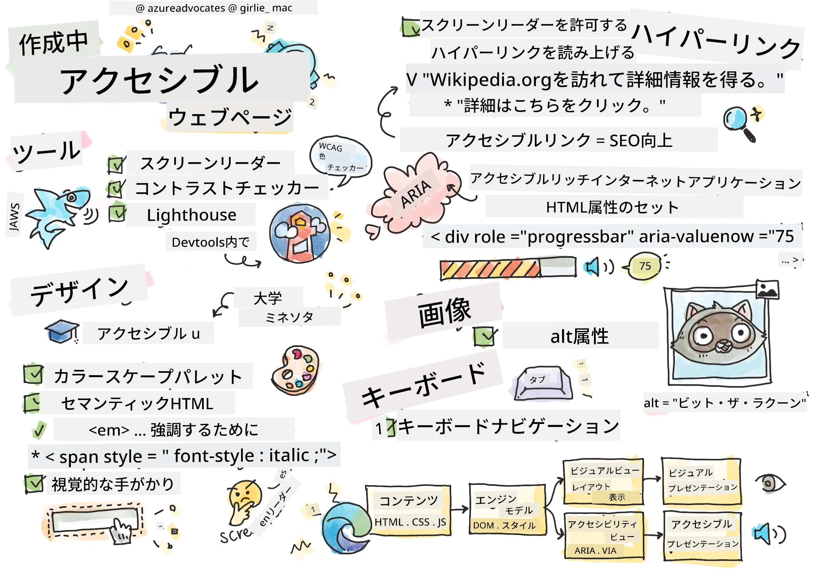
> スケッチノート: [Tomomi Imura](https://twitter.com/girlie_mac)

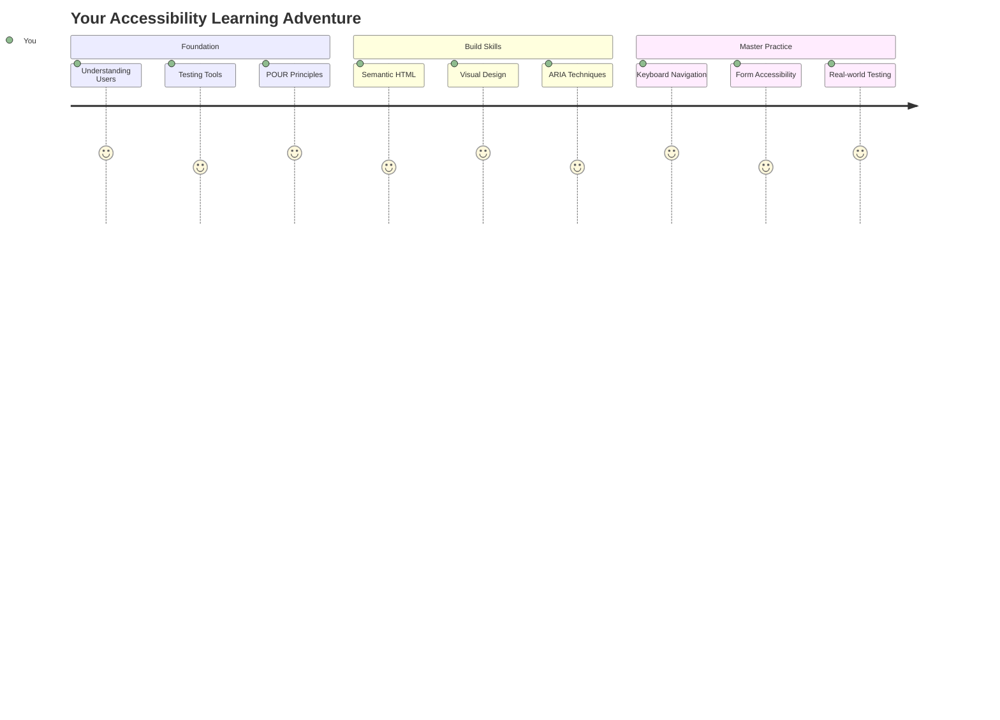

## 講義前のクイズ
[講義前のクイズ](https://ff-quizzes.netlify.app/web/)

> ウェブの力はその普遍性にあります。障害の有無にかかわらず、誰もがアクセスできることが重要です。
>
> \- Sir Timothy Berners-Lee, W3Cディレクター、ワールドワイドウェブの発明者

驚くかもしれませんが、アクセシブルなウェブサイトを作ることで、障害を持つ人々を助けるだけでなく、実はウェブ全体をより良くすることができます！

街角のスロープに気づいたことがありますか？もともとは車椅子のために設計されたものですが、今ではベビーカーを使う人や荷物を運ぶ配達員、旅行者、そして自転車利用者にも役立っています。アクセシブルなウェブデザインも同じような仕組みです。一つのグループを助けるための解決策が、結果的に全員に利益をもたらすことがよくあります。すごいですよね？

このレッスンでは、どのようにしてすべての人にとって使いやすいウェブサイトを作るかを探ります。ウェブ標準に組み込まれている実用的な技術を学び、テストツールを使って実践し、アクセシビリティがすべてのユーザーにとってウェブサイトをより使いやすくする方法を理解します。

このレッスンが終わる頃には、アクセシビリティを開発ワークフローの自然な一部にする自信がつくでしょう。思慮深いデザインの選択が何十億ものユーザーにウェブを開く方法を探る準備はできましたか？さあ、始めましょう！

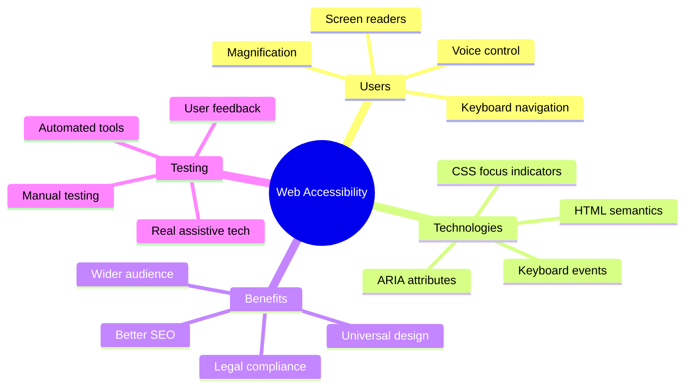

> このレッスンは[Microsoft Learn](https://docs.microsoft.com/learn/modules/web-development-101/accessibility/?WT.mc_id=academic-77807-sagibbon)で受講できます！

## 支援技術を理解する

コードを書く前に、さまざまな能力を持つ人々が実際にウェブをどのように体験しているかを理解してみましょう。これは単なる理論ではありません。これらの実際のナビゲーションパターンを理解することで、より良い開発者になることができます！

支援技術は、障害を持つ人々がウェブサイトとやり取りするのを助ける驚くべきツールです。これらの技術がどのように機能するかを理解すると、アクセシブルなウェブ体験を作ることがずっと直感的になります。まるで他の人の目を通してコードを見ることを学ぶようなものです。

### スクリーンリーダー

[スクリーンリーダー](https://en.wikipedia.org/wiki/Screen_reader)は、デジタルテキストを音声や点字出力に変換する高度な技術です。主に視覚障害者が使用しますが、学習障害（例: ディスレクシア）のあるユーザーにも非常に役立ちます。

スクリーンリーダーは、賢いナレーターが本を読んでくれるようなものだと考えています。論理的な順序で内容を音読し、「ボタン」や「リンク」といったインタラクティブな要素を知らせ、ページ内を移動するためのキーボードショートカットを提供します。しかし、スクリーンリーダーがその魔法を発揮するためには、適切な構造と意味のあるコンテンツでウェブサイトを構築する必要があります。それが開発者であるあなたの役割です！

**プラットフォーム別の人気スクリーンリーダー:**
- **Windows**: [NVDA](https://www.nvaccess.org/about-nvda/)（無料で最も人気）、[JAWS](https://webaim.org/articles/jaws/)、[Narrator](https://support.microsoft.com/windows/complete-guide-to-narrator-e4397a0d-ef4f-b386-d8ae-c172f109bdb1/?WT.mc_id=academic-77807-sagibbon)（内蔵）
- **macOS/iOS**: [VoiceOver](https://support.apple.com/guide/voiceover/welcome/10)（内蔵で非常に優れた機能）
- **Android**: [TalkBack](https://support.google.com/accessibility/android/answer/6283677)（内蔵）
- **Linux**: [Orca](https://wiki.gnome.org/Projects/Orca)（無料でオープンソース）

**スクリーンリーダーがウェブコンテンツをナビゲートする方法:**

スクリーンリーダーは、経験豊富なユーザーが効率的にブラウジングできる複数のナビゲーション方法を提供します:
- **順次読み取り**: 本を読むように上から下へ内容を読み取る
- **ランドマークナビゲーション**: ページセクション間を移動（ヘッダー、ナビゲーション、メイン、フッター）
- **見出しナビゲーション**: 見出し間をスキップしてページ構造を理解
- **リンクリスト**: すべてのリンクをリスト化して迅速にアクセス
- **フォームコントロール**: 入力フィールドやボタン間を直接移動

> 💡 **驚きの事実**: スクリーンリーダー利用者の68%が主に見出しでナビゲートしています（[WebAIM調査](https://webaim.org/projects/screenreadersurvey9/#finding)）。つまり、見出し構造はユーザーにとって地図のようなものです。正しく設定することで、コンテンツをより早く見つけられるように助けることができます！

### テストワークフローの構築

良いニュースです—効果的なアクセシビリティテストは圧倒される必要はありません！自動化ツール（明らかな問題を見つけるのに優れています）といくつかの手動テストを組み合わせると良いでしょう。以下は、1日を費やすことなく最も多くの問題を見つける体系的なアプローチです:

**基本的な手動テストワークフロー:**

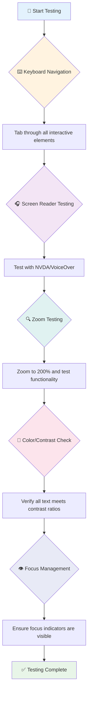

**ステップバイステップのテストチェックリスト:**
1. **キーボードナビゲーション**: Tab、Shift+Tab、Enter、Space、矢印キーのみを使用
2. **スクリーンリーダーテスト**: NVDA、VoiceOver、またはNarratorを有効にして目を閉じてナビゲート
3. **ズームテスト**: 200%および400%のズームレベルでテスト
4. **色のコントラスト確認**: すべてのテキストとUIコンポーネントをチェック
5. **フォーカスインジケーターテスト**: すべてのインタラクティブ要素に視覚的なフォーカス状態があることを確認

✅ **Lighthouseから始める**: ブラウザのDevToolsを開き、Lighthouseアクセシビリティ監査を実行し、結果を手動テストの重点領域のガイドとして使用します。

### ズームと拡大ツール

スマホでテキストが小さすぎるときにピンチしてズームしたり、明るい日光の下でノートパソコンの画面を見ようとしたりしたことがありますか？多くのユーザーは、毎日コンテンツを読みやすくするために拡大ツールを利用しています。これには、低視力の人、高齢者、そして屋外でウェブサイトを読もうとしたことがあるすべての人が含まれます。

現代のズーム技術は、単にものを大きくするだけではありません。これらのツールがどのように機能するかを理解することで、どの拡大レベルでも機能的で魅力的なレスポンシブデザインを作成することができます。

**現代のブラウザズーム機能:**
- **ページズーム**: すべてのコンテンツを比例的に拡大（テキスト、画像、レイアウト）—これが推奨される方法
- **テキストのみズーム**: 元のレイアウトを維持しながらフォントサイズを拡大
- **ピンチズーム**: 一時的な拡大のためのモバイルジェスチャーサポート
- **ブラウザサポート**: すべての現代ブラウザは機能を損なうことなく500%までのズームをサポート

**専門的な拡大ソフトウェア:**
- **Windows**: [Magnifier](https://support.microsoft.com/windows/use-magnifier-to-make-things-on-the-screen-easier-to-see-414948ba-8b1c-d3bd-8615-0e5e32204198)（内蔵）、[ZoomText](https://www.freedomscientific.com/training/zoomtext/getting-started/)
- **macOS/iOS**: [Zoom](https://www.apple.com/accessibility/mac/vision/)（内蔵で高度な機能）

> ⚠️ **デザインの考慮事項**: WCAGは、コンテンツが200%にズームされても機能的であることを要求しています。このレベルでは、水平スクロールは最小限で、すべてのインタラクティブ要素がアクセス可能である必要があります。

✅ **レスポンシブデザインをテストする**: ブラウザを200%および400%にズームします。レイアウトはうまく適応していますか？過剰なスクロールなしですべての機能にアクセスできますか？

## 現代のアクセシビリティテストツール

支援技術を使ったウェブのナビゲーション方法を理解したところで、アクセシブルなウェブサイトを構築しテストするためのツールを探ってみましょう。

こう考えてみてください: 自動化ツールは明らかな問題（例: altテキストの欠如）を見つけるのに優れていますが、手動テストは実際の使用感を確認するのに役立ちます。これらを組み合わせることで、すべての人にとって機能するウェブサイトを作る自信が得られます。

### 色のコントラストテスト

良いニュースです: 色のコントラストは最も一般的なアクセシビリティ問題の一つですが、修正が最も簡単です。良いコントラストは、視覚障害者からビーチでスマホを読もうとする人まで、すべての人に利益をもたらします。

**WCAGのコントラスト要件:**

| テキストタイプ | WCAG AA（最低限） | WCAG AAA（強化） |
|----------------|-------------------|------------------|
| **通常のテキスト**（18pt未満） | 4.5:1のコントラスト比 | 7:1のコントラスト比 |
| **大きなテキスト**（18pt以上または14pt以上の太字） | 3:1のコントラスト比 | 4.5:1のコントラスト比 |
| **UIコンポーネント**（ボタン、フォームの境界線） | 3:1のコントラスト比 | 3:1のコントラスト比 |

**必須テストツール:**
- [Colour Contrast Analyser](https://www.tpgi.com/color-contrast-checker/) - カラーピッカー付きデスクトップアプリ
- [WebAIM Contrast Checker](https://webaim.org/resources/contrastchecker/) - 即時フィードバック付きウェブベース
- [Stark](https://www.getstark.co/) - Figma、Sketch、Adobe XD用デザインツールプラグイン
- [Accessible Colors](https://accessible-colors.com/) - アクセシブルなカラーパレットを見つける

✅ **より良いカラーパレットを作成する**: ブランドカラーから始め、コントラストチェッカーを使用してアクセシブルなバリエーションを作成します。これらをデザインシステムのアクセシブルカラートークンとして文書化します。

### 包括的なアクセシビリティ監査

最も効果的なアクセシビリティテストは、複数のアプローチを組み合わせたものです。単一のツールではすべてをキャッチできないため、さまざまな方法でテストルーチンを構築することで、徹底的なカバーを確保します。

**ブラウザベースのテスト（DevToolsに内蔵）:**
- **Chrome/Edge**: Lighthouseアクセシビリティ監査 + アクセシビリティパネル
- **Firefox**: 詳細なツリービュー付きアクセシビリティインスペクター
- **Safari**: Web Inspectorの監査タブでVoiceOverシミュレーション

**プロフェッショナルなテスト拡張機能:**
- [axe DevTools](https://www.deque.com/axe/devtools/) - 業界標準の自動テスト
- [WAVE](https://wave.webaim.org/extension/) - エラーを強調表示する視覚的フィードバック
- [Accessibility Insights](https://accessibilityinsights.io/) - Microsoftの包括的なテストスイート

**コマンドラインとCI/CD統合:**
- [axe-core](https://github.com/dequelabs/axe-core) - 自動テスト用JavaScriptライブラリ
- [Pa11y](https://pa11y.org/) - コマンドラインアクセシビリティテストツール
- [Lighthouse CI](https://github.com/GoogleChrome/lighthouse-ci) - 自動アクセシビリティスコアリング

> 🎯 **テスト目標**: Lighthouseアクセシビリティスコア95以上を基準とします。自動化ツールはアクセシビリティ問題の約30-40%しかキャッチしないため、手動テストは依然として重要です！

### 🧠 **テストスキルチェック: 問題を見つける準備はできていますか？**

**アクセシビリティテストについての感想を聞かせてください:**
- 今のところ最も取り組みやすいテスト方法はどれですか？
- キーボードのみのナビゲーションを1日中使うことを想像できますか？
- オンラインで個人的に経験したアクセシビリティの障壁は何ですか？

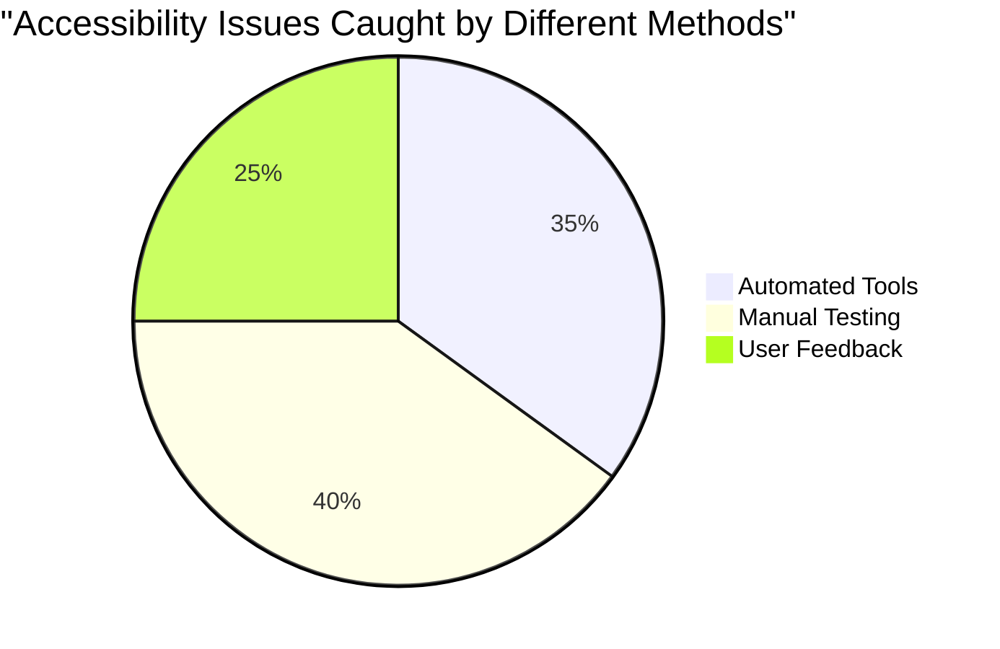

> **自信を持とう**: プロのアクセシビリティテスターはまさにこの方法を使用しています。あなたは業界標準の実践を学んでいます！

## 最初からアクセシビリティを構築する

アクセシビリティの成功の鍵は、最初から基盤に組み込むことです。「後でアクセシビリティを追加しよう」と考えるのは魅力的ですが、それは家を建てた後にスロープを追加しようとするようなものです。可能ですか？はい。簡単ですか？あまり簡単ではありません。

アクセシビリティを家の設計のように考えてみてください—最初の建築計画に車椅子のアクセシビリティを含める方が、後で全てを改修するよりもはるかに簡単です。

### POURの原則: アクセシビリティの基盤

ウェブコンテンツアクセシビリティガイドライン（WCAG）は、POURという4つの基本原則に基づいています。心配しないでください—これらは堅苦しい学術的な概念ではありません！実際には、すべての人に機能するコンテンツを作るための実用的なガイドラインです。

POURを理解すると、アクセシビリティの決定がはるかに直感的になります。それはデザインの選択を導くメンタルチェックリストのようなものです。詳しく見てみましょう:

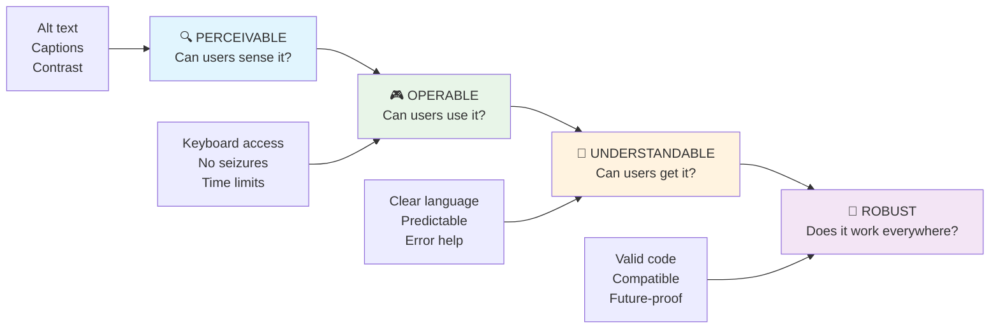

**🔍 知覚可能**: 情報は利用可能な感覚を通じてユーザーが知覚できる方法で提示される必要があります

- 非テキストコンテンツ（画像、動画、音声）にテキスト代替を提供する
- すべてのテキストとUIコンポーネントに十分な色のコントラストを確保する
-
- **異なるブラウザ、デバイス、支援ツールでテストする**
- **高度な機能がサポートされていない場合でもコンテンツが適切に表示されるように構造化する**

### 🎯 **POUR原則チェック: 基礎を固める**

**基礎についての簡単な振り返り:**
- 各POUR原則に失敗するウェブサイトの機能を思い浮かべられますか？
- 開発者として、どの原則が最も自然に感じられますか？
- これらの原則は、障害のあるユーザーだけでなく、すべての人のデザインをどのように改善するでしょうか？

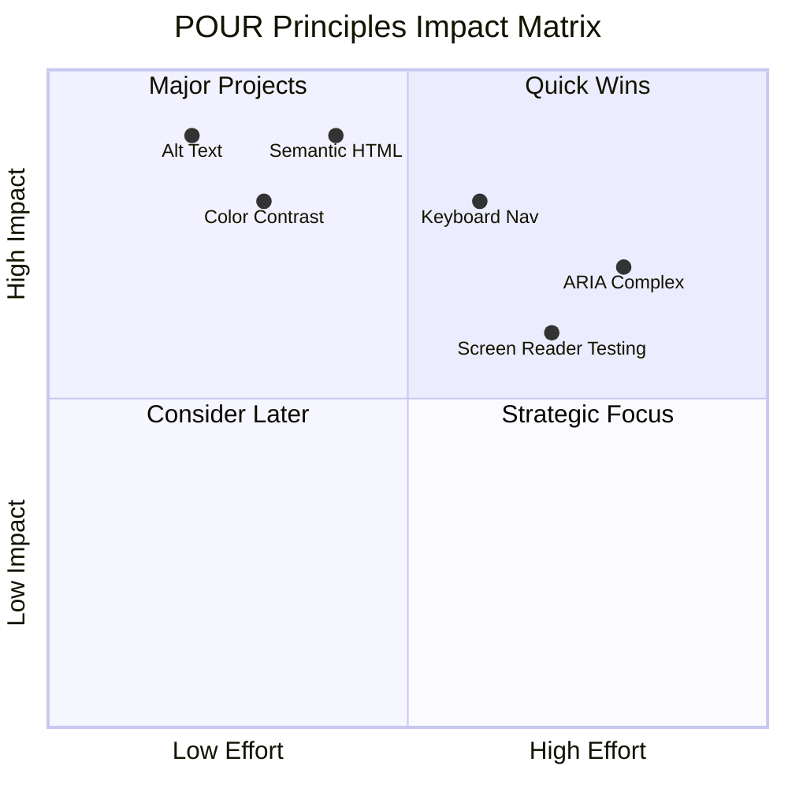

> **覚えておいてください**: 高い効果で低い労力の改善から始めましょう。セマンティックHTMLとaltテキストは、最小限の労力で最大のアクセシビリティ向上をもたらします！

## アクセシブルなビジュアルデザインの作成

良いビジュアルデザインとアクセシビリティは密接に関連しています。アクセシビリティを考慮してデザインすることで、これらの制約がよりクリーンでエレガントなソリューションを生み出し、すべてのユーザーに利益をもたらすことがよくあります。

視覚能力やコンテンツを閲覧する条件に関係なく、すべての人に対応する魅力的なデザインを作成する方法を探ってみましょう。

### 色と視覚アクセシビリティ戦略

色はコミュニケーションにおいて強力ですが、重要な情報を伝える唯一の方法にしてはいけません。色を超えたデザインは、より堅牢で包括的な体験を生み出し、さまざまな状況で機能します。

**色覚の違いを考慮したデザイン:**

男性の約8%、女性の0.5%が何らかの色覚の違い（一般に「色覚異常」と呼ばれる）を持っています。最も一般的なタイプは以下の通りです:
- **デューター異常**: 赤と緑の区別が困難
- **プロト異常**: 赤が暗く見える
- **トリタン異常**: 青と黄色の区別が困難（稀）

**包括的な色戦略:**

```css
/* ❌ Bad: Using only color to indicate status */
.error { color: red; }
.success { color: green; }

/* ✅ Good: Color plus icons and context */
.error {
  color: #d32f2f;
  border-left: 4px solid #d32f2f;
}
.error::before {
  content: "⚠️";
  margin-right: 8px;
}

.success {
  color: #2e7d32;
  border-left: 4px solid #2e7d32;
}
.success::before {
  content: "✅";
  margin-right: 8px;
}
```

**基本的なコントラスト要件を超えて:**
- 色覚異常シミュレーターで色の選択をテストする
- 色分けとともにパターン、テクスチャ、または形状を使用する
- インタラクティブな状態が色なしでも区別可能であることを確認する
- 高コントラストモードでデザインがどのように見えるかを考慮する

✅ **色のアクセシビリティをテストする**: [Coblis](https://www.color-blindness.com/coblis-color-blindness-simulator/)のようなツールを使用して、異なる色覚のユーザーにとってサイトがどのように見えるかを確認してください。

### フォーカスインジケーターとインタラクションデザイン

フォーカスインジケーターはデジタル版のカーソルのようなもので、キーボードユーザーがページ上でどこにいるかを示します。よく設計されたフォーカスインジケーターは、インタラクションを明確で予測可能にすることで、すべての人の体験を向上させます。

**最新のフォーカスインジケーターのベストプラクティス:**

```css
/* Enhanced focus styles that work across browsers */
button:focus-visible {
  outline: 2px solid #0066cc;
  outline-offset: 2px;
  box-shadow: 0 0 0 4px rgba(0, 102, 204, 0.25);
}

/* Remove focus outline for mouse users, preserve for keyboard users */
button:focus:not(:focus-visible) {
  outline: none;
}

/* Focus-within for complex components */
.card:focus-within {
  box-shadow: 0 0 0 3px rgba(74, 144, 164, 0.5);
  border-color: #4A90A4;
}

/* Ensure focus indicators meet contrast requirements */
.custom-focus:focus-visible {
  outline: 3px solid #ffffff;
  outline-offset: 2px;
  box-shadow: 0 0 0 6px #000000;
}
```

**フォーカスインジケーターの要件:**
- **視認性**: 周囲の要素とのコントラスト比が少なくとも3:1であること
- **幅**: 要素全体を囲む最小2pxの厚さ
- **持続性**: フォーカスが他の場所に移動するまで表示され続けること
- **区別性**: 他のUI状態と視覚的に異なること

> 💡 **デザインのヒント**: 優れたフォーカスインジケーターは、アウトライン、ボックスシャドウ、色の変更を組み合わせて、異なる背景やコンテキストでの視認性を確保します。

✅ **フォーカスインジケーターを監査する**: ウェブサイトをタブで移動し、どの要素が明確なフォーカスインジケーターを持っているかを確認してください。見づらいものや完全に欠けているものはありませんか？

### セマンティックHTML: アクセシビリティの基盤

セマンティックHTMLは、支援技術にウェブサイトのGPSシステムを提供するようなものです。HTML要素をその目的に合った形で使用することで、スクリーンリーダー、キーボード、その他のツールがユーザーの効果的なナビゲーションを支援する詳細なロードマップを提供します。

私にとってしっくりきた例えはこれです: セマンティックHTMLは、明確なカテゴリと役立つ案内がある整理された図書館と、本がランダムに散らばっている倉庫の違いです。どちらも同じ本を持っていますが、どちらで探したいと思いますか？そうですよね！

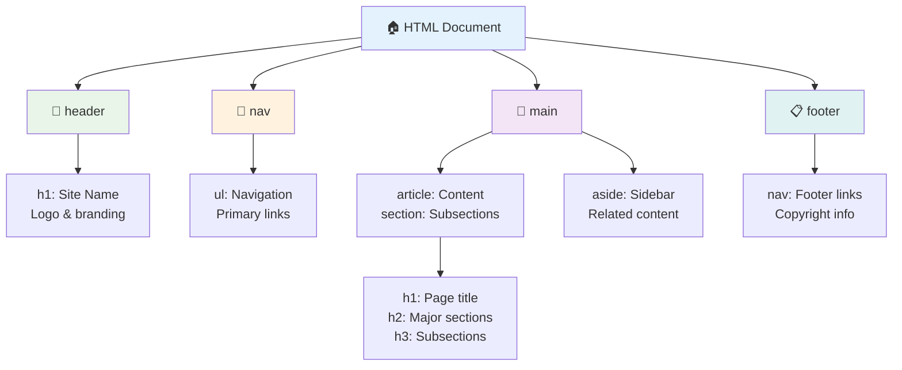

**アクセシブルなページ構造の構築ブロック:**

```html
<!-- Landmark elements provide page navigation structure -->
<header>
  <h1>Your Site Name</h1>
  <nav aria-label="Main navigation">
    <ul>
      <li><a href="/home">Home</a></li>
      <li><a href="/about">About</a></li>
      <li><a href="/services">Services</a></li>
    </ul>
  </nav>
</header>

<main>
  <article>
    <header>
      <h1>Article Title</h1>
      <p>Published on <time datetime="2024-10-14">October 14, 2024</time></p>
    </header>
    
    <section>
      <h2>First Section</h2>
      <p>Content that relates to this section...</p>
    </section>
    
    <section>
      <h2>Second Section</h2>
      <p>More related content...</p>
    </section>
  </article>
  
  <aside>
    <h2>Related Links</h2>
    <nav aria-label="Related articles">
      <ul>
        <li><a href="/related-1">First related article</a></li>
        <li><a href="/related-2">Second related article</a></li>
      </ul>
    </nav>
  </aside>
</main>

<footer>
  <p>&copy; 2024 Your Site Name. All rights reserved.</p>
  <nav aria-label="Footer links">
    <ul>
      <li><a href="/privacy">Privacy Policy</a></li>
      <li><a href="/contact">Contact Us</a></li>
    </ul>
  </nav>
</footer>
```

**セマンティックHTMLがアクセシビリティを変える理由:**

| セマンティック要素 | 目的 | スクリーンリーダーの利点 |
|------------------|---------|----------------------|
| `<header>` | ページまたはセクションのヘッダー | 「バナーランドマーク」 - トップへの迅速なナビゲーション |
| `<nav>` | ナビゲーションリンク | 「ナビゲーションランドマーク」 - ナビセクションのリスト |
| `<main>` | 主なページコンテンツ | 「メインランドマーク」 - コンテンツに直接移動 |
| `<article>` | 自己完結型コンテンツ | 記事の境界を通知 |
| `<section>` | テーマ別コンテンツグループ | コンテンツ構造を提供 |
| `<aside>` | 関連するサイドバーコンテンツ | 「補足ランドマーク」 |
| `<footer>` | ページまたはセクションのフッター | 「コンテンツ情報ランドマーク」 |

**セマンティックHTMLによるスクリーンリーダーのスーパーパワー:**
- **ランドマークナビゲーション**: 主要なページセクション間を瞬時に移動
- **見出しアウトライン**: 見出し構造から目次を生成
- **要素リスト**: すべてのリンク、ボタン、またはフォームコントロールのリストを作成
- **コンテキスト認識**: コンテンツセクション間の関係を理解

> 🎯 **簡単なテスト**: NVDA/JAWSでランドマークショートカット（Dキー）、見出し（Hキー）、リンク（Kキー）を使用してサイトをナビゲートしてみてください。ナビゲーションは意味を成していますか？

### 🏗️ **セマンティックHTMLマスタリーチェック: 強固な基盤を構築する**

**セマンティック理解を評価してみましょう:**
- HTMLを見るだけでウェブページのランドマークを特定できますか？
- `<section>`と`<div>`の違いを友人にどう説明しますか？
- スクリーンリーダーユーザーがナビゲーションの問題を報告した場合、最初に何を確認しますか？

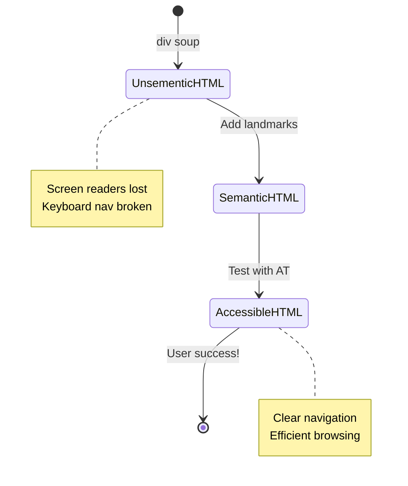

> **プロの洞察**: 良いセマンティックHTMLはアクセシビリティの問題の約70%を自動的に解決します。この基盤をマスターすれば、アクセシビリティの道を大きく進むことができます！

✅ **セマンティック構造を監査する**: ブラウザのDevToolsのアクセシビリティパネルを使用してアクセシビリティツリーを表示し、マークアップが論理的な構造を作成していることを確認してください。

### 見出しの階層: 論理的なコンテンツアウトラインの作成

見出しはアクセシブルなコンテンツにとって非常に重要です。それはすべてを支える背骨のようなものです。スクリーンリーダーユーザーは見出しを頼りにコンテンツを理解し、ナビゲートします。それはページの目次を提供するようなものだと考えてください。

**見出しの黄金ルール:**
レベルを飛ばさないでください。常に`<h1>`から`<h2>`、`<h3>`と論理的に進行してください。学校でアウトラインを作ったことを覚えていますか？まさに同じ原則です。「I. メインポイント」からいきなり「C. サブサブポイント」に進むことはありませんよね。その間に「A. サブポイント」が必要です。

**完璧な見出し構造の例:**

```html
<!-- ✅ Excellent: Logical, hierarchical progression -->
<main>
  <h1>Complete Guide to Web Accessibility</h1>
  
  <section>
    <h2>Understanding Screen Readers</h2>
    <p>Introduction to screen reader technology...</p>
    
    <h3>Popular Screen Reader Software</h3>
    <p>NVDA, JAWS, and VoiceOver comparison...</p>
    
    <h3>Testing with Screen Readers</h3>
    <p>Step-by-step testing instructions...</p>
  </section>
  
  <section>
    <h2>Color and Contrast Guidelines</h2>
    <p>Designing with sufficient contrast...</p>
    
    <h3>WCAG Contrast Requirements</h3>
    <p>Understanding the different contrast levels...</p>
    
    <h3>Testing Tools and Techniques</h3>
    <p>Tools for verifying contrast ratios...</p>
  </section>
</main>
```

```html
<!-- ❌ Problematic: Skipping levels, inconsistent structure -->
<h1>Page Title</h1>
<h3>Subsection</h3> <!-- Skipped h2 -->
<h2>This should come before h3</h2>
<h1>Another main heading?</h1> <!-- Multiple h1s -->
```

**見出しのベストプラクティス:**
- **ページごとに1つの`<h1>`**: 通常はメインページタイトルまたは主要なコンテンツ見出し
- **論理的な進行**: レベルを飛ばさない（h1 → h2 → h3、h1 → h3ではない）
- **説明的なコンテンツ**: コンテキスト外で読まれても意味のある見出しを作成
- **CSSでの視覚的スタイリング**: 外観はCSSで、構造はHTMLレベルで

**スクリーンリーダーナビゲーション統計:**
- スクリーンリーダーユーザーの68%が見出しでナビゲートする（[WebAIM調査](https://webaim.org/projects/screenreadersurvey9/#finding)）
- ユーザーは論理的な見出しアウトラインを期待している
- 見出しはページ構造を理解する最速の方法を提供する

> 💡 **プロのヒント**: "HeadingsMap"のようなブラウザ拡張機能を使用して見出し構造を視覚化してください。それはよく整理された目次のように読めるはずです。

✅ **見出し構造をテストする**: スクリーンリーダーの見出しナビゲーション（NVDAのHキー）を使用して見出しを移動してみてください。進行はコンテンツのストーリーを論理的に伝えていますか？

### 高度な視覚アクセシビリティ技術

コントラストや色の基本を超えて、真に包括的な視覚体験を作成するための洗練された技術があります。これらの方法は、さまざまな閲覧条件や支援技術に対応するコンテンツを保証します。

**重要な視覚コミュニケーション戦略:**

- **マルチモーダルフィードバック**: 視覚、テキスト、場合によっては音声の手がかりを組み合わせる
- **段階的な情報開示**: 情報を消化しやすいチャンクで提示する
- **一貫したインタラクションパターン**: 慣れ親しんだUIの慣例を使用する
- **レスポンシブタイポグラフィ**: デバイスに応じてテキストを適切にスケールする
- **読み込みとエラーステート**: すべてのユーザーアクションに対して明確なフィードバックを提供する

**アクセシビリティを向上させるCSSユーティリティ:**

```css
/* Screen reader only text - visually hidden but accessible */
.sr-only {
  position: absolute;
  width: 1px;
  height: 1px;
  padding: 0;
  margin: -1px;
  overflow: hidden;
  clip: rect(0, 0, 0, 0);
  white-space: nowrap;
  border: 0;
}

/* Skip link for keyboard navigation */
.skip-link {
  position: absolute;
  top: -40px;
  left: 6px;
  background: #000000;
  color: #ffffff;
  padding: 8px 16px;
  text-decoration: none;
  border-radius: 4px;
  font-weight: bold;
  transition: top 0.3s ease;
  z-index: 1000;
}

.skip-link:focus {
  top: 6px;
}

/* Reduced motion respect */
@media (prefers-reduced-motion: reduce) {
  .skip-link {
    transition: none;
  }
  
  * {
    animation-duration: 0.01ms !important;
    animation-iteration-count: 1 !important;
    transition-duration: 0.01ms !important;
  }
}

/* High contrast mode support */
@media (prefers-contrast: high) {
  .button {
    border: 2px solid;
  }
}
```

> 🎯 **アクセシビリティパターン**: "スキップリンク"はキーボードユーザーにとって不可欠です。それはページの最初のフォーカス可能な要素であり、メインコンテンツエリアに直接ジャンプするべきです。

✅ **スキップナビゲーションを実装する**: ページにスキップリンクを追加し、ページが読み込まれるとすぐにTabキーを押してテストしてください。それらが表示され、メインコンテンツにジャンプできることを確認してください。

## 意味のあるリンクテキストの作成

リンクはウェブの高速道路のようなものですが、リンクテキストが不適切だと「場所」とだけ書かれた道路標識のようなものになります。「シカゴ中心部」と書かれている方がずっと役立ちますよね？

これを初めて知ったときに驚いたことがあります: スクリーンリーダーはページ内のすべてのリンクを抽出して1つの大きなリストとして表示できます。ページ内のすべてのリンクのディレクトリを渡されたと想像してください。それぞれが単独で意味を成しますか？これがリンクテキストが通過すべきテストです！

### リンクナビゲーションパターンの理解

スクリーンリーダーは、適切に書かれたリンクテキストに依存する強力なリンクナビゲーション機能を提供します:

**リンクナビゲーション方法:**
- **順次読み取り**: リンクはコンテンツフローの一部としてコンテキスト内で読み取られる
- **リンクリスト生成**: ページ内のすべてのリンクを検索可能なディレクトリとしてコンパイル
- **クイックナビゲーション**: キーボードショートカット（NVDAのKキー）を使用してリンク間を移動
- **検索機能**: 部分的なテキストを入力して特定のリンクを検索

**コンテキストが重要な理由:**
スクリーンリーダーユーザーがリンクリストを生成すると、次のようなものが表示されます:
- 「レポートをダウンロード」
- 「詳細を見る」
- 「ここをクリック」
- 「プライバシーポリシー」
- 「ここをクリック」

このうち、コンテキスト外で読まれたときに役立つリンクは2つだけです！

> 📊 **ユーザーへの影響**: スクリーンリーダーユーザーはリンクリストをスキャンしてページコンテンツを迅速に理解します。一般的なリンクテキストは、各リンクのコンテキストに戻る必要があり、ブラウジング体験を大幅に遅くします。

### 避けるべきリンクテキストの一般的なミス

何が機能しないかを理解することで、既存のコンテンツのアクセシビリティ問題を認識して修正するのに役立ちます。

**❌ コンテキストを提供しない一般的なリンクテキスト:**

```html
<!-- Meaningless when read from a link list -->
<p>Our sustainability efforts are detailed in our recent report. 
   <a href="/sustainability-2024.pdf">Click here</a> to view it.</p>

<!-- Repeated generic text throughout the page -->
<div class="article-card">
  <h3>Web Accessibility Guide</h3>
  <p>Learn the fundamentals...</p>
  <a href="/accessibility-guide">Read more</a>
</div>
<div class="article-card">
  <h3>Color Contrast Tips</h3>
  <p>Improve your design...</p>
  <a href="/color-contrast">Read more</a>
</div>

<!-- URLs as link text (difficult for screen readers to announce) -->
<p>Visit https://www.w3.org/WAI/WCAG21/quickref/ for WCAG guidelines.</p>

<!-- Vague action words -->
<a href="/contact">Go</a> | <a href="/about">See</a> | <a href="/help">View</a>
```

**これらのパターンが失敗する理由:**
- **「ここをクリック」**はリンク先について何も伝えません
- **「詳細を見る」**が複数回繰り返されると混乱を招きます
- **生のURL**はスクリーンリーダーが明確に発音するのが難しい
- **「行く」や「見る」のような単語**は説明的なコンテキストが欠けています

### 優れたリンクテキストを書く

説明的なリンクテキストはすべての人に利益をもたらします。視覚的なユーザーはリンクを迅速にスキャンでき、スクリーンリーダーユーザーはリンク先を即座に理解します。

**✅ 明確で説明的なリンクテキストの例:**

```html
<!-- Descriptive text that explains the destination -->
<p>Our comprehensive <a href="/sustainability-2024.pdf">2024 sustainability report (PDF, 2.1MB)</a> details our environmental initiatives.</p>

<!-- Specific, unique link text for each card -->
<div class="article-card">
  <h3>Web Accessibility Guide</h3>
  <p>Learn the fundamentals of inclusive design...</p>
  <a href="/accessibility-guide">Read our complete web accessibility guide</a>
</div>
<div class="article-card">
  <h3>Color Contrast Tips</h3>
  <p>Improve your design with better color choices...</p>
  <a href="/color-contrast">Explore color contrast best practices</a>
</div>

<!-- Meaningful text instead of raw URLs -->
<p>The <a href="https://www.w3.org/WAI/WCAG21/quickref/">WCAG 2.1 Quick Reference guide</a> provides comprehensive accessibility guidelines.</p>

<!-- Descriptive action links -->
<a href="/contact">Contact our support team</a> | 
<a href="/about">About our company</a> | 
<a href="/help">Get help with your account</a>
```

**リンクテキストのベストプラクティス:**
- **具体的にする**: 「四半期の財務報告書をダウンロード」 vs. 「ダウンロード」
- **ファイルタイプとサイズを含める**: ダウンロード可能なファイルには「(PDF, 1.2MB)」を記載
- **外部リンクの場合は明記する**: 「(新しいウィンドウで開く)」など適切に記載
- **アクティブな言語を使用する**: 「お問い合わせ」 vs. 「お問い合わせページ」
- **簡潔にする**: 可能であれば2〜8語を目指す

### 高度なリンクアクセシビリティパターン

時には視覚デザインの制約や技術的要件が特別な解決策を必要とします。以下は一般的な課題シナリオに対する洗練された技
**ARIAの5つのカテゴリー:**

1. **役割**: この要素は何ですか？ (`button`, `tab`, `dialog`)
2. **プロパティ**: どのような特徴がありますか？ (`aria-required`, `aria-haspopup`)
3. **状態**: 現在の状態はどうなっていますか？ (`aria-expanded`, `aria-checked`)
4. **ランドマーク**: ページ構造のどこにありますか？ (`banner`, `navigation`, `main`)
5. **ライブリージョン**: 変更をどのように通知しますか？ (`aria-live`, `aria-atomic`)

### モダンウェブアプリのための重要なARIAパターン

これらのパターンは、インタラクティブなウェブアプリケーションにおける一般的なアクセシビリティの課題を解決します。

**要素の名前付けと説明:**

```html
<!-- aria-label: Provides accessible name when visible text isn't sufficient -->
<button aria-label="Close newsletter subscription dialog">×</button>

<!-- aria-labelledby: References existing text as the accessible name -->
<section aria-labelledby="news-heading">
  <h2 id="news-heading">Latest News</h2>
  <!-- news content -->
</section>

<!-- aria-describedby: Links to additional descriptive text -->
<input type="password" 
       aria-describedby="pwd-requirements pwd-strength"
       required>
<div id="pwd-requirements">
  Password must contain at least 8 characters, including uppercase, lowercase, and numbers.
</div>
<div id="pwd-strength" aria-live="polite">
  <!-- Dynamic password strength indicator -->
</div>
```

**動的コンテンツのためのライブリージョン:**

```html
<!-- Polite announcements (don't interrupt current speech) -->
<div aria-live="polite" id="status-updates">
  <!-- Status messages appear here -->
</div>

<!-- Assertive announcements (interrupt and announce immediately) -->
<div aria-live="assertive" id="urgent-alerts">
  <!-- Error messages and critical alerts -->
</div>

<!-- Loading states with live regions -->
<button id="submit-btn" aria-describedby="loading-status">
  Submit Application
</button>
<div id="loading-status" aria-live="polite" aria-atomic="true">
  <!-- "Processing your application..." appears here -->
</div>
```

**インタラクティブウィジェットの例 (アコーディオン):**

```html
<div class="accordion">
  <h3>
    <button aria-expanded="false" 
            aria-controls="panel-1" 
            id="accordion-trigger-1"
            class="accordion-trigger">
      Accessibility Guidelines
    </button>
  </h3>
  <div id="panel-1" 
       role="region"
       aria-labelledby="accordion-trigger-1" 
       hidden>
    <p>WCAG 2.1 provides comprehensive guidelines...</p>
  </div>
</div>
```

```javascript
// JavaScript to manage accordion state
function toggleAccordion(trigger) {
  const panel = document.getElementById(trigger.getAttribute('aria-controls'));
  const isExpanded = trigger.getAttribute('aria-expanded') === 'true';
  
  // Toggle states
  trigger.setAttribute('aria-expanded', !isExpanded);
  panel.hidden = isExpanded;
  
  // Announce change to screen readers
  const status = document.getElementById('status-updates');
  status.textContent = isExpanded ? 'Section collapsed' : 'Section expanded';
}
```

### ARIA実装のベストプラクティス

ARIAは強力ですが、慎重な実装が必要です。以下のガイドラインに従うことで、ARIAがアクセシビリティを向上させるのではなく、妨げることを防ぎます。

**🛡️ コア原則:**

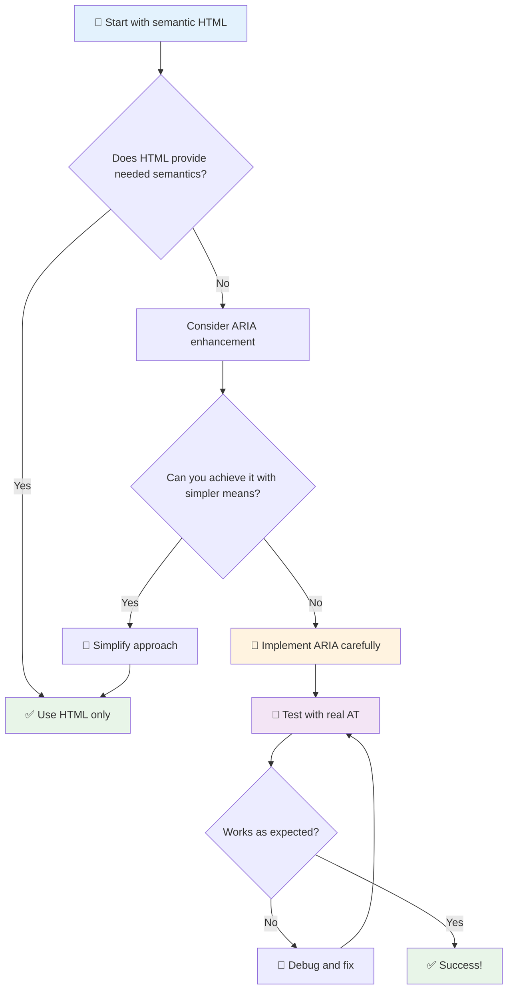

1. **セマンティックHTMLを優先**: `<button>`を常に`<div role="button">`より優先する
2. **セマンティクスを壊さない**: 既存のHTMLの意味を上書きしない (例: `<h1 role="button">`は避ける)
3. **キーボードアクセシビリティを維持**: すべてのインタラクティブなARIA要素は完全にキーボードで操作可能であるべき
4. **実際のユーザーでテストする**: ARIAのサポートは支援技術間で大きく異なる
5. **シンプルに始める**: 複雑なARIA実装はエラーが発生しやすい

**🔍 テストワークフロー:**

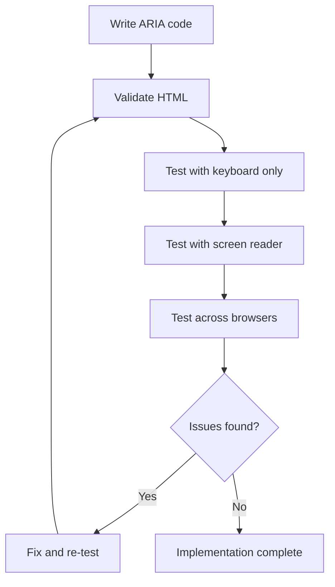

**🚫 避けるべき一般的なARIAのミス:**

- **矛盾した情報**: HTMLセマンティクスと矛盾しないようにする
- **過剰なラベル付け**: ARIA情報が多すぎるとユーザーを混乱させる
- **静的なARIA**: コンテンツ変更時にARIA状態を更新し忘れる
- **未テストの実装**: 理論上は動作するが実際には失敗するARIA
- **キーボードサポートの欠如**: キーボード操作がないARIA役割

> 💡 **テストリソース**: [accessibility-checker](https://www.npmjs.com/package/accessibility-checker)のようなツールを使ってARIAの自動検証を行い、完全な体験のために実際のスクリーンリーダーでテストすることを忘れないでください。

### 🎭 **ARIAスキルチェック: 複雑なインタラクションに対応できますか？**

**ARIAの自信を測る:**
- セマンティックHTMLよりARIAを選ぶのはどんな場合ですか？ (ヒント: ほとんどありません！)
- なぜ`<div role="button">`が通常`<button>`より劣るのか説明できますか？
- ARIAテストで最も重要なことは何ですか？

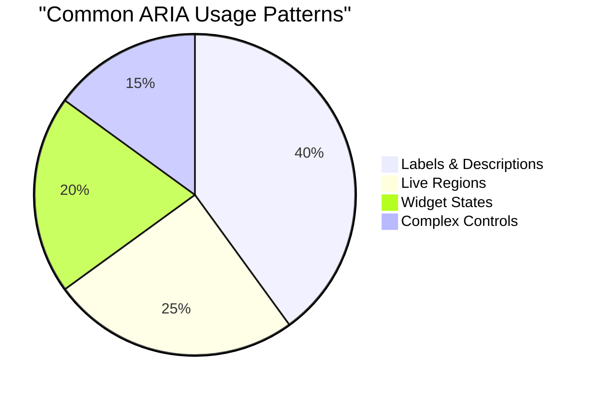

> **重要な洞察**: ARIAの使用のほとんどは要素のラベル付けと説明のためです。複雑なウィジェットパターンは思ったほど一般的ではありません！

✅ **専門家から学ぶ**: [ARIA Authoring Practices Guide](https://w3c.github.io/aria-practices/)を研究して、複雑なインタラクティブウィジェットの実証済みパターンと実装を学びましょう。

## 画像とメディアのアクセシビリティを向上させる

視覚的および音声コンテンツはモダンウェブ体験の重要な部分ですが、慎重に実装しないと障壁を生む可能性があります。目標は、メディアの情報と感情的な影響がすべてのユーザーに届くようにすることです。一度慣れれば、自然にできるようになります。

メディアの種類によってアクセシビリティのアプローチは異なります。料理のように、繊細な魚を扱う方法としっかりしたステーキを扱う方法は異なります。これらの違いを理解することで、状況に応じた適切な解決策を選ぶことができます。

### 戦略的な画像アクセシビリティ

ウェブサイト上のすべての画像には目的があります。その目的を理解することで、より良い代替テキストを書き、より包括的な体験を作ることができます。

**画像の4つのタイプとそのaltテキスト戦略:**

**情報を伝える画像** - 重要な情報を伝える:
```html

```

**装飾的な画像** - 純粋に視覚的で情報価値がない:
```html

```

**機能的な画像** - ボタンやコントロールとして機能する:
```html
<button>
  
</button>
```

**複雑な画像** - チャート、図、インフォグラフィック:
```html

<div id="chart-description">
  <p>Detailed description: Sales data shows a steady increase across all quarters...</p>
</div>
```

### 動画と音声のアクセシビリティ

**動画の要件:**
- **キャプション**: 話される内容や効果音のテキスト版
- **音声解説**: 視覚要素のナレーション (視覚障害者向け)
- **トランスクリプト**: 音声と視覚コンテンツの完全なテキスト版

```html
<video controls>
  <source src="video.mp4" type="video/mp4">
  <track kind="captions" src="captions.vtt" srclang="en" label="English">
  <track kind="descriptions" src="descriptions.vtt" srclang="en" label="Audio descriptions">
</video>
```

**音声の要件:**
- **トランスクリプト**: 話される内容のテキスト版
- **視覚的な指標**: 音声のみのコンテンツには視覚的な手がかりを提供

### モダンな画像技術

**装飾的な画像にCSSを使用する:**
```css
.hero-section {
  background-image: url('decorative-hero.jpg');
  /* Decorative images in CSS don't need alt text */
}
```

**アクセシビリティを考慮したレスポンシブ画像:**
```html
<picture>
  <source media="(min-width: 800px)" srcset="large-chart.png">
  <source media="(min-width: 400px)" srcset="medium-chart.png">
  
</picture>
```

✅ **画像アクセシビリティをテストする**: スクリーンリーダーを使って画像があるページをナビゲートしてみてください。コンテンツを理解するのに十分な情報が得られますか？

## キーボードナビゲーションとフォーカス管理

多くのユーザーはキーボードだけでウェブをナビゲートします。これには運動障害のある人、キーボードの方がマウスより速いと感じるパワーユーザー、そしてマウスが壊れてしまった人が含まれます。ウェブサイトがキーボード入力でうまく動作することを確認することは重要であり、しばしばすべての人にとって効率的なサイトを作ることにつながります。

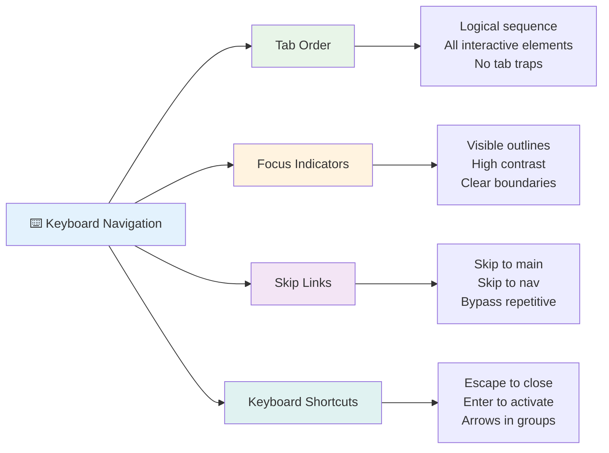

### 必須のキーボードナビゲーションパターン

**標準的なキーボード操作:**
- **Tab**: インタラクティブ要素を順にフォーカス移動
- **Shift + Tab**: フォーカスを逆方向に移動
- **Enter**: ボタンやリンクをアクティブ化
- **Space**: ボタンをアクティブ化、チェックボックスをチェック
- **矢印キー**: コンポーネントグループ内をナビゲート (ラジオボタン、メニュー)
- **Escape**: モーダルやドロップダウンを閉じる、操作をキャンセル

### フォーカス管理のベストプラクティス

**視覚的なフォーカスインジケーター:**
```css
/* Ensure focus is always visible */
button:focus-visible {
  outline: 2px solid #4A90A4;
  outline-offset: 2px;
}

/* Custom focus styles for different components */
.card:focus-within {
  box-shadow: 0 0 0 3px rgba(74, 144, 164, 0.5);
}
```

**効率的なナビゲーションのためのスキップリンク:**
```html
<a href="#main-content" class="skip-link">Skip to main content</a>
<a href="#navigation" class="skip-link">Skip to navigation</a>

<nav id="navigation">
  <!-- navigation content -->
</nav>
<main id="main-content">
  <!-- main content -->
</main>
```

**適切なタブ順序:**
```html
<!-- Use semantic HTML for natural tab order -->
<form>
  <label for="name">Name:</label>
  <input type="text" id="name" tabindex="0">
  
  <label for="email">Email:</label>
  <input type="email" id="email" tabindex="0">
  
  <button type="submit" tabindex="0">Submit</button>
</form>
```

### モーダル内でのフォーカストラップ

モーダルダイアログを開く際、フォーカスはモーダル内に限定されるべきです:

```javascript
// Modern focus trap implementation
function trapFocus(element) {
  const focusableElements = element.querySelectorAll(
    'button, [href], input, select, textarea, [tabindex]:not([tabindex="-1"])'
  );
  
  const firstElement = focusableElements[0];
  const lastElement = focusableElements[focusableElements.length - 1];

  element.addEventListener('keydown', (e) => {
    if (e.key === 'Tab') {
      if (e.shiftKey && document.activeElement === firstElement) {
        e.preventDefault();
        lastElement.focus();
      } else if (!e.shiftKey && document.activeElement === lastElement) {
        e.preventDefault();
        firstElement.focus();
      }
    }
    
    if (e.key === 'Escape') {
      closeModal();
    }
  });
  
  // Focus first element when modal opens
  firstElement.focus();
}
```

✅ **キーボードナビゲーションをテストする**: Tabキーだけでウェブサイトをナビゲートしてみてください。すべてのインタラクティブ要素に到達できますか？フォーカス順序は論理的ですか？フォーカスインジケーターは明確に見えますか？

## フォームのアクセシビリティ

フォームはユーザーとのインタラクションにおいて重要であり、アクセシビリティに特別な注意が必要です。

### ラベルとフォームコントロールの関連付け

**すべてのフォームコントロールにはラベルが必要です:**
```html
<!-- Explicit labeling (preferred) -->
<label for="username">Username:</label>
<input type="text" id="username" name="username" required>

<!-- Implicit labeling -->
<label>
  Password:
  <input type="password" name="password" required>
</label>

<!-- Using aria-label when visual label isn't desired -->
<input type="search" aria-label="Search products" placeholder="Search...">
```

### エラーハンドリングとバリデーション

**アクセシブルなエラーメッセージ:**
```html
<label for="email">Email Address:</label>
<input type="email" id="email" name="email" 
       aria-describedby="email-error" 
       aria-invalid="true" required>
<div id="email-error" role="alert">
  Please enter a valid email address
</div>
```

**フォームバリデーションのベストプラクティス:**
- `aria-invalid`を使用して無効なフィールドを示す
- 明確で具体的なエラーメッセージを提供する
- 重要なエラー通知には`role="alert"`を使用する
- エラーを即時に、またはフォーム送信時に表示する

### フィールドセットとグループ化

**関連するフォームコントロールをグループ化する:**
```html
<fieldset>
  <legend>Shipping Address</legend>
  <label for="street">Street Address:</label>
  <input type="text" id="street" name="street">
  
  <label for="city">City:</label>
  <input type="text" id="city" name="city">
</fieldset>

<fieldset>
  <legend>Preferred Contact Method</legend>
  <input type="radio" id="contact-email" name="contact" value="email">
  <label for="contact-email">Email</label>
  
  <input type="radio" id="contact-phone" name="contact" value="phone">
  <label for="contact-phone">Phone</label>
</fieldset>
```

## あなたのアクセシビリティの旅: 重要なポイント

おめでとうございます！真に包括的なウェブ体験を作るための基礎知識を得ました。これはとてもエキサイティングなことです！ウェブアクセシビリティは単にコンプライアンスを満たすことではなく、人々がデジタルコンテンツと対話する多様な方法を認識し、その素晴らしい複雑さに対応することです。

あなたは今、すべての人にとって優れたデザインが機能することを理解している開発者のコミュニティの一員です。ようこそ！

**🎯 あなたのアクセシビリティツールキットには以下が含まれます:**

| コア原則 | 実装 | インパクト |
|----------|------|-----------|
| **セマンティックHTMLの基盤** | HTML要素をその本来の目的に応じて使用する | スクリーンリーダーが効率的にナビゲートでき、キーボードが自動的に機能する |
| **包括的な視覚デザイン** | 十分なコントラスト、意味のある色の使用、視覚的なフォーカスインジケーター | どんな照明条件でも誰にとっても明確 |
| **説明的なコンテンツ** | 意味のあるリンクテキスト、altテキスト、見出し | 視覚的なコンテキストなしでもコンテンツを理解できる |
| **キーボードアクセシビリティ** | タブ順序、キーボードショートカット、フォーカス管理 | 運動アクセシビリティとパワーユーザーの効率性 |
| **ARIAの強化** | セマンティックギャップを埋めるための戦略的な使用 | 複雑なアプリケーションが支援技術と連携 |
| **包括的なテスト** | 自動ツール + 手動検証 + 実際のユーザーテスト | ユーザーに影響を与える前に問題を発見 |

**🚀 次のステップ:**

1. **アクセシビリティをワークフローに組み込む**: テストを開発プロセスの自然な一部にする
2. **実際のユーザーから学ぶ**: 支援技術を使用する人々からフィードバックを求める
3. **最新情報を維持する**: アクセシビリティ技術は新しい技術や標準とともに進化する
4. **包括性を推進する**: 知識を共有し、アクセシビリティをチームの優先事項にする

> 💡 **覚えておいてください**: アクセシビリティの制約は、すべての人に利益をもたらす革新的でエレガントな解決策を生むことがよくあります。歩道の切り欠き、キャプション、音声コントロールはすべてアクセシビリティ機能として始まり、主流の改善となりました。

**ビジネスケースは明確です**: アクセシブルなウェブサイトはより多くのユーザーに届き、検索エンジンでのランキングが向上し、メンテナンスコストが低く、法的リスクを回避します。しかし正直なところ、アクセシビリティを気にかける本当の理由はもっと深いところにあります。アクセシブルなウェブサイトはウェブの最良の価値観—オープン性、包括性、そしてすべての人が情報に平等にアクセスできるべきだという考え—を体現しています。

あなたは今、未来の包括的なウェブを構築する準備が整いました。あなたが作るアクセシブルなサイトは、インターネットをすべての人にとってより歓迎される場所にします。それを考えると、とても素晴らしいことですね！

## 追加リソース

アクセシビリティ学習の旅を続けるための必須リソース:

**📚 公式標準とガイドライン:**
- [WCAG 2.1 Guidelines](https://www.w3.org/WAI/WCAG21/quickref/) - 公式アクセシビリティ標準のクイックリファレンス
- [ARIA Authoring Practices Guide](https://w3c.github.io/aria-practices/) - インタラクティブウィジェットの包括的なパターン
- [WebAIM Guidelines](https://webaim.org/) - 実用的で初心者向けのアクセシビリティガイダンス

**🛠️ ツールとテストリソース:**
- [axe DevTools](https://www.deque.com/axe/devtools/) - 業界標準のアクセシビリティテスト
- [A11y Project Checklist](https://www.a11yproject.com/checklist/) - ステップバイステップのアクセシビリティ検証
- [Accessibility Insights](https://accessibilityinsights.io/) - Microsoftの包括的なテストスイート
- [Color Oracle](https://colororacle.org/) - デザインテスト用の色覚異常シミュレーター

**🎓 学習とコミュニティ:**
- [WebAIM Screen Reader Survey](https://webaim.org/projects/screenreadersurvey9/) - 実際のユーザーの好みと行動
- [Inclusive Components](https://inclusive-components.design/) - モダンなアクセシブルコンポーネントパターン
- [A11y Coffee](https://a11y.coffee/) - 簡単なアクセシビリティのヒントと洞察
- [Web Accessibility Initiative (WAI)](https://www.w3.org/WAI/) - W3Cの包括的なアクセシビリティリソース

**🎥 実践的な学習:**
- [Accessibility Developer Guide](https://www.accessibility-developer-guide.com/) - 実用的な実装ガイダンス
- [Deque University](https://dequeuniversity.com/) - プロフェッショナルなアクセシビリティトレーニングコース

## GitHub Copilot Agent Challenge 🚀

Agentモードを使用して以下のチャレンジを完了してください:

**説明:** 適切なフォーカス管理、ARIA属性、キーボードナビゲーションパターンを示すアクセシブルなモーダルダイアログコンポーネントを作成してください。

**プロンプト:** HTML、CSS、JavaScriptを使用して完全なモーダルダイアログコンポーネントを構築してください。適切なフォーカストラップ、ESCキーで閉じる機能、外部クリックで閉じる機能、スクリーンリーダー用のARIA属性、視覚的なフォーカスインジケーターを含めてください。モーダルには適切なラベルとエラーハンドリングを備えたフォームを含める必要があります。コンポーネントがWCAG 2.1 AA基準を満たしていることを確認してください。

##
- [ ] 5つの複雑なウェブサイトでキーボード操作を練習する  
- [ ] 適切なラベル、エラーハンドリング、ARIAを備えたシンプルなフォームを作成する  
- [ ] アクセシビリティコミュニティに参加する（A11y Slack、WebAIMフォーラムなど）  
- [ ] 障害を持つ実際のユーザーがウェブサイトを操作する様子を見る（YouTubeに素晴らしい例があります）  

### 🌟 **1か月間の変革**  
- [ ] 開発ワークフローにアクセシビリティテストを統合する  
- [ ] オープンソースプロジェクトに参加し、アクセシビリティの問題を修正する  
- [ ] 支援技術を使用している人と一緒にユーザビリティテストを実施する  
- [ ] チームのためにアクセシブルなコンポーネントライブラリを構築する  
- [ ] 職場やコミュニティでアクセシビリティを推進する  
- [ ] アクセシビリティの概念を初めて学ぶ人を指導する  

### 🏆 **最終アクセシビリティチャンピオンチェックイン**  

**アクセシビリティの旅を祝おう:**  
- 人々がウェブを利用する方法について、最も驚いたことは何ですか？  
- あなたの開発スタイルに最も共鳴するアクセシビリティ原則は何ですか？  
- アクセシビリティについて学ぶことで、デザインに対する視点はどのように変わりましたか？  
- 実際のプロジェクトで最初に改善したいアクセシビリティのポイントは何ですか？  

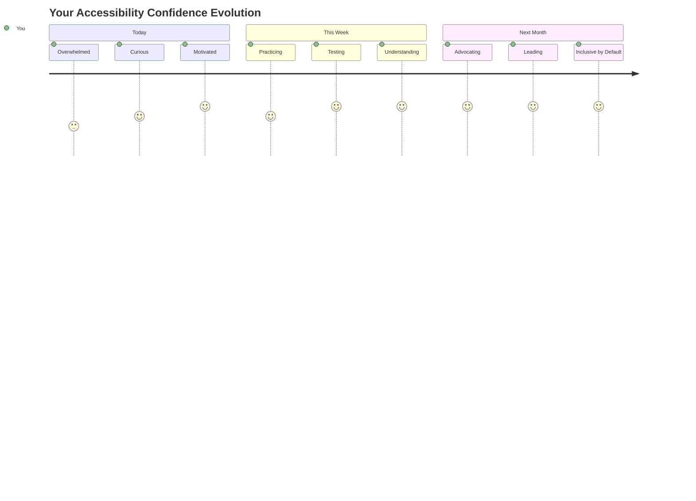
  
> 🌍 **あなたは今やアクセシビリティチャンピオンです！** 素晴らしいウェブ体験は、ウェブへのアクセス方法に関係なく、すべての人に対応するべきだということを理解しています。あなたが構築するすべてのアクセシブルな機能は、インターネットをより包括的なものにします。アクセシビリティを制約ではなく、すべてのユーザーにとってより良い体験を創造する機会と捉える開発者が必要です。このムーブメントへようこそ！ 🎉  

---

**免責事項**:  
この文書はAI翻訳サービス[Co-op Translator](https://github.com/Azure/co-op-translator)を使用して翻訳されています。正確性を追求しておりますが、自動翻訳には誤りや不正確な部分が含まれる可能性があります。元の言語で記載された文書を正式な情報源としてお考えください。重要な情報については、専門の人間による翻訳を推奨します。この翻訳の使用に起因する誤解や誤認について、当社は責任を負いません。