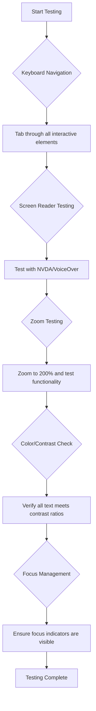
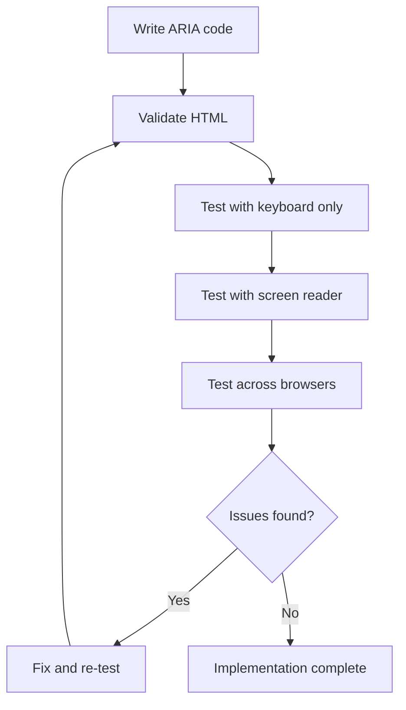

<!--
CO_OP_TRANSLATOR_METADATA:
{
  "original_hash": "90b19cde5b79b29e91babd3138cd8035",
  "translation_date": "2025-10-24T14:53:13+00:00",
  "source_file": "1-getting-started-lessons/3-accessibility/README.md",
  "language_code": "ja"
}
-->
# アクセシブルなウェブページの作成


> スケッチノート: [Tomomi Imura](https://twitter.com/girlie_mac)

## 講義前クイズ
[講義前クイズ](https://ff-quizzes.netlify.app/web/)

> ウェブの力はその普遍性にあります。障害の有無にかかわらず、誰もがアクセスできることが重要な側面です。
>
> \- ティム・バーナーズ＝リー卿、W3Cディレクター、ワールド・ワイド・ウェブの発明者

驚くかもしれませんが、アクセシブルなウェブサイトを作ることで、障害を持つ人々を助けるだけでなく、実際にはすべての人にとってウェブをより良いものにすることができます！

街角のスロープを見たことがありますか？ もともとは車椅子のために設計されたものですが、今ではベビーカーを使う人や、荷物を運ぶ配達員、キャリーバッグを持つ旅行者、自転車利用者など、さまざまな人々に役立っています。アクセシブルなウェブデザインも同じです。特定のグループを助けるための解決策が、結果的にすべての人に利益をもたらすことがよくあります。すごいですよね？

このレッスンでは、どのようにしてすべての人が利用できるウェブサイトを作成するかを探求します。ウェブ標準にすでに組み込まれている実用的な技術を学び、テストツールを使って実践し、アクセシビリティがすべてのユーザーにとってウェブサイトをどれだけ使いやすくするかを確認します。

このレッスンを終える頃には、アクセシビリティを開発ワークフローの自然な一部にする自信がつくでしょう。思慮深いデザインの選択が、何十億ものユーザーにウェブを開放する方法を探求する準備はできましたか？ それでは始めましょう！

> このレッスンは [Microsoft Learn](https://docs.microsoft.com/learn/modules/web-development-101/accessibility/?WT.mc_id=academic-77807-sagibbon) で受講できます！

## 支援技術を理解する

コーディングに入る前に、さまざまな能力を持つ人々が実際にどのようにウェブを体験しているのかを理解する時間を取りましょう。これは単なる理論ではありません。これらの実際のナビゲーションパターンを理解することで、より優れた開発者になることができます！

支援技術は、障害を持つ人々がウェブサイトとやり取りするのを助ける驚くべきツールです。これらの技術がどのように機能するかを理解すると、アクセシブルなウェブ体験を作成することがはるかに直感的になります。それは、他の人の目を通して自分のコードを見ることを学ぶようなものです。

### スクリーンリーダー

[スクリーンリーダー](https://en.wikipedia.org/wiki/Screen_reader) は、デジタルテキストを音声や点字出力に変換する非常に高度な技術です。主に視覚障害者が使用しますが、ディスレクシア（読字障害）などの学習障害を持つユーザーにも非常に役立ちます。

スクリーンリーダーは、非常に賢いナレーターが本を読んでくれるようなものだと考えています。論理的な順序で内容を読み上げ、"ボタン" や "リンク" などのインタラクティブな要素を発表し、ページを移動するためのキーボードショートカットを提供します。しかし、ここで重要なのは、スクリーンリーダーがその魔法を発揮するためには、適切な構造と意味のあるコンテンツでウェブサイトを構築する必要があるということです。それが開発者であるあなたの役割です！

**プラットフォーム別の人気スクリーンリーダー:**
- **Windows**: [NVDA](https://www.nvaccess.org/about-nvda/)（無料で最も人気）、[JAWS](https://webaim.org/articles/jaws/)、[Narrator](https://support.microsoft.com/windows/complete-guide-to-narrator-e4397a0d-ef4f-b386-d8ae-c172f109bdb1/?WT.mc_id=academic-77807-sagibbon)（内蔵）
- **macOS/iOS**: [VoiceOver](https://support.apple.com/guide/voiceover/welcome/10)（内蔵で非常に高機能）
- **Android**: [TalkBack](https://support.google.com/accessibility/android/answer/6283677)（内蔵）
- **Linux**: [Orca](https://wiki.gnome.org/Projects/Orca)（無料でオープンソース）

**スクリーンリーダーがウェブコンテンツをナビゲートする方法:**

スクリーンリーダーは、経験豊富なユーザーが効率的にブラウジングできるよう、複数のナビゲーション方法を提供します:
- **順次読み上げ**: 本を読むように、上から下へとコンテンツを読み上げる
- **ランドマークナビゲーション**: ページセクション（ヘッダー、ナビゲーション、メイン、フッター）間をジャンプ
- **見出しナビゲーション**: 見出し間をスキップしてページ構造を理解
- **リンクリスト**: すべてのリンクをリスト化して素早くアクセス
- **フォームコントロール**: 入力フィールドやボタン間を直接ナビゲート

> 💡 **驚きの事実**: スクリーンリーダーユーザーの68%が主に見出しでナビゲートしています（[WebAIM調査](https://webaim.org/projects/screenreadersurvey9/#finding)）。つまり、見出しの構造はユーザーにとって地図のようなものです。正しく設定すれば、コンテンツをより速く見つけられるように助けることができます！

### テストワークフローの構築

良いニュースです—効果的なアクセシビリティテストは圧倒される必要はありません！ 自動化ツール（明らかな問題を見つけるのに最適）と手動テストを組み合わせると良いでしょう。以下は、1日を無駄にせずに最も多くの問題を発見できる体系的なアプローチです:

**基本的な手動テストワークフロー:**



**ステップバイステップのテストチェックリスト:**
1. **キーボードナビゲーション**: Tab、Shift+Tab、Enter、Space、矢印キーのみを使用
2. **スクリーンリーダーテスト**: NVDA、VoiceOver、またはNarratorを有効にし、目を閉じてナビゲート
3. **ズームテスト**: 200%および400%のズームレベルでテスト
4. **色のコントラスト確認**: すべてのテキストとUIコンポーネントをチェック
5. **フォーカスインジケーターテスト**: すべてのインタラクティブ要素に視覚的なフォーカス状態があることを確認

✅ **Lighthouseから始める**: ブラウザのDevToolsを開き、Lighthouseアクセシビリティ監査を実行し、その結果を手動テストの焦点領域に活用します。

### ズームと拡大ツール

スマホでテキストが小さすぎるときにピンチズームを使ったり、明るい日差しの中でノートパソコンの画面を見ようと目を細めたりしたことはありませんか？ 多くのユーザーは、毎日コンテンツを読みやすくするために拡大ツールを利用しています。これには、低視力の人、高齢者、そして屋外でウェブサイトを読もうとするすべての人が含まれます。

現代のズーム技術は、単に拡大するだけではありません。これらのツールがどのように機能するかを理解することで、どの拡大レベルでも機能的で魅力的なレスポンシブデザインを作成するのに役立ちます。

**現代のブラウザズーム機能:**
- **ページズーム**: すべてのコンテンツを比例的に拡大（テキスト、画像、レイアウト）—これが推奨される方法
- **テキストのみのズーム**: レイアウトを維持しながらフォントサイズを拡大
- **ピンチズーム**: 一時的な拡大のためのモバイルジェスチャーサポート
- **ブラウザサポート**: すべての現代ブラウザは、機能を損なうことなく500%までのズームをサポート

**専門的な拡大ソフトウェア:**
- **Windows**: [Magnifier](https://support.microsoft.com/windows/use-magnifier-to-make-things-on-the-screen-easier-to-see-414948ba-8b1c-d3bd-8615-0e5e32204198)（内蔵）、[ZoomText](https://www.freedomscientific.com/training/zoomtext/getting-started/)
- **macOS/iOS**: [Zoom](https://www.apple.com/accessibility/mac/vision/)（内蔵で高度な機能付き）

> ⚠️ **デザインの考慮事項**: WCAGは、コンテンツが200%にズームされても機能的であることを要求しています。このレベルでは、水平スクロールは最小限に抑え、すべてのインタラクティブ要素がアクセス可能である必要があります。

✅ **レスポンシブデザインをテストする**: ブラウザを200%および400%にズームします。レイアウトはスムーズに適応していますか？ 過剰なスクロールなしで、すべての機能にアクセスできますか？

## 現代のアクセシビリティテストツール

支援技術を使ったウェブのナビゲーション方法を理解したところで、アクセシブルなウェブサイトを構築しテストするのに役立つツールを見ていきましょう。

こう考えてみてください: 自動化ツールは明らかな問題（例えば、altテキストの欠如）を見つけるのに優れていますが、実際の使用感を確認するためには手動テストが必要です。これらを組み合わせることで、すべての人にとって機能するウェブサイトを作成する自信が得られます。

### 色のコントラストテスト

良いニュースです: 色のコントラストは最も一般的なアクセシビリティの問題の1つですが、修正が最も簡単な問題でもあります。良いコントラストは、視覚障害を持つユーザーからビーチでスマホを読もうとする人まで、すべての人に利益をもたらします。

**WCAGのコントラスト要件:**

| テキストタイプ | WCAG AA（最小） | WCAG AAA（強化） |
|----------------|----------------|------------------|
| **通常のテキスト**（18pt未満） | 4.5:1 コントラスト比 | 7:1 コントラスト比 |
| **大きなテキスト**（18pt以上または14pt以上の太字） | 3:1 コントラスト比 | 4.5:1 コントラスト比 |
| **UIコンポーネント**（ボタン、フォームの枠線） | 3:1 コントラスト比 | 3:1 コントラスト比 |

**必須テストツール:**
- [Colour Contrast Analyser](https://www.tpgi.com/color-contrast-checker/) - カラーピッカー付きデスクトップアプリ
- [WebAIM Contrast Checker](https://webaim.org/resources/contrastchecker/) - 即時フィードバックが得られるウェブベースツール
- [Stark](https://www.getstark.co/) - Figma、Sketch、Adobe XD用のデザインツールプラグイン
- [Accessible Colors](https://accessible-colors.com/) - アクセシブルなカラーパレットを見つける

✅ **より良いカラーパレットを作成する**: ブランドカラーを基にして、コントラストチェッカーを使ってアクセシブルなバリエーションを作成します。これらをデザインシステムのアクセシブルカラートークンとして文書化しましょう。

### 包括的なアクセシビリティ監査

最も効果的なアクセシビリティテストは、複数のアプローチを組み合わせたものです。単一のツールではすべてを検出することはできないため、さまざまな方法を使用してテストルーチンを構築することで、徹底的なカバレッジを確保できます。

**ブラウザベースのテスト（DevToolsに内蔵）:**
- **Chrome/Edge**: Lighthouseアクセシビリティ監査 + アクセシビリティパネル
- **Firefox**: 詳細なツリービューを備えたアクセシビリティインスペクター
- **Safari**: Web Inspectorの監査タブ（VoiceOverシミュレーション付き）

**プロフェッショナルなテスト拡張機能:**
- [axe DevTools](https://www.deque.com/axe/devtools/) - 業界標準の自動テスト
- [WAVE](https://wave.webaim.org/extension/) - エラーハイライト付きの視覚的フィードバック
- [Accessibility Insights](https://accessibilityinsights.io/) - Microsoftの包括的なテストスイート

**コマンドラインおよびCI/CD統合:**
- [axe-core](https://github.com/dequelabs/axe-core) - 自動テスト用JavaScriptライブラリ
- [Pa11y](https://pa11y.org/) - コマンドラインアクセシビリティテストツール
- [Lighthouse CI](https://github.com/GoogleChrome/lighthouse-ci) - 自動アクセシビリティスコアリング

> 🎯 **テスト目標**: 基本ラインとしてLighthouseアクセシビリティスコア95以上を目指しましょう。自動ツールはアクセシビリティ問題の30-40%しか検出できないことを忘れないでください—手動テストは依然として重要です！

## 基礎からアクセシビリティを構築する

アクセシビリティの成功の鍵は、最初から基礎に組み込むことです。「後でアクセシビリティを追加しよう」と考えるのは魅力的ですが、それは家を建てた後にスロープを追加しようとするようなものです。可能ではありますが、簡単ではありません。

アクセシビリティを家の設計と考えてみてください—最初の建築計画に車椅子対応を含める方が、後で全てを改修するよりもはるかに簡単です。

### POUR原則: アクセシビリティの基盤

ウェブコンテンツアクセシビリティガイドライン（WCAG）は、POURという4つの基本原則に基づいています。心配しないでください—これらは堅苦しい学術的な概念ではありません！ 実際には、すべての人が利用できるコンテンツを作成するための実用的なガイドラインです。

POURを理解すれば、アクセシビリティに関する意思決定がはるかに直感的になります。それは、デザインの選択を導くための心の中のチェックリストのようなものです。それでは、分解してみましょう:

**🔍 知覚可能（Perceivable）**: 情報は、ユーザーが利用可能な感覚を通じて知覚できる方法で提示されなければなりません

- 非テキストコンテンツ（画像、動画、音声）にテキスト代替を提供する
- すべてのテキストとUIコンポーネントに十分な色のコントラストを確保する
- マルチメディアコンテンツにキャプションやトランスクリプトを提供する
- コンテンツが200%まで拡大しても機能するように設計する
- 情報を伝えるため
色はコミュニケーションにおいて強力なツールですが、重要な情報を伝える方法として色だけに頼るべきではありません。色を超えたデザインは、より堅牢で包括的な体験を提供し、さまざまな状況で機能します。

**色覚の違いを考慮したデザイン:**

男性の約8%、女性の約0.5%が何らかの色覚の違い（一般的に「色覚異常」と呼ばれる）を持っています。最も一般的なタイプは以下の通りです:
- **デューテラノピア**: 赤と緑の区別が困難
- **プロタノピア**: 赤が暗く見える
- **トリタノピア**: 青と黄色の区別が困難（稀）

**包括的な色の戦略:**

```css
/* ❌ Bad: Using only color to indicate status */
.error { color: red; }
.success { color: green; }

/* ✅ Good: Color plus icons and context */
.error {
  color: #d32f2f;
  border-left: 4px solid #d32f2f;
}
.error::before {
  content: "⚠️";
  margin-right: 8px;
}

.success {
  color: #2e7d32;
  border-left: 4px solid #2e7d32;
}
.success::before {
  content: "✅";
  margin-right: 8px;
}
```

**基本的なコントラスト要件を超えて:**
- 色覚異常シミュレーターで色の選択をテストする
- 色分けと併せてパターン、テクスチャ、形状を使用する
- インタラクティブな状態が色なしでも区別できるようにする
- 高コントラストモードでのデザインの見え方を考慮する

✅ **色のアクセシビリティをテストする**: [Coblis](https://www.color-blindness.com/coblis-color-blindness-simulator/)のようなツールを使用して、異なる色覚タイプのユーザーにとってサイトがどのように見えるか確認してください。

### フォーカスインジケーターとインタラクションデザイン

フォーカスインジケーターはデジタル版のカーソルのようなもので、キーボードユーザーがページ上でどこにいるかを示します。よく設計されたフォーカスインジケーターは、インタラクションを明確で予測可能にすることで、すべての人の体験を向上させます。

**現代のフォーカスインジケーターのベストプラクティス:**

```css
/* Enhanced focus styles that work across browsers */
button:focus-visible {
  outline: 2px solid #0066cc;
  outline-offset: 2px;
  box-shadow: 0 0 0 4px rgba(0, 102, 204, 0.25);
}

/* Remove focus outline for mouse users, preserve for keyboard users */
button:focus:not(:focus-visible) {
  outline: none;
}

/* Focus-within for complex components */
.card:focus-within {
  box-shadow: 0 0 0 3px rgba(74, 144, 164, 0.5);
  border-color: #4A90A4;
}

/* Ensure focus indicators meet contrast requirements */
.custom-focus:focus-visible {
  outline: 3px solid #ffffff;
  outline-offset: 2px;
  box-shadow: 0 0 0 6px #000000;
}
```

**フォーカスインジケーターの要件:**
- **視認性**: 周囲の要素とのコントラスト比が少なくとも3:1であること
- **幅**: 要素全体を囲む最小2pxの厚さ
- **持続性**: フォーカスが他の場所に移動するまで表示され続けること
- **区別性**: 他のUI状態と視覚的に異なること

> 💡 **デザインのヒント**: 優れたフォーカスインジケーターは、アウトライン、ボックスシャドウ、色の変更を組み合わせて、異なる背景やコンテキストでも視認性を確保します。

✅ **フォーカスインジケーターを監査する**: サイトをタブで移動し、どの要素が明確なフォーカスインジケーターを持っているか確認してください。見づらいものや完全に欠けているものはありませんか？

### セマンティックHTML: アクセシビリティの基盤

セマンティックHTMLは、支援技術にウェブサイトのGPSシステムを提供するようなものです。適切なHTML要素をその目的に応じて使用することで、スクリーンリーダー、キーボード、その他のツールに詳細なナビゲーションマップを提供し、ユーザーが効果的に操作できるようにします。

私がこの例えを聞いたとき、とても納得しました: セマンティックHTMLは、明確なカテゴリと役立つ案内がある整理された図書館と、本がランダムに散らばっている倉庫の違いのようなものです。どちらも同じ本があるけれど、どちらで探したいと思いますか？その通りです！

**アクセシブルなページ構造の構成要素:**

```html
<!-- Landmark elements provide page navigation structure -->
<header>
  <h1>Your Site Name</h1>
  <nav aria-label="Main navigation">
    <ul>
      <li><a href="/home">Home</a></li>
      <li><a href="/about">About</a></li>
      <li><a href="/services">Services</a></li>
    </ul>
  </nav>
</header>

<main>
  <article>
    <header>
      <h1>Article Title</h1>
      <p>Published on <time datetime="2024-10-14">October 14, 2024</time></p>
    </header>
    
    <section>
      <h2>First Section</h2>
      <p>Content that relates to this section...</p>
    </section>
    
    <section>
      <h2>Second Section</h2>
      <p>More related content...</p>
    </section>
  </article>
  
  <aside>
    <h2>Related Links</h2>
    <nav aria-label="Related articles">
      <ul>
        <li><a href="/related-1">First related article</a></li>
        <li><a href="/related-2">Second related article</a></li>
      </ul>
    </nav>
  </aside>
</main>

<footer>
  <p>&copy; 2024 Your Site Name. All rights reserved.</p>
  <nav aria-label="Footer links">
    <ul>
      <li><a href="/privacy">Privacy Policy</a></li>
      <li><a href="/contact">Contact Us</a></li>
    </ul>
  </nav>
</footer>
```

**セマンティックHTMLがアクセシビリティを変える理由:**

| セマンティック要素 | 目的 | スクリーンリーダーの利点 |
|------------------|---------|----------------------|
| `<header>` | ページまたはセクションのヘッダー | 「バナーランドマーク」 - トップへの迅速なナビゲーション |
| `<nav>` | ナビゲーションリンク | 「ナビゲーションランドマーク」 - ナビセクションのリスト |
| `<main>` | 主なページコンテンツ | 「メインランドマーク」 - コンテンツに直接スキップ |
| `<article>` | 独立したコンテンツ | 記事の境界を通知 |
| `<section>` | テーマ別のコンテンツグループ | コンテンツ構造を提供 |
| `<aside>` | 関連するサイドバーコンテンツ | 「補足ランドマーク」 |
| `<footer>` | ページまたはセクションのフッター | 「コンテンツ情報ランドマーク」 |

**セマンティックHTMLによるスクリーンリーダーのスーパーパワー:**
- **ランドマークナビゲーション**: ページの主要セクション間を瞬時に移動
- **見出しアウトライン**: 見出し構造から目次を生成
- **要素リスト**: すべてのリンク、ボタン、フォームコントロールのリストを作成
- **コンテキスト認識**: コンテンツセクション間の関係を理解

> 🎯 **簡易テスト**: NVDA/JAWSでランドマークショートカット（Dキー）、見出し（Hキー）、リンク（Kキー）を使用してサイトをナビゲートしてみてください。ナビゲーションは理解しやすいですか？

✅ **セマンティック構造を監査する**: ブラウザのDevToolsのアクセシビリティパネルを使用してアクセシビリティツリーを表示し、マークアップが論理的な構造を作成していることを確認してください。

### 見出しの階層: 論理的なコンテンツアウトラインの作成

見出しはアクセシブルなコンテンツにとって非常に重要です。それはすべてを支える背骨のようなものです。スクリーンリーダーユーザーは見出しを頼りにコンテンツを理解し、ナビゲートします。それはページの目次を提供するようなものだと考えてください。

**見出しの黄金ルール:**
レベルを飛ばさないこと。常に`<h1>`から`<h2>`、`<h3>`と論理的に進むことを心がけましょう。学校でアウトラインを作ったことを覚えていますか？それと全く同じ原則です。「I. メインポイント」からいきなり「C. サブサブポイント」に進むことはありませんよね？その間に「A. サブポイント」が必要です。

**完璧な見出し構造の例:**

```html
<!-- ✅ Excellent: Logical, hierarchical progression -->
<main>
  <h1>Complete Guide to Web Accessibility</h1>
  
  <section>
    <h2>Understanding Screen Readers</h2>
    <p>Introduction to screen reader technology...</p>
    
    <h3>Popular Screen Reader Software</h3>
    <p>NVDA, JAWS, and VoiceOver comparison...</p>
    
    <h3>Testing with Screen Readers</h3>
    <p>Step-by-step testing instructions...</p>
  </section>
  
  <section>
    <h2>Color and Contrast Guidelines</h2>
    <p>Designing with sufficient contrast...</p>
    
    <h3>WCAG Contrast Requirements</h3>
    <p>Understanding the different contrast levels...</p>
    
    <h3>Testing Tools and Techniques</h3>
    <p>Tools for verifying contrast ratios...</p>
  </section>
</main>
```

```html
<!-- ❌ Problematic: Skipping levels, inconsistent structure -->
<h1>Page Title</h1>
<h3>Subsection</h3> <!-- Skipped h2 -->
<h2>This should come before h3</h2>
<h1>Another main heading?</h1> <!-- Multiple h1s -->
```

**見出しのベストプラクティス:**
- **1ページに1つの`<h1>`**: 通常はメインページタイトルまたは主要コンテンツの見出し
- **論理的な進行**: レベルを飛ばさない（h1 → h2 → h3、h1 → h3ではない）
- **内容を説明的に**: 文脈外で読まれても意味が分かる見出しを作る
- **CSSで視覚的なスタイリング**: 外観はCSSで、構造はHTMLレベルで

**スクリーンリーダーナビゲーション統計:**
- スクリーンリーダーユーザーの68%が見出しでナビゲートする ([WebAIM Survey](https://webaim.org/projects/screenreadersurvey9/#finding))
- ユーザーは論理的な見出しアウトラインを期待している
- 見出しはページ構造を理解する最速の方法を提供する

> 💡 **プロのヒント**: "HeadingsMap"のようなブラウザ拡張機能を使用して見出し構造を視覚化してください。それはよく整理された目次のように読めるはずです。

✅ **見出し構造をテストする**: スクリーンリーダーの見出しナビゲーション（NVDAのHキー）を使用して見出しを移動してみてください。進行はコンテンツのストーリーを論理的に伝えていますか？

### 高度な視覚アクセシビリティ技術

コントラストや色の基本を超えて、真に包括的な視覚体験を作るための洗練された技術があります。これらの方法は、異なる視覚条件や支援技術に対応するコンテンツを確保します。

**重要な視覚コミュニケーション戦略:**

- **マルチモーダルフィードバック**: 視覚、テキスト、場合によっては音声の手がかりを組み合わせる
- **段階的な情報開示**: 情報を消化しやすい形で提示する
- **一貫したインタラクションパターン**: 慣れ親しんだUIの慣例を使用する
- **レスポンシブタイポグラフィ**: デバイスに応じてテキストを適切にスケールする
- **読み込みとエラーステート**: すべてのユーザーアクションに対して明確なフィードバックを提供する

**アクセシビリティを向上させるCSSユーティリティ:**

```css
/* Screen reader only text - visually hidden but accessible */
.sr-only {
  position: absolute;
  width: 1px;
  height: 1px;
  padding: 0;
  margin: -1px;
  overflow: hidden;
  clip: rect(0, 0, 0, 0);
  white-space: nowrap;
  border: 0;
}

/* Skip link for keyboard navigation */
.skip-link {
  position: absolute;
  top: -40px;
  left: 6px;
  background: #000000;
  color: #ffffff;
  padding: 8px 16px;
  text-decoration: none;
  border-radius: 4px;
  font-weight: bold;
  transition: top 0.3s ease;
  z-index: 1000;
}

.skip-link:focus {
  top: 6px;
}

/* Reduced motion respect */
@media (prefers-reduced-motion: reduce) {
  .skip-link {
    transition: none;
  }
  
  * {
    animation-duration: 0.01ms !important;
    animation-iteration-count: 1 !important;
    transition-duration: 0.01ms !important;
  }
}

/* High contrast mode support */
@media (prefers-contrast: high) {
  .button {
    border: 2px solid;
  }
}
```

> 🎯 **アクセシビリティパターン**: "スキップリンク"はキーボードユーザーにとって不可欠です。ページの最初のフォーカス可能な要素であり、メインコンテンツエリアに直接ジャンプする必要があります。

✅ **スキップナビゲーションを実装する**: ページにスキップリンクを追加し、ページが読み込まれるとすぐにTabキーを押してテストしてください。それらが表示され、メインコンテンツにジャンプできることを確認してください。

## 意味のあるリンクテキストの作成

リンクはウェブの高速道路のようなものですが、リンクテキストが不適切だと「場所」とだけ書かれた道路標識のようなものになります。「シカゴ中心部」と書かれていればもっと役立ちますよね？

これを初めて知ったとき驚いたのですが、スクリーンリーダーはページ内のすべてのリンクを抽出して1つの大きなリストとして表示できます。ページ内のすべてのリンクのディレクトリを渡されたと想像してください。それぞれが単独で意味を持つでしょうか？これがリンクテキストが通過すべきテストです！

### リンクナビゲーションパターンの理解

スクリーンリーダーは、適切に書かれたリンクテキストに依存して強力なリンクナビゲーション機能を提供します:

**リンクナビゲーション方法:**
- **順次読み取り**: リンクはコンテンツフローの一部として文脈内で読み取られる
- **リンクリスト生成**: ページ内のすべてのリンクを検索可能なディレクトリとしてコンパイル
- **クイックナビゲーション**: キーボードショートカット（NVDAのKキー）を使用してリンク間を移動
- **検索機能**: 部分的なテキストを入力して特定のリンクを検索

**文脈が重要な理由:**
スクリーンリーダーユーザーがリンクリストを生成すると、次のようなものが表示されます:
- 「レポートをダウンロード」
- 「詳細はこちら」
- 「ここをクリック」
- 「プライバシーポリシー」
- 「ここをクリック」

文脈外で読まれた場合、これらのリンクのうち2つだけが有用な情報を提供します！

> 📊 **ユーザーへの影響**: スクリーンリーダーユーザーはリンクリストをスキャンしてページコンテンツを迅速に理解します。一般的なリンクテキストは、それぞれのリンクの文脈に戻ってナビゲートする必要があり、ブラウジング体験を大幅に遅くします。

### 避けるべきリンクテキストの一般的なミス

何がうまくいかないかを理解することで、既存のコンテンツのアクセシビリティ問題を認識し修正するのに役立ちます。

**❌ 文脈を提供しない一般的なリンクテキスト:**

```html
<!-- Meaningless when read from a link list -->
<p>Our sustainability efforts are detailed in our recent report. 
   <a href="/sustainability-2024.pdf">Click here</a> to view it.</p>

<!-- Repeated generic text throughout the page -->
<div class="article-card">
  <h3>Web Accessibility Guide</h3>
  <p>Learn the fundamentals...</p>
  <a href="/accessibility-guide">Read more</a>
</div>
<div class="article-card">
  <h3>Color Contrast Tips</h3>
  <p>Improve your design...</p>
  <a href="/color-contrast">Read more</a>
</div>

<!-- URLs as link text (difficult for screen readers to announce) -->
<p>Visit https://www.w3.org/WAI/WCAG21/quickref/ for WCAG guidelines.</p>

<!-- Vague action words -->
<a href="/contact">Go</a> | <a href="/about">See</a> | <a href="/help">View</a>
```

**これらのパターンが失敗する理由:**
- **「ここをクリック」**は目的地について何も伝えない
- **「詳細はこちら」**が複数回繰り返されると混乱を招く
- **生のURL**はスクリーンリーダーが明確に発音するのが難しい
- **「行く」や「見る」のような単語**は説明的な文脈に欠ける

### 優れたリンクテキストを書く

説明的なリンクテキストはすべての人に利益をもたらします。視覚的なユーザーはリンクを迅速にスキャンでき、スクリーンリーダーユーザーは目的地を即座に理解できます。

**✅ 明確で説明的なリンクテキストの例:**

```html
<!-- Descriptive text that explains the destination -->
<p>Our comprehensive <a href="/sustainability-2024.pdf">2024 sustainability report (PDF, 2.1MB)</a> details our environmental initiatives.</p>

<!-- Specific, unique link text for each card -->
<div class="article-card">
  <h3>Web Accessibility Guide</h3>
  <p>Learn the fundamentals of inclusive design...</p>
  <a href="/accessibility-guide">Read our complete web accessibility guide</a>
</div>
<div class="article-card">
  <h3>Color Contrast Tips</h3>
  <p>Improve your design with better color choices...</p>
  <a href="/color-contrast">Explore color contrast best practices</a>
</div>

<!-- Meaningful text instead of raw URLs -->
<p>The <a href="https://www.w3.org/WAI/WCAG21/quickref/">WCAG 2.1 Quick Reference guide</a> provides comprehensive accessibility guidelines.</p>

<!-- Descriptive action links -->
<a href="/contact">Contact our support team</a> | 
<a href="/about">About our company</a> | 
<a href="/help">Get help with your account</a>
```

**リンクテキストのベストプラクティス:**
- **具体的にする**: 「四半期の財務報告書をダウンロード」 vs. 「ダウンロード」
- **ファイルタイプとサイズを含める**: ダウンロード可能なファイルには「(PDF, 1.2MB)」を記載
- **外部リンクであることを明記**: 「(新しいウィンドウで開きます)」が適切な場合
- **アクティブな言語を使用**: 「お問い合わせ」 vs. 「お問い合わせページ」
- **簡潔にする**: 可能であれば2〜8語を目指す

### 高度なリンクアクセシビリティパターン

時には視覚デザインの制約や技術的要件が特別な解決策を必要とします。以下は一般的な課題シナリオに対する洗練された技術です:

**ARIAを使用して文脈を強化する:**

```html
<!-- When button text must be short but needs more context -->
<a href="/report.pdf" 
   aria-label="Download 2024 annual financial report, PDF format, 2.3MB">
  Download Report
</a>

<!-- When the full context comes from surrounding content -->
<h3 id="sustainability-heading">Sustainability Initiative</h3>
<p>Our efforts to reduce environmental impact...</p>
<a href="/sustainability-details" 
   aria-labelledby="sustainability-heading"
   aria-describedby="sustainability-summary">
  Learn more
</a>
<p id="sustainability-summary">Detailed breakdown of our 2024 environmental goals and achievements</p>
```

**ファイルタイプと外部リンク先を示す:**

```html
<!-- Method 1: Include information in visible link text -->
<a href="/annual-report.pdf">
  Download our 2024 annual report (PDF, 2.3MB)
</a>

<!-- Method 2: Use screen reader-only text for file details -->
<a href="/annual-report.pdf">
  Download our 2024 annual report
  <span class="sr-only">(PDF format, 2.3MB)</span>
</a>

<!-- Method 3: External link indication -->
<a href="https://example.com" 
   target="_blank" 
   aria-describedby="external-link-warning">
  Visit external resource
</a>
<span id="external-link-warning" class="sr-only">
  (opens in new window)
</span>

<!-- Method 4: Using CSS for visual indicators -->
<a href="https://example.com" class="external-link">
  External resource
</a>
```

```css
/* Visual indicator for external links */
.external-link::after {
  content: " ↗";
  font-size: 0.8em;
  color: #666;
}

/* Screen reader announcement for external links */
.external-link::before {
  content: "External link: ";
  position: absolute;
  left: -10000px;
  width: 1px;
  height: 1px;
  overflow: hidden;
}
```

> ⚠️ **重要**: `target="_blank"`を使用する場合、リンクが新しいウィンドウやタブで開くことをユーザーに必ず知らせてください。予期しないナビゲーションの変更は混乱を招く可能性があります。

✅ **リンクの文脈をテストする**: ブラウザの開発者ツールを使用してページ内のすべてのリンクのリストを生成してください。周囲の文脈なしで各リンクの目的を理解できますか？

## ARIA: HTMLアクセシビリティを強化する

[Accessible Rich Internet Applications (ARIA)](https://developer.mozilla.org/docs/Web/Accessibility/ARIA)は、複雑なウェブアプリケーションと支援技術の間のユニバーサルトランスレーターのようなものです。HTMLだけではインタラクティブなコンポーネントが行っているすべてを表現できない場合、ARIAがそのギャップを埋める役割を果たします。

ARIAはHTMLに役立つ注釈を追加するようなものだと考えています。まるで脚本の舞台指示のように、役者が役割や関係を理解するのを助けるものです。

**ARIAに関する最も重要なルールはこれです**: 常にセマンティックHTMLを最初に使用し、その後にARIAを追加して強化します。ARIAは調味料のようなもので、メインディッシュではありません。HTML構造を置き換えるのではなく、明確化し強化するために使用します。まずその基盤を正しく構築してください！

### ARIAの戦略的な実装

ARIAは強力ですが、力には責任が伴います。不適切なARIAはアクセシビリティを悪化させる可能性があります。以下は、効果的に使用するタイミングと方法です:

**✅ ARIAを使用する場合:**
- カスタムインタラクティブウィジェット（アコーディオン、タブ、カルーセル）を作成する場合
- ページのリロードなしで動的コンテンツが変更される場合
- 複雑なUI関係に
5. **シンプルに始める**: 複雑なARIA実装はエラーが発生しやすい

**🔍 テストワークフロー:**



**🚫 避けるべきARIAの一般的なミス:**

- **矛盾した情報**: HTMLのセマンティクスと矛盾しないようにする
- **過剰なラベル付け**: ARIA情報が多すぎるとユーザーが混乱する
- **静的なARIA**: コンテンツが変化してもARIA状態を更新しない
- **未検証の実装**: 理論上は動作するが実際には機能しないARIA
- **キーボードサポートの欠如**: ARIAロールに対応するキーボード操作がない

> 💡 **テストリソース**: [accessibility-checker](https://www.npmjs.com/package/accessibility-checker) のようなツールを使用してARIAの自動検証を行い、完全な体験のために実際のスクリーンリーダーでテストすることを忘れないでください。

✅ **専門家から学ぶ**: [ARIA Authoring Practices Guide](https://w3c.github.io/aria-practices/) を参考にして、複雑なインタラクティブウィジェットの実証済みのパターンと実装を学びましょう。

## 画像とメディアのアクセシビリティを向上させる

視覚的および音声的なコンテンツは現代のウェブ体験に欠かせない要素ですが、適切に実装されないと障壁を生む可能性があります。目標は、メディアの情報と感情的な影響がすべてのユーザーに届くようにすることです。一度慣れれば、自然にできるようになります。

メディアの種類によってアクセシビリティのアプローチは異なります。料理のようなもので、繊細な魚を扱う方法と、しっかりしたステーキを扱う方法は異なります。これらの違いを理解することで、状況に応じた適切な解決策を選ぶことができます。

### 画像アクセシビリティの戦略

ウェブサイト上のすべての画像には目的があります。その目的を理解することで、より良い代替テキストを作成し、包括的な体験を提供できます。

**画像の種類と代替テキストの戦略:**

**情報を伝える画像** - 重要な情報を伝える:
```html

```

**装飾的な画像** - 純粋に視覚的で情報価値がない:
```html

```

**機能的な画像** - ボタンやコントロールとして機能する:
```html
<button>
  
</button>
```

**複雑な画像** - チャート、図、インフォグラフィック:
```html

<div id="chart-description">
  <p>Detailed description: Sales data shows a steady increase across all quarters...</p>
</div>
```

### 動画と音声のアクセシビリティ

**動画の要件:**
- **字幕**: 音声コンテンツや効果音のテキスト版
- **音声解説**: 視覚的要素を盲目のユーザー向けにナレーション
- **トランスクリプト**: 音声および視覚コンテンツの全文

```html
<video controls>
  <source src="video.mp4" type="video/mp4">
  <track kind="captions" src="captions.vtt" srclang="en" label="English">
  <track kind="descriptions" src="descriptions.vtt" srclang="en" label="Audio descriptions">
</video>
```

**音声の要件:**
- **トランスクリプト**: すべての音声コンテンツのテキスト版
- **視覚的な指標**: 音声のみのコンテンツには視覚的な手がかりを提供

### 最新の画像技術

**装飾的な画像にCSSを使用する:**
```css
.hero-section {
  background-image: url('decorative-hero.jpg');
  /* Decorative images in CSS don't need alt text */
}
```

**アクセシビリティを考慮したレスポンシブ画像:**
```html
<picture>
  <source media="(min-width: 800px)" srcset="large-chart.png">
  <source media="(min-width: 400px)" srcset="medium-chart.png">
  
</picture>
```

✅ **画像アクセシビリティをテストする**: スクリーンリーダーを使用して画像が含まれるページをナビゲートします。コンテンツを理解するのに十分な情報が得られていますか？

## キーボードナビゲーションとフォーカス管理

多くのユーザーはウェブを完全にキーボードでナビゲートします。これには運動障害のある人、キーボードの方がマウスより速いと感じるパワーユーザー、そしてマウスが動作しなくなった人が含まれます。キーボード入力でサイトがうまく機能することを確認することは重要であり、すべての人にとって効率的なサイトを作ることにつながります。

### 基本的なキーボードナビゲーションパターン

**標準的なキーボード操作:**
- **Tab**: インタラクティブ要素を順にフォーカス
- **Shift + Tab**: フォーカスを逆方向に移動
- **Enter**: ボタンやリンクをアクティブ化
- **Space**: ボタンをアクティブ化、チェックボックスをチェック
- **矢印キー**: コンポーネントグループ内をナビゲート（ラジオボタン、メニュー）
- **Escape**: モーダルやドロップダウンを閉じる、操作をキャンセル

### フォーカス管理のベストプラクティス

**視覚的なフォーカスインジケーター:**
```css
/* Ensure focus is always visible */
button:focus-visible {
  outline: 2px solid #4A90A4;
  outline-offset: 2px;
}

/* Custom focus styles for different components */
.card:focus-within {
  box-shadow: 0 0 0 3px rgba(74, 144, 164, 0.5);
}
```

**効率的なナビゲーションのためのスキップリンク:**
```html
<a href="#main-content" class="skip-link">Skip to main content</a>
<a href="#navigation" class="skip-link">Skip to navigation</a>

<nav id="navigation">
  <!-- navigation content -->
</nav>
<main id="main-content">
  <!-- main content -->
</main>
```

**適切なタブ順序:**
```html
<!-- Use semantic HTML for natural tab order -->
<form>
  <label for="name">Name:</label>
  <input type="text" id="name" tabindex="0">
  
  <label for="email">Email:</label>
  <input type="email" id="email" tabindex="0">
  
  <button type="submit" tabindex="0">Submit</button>
</form>
```

### モーダル内でのフォーカストラップ

モーダルダイアログを開く際、フォーカスはモーダル内に制限されるべきです:

```javascript
// Modern focus trap implementation
function trapFocus(element) {
  const focusableElements = element.querySelectorAll(
    'button, [href], input, select, textarea, [tabindex]:not([tabindex="-1"])'
  );
  
  const firstElement = focusableElements[0];
  const lastElement = focusableElements[focusableElements.length - 1];

  element.addEventListener('keydown', (e) => {
    if (e.key === 'Tab') {
      if (e.shiftKey && document.activeElement === firstElement) {
        e.preventDefault();
        lastElement.focus();
      } else if (!e.shiftKey && document.activeElement === lastElement) {
        e.preventDefault();
        firstElement.focus();
      }
    }
    
    if (e.key === 'Escape') {
      closeModal();
    }
  });
  
  // Focus first element when modal opens
  firstElement.focus();
}
```

✅ **キーボードナビゲーションをテストする**: Tabキーだけを使ってウェブサイトをナビゲートしてみてください。すべてのインタラクティブ要素にアクセスできますか？フォーカス順序は論理的ですか？フォーカスインジケーターは明確に見えますか？

## フォームのアクセシビリティ

フォームはユーザーとのインタラクションにおいて重要であり、アクセシビリティに特別な注意が必要です。

### ラベルとフォームコントロールの関連付け

**すべてのフォームコントロールにはラベルが必要です:**
```html
<!-- Explicit labeling (preferred) -->
<label for="username">Username:</label>
<input type="text" id="username" name="username" required>

<!-- Implicit labeling -->
<label>
  Password:
  <input type="password" name="password" required>
</label>

<!-- Using aria-label when visual label isn't desired -->
<input type="search" aria-label="Search products" placeholder="Search...">
```

### エラーハンドリングとバリデーション

**アクセシブルなエラーメッセージ:**
```html
<label for="email">Email Address:</label>
<input type="email" id="email" name="email" 
       aria-describedby="email-error" 
       aria-invalid="true" required>
<div id="email-error" role="alert">
  Please enter a valid email address
</div>
```

**フォームバリデーションのベストプラクティス:**
- `aria-invalid` を使用して無効なフィールドを示す
- 明確で具体的なエラーメッセージを提供する
- 重要なエラー通知には `role="alert"` を使用する
- エラーを即時表示し、フォーム送信時にも表示する

### フィールドセットとグループ化

**関連するフォームコントロールをグループ化する:**
```html
<fieldset>
  <legend>Shipping Address</legend>
  <label for="street">Street Address:</label>
  <input type="text" id="street" name="street">
  
  <label for="city">City:</label>
  <input type="text" id="city" name="city">
</fieldset>

<fieldset>
  <legend>Preferred Contact Method</legend>
  <input type="radio" id="contact-email" name="contact" value="email">
  <label for="contact-email">Email</label>
  
  <input type="radio" id="contact-phone" name="contact" value="phone">
  <label for="contact-phone">Phone</label>
</fieldset>
```

## アクセシビリティの旅: 重要なポイント

おめでとうございます！真に包括的なウェブ体験を作るための基礎知識を習得しました。これはとてもエキサイティングなことです！ウェブアクセシビリティは単にコンプライアンスを満たすことではなく、人々がデジタルコンテンツと対話する多様な方法を認識し、その素晴らしい複雑さに対応することです。

あなたは、すべての人にとって優れたデザインが機能することを理解している開発者の成長するコミュニティの一員となりました。ようこそ！

**🎯 あなたのアクセシビリティツールキットには以下が含まれます:**

| 基本原則 | 実装 | インパクト |
|----------------|----------------|---------|
| **セマンティックHTMLの基盤** | 意図された目的に適したHTML要素を使用する | スクリーンリーダーが効率的にナビゲートでき、キーボードが自動的に機能する |
| **包括的な視覚デザイン** | 十分なコントラスト、意味のある色の使用、視覚的なフォーカスインジケーター | どんな照明条件でも誰にとっても明確 |
| **説明的なコンテンツ** | 意味のあるリンクテキスト、代替テキスト、見出し | ユーザーが視覚的なコンテキストなしでコンテンツを理解できる |
| **キーボードアクセシビリティ** | タブ順序、キーボードショートカット、フォーカス管理 | 運動アクセシビリティとパワーユーザーの効率性 |
| **ARIAの強化** | セマンティックギャップを埋めるための戦略的な使用 | 複雑なアプリケーションが支援技術と連携する |
| **包括的なテスト** | 自動ツール + 手動検証 + 実際のユーザーテスト | ユーザーに影響を与える前に問題を発見する |

**🚀 次のステップ:**

1. **アクセシビリティをワークフローに組み込む**: テストを開発プロセスの自然な一部にする
2. **実際のユーザーから学ぶ**: 支援技術を使用する人々からフィードバックを求める
3. **最新情報を追い続ける**: アクセシビリティ技術は新しい技術や標準とともに進化する
4. **包括性を推進する**: 知識を共有し、アクセシビリティをチームの優先事項にする

> 💡 **覚えておいてください**: アクセシビリティの制約は、すべての人に利益をもたらす革新的でエレガントな解決策を生むことがよくあります。歩道の切り欠き、字幕、音声コントロールはすべてアクセシビリティ機能として始まり、主流の改善となりました。

**ビジネスケースは明確です**: アクセシブルなウェブサイトはより多くのユーザーに届き、検索エンジンでのランキングが向上し、メンテナンスコストが低く、法的リスクを回避します。しかし、正直なところ、アクセシビリティを気にする本当の理由はもっと深いところにあります。アクセシブルなウェブサイトはウェブの最高の価値観—オープン性、包括性、そしてすべての人が情報に平等にアクセスできるという考えを体現しています。

あなたは未来の包括的なウェブを構築する準備が整いました。あなたが作るアクセシブルなサイトは、インターネットをすべての人にとってより歓迎される場所にします。それを考えると、とても素晴らしいことですね！

## 追加リソース

アクセシビリティ学習の旅を続けるための必須リソース:

**📚 公式標準とガイドライン:**
- [WCAG 2.1 Guidelines](https://www.w3.org/WAI/WCAG21/quickref/) - 公式アクセシビリティ標準のクイックリファレンス
- [ARIA Authoring Practices Guide](https://w3c.github.io/aria-practices/) - インタラクティブウィジェットの包括的なパターン
- [WebAIM Guidelines](https://webaim.org/) - 実用的で初心者向けのアクセシビリティガイダンス

**🛠️ ツールとテストリソース:**
- [axe DevTools](https://www.deque.com/axe/devtools/) - 業界標準のアクセシビリティテスト
- [A11y Project Checklist](https://www.a11yproject.com/checklist/) - ステップバイステップのアクセシビリティ検証
- [Accessibility Insights](https://accessibilityinsights.io/) - Microsoftの包括的なテストスイート
- [Color Oracle](https://colororacle.org/) - デザインテスト用の色覚異常シミュレーター

**🎓 学習とコミュニティ:**
- [WebAIM Screen Reader Survey](https://webaim.org/projects/screenreadersurvey9/) - 実際のユーザーの好みと行動
- [Inclusive Components](https://inclusive-components.design/) - 現代のアクセシブルなコンポーネントパターン
- [A11y Coffee](https://a11y.coffee/) - 簡単なアクセシビリティのヒントと洞察
- [Web Accessibility Initiative (WAI)](https://www.w3.org/WAI/) - W3Cの包括的なアクセシビリティリソース

**🎥 実践的な学習:**
- [Accessibility Developer Guide](https://www.accessibility-developer-guide.com/) - 実践的な実装ガイダンス
- [Deque University](https://dequeuniversity.com/) - プロフェッショナルなアクセシビリティトレーニングコース

## GitHub Copilot Agent Challenge 🚀

Agentモードを使用して以下のチャレンジを完了してください:

**説明:** 適切なフォーカス管理、ARIA属性、キーボードナビゲーションパターンを示すアクセシブルなモーダルダイアログコンポーネントを作成してください。

**プロンプト:** HTML、CSS、JavaScriptを使用して完全なモーダルダイアログコンポーネントを構築してください。これには、適切なフォーカストラップ、ESCキーで閉じる機能、外部クリックで閉じる機能、スクリーンリーダー用のARIA属性、視覚的なフォーカスインジケーターが含まれます。モーダルには適切なラベルとエラーハンドリングを備えたフォームを含めてください。コンポーネントがWCAG 2.1 AA基準を満たしていることを確認してください。

## 🚀 チャレンジ

このHTMLをアクセシビリティを最大限に考慮して書き直してください。学んだ戦略を活用してください。

```html
<!DOCTYPE html>
<html lang="en">
  <head>
    <meta charset="UTF-8">
    <meta name="viewport" content="width=device-width, initial-scale=1.0">
    <title>Turtle Ipsum - The World's Premier Turtle Fan Club</title>
    <link href='../assets/style.css' rel='stylesheet' type='text/css'>
  </head>
  <body>
    <header class="site-header">
      <h1 class="site-title">Turtle Ipsum</h1>
      <p class="site-subtitle">The World's Premier Turtle Fan Club</p>
    </header>
    
    <nav class="main-nav" aria-label="Main navigation">
      <h2 class="nav-header">Resources</h2>
      <ul class="nav-list">
        <li><a href="https://www.youtube.com/watch?v=CMNry4PE93Y">"I like turtles" video</a></li>
        <li><a href="https://en.wikipedia.org/wiki/Turtle">Basic turtle information</a></li>
        <li><a href="https://en.wikipedia.org/wiki/Turtles_(chocolate)">Chocolate turtles candy</a></li>
      </ul>
    </nav>
    
    <main class="main-content">
      <article>
        <h1>Welcome to Turtle Ipsum</h1>
        <p class="intro">
          <a href="/about">Learn more about our turtle community</a> and discover fascinating facts about these amazing creatures.
        </p>
        <p class="article-text">
          Turtle ipsum dolor sit amet, consectetur adipiscing elit, sed do eiusmod tempor incididunt ut labore et dolore magna aliqua. Ut enim ad minim veniam, quis nostrud exercitation ullamco laboris nisi ut aliquip ex ea commodo consequat. Duis aute irure dolor in reprehenderit in voluptate velit esse cillum dolore eu fugiat nulla pariatur. Excepteur sint occaecat cupidatat non proident, sunt in culpa qui officia deserunt mollit anim id est laborum.
        </p>
      </article>
    </main>
    
    <footer class="footer">
      <section class="newsletter-signup">
        <h2>Stay Updated</h2>
        <button type="button" onclick="showNewsletterForm()">Sign up for turtle news</button>
      </section>
      
      <nav class="footer-nav" aria-label="Footer navigation">
        <h2>Site Pages</h2>
        <ul>
          <li><a href="../">Home</a></li>
          <li><a href="../semantic">Semantic HTML example</a></li>
        </ul>
      </nav>
      
      <p class="footer-copyright">&copy; 2024 Instrument. All rights reserved.</p>
    </footer>
  </body>
</html>
```

**改善点:**
- 適切なセマンティックHTML構造を追加
- 見出しの階層を修正（単一のh1、論理的な進行）
- "クリックはこちら"ではなく意味のあるリンクテキストを追加
- ナビゲーション用の適切なARIAラベルを追加
- lang属性と適切なmetaタグを追加
- インタラクティブ要素にbutton要素を使用
- フッターコンテンツを適切なランドマークで構成

## 講義後のクイズ
[講義後のクイズ](https://ff-quizzes.netlify.app/web/en/)

## レビューと自己学習

多くの国ではアクセシビリティ要件に関する法律があります。自国のアクセシビリティ法について調べてみましょう。どのような内容がカバーされていて、何がカバーされていないのかを確認してください。例としては[この政府ウェブサイト](https://accessibility.blog.gov.uk/)があります。

## 課題
 
[非アクセシブルなウェブサイトを分析する](assignment.md)

クレジット: [Turtle Ipsum](https://github.com/Instrument/semantic-html-sample) by Instrument

---

**免責事項**:  
この文書はAI翻訳サービス[Co-op Translator](https://github.com/Azure/co-op-translator)を使用して翻訳されています。正確性を追求しておりますが、自動翻訳には誤りや不正確な部分が含まれる可能性があります。元の言語で記載された文書を正式な情報源としてお考えください。重要な情報については、専門の人間による翻訳を推奨します。この翻訳の使用に起因する誤解や誤解について、当社は責任を負いません。