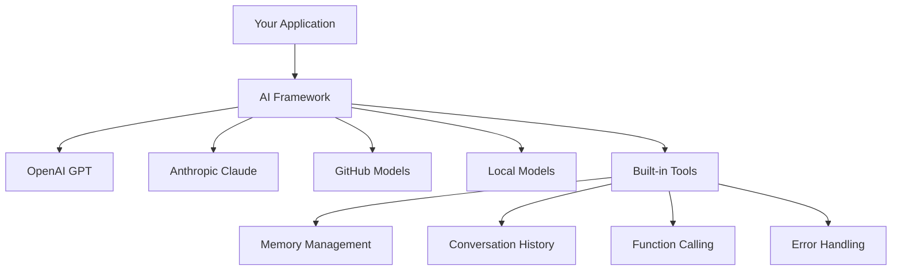
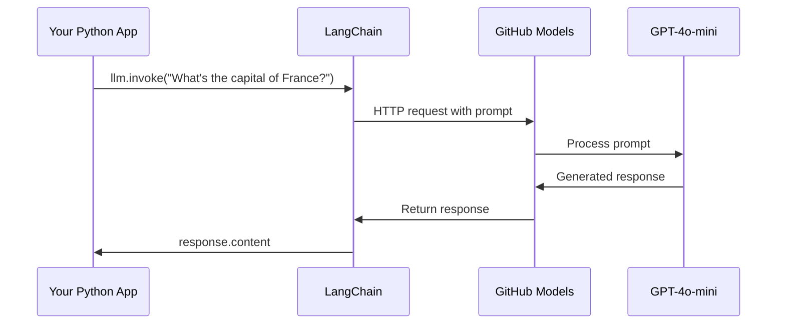
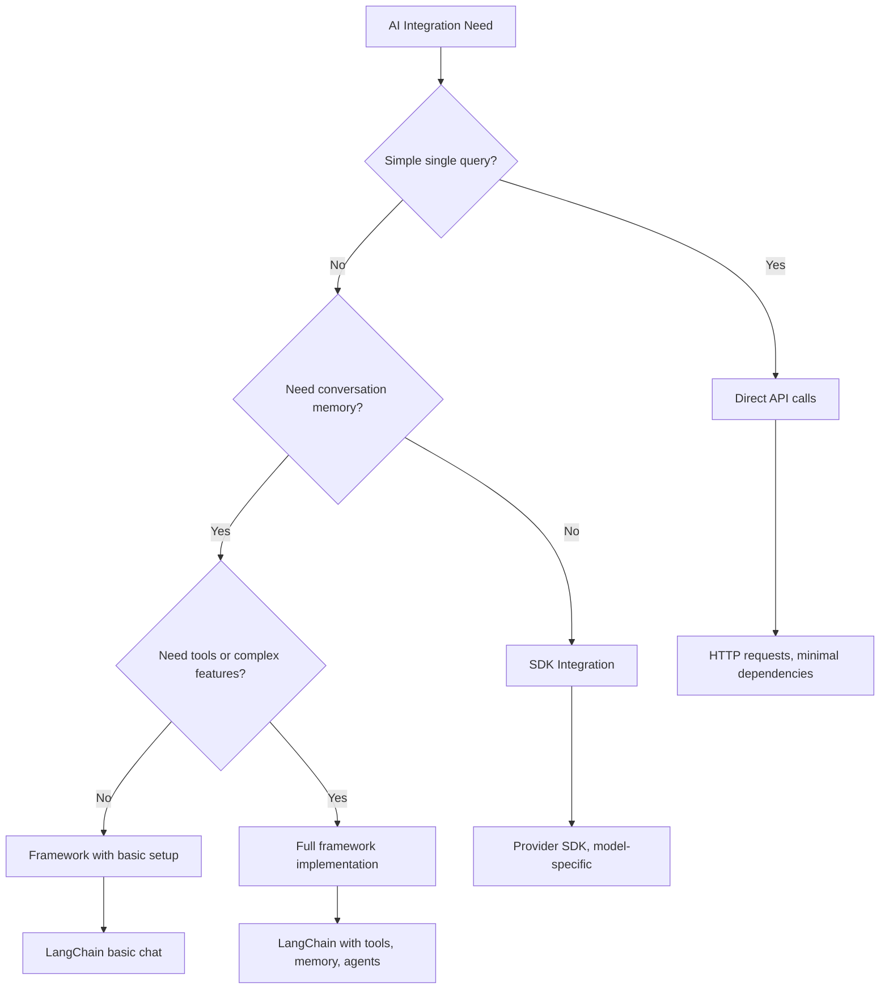

<!--
CO_OP_TRANSLATOR_METADATA:
{
  "original_hash": "e2c4ae5688e34b4b8b09d52aec56c79e",
  "translation_date": "2025-10-24T14:57:17+00:00",
  "source_file": "10-ai-framework-project/README.md",
  "language_code": "ja"
}
-->
# AIフレームワーク

AIアプリケーションをゼロから構築しようとして圧倒されたことはありませんか？それはあなただけではありません！AIフレームワークは、AI開発のための万能ツールのようなもので、インテリジェントなアプリケーションを構築する際に時間と手間を省くことができます。AIフレームワークをよく整理されたライブラリのように考えてみてください。事前に構築されたコンポーネント、標準化されたAPI、スマートな抽象化を提供し、実装の詳細に悩むのではなく、問題解決に集中できるようにします。

このレッスンでは、LangChainのようなフレームワークが、以前は複雑だったAI統合タスクをどのようにして簡潔で読みやすいコードに変えるかを探ります。会話の追跡、ツールの呼び出しの実装、異なるAIモデルを統一されたインターフェースで管理するなど、現実世界の課題に取り組む方法を学びます。

レッスンが終わる頃には、生のAPI呼び出しではなくフレームワークを選ぶタイミング、抽象化を効果的に利用する方法、そして現実世界で使えるAIアプリケーションを構築する方法を理解できるようになります。AIフレームワークがあなたのプロジェクトに何をもたらすかを探ってみましょう。

## フレームワークを選ぶ理由

AIアプリを構築する準備ができたら素晴らしいですね！でも、ここで問題があります。いくつかの異なる方法があり、それぞれに利点と欠点があります。歩く、自転車に乗る、車で移動するのを選ぶようなもので、どれも目的地に到達できますが、経験（と労力）はまったく異なります。

AIをプロジェクトに統合する主な方法を3つに分けてみましょう：

| アプローチ | 利点 | 最適な用途 | 注意点 |
|------------|------|------------|--------|
| **直接HTTPリクエスト** | 完全な制御、依存関係なし | 簡単なクエリ、基本の学習 | コードが冗長、エラーハンドリングが手動 |
| **SDK統合** | ボイラープレートが少ない、モデル固有の最適化 | 単一モデルアプリケーション | 特定のプロバイダーに限定 |
| **AIフレームワーク** | 統一されたAPI、組み込みの抽象化 | 複数モデルアプリ、複雑なワークフロー | 学習曲線、過度の抽象化の可能性 |

### 実践でのフレームワークの利点



**フレームワークが重要な理由:**
- 複数のAIプロバイダーを1つのインターフェースで**統一**
- 会話の記憶を自動的に**管理**
- 埋め込みや関数呼び出しなどの一般的なタスクに対応するツールを**提供**
- エラーハンドリングとリトライロジックを**管理**
- 複雑なワークフローを読みやすいメソッド呼び出しに**変換**

> 💡 **プロのヒント**: 異なるAIモデルを切り替えたり、エージェント、メモリ、ツール呼び出しなどの複雑な機能を構築する際にはフレームワークを使用しましょう。基本を学んだり、シンプルで焦点を絞ったアプリケーションを構築する際には直接APIを使用するのが良いです。

**結論**: 職人の専門的なツールと完全な作業場を選ぶのと同じように、タスクに合ったツールを選ぶことが重要です。フレームワークは複雑で機能豊富なアプリケーションに優れていますが、直接APIはシンプルなユースケースに適しています。

## はじめに

このレッスンでは以下を学びます：

- 一般的なAIフレームワークの使い方
- チャット会話、ツールの使用、メモリとコンテキストなどの一般的な問題への対処法
- これを活用してAIアプリを構築する方法

## 初めてのAIプロンプト

質問を送信して回答を得る最初のAIアプリケーションを作成することで基本を学びましょう。アルキメデスが浴槽で浮力の原理を発見したように、最もシンプルな観察が最も強力な洞察につながることがあります。そしてフレームワークはこれらの洞察を手軽に利用できるようにします。

### GitHubモデルを使ったLangChainのセットアップ

LangChainを使用してGitHubモデルに接続します。これにより、さまざまなAIモデルに無料でアクセスできるのが魅力的です。最良の部分は、いくつかの簡単な設定パラメータだけで始められることです：

```python
from langchain_openai import ChatOpenAI
import os

llm = ChatOpenAI(
    api_key=os.environ["GITHUB_TOKEN"],
    base_url="https://models.github.ai/inference",
    model="openai/gpt-4o-mini",
)

# Send a simple prompt
response = llm.invoke("What's the capital of France?")
print(response.content)
```

**ここで何が起こっているのか:**
- `ChatOpenAI`クラスを使用してLangChainクライアントを**作成** - これがAIへのゲートウェイです！
- 認証トークンを使用してGitHubモデルへの接続を**設定**
- 使用するAIモデルを**指定**（`gpt-4o-mini`） - これがあなたのAIアシスタントになります
- `invoke()`メソッドを使用して質問を**送信** - ここで魔法が起こります
- **応答を抽出**して表示 - そして、AIとのチャットが始まります！

> 🔧 **セットアップの注意**: GitHub Codespacesを使用している場合はラッキーです - `GITHUB_TOKEN`はすでに設定されています！ローカルで作業している場合は、適切な権限を持つ個人用アクセストークンを作成する必要があります。

**期待される出力:**
```text
The capital of France is Paris.
```




## 会話型AIの構築

最初の例では基本を示しましたが、それは単一のやり取りに過ぎません。質問をして回答を得るだけです。実際のアプリケーションでは、ワトソンとホームズが調査の会話を積み重ねていったように、AIが話している内容を覚えてほしいものです。

ここでLangChainが特に役立ちます。LangChainは、会話を構造化し、AIに個性を与えるのに役立つさまざまなメッセージタイプを提供します。コンテキストとキャラクターを維持するチャット体験を構築することができます。

### メッセージタイプの理解

これらのメッセージタイプは、会話の参加者がかぶる異なる「帽子」のようなものだと考えてください。LangChainは、誰が何を言っているかを追跡するために異なるメッセージクラスを使用します：

| メッセージタイプ | 目的 | 使用例 |
|------------------|------|--------|
| `SystemMessage` | AIの個性と行動を定義 | 「あなたは役立つコーディングアシスタントです」 |
| `HumanMessage` | ユーザー入力を表す | 「関数の仕組みを説明してください」 |
| `AIMessage` | AIの応答を保存 | 会話内の以前のAI応答 |

### 初めての会話を作成する

AIが特定の役割を担う会話を作成してみましょう。今回は、外交的な知恵とリーダーシップで知られるキャプテン・ピカードの役割を担わせます：

```python
messages = [
    SystemMessage(content="You are Captain Picard of the Starship Enterprise"),
    HumanMessage(content="Tell me about you"),
]
```

**この会話設定の内訳:**
- `SystemMessage`を通じてAIの役割と個性を**確立**
- `HumanMessage`を介して初期のユーザーの質問を**提供**
- 複数ターンの会話の基盤を**作成**

この例の完全なコードは以下の通りです：

```python
from langchain_core.messages import HumanMessage, SystemMessage
from langchain_openai import ChatOpenAI
import os

llm = ChatOpenAI(
    api_key=os.environ["GITHUB_TOKEN"],
    base_url="https://models.github.ai/inference",
    model="openai/gpt-4o-mini",
)

messages = [
    SystemMessage(content="You are Captain Picard of the Starship Enterprise"),
    HumanMessage(content="Tell me about you"),
]


# works
response  = llm.invoke(messages)
print(response.content)
```

以下のような結果が表示されるはずです：

```text
I am Captain Jean-Luc Picard, the commanding officer of the USS Enterprise (NCC-1701-D), a starship in the United Federation of Planets. My primary mission is to explore new worlds, seek out new life and new civilizations, and boldly go where no one has gone before. 

I believe in the importance of diplomacy, reason, and the pursuit of knowledge. My crew is diverse and skilled, and we often face challenges that test our resolve, ethics, and ingenuity. Throughout my career, I have encountered numerous species, grappled with complex moral dilemmas, and have consistently sought peaceful solutions to conflicts.

I hold the ideals of the Federation close to my heart, believing in the importance of cooperation, understanding, and respect for all sentient beings. My experiences have shaped my leadership style, and I strive to be a thoughtful and just captain. How may I assist you further?
```

会話の継続性を維持するためには（毎回コンテキストをリセットするのではなく）、応答をメッセージリストに追加し続ける必要があります。世代を超えて物語を保存する口承の伝統のように、このアプローチは持続的な記憶を構築します：

```python
from langchain_core.messages import HumanMessage, SystemMessage
from langchain_openai import ChatOpenAI
import os

llm = ChatOpenAI(
    api_key=os.environ["GITHUB_TOKEN"],
    base_url="https://models.github.ai/inference",
    model="openai/gpt-4o-mini",
)

messages = [
    SystemMessage(content="You are Captain Picard of the Starship Enterprise"),
    HumanMessage(content="Tell me about you"),
]


# works
response  = llm.invoke(messages)

print(response.content)

print("---- Next ----")

messages.append(response)
messages.append(HumanMessage(content="Now that I know about you, I'm Chris, can I be in your crew?"))

response  = llm.invoke(messages)

print(response.content)

```

すごいですよね？ここで起こっているのは、最初は初期の2つのメッセージだけでLLMを呼び出し、次に完全な会話履歴で再度呼び出していることです。まるでAIが実際に私たちのチャットを追っているかのようです！

このコードを実行すると、次のような2回目の応答が得られるでしょう：

```text
Welcome aboard, Chris! It's always a pleasure to meet those who share a passion for exploration and discovery. While I cannot formally offer you a position on the Enterprise right now, I encourage you to pursue your aspirations. We are always in need of talented individuals with diverse skills and backgrounds. 

If you are interested in space exploration, consider education and training in the sciences, engineering, or diplomacy. The values of curiosity, resilience, and teamwork are crucial in Starfleet. Should you ever find yourself on a starship, remember to uphold the principles of the Federation: peace, understanding, and respect for all beings. Your journey can lead you to remarkable adventures, whether in the stars or on the ground. Engage!
```

それは「たぶん」として受け取っておきます ;)

## ストリーミング応答

ChatGPTがリアルタイムで応答を「タイプ」しているように見えることに気づいたことはありますか？それがストリーミングの仕組みです。熟練した書道家が文字を一筆一筆書くのを見るように、ストリーミングはインタラクションをより自然に感じさせ、即時のフィードバックを提供します。

### LangChainでのストリーミングの実装

```python
from langchain_openai import ChatOpenAI
import os

llm = ChatOpenAI(
    api_key=os.environ["GITHUB_TOKEN"],
    base_url="https://models.github.ai/inference",
    model="openai/gpt-4o-mini",
    streaming=True
)

# Stream the response
for chunk in llm.stream("Write a short story about a robot learning to code"):
    print(chunk.content, end="", flush=True)
```

**ストリーミングが素晴らしい理由:**
- **作成中のコンテンツを表示** - もう待ち時間の気まずさはありません！
- **何かが実際に起こっている**と感じさせる
- **技術的には速くなくても**、速く感じる
- **AIが「考えている」間に**ユーザーが読み始めることができる

> 💡 **ユーザーエクスペリエンステクニック**: ストリーミングは、コードの説明、創造的な文章、詳細なチュートリアルなど、長い応答を扱う際に特に輝きます。ユーザーは空白の画面を見つめる代わりに進行状況を見るのが好きです！

## プロンプトテンプレート

プロンプトテンプレートは、古典的な雄弁術で使用される修辞構造のようなものです。キケロが異なる聴衆に合わせてスピーチのパターンを適応させながら、同じ説得力のあるフレームワークを維持した方法を思い出してください。これにより、すべてを最初から書き直すことなく、異なる情報を入れ替えることができる再利用可能なプロンプトを作成できます。一度テンプレートを設定すれば、必要な値を埋めるだけです。

### 再利用可能なプロンプトの作成

```python
from langchain_core.prompts import ChatPromptTemplate

# Define a template for code explanations
template = ChatPromptTemplate.from_messages([
    ("system", "You are an expert programming instructor. Explain concepts clearly with examples."),
    ("human", "Explain {concept} in {language} with a practical example for {skill_level} developers")
])

# Use the template with different values
questions = [
    {"concept": "functions", "language": "JavaScript", "skill_level": "beginner"},
    {"concept": "classes", "language": "Python", "skill_level": "intermediate"},
    {"concept": "async/await", "language": "JavaScript", "skill_level": "advanced"}
]

for question in questions:
    prompt = template.format_messages(**question)
    response = llm.invoke(prompt)
    print(f"Topic: {question['concept']}\n{response.content}\n---\n")
```

**テンプレートを使用する理由:**
- **アプリ全体でプロンプトを一貫して維持**
- **面倒な文字列結合はもう不要** - シンプルでクリーンな変数だけ
- **AIが予測可能に動作** - 構造が一定だから
- **更新が簡単** - 一度テンプレートを変更すれば、すべての場所で修正される

## 構造化された出力

AIの応答が非構造化テキストとして返ってきて解析に苦労したことはありませんか？構造化された出力は、リンネが生物分類の体系的なアプローチを採用したように、組織的で予測可能で扱いやすいものです。JSON、特定のデータ構造、または必要な形式をリクエストすることができます。

### 出力スキーマの定義

```python
from langchain_core.prompts import ChatPromptTemplate
from langchain_core.output_parsers import JsonOutputParser
from pydantic import BaseModel, Field

class CodeReview(BaseModel):
    score: int = Field(description="Code quality score from 1-10")
    strengths: list[str] = Field(description="List of code strengths")
    improvements: list[str] = Field(description="List of suggested improvements")
    overall_feedback: str = Field(description="Summary feedback")

# Set up the parser
parser = JsonOutputParser(pydantic_object=CodeReview)

# Create prompt with format instructions
prompt = ChatPromptTemplate.from_messages([
    ("system", "You are a code reviewer. {format_instructions}"),
    ("human", "Review this code: {code}")
])

# Format the prompt with instructions
chain = prompt | llm | parser

# Get structured response
code_sample = """
def calculate_average(numbers):
    return sum(numbers) / len(numbers)
"""

result = chain.invoke({
    "code": code_sample,
    "format_instructions": parser.get_format_instructions()
})

print(f"Score: {result['score']}")
print(f"Strengths: {', '.join(result['strengths'])}")
```

**構造化された出力が画期的な理由:**
- **どんな形式で返ってくるかを推測する必要がない** - 毎回一貫している
- **データベースやAPIに直接接続** - 追加作業不要
- **奇妙なAI応答をキャッチ** - アプリが壊れるのを防ぐ
- **コードがよりクリーンに** - 何を扱っているか正確にわかる

## ツール呼び出し

ここで最も強力な機能の1つに到達します：ツールです。これにより、AIに会話以外の実用的な能力を与えることができます。中世のギルドが特定の工芸品のために専門的なツールを開発したように、AIに特化したツールを装備することができます。利用可能なツールを説明し、誰かが一致するものを要求した場合、AIは行動を起こすことができます。

### Pythonを使用する

次のようにツールを追加してみましょう：

```python
from typing_extensions import Annotated, TypedDict

class add(TypedDict):
    """Add two integers."""

    # Annotations must have the type and can optionally include a default value and description (in that order).
    a: Annotated[int, ..., "First integer"]
    b: Annotated[int, ..., "Second integer"]

tools = [add]

functions = {
    "add": lambda a, b: a + b
}
```

ここで何が起こっているのでしょうか？`TypedDict`を継承し、`a`と`b`に`Annotated`型を使用することで、このツールが何をするのか、何が必要なのかをLLMに明確に伝えています。`functions`辞書は私たちのツールボックスのようなもので、AIが特定のツールを使用することを決定したときにコードが何をすべきかを正確に指示します。

次に、このツールを使用してLLMを呼び出す方法を見てみましょう：

```python
llm = ChatOpenAI(
    api_key=os.environ["GITHUB_TOKEN"],
    base_url="https://models.github.ai/inference",
    model="openai/gpt-4o-mini",
)

llm_with_tools = llm.bind_tools(tools)
```

ここで`bind_tools`を`tools`配列と一緒に呼び出し、これによりLLM `llm_with_tools`はこのツールの知識を持つようになります。

この新しいLLMを使用するには、次のコードを入力できます：

```python
query = "What is 3 + 12?"

res = llm_with_tools.invoke(query)
if(res.tool_calls):
    for tool in res.tool_calls:
        print("TOOL CALL: ", functions[tool["name"]](../../../10-ai-framework-project/**tool["args"]))
print("CONTENT: ",res.content)
```

この新しいLLMで`invoke`を呼び出すと、プロパティ`tool_calls`が埋められる可能性があります。そうであれば、特定されたツールには`name`と`args`プロパティがあり、どのツールを呼び出すべきかと引数が特定されます。完全なコードは次のようになります：

```python
from langchain_core.messages import HumanMessage, SystemMessage
from langchain_openai import ChatOpenAI
import os
from typing_extensions import Annotated, TypedDict

class add(TypedDict):
    """Add two integers."""

    # Annotations must have the type and can optionally include a default value and description (in that order).
    a: Annotated[int, ..., "First integer"]
    b: Annotated[int, ..., "Second integer"]

tools = [add]

functions = {
    "add": lambda a, b: a + b
}

llm = ChatOpenAI(
    api_key=os.environ["GITHUB_TOKEN"],
    base_url="https://models.github.ai/inference",
    model="openai/gpt-4o-mini",
)

llm_with_tools = llm.bind_tools(tools)

query = "What is 3 + 12?"

res = llm_with_tools.invoke(query)
if(res.tool_calls):
    for tool in res.tool_calls:
        print("TOOL CALL: ", functions[tool["name"]](../../../10-ai-framework-project/**tool["args"]))
print("CONTENT: ",res.content)
```

このコードを実行すると、次のような出力が表示されるはずです：

```text
TOOL CALL:  15
CONTENT: 
```

AIは「3 + 12は何ですか」という質問を検討し、これを`add`ツールのタスクとして認識しました。熟練した図書館員が質問の種類に基づいてどの参考文献を参照するかを知っているように、ツールの名前、説明、フィールド仕様からこの判断を下しました。結果の15は、`functions`辞書がツールを実行した結果です：

```python
print("TOOL CALL: ", functions[tool["name"]](../../../10-ai-framework-project/**tool["args"]))
```


### Web APIを呼び出すより興味深いツール

数値を加算することは概念を示すものですが、実際のツールは通常、Web APIを呼び出すなど、より複雑な操作を行います。遠隔地を接続する電信オペレーターのように、インターネットからコンテンツを取得するAIを追加してみましょう：

```python
class joke(TypedDict):
    """Tell a joke."""

    # Annotations must have the type and can optionally include a default value and description (in that order).
    category: Annotated[str, ..., "The joke category"]

def get_joke(category: str) -> str:
    response = requests.get(f"https://api.chucknorris.io/jokes/random?category={category}", headers={"Accept": "application/json"})
    if response.status_code == 200:
        return response.json().get("value", f"Here's a {category} joke!")
    return f"Here's a {category} joke!"

functions = {
    "add": lambda a, b: a + b,
    "joke": lambda category: get_joke(category)
}

query = "Tell me a joke about animals"

# the rest of the code is the same
```

このコードを実行すると、次のような応答が得られるでしょう：

```text
TOOL CALL:  Chuck Norris once rode a nine foot grizzly bear through an automatic car wash, instead of taking a shower.
CONTENT:  
```

以下はコード全体です：

```python
from langchain_openai import ChatOpenAI
import requests
import os
from typing_extensions import Annotated, TypedDict

class add(TypedDict):
    """Add two integers."""

    # Annotations must have the type and can optionally include a default value and description (in that order).
    a: Annotated[int, ..., "First integer"]
    b: Annotated[int, ..., "Second integer"]

class joke(TypedDict):
    """Tell a joke."""

    # Annotations must have the type and can optionally include a default value and description (in that order).
    category: Annotated[str, ..., "The joke category"]

tools = [add, joke]

def get_joke(category: str) -> str:
    response = requests.get(f"https://api.chucknorris.io/jokes/random?category={category}", headers={"Accept": "application/json"})
    if response.status_code == 200:
        return response.json().get("value", f"Here's a {category} joke!")
    return f"Here's a {category} joke!"

functions = {
    "add": lambda a, b: a + b,
    "joke": lambda category: get_joke(category)
}

llm = ChatOpenAI(
    api_key=os.environ["GITHUB_TOKEN"],
    base_url="https://models.github.ai/inference",
    model="openai/gpt-4o-mini",
)

llm_with_tools = llm.bind_tools(tools)

query = "Tell me a joke about animals"

res = llm_with_tools.invoke(query)
if(res.tool_calls):
    for tool in res.tool_calls:
        # print("TOOL CALL: ", tool)
        print("TOOL CALL: ", functions[tool["name"]](../../../10-ai-framework-project/**tool["args"]))
print("CONTENT: ",res.content)
```


## 埋め込みとドキュメント処理

埋め込みは現代AIの最もエレガントな解決策の1つです。任意のテキストを取り、その意味を捉えた数値座標に変換できるとしたらどうでしょうか。それが埋め込みの役割です。テキストを多次元空間のポイントに変換し、類似した概念が集まるようにします。これは、メンデレーエフが原子特性によって周期表を整理した方法に似ています。

### 埋め込みの作成と使用

```python
from langchain_openai import OpenAIEmbeddings
from langchain_community.vectorstores import FAISS
from langchain_community.document_loaders import TextLoader
from langchain.text_splitter import CharacterTextSplitter

# Initialize embeddings
embeddings = OpenAIEmbeddings(
    api_key=os.environ["GITHUB_TOKEN"],
    base_url="https://models.github.ai/inference",
    model="text-embedding-3-small"
)

# Load and split documents
loader = TextLoader("documentation.txt")
documents = loader.load()

text_splitter = CharacterTextSplitter(chunk_size=1000, chunk_overlap=0)
texts = text_splitter.split_documents(documents)

# Create vector store
vectorstore = FAISS.from_documents(texts, embeddings)

# Perform similarity search
query = "How do I handle user authentication?"
similar_docs = vectorstore.similarity_search(query, k=3)

for doc in similar_docs:
    print(f"Relevant content: {doc.page_content[:200]}...")
```

### 様々な形式のドキュメントローダー

```python
from langchain_community.document_loaders import (
    PyPDFLoader,
    CSVLoader,
    JSONLoader,
    WebBaseLoader
)

# Load different document types
pdf_loader = PyPDFLoader("manual.pdf")
csv_loader = CSVLoader("data.csv")
json_loader = JSONLoader("config.json")
web_loader = WebBaseLoader("https://example.com/docs")

# Process all documents
all_documents = []
for loader in [pdf_loader, csv_loader, json_loader, web_loader]:
    docs = loader.load()
    all_documents.extend(docs)
```

**埋め込みでできること:**
- **検索を構築** - キーワードマッチングだけでなく、意味を理解する検索
- **ドキュメントに関する質問に答えるAIを作成**
- **本当に関連性のあるコンテンツを提案する推薦システムを作成**
- **コンテンツを自動的に整理・分類**

## 完全なAIアプリケーションの構築

これまで学んだことを統合して
3. **パーソナライズ学習**: システムメッセージを使用して、異なるスキルレベルに応じた応答を提供する  
4. **応答フォーマット**: クイズ問題のための構造化された出力を実装する  

### 実装手順  

**ステップ1: 環境をセットアップする**  
```bash
pip install langchain langchain-openai
```
  
**ステップ2: 基本的なチャット機能**  
- `StudyAssistant`クラスを作成する  
- 会話の記憶を実装する  
- 教育支援のためのパーソナリティ設定を追加する  

**ステップ3: 教育ツールを追加する**  
- **コード解説ツール**: コードを理解しやすい部分に分解する  
- **クイズ生成ツール**: プログラミング概念に関する質問を作成する  
- **進捗トラッカー**: 学習したトピックを記録する  

**ステップ4: 拡張機能 (オプション)**  
- ユーザー体験を向上させるためのストリーミング応答を実装する  
- コース教材を取り込むためのドキュメント読み込みを追加する  
- 類似性に基づくコンテンツ検索のための埋め込みを作成する  

### 評価基準  

| 機能 | 優秀 (4) | 良好 (3) | 満足 (2) | 要改善 (1) |  
|------|----------|----------|----------|----------|  
| **会話の流れ** | 自然で文脈を理解した応答 | 良好な文脈保持 | 基本的な会話 | 会話間の記憶なし |  
| **ツール統合** | 複数の有用なツールがシームレスに動作 | 2つ以上のツールが正しく実装 | 1～2の基本的なツール | ツールが機能しない |  
| **コード品質** | クリーンで十分なドキュメントとエラーハンドリング | 良好な構造、一部ドキュメントあり | 基本的な機能が動作 | 構造が悪くエラーハンドリングなし |  
| **教育的価値** | 学習に非常に役立ち、適応的 | 良好な学習支援 | 基本的な説明 | 教育的価値が限定的 |  

### サンプルコード構造  

```python
class StudyAssistant:
    def __init__(self, skill_level="beginner"):
        # Initialize LLM, tools, and conversation memory
        pass
    
    def explain_code(self, code, language):
        # Tool: Explain how code works
        pass
    
    def generate_quiz(self, topic, difficulty):
        # Tool: Create practice questions
        pass
    
    def chat(self, user_input):
        # Main conversation interface
        pass

# Example usage
assistant = StudyAssistant(skill_level="intermediate")
response = assistant.chat("Explain how Python functions work")
```
  
**ボーナスチャレンジ:**  
- 音声入力/出力機能を追加する  
- StreamlitやFlaskを使用してウェブインターフェースを実装する  
- 埋め込みを使用してコース教材から知識ベースを作成する  
- 進捗追跡とパーソナライズされた学習パスを追加する  

## まとめ  

🎉 AIフレームワーク開発の基礎を習得し、LangChainを使用して高度なAIアプリケーションを構築する方法を学びました。包括的な訓練を終えたように、豊富なスキルセットを手に入れました。これまでの成果を振り返りましょう。  

### 学んだこと  

**コアフレームワークの概念:**  
- **フレームワークの利点**: APIを直接呼び出す代わりにフレームワークを選ぶタイミングを理解する  
- **LangChainの基本**: AIモデル接続のセットアップと構成  
- **メッセージタイプ**: `SystemMessage`、`HumanMessage`、`AIMessage`を使用した構造化された会話  

**高度な機能:**  
- **ツール呼び出し**: カスタムツールを作成し、AIの能力を拡張する  
- **会話の記憶**: 複数の会話ターンで文脈を保持する  
- **ストリーミング応答**: リアルタイムの応答配信を実装する  
- **プロンプトテンプレート**: 再利用可能で動的なプロンプトを構築する  
- **構造化された出力**: 一貫性のある解析可能なAI応答を確保する  
- **埋め込み**: セマンティック検索とドキュメント処理機能を作成する  

**実践的な応用:**  
- **完全なアプリの構築**: 複数の機能を組み合わせて実用的なアプリケーションを作成する  
- **エラーハンドリング**: 堅牢なエラー管理と検証を実装する  
- **ツール統合**: AIの能力を拡張するカスタムツールを作成する  

### 重要なポイント  

> 🎯 **覚えておくべきこと**: LangChainのようなAIフレームワークは、複雑さを隠し、機能が豊富な頼れる存在です。会話の記憶、ツール呼び出し、複数のAIモデルを扱う必要があるときに最適です。  

**AI統合のための意思決定フレームワーク:**  


  
### 次に進むべき道は？  

**今すぐ構築を始めよう:**  
- これらの概念を活用して、自分がワクワクするものを作りましょう！  
- LangChainを使ってさまざまなAIモデルを試してみましょう - AIモデルの遊び場のようなものです  
- 自分の仕事やプロジェクトで直面する実際の問題を解決するツールを作成しましょう  

**次のレベルに進む準備はできていますか？**  
- **AIエージェント**: 複雑なタスクを計画し実行できるAIシステムを構築する  
- **RAG (Retrieval-Augmented Generation)**: AIと独自の知識ベースを組み合わせて、強力なアプリケーションを作成する  
- **マルチモーダルAI**: テキスト、画像、音声を組み合わせて作業する - 可能性は無限大です！  
- **本番環境への展開**: AIアプリをスケールさせ、実世界で監視する方法を学ぶ  

**コミュニティに参加しよう:**  
- LangChainコミュニティは最新情報を得たり、ベストプラクティスを学ぶのに最適です  
- GitHub Modelsは最先端のAI機能にアクセスできるので、実験にぴったりです  
- さまざまなユースケースで練習を続けましょう - 各プロジェクトが新しいことを教えてくれます  

あなたは今、知的で会話型のアプリケーションを構築し、人々が実際の問題を解決するのを助ける知識を持っています。ルネサンスの職人が芸術的なビジョンと技術的なスキルを組み合わせたように、あなたもAIの能力を実践的な応用と融合させることができます。さて、あなたは何を作り出しますか？ 🚀  

## GitHub Copilot Agent Challenge 🚀  

Agentモードを使用して以下のチャレンジを完了してください:  

**説明:** 複数のLangChain機能を組み合わせた高度なAIコードレビューアシスタントを構築し、ツール呼び出し、構造化された出力、会話の記憶を活用してコード提出に対する包括的なフィードバックを提供します。  

**プロンプト:** `CodeReviewAssistant`クラスを作成し、以下を実装してください:  
1. コードの複雑さを分析し改善案を提案するツール  
2. コードがベストプラクティスに準拠しているかを確認するツール  
3. 一貫したレビュー形式のためのPydanticモデルを使用した構造化された出力  
4. レビューセッションを追跡する会話の記憶  
5. コード提出を処理し、詳細で実用的なフィードバックを提供するメインチャットインターフェース  

このアシスタントは複数のプログラミング言語のコードをレビューでき、セッション内で複数のコード提出の文脈を保持し、要約スコアと詳細な改善提案の両方を提供する必要があります。  

[agent mode](https://code.visualstudio.com/blogs/2025/02/24/introducing-copilot-agent-mode)について詳しくはこちらをご覧ください。  

---

**免責事項**:  
この文書はAI翻訳サービス[Co-op Translator](https://github.com/Azure/co-op-translator)を使用して翻訳されています。正確性を追求しておりますが、自動翻訳には誤りや不正確な部分が含まれる可能性があります。元の言語で記載された文書を正式な情報源としてご参照ください。重要な情報については、専門の人間による翻訳を推奨します。この翻訳の使用に起因する誤解や誤解釈について、当社は一切の責任を負いません。