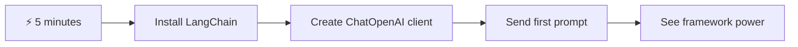
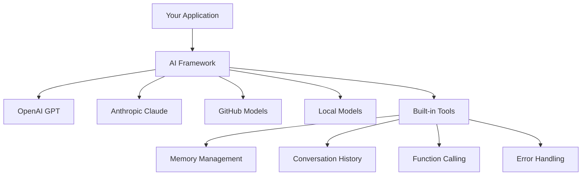
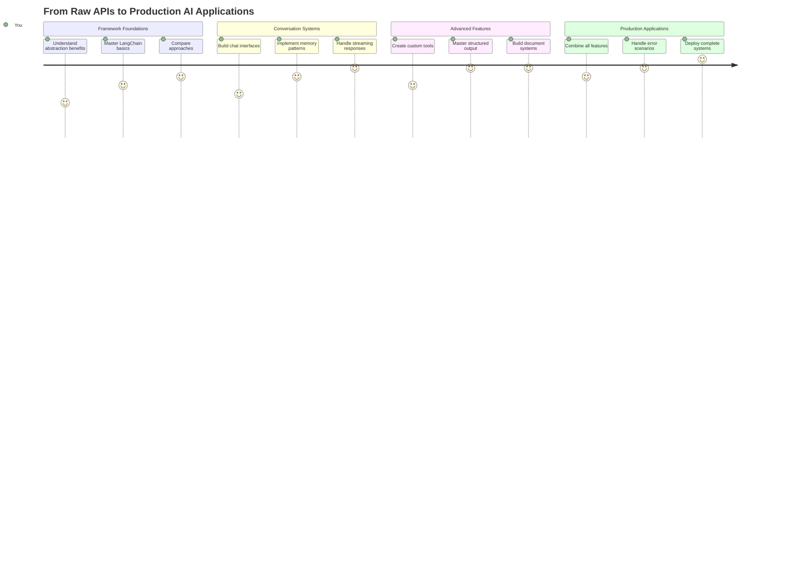
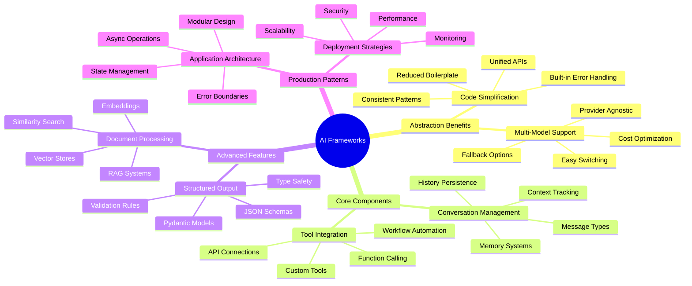
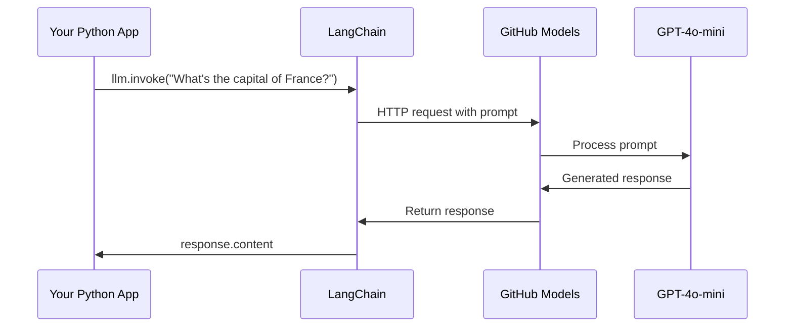
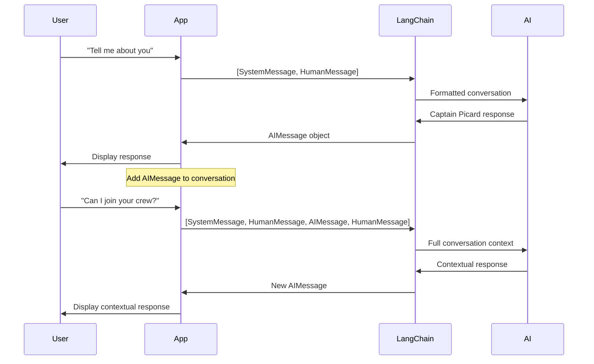
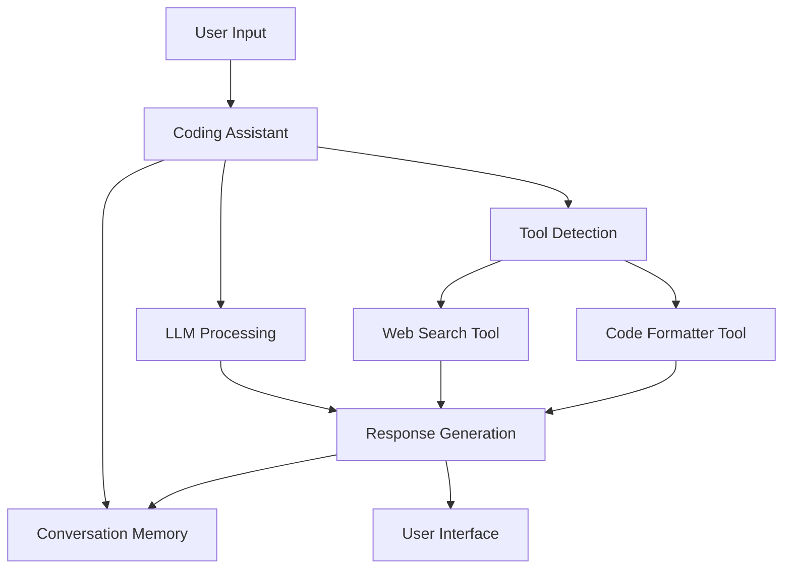
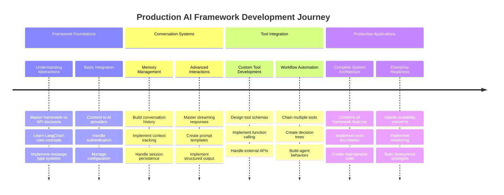
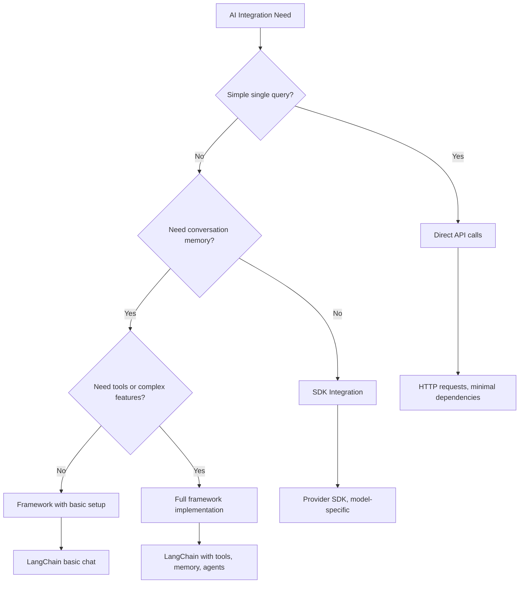

# AIフレームワーク

AIアプリケーションをゼロから構築しようとして圧倒されたことはありませんか？それはあなただけではありません！AIフレームワークは、AI開発のための万能ツールのようなものです。これらは、インテリジェントなアプリケーションを構築する際に時間と手間を節約できる強力なツールです。AIフレームワークをよく整理されたライブラリと考えてみてください。事前に構築されたコンポーネント、標準化されたAPI、スマートな抽象化を提供し、実装の詳細に悩むのではなく問題解決に集中できるようにします。

このレッスンでは、LangChainのようなフレームワークが、以前は複雑だったAI統合タスクをどのようにしてクリーンで読みやすいコードに変えるかを探ります。会話の追跡、ツールの呼び出しの実装、異なるAIモデルを統一されたインターフェースで管理するなど、現実世界の課題に取り組む方法を学びます。

レッスンが終わる頃には、フレームワークを使うべきタイミング、抽象化を効果的に活用する方法、そして現実世界で使えるAIアプリケーションを構築する方法を理解できるようになります。AIフレームワークがあなたのプロジェクトに何をもたらすかを探ってみましょう。

## ⚡ 次の5分間でできること

**忙しい開発者向けのクイックスタートガイド**



- **1分目**: LangChainをインストール: `pip install langchain langchain-openai`
- **2分目**: GitHubトークンを設定し、ChatOpenAIクライアントをインポート
- **3分目**: システムメッセージと人間のメッセージを使った簡単な会話を作成
- **4分目**: 基本的なツール（例えば加算関数）を追加し、AIツール呼び出しを確認
- **5分目**: 生のAPI呼び出しとフレームワーク抽象化の違いを体験

**クイックテストコード**:
```python
from langchain_openai import ChatOpenAI
from langchain_core.messages import SystemMessage, HumanMessage

llm = ChatOpenAI(
    api_key=os.environ["GITHUB_TOKEN"],
    base_url="https://models.github.ai/inference",
    model="openai/gpt-4o-mini"
)

response = llm.invoke([
    SystemMessage(content="You are a helpful coding assistant"),
    HumanMessage(content="Explain Python functions briefly")
])
print(response.content)
```

**なぜ重要か**: 5分で、AIフレームワークが複雑なAI統合をシンプルなメソッド呼び出しに変える様子を体験できます。これが、実際のAIアプリケーションを支える基盤です。

## なぜフレームワークを選ぶのか？

AIアプリを構築する準備ができたら素晴らしいですね！でも、ここで問題があります。いくつかの異なる方法があり、それぞれに利点と欠点があります。歩く、自転車に乗る、車を運転するのを選ぶようなもので、どれも目的地に到達できますが、経験（と努力）は全く異なります。

AIをプロジェクトに統合する主な方法を3つに分けてみましょう：

| アプローチ | 利点 | 最適な用途 | 注意点 |
|----------|------------|----------|--------------|
| **直接HTTPリクエスト** | 完全な制御、依存関係なし | シンプルなクエリ、基本の学習 | 冗長なコード、手動でのエラー処理 |
| **SDK統合** | ボイラープレートが少ない、モデル特化の最適化 | 単一モデルアプリケーション | 特定のプロバイダーに限定 |
| **AIフレームワーク** | 統一されたAPI、組み込み抽象化 | 複数モデルアプリ、複雑なワークフロー | 学習曲線、過剰な抽象化の可能性 |

### 実践でのフレームワークの利点



**フレームワークが重要な理由:**
- **複数のAIプロバイダー**を1つのインターフェースで統一
- **会話の記憶**を自動的に管理
- **埋め込みや関数呼び出し**などの一般的なタスクに対応するツールを提供
- **エラー処理と再試行ロジック**を管理
- **複雑なワークフロー**を読みやすいメソッド呼び出しに変換

> 💡 **プロのヒント**: 異なるAIモデルを切り替えたり、エージェント、メモリ、ツール呼び出しなどの複雑な機能を構築する場合はフレームワークを使用してください。基本を学んだり、シンプルで焦点を絞ったアプリケーションを構築する場合は直接APIを使用するのが良いでしょう。

**結論**: 職人の専門的なツールと完全な作業場を選ぶように、タスクに合わせてツールを選ぶことが重要です。フレームワークは複雑で機能豊富なアプリケーションに優れていますが、直接APIはシンプルなユースケースに適しています。

## 🗺️ AIフレームワーク習得の学習旅



**学習の目的地**: このレッスンの終わりまでに、AIフレームワーク開発を習得し、商業用AIアシスタントに匹敵する洗練された実用的なAIアプリケーションを構築できるようになります。

## はじめに

このレッスンでは以下を学びます：

- 一般的なAIフレームワークの使用方法
- チャット会話、ツール使用、メモリとコンテキストなどの一般的な問題への対処
- これを活用してAIアプリを構築する方法

## 🧠 AIフレームワーク開発エコシステム



**基本原則**: AIフレームワークは複雑さを抽象化しながら、会話管理、ツール統合、文書処理のための強力な抽象化を提供し、開発者がクリーンで保守可能なコードで洗練されたAIアプリケーションを構築できるようにします。

## 初めてのAIプロンプト

質問を送信して回答を得る最初のAIアプリケーションを作成することで基本を学びましょう。アルキメデスが浴槽で浮力の原理を発見したように、最もシンプルな観察が最も強力な洞察につながることがあります。そしてフレームワークはこれらの洞察を簡単にアクセス可能にします。

### GitHubモデルを使ったLangChainのセットアップ

LangChainを使用してGitHubモデルに接続します。これにより、さまざまなAIモデルに無料でアクセスできます。最良の部分は、いくつかの簡単な設定パラメータだけで始められることです：

```python
from langchain_openai import ChatOpenAI
import os

llm = ChatOpenAI(
    api_key=os.environ["GITHUB_TOKEN"],
    base_url="https://models.github.ai/inference",
    model="openai/gpt-4o-mini",
)

# Send a simple prompt
response = llm.invoke("What's the capital of France?")
print(response.content)
```

**ここで何が起きているかを分解してみましょう:**
- **LangChainクライアントを作成**: `ChatOpenAI`クラスを使用してAIへのゲートウェイを作成
- **GitHubモデルへの接続を設定**: 認証トークンを使用
- **使用するAIモデルを指定**: (`gpt-4o-mini`) - これはAIアシスタントを選ぶようなもの
- **質問を送信**: `invoke()`メソッドを使用して魔法が始まる
- **応答を抽出して表示**: そして、AIとの会話が始まります！

> 🔧 **セットアップ注意**: GitHub Codespacesを使用している場合、`GITHUB_TOKEN`はすでに設定されています！ローカルで作業している場合は、適切な権限を持つ個人アクセストークンを作成する必要があります。

**期待される出力:**
```text
The capital of France is Paris.
```



## 会話型AIの構築

最初の例は基本を示していますが、それは単一のやり取りだけです。質問をして答えを得るだけで終わります。実際のアプリケーションでは、AIが何を話していたかを覚えていることが重要です。これは、ワトソンとホームズが調査会話を時間をかけて構築した方法に似ています。

LangChainが特に役立つのはこの部分です。異なるメッセージタイプを提供し、会話を構造化し、AIに個性を与えることができます。コンテキストとキャラクターを維持するチャット体験を構築することができます。

### メッセージタイプの理解

これらのメッセージタイプを会話の中で参加者がかぶる「帽子」と考えてみてください。LangChainは、誰が何を言っているかを追跡するために異なるメッセージクラスを使用します：

| メッセージタイプ | 目的 | 使用例 |
|--------------|---------|------------------|
| `SystemMessage` | AIの個性と行動を定義 | "あなたは役立つコーディングアシスタントです" |
| `HumanMessage` | ユーザー入力を表す | "関数の仕組みを説明してください" |
| `AIMessage` | AIの応答を保存 | 会話内の以前のAI応答 |

### 初めての会話を作成

AIが特定の役割を担う会話を作成してみましょう。キャプテン・ピカードのような外交的な知恵とリーダーシップを持つキャラクターを体現させます：

```python
messages = [
    SystemMessage(content="You are Captain Picard of the Starship Enterprise"),
    HumanMessage(content="Tell me about you"),
]
```

**この会話設定を分解してみましょう:**
- **AIの役割と個性を確立**: `SystemMessage`を通じて
- **初期のユーザークエリを提供**: `HumanMessage`を使用
- **マルチターン会話の基盤を作成**

この例の完全なコードは以下のようになります：

```python
from langchain_core.messages import HumanMessage, SystemMessage
from langchain_openai import ChatOpenAI
import os

llm = ChatOpenAI(
    api_key=os.environ["GITHUB_TOKEN"],
    base_url="https://models.github.ai/inference",
    model="openai/gpt-4o-mini",
)

messages = [
    SystemMessage(content="You are Captain Picard of the Starship Enterprise"),
    HumanMessage(content="Tell me about you"),
]


# works
response  = llm.invoke(messages)
print(response.content)
```

以下のような結果が得られるはずです：

```text
I am Captain Jean-Luc Picard, the commanding officer of the USS Enterprise (NCC-1701-D), a starship in the United Federation of Planets. My primary mission is to explore new worlds, seek out new life and new civilizations, and boldly go where no one has gone before. 

I believe in the importance of diplomacy, reason, and the pursuit of knowledge. My crew is diverse and skilled, and we often face challenges that test our resolve, ethics, and ingenuity. Throughout my career, I have encountered numerous species, grappled with complex moral dilemmas, and have consistently sought peaceful solutions to conflicts.

I hold the ideals of the Federation close to my heart, believing in the importance of cooperation, understanding, and respect for all sentient beings. My experiences have shaped my leadership style, and I strive to be a thoughtful and just captain. How may I assist you further?
```

会話の継続性を維持するためには（毎回コンテキストをリセットするのではなく）、応答をメッセージリストに追加し続ける必要があります。世代を超えて物語を保存する口承伝統のように、このアプローチは持続的な記憶を構築します：

```python
from langchain_core.messages import HumanMessage, SystemMessage
from langchain_openai import ChatOpenAI
import os

llm = ChatOpenAI(
    api_key=os.environ["GITHUB_TOKEN"],
    base_url="https://models.github.ai/inference",
    model="openai/gpt-4o-mini",
)

messages = [
    SystemMessage(content="You are Captain Picard of the Starship Enterprise"),
    HumanMessage(content="Tell me about you"),
]


# works
response  = llm.invoke(messages)

print(response.content)

print("---- Next ----")

messages.append(response)
messages.append(HumanMessage(content="Now that I know about you, I'm Chris, can I be in your crew?"))

response  = llm.invoke(messages)

print(response.content)

```

すごいですよね？ここで起きているのは、最初は初期の2つのメッセージだけでLLMを呼び出し、次に完全な会話履歴で再度呼び出していることです。まるでAIが実際に私たちのチャットを追っているかのようです！

このコードを実行すると、次のような2回目の応答が得られるでしょう：

```text
Welcome aboard, Chris! It's always a pleasure to meet those who share a passion for exploration and discovery. While I cannot formally offer you a position on the Enterprise right now, I encourage you to pursue your aspirations. We are always in need of talented individuals with diverse skills and backgrounds. 

If you are interested in space exploration, consider education and training in the sciences, engineering, or diplomacy. The values of curiosity, resilience, and teamwork are crucial in Starfleet. Should you ever find yourself on a starship, remember to uphold the principles of the Federation: peace, understanding, and respect for all beings. Your journey can lead you to remarkable adventures, whether in the stars or on the ground. Engage!
```



それは「たぶん」と受け取っておきます ;)

## ストリーミング応答

ChatGPTがリアルタイムで応答を「タイプ」しているように見えることに気づいたことはありませんか？それがストリーミングの仕組みです。熟練した書道家が文字を一筆一筆描く様子を見るように、ストリーミングはインタラクションをより自然に感じさせ、即時のフィードバックを提供します。

### LangChainでストリーミングを実装

```python
from langchain_openai import ChatOpenAI
import os

llm = ChatOpenAI(
    api_key=os.environ["GITHUB_TOKEN"],
    base_url="https://models.github.ai/inference",
    model="openai/gpt-4o-mini",
    streaming=True
)

# Stream the response
for chunk in llm.stream("Write a short story about a robot learning to code"):
    print(chunk.content, end="", flush=True)
```

**ストリーミングが素晴らしい理由:**
- **作成中のコンテンツを表示**: もう不自然な待ち時間はありません！
- **何かが実際に起きていると感じさせる**
- **技術的には速くなくても**、より速く感じる
- **AIが「考えている」間に**ユーザーが読み始められる

> 💡 **ユーザー体験のヒント**: ストリーミングは、コードの説明、創造的な文章、詳細なチュートリアルなど、長い応答を扱う場合に特に効果を発揮します。ユーザーは空白の画面を見つめる代わりに進行状況を見るのが好きです！

### 🎯 教育的チェックイン: フレームワーク抽象化の利点

**一時停止して振り返る**: AIフレームワーク抽象化の力を体験しました。これまでのレッスンで学んだ生のAPI呼び出しと比較してみてください。

**自己評価**:
- LangChainが手動のメッセージ追跡と比較して会話管理をどのように簡素化するか説明できますか？
- `invoke()`メソッドと`stream()`メソッドの違いは何ですか？それぞれどのような場合に使用しますか？
- フレームワークのメッセージタイプシステムがコードの整理をどのように改善するか理解していますか？

**現実世界との接続**: 学んだ抽象化パターン（メッセージタイプ、ストリーミングインターフェース、会話メモリ）は、ChatGPTのインターフェースからGitHub Copilotのコード支援まで、すべての主要なAIアプリケーションで使用されています。プロのAI開発チームが使用するのと同じアーキテクチャパターンを習得しています。

**チャレンジ質問**: 異なるAIモデルプロバイダー（OpenAI、Anthropic、Google）を単一のインターフェースで扱うフレームワーク抽象化を設計するにはどうすればよいでしょうか？その利点とトレードオフを考えてみてください。

## プロンプトテンプレート

プロンプトテンプレートは、古典的な雄弁術で使用される修辞構造のようなものです。例えば、キケロが異なる聴衆に合わせてスピーチパターンを適応させながら、同じ説得力のある枠組みを維持したように、テンプレートを設定すれば、情報の異なる部分を入れ替えるだけで、すべてを一から書き直す必要がなくなります。

### 再利用可能なプロンプトの作成

```python
from langchain_core.prompts import ChatPromptTemplate

# Define a template for code explanations
template = ChatPromptTemplate.from_messages([
    ("system", "You are an expert programming instructor. Explain concepts clearly with examples."),
    ("human", "Explain {concept} in {language} with a practical example for {skill_level} developers")
])

# Use the template with different values
questions = [
    {"concept": "functions", "language": "JavaScript", "skill_level": "beginner"},
    {"concept": "classes", "language": "Python", "skill_level": "intermediate"},
    {"concept": "async/await", "language": "JavaScript", "skill_level": "advanced"}
]

for question in questions:
    prompt = template.format_messages(**question)
    response = llm.invoke(prompt)
    print(f"Topic: {question['concept']}\n{response.content}\n---\n")
```

**テンプレートを使用する理由:**
- **アプリ全体でプロンプトを一貫性のあるものに保つ**
- **面倒な文字列結合はもう不要**: シンプルな変数だけ
- **AIの挙動が予測可能**: 構造が変わらないため
- **更新が簡単**: テンプレートを一度変更すれば、すべてが修正される

## 構造化された出力

AI応答が非構造化テキストとして返ってくるのにイライラしたことはありませんか？構造化された出力は、リンネが生物分類の体系的なアプローチを教えたように、整理され予測可能で扱いやすいものです。JSON、特定のデータ構造、または必要な形式をリクエストできます。

### 出力スキーマの定義

```python
from langchain_core.prompts import ChatPromptTemplate
from langchain_core.output_parsers import JsonOutputParser
from pydantic import BaseModel, Field

class CodeReview(BaseModel):
    score: int = Field(description="Code quality score from 1-10")
    strengths: list[str] = Field(description="List of code strengths")
    improvements: list[str] = Field(description="List of suggested improvements")
    overall_feedback: str = Field(description="Summary feedback")

# Set up the parser
parser = JsonOutputParser(pydantic_object=CodeReview)

# Create prompt with format instructions
prompt = ChatPromptTemplate.from_messages([
    ("system", "You are a code reviewer. {format_instructions}"),
    ("human", "Review this code: {code}")
])

# Format the prompt with instructions
chain = prompt | llm | parser

# Get structured response
code_sample = """
def calculate_average(numbers):
    return sum(numbers) / len(numbers)
"""

result = chain.invoke({
    "code": code_sample,
    "format_instructions": parser.get_format_instructions()
})

print(f"Score: {result['score']}")
print(f"Strengths: {', '.join(result['strengths'])}")
```

**構造化された出力が画期的な理由:**
- **どんな形式が返ってくるかを推測する必要がない**: 毎回一貫性がある
- **データベースやAPIに直接接続可能**: 追加作業不要
- **奇妙なAI応答をキャッチ**: アプリが壊れる前に
- **コードがよりクリーンに**: 正確に何を扱っているかが分かる

## ツール呼び出し

ここで最も強力な機能の1つに到達します：ツールです。これにより、AIに会話以外の実用的な能力を与えることができます。中世のギルドが特定の工芸品のために専門的なツールを開発したように、AIに焦点を絞った道具を装備できます。利用可能なツールを説明し、誰かがそれに一致するものを要求すると、AIが行動を起こすことができます。

### Pythonを使用する

以下のようにツールを追加してみましょう：

```python
from typing_extensions import Annotated, TypedDict

class add(TypedDict):
    """Add two integers."""

    # Annotations must have the type and can optionally include a default value and description (in that order).
    a: Annotated[int, ..., "First integer"]
    b: Annotated[int, ..., "Second integer"]

tools = [add]

functions = {
    "add": lambda a, b: a + b
}
```

ここで何が起きているのでしょうか？`add`というツールの設計図を作成しています。`TypedDict`を継承し、`Annotated`型を使用して`a`と`b`を指定することで、このツールが何をするのか、何が必要なのかをLLMに明確に伝えています。`functions`辞書は私たちのツールボックスのような
数字を追加することで概念を示すことはできますが、実際のツールは通常、ウェブAPIを呼び出すなど、より複雑な操作を行います。例を拡張して、AIがインターネットからコンテンツを取得するようにしてみましょう。これは、かつて電信技師が遠隔地を接続していた方法に似ています。

```python
class joke(TypedDict):
    """Tell a joke."""

    # Annotations must have the type and can optionally include a default value and description (in that order).
    category: Annotated[str, ..., "The joke category"]

def get_joke(category: str) -> str:
    response = requests.get(f"https://api.chucknorris.io/jokes/random?category={category}", headers={"Accept": "application/json"})
    if response.status_code == 200:
        return response.json().get("value", f"Here's a {category} joke!")
    return f"Here's a {category} joke!"

functions = {
    "add": lambda a, b: a + b,
    "joke": lambda category: get_joke(category)
}

query = "Tell me a joke about animals"

# the rest of the code is the same
```

このコードを実行すると、次のような応答が得られます。

```text
TOOL CALL:  Chuck Norris once rode a nine foot grizzly bear through an automatic car wash, instead of taking a shower.
CONTENT:  
```

```mermaid
flowchart TD
    A[User Query: "Tell me a joke about animals"] --> B[LangChain Analysis]
    B --> C{Tool Available?}
    C -->|Yes| D[Select joke tool]
    C -->|No| E[Generate direct response]
    
    D --> F[Extract Parameters]
    F --> G[Call joke(category="animals")]
    G --> H[API Request to chucknorris.io]
    H --> I[Return joke content]
    I --> J[Display to user]
    
    E --> K[AI-generated response]
    K --> J
    
    subgraph "Tool Definition Layer"
        L[TypedDict Schema]
        M[Function Implementation]
        N[Parameter Validation]
    end
    
    D --> L
    F --> N
    G --> M
```

以下はコード全体です。

```python
from langchain_openai import ChatOpenAI
import requests
import os
from typing_extensions import Annotated, TypedDict

class add(TypedDict):
    """Add two integers."""

    # Annotations must have the type and can optionally include a default value and description (in that order).
    a: Annotated[int, ..., "First integer"]
    b: Annotated[int, ..., "Second integer"]

class joke(TypedDict):
    """Tell a joke."""

    # Annotations must have the type and can optionally include a default value and description (in that order).
    category: Annotated[str, ..., "The joke category"]

tools = [add, joke]

def get_joke(category: str) -> str:
    response = requests.get(f"https://api.chucknorris.io/jokes/random?category={category}", headers={"Accept": "application/json"})
    if response.status_code == 200:
        return response.json().get("value", f"Here's a {category} joke!")
    return f"Here's a {category} joke!"

functions = {
    "add": lambda a, b: a + b,
    "joke": lambda category: get_joke(category)
}

llm = ChatOpenAI(
    api_key=os.environ["GITHUB_TOKEN"],
    base_url="https://models.github.ai/inference",
    model="openai/gpt-4o-mini",
)

llm_with_tools = llm.bind_tools(tools)

query = "Tell me a joke about animals"

res = llm_with_tools.invoke(query)
if(res.tool_calls):
    for tool in res.tool_calls:
        # print("TOOL CALL: ", tool)
        print("TOOL CALL: ", functions[tool["name"]](../../../10-ai-framework-project/**tool["args"]))
print("CONTENT: ",res.content)
```

## 埋め込みとドキュメント処理

埋め込みは、現代AIにおける最も洗練された解決策の1つです。任意のテキストを数値座標に変換し、その意味を捉えることができると想像してください。それが埋め込みの役割です。テキストを多次元空間の点に変換し、類似した概念が集まるようにします。これは、メンデレーエフが原子の性質によって周期表を整理した方法に似ています。

### 埋め込みの作成と使用

```python
from langchain_openai import OpenAIEmbeddings
from langchain_community.vectorstores import FAISS
from langchain_community.document_loaders import TextLoader
from langchain.text_splitter import CharacterTextSplitter

# Initialize embeddings
embeddings = OpenAIEmbeddings(
    api_key=os.environ["GITHUB_TOKEN"],
    base_url="https://models.github.ai/inference",
    model="text-embedding-3-small"
)

# Load and split documents
loader = TextLoader("documentation.txt")
documents = loader.load()

text_splitter = CharacterTextSplitter(chunk_size=1000, chunk_overlap=0)
texts = text_splitter.split_documents(documents)

# Create vector store
vectorstore = FAISS.from_documents(texts, embeddings)

# Perform similarity search
query = "How do I handle user authentication?"
similar_docs = vectorstore.similarity_search(query, k=3)

for doc in similar_docs:
    print(f"Relevant content: {doc.page_content[:200]}...")
```

### 様々な形式のドキュメントローダー

```python
from langchain_community.document_loaders import (
    PyPDFLoader,
    CSVLoader,
    JSONLoader,
    WebBaseLoader
)

# Load different document types
pdf_loader = PyPDFLoader("manual.pdf")
csv_loader = CSVLoader("data.csv")
json_loader = JSONLoader("config.json")
web_loader = WebBaseLoader("https://example.com/docs")

# Process all documents
all_documents = []
for loader in [pdf_loader, csv_loader, json_loader, web_loader]:
    docs = loader.load()
    all_documents.extend(docs)
```

**埋め込みでできること:**
- **検索を構築**: キーワード一致だけでなく、意味を理解する検索を実現
- **AIを作成**: ドキュメントに関する質問に答えるAIを作成
- **推薦システムを作成**: 本当に関連性のあるコンテンツを提案するシステム
- **コンテンツを自動的に整理**: コンテンツを分類し、整理する

```mermaid
flowchart LR
    A[Documents] --> B[Text Splitter]
    B --> C[Create Embeddings]
    C --> D[Vector Store]
    
    E[User Query] --> F[Query Embedding]
    F --> G[Similarity Search]
    G --> D
    D --> H[Relevant Documents]
    H --> I[AI Response]
    
    subgraph "Vector Space"
        J[Document A: [0.1, 0.8, 0.3...]]
        K[Document B: [0.2, 0.7, 0.4...]]
        L[Query: [0.15, 0.75, 0.35...]]
    end
    
    C --> J
    C --> K
    F --> L
    G --> J
    G --> K
```

## 完全なAIアプリケーションの構築

これまで学んだことを統合して、包括的なアプリケーションを構築します。質問に答え、ツールを使用し、会話の記憶を維持するコーディングアシスタントを作成します。印刷機が既存の技術（活字、インク、紙、圧力）を組み合わせて画期的なものを生み出したように、AIコンポーネントを組み合わせて実用的で役立つものを作りましょう。

### 完全なアプリケーション例

```python
from langchain_openai import ChatOpenAI, OpenAIEmbeddings
from langchain_core.prompts import ChatPromptTemplate
from langchain_core.messages import HumanMessage, SystemMessage, AIMessage
from langchain_community.vectorstores import FAISS
from typing_extensions import Annotated, TypedDict
import os
import requests

class CodingAssistant:
    def __init__(self):
        self.llm = ChatOpenAI(
            api_key=os.environ["GITHUB_TOKEN"],
            base_url="https://models.github.ai/inference",
            model="openai/gpt-4o-mini"
        )
        
        self.conversation_history = [
            SystemMessage(content="""You are an expert coding assistant. 
            Help users learn programming concepts, debug code, and write better software.
            Use tools when needed and maintain a helpful, encouraging tone.""")
        ]
        
        # Define tools
        self.setup_tools()
    
    def setup_tools(self):
        class web_search(TypedDict):
            """Search for programming documentation or examples."""
            query: Annotated[str, "Search query for programming help"]
        
        class code_formatter(TypedDict):
            """Format and validate code snippets."""
            code: Annotated[str, "Code to format"]
            language: Annotated[str, "Programming language"]
        
        self.tools = [web_search, code_formatter]
        self.llm_with_tools = self.llm.bind_tools(self.tools)
    
    def chat(self, user_input: str):
        # Add user message to conversation
        self.conversation_history.append(HumanMessage(content=user_input))
        
        # Get AI response
        response = self.llm_with_tools.invoke(self.conversation_history)
        
        # Handle tool calls if any
        if response.tool_calls:
            for tool_call in response.tool_calls:
                tool_result = self.execute_tool(tool_call)
                print(f"🔧 Tool used: {tool_call['name']}")
                print(f"📊 Result: {tool_result}")
        
        # Add AI response to conversation
        self.conversation_history.append(response)
        
        return response.content
    
    def execute_tool(self, tool_call):
        tool_name = tool_call['name']
        args = tool_call['args']
        
        if tool_name == 'web_search':
            return f"Found documentation for: {args['query']}"
        elif tool_name == 'code_formatter':
            return f"Formatted {args['language']} code: {args['code'][:50]}..."
        
        return "Tool execution completed"

# Usage example
assistant = CodingAssistant()

print("🤖 Coding Assistant Ready! Type 'quit' to exit.\n")

while True:
    user_input = input("You: ")
    if user_input.lower() == 'quit':
        break
    
    response = assistant.chat(user_input)
    print(f"🤖 Assistant: {response}\n")
```

**アプリケーションアーキテクチャ:**



**実装した主な機能:**
- **会話全体を記憶**: コンテキストの継続性を確保
- **ツールを通じてアクションを実行**: 単なる会話以上の機能
- **予測可能なインタラクションパターンを遵守**
- **エラーハンドリングと複雑なワークフローを自動管理**

### 🎯 教育的チェックイン: 実用的なAIアーキテクチャ

**アーキテクチャの理解**: 会話管理、ツール呼び出し、構造化ワークフローを組み合わせた完全なAIアプリケーションを構築しました。これは実用的なAIアプリケーション開発を表しています。

**習得した主要な概念**:
- **クラスベースのアーキテクチャ**: 整理された、保守可能なAIアプリケーション構造
- **ツール統合**: 会話以上のカスタム機能
- **メモリ管理**: 持続的な会話コンテキスト
- **エラーハンドリング**: 堅牢なアプリケーション動作

**業界との関連性**: 実装したアーキテクチャパターン（会話クラス、ツールシステム、メモリ管理）は、SlackのAIアシスタント、GitHub Copilot、Microsoft Copilotなどの企業AIアプリケーションで使用されているものと同じです。プロフェッショナルなアーキテクチャ思考で構築しています。

**振り返りの質問**: このアプリケーションを複数のユーザー、永続的なストレージ、外部データベースとの統合に対応するように拡張するにはどうすればよいでしょうか？スケーラビリティと状態管理の課題を考慮してください。

## 課題: AIを活用した学習アシスタントを構築しよう

**目的**: プログラミングの概念を学ぶ手助けをするAIアプリケーションを作成し、説明、コード例、インタラクティブなクイズを提供します。

### 要件

**必須のコア機能:**
1. **会話インターフェース**: 複数の質問にわたるコンテキストを維持するチャットシステムを実装
2. **教育ツール**: 学習を助けるツールを少なくとも2つ作成:
   - コード説明ツール
   - 概念クイズ生成ツール
3. **個別学習**: システムメッセージを使用して異なるスキルレベルに応じた応答を適応
4. **応答のフォーマット**: クイズの質問に対して構造化された出力を実装

### 実装手順

**ステップ1: 環境をセットアップ**
```bash
pip install langchain langchain-openai
```

**ステップ2: 基本的なチャット機能**
- `StudyAssistant`クラスを作成
- 会話メモリを実装
- 教育支援のためのパーソナリティ設定を追加

**ステップ3: 教育ツールを追加**
- **コード説明ツール**: コードを理解しやすい部分に分解
- **クイズ生成ツール**: プログラミング概念に関する質問を作成
- **進捗トラッカー**: カバーしたトピックを追跡

**ステップ4: 拡張機能（オプション）**
- ユーザー体験を向上させるためのストリーミング応答を実装
- コース教材を取り込むためのドキュメントローディングを追加
- 類似性ベースのコンテンツ検索のための埋め込みを作成

### 評価基準

| 機能 | 優秀 (4) | 良好 (3) | 満足 (2) | 改善が必要 (1) |
|------|----------|----------|----------|----------------|
| **会話の流れ** | 自然でコンテキストを意識した応答 | 良好なコンテキスト保持 | 基本的な会話 | 交換間での記憶なし |
| **ツール統合** | 複数の有用なツールがシームレスに動作 | 2つ以上のツールが正しく実装 | 1～2の基本的なツール | ツールが機能しない |
| **コード品質** | クリーンで文書化され、エラーハンドリングあり | 良好な構造、一部文書化 | 基本的な機能が動作 | 構造が悪く、エラーハンドリングなし |
| **教育的価値** | 学習に非常に役立ち、適応的 | 良好な学習支援 | 基本的な説明 | 教育的価値が限定的 |

### サンプルコード構造

```python
class StudyAssistant:
    def __init__(self, skill_level="beginner"):
        # Initialize LLM, tools, and conversation memory
        pass
    
    def explain_code(self, code, language):
        # Tool: Explain how code works
        pass
    
    def generate_quiz(self, topic, difficulty):
        # Tool: Create practice questions
        pass
    
    def chat(self, user_input):
        # Main conversation interface
        pass

# Example usage
assistant = StudyAssistant(skill_level="intermediate")
response = assistant.chat("Explain how Python functions work")
```

**ボーナスチャレンジ:**
- 音声入力/出力機能を追加
- StreamlitまたはFlaskを使用してウェブインターフェースを実装
- 埋め込みを使用してコース教材から知識ベースを作成
- 進捗追跡と個別学習パスを追加

## 📈 AIフレームワーク開発の習得タイムライン



**🎓 卒業マイルストーン**: LangChainを使用してAIフレームワーク開発を成功裏に習得しました。これらのスキルは、現代のAIアプリケーション開発の最前線を代表し、企業向けの高度なインテリジェントシステムを構築する準備が整いました。

**🔄 次のレベルの能力**:
- 高度なAIアーキテクチャ（エージェント、マルチエージェントシステム）の探求準備完了
- ベクトルデータベースを使用したRAGシステムの構築準備完了
- マルチモーダルAIアプリケーションの作成準備完了
- AIアプリケーションのスケーリングと最適化の基盤が整備済み

## まとめ

🎉 LangChainを使用して高度なAIアプリケーションを構築する方法を学び、AIフレームワーク開発の基礎を習得しました。包括的な徒弟制度を完了したように、豊富なスキルセットを獲得しました。これまでの成果を振り返りましょう。

### 学んだこと

**コアフレームワークの概念:**
- **フレームワークの利点**: API呼び出しを直接行うよりもフレームワークを選ぶべき状況の理解
- **LangChainの基本**: AIモデル接続のセットアップと構成
- **メッセージタイプ**: `SystemMessage`、`HumanMessage`、`AIMessage`を使用した構造化された会話

**高度な機能:**
- **ツール呼び出し**: AIの能力を拡張するカスタムツールの作成と統合
- **会話メモリ**: 複数の会話ターンにわたるコンテキストの維持
- **ストリーミング応答**: リアルタイム応答配信の実装
- **プロンプトテンプレート**: 再利用可能で動的なプロンプトの構築
- **構造化出力**: 一貫性のある解析可能なAI応答の確保
- **埋め込み**: セマンティック検索とドキュメント処理機能の作成

**実践的な応用:**
- **完全なアプリの構築**: 複数の機能を統合して実用的なアプリケーションを構築
- **エラーハンドリング**: 堅牢なエラーマネジメントと検証の実装
- **ツール統合**: AIの能力を拡張するカスタムツールの作成

### 重要なポイント

> 🎯 **覚えておくべきこと**: LangChainのようなAIフレームワークは、複雑さを隠し、機能を詰め込んだ頼れる存在です。会話メモリ、ツール呼び出し、複数のAIモデルを扱う必要がある場合に最適です。

**AI統合の意思決定フレームワーク:**



### 次に進むべき道は？

**今すぐ構築を始めましょう:**
- これらの概念を活用して、自分がワクワクするものを作りましょう！
- LangChainを通じてさまざまなAIモデルを試してみてください - AIモデルの遊び場のようなものです
- 自分の仕事やプロジェクトで直面する実際の問題を解決するツールを作りましょう

**次のレベルに進む準備はできていますか？**
- **AIエージェント**: 複雑なタスクを自分で計画し実行できるAIシステムを構築
- **RAG（検索強化生成）**: 自分の知識ベースとAIを組み合わせて強力なアプリケーションを作成
- **マルチモーダルAI**: テキスト、画像、音声を組み合わせて作業 - 可能性は無限大！
- **実用化展開**: AIアプリをスケールさせ、実世界で監視する方法を学ぶ

**コミュニティに参加しましょう:**
- LangChainコミュニティは最新情報を得たり、ベストプラクティスを学ぶのに最適です
- GitHub Modelsは最先端のAI機能にアクセスできるので、実験に最適です
- 様々なユースケースで練習を続けましょう - 各プロジェクトが新しいことを教えてくれます

あなたは今、知的で会話型のアプリケーションを構築し、人々が実際の問題を解決する手助けができる知識を持っています。ルネサンスの職人が芸術的なビジョンと技術的なスキルを組み合わせたように、AIの能力と実用的な応用を融合させることができます。さて、あなたは何を作り出しますか？ 🚀

## GitHub Copilotエージェントチャレンジ 🚀

エージェントモードを使用して以下のチャレンジを完了してください。

**説明:** LangChainの複数の機能（ツール呼び出し、構造化出力、会話メモリなど）を組み合わせた高度なAIコードレビューアシスタントを構築し、コード提出に対して包括的なフィードバックを提供します。

**プロンプト:** 以下を実装するCodeReviewAssistantクラスを作成してください:
1. コードの複雑さを分析し改善を提案するツール
2. コードがベストプラクティスに準拠しているかをチェックするツール
3. 一貫したレビュー形式のためのPydanticモデルを使用した構造化出力
4. レビューセッションを追跡する会話メモリ
5. コード提出を処理し、詳細で実用的なフィードバックを提供するメインチャットインターフェース

このアシスタントは複数のプログラミング言語のコードをレビューでき、セッション内で複数のコード提出にわたるコンテキストを維持し、要約スコアと詳細な改善提案の両方を提供する必要があります。

[エージェントモード](https://code.visualstudio.com/blogs/2025/02/24/introducing-copilot-agent-mode)について詳しくはこちらをご覧ください。

---

**免責事項**:  
この文書はAI翻訳サービス[Co-op Translator](https://github.com/Azure/co-op-translator)を使用して翻訳されています。正確性を追求しておりますが、自動翻訳には誤りや不正確な部分が含まれる可能性があります。元の言語で記載された文書を正式な情報源としてご参照ください。重要な情報については、専門の人間による翻訳を推奨します。この翻訳の使用に起因する誤解や誤解について、当社は責任を負いません。