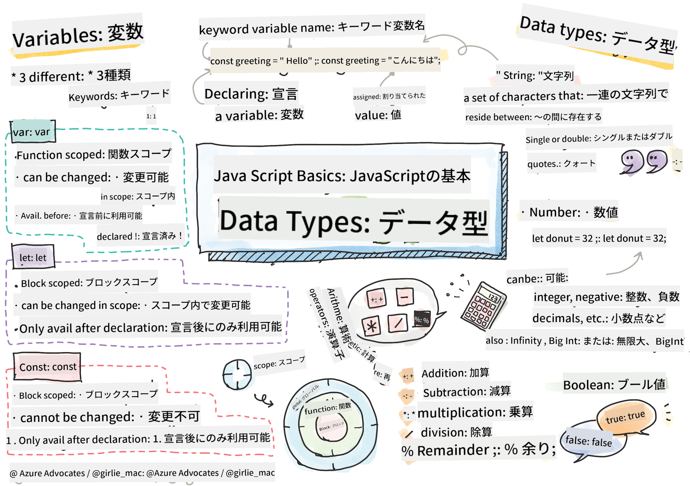

<!--
CO_OP_TRANSLATOR_METADATA:
{
  "original_hash": "b95fdd8310ef467305015ece1b0f9411",
  "translation_date": "2025-08-28T17:55:27+00:00",
  "source_file": "2-js-basics/1-data-types/README.md",
  "language_code": "ja"
}
-->
# JavaScriptの基本: データ型


> スケッチノート: [Tomomi Imura](https://twitter.com/girlie_mac)

## 講義前のクイズ
[講義前のクイズ](https://ff-quizzes.netlify.app/web/)

このレッスンでは、ウェブ上でインタラクティブ性を提供する言語であるJavaScriptの基本を学びます。

> このレッスンは[Microsoft Learn](https://docs.microsoft.com/learn/modules/web-development-101-variables/?WT.mc_id=academic-77807-sagibbon)で受講できます！

[](https://youtube.com/watch?v=JNIXfGiDWM8 "JavaScriptの変数")

[](https://youtube.com/watch?v=AWfA95eLdq8 "JavaScriptのデータ型")

> 🎥 上記の画像をクリックすると、変数とデータ型に関する動画が視聴できます

まずは変数と、それに格納されるデータ型から始めましょう！

## 変数

変数はコード内で使用したり変更したりできる値を格納します。

変数を作成して**宣言**するには、次の構文を使用します: **[キーワード] [名前]**。これは以下の2つの部分で構成されています:

- **キーワード**: キーワードには`let`や`var`が使用できます。

✅ ES6で導入された`let`キーワードは、変数にいわゆる_ブロックスコープ_を与えます。`var`よりも`let`を使用することが推奨されます。ブロックスコープについては後のレッスンで詳しく説明します。
- **変数名**: これは自分で選んだ名前です。

### タスク - 変数を操作する

1. **変数を宣言する**: `let`キーワードを使用して変数を宣言してみましょう:

    ```javascript
    let myVariable;
    ```

   `myVariable`は`let`キーワードを使用して宣言されましたが、現在は値を持っていません。

1. **値を代入する**: `=`演算子を使用して変数に値を格納します。その後に期待される値を記述します。

    ```javascript
    myVariable = 123;
    ```

   > 注意: このレッスンでの`=`の使用は、変数に値を設定するための「代入演算子」を意味します。これは等号を意味するものではありません。

   `myVariable`は現在、値123で*初期化*されています。

1. **リファクタリングする**: 次の文にコードを置き換えてください。

    ```javascript
    let myVariable = 123;
    ```

    上記は_明示的初期化_と呼ばれ、変数が宣言されると同時に値が代入されます。

1. **変数の値を変更する**: 次の方法で変数の値を変更します:

   ```javascript
   myVariable = 321;
   ```

   変数が宣言されると、コード内の任意の時点で`=`演算子と新しい値を使用してその値を変更できます。

   ✅ 試してみましょう！ブラウザでJavaScriptを直接書くことができます。ブラウザウィンドウを開き、開発者ツールに移動してください。コンソールでプロンプトが表示されます。`let myVariable = 123`と入力してリターンキーを押し、その後`myVariable`と入力してください。何が起こりますか？これらの概念については後のレッスンでさらに学びます。

## 定数

定数の宣言と初期化は変数と同じ概念に従いますが、`const`キーワードを使用する点が異なります。定数は通常、すべて大文字で宣言されます。

```javascript
const MY_VARIABLE = 123;
```

定数は変数と似ていますが、以下の2つの例外があります:

- **値が必要**: 定数は初期化されていないとエラーが発生します。
- **参照を変更できない**: 定数が初期化されると、その参照を変更することはできず、コード実行時にエラーが発生します。以下の例を見てみましょう:
   - **単純な値**: 次の操作は許可されません:
   
      ```javascript
      const PI = 3;
      PI = 4; // not allowed
      ```
 
   - **オブジェクト参照が保護される**: 次の操作は許可されません:
   
      ```javascript
      const obj = { a: 3 };
      obj = { b: 5 } // not allowed
      ```

    - **オブジェクトの値は保護されない**: 次の操作は許可されます:
    
      ```javascript
      const obj = { a: 3 };
      obj.a = 5;  // allowed
      ```

      上記ではオブジェクトの値を変更していますが、参照自体は変更していないため許可されます。

   > 注意: `const`は参照が再代入から保護されることを意味します。ただし、値が_不変_であるわけではなく、特にオブジェクトのような複雑な構造の場合は変更可能です。

## データ型

変数には、数値やテキストなど、さまざまな種類の値を格納できます。これらのさまざまな種類の値は**データ型**として知られています。データ型はソフトウェア開発において重要な部分であり、コードの書き方やソフトウェアの動作方法に関する決定を助けます。さらに、一部のデータ型には、値を変換したり追加情報を抽出したりするためのユニークな機能があります。

✅ データ型はJavaScriptのデータプリミティブとも呼ばれ、言語によって提供される最も低レベルのデータ型です。プリミティブデータ型は7種類あります: string, number, bigint, boolean, undefined, null, symbol。それぞれが何を表しているかをイメージしてみてください。`zebra`とは何でしょう？`0`は？`true`は？

### 数値

前のセクションでは、`myVariable`の値が数値データ型でした。

`let myVariable = 123;`

変数には、小数や負の数を含むすべての種類の数値を格納できます。数値はまた、[次のセクション](../../../../2-js-basics/1-data-types)で説明する算術演算子とともに使用できます。

### 算術演算子

算術関数を実行する際に使用できる演算子にはいくつかの種類があり、以下にその一部を示します:

| 記号   | 説明                                                                   | 例                              |
| ------ | ---------------------------------------------------------------------- | -------------------------------- |
| `+`    | **加算**: 2つの数値の合計を計算します                                  | `1 + 2 //期待される答えは3`      |
| `-`    | **減算**: 2つの数値の差を計算します                                    | `1 - 2 //期待される答えは-1`     |
| `*`    | **乗算**: 2つの数値の積を計算します                                    | `1 * 2 //期待される答えは2`      |
| `/`    | **除算**: 2つの数値の商を計算します                                    | `1 / 2 //期待される答えは0.5`    |
| `%`    | **剰余**: 2つの数値の除算から得られる余りを計算します                  | `1 % 2 //期待される答えは1`      |

✅ 試してみましょう！ブラウザのコンソールで算術演算を試してみてください。結果に驚きましたか？

### 文字列

文字列は、シングルクォートまたはダブルクォートで囲まれた文字のセットです。

- `'これは文字列です'`
- `"これも文字列です"`
- `let myString = 'これは変数に格納された文字列値です';`

文字列を書く際にはクォートを使用することを忘れないでください。そうしないと、JavaScriptはそれを変数名とみなしてしまいます。

### 文字列のフォーマット

文字列はテキストであり、時にはフォーマットが必要になります。

2つ以上の文字列を**結合**するには、`+`演算子を使用します。

```javascript
let myString1 = "Hello";
let myString2 = "World";

myString1 + myString2 + "!"; //HelloWorld!
myString1 + " " + myString2 + "!"; //Hello World!
myString1 + ", " + myString2 + "!"; //Hello, World!

```

✅ なぜJavaScriptでは`1 + 1 = 2`ですが、`'1' + '1' = 11`になるのでしょう？考えてみてください。では`'1' + 1`はどうでしょう？

**テンプレートリテラル**は文字列をフォーマットするもう一つの方法で、クォートの代わりにバックティックを使用します。プレーンテキスト以外のものはすべて`${ }`内に配置する必要があります。これには文字列である可能性のある変数も含まれます。

```javascript
let myString1 = "Hello";
let myString2 = "World";

`${myString1} ${myString2}!` //Hello World!
`${myString1}, ${myString2}!` //Hello, World!
```

どちらの方法でもフォーマットの目標を達成できますが、テンプレートリテラルはスペースや改行を尊重します。

✅ テンプレートリテラルとプレーン文字列を使い分けるのはどんな場合でしょう？

### ブール値

ブール値は`true`または`false`の2つの値のみを持つことができます。ブール値は、特定の条件が満たされた場合にどのコード行を実行するかを決定するのに役立ちます。多くの場合、[演算子](../../../../2-js-basics/1-data-types)がブール値の設定を助け、変数が初期化されたりその値が更新されたりする際に頻繁に使用されます。

- `let myTrueBool = true`
- `let myFalseBool = false`

✅ 変数は、ブール値`true`に評価される場合「truthy」と見なされます。興味深いことに、JavaScriptでは[明示的にfalsyと定義されていない限り、すべての値はtruthy](https://developer.mozilla.org/docs/Glossary/Truthy)です。

---

## 🚀 チャレンジ

JavaScriptは時折、データ型の扱い方が驚くべき方法で知られています。これらの「落とし穴」について少し調べてみましょう。例えば: 大文字小文字の区別が問題になることがあります！コンソールで次を試してみてください: `let age = 1; let Age = 2; age == Age`（結果は`false`になります -- なぜでしょう？）。他にどんな落とし穴が見つかりますか？

## 講義後のクイズ
[講義後のクイズ](https://ff-quizzes.netlify.app)

## 復習と自己学習

[JavaScriptの練習問題リスト](https://css-tricks.com/snippets/javascript/)を見て、1つ試してみてください。何を学びましたか？

## 課題

[データ型の練習](assignment.md)

---

**免責事項**:  
この文書は、AI翻訳サービス [Co-op Translator](https://github.com/Azure/co-op-translator) を使用して翻訳されています。正確性を追求しておりますが、自動翻訳には誤りや不正確な部分が含まれる可能性があります。元の言語で記載された文書を正式な情報源としてお考えください。重要な情報については、専門の人間による翻訳を推奨します。この翻訳の使用に起因する誤解や誤解釈について、当社は責任を負いません。