<!--
CO_OP_TRANSLATOR_METADATA:
{
  "original_hash": "672b0bb6e8b431075f3bdb7130590d2d",
  "translation_date": "2025-11-06T12:24:55+00:00",
  "source_file": "2-js-basics/1-data-types/README.md",
  "language_code": "ja"
}
-->
# JavaScriptの基本: データ型


> スケッチノート: [Tomomi Imura](https://twitter.com/girlie_mac)

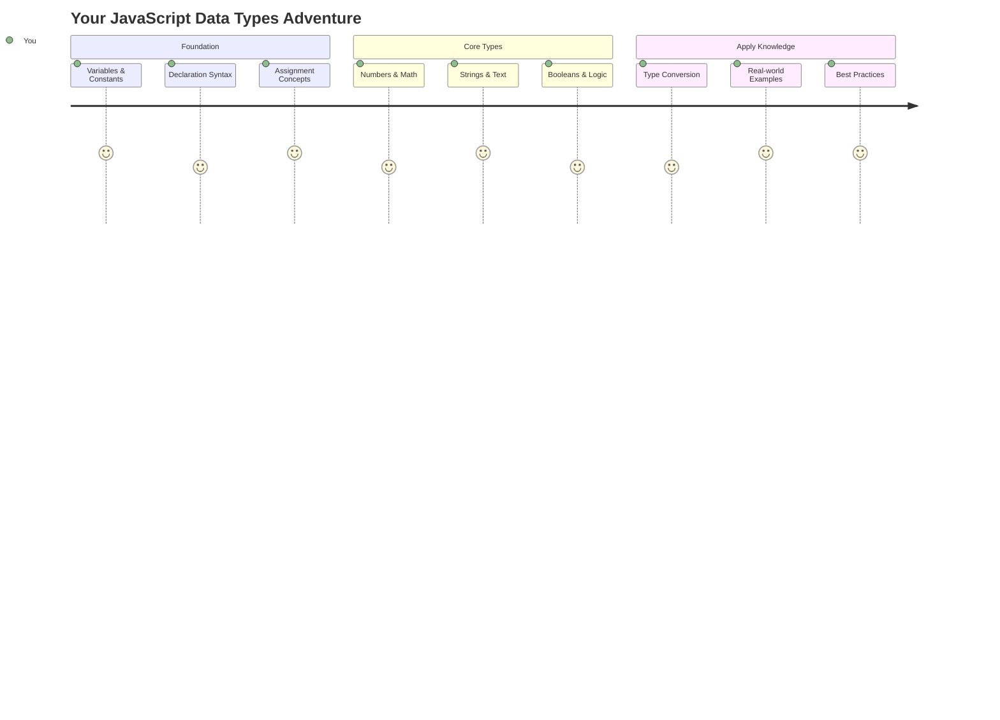

データ型は、JavaScriptの基本概念の一つであり、どんなプログラムを書いても必ず遭遇するものです。データ型を、古代アレクサンドリアの図書館員が詩、数学、歴史の記録を分類していたファイリングシステムのようなものだと考えてみてください。JavaScriptも情報を異なる種類のデータに応じて整理します。

このレッスンでは、JavaScriptを動かすための主要なデータ型について学びます。数値、テキスト、真偽値の扱い方を学び、正しい型を選ぶことがプログラムにとってなぜ重要なのかを理解します。これらの概念は最初は抽象的に感じるかもしれませんが、練習を重ねることで自然に身につくようになります。

データ型を理解することで、JavaScriptの他の部分がより明確になります。建築家が大聖堂を建てる前に異なる建材を理解する必要があるように、これらの基本は今後あなたが構築するすべてを支えるものとなります。

## レクチャー前のクイズ
[レクチャー前のクイズ](https://ff-quizzes.netlify.app/web/)

このレッスンでは、ウェブ上でインタラクティブ性を提供する言語であるJavaScriptの基本を扱います。

> このレッスンは[Microsoft Learn](https://docs.microsoft.com/learn/modules/web-development-101-variables/?WT.mc_id=academic-77807-sagibbon)で受講できます！

[](https://youtube.com/watch?v=JNIXfGiDWM8 "JavaScriptの変数")

[](https://youtube.com/watch?v=AWfA95eLdq8 "JavaScriptのデータ型")

> 🎥 上記の画像をクリックして、変数とデータ型に関する動画をご覧ください

では、変数とそれを構成するデータ型について始めましょう！

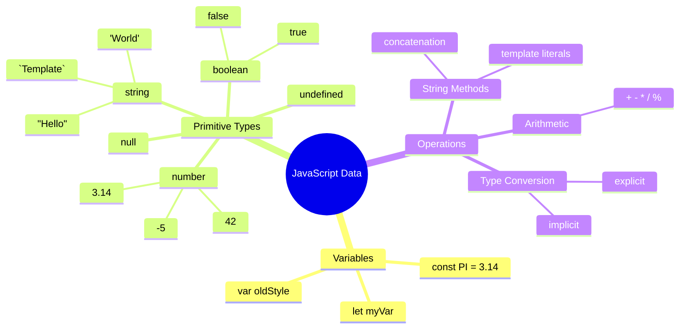

## 変数

変数はプログラミングの基本的な構成要素です。中世の錬金術師が異なる物質を保存するためにラベル付きの瓶を使ったように、変数は情報を保存し、それに説明的な名前を付けて後で参照できるようにします。誰かの年齢を覚えておく必要がありますか？それを`age`という変数に保存しましょう。ユーザーの名前を追跡したいですか？それを`userName`という変数に保存してください。

ここでは、JavaScriptで変数を作成する最新の方法に焦点を当てます。ここで学ぶ技術は、言語の進化とプログラミングコミュニティによって開発されたベストプラクティスを反映しています。

変数を**宣言**するには、次の構文を使用します **[キーワード] [名前]**。これは以下の2つの部分で構成されています：

- **キーワード**: 変更可能な変数には`let`を使用し、変更されない値には`const`を使用します。
- **変数名**: これは自分で選ぶ説明的な名前です。

✅ ES6で導入されたキーワード`let`は、変数にいわゆる_ブロックスコープ_を与えます。`let`や`const`を使用することが推奨されており、古い`var`キーワードの代わりに使います。ブロックスコープについては、今後のレッスンで詳しく説明します。

### タスク - 変数を扱う

1. **変数を宣言する**: まず最初の変数を作成してみましょう：

    ```javascript
    let myVariable;
    ```

   **これが達成すること:**
   - JavaScriptに`myVariable`という名前の保存場所を作成するよう指示します
   - JavaScriptがこの変数のためにメモリ空間を割り当てます
   - 現時点では変数に値が設定されていません（undefined）

2. **値を与える**: 次に、変数に何かを入れてみましょう：

    ```javascript
    myVariable = 123;
    ```

   **代入の仕組み:**
   - `=`演算子が値123を変数に代入します
   - 変数は現在この値を保持しており、undefinedではなくなります
   - コード全体で`myVariable`を使用してこの値を参照できます

   > 注: このレッスンでの`=`の使用は、変数に値を設定するための「代入演算子」を意味します。これは等号を意味するものではありません。

3. **賢いやり方をする**: 実際には、これら2つのステップを組み合わせましょう：

    ```javascript
    let myVariable = 123;
    ```

    **この方法はより効率的です:**
    - 変数を宣言し、値を1つのステートメントで代入します
    - これは開発者の間で標準的な方法です
    - コードの長さを短縮しつつ、明確さを維持します

4. **気が変わった場合**: 別の数字を保存したい場合はどうしますか？

   ```javascript
   myVariable = 321;
   ```

   **再代入の理解:**
   - 変数は現在321を保持しており、以前の123は置き換えられます
   - 変数は一度に1つの値しか保持できません
   - これは`let`で宣言された変数の重要な特徴です

   ✅ 試してみましょう！ブラウザでJavaScriptを直接書くことができます。ブラウザウィンドウを開き、開発者ツールに移動してください。コンソールでプロンプトが表示されます。`let myVariable = 123`と入力してリターンキーを押し、その後`myVariable`と入力してください。何が起こりますか？これらの概念については、次のレッスンでさらに学びます。

### 🧠 **変数の習得チェック: 慣れるために**

**変数についての理解を確認しましょう:**
- 変数を宣言することと代入することの違いを説明できますか？
- 宣言する前に変数を使用しようとするとどうなりますか？
- 変数に`let`を選ぶべき場合と`const`を選ぶべき場合はいつですか？

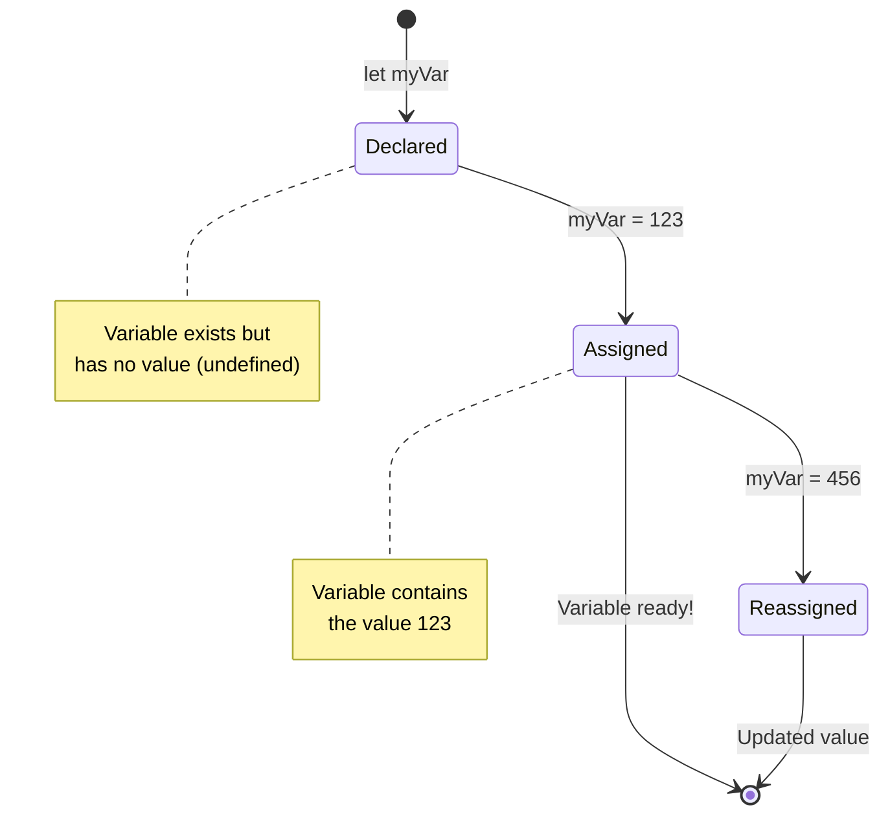

> **簡単なヒント**: 変数をラベル付きの収納ボックスと考えてみてください。ボックスを作成する（`let`）、何かを入れる（`=`）、必要に応じて中身を後で交換することができます！

## 定数

プログラムの実行中に決して変更されるべきでない情報を保存する必要がある場合があります。定数は、古代ギリシャのユークリッドが確立した数学的原則のようなものです。一度証明され文書化されると、将来のすべての参照において固定されたままです。

定数は変数と似ていますが、重要な制限があります。一度値を代入すると、それを変更することはできません。この不変性は、プログラム内の重要な値を偶発的な変更から防ぐのに役立ちます。

定数の宣言と初期化は、変数と同じ概念に従いますが、`const`キーワードを使用する点が異なります。定数は通常、すべて大文字で宣言されます。

```javascript
const MY_VARIABLE = 123;
```

**このコードが行うこと:**
- **定数**`MY_VARIABLE`を値123で作成します
- **大文字の命名規則**を定数に使用します
- **将来の変更を防止**します

定数には2つの主なルールがあります：

- **すぐに値を与える必要があります** – 空の定数は許可されません！
- **その値を変更することはできません** – 再代入を試みるとJavaScriptはエラーを投げます。以下の例を見てみましょう：

   **単純な値** - 以下は許可されません：
   
      ```javascript
      const PI = 3;
      PI = 4; // 許可されません
      ```

   **覚えておくべきこと:**
   - **再代入の試み**はエラーを引き起こします
   - **重要な値を保護**します
   - **プログラム全体で値の一貫性を確保**します
 
   **オブジェクト参照が保護される** - 以下は許可されません：
   
      ```javascript
      const obj = { a: 3 };
      obj = { b: 5 } // 許可されません
      ```

   **これらの概念の理解:**
   - **オブジェクト全体を新しいものに置き換えることを防止**します
   - **元のオブジェクトへの参照を保護**します
   - **メモリ内でオブジェクトのアイデンティティを維持**します

    **オブジェクトの値は保護されない** - 以下は許可されます：
    
      ```javascript
      const obj = { a: 3 };
      obj.a = 5;  // 許可されます
      ```

      **ここで何が起こるかを分解すると:**
      - **オブジェクト内のプロパティ値を変更**します
      - **同じオブジェクト参照を保持**します
      - **オブジェクトの内容が変更可能であることを示しますが、参照は一定**です

   > 注: `const`は参照が再代入から保護されることを意味します。ただし、値自体は_不変_ではなく、特にオブジェクトのような複雑な構造の場合は変更可能です。

## データ型

JavaScriptは情報を異なるカテゴリに分類し、これをデータ型と呼びます。この概念は、古代の学者が知識を分類した方法を反映しています。アリストテレスは異なる種類の推論を区別し、論理的原則が詩、数学、自然哲学に均一に適用できないことを理解していました。

データ型が重要なのは、異なる操作が異なる種類の情報で機能するためです。人の名前で算術を行ったり、数学的な方程式をアルファベット順に並べたりすることはできないように、JavaScriptは各操作に適切なデータ型を必要とします。これを理解することでエラーを防ぎ、コードをより信頼性の高いものにします。

変数は、数値やテキストなど、さまざまな種類の値を保存できます。これらのさまざまな種類の値は**データ型**として知られています。データ型はソフトウェア開発の重要な部分であり、コードの書き方やソフトウェアの動作方法について開発者が決定するのに役立ちます。さらに、一部のデータ型には、値の変換や追加情報の抽出を助ける独自の機能があります。

✅ データ型はJavaScriptのデータプリミティブとも呼ばれ、言語によって提供される最も低レベルのデータ型です。プリミティブデータ型は7種類あります：string、number、bigint、boolean、undefined、null、symbol。これらのプリミティブがそれぞれ何を表しているかをイメージしてみてください。`zebra`とは何でしょう？`0`はどうでしょう？`true`は？

### 数値

数値はJavaScriptで最も単純なデータ型です。42のような整数、3.14のような小数、-5のような負の数など、JavaScriptはそれらを一様に扱います。

先ほどの変数を覚えていますか？保存した123は実際には数値データ型でした：

```javascript
let myVariable = 123;
```

**主な特徴:**
- JavaScriptは数値を自動的に認識します
- これらの変数を使って数学的な操作を行うことができます
- 明示的な型宣言は必要ありません

変数は小数や負の数を含むすべての種類の数値を保存できます。数値はまた、[次のセクション](../../../../2-js-basics/1-data-types)で説明する算術演算子とともに使用できます。

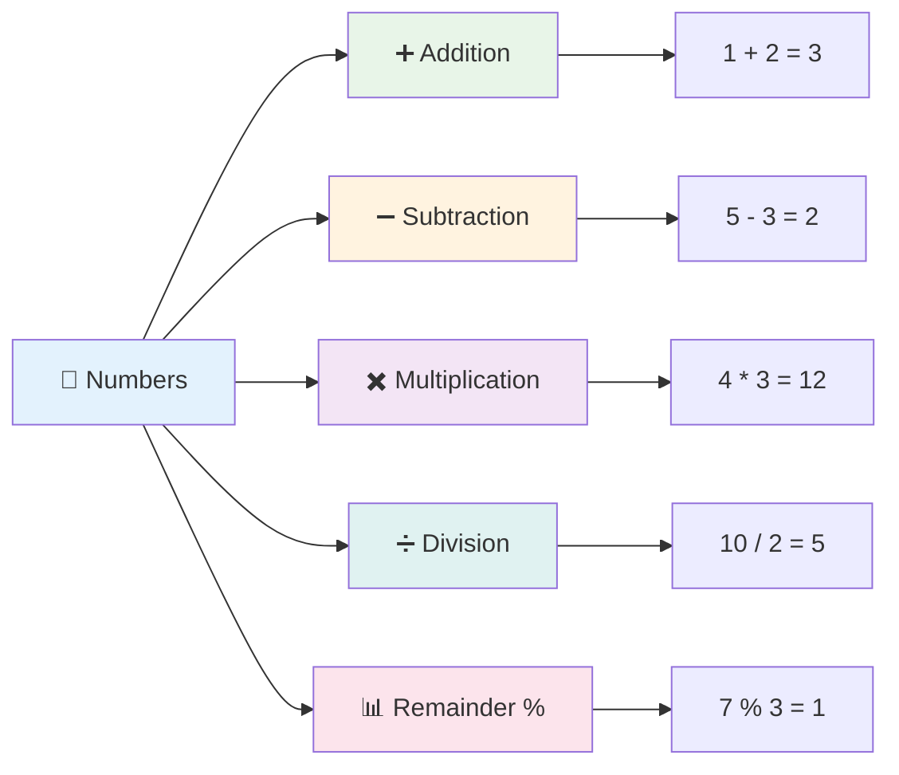

### 算術演算子

算術演算子を使用すると、JavaScriptで数学的な計算を行うことができます。これらの演算子は、何世紀にもわたって数学者が使用してきた原則に従います。代数記法を開発した学者アル・フワーリズミのような学者の作品に登場する記号と同じです。

演算子は伝統的な数学から期待されるように機能します：加算にはプラス、減算にはマイナスなどです。

算術関数を実行する際に使用できる演算子にはいくつかの種類があり、以下にいくつかを示します：

| 記号 | 説明                                                                 | 例                              |
| ---- | -------------------------------------------------------------------- | ------------------------------- |
| `+`  | **加算**: 2つの数値の合計を計算します                                | `1 + 2 //期待される答えは3`     |
| `-`  | **減算**: 2つの数値の差を計算します                                  | `1 - 2 //期待される答えは-1`    |
| `*`  | **乗算**: 2つの数値の積を計算します                                  | `1 * 2 //期待される答えは2`     |
| `/`  | **除算**: 2つの数値の商を計算します                                  | `1 / 2 //期待される答えは0.5`   |
| `%`  | **余り**: 2つの数値の除算から余りを計算します                        | `1 % 2 //期待される答えは1`     |

✅ 試してみましょう！ブラウザのコンソールで算術演算を試してみてください。結果に驚きますか？

### 🧮 **数学スキルチェック: 自信を持って計算する**

**算術の理解をテストしましょう:**
- `/`（除算）と`%`（余り）の違いは何ですか？
- `10 % 3`が何になるか予測できますか？（ヒント: 3.33ではありません...）
- プログラミングで余り演算子が役立つのはなぜですか？

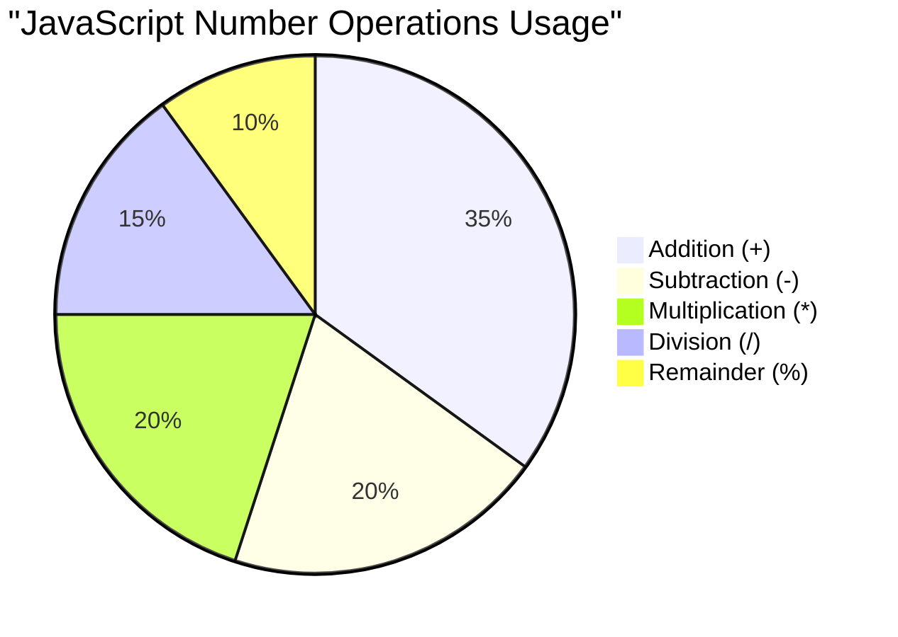

> **実世界の洞察**: 余り演算子（%）は、数値が偶数か奇数かを確認したり、パターンを作成したり、配列を循環させたりするのに非常に便利です！

### 文字列

JavaScriptでは、テキストデータは文字列として表されます。「文字列」という用語は、文字が順番に連結されている概念から来ています。これは、中世の修道院の書記が文字をつなげて単語や文章を作成した方法に似ています。

文字列はウェブ開発において基本的なものです。ウェブサイトに表示されるすべてのテキスト – ユーザー名、ボタンラベル、エラーメッセージ、コンテンツ – は文字列データとして扱われます。文字列を理解することは、機能的なユーザーインターフェースを作成するために不可欠です。

文字列は、シングルクォートまたはダブルクォートで囲まれた文字のセットです。

```javascript
'This is a string'
"This is also a string"
let myString = 'This is a string value stored in a variable';
```

**これらの概念の理解:**
- **シングルクォート`'`またはダブルクォート`"`を使用**して文字列を定義します
- **テキストデータを保存**し、文字、数字、記号を含むことができます
- **変数に文字列値を代入**して後で使用します
- **テキストと変数名を区別するためにクォートが必要**です

文字列を書くときはクォートを使用することを忘れないでください。そうしないと、JavaScriptはそれを変数名だと仮定します。

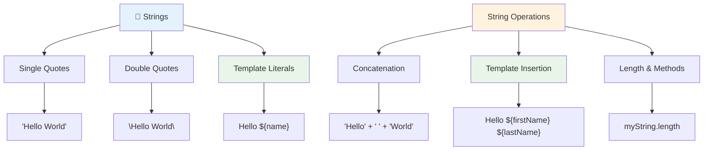

### 
**文字列を結合する**、つまり複数の文字列をつなげるには、`+` 演算子を使用します。

```javascript
let myString1 = "Hello";
let myString2 = "World";

myString1 + myString2 + "!"; //HelloWorld!
myString1 + " " + myString2 + "!"; //Hello World!
myString1 + ", " + myString2 + "!"; //Hello, World!
```

**ステップごとの説明:**
- `+` 演算子を使って複数の文字列を**結合**
- 最初の例ではスペースなしで文字列を直接**連結**
- 読みやすさのために文字列間にスペース `" "` を**追加**
- 適切なフォーマットを作るために句読点（例: カンマ）を**挿入**

✅ なぜ JavaScript では `1 + 1 = 2` なのに `'1' + '1' = 11` になるのでしょう？考えてみてください。では `'1' + 1` はどうなるでしょう？

**テンプレートリテラル**は文字列をフォーマットするもう一つの方法で、引用符の代わりにバックティックを使用します。プレーンテキスト以外のものは `${ }` のプレースホルダー内に記述する必要があります。これには文字列である可能性のある変数も含まれます。

```javascript
let myString1 = "Hello";
let myString2 = "World";

`${myString1} ${myString2}!` //Hello World!
`${myString1}, ${myString2}!` //Hello, World!
```

**各部分を理解しましょう:**
- テンプレートリテラルを作成するために通常の引用符の代わりにバックティック `` ` `` を**使用**
- `${}` プレースホルダー構文を使って変数を直接**埋め込み**
- 書かれた通りにスペースやフォーマットを**保持**
- 変数を使った複雑な文字列を作成するためのより簡潔な方法を**提供**

どちらの方法でもフォーマットの目的を達成できますが、テンプレートリテラルはスペースや改行をそのまま尊重します。

✅ テンプレートリテラルと通常の文字列、どちらを使うべきか？

### 🔤 **文字列マスターチェック: テキスト操作の自信**

**文字列スキルを評価しましょう:**
- なぜ `'1' + '1'` が `2` ではなく `'11'` になるのか説明できますか？
- 結合とテンプレートリテラル、どちらが読みやすいと思いますか？
- 文字列の引用符を忘れるとどうなるでしょう？

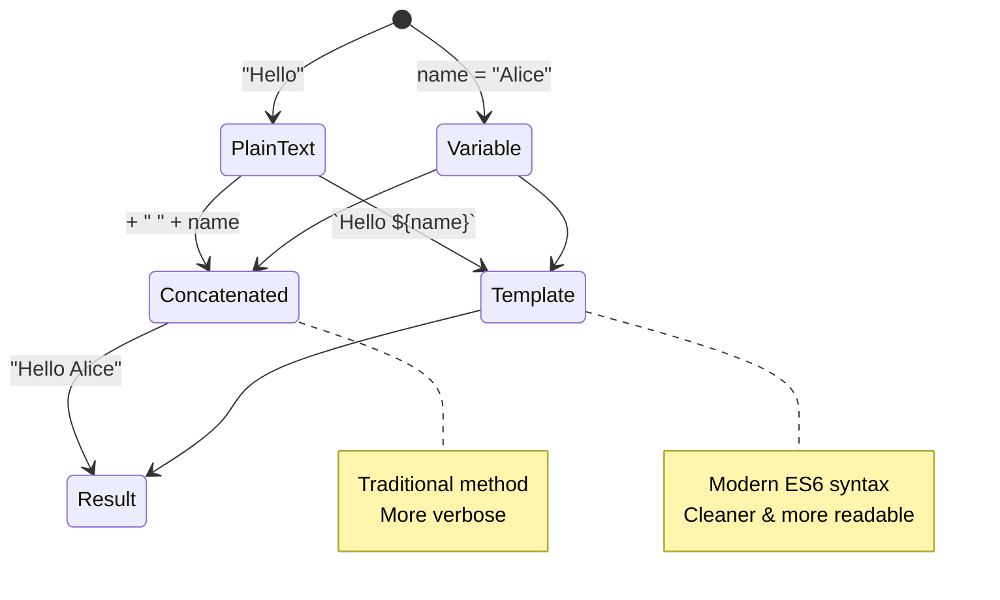

> **プロのヒント**: テンプレートリテラルは複雑な文字列作成において一般的に好まれます。読みやすく、複数行の文字列も美しく扱えます！

### ブール値

ブール値は最もシンプルなデータ形式を表します。それは `true` または `false` のどちらか一方の値しか持てません。この二進論理システムは、19世紀の数学者ジョージ・ブールが開発したブール代数に由来します。

そのシンプルさにもかかわらず、ブール値はプログラムロジックにおいて重要です。条件に基づいてコードが決定を下すことを可能にします。例えば、ユーザーがログインしているか、ボタンがクリックされたか、特定の条件が満たされているかなどです。

ブール値は `true` または `false` の2つの値しか持てません。ブール値は特定の条件が満たされた場合にどのコード行を実行するかを決定するのに役立ちます。多くの場合、[演算子](../../../../2-js-basics/1-data-types)がブール値の設定を助け、変数が初期化されたり、演算子を使って値が更新される様子をよく目にするでしょう。

```javascript
let myTrueBool = true;
let myFalseBool = false;
```

**上記では以下を行いました:**
- ブール値 `true` を格納する変数を**作成**
- ブール値 `false` を格納する方法を**示す**
- 正確なキーワード `true` と `false` を使用（引用符は不要）
- 条件文で使用するためにこれらの変数を**準備**

✅ 変数はブール値 `true` に評価される場合「truthy」と見なされます。興味深いことに、JavaScriptでは[明示的に「falsy」と定義されない限り、すべての値は「truthy」です](https://developer.mozilla.org/docs/Glossary/Truthy)。

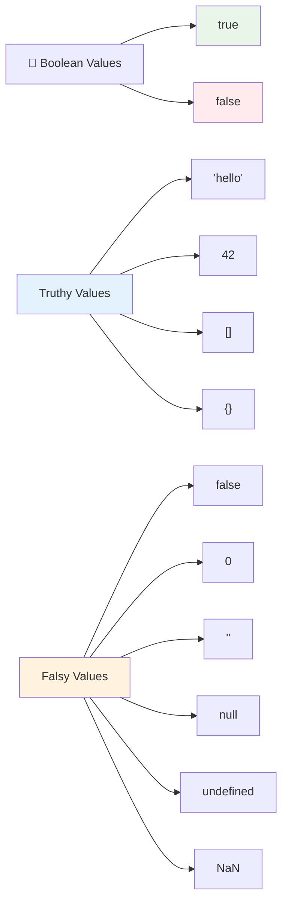

### 🎯 **ブールロジックチェック: 意思決定スキル**

**ブール値の理解をテストしましょう:**
- なぜ JavaScript には `true` や `false` 以外に「truthy」と「falsy」の値があると思いますか？
- 次のうちどれが「falsy」だと思いますか: `0`, `"0"`, `[]`, `"false"`？
- ブール値はプログラムの流れを制御するのにどのように役立つでしょうか？

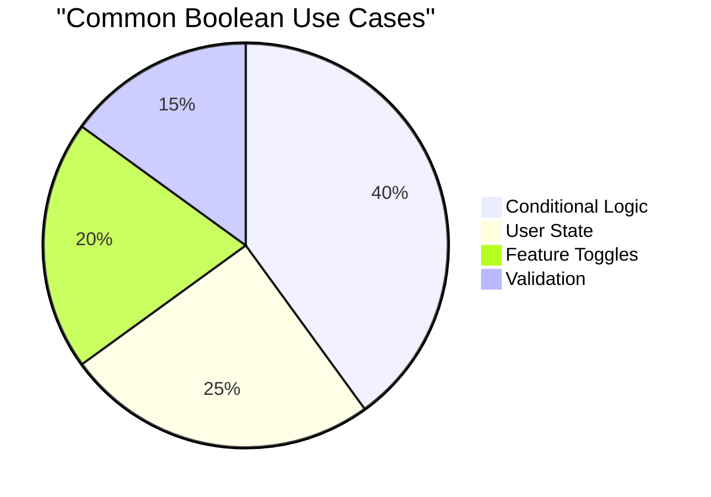

> **覚えておいてください**: JavaScriptでは、`false`, `0`, `""`, `null`, `undefined`, `NaN` の6つの値だけが「falsy」です。それ以外はすべて「truthy」です！

---

## 📊 **データ型ツールキットのまとめ**

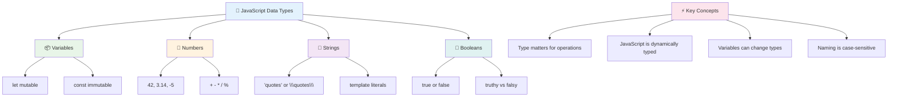

## GitHub Copilot Agent チャレンジ 🚀

Agent モードを使用して以下のチャレンジを完了してください:

**説明:** このレッスンで学んだすべての JavaScript データ型を使用し、実際のデータシナリオを処理する個人情報管理プログラムを作成してください。

**プロンプト:** ユーザープロファイルオブジェクトを作成する JavaScript プログラムを構築してください。このオブジェクトには、名前（文字列）、年齢（数値）、学生ステータス（ブール値）、お気に入りの色（配列）、住所オブジェクト（通り、都市、郵便番号のプロパティ）を含めます。プロファイル情報を表示し、個々のフィールドを更新する関数を含めてください。文字列結合、テンプレートリテラル、年齢の算術演算、学生ステータスのブールロジックを必ず示してください。

[Agent モードについてさらに学ぶ](https://code.visualstudio.com/blogs/2025/02/24/introducing-copilot-agent-mode)。

## 🚀 チャレンジ

JavaScript には開発者を驚かせるような挙動があります。以下の例をブラウザコンソールで試してみてください: `let age = 1; let Age = 2; age == Age`。結果は `false` になります。なぜそうなるのか考えてみてください。

これは理解しておくべき JavaScript の挙動の一例です。これらの癖に慣れることで、より信頼性の高いコードを書き、問題を効果的にデバッグできるようになります。

## 講義後のクイズ
[講義後のクイズ](https://ff-quizzes.netlify.app)

## 復習と自己学習

[JavaScript 演習のリスト](https://css-tricks.com/snippets/javascript/)を見て、1つ試してみてください。何を学びましたか？

## 課題

[データ型練習](assignment.md)

## 🚀 JavaScript データ型マスタリータイムライン

### ⚡ **次の5分間でできること**
- [ ] ブラウザコンソールを開き、異なるデータ型を持つ3つの変数を作成
- [ ] チャレンジを試す: `let age = 1; let Age = 2; age == Age` なぜ `false` になるのか考える
- [ ] 自分の名前と好きな数字を使って文字列結合を練習
- [ ] 数字を文字列に追加するとどうなるかテスト

### 🎯 **この1時間で達成できること**
- [ ] 講義後のクイズを完了し、わからない概念を復習
- [ ] 2つの数字を加算、減算、乗算、除算するミニ計算機を作成
- [ ] テンプレートリテラルを使った簡単な名前フォーマッターを作成
- [ ] `==` と `===` の比較演算子の違いを探る
- [ ] 異なるデータ型間の変換を練習

### 📅 **1週間の JavaScript 基礎学習**
- [ ] 自信と創造性を持って課題を完了
- [ ] 学んだすべてのデータ型を使用して個人プロファイルオブジェクトを作成
- [ ] [CSS-Tricks の JavaScript 演習](https://css-tricks.com/snippets/javascript/)を練習
- [ ] ブールロジックを使った簡単なフォームバリデーターを作成
- [ ] 配列とオブジェクトデータ型を試す（次のレッスンのプレビュー）
- [ ] JavaScript コミュニティに参加し、データ型について質問

### 🌟 **1か月間の変革**
- [ ] データ型の知識をより大きなプログラミングプロジェクトに統合
- [ ] 実際のアプリケーションで各データ型を使用する理由とタイミングを理解
- [ ] 他の初心者が JavaScript の基礎を理解するのを助ける
- [ ] 異なる種類のユーザーデータを管理する小さなアプリケーションを構築
- [ ] 型強制や厳密な等価性などの高度なデータ型概念を探る
- [ ] オープンソースの JavaScript プロジェクトにドキュメント改善で貢献

### 🧠 **最終データ型マスタリーチェックイン**

**JavaScript の基礎を祝おう:**
- 挙動が最も驚いたデータ型はどれですか？
- 変数と定数の違いを友達に説明する自信はありますか？
- JavaScript の型システムについて最も興味深いと感じたことは何ですか？
- これらの基礎を使ってどんな実際のアプリケーションを構築できると思いますか？

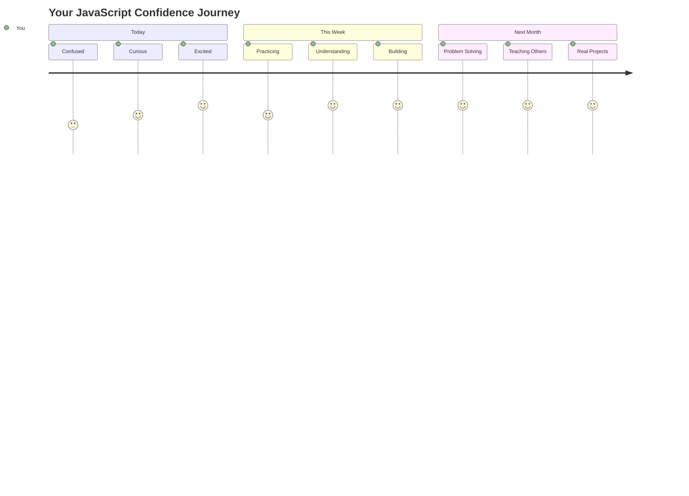

> 💡 **基礎を築きました！** データ型を理解することは、物語を書く前にアルファベットを学ぶようなものです。これから書くすべての JavaScript プログラムはこれらの基本的な概念を使用します。これでインタラクティブなウェブサイト、動的なアプリケーションを作成し、コードで実際の問題を解決するための基礎ができました。JavaScript の素晴らしい世界へようこそ！ 🎉

---

**免責事項**:  
この文書はAI翻訳サービス[Co-op Translator](https://github.com/Azure/co-op-translator)を使用して翻訳されています。正確性を追求していますが、自動翻訳には誤りや不正確さが含まれる可能性があります。元の言語で記載された文書が正式な情報源とみなされるべきです。重要な情報については、専門の人間による翻訳を推奨します。この翻訳の使用に起因する誤解や誤解について、当社は責任を負いません。