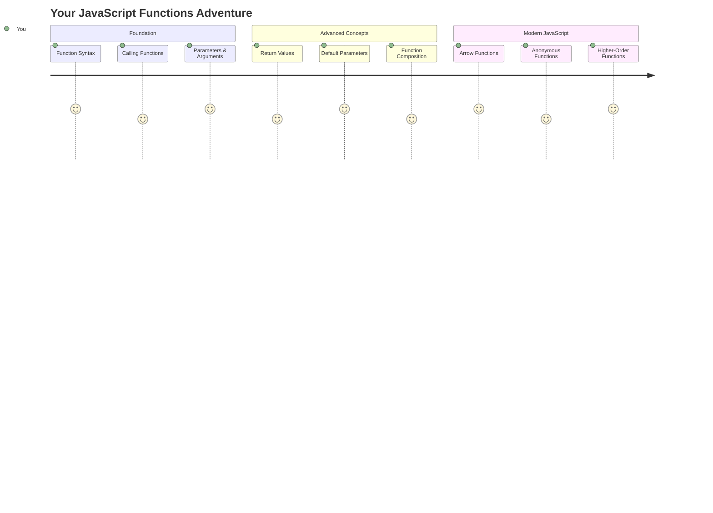
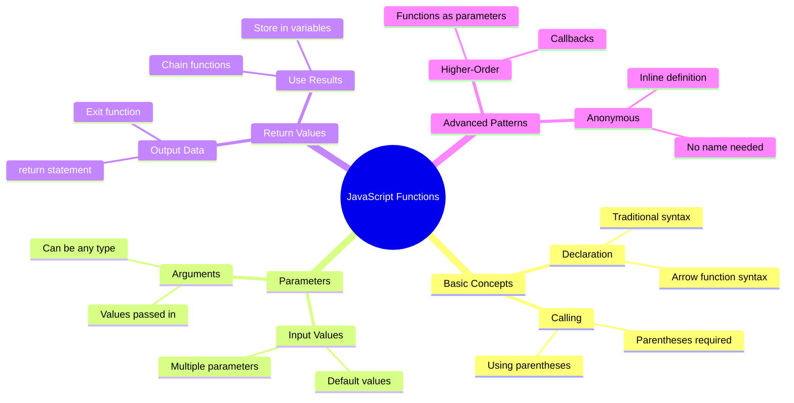
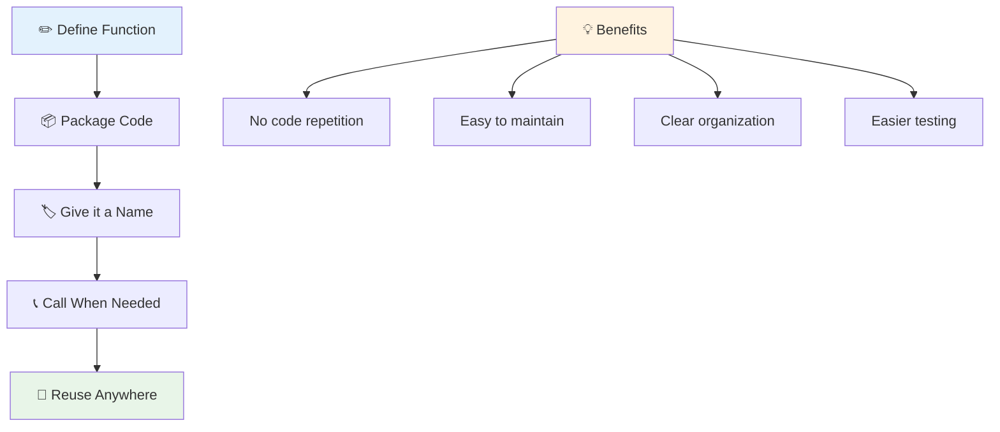
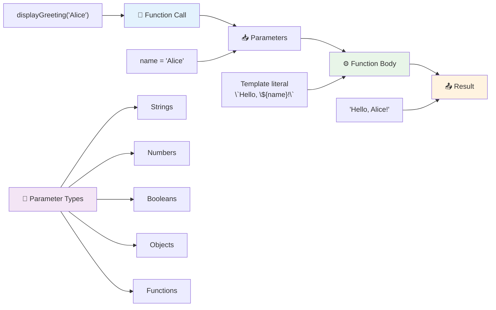
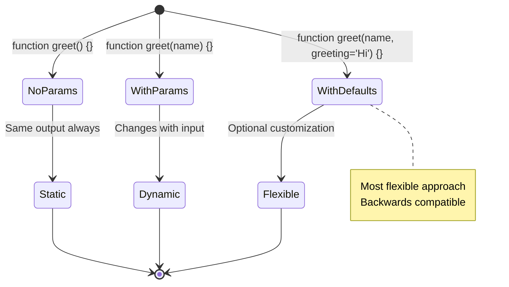
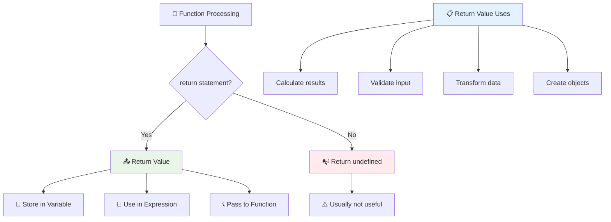
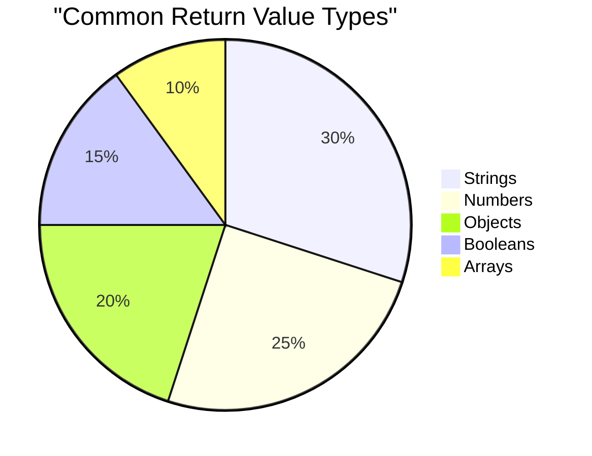
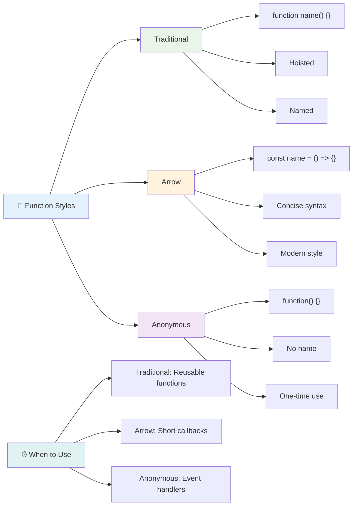
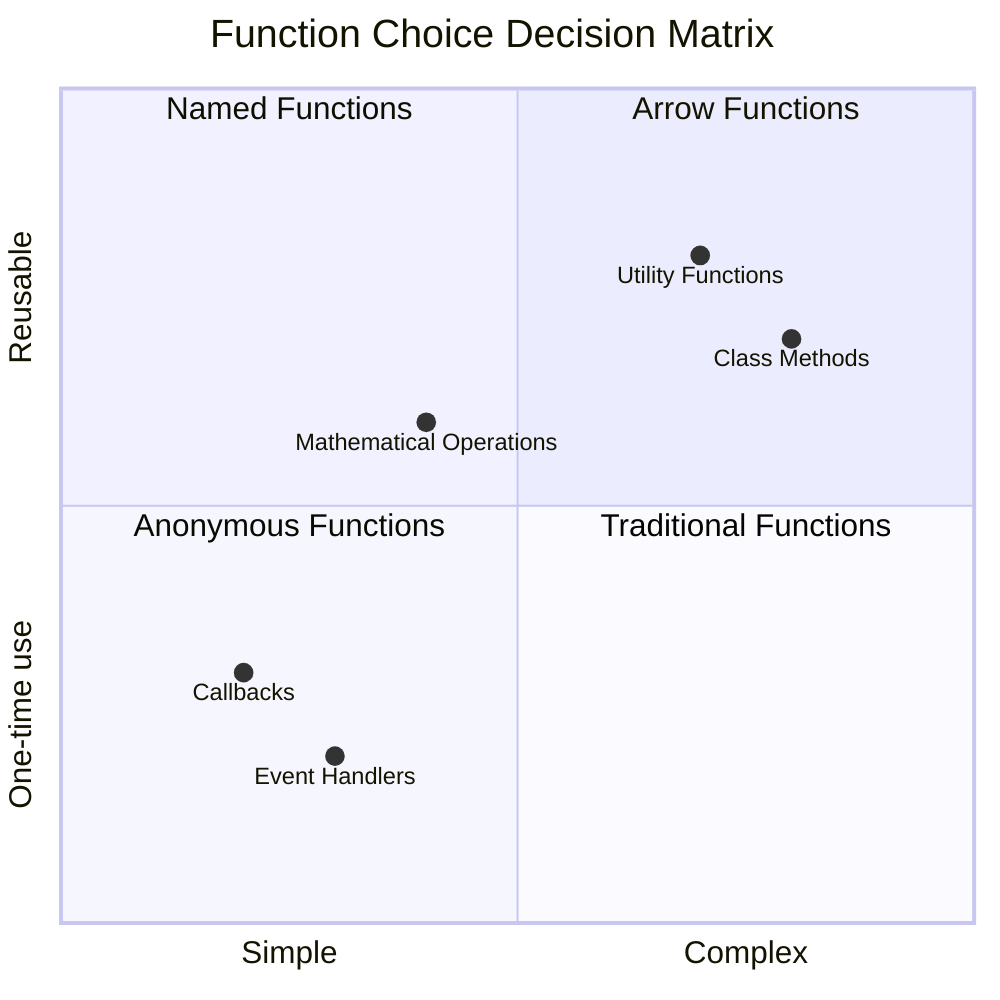
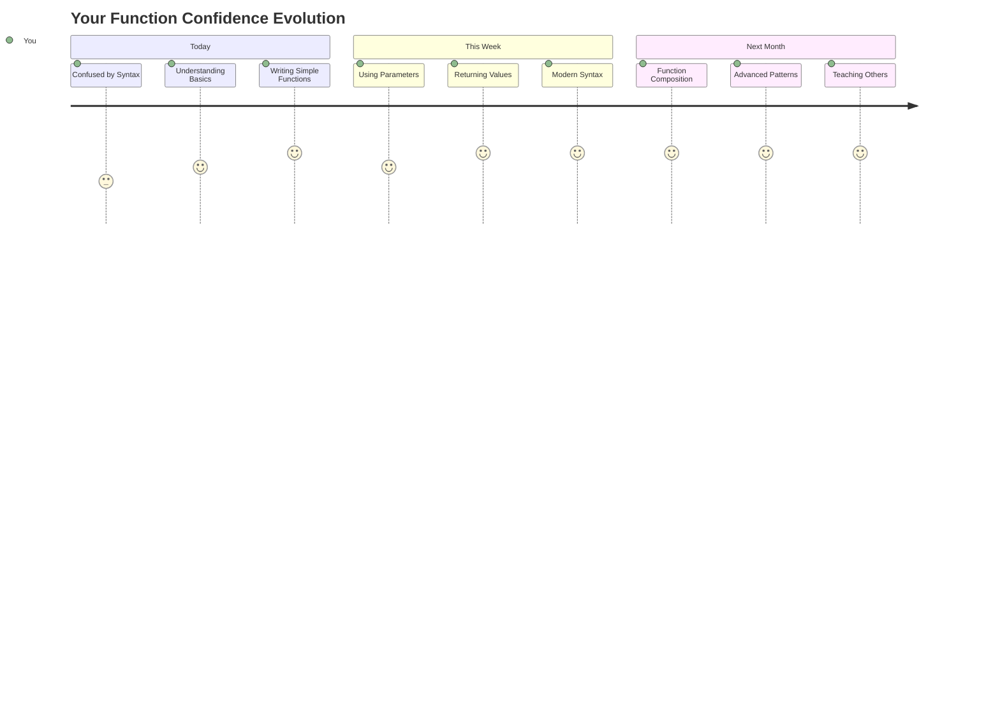

<!--
CO_OP_TRANSLATOR_METADATA:
{
  "original_hash": "71f7d7dafa1c7194d79ddac87f669ff9",
  "translation_date": "2025-11-06T12:26:27+00:00",
  "source_file": "2-js-basics/2-functions-methods/README.md",
  "language_code": "ja"
}
-->
# JavaScriptの基本: メソッドと関数


> スケッチノート: [Tomomi Imura](https://twitter.com/girlie_mac)



## 講義前のクイズ
[講義前のクイズ](https://ff-quizzes.netlify.app)

同じコードを何度も書くことは、プログラミングで最もよくあるイライラの原因の一つです。関数はコードを再利用可能なブロックにまとめることで、この問題を解決します。関数を、ヘンリー・フォードの組立ラインを革命的にした標準化された部品のように考えてみてください。一度信頼できるコンポーネントを作成すれば、必要な場所で再構築することなく使用できます。

関数を使うことで、コードをまとめてプログラム全体で再利用することができます。同じロジックをあちこちにコピー＆ペーストする代わりに、一度関数を作成して必要なときに呼び出すことができます。この方法はコードを整理し、更新をはるかに簡単にします。

このレッスンでは、自分の関数を作成し、情報を渡し、有用な結果を得る方法を学びます。関数とメソッドの違い、モダンな構文のアプローチ、関数が他の関数とどのように連携するかを学びます。これらの概念を段階的に構築していきます。

[](https://youtube.com/watch?v=XgKsD6Zwvlc "Methods and Functions")

> 🎥 上の画像をクリックして、メソッドと関数についての動画をご覧ください。

> このレッスンは[Microsoft Learn](https://docs.microsoft.com/learn/modules/web-development-101-functions/?WT.mc_id=academic-77807-sagibbon)で受講できます！



## 関数

関数は、特定のタスクを実行する自己完結型のコードブロックです。必要なときに実行できるロジックをカプセル化します。

プログラム全体で同じコードを何度も書く代わりに、関数にまとめて必要なときに呼び出すことができます。この方法はコードをきれいに保ち、更新をはるかに簡単にします。コードベースの20箇所に散らばったロジックを変更する必要がある場合の保守の課題を考えてみてください。

関数にわかりやすい名前を付けることが重要です。適切に名前付けされた関数はその目的を明確に伝えます。例えば、`cancelTimer()`という名前を見れば、何をする関数なのかすぐに理解できます。これは、明確にラベル付けされたボタンがクリックしたときに何が起こるかを教えてくれるのと同じです。

## 関数の作成と呼び出し

関数の作成方法を見てみましょう。構文は一貫したパターンに従います。

```javascript
function nameOfFunction() { // function definition
 // function definition/body
}
```

これを分解してみましょう:
- `function`キーワードはJavaScriptに「これから関数を作るよ！」と伝えます。
- `nameOfFunction`は関数に説明的な名前を付ける場所です。
- 丸括弧`()`はパラメータを追加できる場所です（後で説明します）。
- 波括弧`{}`は関数を呼び出したときに実行される実際のコードを含みます。

簡単な挨拶関数を作成して、これを実際に見てみましょう:

```javascript
function displayGreeting() {
  console.log('Hello, world!');
}
```

この関数はコンソールに「Hello, world!」を表示します。一度定義すれば、必要なだけ何度でも使用できます。

関数を実行（または「呼び出し」）するには、関数名の後に丸括弧を付けます。JavaScriptでは、関数を呼び出す前でも後でも定義できます。JavaScriptエンジンが実行順序を処理します。

```javascript
// calling our function
displayGreeting();
```

この行を実行すると、`displayGreeting`関数内のすべてのコードが実行され、ブラウザのコンソールに「Hello, world!」が表示されます。この関数は何度でも呼び出すことができます。

### 🧠 **関数の基本チェック: 初めての関数を作成する**

**基本的な関数についての理解を確認してみましょう:**
- 関数定義で波括弧`{}`を使用する理由を説明できますか？
- 丸括弧なしで`displayGreeting`を書いた場合、何が起こりますか？
- 同じ関数を複数回呼び出したい理由は何ですか？



> **Note:** このレッスンでは**メソッド**を使用してきました。`console.log()`はメソッドです。つまり、`console`オブジェクトに属する関数です。メソッドはオブジェクトに付属しているのに対し、関数は独立しています。多くの開発者はカジュアルな会話でこれらの用語を混同して使用します。

### 関数のベストプラクティス

優れた関数を書くためのいくつかのヒントを紹介します:

- 関数に明確で説明的な名前を付けましょう。将来の自分が感謝します！
- 複数の単語を含む名前には**キャメルケース**を使用しましょう（例: `calculateTotal`、`calculate_total`ではなく）
- 各関数を一つのことに集中させましょう

## 関数に情報を渡す

`displayGreeting`関数は制限があります。すべての人に「Hello, world!」しか表示できません。パラメータを使用すると、関数をより柔軟で便利にすることができます。

**パラメータ**は、関数を呼び出すたびに異なる値を挿入できるプレースホルダーのようなものです。この方法で、同じ関数が呼び出しごとに異なる情報で動作できます。

関数を定義する際に、丸括弧内にパラメータをリストします。複数のパラメータはコンマで区切ります:

```javascript
function name(param, param2, param3) {

}
```

各パラメータはプレースホルダーのように機能します。関数を呼び出す際に、実際の値を提供してこれらの場所に挿入します。

挨拶関数を更新して、名前を受け取れるようにしてみましょう:

```javascript
function displayGreeting(name) {
  const message = `Hello, ${name}!`;
  console.log(message);
}
```

名前をメッセージに直接挿入するために、バックティック（`` ` ``）と`${}`を使用していることに注目してください。これはテンプレートリテラルと呼ばれ、変数を混ぜた文字列を作成する非常に便利な方法です。

関数を呼び出す際に、任意の名前を渡すことができます:

```javascript
displayGreeting('Christopher');
// displays "Hello, Christopher!" when run
```

JavaScriptは文字列`'Christopher'`を受け取り、それを`name`パラメータに割り当て、パーソナライズされたメッセージ「Hello, Christopher!」を作成します。



## デフォルト値

一部のパラメータをオプションにしたい場合はどうしますか？その場合、デフォルト値が役立ちます！

例えば、挨拶の言葉をカスタマイズできるようにしたいけれど、指定がない場合は「Hello」を使いたいとします。デフォルト値は、変数を設定するのと同じようにイコール記号を使用して設定できます:

```javascript
function displayGreeting(name, salutation='Hello') {
  console.log(`${salutation}, ${name}`);
}
```

ここでは、`name`は必須ですが、`salutation`には誰も別の挨拶を指定しない場合のバックアップ値として`'Hello'`があります。

この関数を2つの異なる方法で呼び出すことができます:

```javascript
displayGreeting('Christopher');
// displays "Hello, Christopher"

displayGreeting('Christopher', 'Hi');
// displays "Hi, Christopher"
```

最初の呼び出しでは、挨拶が指定されていないため、JavaScriptはデフォルトの「Hello」を使用します。2回目の呼び出しでは、カスタムの「Hi」を使用します。この柔軟性により、関数はさまざまなシナリオに適応できます。

### 🎛️ **パラメータの理解チェック: 関数を柔軟にする**

**パラメータの理解をテストしてみましょう:**
- パラメータと引数の違いは何ですか？
- デフォルト値が実際のプログラミングで役立つ理由は何ですか？
- パラメータより多くの引数を渡した場合、何が起こるか予測できますか？



> **プロのヒント**: デフォルトパラメータは関数をより使いやすくします。ユーザーは適切なデフォルトで迅速に開始できますが、必要に応じてカスタマイズも可能です！

## 戻り値

これまでの関数はコンソールにメッセージを表示するだけでしたが、計算を行い結果を返したい場合はどうしますか？

その場合、**戻り値**が役立ちます。関数は何かを表示する代わりに、結果を返して変数に保存したり、コードの他の部分で使用したりできます。

値を返すには、`return`キーワードを使用し、その後に返したいものを記述します:

```javascript
return myVariable;
```

重要な点は、関数が`return`文に到達すると、直ちに実行を停止し、その値を呼び出し元に返すことです。

挨拶関数を修正して、メッセージを表示する代わりに返すようにしてみましょう:

```javascript
function createGreetingMessage(name) {
  const message = `Hello, ${name}`;
  return message;
}
```

この関数は挨拶を表示する代わりに、メッセージを作成して返します。

返された値を使用するには、他の値と同じように変数に保存できます:

```javascript
const greetingMessage = createGreetingMessage('Christopher');
```

これで`greetingMessage`には「Hello, Christopher」が含まれ、コードのどこでも使用できます。例えば、ウェブページに表示したり、メールに含めたり、別の関数に渡したりすることができます。



### 🔄 **戻り値チェック: 結果を得る**

**戻り値の理解を評価してみましょう:**
- 関数内の`return`文の後のコードはどうなりますか？
- コンソールに表示するだけでなく、値を返す方が良い理由は何ですか？
- 関数は異なる型の値（文字列、数値、ブール値など）を返すことができますか？



> **重要な洞察**: 値を返す関数はより汎用性が高くなります。呼び出し元が結果をどうするかを決めることができるため、コードがよりモジュール化され再利用可能になります！

## 関数を関数のパラメータとして渡す

関数は他の関数のパラメータとして渡すことができます。この概念は最初は複雑に感じるかもしれませんが、柔軟なプログラミングパターンを可能にする強力な機能です。

このパターンは、「何かが起こったら、このコードを実行する」という状況で非常に一般的です。例えば、「タイマーが終了したら、このコードを実行する」や「ユーザーがボタンをクリックしたら、この関数を呼び出す」といった場合です。

組み込み関数`setTimeout`を見てみましょう。この関数は一定時間待機してからコードを実行します。どのコードを実行するかを指定する必要があります。関数を渡すのにぴったりのケースです！

このコードを試してみてください。3秒後にメッセージが表示されます:

```javascript
function displayDone() {
  console.log('3 seconds has elapsed');
}
// timer value is in milliseconds
setTimeout(displayDone, 3000);
```

`setTimeout`に`displayDone`（丸括弧なし）を渡していることに注目してください。自分で関数を呼び出しているわけではなく、`setTimeout`に渡して「3秒後にこれを呼び出して」と指示しています。

### 無名関数

特定の用途のためだけに関数が必要で、名前を付けたくない場合があります。考えてみてください。一度しか使わない関数に余計な名前を付けてコードを煩雑にする必要はありません。

JavaScriptでは**無名関数**を作成できます。名前のない関数を必要な場所で直接定義できます。

タイマーの例を無名関数を使って書き直してみましょう:

```javascript
setTimeout(function() {
  console.log('3 seconds has elapsed');
}, 3000);
```

これで同じ結果が得られますが、関数は`setTimeout`呼び出し内で直接定義され、別の関数宣言が不要になります。

### アロー関数

モダンなJavaScriptでは、さらに短い方法で関数を書くことができます。それが**アロー関数**です。`=>`（矢印のように見えますよね？）を使用し、開発者に非常に人気があります。

アロー関数を使うと、`function`キーワードを省略して、より簡潔なコードを書くことができます。

タイマーの例をアロー関数を使って書き直してみましょう:

```javascript
setTimeout(() => {
  console.log('3 seconds has elapsed');
}, 3000);
```

`()`はパラメータを記述する場所（今回は空）、次に矢印`=>`、そして最後に波括弧内の関数本体が続きます。この構文で同じ機能をより簡潔に提供します。



### 各戦略を使うタイミング

どのアプローチを使うべきか？実用的なガイドラインとして、関数を複数回使用する場合は名前を付けて別々に定義します。特定の用途のためだけなら無名関数を検討してください。アロー関数と従来の構文はどちらも有効ですが、アロー関数はモダンなJavaScriptコードベースで広く使われています。

### 🎨 **関数スタイルの理解チェック: 適切な構文を選ぶ**

**構文の理解をテストしてみましょう:**
- 従来の関数構文よりアロー関数を好む理由は何ですか？
- 無名関数の主な利点は何ですか？
- 名前付き関数が無名関数より優れている状況を考えられますか？



> **モダントレンド**: アロー関数はその簡潔な構文のため、多くの開発者にとってデフォルトの選択肢になりつつありますが、従来の関数にもまだその役割があります！

---


## 🚀 チャレンジ

関数とメソッドの違いを一文で説明できますか？挑戦してみてください！

## GitHub Copilot Agent Challenge 🚀

Agentモードを使用して以下のチャレンジを完了してください:

**説明:** このレッスンで取り上げたさまざまな関数の概念を示す数学関数のユーティリティライブラリを作成してください。パラメータ、デフォルト値、戻り値、アロー関数を含めます。

**プロンプト:** `mathUtils.js`というJavaScriptファイルを作成し、以下の関数を含めてください:
1. 2つのパラメータを受け取り、その合計を返す関数`add`
2. デフォルトのパラメータ値を持つ関数`multiply`（2番目のパラメータはデフォルトで1）
3. 数値を受け取り、その平方を返すアロー関数`square`
4. 他の関数をパラメータとして受け取り、2つの数値にその関数を適用する関数`calculate`
5. 各関数を適切なテストケースで呼び出す例を示す

[Agentモード](https://code.visualstudio.com/blogs/2025/02/24/introducing-copilot-agent-mode)について詳しくはこちらをご覧ください。

## 講義後のクイズ
[講義後のクイズ](https://ff-quizzes.netlify.app)

## 復習と自己学習

[アロー関数についてもう少し調べてみる](https://developer.mozilla.org/docs/Web/JavaScript/Reference/Functions/Arrow_functions)価値があります。コードベースでますます使用されるようになっています。この構文で関数を書き、書き直して練習してみてください
- [ ] 従来の関数をアロー関数構文に変換してみる  
- [ ] チャレンジに取り組む: 関数とメソッドの違いを説明する  

### 🎯 **この1時間で達成できること**  
- [ ] レッスン後のクイズを完了し、わかりにくい概念を復習する  
- [ ] GitHub Copilotのチャレンジで数学ユーティリティライブラリを作成する  
- [ ] 他の関数をパラメータとして使用する関数を作成する  
- [ ] デフォルトパラメータを使用した関数を書く練習をする  
- [ ] 関数の戻り値でテンプレートリテラルを試してみる  

### 📅 **1週間で関数をマスターする**  
- [ ] 創造性を発揮して「Fun with Functions」課題を完了する  
- [ ] 書いた繰り返しコードをリファクタリングして再利用可能な関数にする  
- [ ] 関数だけを使って小さな計算機を作成する（グローバル変数は使用しない）  
- [ ] `map()`や`filter()`のような配列メソッドでアロー関数を練習する  
- [ ] 一般的なタスクのためのユーティリティ関数を作成する  
- [ ] 高階関数や関数型プログラミングの概念を学ぶ  

### 🌟 **1か月での変化**  
- [ ] クロージャやスコープなどの高度な関数概念をマスターする  
- [ ] 関数の合成を多用するプロジェクトを構築する  
- [ ] オープンソースに貢献し、関数のドキュメントを改善する  
- [ ] 関数や異なる構文スタイルについて誰かに教える  
- [ ] JavaScriptで関数型プログラミングのパラダイムを探求する  
- [ ] 将来のプロジェクトのために再利用可能な関数の個人ライブラリを作成する  

### 🏆 **最終チェックイン: 関数の達人へ**

**関数マスターを祝おう:**  
- 今まで作成した中で最も役立つ関数は何ですか？  
- 関数について学ぶことで、コードの整理方法に対する考え方はどう変わりましたか？  
- 好きな関数構文はどれですか？その理由は？  
- 関数を書くことで解決したい現実の問題は何ですか？  


  
> 🎉 **プログラミングの最も強力な概念の1つをマスターしました！** 関数は大規模なプログラムの構成要素です。これから作るすべてのアプリケーションは、コードを整理し、再利用し、構造化するために関数を使用します。ロジックを再利用可能なコンポーネントにまとめる方法を理解したことで、より効率的で効果的なプログラマーになりました。モジュール型プログラミングの世界へようこそ！ 🚀

---

**免責事項**:  
この文書はAI翻訳サービス[Co-op Translator](https://github.com/Azure/co-op-translator)を使用して翻訳されています。正確性を追求しておりますが、自動翻訳には誤りや不正確な部分が含まれる可能性があります。元の言語で記載された文書を正式な情報源としてお考えください。重要な情報については、専門の人間による翻訳を推奨します。この翻訳の使用に起因する誤解や誤解について、当社は責任を負いません。