<!--
CO_OP_TRANSLATOR_METADATA:
{
  "original_hash": "c688385d15dd3645e924ea0ffee8967f",
  "translation_date": "2025-11-06T12:27:52+00:00",
  "source_file": "2-js-basics/3-making-decisions/README.md",
  "language_code": "ja"
}
-->
# JavaScriptの基本: 判断をする


> スケッチノート: [Tomomi Imura](https://twitter.com/girlie_mac)

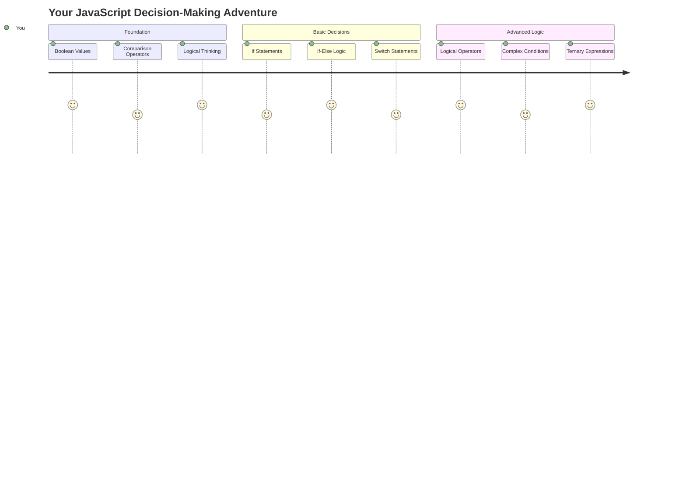

アプリケーションがどのように賢い判断をしているのか疑問に思ったことはありませんか？例えば、ナビゲーションシステムが最速ルートを選ぶ方法や、サーモスタットがいつ暖房をオンにするかを決める方法などです。これがプログラミングにおける判断の基本的な概念です。

チャールズ・バベッジの解析機関が条件に基づいて異なる操作のシーケンスを実行するよう設計されていたように、現代のJavaScriptプログラムも状況に応じて選択を行う必要があります。この分岐して判断を行う能力こそが、静的なコードを応答性のある知的なアプリケーションに変えるものです。

このレッスンでは、プログラムに条件付きロジックを実装する方法を学びます。条件文、比較演算子、論理式を探求し、コードが状況を評価して適切に応答できるようにします。

## レクチャー前のクイズ

[レクチャー前のクイズ](https://ff-quizzes.netlify.app/web/quiz/11)

判断を行い、プログラムの流れを制御する能力はプログラミングの基本的な側面です。このセクションでは、Boolean値と条件付きロジックを使用してJavaScriptプログラムの実行パスを制御する方法を説明します。

[](https://youtube.com/watch?v=SxTp8j-fMMY "Making Decisions")

> 🎥 上の画像をクリックして、判断についてのビデオをご覧ください。

> このレッスンは[Microsoft Learn](https://docs.microsoft.com/learn/modules/web-development-101-if-else/?WT.mc_id=academic-77807-sagibbon)で受講できます！

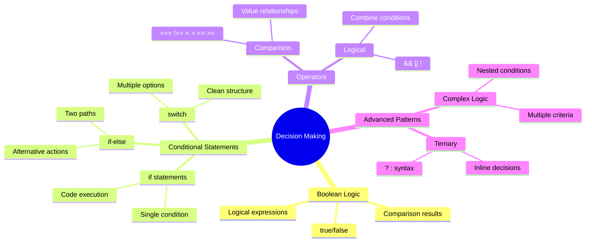

## Booleanの簡単な復習

判断を探求する前に、前回のレッスンで学んだBoolean値を復習しましょう。数学者ジョージ・ブールにちなんで名付けられたこれらの値は、`true`または`false`という2つの状態を表します。曖昧さや中間の状態はありません。

これらの2進値は、すべての計算論理の基礎を形成します。プログラムが行うすべての判断は最終的にBoolean評価に帰着します。

Boolean変数を作成するのは簡単です:

```javascript
let myTrueBool = true;
let myFalseBool = false;
```

これにより、明示的なBoolean値を持つ2つの変数が作成されます。

✅ Booleanは、イギリスの数学者、哲学者、論理学者であるジョージ・ブール（1815–1864）にちなんで名付けられました。

## 比較演算子とBoolean

実際には、Boolean値を手動で設定することはほとんどありません。代わりに、条件を評価することで生成します。「この数値はあの数値より大きいか？」や「これらの値は等しいか？」などです。

比較演算子はこれらの評価を可能にします。値を比較し、オペランド間の関係に基づいてBoolean結果を返します。

| 記号 | 説明                                                                                                                                                   | 例                 |
| ------ | ------------------------------------------------------------------------------------------------------------------------------------------------------------- | ------------------ |
| `<`    | **より小さい**: 左側の値が右側より小さい場合に`true`を返します                                                                                              | `5 < 6 // true`    |
| `<=`   | **以下**: 左側の値が右側以下の場合に`true`を返します                                                                                                        | `5 <= 6 // true`   |
| `>`    | **より大きい**: 左側の値が右側より大きい場合に`true`を返します                                                                                              | `5 > 6 // false`   |
| `>=`   | **以上**: 左側の値が右側以上の場合に`true`を返します                                                                                                        | `5 >= 6 // false`  |
| `===`  | **厳密な等価性**: 左右の値が等しく、かつ同じデータ型の場合に`true`を返します                                                                             | `5 === 6 // false` |
| `!==`  | **不等価**: 厳密な等価性演算子が返す結果の逆のBoolean値を返します                                                                                         | `5 !== 6 // true`  |

✅ ブラウザのコンソールでいくつかの比較を書いて知識を確認してください。返されたデータに驚くことはありますか？

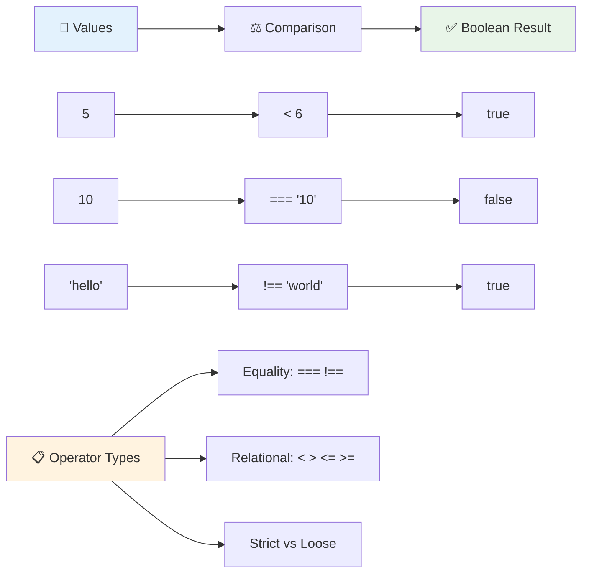

### 🧠 **比較の習得: Booleanロジックの理解**

**比較の理解をテストする:**
- なぜ`===`（厳密な等価性）が一般的に`==`（緩やかな等価性）より好まれると思いますか？
- `5 === '5'`は何を返すか予測できますか？`5 == '5'`はどうですか？
- `!==`と`!=`の違いは何ですか？

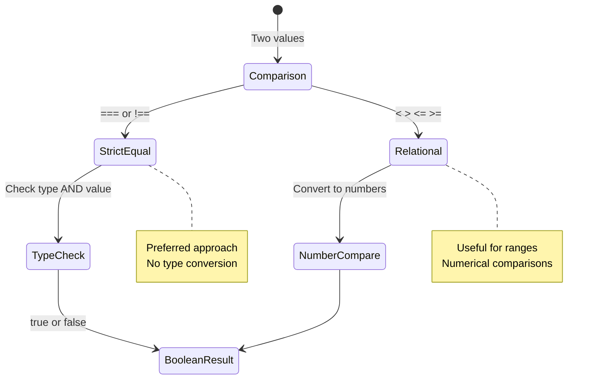

> **プロのヒント**: 型変換が必要でない限り、等価性チェックには常に`===`と`!==`を使用してください。これにより予期しない動作を防ぐことができます！

## If文

`if`文はコード内で質問をするようなものです。「この条件が真なら、このことをする。」これはJavaScriptで判断を行うために最も重要なツールです。

以下がその動作方法です:

```javascript
if (condition) {
  // Condition is true. Code in this block will run.
}
```

条件は括弧内に入り、それが`true`の場合、JavaScriptは中括弧内のコードを実行します。`false`の場合、JavaScriptはそのブロック全体をスキップします。

これらの条件を作成するために比較演算子を使用することがよくあります。実際の例を見てみましょう:

```javascript
let currentMoney = 1000;
let laptopPrice = 800;

if (currentMoney >= laptopPrice) {
  // Condition is true. Code in this block will run.
  console.log("Getting a new laptop!");
}
```

`1000 >= 800`が`true`と評価されるため、ブロック内のコードが実行され、コンソールに「新しいラップトップを購入します！」と表示されます。

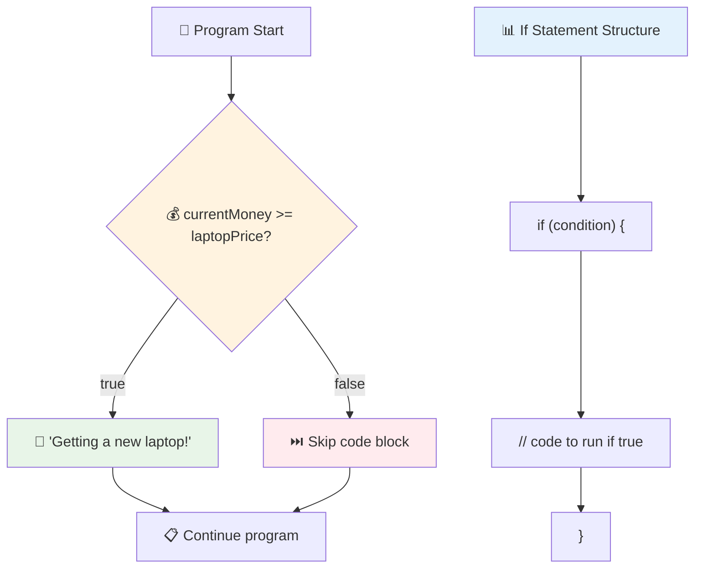

## If..Else文

しかし、条件が`false`の場合にプログラムに別のことをさせたい場合はどうしますか？そこで`else`が登場します。これはバックアッププランのようなものです。

`else`文を使用すると、「この条件が真でない場合、代わりにこの別のことをする」と言うことができます。

```javascript
let currentMoney = 500;
let laptopPrice = 800;

if (currentMoney >= laptopPrice) {
  // Condition is true. Code in this block will run.
  console.log("Getting a new laptop!");
} else {
  // Condition is false. Code in this block will run.
  console.log("Can't afford a new laptop, yet!");
}
```

今度は`500 >= 800`が`false`であるため、JavaScriptは最初のブロックをスキップし、代わりに`else`ブロックを実行します。コンソールには「まだ新しいラップトップを購入できません！」と表示されます。

✅ このコードと以下のコードをブラウザのコンソールで実行して理解をテストしてください。`currentMoney`と`laptopPrice`変数の値を変更して、返される`console.log()`を変更してみてください。

### 🎯 **If-Elseロジックチェック: 分岐パス**

**条件付きロジックの理解を評価する:**
- `currentMoney`が`laptopPrice`と完全に等しい場合はどうなりますか？
- If-Elseロジックが役立つ現実のシナリオを考えられますか？
- 複数の価格帯を処理するように拡張する方法を考えられますか？

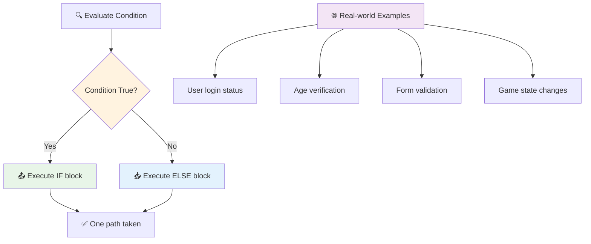

> **重要な洞察**: If-Elseは正確に1つのパスが選択されることを保証します。これにより、プログラムがどの条件にも常に応答することが保証されます！

## Switch文

時には、1つの値を複数の選択肢と比較する必要があります。いくつかの`if..else`文を連ねることもできますが、このアプローチは扱いにくくなります。`switch`文は、複数の離散値を処理するためのよりクリーンな構造を提供します。

この概念は、初期の電話交換機で使用された機械式スイッチングシステムに似ています。1つの入力値が実行がどの特定のパスをたどるかを決定します。

```javascript
switch (expression) {
  case x:
    // code block
    break;
  case y:
    // code block
    break;
  default:
    // code block
}
```

以下がその構造です:
- JavaScriptは式を一度評価します
- 各`case`を見て一致を探します
- 一致が見つかると、そのコードブロックを実行します
- `break`はJavaScriptにスイッチを停止して終了するよう指示します
- 一致するケースがない場合、`default`ブロック（存在する場合）を実行します

```javascript
// Program using switch statement for day of week
let dayNumber = 2;
let dayName;

switch (dayNumber) {
  case 1:
    dayName = "Monday";
    break;
  case 2:
    dayName = "Tuesday";
    break;
  case 3:
    dayName = "Wednesday";
    break;
  default:
    dayName = "Unknown day";
    break;
}
console.log(`Today is ${dayName}`);
```

この例では、JavaScriptは`dayNumber`が`2`であることを確認し、一致する`case 2`を見つけ、`dayName`を「火曜日」に設定し、スイッチを抜けます。その結果、コンソールに「今日は火曜日です」と表示されます。

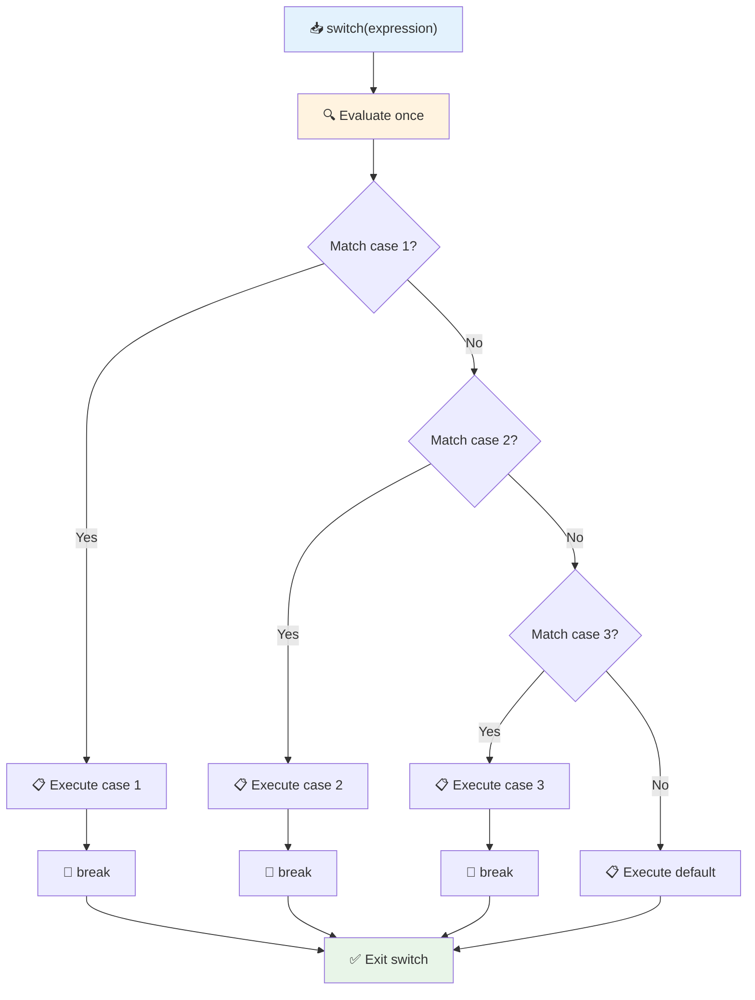

✅ このコードと以下のコードをブラウザのコンソールで実行して理解をテストしてください。変数`a`の値を変更して返される`console.log()`を変更してみてください。

### 🔄 **Switch文の習得: 複数の選択肢**

**Switchの理解をテストする:**
- `break`文を忘れるとどうなりますか？
- 複数の`if-else`文の代わりに`switch`を使用するのはどんな場合ですか？
- すべての可能性をカバーしたと思っていても`default`ケースが役立つのはなぜですか？

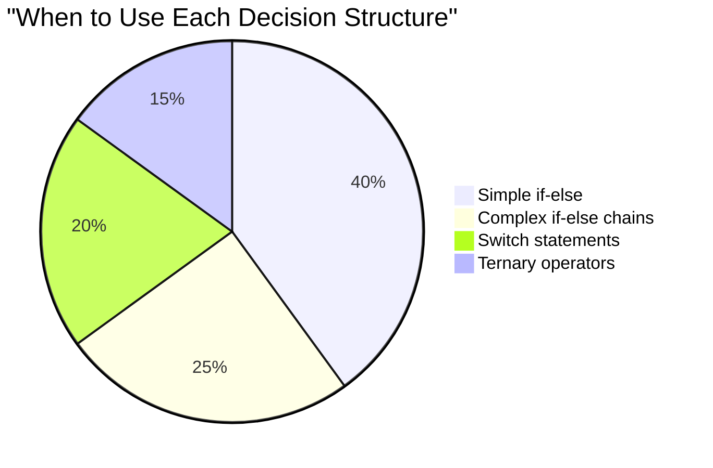

> **ベストプラクティス**: 1つの変数を複数の特定の値と比較する場合は`switch`を使用します。範囲チェックや複雑な条件には`if-else`を使用してください！

## 論理演算子とBoolean

複雑な判断では、複数の条件を同時に評価する必要があります。数学者が論理式を組み合わせるためにBoolean代数を使用するように、プログラミングでは論理演算子を使用して複数のBoolean条件を接続します。

これらの演算子は、単純な真/偽評価を組み合わせることで洗練された条件付きロジックを可能にします。

| 記号 | 説明                                                                                     | 例                                                                 |
| ------ | ----------------------------------------------------------------------------------------------- | ----------------------------------------------------------------------- |
| `&&`   | **論理AND**: 2つのBoolean式を比較します。両方が真の場合にのみ`true`を返します | `(5 > 3) && (5 < 10) // 両方が真。trueを返す` |
| `\|\|` | **論理OR**: 2つのBoolean式を比較します。少なくとも片方が真の場合に`true`を返します     | `(5 > 10) \|\| (5 < 10) // 片方が偽、もう片方が真。trueを返す` |
| `!`    | **論理NOT**: Boolean式の反対の値を返します                             | `!(5 > 10) // 5は10より大きくないので、"!"が真にする`         |

これらの演算子を使用すると、条件を便利に組み合わせることができます:
- AND (`&&`)は両方の条件が真である必要があります
- OR (`||`)は少なくとも1つの条件が真である必要があります  
- NOT (`!`)は真を偽に（その逆も）反転します

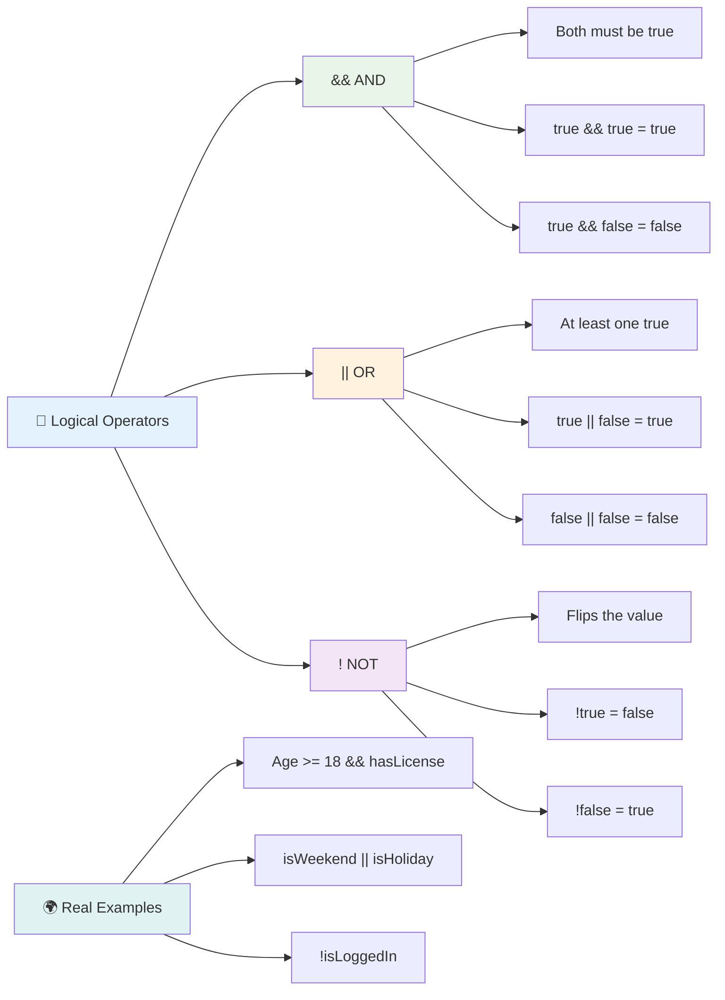

## 論理演算子を使用した条件と判断

これらの論理演算子を使用したより現実的な例を見てみましょう:

```javascript
let currentMoney = 600;
let laptopPrice = 800;
let laptopDiscountPrice = laptopPrice - (laptopPrice * 0.2); // Laptop price at 20 percent off

if (currentMoney >= laptopPrice || currentMoney >= laptopDiscountPrice) {
  // Condition is true. Code in this block will run.
  console.log("Getting a new laptop!");
} else {
  // Condition is false. Code in this block will run.
  console.log("Can't afford a new laptop, yet!");
}
```

この例では: 20%割引価格（640）を計算し、利用可能な資金が全額価格または割引価格のいずれかをカバーするかどうかを評価します。600は割引価格の閾値640を満たしているため、条件は真と評価されます。

### 🧮 **論理演算子チェック: 条件の組み合わせ**

**論理演算子の理解をテストする:**
- 式`A && B`で、Aが偽の場合、Bは評価されますか？
- 3つの演算子（&&、||、!）すべてが必要な状況を考えられますか？
- `!user.isActive`と`user.isActive !== true`の違いは何ですか？

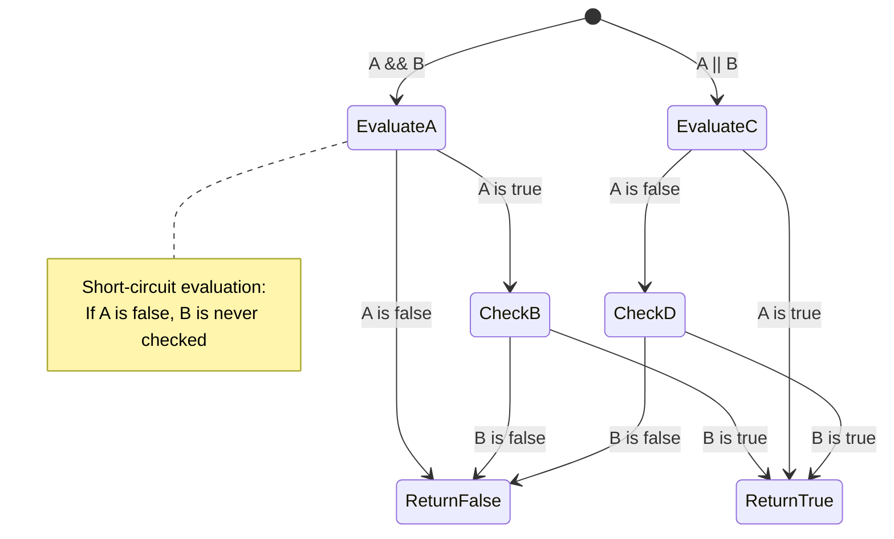

> **パフォーマンスのヒント**: JavaScriptは「ショートサーキット評価」を使用します - `A && B`では、Aが偽の場合、Bは評価されません。これを活用してください！

### 否定演算子

時には、何かが真でない場合を考える方が簡単です。例えば、「ユーザーがログインしているか？」ではなく、「ユーザーがログインしていないか？」を尋ねたい場合があります。感嘆符（`!`）演算子がそのロジックを反転してくれます。

```javascript
if (!condition) {
  // runs if condition is false
} else {
  // runs if condition is true
}
```

`!`演算子は「反対に...」と言うようなものです。何かが`true`であれば、`!`はそれを`false`にし、その逆も同様です。

### 三項式

簡単な条件付き代入の場合、JavaScriptは**三項演算子**を提供します。この簡潔な構文により、条件式を1行で記述することができ、条件に基づいて2つの値のいずれかを割り当てる必要がある場合に便利です。

```javascript
let variable = condition ? returnThisIfTrue : returnThisIfFalse;
```

これは質問のように読めます: 「この条件は真ですか？もしそうなら、この値を使用します。そうでなければ、あの値を使用します。」

以下はより具体的な例です:

```javascript
let firstNumber = 20;
let secondNumber = 10;
let biggestNumber = firstNumber > secondNumber ? firstNumber : secondNumber;
```

✅ このコードを数回読んでみてください。これらの演算子がどのように機能しているか理解できますか？

この行が言っていることは次の通りです: 「`firstNumber`が`secondNumber`より大きいですか？もしそうなら、`firstNumber`を`biggestNumber`に入れます。そうでなければ、`secondNumber`を`biggestNumber`に入れます。」

三項演算子は、従来の`if..else`文を短く書く方法にすぎません:

```javascript
let biggestNumber;
if (firstNumber > secondNumber) {
  biggestNumber = firstNumber;
} else {
  biggestNumber = secondNumber;
}
```

どちらのアプローチも同じ結果を生み出します。三項演算子は簡潔さを提供しますが、従来のif-else構造は複雑な条件に対してより読みやすい場合があります。

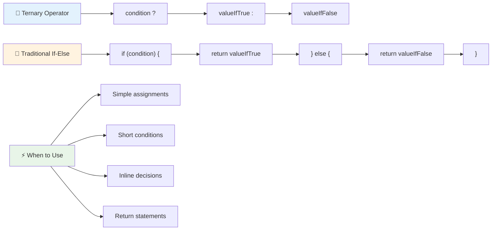

---


## 🚀 チャレンジ

論理演算子を使用して最初に書かれたプログラムを作成し、それを三項式を使用して書き直してください。どちらの構文が好みですか？

---

## GitHub Copilot Agent Challenge 🚀

Agentモードを使用して以下のチャレンジを完了してください:

**説明:** このレッスンの複数の判断概念（if-else文、switch文、論理演算子、三項式）を示す包括的な成績計算機を作成してください。

**プロンプト:** 学生の数値スコア（0-100）を受け取り、以下の基準に基づいてその文字評価を決定するJavaScriptプログラムを作成してください:
- A: 90-100
- B: 80-89  
- C: 70-79
- D: 60-69
- F: 60未満

要件:
1. if-else文を使用して文字評価を決定すること
2. 学生が合格（成績 >= 60）し、かつ優秀（成績 >= 90）であるかを論理演算子を使って確認する  
3. 各文字評価に対して具体的なフィードバックを提供するためにswitch文を使用する  
4. 三項演算子を使って学生が次のコースに進む資格があるか（成績 >= 70）を判断する  
5. スコアが0から100の間であることを確認する入力検証を含める  

さまざまなスコアでプログラムをテストしてください。59、60、89、90のような境界値や無効な入力も含めて試してください。

[agent mode](https://code.visualstudio.com/blogs/2025/02/24/introducing-copilot-agent-mode)についてさらに学ぶにはこちらをご覧ください。

## 講義後のクイズ

[講義後のクイズ](https://ff-quizzes.netlify.app/web/quiz/12)

## 復習と自己学習

利用可能な多くの演算子についてさらに学ぶには、[MDN](https://developer.mozilla.org/docs/Web/JavaScript/Reference/Operators)をご覧ください。

Josh Comeauの素晴らしい[operator lookup](https://joshwcomeau.com/operator-lookup/)をぜひチェックしてください！

## 課題

[Operators](assignment.md)

---

## 🧠 **意思決定ツールキットのまとめ**

```mermaid
graph TD
    A["🎯 JavaScript Decisions"] --> B["🔍 Boolean Logic"]
    A --> C["📊 Conditional Statements"]
    A --> D["🔗 Logical Operators"]
    A --> E["⚡ Advanced Patterns"]
    
    B --> B1["true/false values"]
    B --> B2["Comparison operators"]
    B --> B3["Truthiness concepts"]
    
    C --> C1["if statements"]
    C --> C2["if-else chains"]
    C --> C3["switch statements"]
    
    D --> D1["&& (AND)"]
    D --> D2["|| (OR)"]
    D --> D3["! (NOT)"]
    
    E --> E1["Ternary operator"]
    E --> E2["Short-circuit evaluation"]
    E --> E3["Complex conditions"]
    
    F["💡 Key Principles"] --> F1["Clear readable conditions"]
    F --> F2["Consistent comparison style"]
    F --> F3["Proper operator precedence"]
    F --> F4["Efficient evaluation order"]
    
    style A fill:#e3f2fd
    style B fill:#e8f5e8
    style C fill:#fff3e0
    style D fill:#f3e5f5
    style E fill:#e0f2f1
    style F fill:#fce4ec
```

---

## 🚀 JavaScript意思決定マスタリータイムライン

### ⚡ **次の5分でできること**
- [ ] ブラウザコンソールで比較演算子を練習する  
- [ ] 年齢をチェックする簡単なif-else文を書く  
- [ ] チャレンジに挑戦：if-else文を三項演算子で書き換える  
- [ ] 異なる「truthy」と「falsy」値で何が起こるかテストする  

### 🎯 **この1時間で達成できること**
- [ ] 講義後のクイズを完了し、わかりにくい概念を復習する  
- [ ] GitHub Copilotチャレンジの包括的な成績計算機を作成する  
- [ ] 実際のシナリオ（例えば服を選ぶ）に基づいた簡単な意思決定ツリーを作成する  
- [ ] 論理演算子を使って複数の条件を組み合わせる練習をする  
- [ ] switch文をさまざまな用途で試してみる  

### 📅 **1週間のロジックマスタリー**
- [ ] 創造的な例を使って演算子の課題を完了する  
- [ ] さまざまな条件構造を使用してミニクイズアプリケーションを作成する  
- [ ] 複数の入力条件をチェックするフォームバリデーターを作成する  
- [ ] Josh Comeauの[operator lookup](https://joshwcomeau.com/operator-lookup/)の演習を練習する  
- [ ] 既存のコードをリファクタリングして、より適切な条件構造を使用する  
- [ ] 短絡評価とパフォーマンスへの影響を学ぶ  

### 🌟 **1か月間の変革**
- [ ] 複雑なネスト条件をマスターし、コードの可読性を維持する  
- [ ] 洗練された意思決定ロジックを備えたアプリケーションを構築する  
- [ ] 既存プロジェクトの条件ロジックを改善することでオープンソースに貢献する  
- [ ] さまざまな条件構造とその使用タイミングについて他の人に教える  
- [ ] 条件ロジックへの関数型プログラミングアプローチを探求する  
- [ ] 条件のベストプラクティスに関する個人的な参考ガイドを作成する  

### 🏆 **最終意思決定チャンピオンチェックイン**

**論理的思考のマスタリーを祝おう：**  
- あなたが成功裏に実装した最も複雑な意思決定ロジックは何ですか？  
- どの条件構造が最も自然に感じられ、その理由は何ですか？  
- 論理演算子について学ぶことで、問題解決のアプローチはどのように変わりましたか？  
- 洗練された意思決定ロジックが役立つ現実世界のアプリケーションは何ですか？  

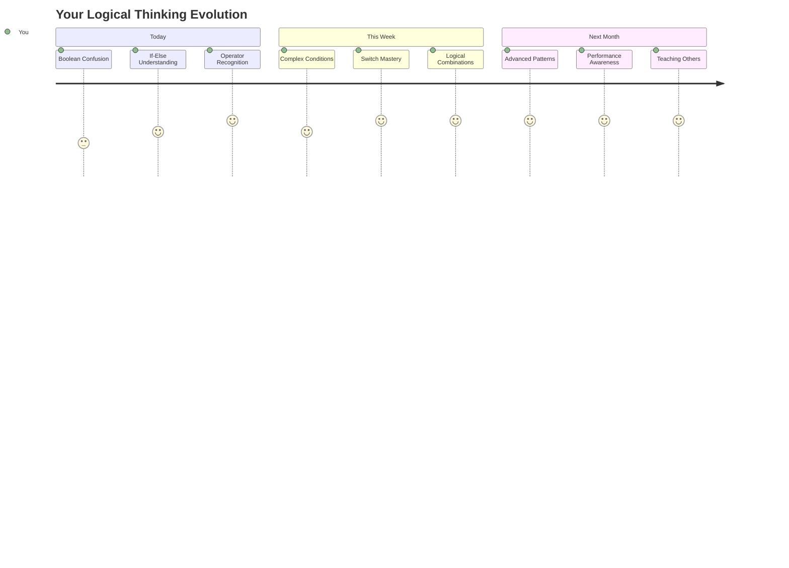
  
> 🧠 **デジタル意思決定の技術をマスターしました！** すべてのインタラクティブなアプリケーションは、ユーザーの行動や変化する条件に知的に対応するために条件ロジックに依存しています。あなたは、プログラムが考え、評価し、適切な応答を選択する方法を理解しました。この論理的な基盤は、あなたが構築するすべての動的なアプリケーションを支える力となるでしょう！ 🎉

---

**免責事項**:  
この文書はAI翻訳サービス[Co-op Translator](https://github.com/Azure/co-op-translator)を使用して翻訳されています。正確性を追求していますが、自動翻訳には誤りや不正確な部分が含まれる可能性があります。元の言語で記載された文書が正式な情報源とみなされるべきです。重要な情報については、専門の人間による翻訳を推奨します。この翻訳の使用に起因する誤解や誤解について、当社は責任を負いません。