<!--
CO_OP_TRANSLATOR_METADATA:
{
  "original_hash": "1710a50a519a6e4a1b40a5638783018d",
  "translation_date": "2025-11-06T12:27:11+00:00",
  "source_file": "2-js-basics/4-arrays-loops/README.md",
  "language_code": "ja"
}
-->
# JavaScriptの基本: 配列とループ


> スケッチノート: [Tomomi Imura](https://twitter.com/girlie_mac)

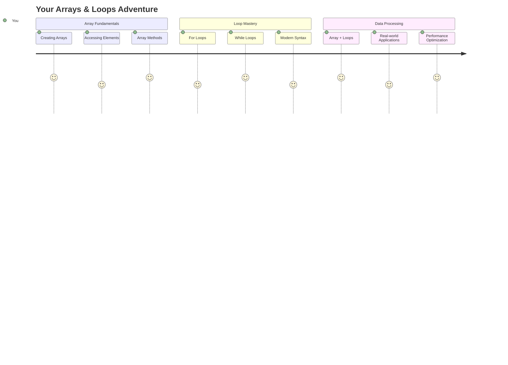

## 講義前のクイズ
[講義前のクイズ](https://ff-quizzes.netlify.app/web/quiz/13)

ウェブサイトがショッピングカートのアイテムを管理したり、友達リストを表示したりする仕組みを考えたことはありますか？それが配列とループの役割です。配列は複数の情報を保持するデジタルコンテナのようなもので、ループはそのデータを効率的に処理するためのツールです。

これら2つの概念を組み合わせることで、プログラム内で情報を扱う基盤が形成されます。手動で一つ一つのステップを書き出すのではなく、数百や数千のアイテムを迅速に処理できるスマートで効率的なコードを作成する方法を学びます。

このレッスンの終わりには、数行のコードで複雑なデータ処理を達成する方法を理解できるようになります。それでは、これらの重要なプログラミング概念を探ってみましょう。

[](https://youtube.com/watch?v=1U4qTyq02Xw "Arrays")

[](https://www.youtube.com/watch?v=Eeh7pxtTZ3k "Loops")

> 🎥 上記の画像をクリックして、配列とループに関する動画をご覧ください。

> このレッスンは[Microsoft Learn](https://docs.microsoft.com/learn/modules/web-development-101-arrays/?WT.mc_id=academic-77807-sagibbon)で受講できます！

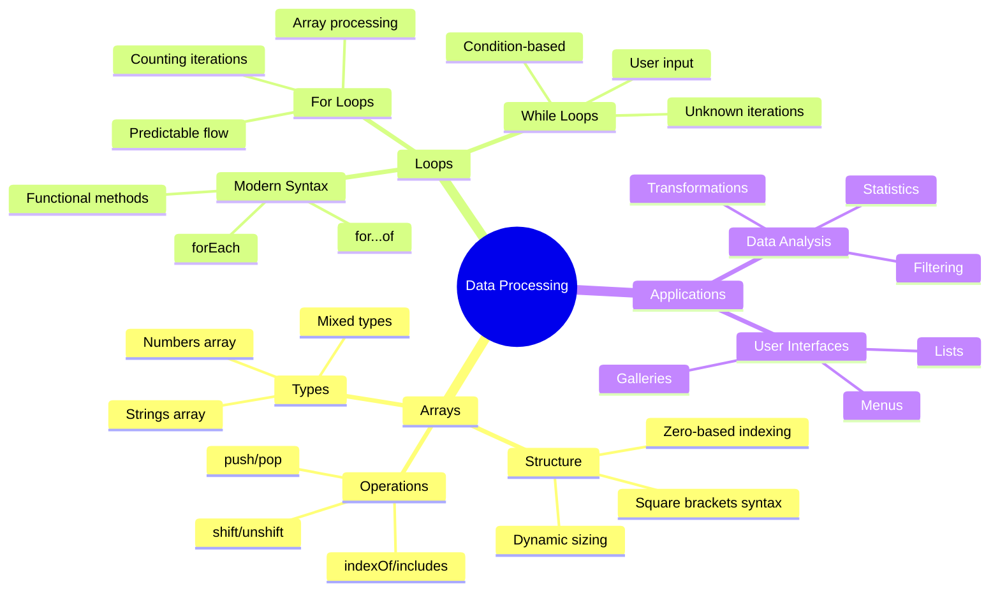

## 配列

配列はデジタルのファイリングキャビネットのようなものです。一つの引き出しに一つの書類を保存する代わりに、関連する複数のアイテムを一つの構造化されたコンテナに整理できます。プログラミングの観点では、配列を使うことで複数の情報を一つのパッケージにまとめて保存できます。

写真ギャラリーを作成したり、やることリストを管理したり、ゲームのハイスコアを追跡したりする場合、配列はデータを整理する基盤を提供します。それでは、配列の仕組みを見てみましょう。

✅ 配列は私たちの周りにたくさんあります！例えば、ソーラーパネルの配列のような実生活の例を考えてみてください。

### 配列の作成

配列を作成するのはとても簡単です。角括弧を使うだけです！

```javascript
// Empty array - like an empty shopping cart waiting for items
const myArray = [];
```

**ここで何が起きているのか？**
角括弧 `[]` を使って空のコンテナを作成しました。これは空の図書館の棚のようなもので、そこに整理したい本を置く準備ができています。

初期値を設定して配列を作成することもできます。

```javascript
// Your ice cream shop's flavor menu
const iceCreamFlavors = ["Chocolate", "Strawberry", "Vanilla", "Pistachio", "Rocky Road"];

// A user's profile info (mixing different types of data)
const userData = ["John", 25, true, "developer"];

// Test scores for your favorite class
const scores = [95, 87, 92, 78, 85];
```

**注目すべきポイント:**
- 配列にはテキスト、数字、または真偽値を混在して保存できます
- 各アイテムをコンマで区切るだけで簡単です
- 配列は関連する情報をまとめて保存するのに最適です

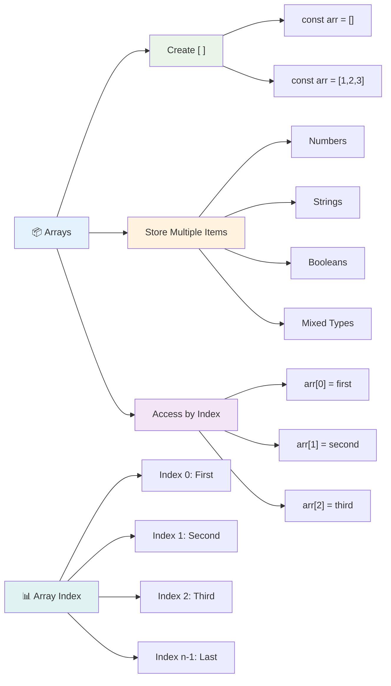

### 配列のインデックス

最初は少し奇妙に感じるかもしれませんが、配列はアイテムを0から番号付けします。これはコンピュータのメモリの仕組みに由来しており、C言語のような初期のプログラミング言語からの慣例です。配列内の各場所には、**インデックス**と呼ばれるアドレス番号が割り当てられます。

| インデックス | 値 | 説明 |
|-------------|-----|------|
| 0 | "Chocolate" | 最初の要素 |
| 1 | "Strawberry" | 2番目の要素 |
| 2 | "Vanilla" | 3番目の要素 |
| 3 | "Pistachio" | 4番目の要素 |
| 4 | "Rocky Road" | 5番目の要素 |

✅ 配列が0からインデックスを始めることに驚きましたか？一部のプログラミング言語ではインデックスが1から始まります。この歴史については[Wikipedia](https://en.wikipedia.org/wiki/Zero-based_numbering)で読むことができます。

**配列要素へのアクセス:**

```javascript
const iceCreamFlavors = ["Chocolate", "Strawberry", "Vanilla", "Pistachio", "Rocky Road"];

// Access individual elements using bracket notation
console.log(iceCreamFlavors[0]); // "Chocolate" - first element
console.log(iceCreamFlavors[2]); // "Vanilla" - third element
console.log(iceCreamFlavors[4]); // "Rocky Road" - last element
```

**ここで何が起きているのか？**
- **使用**: インデックス番号を角括弧記法で指定して要素にアクセス
- **返却**: 配列内の特定の位置に保存されている値
- **開始**: 0からカウントするため、最初の要素のインデックスは0

**配列要素の変更:**

```javascript
// Change an existing value
iceCreamFlavors[4] = "Butter Pecan";
console.log(iceCreamFlavors[4]); // "Butter Pecan"

// Add a new element at the end
iceCreamFlavors[5] = "Cookie Dough";
console.log(iceCreamFlavors[5]); // "Cookie Dough"
```

**上記で行ったこと:**
- **変更**: インデックス4の要素を"Rocky Road"から"Butter Pecan"に変更
- **追加**: インデックス5に新しい要素"Cookie Dough"を追加
- **拡張**: 現在の範囲を超えて追加すると配列の長さが自動的に拡張される

### 配列の長さと便利なメソッド

配列にはデータ操作を簡単にするための組み込みプロパティとメソッドがあります。

**配列の長さを取得:**

```javascript
const iceCreamFlavors = ["Chocolate", "Strawberry", "Vanilla", "Pistachio", "Rocky Road"];
console.log(iceCreamFlavors.length); // 5

// Length updates automatically as array changes
iceCreamFlavors.push("Mint Chip");
console.log(iceCreamFlavors.length); // 6
```

**覚えておくべきポイント:**
- **返却**: 配列内の要素の総数
- **更新**: 要素が追加または削除されると自動的に更新
- **提供**: ループや検証に役立つ動的なカウント

**基本的な配列メソッド:**

```javascript
const fruits = ["apple", "banana", "orange"];

// Add elements
fruits.push("grape");           // Adds to end: ["apple", "banana", "orange", "grape"]
fruits.unshift("strawberry");   // Adds to beginning: ["strawberry", "apple", "banana", "orange", "grape"]

// Remove elements
const lastFruit = fruits.pop();        // Removes and returns "grape"
const firstFruit = fruits.shift();     // Removes and returns "strawberry"

// Find elements
const index = fruits.indexOf("banana"); // Returns 1 (position of "banana")
const hasApple = fruits.includes("apple"); // Returns true
```

**これらのメソッドの理解:**
- `push()` (末尾) と `unshift()` (先頭) で要素を追加
- `pop()` (末尾) と `shift()` (先頭) で要素を削除
- `indexOf()` で要素の位置を特定し、`includes()` で存在を確認
- 削除された要素や位置インデックスなどの便利な値を返却

✅ 自分で試してみましょう！ブラウザのコンソールを使って、自分で作成した配列を操作してみてください。

### 🧠 **配列の基本チェック: データの整理**

**配列の理解をテスト:**
- 配列が0からカウントを始める理由は何だと思いますか？
- 存在しないインデックス (例えば5要素の配列で`arr[100]`) にアクセスしようとするとどうなりますか？
- 配列が役立つ3つの実世界のシナリオを考えてみてください。

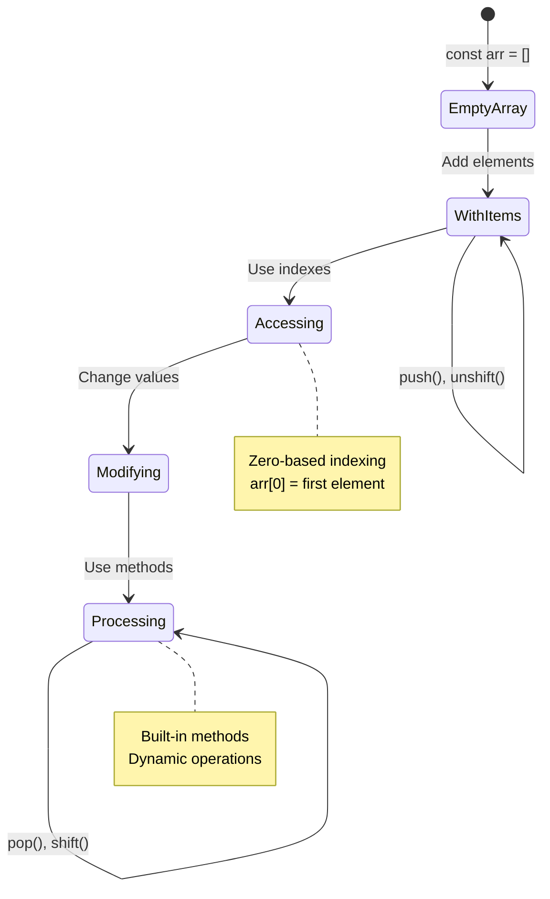

> **実世界の洞察**: 配列はプログラミングの至る所で使われています！ソーシャルメディアのフィード、ショッピングカート、写真ギャラリー、プレイリストの曲 - これらはすべて裏で配列が使われています！

## ループ

チャールズ・ディケンズの小説に出てくる罰として、生徒がスレートに何度も同じ文を書かされる場面を思い出してください。もし「この文を100回書いて」と指示するだけで自動的に完了する方法があったらどうでしょう？それがコードにおけるループの役割です。

ループは、エラーなくタスクを繰り返す疲れ知らずのアシスタントのようなものです。ショッピングカート内のすべてのアイテムを確認したり、アルバム内のすべての写真を表示したりする場合、ループは効率的に繰り返し処理を行います。

JavaScriptにはいくつかの種類のループがあり、それぞれの使いどころを理解することが重要です。

```mermaid
flowchart TD
    A["🔄 Loop Types"] --> B["For Loop"]
    A --> C["While Loop"]
    A --> D["For...of Loop"]
    A --> E["forEach Method"]
    
    B --> B1["Known iterations"]
    B --> B2["Counter-based"]
    B --> B3["for(init; condition; increment)"]
    
    C --> C1["Unknown iterations"]
    C --> C2["Condition-based"]
    C --> C3["while(condition)"]
    
    D --> D1["Modern ES6+"]
    D --> D2["Array iteration"]
    D --> D3["for(item of array)"]
    
    E --> E1["Functional style"]
    E --> E2["Array method"]
    E --> E3["array.forEach(callback)"]
    
    F["⏰ When to Use"] --> F1["For: Counting, indexes"]
    F --> F2["While: User input, searching"]
    F --> F3["For...of: Simple iteration"]
    F --> F4["forEach: Functional programming"]
    
    style A fill:#e3f2fd
    style B fill:#e8f5e8
    style C fill:#fff3e0
    style D fill:#f3e5f5
    style E fill:#e0f2f1
    style F fill:#fce4ec
```

### Forループ

`for`ループはタイマーを設定するようなもので、何回実行するかを正確に把握しています。非常に整理されていて予測可能なので、配列を操作したり、何かをカウントする必要がある場合に最適です。

**Forループの構造:**

| コンポーネント | 目的 | 例 |
|---------------|------|----|
| **初期化** | 開始点を設定 | `let i = 0` |
| **条件** | 継続する条件 | `i < 10` |
| **増分** | 更新方法 | `i++` |

```javascript
// Counting from 0 to 9
for (let i = 0; i < 10; i++) {
  console.log(`Count: ${i}`);
}

// More practical example: processing scores
const testScores = [85, 92, 78, 96, 88];
for (let i = 0; i < testScores.length; i++) {
  console.log(`Student ${i + 1}: ${testScores[i]}%`);
}
```

**ステップごとに何が起きているか:**
- **初期化**: カウンタ変数`i`を0に設定
- **条件確認**: 各反復前に`i < 10`を確認
- **実行**: 条件が真の場合にコードブロックを実行
- **増分**: 各反復後に`i`を1増加 (`i++`)
- **停止**: 条件が偽になると停止 (例: `i`が10に達したとき)

✅ このコードをブラウザのコンソールで実行してみましょう。カウンタ、条件、または反復式に小さな変更を加えると何が起きるか確認してください。逆方向に動作させてカウントダウンを作成できますか？

### 🗓️ **Forループのマスターチェック: 制御された繰り返し**

**Forループの理解を評価:**
- Forループの3つの部分は何で、それぞれ何をしますか？
- 配列を逆方向にループするにはどうすればよいですか？
- 増分部分 (`i++`) を忘れるとどうなりますか？

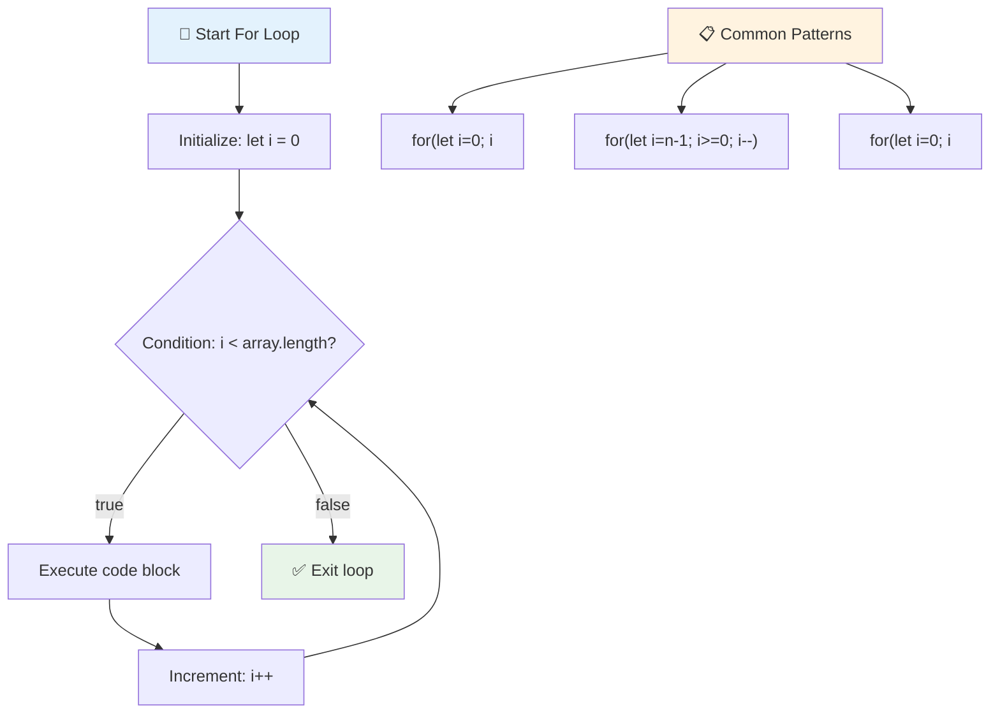

> **ループの知恵**: Forループは、何回繰り返す必要があるか正確にわかっている場合に最適です。配列処理に最も一般的に使用されます！

### Whileループ

`while`ループは「これを続けて...」と言うようなもので、正確に何回実行するかはわからないけれど、いつ停止するかはわかっています。ユーザーが必要な入力を提供するまで尋ねたり、探しているデータが見つかるまで検索したりする場合に最適です。

**Whileループの特徴:**
- **条件が真である限り**実行を続ける
- **カウンタ変数の手動管理**が必要
- **各反復前に条件を確認**
- **条件が偽にならない場合**無限ループのリスクがある

```javascript
// Basic counting example
let i = 0;
while (i < 10) {
  console.log(`While count: ${i}`);
  i++; // Don't forget to increment!
}

// More practical example: processing user input
let userInput = "";
let attempts = 0;
const maxAttempts = 3;

while (userInput !== "quit" && attempts < maxAttempts) {
  userInput = prompt(`Enter 'quit' to exit (attempt ${attempts + 1}):`);
  attempts++;
}

if (attempts >= maxAttempts) {
  console.log("Maximum attempts reached!");
}
```

**これらの例の理解:**
- **カウンタ変数`i`を手動で管理**し、ループ内で更新
- **カウンタを増分**して無限ループを防止
- **ユーザー入力と試行回数制限**の実用例を示す
- **安全メカニズムを含む**ことで無限実行を防止

### ♾️ **Whileループの知恵チェック: 条件ベースの繰り返し**

**Whileループの理解をテスト:**
- Whileループを使用する際の主な危険は何ですか？
- ForループではなくWhileループを選ぶのはどんな場合ですか？
- 無限ループを防ぐにはどうすればよいですか？

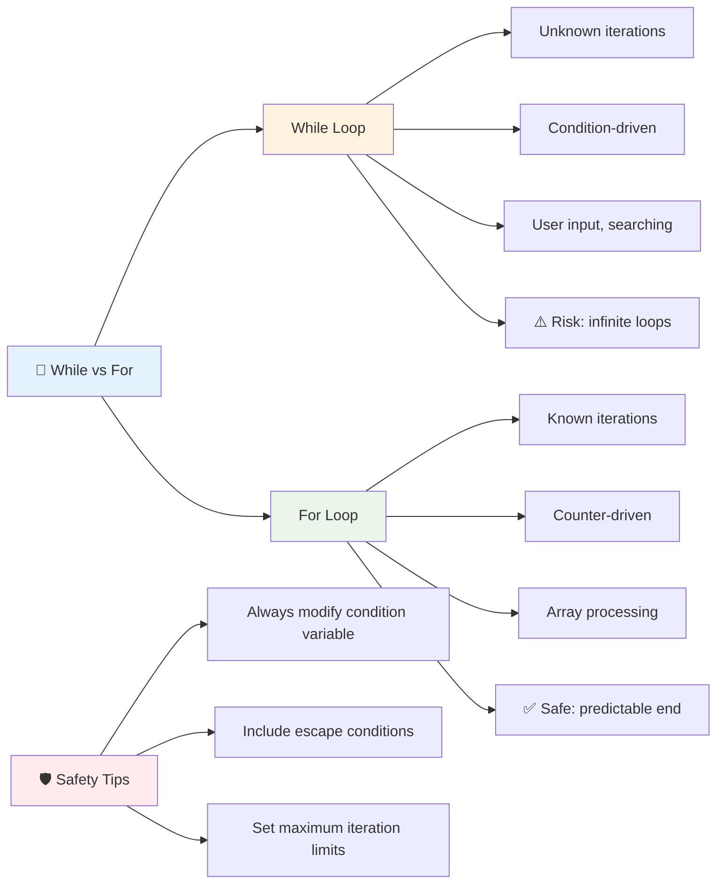

> **安全第一**: Whileループは強力ですが、条件管理に注意が必要です。ループ条件が最終的に偽になることを常に確認してください！

### モダンなループの代替案

JavaScriptには、コードをより読みやすく、エラーを減らすためのモダンなループ構文があります。

**For...ofループ (ES6+):**

```javascript
const colors = ["red", "green", "blue", "yellow"];

// Modern approach - cleaner and safer
for (const color of colors) {
  console.log(`Color: ${color}`);
}

// Compare with traditional for loop
for (let i = 0; i < colors.length; i++) {
  console.log(`Color: ${colors[i]}`);
}
```

**For...ofの主な利点:**
- **インデックス管理を排除**し、オフバイワンエラーを防止
- **配列要素に直接アクセス**を提供
- **コードの可読性を向上**し、構文の複雑さを軽減

**forEachメソッド:**

```javascript
const prices = [9.99, 15.50, 22.75, 8.25];

// Using forEach for functional programming style
prices.forEach((price, index) => {
  console.log(`Item ${index + 1}: $${price.toFixed(2)}`);
});

// forEach with arrow functions for simple operations
prices.forEach(price => console.log(`Price: $${price}`));
```

**forEachについて知っておくべきこと:**
- **各配列要素に対して関数を実行**
- **要素の値とインデックスをパラメータとして提供**
- **従来のループと異なり早期停止ができない**
- **新しい配列を作成せず、undefinedを返却**

✅ ForループとWhileループのどちらを選ぶべきか？17K人の視聴者がStackOverflowで同じ質問をしており、いくつかの意見が[興味深いかもしれません](https://stackoverflow.com/questions/39969145/while-loops-vs-for-loops-in-javascript)。

### 🎨 **モダンなループ構文チェック: ES6+を活用**

**モダンなJavaScriptの理解を評価:**
- 従来のForループに比べて`for...of`の利点は何ですか？
- それでも従来のForループを選ぶ場合はどんな時ですか？
- `forEach`と`map`の違いは何ですか？

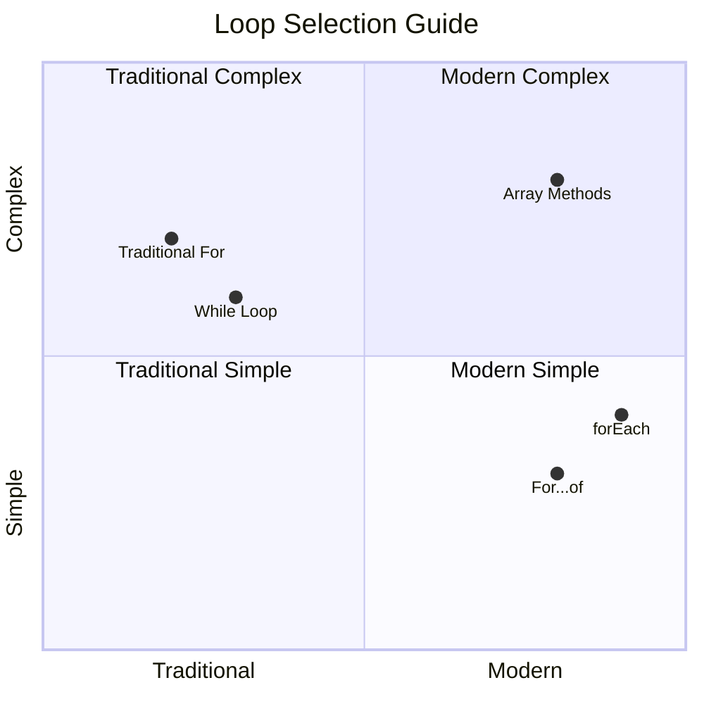

> **モダンなトレンド**: ES6+の構文である`for...of`や`forEach`は、配列の反復処理においてよりクリーンでエラーが少ない方法として好まれるようになっています！

## ループと配列

配列とループを組み合わせることで、強力なデータ処理能力が生まれます。この組み合わせは、リストの表示から統計の計算まで、多くのプログラミングタスクの基盤となります。

**従来の配列処理:**

```javascript
const iceCreamFlavors = ["Chocolate", "Strawberry", "Vanilla", "Pistachio", "Rocky Road"];

// Classic for loop approach
for (let i = 0; i < iceCreamFlavors.length; i++) {
  console.log(`Flavor ${i + 1}: ${iceCreamFlavors[i]}`);
}

// Modern for...of approach
for (const flavor of iceCreamFlavors) {
  console.log(`Available flavor: ${flavor}`);
}
```

**各アプローチを理解しましょう:**
- **配列の長さプロパティを使用**してループの境界を決定
- **従来のForループでインデックスを使用して要素にアクセス**
- **For...ofループで直接要素にアクセス**
- **各配列要素を正確に1回処理**

**実用的なデータ処理例:**

```javascript
const studentGrades = [85, 92, 78, 96, 88, 73, 89];
let total = 0;
let highestGrade = studentGrades[0];
let lowestGrade = studentGrades[0];

// Process all grades with a single loop
for (let i = 0; i < studentGrades.length; i++) {
  const grade = studentGrades[i];
  total += grade;
  
  if (grade > highestGrade) {
    highestGrade = grade;
  }
  
  if (grade < lowestGrade) {
    lowestGrade = grade;
  }
}

const average = total / studentGrades.length;
console.log(`Average: ${average.toFixed(1)}`);
console.log(`Highest: ${highestGrade}`);
console.log(`Lowest: ${lowestGrade}`);
```

**このコードの仕組み:**
- **合計や極値を追跡する変数を初期化**
- **単一の効率的なループで各成績を処理**
- **平均計算のために合計を蓄積**
- **反復中に最高値と最低値を追跡**
- **ループ完了後に最終的な統計を計算**

✅ 自分で作成した配列をブラウザのコンソールでループ処理してみましょう。

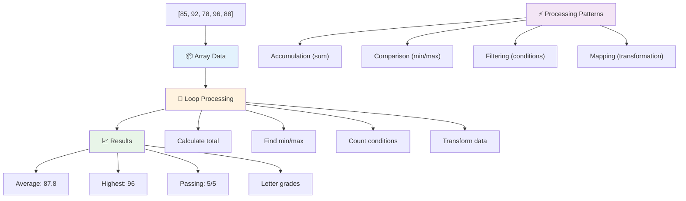

---

## GitHub Copilot Agent Challenge 🚀

Agentモードを使用して以下のチャレンジを完了してください:

**説明:** 配列とループを組み合わせてデータセットを分析し、有意義な洞察を生成する包括的なデータ処理関数を作成してください。

**プロンプト:** `analyzeGrades`という関数を作成し、学生の成績オブジェクトの配列 (各オブジェクトには名前とスコアプロパティが含まれる) を受け取り、最高スコア、最低スコア、平均スコア、合格した学生の数 (スコア >= 70)、および平均スコアを上回った学生の名前の配列を含む統計を返すオブジェクトを生成してください。解決策には少なくとも2種類のループを使用してください。

[Agentモード](https://code.visualstudio.com/blogs/2025/02/24/introducing-copilot-agent-mode)について詳しくはこちらをご覧ください。

## 🚀 チャレンジ
JavaScriptは、特定のタスクにおいて従来のループを置き換えることができるいくつかのモダンな配列メソッドを提供しています。[forEach](https://developer.mozilla.org/docs/Web/JavaScript/Reference/Global_Objects/Array/forEach)、[for-of](https://developer.mozilla.org/docs/Web/JavaScript/Reference/Statements/for...of)、[map](https://developer.mozilla.org/docs/Web/JavaScript/Reference/Global_Objects/Array/map)、[filter](https://developer.mozilla.org/docs/Web/JavaScript/Reference/Global_Objects/Array/filter)、そして[reduce](https://developer.mozilla.org/docs/Web/JavaScript/Reference/Global_Objects/Array/reduce)を試してみてください。

**チャレンジ:** 学生の成績例を少なくとも3つの異なる配列メソッドを使用してリファクタリングしてください。モダンなJavaScript構文を使うことで、コードがどれほどクリーンで読みやすくなるかを確認してください。

## 講義後のクイズ
[講義後のクイズ](https://ff-quizzes.netlify.app/web/quiz/14)

## 復習と自己学習

JavaScriptの配列には、データ操作に非常に便利な多くのメソッドが付属しています。[これらのメソッドについて読む](https://developer.mozilla.org/docs/Web/JavaScript/Reference/Global_Objects/Array)とともに、自分で作成した配列でいくつか試してみてください（例えば、push、pop、slice、spliceなど）。

## 課題

[配列をループする](assignment.md)

---

## 📊 **配列とループツールキットのまとめ**

```mermaid
graph TD
    A["🎯 Arrays & Loops Mastery"] --> B["📦 Array Fundamentals"]
    A --> C["🔄 Loop Types"]
    A --> D["🔗 Data Processing"]
    A --> E["🎨 Modern Techniques"]
    
    B --> B1["Creation: [ ]"]
    B --> B2["Indexing: arr[0]"]
    B --> B3["Methods: push, pop"]
    B --> B4["Properties: length"]
    
    C --> C1["For: Known iterations"]
    C --> C2["While: Condition-based"]
    C --> C3["For...of: Direct access"]
    C --> C4["forEach: Functional"]
    
    D --> D1["Statistics calculation"]
    D --> D2["Data transformation"]
    D --> D3["Filtering & searching"]
    D --> D4["Real-time processing"]
    
    E --> E1["Arrow functions"]
    E --> E2["Method chaining"]
    E --> E3["Destructuring"]
    E --> E4["Template literals"]
    
    F["💡 Key Benefits"] --> F1["Efficient data handling"]
    F --> F2["Reduced code repetition"]
    F --> F3["Scalable solutions"]
    F --> F4["Cleaner syntax"]
    
    style A fill:#e3f2fd
    style B fill:#e8f5e8
    style C fill:#fff3e0
    style D fill:#f3e5f5
    style E fill:#e0f2f1
    style F fill:#fce4ec
```

---

## 🚀 配列とループの習得タイムライン

### ⚡ **次の5分間でできること**
- [ ] 好きな映画の配列を作成し、特定の要素にアクセスする
- [ ] 1から10までカウントするforループを書く
- [ ] レッスンのモダンな配列メソッドチャレンジを試す
- [ ] ブラウザコンソールで配列のインデックス操作を練習する

### 🎯 **この1時間で達成できること**
- [ ] レッスン後のクイズを完了し、難しい概念を復習する
- [ ] GitHub Copilotチャレンジの包括的な成績分析ツールを作成する
- [ ] アイテムを追加・削除する簡単なショッピングカートを作成する
- [ ] 異なるループタイプへの変換を練習する
- [ ] `push`、`pop`、`slice`、`splice`などの配列メソッドを試す

### 📅 **1週間のデータ処理の旅**
- [ ] 創造的な工夫を加えた「配列をループする」課題を完了する
- [ ] 配列とループを使用したTo-Doリストアプリを作成する
- [ ] 数値データの簡単な統計計算機を作成する
- [ ] [MDNの配列メソッド](https://developer.mozilla.org/docs/Web/JavaScript/Reference/Global_Objects/Array)を練習する
- [ ] フォトギャラリーや音楽プレイリストのインターフェースを作成する
- [ ] `map`、`filter`、`reduce`を使った関数型プログラミングを探求する

### 🌟 **1か月間の変革**
- [ ] 高度な配列操作とパフォーマンス最適化を習得する
- [ ] 完全なデータ可視化ダッシュボードを作成する
- [ ] データ処理に関するオープンソースプロジェクトに貢献する
- [ ] 実用的な例を使って配列とループについて他の人に教える
- [ ] 再利用可能なデータ処理関数の個人ライブラリを作成する
- [ ] 配列を基にしたアルゴリズムとデータ構造を探求する

### 🏆 **データ処理チャンピオンの最終チェックイン**

**配列とループの習得を祝う:**
- 実際のアプリケーションで最も役立つ配列操作は何ですか？
- どのループタイプが最も自然に感じられますか？その理由は？
- 配列とループを理解することで、データの整理方法にどのような変化がありましたか？
- 次に取り組みたい複雑なデータ処理タスクは何ですか？

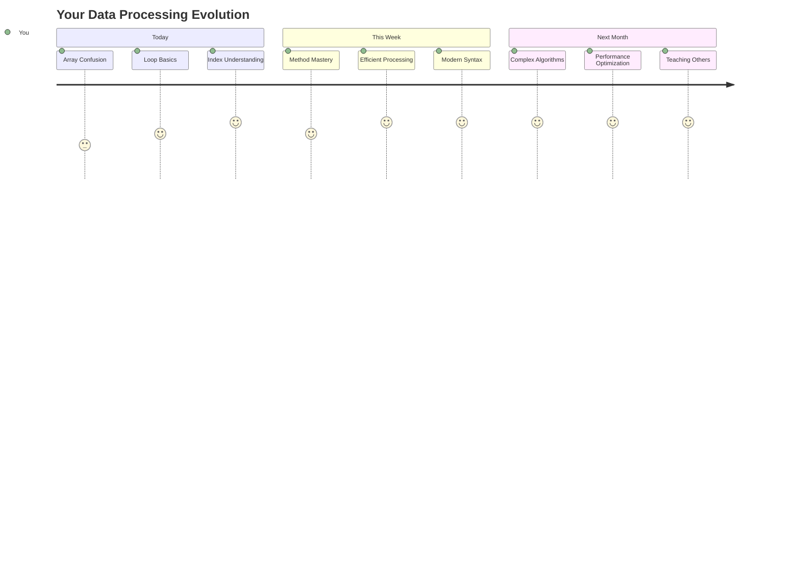

> 📦 **データの整理と処理の力を解き放ちました！** 配列とループは、これから作成するほぼすべてのアプリケーションの基盤です。シンプルなリストから複雑なデータ分析まで、情報を効率的かつエレガントに処理するためのツールを手に入れました。動的なウェブサイト、モバイルアプリ、データ駆動型アプリケーションはすべて、これらの基本的な概念に依存しています。スケーラブルなデータ処理の世界へようこそ！ 🎉

---

**免責事項**:  
この文書はAI翻訳サービス[Co-op Translator](https://github.com/Azure/co-op-translator)を使用して翻訳されています。正確性を追求していますが、自動翻訳には誤りや不正確さが含まれる可能性があります。元の言語で記載された文書を正式な情報源としてください。重要な情報については、専門の人間による翻訳を推奨します。この翻訳の使用に起因する誤解や誤解について、当社は責任を負いません。