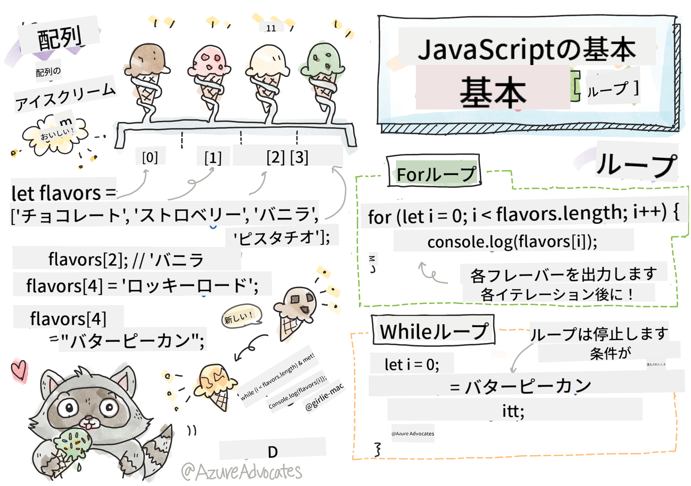

<!--
CO_OP_TRANSLATOR_METADATA:
{
  "original_hash": "9029f96b0e034839c1799f4595e4bb66",
  "translation_date": "2025-08-28T17:56:02+00:00",
  "source_file": "2-js-basics/4-arrays-loops/README.md",
  "language_code": "ja"
}
-->
# JavaScriptの基本: 配列とループ


> スケッチノート: [Tomomi Imura](https://twitter.com/girlie_mac)

## 講義前のクイズ
[講義前のクイズ](https://ff-quizzes.netlify.app/web/quiz/13)

このレッスンでは、ウェブ上でインタラクティブな機能を提供するJavaScriptの基本について学びます。このレッスンでは、データを操作するために使用される配列とループについて学びます。

[](https://youtube.com/watch?v=1U4qTyq02Xw "配列")

[](https://www.youtube.com/watch?v=Eeh7pxtTZ3k "ループ")

> 🎥 上記の画像をクリックすると、配列とループに関する動画が視聴できます。

> このレッスンは[Microsoft Learn](https://docs.microsoft.com/learn/modules/web-development-101-arrays/?WT.mc_id=academic-77807-sagibbon)で受講できます！

## 配列

データを扱うことはどのプログラミング言語でも一般的な作業であり、配列のような構造化された形式でデータが整理されていると、作業が非常に簡単になります。配列を使用すると、リストに似た構造でデータを保存できます。配列の大きな利点は、1つの配列に異なる種類のデータを保存できることです。

✅ 配列は私たちの周りにたくさんあります！例えば、太陽光パネルの配列のような実生活の例を思い浮かべられますか？

配列の構文は、角括弧のペアです。

```javascript
let myArray = [];
```

これは空の配列ですが、配列はすでにデータが入った状態で宣言することもできます。配列内の複数の値はコンマで区切られます。

```javascript
let iceCreamFlavors = ["Chocolate", "Strawberry", "Vanilla", "Pistachio", "Rocky Road"];
```

配列の値には**インデックス**と呼ばれる一意の値が割り当てられます。インデックスは配列の先頭からの距離に基づいて割り当てられる整数です。上記の例では、文字列値「Chocolate」のインデックスは0で、「Rocky Road」のインデックスは4です。インデックスを角括弧とともに使用して、配列の値を取得、変更、または挿入できます。

✅ 配列がゼロインデックスから始まることに驚きましたか？一部のプログラミング言語では、インデックスは1から始まります。この歴史については[Wikipedia](https://en.wikipedia.org/wiki/Zero-based_numbering)で読むことができます。

```javascript
let iceCreamFlavors = ["Chocolate", "Strawberry", "Vanilla", "Pistachio", "Rocky Road"];
iceCreamFlavors[2]; //"Vanilla"
```

インデックスを利用して値を変更することができます。例えば以下のように:

```javascript
iceCreamFlavors[4] = "Butter Pecan"; //Changed "Rocky Road" to "Butter Pecan"
```

また、指定したインデックスに新しい値を挿入することもできます。

```javascript
iceCreamFlavors[5] = "Cookie Dough"; //Added "Cookie Dough"
```

✅ 配列に値を追加するより一般的な方法は、array.push()のような配列演算子を使用することです。

配列内の項目数を調べるには、`length`プロパティを使用します。

```javascript
let iceCreamFlavors = ["Chocolate", "Strawberry", "Vanilla", "Pistachio", "Rocky Road"];
iceCreamFlavors.length; //5
```

✅ 自分で試してみましょう！ブラウザのコンソールを使用して、自分で作成した配列を操作してみてください。

## ループ

ループを使用すると、繰り返しまたは**反復**的な作業を行うことができ、時間とコードを大幅に節約できます。各反復では変数、値、条件が異なる場合があります。JavaScriptにはさまざまな種類のループがあり、それぞれに小さな違いがありますが、基本的には同じことを行います: データをループすることです。

### Forループ

`for`ループは反復するために3つの部分が必要です:
- `counter` 通常、反復回数を数えるために数値で初期化される変数
- `condition` 比較演算子を使用して`false`になるとループを停止させる式
- `iteration-expression` 各反復の最後に実行され、通常はカウンター値を変更するために使用される
  
```javascript
// Counting up to 10
for (let i = 0; i < 10; i++) {
  console.log(i);
}
```

✅ このコードをブラウザのコンソールで実行してみましょう。カウンター、条件、または反復式を少し変更するとどうなりますか？逆方向に動作させてカウントダウンを作成できますか？

### Whileループ

`for`ループの構文とは異なり、`while`ループは条件だけを必要とし、その条件が`false`になるとループを停止します。ループ内の条件は通常、カウンターなどの他の値に依存し、ループ中に管理する必要があります。カウンターの初期値はループの外で作成する必要があり、条件を満たすための式やカウンターの変更はループ内で維持する必要があります。

```javascript
//Counting up to 10
let i = 0;
while (i < 10) {
 console.log(i);
 i++;
}
```

✅ なぜforループではなくwhileループを選ぶのでしょうか？StackOverflowでは17K人の視聴者が同じ質問をしており、いくつかの意見が[興味深いかもしれません](https://stackoverflow.com/questions/39969145/while-loops-vs-for-loops-in-javascript)。

## ループと配列

配列はループと一緒に使用されることが多いです。ほとんどの条件は配列の長さを使用してループを停止し、インデックスはカウンター値としても使用できます。

```javascript
let iceCreamFlavors = ["Chocolate", "Strawberry", "Vanilla", "Pistachio", "Rocky Road"];

for (let i = 0; i < iceCreamFlavors.length; i++) {
  console.log(iceCreamFlavors[i]);
} //Ends when all flavors are printed
```

✅ 自分で作成した配列をブラウザのコンソールでループしてみましょう。

---

## 🚀 チャレンジ

配列をループする方法はforループやwhileループだけではありません。[forEach](https://developer.mozilla.org/docs/Web/JavaScript/Reference/Global_Objects/Array/forEach)、[for-of](https://developer.mozilla.org/docs/Web/JavaScript/Reference/Statements/for...of)、[map](https://developer.mozilla.org/docs/Web/JavaScript/Reference/Global_Objects/Array/map)などがあります。これらの技術のいずれかを使用して、配列ループを書き直してみましょう。

## 講義後のクイズ
[講義後のクイズ](https://ff-quizzes.netlify.app/web/quiz/14)

## 復習と自己学習

JavaScriptの配列には、データ操作に非常に便利な多くのメソッドが付属しています。[これらのメソッドについて読む](https://developer.mozilla.org/docs/Web/JavaScript/Reference/Global_Objects/Array)とともに、作成した配列でいくつか試してみてください（例えばpush、pop、slice、spliceなど）。

## 課題

[配列をループする](assignment.md)

---

**免責事項**:  
この文書は、AI翻訳サービス [Co-op Translator](https://github.com/Azure/co-op-translator) を使用して翻訳されています。正確性を追求しておりますが、自動翻訳には誤りや不正確な部分が含まれる可能性があることをご承知ください。元の言語で記載された文書が正式な情報源とみなされるべきです。重要な情報については、専門の人間による翻訳を推奨します。この翻訳の使用に起因する誤解や誤解釈について、当方は一切の責任を負いません。