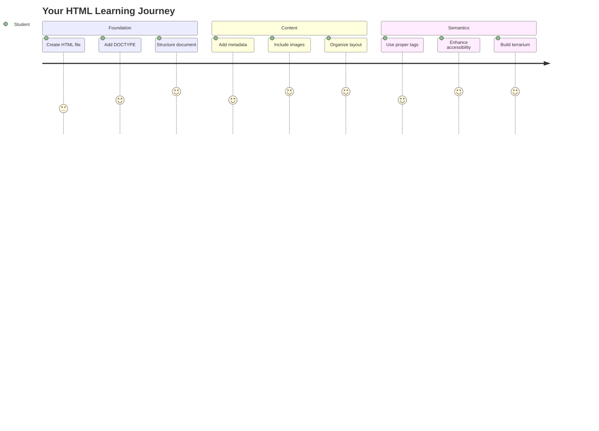
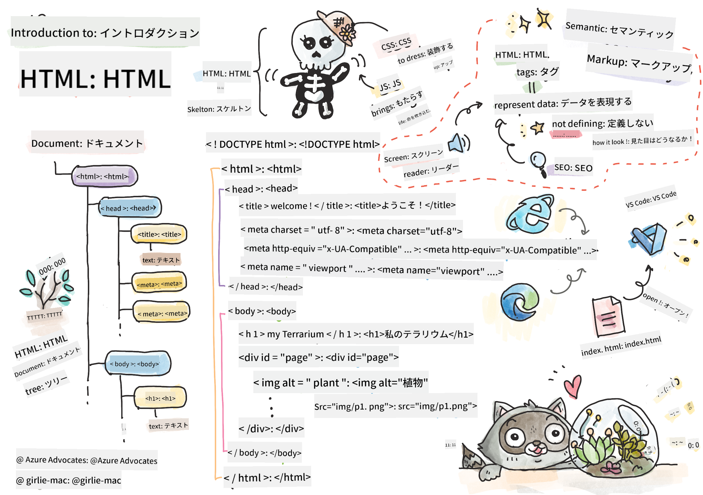
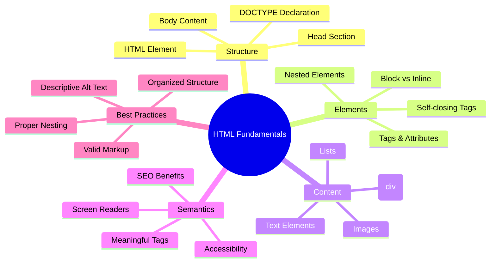
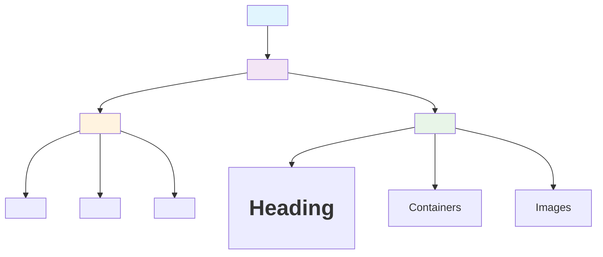
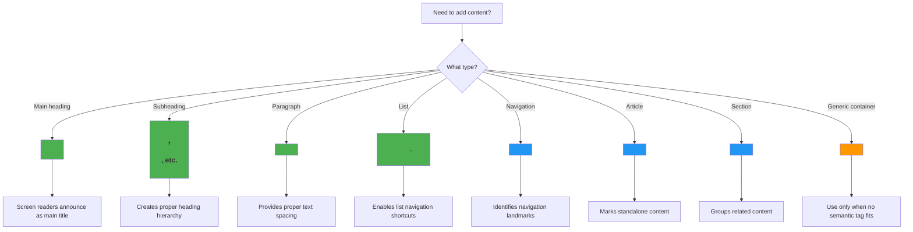
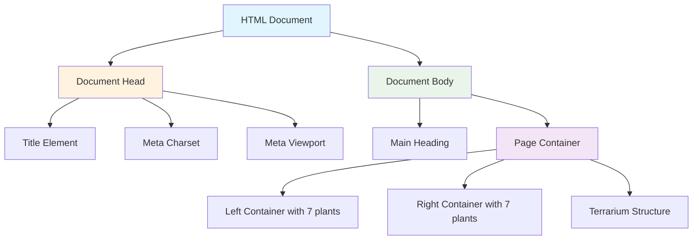
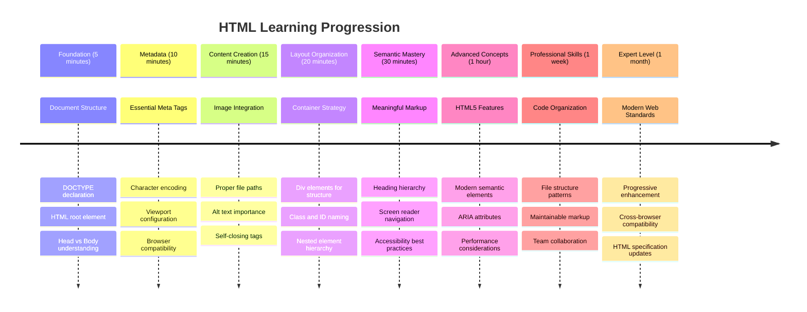

<!--
CO_OP_TRANSLATOR_METADATA:
{
  "original_hash": "3fcfa99c4897e051b558b5eaf1e8cc74",
  "translation_date": "2025-11-06T12:48:23+00:00",
  "source_file": "3-terrarium/1-intro-to-html/README.md",
  "language_code": "ja"
}
-->
# テラリウムプロジェクト パート1: HTML入門




> スケッチノート: [Tomomi Imura](https://twitter.com/girlie_mac)

HTML（HyperText Markup Language）は、これまで訪れたすべてのウェブサイトの基盤です。HTMLはウェブページの骨格のようなもので、コンテンツの配置、構造、各部分の意味を定義します。後でCSSが色やレイアウトでHTMLを「装飾」し、JavaScriptがインタラクティブ性を加えることで「命を吹き込む」役割を果たしますが、HTMLはすべての基礎を提供します。

このレッスンでは、仮想テラリウムインターフェースのHTML構造を作成します。この実践的なプロジェクトを通じて、基本的なHTMLの概念を学びながら、視覚的に魅力的なものを構築します。セマンティック要素を使ってコンテンツを整理し、画像を扱い、インタラクティブなウェブアプリケーションの基盤を作る方法を学びます。

レッスンの終わりには、植物の画像が整理された列に表示されるHTMLページが完成します。次のレッスンでスタイリングを行う準備が整います。最初はシンプルに見えるかもしれませんが、それがCSSで視覚的な仕上げを加える前のHTMLのあるべき姿です。



## レクチャー前のクイズ

[レクチャー前のクイズ](https://ff-quizzes.netlify.app/web/quiz/15)

> 📺 **視聴して学ぶ**: この役立つビデオ概要をチェックしてください
> 
> [](https://www.youtube.com/watch?v=1TvxJKBzhyQ)

## プロジェクトのセットアップ

HTMLコードに取り掛かる前に、テラリウムプロジェクトの適切な作業スペースを設定しましょう。最初から整理されたファイル構造を作成することは、ウェブ開発の旅を通じて役立つ重要な習慣です。

### タスク: プロジェクト構造を作成する

テラリウムプロジェクト専用のフォルダーを作成し、最初のHTMLファイルを追加します。以下の2つの方法があります:

**オプション1: Visual Studio Codeを使用する場合**
1. Visual Studio Codeを開く
2. 「ファイル」→「フォルダーを開く」をクリックするか、`Ctrl+K, Ctrl+O`（Windows/Linux）または`Cmd+K, Cmd+O`（Mac）を使用
3. `terrarium`という新しいフォルダーを作成し、それを選択
4. エクスプローラペインで「新しいファイル」アイコンをクリック
5. ファイル名を`index.html`にする


**オプション2: ターミナルコマンドを使用する場合**
```bash
mkdir terrarium
cd terrarium
touch index.html
code index.html
```

**これらのコマンドが達成すること:**
- プロジェクト用の新しいディレクトリ`terrarium`を作成
- テラリウムディレクトリに移動
- 空の`index.html`ファイルを作成
- 編集のためにVisual Studio Codeでファイルを開く

> 💡 **プロのヒント**: ファイル名`index.html`はウェブ開発で特別な意味を持ちます。誰かがウェブサイトを訪れると、ブラウザは自動的に`index.html`をデフォルトページとして表示します。つまり、`https://mysite.com/projects/`のようなURLは、URL内でファイル名を指定することなく`projects`フォルダーの`index.html`ファイルを自動的に提供します。

## HTMLドキュメント構造の理解

すべてのHTMLドキュメントは、ブラウザが正しく理解して表示するために必要な特定の構造に従います。この構造は正式な手紙のようなもので、特定の順序で必要な要素が含まれており、受信者（この場合はブラウザ）がコンテンツを適切に処理するのを助けます。



まず、すべてのHTMLドキュメントに必要な基本的な基盤を追加しましょう。

### DOCTYPE宣言とルート要素

HTMLファイルの最初の2行は、ブラウザへのドキュメントの「紹介」として機能します:

```html
<!DOCTYPE html>
<html></html>
```

**このコードが何をするか:**
- `<!DOCTYPE html>`を使用してドキュメントタイプをHTML5として宣言
- ページコンテンツをすべて含むルート`<html>`要素を作成
- 適切なブラウザレンダリングのための最新のウェブ標準を確立
- 異なるブラウザやデバイス間で一貫した表示を保証

> 💡 **VS Codeのヒント**: VS CodeでHTMLタグにカーソルを合わせると、MDN Web Docsからの使用例やブラウザ互換性の詳細などの役立つ情報が表示されます。

> 📚 **さらに学ぶ**: DOCTYPE宣言は、非常に古いウェブサイトをサポートするために使用されていた「クイックスモード」にブラウザが入るのを防ぎます。現代のウェブ開発では、シンプルな`<!DOCTYPE html>`宣言を使用して[標準準拠のレンダリング](https://developer.mozilla.org/docs/Web/HTML/Quirks_Mode_and_Standards_Mode)を保証します。

### 🔄 **教育的チェックイン**
**一時停止して振り返る**: 続行する前に、以下を理解していることを確認してください:
- ✅ なぜすべてのHTMLドキュメントにDOCTYPE宣言が必要なのか
- ✅ `<html>`ルート要素が何を含むのか
- ✅ この構造がブラウザがページを正しくレンダリングするのを助ける方法

**簡単な自己テスト**: 「標準準拠のレンダリング」とは何を意味するか、自分の言葉で説明できますか？

## 必要なドキュメントメタデータの追加

HTMLドキュメントの`<head>`セクションには、ブラウザや検索エンジンが必要とする重要な情報が含まれていますが、訪問者が直接ページ上で見ることはありません。これは、ウェブページが正しく機能し、異なるデバイスやプラットフォームで正しく表示されるのを助ける「舞台裏」の情報です。

このメタデータは、ブラウザにページの表示方法、使用する文字エンコーディング、異なる画面サイズの処理方法を伝えます。これらは、プロフェッショナルでアクセス可能なウェブページを作成するために不可欠です。

### タスク: ドキュメントヘッドを追加する

開いている`<html>`タグと閉じている`<html>`タグの間にこの`<head>`セクションを挿入してください:

```html
<head>
	<title>Welcome to my Virtual Terrarium</title>
	<meta charset="utf-8" />
	<meta http-equiv="X-UA-Compatible" content="IE=edge" />
	<meta name="viewport" content="width=device-width, initial-scale=1" />
</head>
```

**各要素が達成することの内訳:**
- ブラウザタブや検索結果に表示されるページタイトルを設定
- 世界中で適切なテキスト表示を行うためにUTF-8文字エンコーディングを指定
- 最新バージョンのInternet Explorerとの互換性を確保
- ビューポートをデバイス幅に合わせて設定し、レスポンシブデザインを構成
- 初期ズームレベルを設定してコンテンツを自然なサイズで表示

> 🤔 **考えてみてください**: もしビューポートメタタグを`<meta name="viewport" content="width=600">`のように設定したらどうなるでしょうか？これによりページが常に600ピクセル幅に固定され、レスポンシブデザインが壊れてしまいます！[適切なビューポート設定](https://developer.mozilla.org/docs/Web/HTML/Viewport_meta_tag)についてさらに学びましょう。

## ドキュメントボディの構築

`<body>`要素にはウェブページのすべての目に見えるコンテンツが含まれています。訪問者が見るものや操作するものすべてがここにあります。`<head>`セクションがブラウザへの指示を提供したのに対し、`<body>`セクションには実際のコンテンツ（テキスト、画像、ボタン、その他の要素）が含まれています。

ボディ構造を追加し、HTMLタグがどのように連携して意味のあるコンテンツを作成するかを理解しましょう。

### HTMLタグ構造の理解

HTMLはペアタグを使用して要素を定義します。ほとんどのタグには`<p>`のような開始タグと`</p>`のような終了タグがあり、その間にコンテンツが入ります: `<p>Hello, world!</p>`。これにより、「Hello, world!」というテキストを含む段落要素が作成されます。

### タスク: ボディ要素を追加する

HTMLファイルを更新して`<body>`要素を含めてください:

```html
<!DOCTYPE html>
<html>
	<head>
		<title>Welcome to my Virtual Terrarium</title>
		<meta charset="utf-8" />
		<meta http-equiv="X-UA-Compatible" content="IE=edge" />
		<meta name="viewport" content="width=device-width, initial-scale=1" />
	</head>
	<body></body>
</html>
```

**この完全な構造が提供するもの:**
- 基本的なHTML5ドキュメントフレームワークを確立
- 適切なブラウザレンダリングのための重要なメタデータを含む
- 目に見えるコンテンツのための空のボディを作成
- 現代のウェブ開発のベストプラクティスに従う

これで、テラリウムの目に見える要素を追加する準備が整いました。次のレッスンでCSSスタイリングを行うために、コンテンツの異なるセクションを整理するためのコンテナとして`<div>`要素を使用し、植物の画像を表示するための``要素を使用します。

### 画像とレイアウトコンテナの操作

画像はHTMLでは特別な存在で、「自己閉じタグ」を使用します。`<p></p>`のようにコンテンツを囲む要素とは異なり、``タグは`src`（画像ファイルパス）や`alt`（アクセシビリティ）のような属性を使用してタグ内に必要な情報をすべて含みます。

画像をHTMLに追加する前に、プロジェクトファイルを適切に整理し、画像フォルダーを作成して植物のグラフィックを追加する必要があります。

**まず、画像をセットアップする:**
1. テラリウムプロジェクトフォルダー内に`images`というフォルダーを作成
2. [ソリューションフォルダー](../../../../3-terrarium/solution/images)から植物画像をダウンロード（合計14枚の植物画像）
3. 新しい`images`フォルダーにすべての植物画像をコピー

### タスク: 植物表示レイアウトを作成する

次に、`<body></body>`タグの間に植物画像を2列に整理して追加してください:

```html
<div id="page">
	<div id="left-container" class="container">
		<div class="plant-holder">
			
		</div>
		<div class="plant-holder">
			
		</div>
		<div class="plant-holder">
			
		</div>
		<div class="plant-holder">
			
		</div>
		<div class="plant-holder">
			
		</div>
		<div class="plant-holder">
			
		</div>
		<div class="plant-holder">
			
		</div>
	</div>
	<div id="right-container" class="container">
		<div class="plant-holder">
			
		</div>
		<div class="plant-holder">
			
		</div>
		<div class="plant-holder">
			
		</div>
		<div class="plant-holder">
			
		</div>
		<div class="plant-holder">
			
		</div>
		<div class="plant-holder">
			
		</div>
		<div class="plant-holder">
			
		</div>
	</div>
</div>
```

**このコードで何が行われているかステップごとに説明:**
- すべてのコンテンツを保持する`id="page"`を持つメインページコンテナを作成
- 2つの列コンテナ`left-container`と`right-container`を確立
- 左列に7つの植物、右列に7つの植物を整理
- 各植物画像を個別に配置するために`plant-holder`divで囲む
- 次のレッスンでCSSスタイリングを行うために一貫したクラス名を適用
- 後でJavaScriptでの操作のために各植物画像にユニークなIDを割り当てる
- 画像フォルダーを指す適切なファイルパスを含む

> 🤔 **考えてみてください**: 現在、すべての画像に同じaltテキスト「plant」が設定されています。これはアクセシビリティには理想的ではありません。スクリーンリーダーのユーザーは「plant」という言葉を14回繰り返し聞くことになり、各画像がどの植物を示しているか分かりません。各画像に対してより良い、より具体的なaltテキストを考えることができますか？

> 📝 **HTML要素の種類**: `<div>`要素は「ブロックレベル」で全幅を占めますが、`<span>`要素は「インライン」で必要な幅だけを占めます。これらの`<div>`タグをすべて`<span>`タグに変更したらどうなると思いますか？

### 🔄 **教育的チェックイン**
**構造の理解**: HTML構造を確認するために少し時間を取ってください:
- ✅ レイアウト内の主要なコンテナを識別できますか？
- ✅ 各画像にユニークなIDがある理由を理解していますか？
- ✅ `plant-holder`divの目的をどのように説明しますか？

**視覚的検査**: HTMLファイルをブラウザで開いてください。以下が表示されるはずです:
- 植物画像の基本リスト
- 2列に整理された画像
- シンプルでスタイリングされていないレイアウト

**覚えておいてください**: このシンプルな外観は、CSSスタイリング前のHTMLのあるべき姿です！

このマークアップを追加することで、植物が画面に表示されますが、まだ洗練されていません。それは次のレッスンでCSSが担当します！現時点では、コンテンツを適切に整理し、アクセシビリティのベストプラクティスに従った堅実なHTML基盤が完成しています。

## アクセシビリティのためのセマンティックHTMLの使用

セマンティックHTMLとは、外観だけでなく意味や目的に基づいてHTML要素を選択することを意味します。セマンティックマークアップを使用すると、ブラウザ、検索エンジン、スクリーンリーダーなどの支援技術にコンテンツの構造と意味を伝えることができます。



このアプローチは、障害を持つユーザーにとってウェブサイトをよりアクセスしやすくし、検索エンジンがコンテンツをよりよく理解するのを助けます。これは、すべての人にとってより良い体験を生み出す現代のウェブ開発の基本原則です。

### セマンティックなページタイトルの追加

テラリウムページに適切な見出しを追加しましょう。開いている`<body>`タグのすぐ後にこの行を挿入してください:

```html
<h1>My Terrarium</h1>
```

**セマンティックマークアップが重要な理由:**
- **スクリーンリーダー**がページ構造をナビゲートし理解するのを助ける
- **検索エンジン最適化（SEO）**を改善し、コンテンツの階層を明確化
- **視覚障害や認知障害**を持つユーザーのアクセシビリティを向上
- **すべてのデバイスやプラットフォーム**でより良いユーザー体験を提供
- **ウェブ標準**とプロフェッショナルな開発のベストプラクティスに従う

**セマンティックと非セマンティックの選択例:**

| 目的 | ✅ セマンティックな選択 | ❌ 非セマンティックな選択 |
|------|-----------------------|--------------------------|
| メイン見出し | `<h1>タイトル</h1>` | `<div class="big-text">タイトル</div>` |
| ナビゲーション | `<nav><ul><li></li></ul></nav>` | `<div class="menu"><div></div></div>` |
| ボタン | `<button>クリックしてください</button>` | `<span onclick="...">クリックしてください</span>` |
| 記事コンテンツ | `<article><p></p></article>` | `<div class="content"><div></div></div>` |

> 🎥 **実際に見る**: [スクリーンリーダーがウェブページとどのように対話するか](https://www.youtube.com/watch?v=OUDV1gqs9GA)を視聴して、セマンティックマークアップがアクセシビリティにとって重要な理由を理解してください。適切なHTML構造がユーザーの効率的なナビゲーションをどのように助けるかに注目してください。

##
- **各視覚コンポーネント（上部、壁、土、底部）**を個別の要素として定義
- **ガラスの反射効果（光沢要素）**のためのネストされた要素を含む
- **各要素の目的を明確に示す**記述的なクラス名を使用
- **ガラステラリウムの外観を作るためのCSSスタイリング**の準備として構造を整備

> 🤔 **何か気づきましたか？**: このマークアップを追加しても、ページに新しいものは何も表示されません！これは、HTMLが構造を提供し、CSSが外観を提供することを完璧に示しています。この`<div>`要素は存在しますが、まだ視覚的なスタイリングがありません – 次のレッスンでそれが登場します！



### 🔄 **教育的チェックイン**
**HTML構造の習得**: 次に進む前に、以下を確認してください：
- ✅ HTML構造と視覚的外観の違いを説明できる
- ✅ セマンティックHTML要素と非セマンティックHTML要素を識別できる
- ✅ 適切なマークアップがアクセシビリティにどのように役立つか説明できる
- ✅ 完全なドキュメントツリー構造を認識できる

**理解度のテスト**: JavaScriptを無効にし、CSSを削除した状態でHTMLファイルをブラウザで開いてみてください。これにより、作成した純粋なセマンティック構造が表示されます！

---

## GitHub Copilot Agent チャレンジ

Agentモードを使用して以下のチャレンジを完了してください：

**説明:** テラリウムプロジェクトに追加できる植物ケアガイドセクションのセマンティックHTML構造を作成してください。

**プロンプト:** "Plant Care Guide"というメイン見出し、"Watering"、"Light Requirements"、"Soil Care"という3つのサブセクションを含むセマンティックHTMLセクションを作成してください。それぞれのサブセクションには植物ケア情報の段落を含めます。適切なセマンティックHTMLタグ（`<section>`、`<h2>`、`<h3>`、`<p>`など）を使用してコンテンツを適切に構造化してください。

Agentモードについて詳しくは[こちら](https://code.visualstudio.com/blogs/2025/02/24/introducing-copilot-agent-mode)をご覧ください。

## HTMLの歴史チャレンジ

**ウェブ進化について学ぶ**

HTMLは、1990年にCERNでTim Berners-Leeが最初のウェブブラウザを作成して以来、大きく進化してきました。古いタグ（例: `<marquee>`）は、現代のアクセシビリティ基準やレスポンシブデザイン原則に適合しないため、現在では廃止されています。

**この実験を試してみてください:**
1. `<h1>`タイトルを一時的に`<marquee>`タグで囲む: `<marquee><h1>My Terrarium</h1></marquee>`
2. ブラウザでページを開き、スクロール効果を観察
3. このタグが廃止された理由を考える（ヒント: ユーザー体験とアクセシビリティについて考えてみてください）
4. `<marquee>`タグを削除し、セマンティックマークアップに戻す

**反省の質問:**
- スクロールするタイトルは視覚障害や動きに敏感なユーザーにどのような影響を与えるでしょうか？
- 同様の視覚効果をよりアクセシブルに実現するための現代的なCSS技術は何でしょうか？
- 廃止された要素ではなく、現在のウェブ標準を使用することがなぜ重要なのでしょうか？

[廃止されたHTML要素](https://developer.mozilla.org/docs/Web/HTML/Element#Obsolete_and_deprecated_elements)についてさらに学び、ウェブ標準がどのように進化してユーザー体験を向上させているかを理解してください。

## 講義後のクイズ

[講義後のクイズ](https://ff-quizzes.netlify.app/web/quiz/16)

## 復習と自己学習

**HTMLの知識を深める**

HTMLは30年以上にわたりウェブの基盤となり、単純な文書マークアップ言語からインタラクティブなアプリケーションを構築するための高度なプラットフォームへと進化してきました。この進化を理解することで、現代のウェブ標準をより深く理解し、より良い開発判断を下すことができます。

**おすすめの学習パス:**

1. **HTMLの歴史と進化**
   - HTML 1.0からHTML5までのタイムラインを調査
   - 特定のタグが廃止された理由（アクセシビリティ、モバイル対応性、保守性）を探る
   - 新しいHTML機能や提案を調査

2. **セマンティックHTMLの深掘り**
   - [HTML5セマンティック要素](https://developer.mozilla.org/docs/Web/HTML/Element)の完全なリストを学ぶ
   - `<article>`、`<section>`、`<aside>`、`<main>`を使用するタイミングを練習
   - アクセシビリティを向上させるARIA属性について学ぶ

3. **現代のウェブ開発**
   - [レスポンシブウェブサイトの構築](https://docs.microsoft.com/learn/modules/build-simple-website/?WT.mc_id=academic-77807-sagibbon)をMicrosoft Learnで探る
   - HTMLがCSSやJavaScriptとどのように統合されるかを理解
   - ウェブパフォーマンスとSEOのベストプラクティスを学ぶ

**反省の質問:**
- 発見した廃止されたHTMLタグは何ですか？それらが削除された理由は何ですか？
- 将来のバージョンに向けて提案されている新しいHTML機能は何ですか？
- セマンティックHTMLはウェブアクセシビリティとSEOにどのように貢献しますか？

### ⚡ **次の5分間でできること**
- [ ] DevTools（F12）を開き、お気に入りのウェブサイトのHTML構造を調査
- [ ] `<h1>`、`<p>`、``の基本タグを使用して簡単なHTMLファイルを作成
- [ ] W3C HTML ValidatorオンラインでHTMLを検証
- [ ] `<!-- コメント -->`を使用してHTMLにコメントを追加してみる

### 🎯 **この1時間で達成できること**
- [ ] 講義後のクイズを完了し、セマンティックHTMLの概念を復習
- [ ] 適切なHTML構造を使用して自分についての簡単なウェブページを作成
- [ ] 異なる見出しレベルやテキストフォーマットタグを試す
- [ ] 画像やリンクを追加してマルチメディア統合を練習
- [ ] 試したことのないHTML5機能を調査

### 📅 **1週間のHTML学習計画**
- [ ] セマンティックマークアップを使用してテラリウムプロジェクト課題を完了
- [ ] ARIAラベルと役割を使用してアクセシブルなウェブページを作成
- [ ] 様々な入力タイプを使用してフォーム作成を練習
- [ ] localStorageやgeolocationなどのHTML5 APIを探る
- [ ] レスポンシブHTMLパターンとモバイルファーストデザインを学ぶ
- [ ] 他の開発者のHTMLコードをレビューしてベストプラクティスを学ぶ

### 🌟 **1か月間のウェブ基礎学習**
- [ ] HTMLの習得を示すポートフォリオウェブサイトを作成
- [ ] Handlebarsのようなフレームワークを使用してHTMLテンプレートを学ぶ
- [ ] オープンソースプロジェクトに貢献し、HTMLドキュメントを改善
- [ ] カスタム要素などの高度なHTML概念を習得
- [ ] CSSフレームワークやJavaScriptライブラリとHTMLを統合
- [ ] HTMLの基本を学んでいる他の人を指導

## 🎯 HTML習得のタイムライン



### 🛠️ HTMLツールキットのまとめ

このレッスンを完了した後、以下を習得しました：
- **ドキュメント構造**: 適切なDOCTYPEを含む完全なHTML5基盤
- **セマンティックマークアップ**: アクセシビリティとSEOを向上させる意味のあるタグ
- **画像統合**: 適切なファイル構成とaltテキストの実践
- **レイアウトコンテナ**: 説明的なクラス名を使用したdivの戦略的活用
- **アクセシビリティ意識**: スクリーンリーダーのナビゲーションの理解
- **現代の標準**: 現在のHTML5の実践と廃止されたタグの知識
- **プロジェクト基盤**: CSSスタイリングとJavaScriptのインタラクティビティのための堅実な基盤

**次のステップ**: HTML構造はCSSスタイリングの準備が整いました！構築したセマンティック基盤は、次のレッスンをより理解しやすくします。

## 課題

[HTMLを練習: ブログモックアップを作成](assignment.md)

---

**免責事項**:  
この文書はAI翻訳サービス[Co-op Translator](https://github.com/Azure/co-op-translator)を使用して翻訳されています。正確性を追求しておりますが、自動翻訳には誤りや不正確な部分が含まれる可能性があります。元の言語で記載された文書を正式な情報源としてご参照ください。重要な情報については、専門の人間による翻訳を推奨します。この翻訳の使用に起因する誤解や誤認について、当方は一切の責任を負いません。