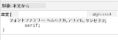

<!--
CO_OP_TRANSLATOR_METADATA:
{
  "original_hash": "acb5ae00cde004304296bb97da8ff4c3",
  "translation_date": "2025-08-28T17:56:57+00:00",
  "source_file": "3-terrarium/2-intro-to-css/README.md",
  "language_code": "ja"
}
-->
# テラリウムプロジェクト パート2: CSS入門

  
> スケッチノート: [Tomomi Imura](https://twitter.com/girlie_mac)

## 講義前クイズ

[講義前クイズ](https://ff-quizzes.netlify.app/web/quiz/17)

### はじめに

CSS（Cascading Style Sheets）は、ウェブ開発における重要な課題、つまりウェブサイトを見栄え良くする方法を解決します。アプリにスタイルを適用することで、使いやすく、見た目も良くなります。また、CSSを使えばレスポンシブウェブデザイン（RWD）を実現でき、どの画面サイズでもアプリが美しく表示されるようになります。CSSは単に見た目を良くするだけでなく、アニメーションや変形を含む仕様もあり、アプリに高度なインタラクションを可能にします。CSSワーキンググループは現在のCSS仕様を維持する役割を担っており、その活動は[World Wide Web Consortiumのサイト](https://www.w3.org/Style/CSS/members)で確認できます。

> [!NOTE]  
> CSSはウェブ上の他の技術と同様に進化する言語であり、すべてのブラウザが最新の仕様をサポートしているわけではありません。[CanIUse.com](https://caniuse.com)を参照して実装を確認することをお勧めします。

このレッスンでは、オンラインテラリウムにスタイルを追加し、CSSのいくつかの概念について学びます。具体的には、カスケード、継承、セレクタの使用、配置、CSSを使ったレイアウト構築について学びます。この過程で、テラリウムのレイアウトを作成し、実際のテラリウムを構築します。

### 前提条件

テラリウムのHTMLが構築済みで、スタイルを適用する準備ができていること。

> 動画をチェック

> 
> [](https://www.youtube.com/watch?v=6yIdOIV9p1I)

### タスク

テラリウムフォルダ内に`style.css`という新しいファイルを作成します。そのファイルを`<head>`セクションでインポートします:

```html
<link rel="stylesheet" href="./style.css" />
```

---

## カスケード

Cascading Style Sheets（カスケーディングスタイルシート）は、スタイルの適用が優先順位によってガイドされる「カスケード」の概念を取り入れています。ウェブサイトの作者が設定したスタイルは、ブラウザが設定したスタイルよりも優先されます。また、インラインで設定されたスタイルは、外部スタイルシートで設定されたスタイルよりも優先されます。

### タスク

`<h1>`タグにインラインスタイル「color: red」を追加します:

```HTML
<h1 style="color: red">My Terrarium</h1>
```

次に、以下のコードを`style.css`ファイルに追加します:

```CSS
h1 {
 color: blue;
}
```

✅ あなたのウェブアプリではどの色が表示されますか？なぜですか？スタイルを上書きする方法を見つけられますか？いつ、またはなぜこれを行うべきではないのでしょうか？

---

## 継承

スタイルは、祖先のスタイルから子孫に継承されます。つまり、ネストされた要素は親要素のスタイルを継承します。

### タスク

bodyのフォントを指定されたフォントに設定し、ネストされた要素のフォントを確認します:

```CSS
body {
	font-family: helvetica, arial, sans-serif;
}
```

ブラウザのコンソールを開き、「Elements」タブでH1のフォントを観察します。ブラウザ内で示されているように、H1はbodyからフォントを継承しています。



✅ ネストされたスタイルに異なるプロパティを継承させることはできますか？

---

## CSSセレクタ

### タグ

これまでの`style.css`ファイルでは、いくつかのタグにしかスタイルが適用されておらず、アプリの見た目は少し奇妙です:

```CSS
body {
	font-family: helvetica, arial, sans-serif;
}

h1 {
	color: #3a241d;
	text-align: center;
}
```

このようにタグをスタイリングすることで、ユニークな要素を制御できますが、テラリウム内の多くの植物のスタイルを制御する必要があります。そのためには、CSSセレクタを活用する必要があります。

### ID

左と右のコンテナをレイアウトするためにスタイルを追加します。マークアップ内で左コンテナと右コンテナはそれぞれ1つしかないため、IDが付けられています。これをスタイリングするには`#`を使用します:

```CSS
#left-container {
	background-color: #eee;
	width: 15%;
	left: 0px;
	top: 0px;
	position: absolute;
	height: 100%;
	padding: 10px;
}

#right-container {
	background-color: #eee;
	width: 15%;
	right: 0px;
	top: 0px;
	position: absolute;
	height: 100%;
	padding: 10px;
}
```

ここでは、これらのコンテナを画面の左端と右端に絶対配置し、幅をパーセンテージで指定して、小さなモバイル画面にも対応できるようにしています。

✅ このコードはかなり繰り返しが多く、「DRY」（Don't Repeat Yourself: 繰り返しを避ける）ではありません。IDとクラスを組み合わせて、より良いスタイル方法を見つけられますか？マークアップを変更し、CSSをリファクタリングする必要があります:

```html
<div id="left-container" class="container"></div>
```

### クラス

上記の例では、画面上の2つのユニークな要素をスタイリングしました。画面上の多くの要素にスタイルを適用したい場合は、CSSクラスを使用できます。左と右のコンテナ内の植物をレイアウトするためにこれを行います。

HTMLマークアップ内の各植物には、IDとクラスの組み合わせがあります。ここでのIDは、後で追加するJavaScriptがテラリウムの植物配置を操作するために使用します。一方、クラスはすべての植物に特定のスタイルを適用します。

```html
<div class="plant-holder">
	
</div>
```

以下を`style.css`ファイルに追加します:

```CSS
.plant-holder {
	position: relative;
	height: 13%;
	left: -10px;
}

.plant {
	position: absolute;
	max-width: 150%;
	max-height: 150%;
	z-index: 2;
}
```

このスニペットで注目すべき点は、相対配置と絶対配置の組み合わせです。高さがパーセンテージで処理されている方法を見てください:

- 植物ホルダーの高さを13%に設定しています。これにより、各垂直コンテナ内のすべての植物がスクロールなしで表示されるようになります。
- 植物ホルダーを左に移動させ、植物がコンテナ内でより中央に配置されるようにしています。画像にはドラッグ可能にするための透明な背景が多く含まれているため、画面上でより適切にフィットするように左に押し出す必要があります。
- 植物自体には最大幅150%を設定しています。これにより、ブラウザが縮小されると植物も縮小されます。ブラウザのサイズを変更してみてください。植物はコンテナ内に収まりつつ、縮小してフィットします。

また、z-indexの使用も注目すべき点です。これは要素の相対的な高さを制御し（植物がコンテナの上に座り、テラリウム内に配置されているように見えるようにします）。

✅ なぜ植物ホルダーと植物の両方にCSSセレクタが必要なのでしょうか？

## CSSの配置

位置プロパティ（static、relative、fixed、absolute、sticky）を混在させるのは少し難しいですが、適切に行うとページ上の要素をうまく制御できます。

絶対配置された要素は、最も近い配置された祖先を基準に配置されます。祖先がない場合は、ドキュメントのボディに基づいて配置されます。

相対配置された要素は、CSSの指示に基づいて元の位置から離れて配置されます。

このサンプルでは、`plant-holder`は相対配置された要素で、絶対配置されたコンテナ内に配置されています。この結果、サイドバーコンテナは左端と右端に固定され、`plant-holder`はネストされ、サイドバー内で調整され、植物を縦に並べるスペースを確保します。

> [!NOTE]  
> `plant`自体も絶対配置されており、次のレッスンで学ぶようにドラッグ可能にするために必要です。

✅ サイドコンテナと植物ホルダーの配置タイプを切り替えてみてください。何が起こりますか？

## CSSレイアウト

ここで学んだことを使って、CSSだけでテラリウム自体を構築します！

まず、`.terrarium`の子要素をCSSで丸みを帯びた長方形にスタイリングします:

```CSS
.jar-walls {
	height: 80%;
	width: 60%;
	background: #d1e1df;
	border-radius: 1rem;
	position: absolute;
	bottom: 0.5%;
	left: 20%;
	opacity: 0.5;
	z-index: 1;
}

.jar-top {
	width: 50%;
	height: 5%;
	background: #d1e1df;
	position: absolute;
	bottom: 80.5%;
	left: 25%;
	opacity: 0.7;
	z-index: 1;
}

.jar-bottom {
	width: 50%;
	height: 1%;
	background: #d1e1df;
	position: absolute;
	bottom: 0%;
	left: 25%;
	opacity: 0.7;
}

.dirt {
	width: 60%;
	height: 5%;
	background: #3a241d;
	position: absolute;
	border-radius: 0 0 1rem 1rem;
	bottom: 1%;
	left: 20%;
	opacity: 0.7;
	z-index: -1;
}
```

ここでのパーセンテージの使用に注目してください。ブラウザを縮小すると、ジャーがどのように縮小するかがわかります。また、ジャー要素の幅と高さのパーセンテージ、および各要素が絶対配置されている方法にも注目してください。これにより、ビューポートの下部に固定され、中央に配置されます。

また、`rem`を使用してボーダー半径を指定しています。これはフォント相対の長さです。この種の相対的な測定については、[CSS仕様](https://www.w3.org/TR/css-values-3/#font-relative-lengths)で詳しく読むことができます。

✅ ジャーの色と不透明度を土の色と比較して変更してみてください。何が起こりますか？なぜですか？

---

## 🚀チャレンジ

ジャーの左下部分に「バブル」状の輝きを追加して、ガラスのように見せてみましょう。`.jar-glossy-long`と`.jar-glossy-short`をスタイリングして、反射した輝きのように見せます。完成形は以下のようになります:


講義後のクイズを完了するには、このLearnモジュールを進めてください: [HTMLアプリをCSSでスタイリングする](https://docs.microsoft.com/learn/modules/build-simple-website/4-css-basics/?WT.mc_id=academic-77807-sagibbon)

## 講義後クイズ

[講義後クイズ](https://ff-quizzes.netlify.app/web/quiz/18)

## 復習と自己学習

CSSは一見すると簡単そうに見えますが、すべてのブラウザや画面サイズに完璧にスタイルを適用するのは多くの課題があります。CSS-GridやFlexboxは、この作業をより構造化し、信頼性を高めるために開発されたツールです。[Flexbox Froggy](https://flexboxfroggy.com/)や[Grid Garden](https://codepip.com/games/grid-garden/)をプレイして、これらのツールについて学びましょう。

## 課題

[CSSリファクタリング](assignment.md)

---

**免責事項**:  
この文書は、AI翻訳サービス [Co-op Translator](https://github.com/Azure/co-op-translator) を使用して翻訳されています。正確性を追求しておりますが、自動翻訳には誤りや不正確な部分が含まれる可能性があります。元の言語で記載された文書が正式な情報源とみなされるべきです。重要な情報については、専門の人間による翻訳を推奨します。この翻訳の使用に起因する誤解や誤解釈について、当社は責任を負いません。