<!--
CO_OP_TRANSLATOR_METADATA:
{
  "original_hash": "e39f3a4e3bcccf94639e3af1248f8a4d",
  "translation_date": "2025-11-06T12:47:26+00:00",
  "source_file": "3-terrarium/2-intro-to-css/README.md",
  "language_code": "ja"
}
-->
# テラリウムプロジェクト パート2: CSS入門


> スケッチノート: [Tomomi Imura](https://twitter.com/girlie_mac)

HTMLで作ったテラリウムが少しシンプルすぎると感じませんでしたか？CSSを使えば、その基本的な構造を視覚的に魅力的なものに変えることができます。

HTMLが家の骨組みを作るようなものだとしたら、CSSはその家を「住み心地の良い家」にするためのすべてです。ペンキの色、家具の配置、照明、部屋の流れなどを整える役割を果たします。ヴェルサイユ宮殿が最初はシンプルな狩猟用ロッジだったのが、装飾やレイアウトに細心の注意を払うことで世界で最も壮麗な建物の一つに変わったことを思い出してください。

今日は、あなたのテラリウムを機能的なものから洗練されたものへと変えていきます。要素を正確に配置し、レイアウトを異なる画面サイズに対応させ、ウェブサイトを魅力的にする視覚的な魅力を作り出す方法を学びます。

このレッスンの終わりには、戦略的なCSSスタイリングがプロジェクトを劇的に改善する方法がわかるでしょう。さあ、テラリウムにスタイルを加えましょう。

```mermaid
mindmap
  root((CSS Fundamentals))
    Cascade
      Specificity Rules
      Inheritance
      Priority Order
      Conflict Resolution
    Selectors
      Element Tags
      Classes (.class)
      IDs (#id)
      Combinators
    Box Model
      Margin
      Border
      Padding
      Content
    Layout
      Positioning
      Display Types
      Flexbox
      Grid
    Visual Effects
      Colors
      Shadows
      Transitions
      Animations
    Responsive Design
      Media Queries
      Flexible Units
      Viewport Meta
      Mobile First
```



## レクチャー前のクイズ

[レクチャー前のクイズ](https://ff-quizzes.netlify.app/web/quiz/17)

## CSSの基本を学ぶ

CSSは「見た目をきれいにする」だけだと思われがちですが、それ以上の役割を果たします。CSSは映画の監督のようなものです。見た目だけでなく、動き、インタラクションへの反応、さまざまな状況への適応をコントロールします。

現代のCSSは非常に高機能です。スマートフォン、タブレット、デスクトップコンピュータに合わせてレイアウトを自動調整するコードを書くことができます。スムーズなアニメーションを作成して、必要な場所にユーザーの注意を引きつけることも可能です。すべてがうまく連携すると、その結果は非常に印象的なものになります。

> 💡 **プロのヒント**: CSSは常に新しい機能や能力を進化させています。最新のCSS機能を使用する前に、[CanIUse.com](https://caniuse.com)でブラウザの対応状況を確認してください。

**このレッスンで達成すること:**
- **モダンなCSS技術を使って**テラリウムの完全な視覚デザインを作成
- **カスケード、継承、CSSセレクタ**などの基本概念を探求
- **レスポンシブな位置決めとレイアウト戦略を実装**
- **CSSの形状とスタイリングを使って**テラリウムコンテナを構築

### 前提条件

前のレッスンでテラリウムのHTML構造を完成させ、それをスタイリングする準備ができていること。

> 📺 **ビデオリソース**: この役立つビデオウォークスルーをチェックしてください
>
> [](https://www.youtube.com/watch?v=6yIdOIV9p1I)

### CSSファイルの設定

スタイリングを始める前に、HTMLにCSSを接続する必要があります。この接続により、ブラウザはテラリウムのスタイリング指示がどこにあるかを認識します。

テラリウムフォルダ内に新しいファイル`style.css`を作成し、それをHTMLドキュメントの`<head>`セクションにリンクします:

```html
<link rel="stylesheet" href="./style.css" />
```

**このコードが行うこと:**
- **HTMLとCSSファイル間の接続を作成**
- **ブラウザに`style.css`からスタイルを読み込んで適用するよう指示**
- **`rel="stylesheet"`属性を使用してCSSファイルであることを指定**
- **`href="./style.css"`でファイルパスを参照**

## CSSカスケードの理解

CSSが「カスケーディング」スタイルシートと呼ばれる理由を考えたことはありますか？スタイルは滝のように下に流れ落ち、時には互いに衝突することもあります。

軍隊の指揮構造を考えてみてください。例えば、将軍の命令で「全兵士は緑の服を着る」と言われたとしても、特定の部隊には「式典のために青い礼服を着る」という命令が出されるかもしれません。より具体的な指示が優先されます。CSSも同様の論理に従い、この階層を理解することでデバッグがはるかに簡単になります。

### カスケード優先度の実験

スタイルの衝突を作成してカスケードを確認してみましょう。まず、`<h1>`タグにインラインスタイルを追加します:

```html
<h1 style="color: red">My Terrarium</h1>
```

**このコードが行うこと:**
- **インラインスタイリングを使用して`<h1>`要素に直接赤色を適用**
- **`style`属性を使用してCSSをHTMLに直接埋め込む**
- **この特定の要素に対して最も高い優先度のスタイルルールを作成**

次に、`style.css`ファイルにこのルールを追加します:

```css
h1 {
  color: blue;
}
```

**上記で行ったこと:**
- **すべての`<h1>`要素をターゲットにするCSSルールを定義**
- **外部スタイルシートを使用してテキストカラーを青に設定**
- **インラインスタイルよりも低い優先度のルールを作成**

✅ **知識チェック**: あなたのウェブアプリではどの色が表示されますか？なぜその色が優先されるのでしょうか？スタイルを上書きしたいシナリオを考えることができますか？


> 💡 **CSSの優先順位順（高い順から低い順）:**
> 1. **インラインスタイル**（style属性）
> 2. **ID**（#myId）
> 3. **クラス**（.myClass）と属性
> 4. **要素セレクタ**（h1, div, p）
> 5. **ブラウザのデフォルト**

## CSSの継承を理解する

CSSの継承は遺伝学のようなものです。要素は親要素から特定のプロパティを継承します。例えば、`body`要素にフォントファミリーを設定すると、その中のすべてのテキストが自動的に同じフォントを使用します。それは、ハプスブルク家の特徴的な顎のラインが、各個人に特別に指定されなくても世代を超えて現れるのと似ています。

ただし、すべてが継承されるわけではありません。フォントや色などのテキストスタイルは継承されますが、マージンやボーダーなどのレイアウトプロパティは継承されません。子供が親の身体的特徴を継承する一方で、親のファッションセンスを継承しないのと同じです。

### フォント継承の観察

`<body>`要素にフォントファミリーを設定して継承を確認してみましょう:

```css
body {
  font-family: 'Segoe UI', Tahoma, Geneva, Verdana, sans-serif;
}
```

**ここで起こることを分解すると:**
- **`<body>`要素をターゲットにしてページ全体のフォントファミリーを設定**
- **フォールバックオプションを含むフォントスタックを使用してブラウザ互換性を向上**
- **異なるオペレーティングシステムで見栄えの良いモダンなシステムフォントを適用**
- **特別に上書きされない限り、すべての子要素がこのフォントを継承**

ブラウザの開発者ツール（F12）を開き、Elementsタブに移動して`<h1>`要素を検査してください。`body`からフォントファミリーを継承していることがわかります:


✅ **実験タイム**: `<body>`に`color`、`line-height`、`text-align`などの他の継承可能なプロパティを設定してみてください。見出しや他の要素に何が起こるでしょうか？

> 📝 **継承可能なプロパティ例**: `color`, `font-family`, `font-size`, `line-height`, `text-align`, `visibility`
>
> **継承されないプロパティ例**: `margin`, `padding`, `border`, `width`, `height`, `position`

### 🔄 **教育的チェックイン**
**CSS基礎の理解**: セレクタに進む前に以下を確認してください:
- ✅ カスケードと継承の違いを説明できる
- ✅ 特異性の衝突でどのスタイルが勝つか予測できる
- ✅ 親要素から継承されるプロパティを特定できる
- ✅ CSSファイルをHTMLに正しく接続できる

**簡単なテスト**: 以下のスタイルがある場合、`<div class="special">`内の`<h1>`の色は何色になりますか？
```css
div { color: blue; }
.special { color: green; }
h1 { color: red; }
```
*答え: 赤（要素セレクタが直接`h1`をターゲットにしているため）*

## CSSセレクタの習得

CSSセレクタは特定の要素をターゲットにしてスタイリングする方法です。それは正確な指示を与えるようなものです。「家」と言う代わりに、「メープルストリートの赤いドアの青い家」と言うようなものです。

CSSはさまざまな方法で特定の要素を指定することができ、適切なセレクタを選ぶことはタスクに適したツールを選ぶことと似ています。時には近所のすべてのドアをスタイリングする必要があり、時には特定のドアだけをスタイリングする必要があります。

### 要素セレクタ（タグ）

要素セレクタはタグ名でHTML要素をターゲットにします。ページ全体に広く適用される基本スタイルを設定するのに最適です:

```css
body {
  font-family: 'Segoe UI', Tahoma, Geneva, Verdana, sans-serif;
  margin: 0;
  padding: 0;
}

h1 {
  color: #3a241d;
  text-align: center;
  font-size: 2.5rem;
  margin-bottom: 1rem;
}
```

**これらのスタイルの理解:**
- **`body`セレクタでページ全体のタイポグラフィを一貫して設定**
- **ブラウザのデフォルトのマージンとパディングを削除してコントロールを向上**
- **すべての見出し要素を色、配置、間隔でスタイリング**
- **スケーラブルでアクセシブルなフォントサイズのために`rem`単位を使用**

要素セレクタは一般的なスタイリングには適していますが、テラリウム内の植物のような個々のコンポーネントをスタイリングするには、より具体的なセレクタが必要です。

### ユニークな要素のためのIDセレクタ

IDセレクタは`#`記号を使用し、特定の`id`属性を持つ要素をターゲットにします。IDはページ内で一意である必要があるため、テラリウムの左右の植物コンテナのような個々の特別な要素をスタイリングするのに最適です。

テラリウムの植物が配置されるサイドコンテナのスタイリングを作成しましょう:

```css
#left-container {
  background-color: #f5f5f5;
  width: 15%;
  left: 0;
  top: 0;
  position: absolute;
  height: 100vh;
  padding: 1rem;
  box-sizing: border-box;
}

#right-container {
  background-color: #f5f5f5;
  width: 15%;
  right: 0;
  top: 0;
  position: absolute;
  height: 100vh;
  padding: 1rem;
  box-sizing: border-box;
}
```

**このコードが達成すること:**
- **`absolute`位置決めを使用してコンテナを画面の左端と右端に配置**
- **画面サイズに適応するレスポンシブな高さのために`vh`（ビューポート高さ）単位を使用**
- **`box-sizing: border-box`を適用してパディングを全幅に含める**
- **ゼロ値から不要な`px`単位を削除してコードをクリーンに**
- **目に優しい微妙な背景色を設定**

✅ **コード品質チャレンジ**: このCSSがDRY（Don't Repeat Yourself）原則に違反していることに気づきましたか？IDとクラスを組み合わせてリファクタリングできますか？

**改善されたアプローチ:**
```html
<div id="left-container" class="container"></div>
<div id="right-container" class="container"></div>
```

```css
.container {
  background-color: #f5f5f5;
  width: 15%;
  top: 0;
  position: absolute;
  height: 100vh;
  padding: 1rem;
  box-sizing: border-box;
}

#left-container {
  left: 0;
}

#right-container {
  right: 0;
}
```

### 再利用可能なスタイルのためのクラスセレクタ

クラスセレクタは`.`記号を使用し、複数の要素に同じスタイルを適用するのに最適です。IDとは異なり、クラスはHTML全体で再利用可能であり、一貫したスタイリングパターンに理想的です。

テラリウムでは、各植物に似たスタイリングが必要ですが、個々の位置決めも必要です。クラスを共有スタイルに、IDをユニークな位置決めとJavaScriptのインタラクションに使用します。

**各植物のHTML構造:**
```html
<div class="plant-holder">
  
</div>
```

**重要な要素の説明:**
- **すべての植物コンテナに一貫したスタイリングを適用するために`class="plant-holder"`を使用**
- **共有画像スタイリングと動作のために`class="plant"`を適用**
- **個々の位置決めとJavaScriptのインタラクションのためにユニークな`id="plant1"`を含む**
- **スクリーンリーダーのアクセシビリティのために説明的なaltテキストを提供**

次に、これらのスタイルを`style.css`ファイルに追加します:

```css
.plant-holder {
  position: relative;
  height: 13%;
  left: -0.6rem;
}

.plant {
  position: absolute;
  max-width: 150%;
  max-height: 150%;
  z-index: 2;
  transition: transform 0.3s ease;
}

.plant:hover {
  transform: scale(1.05);
}
```

**これらのスタイルの分解:**
- **植物ホルダーに相対位置決めを作成して位置決めコンテキストを確立**
- **すべての植物ホルダーを高さ13%に設定し、すべての植物が垂直方向に収まるようにする**
- **ホルダーを少し左にシフトして植物をコンテナ内でより中央に配置**
- **`max-width`と`max-height`プロパティを使用して植物がレスポンシブにスケールするようにする**
- **植物をテラリウム内の他の要素の上にレイヤー化するために`z-index`を使用**
- **CSSトランジションを使用して微妙なホバー効果を追加し、ユーザーインタラクションを向上**

✅ **クリティカルシンキング**: なぜ`.plant-holder`と`.plant`セレクタの両方が必要なのでしょうか？1つだけを使用しようとした場合、何が起こるでしょうか？

> 💡 **デザインパターン**: コンテナ（`.plant-holder`）はレイアウトと位置決めを制御し、コンテンツ（`.plant`）は外観とスケーリングを制御します。この分離により、コードがより保守可能で柔軟になります。

## CSS位置決めの理解

CSS位置決めは舞台監督のようなものです。すべての役者がどこに立ち、舞台上でどのように動くかを指示します。標準的な配置に従う役者もいれば、劇的な効果のために特定の位置決めが必要な役者もいます。

位置決めを理解すると、多くのレイアウトの課題が管理可能になります。スクロール中に常に上部に留まるナビゲーションバーが必要ですか？位置決めがそれを解決します。特定の場所に表示されるツールチップが必要ですか？それも位置決めで可能です。

### 5つの位置値


| 位置値 | 動作 | 使用例 |
|--------|------|--------|
| `static` | デフォルトのフロー、top/left/right/bottomを無視 | 通常のドキュメントレイアウト |
| `relative` | 通常の位置に対して相対的に配置 | 小さな調整、位置決めコンテキストの作成 |
| `absolute` | 最も近い位置決めされた祖先に対して配置 | 正
- `.plant-holder`が`relative`ではなく`absolute`を使用すると、レイアウトがどのように変化するか？
- `.plant`を`relative`ポジショニングに切り替えると何が起こるか？

### 🔄 **教育的チェックイン**
**CSSポジショニングの習得**: 理解を確認するために一時停止:
- ✅ なぜドラッグ＆ドロップのために植物に`absolute`ポジショニングが必要なのか説明できますか？
- ✅ 相対コンテナがポジショニングのコンテキストを作る仕組みを理解していますか？
- ✅ なぜサイドコンテナが`absolute`ポジショニングを使用しているのか？
- ✅ ポジションの宣言を完全に削除した場合、何が起こるか？

**現実世界との関連性**: CSSポジショニングが現実世界のレイアウトをどのように反映しているか考えてみましょう:
- **Static**: 棚の上の本（自然な順序）
- **Relative**: 本を少し動かして元の位置を維持する
- **Absolute**: 特定のページ番号にしおりを置く
- **Fixed**: ページをめくっても見える位置に貼られた付箋

## CSSでテラリウムを作る

ここでは、画像やグラフィックソフトを使わずにCSSだけでガラス瓶を作ります。

ポジショニングや透明度を使ってリアルなガラス、影、奥行き効果を作ることは、CSSの視覚的な能力を示しています。この技術は、バウハウス運動の建築家がシンプルな幾何学的形状を使って複雑で美しい構造を作った方法に似ています。これらの原則を理解すれば、多くのウェブデザインに隠されたCSS技術を認識できるようになります。


### ガラス瓶の構成要素を作る

テラリウム瓶を一つ一つのパーツに分けて作りましょう。各パーツは絶対位置指定とパーセンテージベースのサイズを使用してレスポンシブデザインを実現します:

```css
.jar-walls {
  height: 80%;
  width: 60%;
  background: #d1e1df;
  border-radius: 1rem;
  position: absolute;
  bottom: 0.5%;
  left: 20%;
  opacity: 0.5;
  z-index: 1;
  box-shadow: inset 0 0 2rem rgba(0, 0, 0, 0.1);
}

.jar-top {
  width: 50%;
  height: 5%;
  background: #d1e1df;
  position: absolute;
  bottom: 80.5%;
  left: 25%;
  opacity: 0.7;
  z-index: 1;
  border-radius: 0.5rem 0.5rem 0 0;
}

.jar-bottom {
  width: 50%;
  height: 1%;
  background: #d1e1df;
  position: absolute;
  bottom: 0;
  left: 25%;
  opacity: 0.7;
  border-radius: 0 0 0.5rem 0.5rem;
}

.dirt {
  width: 60%;
  height: 5%;
  background: #3a241d;
  position: absolute;
  border-radius: 0 0 1rem 1rem;
  bottom: 1%;
  left: 20%;
  opacity: 0.7;
  z-index: -1;
}
```

**テラリウムの構造を理解する:**
- **使用** パーセンテージベースの寸法で、すべての画面サイズに対応するレスポンシブスケーリング
- **配置** 要素を絶対位置指定して正確に積み重ねて整列
- **適用** 異なる透明度値でガラスの透明効果を作成
- **実装** `z-index`を使って植物が瓶の中に見えるようにレイヤリング
- **追加** 微妙なボックスシャドウと洗練されたボーダー半径でリアルな外観を実現

### パーセンテージを使ったレスポンシブデザイン

すべての寸法が固定ピクセル値ではなくパーセンテージを使用していることに注目してください:

**なぜ重要なのか:**
- **保証** テラリウムがどの画面サイズでも比例してスケールする
- **維持** 瓶の構成要素間の視覚的関係
- **提供** モバイルから大型デスクトップモニターまで一貫した体験
- **適応** 視覚的レイアウトを壊すことなくデザインを調整

### CSS単位の活用

ボーダー半径には`rem`単位を使用しており、これはルートフォントサイズに相対的にスケールします。これにより、ユーザーのフォント設定を尊重したよりアクセシブルなデザインが可能になります。[CSS相対単位](https://www.w3.org/TR/css-values-3/#font-relative-lengths)について公式仕様で詳しく学びましょう。

✅ **視覚的実験**: これらの値を変更して効果を観察してみましょう:
- 瓶の透明度を0.5から0.8に変更すると、ガラスの外観にどのような影響がありますか？
- 土の色を`#3a241d`から`#8B4513`に変更すると、どのような視覚的影響がありますか？
- 土の`z-index`を2に変更すると、レイヤリングに何が起こりますか？

### 🔄 **教育的チェックイン**
**CSS視覚デザインの理解**: 視覚的CSSの理解を確認:
- ✅ パーセンテージベースの寸法がレスポンシブデザインを作る仕組みを理解していますか？
- ✅ 透明度がガラスの透明効果を作る理由を理解していますか？
- ✅ `z-index`が要素のレイヤリングに果たす役割を理解していますか？
- ✅ ボーダー半径の値が瓶の形状を作る仕組みを理解していますか？

**デザイン原則**: シンプルな形状から複雑なビジュアルを構築する方法に注目してください:
1. **長方形** → **丸みを帯びた長方形** → **瓶の構成要素**
2. **平坦な色** → **透明度** → **ガラス効果**
3. **個々の要素** → **レイヤー構成** → **3D外観**

---

## GitHub Copilot Agentチャレンジ 🚀

Agentモードを使用して次のチャレンジを完了してください:

**説明:** テラリウムの植物が自然な風の効果をシミュレートして優しく揺れるCSSアニメーションを作成します。これにより、CSSアニメーション、変形、キーフレームを練習しながら、テラリウムの視覚的魅力を向上させます。

**プロンプト:** テラリウム内の植物が左右に優しく揺れるようにするCSSキーフレームアニメーションを追加してください。各植物が少し（2〜3度）左右に回転する揺れアニメーションを作成し、`.plant`クラスに適用します。アニメーションは無限ループで、自然な動きを実現するためのイージング関数を使用してください。

[agent modeについて詳しくはこちら](https://code.visualstudio.com/blogs/2025/02/24/introducing-copilot-agent-mode)

## 🚀 チャレンジ: ガラスの反射を追加する

リアルなガラスの反射を追加してテラリウムをさらに魅力的にします。この技術はデザインに深みとリアリズムを加えます。

ガラス表面に光が反射する様子をシミュレートする微妙なハイライトを作成します。このアプローチは、ルネサンスの画家ヤン・ファン・エイクが光と反射を使って描かれたガラスを三次元的に見せた方法に似ています。目指すべきものは以下の通りです:


**チャレンジ内容:**
- **作成** ガラスの反射をシミュレートする微妙な白または明るい色の楕円形
- **配置** 瓶の左側に戦略的に配置
- **適用** 適切な透明度とぼかし効果でリアルな光の反射を実現
- **使用** `border-radius`で有機的な泡のような形状を作成
- **実験** グラデーションやボックスシャドウでリアリズムを向上

## 講義後のクイズ

[講義後のクイズ](https://ff-quizzes.netlify.app/web/quiz/18)

## CSS知識を広げる

CSSは最初は複雑に感じるかもしれませんが、これらの基本概念を理解することで、より高度な技術のためのしっかりとした基盤を築くことができます。

**次に学ぶべきCSSの分野:**
- **Flexbox** - 要素の整列と分布を簡素化
- **CSS Grid** - 複雑なレイアウトを作成するための強力なツール
- **CSS Variables** - 繰り返しを減らし、保守性を向上
- **レスポンシブデザイン** - 異なる画面サイズでサイトがうまく機能することを保証

### インタラクティブな学習リソース

これらの楽しい、実践的なゲームでこれらの概念を練習してください:
- 🐸 [Flexbox Froggy](https://flexboxfroggy.com/) - 楽しいチャレンジでFlexboxを習得
- 🌱 [Grid Garden](https://codepip.com/games/grid-garden/) - 仮想のニンジンを育てながらCSS Gridを学ぶ
- 🎯 [CSS Battle](https://cssbattle.dev/) - コーディングチャレンジでCSSスキルをテスト

### 追加学習

CSSの基本を包括的に学ぶには、このMicrosoft Learnモジュールを完了してください: [HTMLアプリをCSSでスタイルする](https://docs.microsoft.com/learn/modules/build-simple-website/4-css-basics/?WT.mc_id=academic-77807-sagibbon)

### ⚡ **次の5分間でできること**
- [ ] DevToolsを開いて、Elementsパネルで任意のウェブサイトのCSSスタイルを調査
- [ ] 簡単なCSSファイルを作成し、HTMLページにリンク
- [ ] 色を変更する方法を試す: hex、RGB、名前付き色
- [ ] divにパディングとマージンを追加してボックスモデルを練習

### 🎯 **この1時間で達成できること**
- [ ] 講義後のクイズを完了し、CSSの基本を復習
- [ ] フォント、色、間隔を使ってHTMLページをスタイル
- [ ] FlexboxまたはGridを使って簡単なレイアウトを作成
- [ ] スムーズな効果のためにCSSトランジションを実験
- [ ] メディアクエリを使ってレスポンシブデザインを練習

### 📅 **1週間のCSS冒険**
- [ ] 創造的な工夫を加えたテラリウムスタイリング課題を完了
- [ ] CSS Gridを習得し、フォトギャラリーレイアウトを作成
- [ ] CSSアニメーションを学び、デザインに命を吹き込む
- [ ] SassやLessなどのCSSプリプロセッサを探求
- [ ] デザイン原則を学び、それをCSSに適用
- [ ] オンラインで見つけた興味深いデザインを分析し再現

### 🌟 **1か月間のデザイン習得**
- [ ] 完全なレスポンシブウェブサイトデザインシステムを構築
- [ ] CSS-in-JSやTailwindのようなユーティリティファーストフレームワークを学ぶ
- [ ] CSS改善でオープンソースプロジェクトに貢献
- [ ] CSSカスタムプロパティやコンテインメントなどの高度なCSS概念を習得
- [ ] モジュール式CSSを使った再利用可能なコンポーネントライブラリを作成
- [ ] CSSを学ぶ他の人を指導し、デザイン知識を共有

## 🎯 CSS習得のタイムライン


### 🛠️ CSSツールキットのまとめ

このレッスンを完了した後、あなたは以下を習得しました:
- **カスケードの理解**: スタイルがどのように継承され、上書きされるか
- **セレクターの習得**: 要素、クラス、IDを正確にターゲット
- **ポジショニングスキル**: 要素の戦略的配置とレイヤリング
- **視覚デザイン**: ガラス効果、影、透明度の作成
- **レスポンシブ技術**: どの画面にも適応するパーセンテージベースのレイアウト
- **コードの整理**: クリーンで保守可能なCSS構造
- **最新の実践**: 相対単位とアクセシブルなデザインパターンの使用

**次のステップ**: あなたのテラリウムは構造（HTML）とスタイル（CSS）を備えました。最終レッスンではJavaScriptでインタラクティブ性を追加します！

## 課題

[CSSリファクタリング](assignment.md)

---

**免責事項**:  
この文書はAI翻訳サービス[Co-op Translator](https://github.com/Azure/co-op-translator)を使用して翻訳されています。正確性を追求しておりますが、自動翻訳には誤りや不正確な部分が含まれる可能性があります。元の言語で記載された文書を正式な情報源としてご参照ください。重要な情報については、専門の人間による翻訳を推奨します。この翻訳の使用に起因する誤解や誤解釈について、当社は責任を負いません。