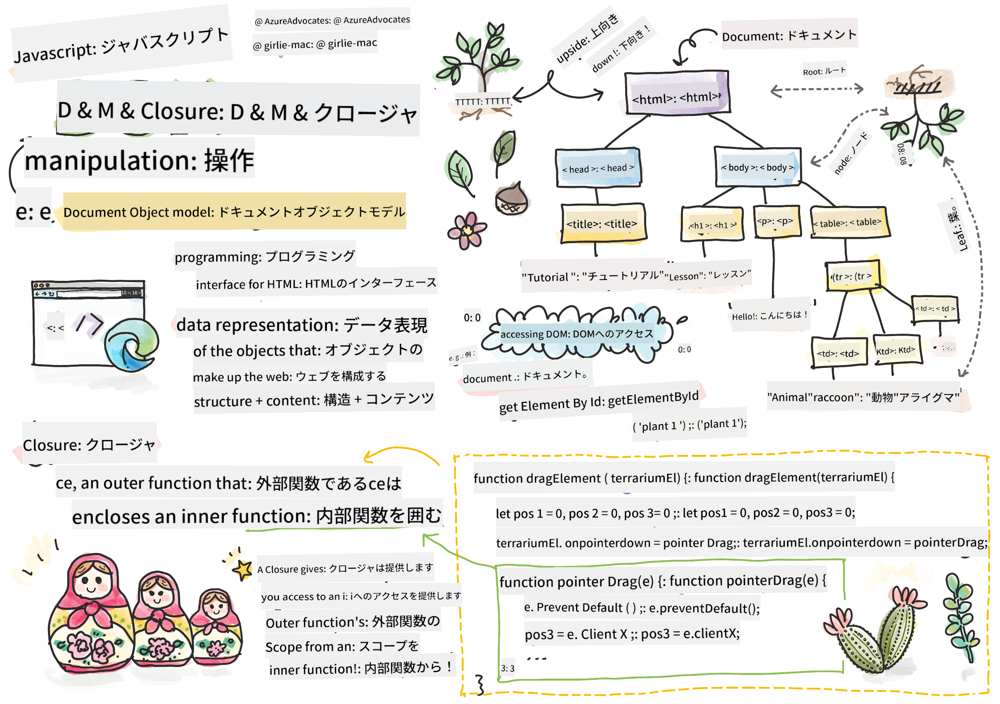
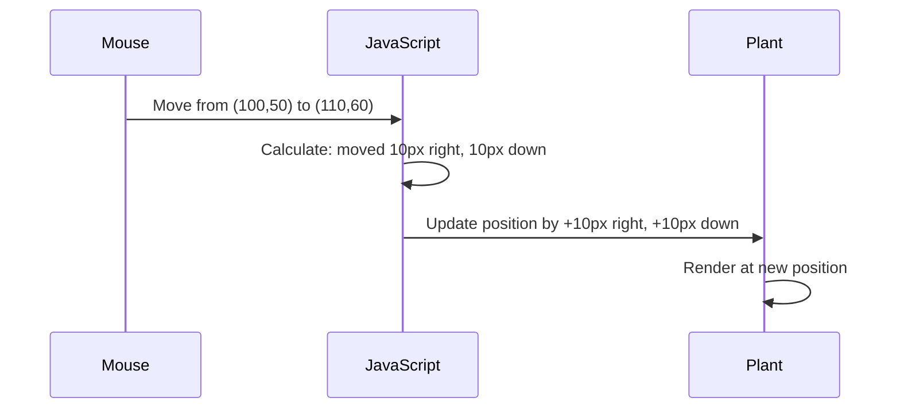

<!--
CO_OP_TRANSLATOR_METADATA:
{
  "original_hash": "bc93f6285423033ebf5b8abeb5282888",
  "translation_date": "2025-10-24T15:01:54+00:00",
  "source_file": "3-terrarium/3-intro-to-DOM-and-closures/README.md",
  "language_code": "ja"
}
-->
# テラリウムプロジェクト パート3: DOM操作とJavaScriptクロージャ


> スケッチノート: [Tomomi Imura](https://twitter.com/girlie_mac)

ウェブ開発の最も魅力的な側面の一つへようこそ！インタラクティブな要素を作ることです。Document Object Model (DOM) は、HTMLとJavaScriptをつなぐ橋のようなもので、今日はこれを使ってテラリウムを生き生きとさせます。ティム・バーナーズ＝リーが最初のウェブブラウザを作ったとき、彼は動的でインタラクティブなドキュメントを想像していました。そのビジョンを可能にするのがDOMです。

また、最初は少し難しく感じるかもしれないJavaScriptクロージャについても探求します。クロージャは、関数が重要な情報を「記憶」できる「メモリポケット」を作るようなものです。テラリウムの各植物が自分の位置を追跡するデータ記録を持つようなイメージです。このレッスンの終わりには、クロージャがどれほど自然で便利なものか理解できるでしょう。

今回作るのは、ユーザーが植物を好きな場所にドラッグ＆ドロップできるテラリウムです。ドラッグ＆ドロップのファイルアップロードからインタラクティブなゲームまでを支えるDOM操作技術を学びます。テラリウムを生き生きとさせましょう。

## 講義前のクイズ

[講義前のクイズ](https://ff-quizzes.netlify.app/web/quiz/19)

## DOMを理解する: インタラクティブなウェブページへのゲートウェイ

Document Object Model (DOM) は、JavaScriptがHTML要素と通信する方法です。ブラウザがHTMLページを読み込むと、そのページの構造化された表現をメモリ内に作成します。それがDOMです。HTMLの各要素が家族の一員であり、JavaScriptがアクセス、変更、再配置できる家系図のようなものだと考えてください。

DOM操作は静的なページをインタラクティブなウェブサイトに変えます。ボタンがホバーで色を変えたり、ページをリフレッシュせずにコンテンツが更新されたり、ドラッグ可能な要素がある場合、それはすべてDOM操作の成果です。


> DOMとそれを参照するHTMLマークアップの表現。出典: [Olfa Nasraoui](https://www.researchgate.net/publication/221417012_Profile-Based_Focused_Crawler_for_Social_Media-Sharing_Websites)

**DOMの強力な点は以下の通りです:**
- **提供**: ページ上の任意の要素にアクセスする構造化された方法
- **可能にする**: ページリフレッシュなしで動的なコンテンツ更新
- **対応**: クリックやドラッグなどのユーザーインタラクションにリアルタイムで反応
- **基盤を作る**: 現代のインタラクティブなウェブアプリケーションの基礎

## JavaScriptクロージャ: 整理された強力なコードを作る

[JavaScriptクロージャ](https://developer.mozilla.org/docs/Web/JavaScript/Closures) は、関数に独自のプライベートな作業スペースと永続的なメモリを与えるようなものです。ダーウィンのフィンチがガラパゴス諸島でそれぞれの環境に基づいて特殊なくちばしを進化させたように、クロージャは特定のコンテキストを「記憶」する特殊な関数を作ります。

テラリウムでは、クロージャを使って各植物が独自の位置を記憶できるようにします。このパターンはプロフェッショナルなJavaScript開発全体で頻繁に見られ、理解しておくべき価値のある概念です。

> 💡 **クロージャを理解する**: クロージャはJavaScriptの重要なトピックであり、多くの開発者が理論的な側面を完全に理解する前に何年も使用します。今日は実践的な応用に焦点を当てます。インタラクティブな機能を構築する中で、自然にクロージャが現れるのを見てください。実際の問題を解決する方法を見て理解を深めていきましょう。


> DOMとそれを参照するHTMLマークアップの表現。出典: [Olfa Nasraoui](https://www.researchgate.net/publication/221417012_Profile-Based_Focused_Crawler_for_Social_Media-Sharing_Websites)

このレッスンでは、ユーザーがページ上の植物を操作できるJavaScriptを作成し、インタラクティブなテラリウムプロジェクトを完成させます。

## 始める前に: 成功への準備

前回のテラリウムレッスンで使用したHTMLとCSSファイルが必要です。これからその静的なデザインをインタラクティブにします。初めて参加する場合は、これらのレッスンを先に完了することで重要なコンテキストを得られます。

今回作るもの:
- **スムーズなドラッグ＆ドロップ**: テラリウムのすべての植物に対応
- **座標追跡**: 植物が自分の位置を記憶
- **完全なインタラクティブインターフェース**: バニラJavaScriptを使用
- **整理されたクリーンなコード**: クロージャパターンを活用

## JavaScriptファイルのセットアップ

テラリウムをインタラクティブにするJavaScriptファイルを作成しましょう。

**ステップ1: スクリプトファイルを作成**

テラリウムフォルダ内に、新しいファイル`script.js`を作成します。

**ステップ2: JavaScriptをHTMLにリンク**

`index.html`ファイルの`<head>`セクションに以下のスクリプトタグを追加します:

```html
<script src="./script.js" defer></script>
```

**`defer`属性が重要な理由:**
- **保証**: JavaScriptがすべてのHTMLが読み込まれるまで待機
- **防止**: JavaScriptが準備ができていない要素を探してエラーを引き起こすことを防ぐ
- **確保**: すべての植物要素がインタラクション可能
- **パフォーマンス向上**: スクリプトをページの下部に配置するよりも優れた性能

> ⚠️ **重要な注意点**: `defer`属性は一般的なタイミングの問題を防ぎます。これがないと、JavaScriptがHTML要素を読み込む前にアクセスしようとしてエラーが発生する可能性があります。

---

## JavaScriptをHTML要素に接続する

要素をドラッグ可能にする前に、JavaScriptがDOM内でそれらを見つける必要があります。これは図書館のカタログシステムのようなものです。カタログ番号を取得すれば、必要な本を正確に見つけてその内容にアクセスできます。

`document.getElementById()`メソッドを使用してこれらの接続を行います。これは正確なファイリングシステムのようなもので、IDを指定することでHTML内の必要な要素を正確に見つけることができます。

### すべての植物にドラッグ機能を有効化

以下のコードを`script.js`ファイルに追加してください:

```javascript
// Enable drag functionality for all 14 plants
dragElement(document.getElementById('plant1'));
dragElement(document.getElementById('plant2'));
dragElement(document.getElementById('plant3'));
dragElement(document.getElementById('plant4'));
dragElement(document.getElementById('plant5'));
dragElement(document.getElementById('plant6'));
dragElement(document.getElementById('plant7'));
dragElement(document.getElementById('plant8'));
dragElement(document.getElementById('plant9'));
dragElement(document.getElementById('plant10'));
dragElement(document.getElementById('plant11'));
dragElement(document.getElementById('plant12'));
dragElement(document.getElementById('plant13'));
dragElement(document.getElementById('plant14'));
```

**このコードが達成すること:**
- **各植物要素をDOM内で特定**: ユニークなIDを使用
- **各HTML要素のJavaScript参照を取得**
- **各要素を`dragElement`関数に渡す**: 次に作成します
- **すべての植物をドラッグ＆ドロップインタラクションに準備**
- **HTML構造をJavaScript機能に接続**

> 🎯 **なぜIDをクラスではなく使用するのか?** IDは特定の要素を一意に識別するために使用され、CSSクラスは要素のグループをスタイリングするために設計されています。JavaScriptが個々の要素を操作する必要がある場合、IDは必要な精度と性能を提供します。

> 💡 **プロのヒント**: 各植物に対して個別に`dragElement()`を呼び出している点に注目してください。このアプローチは、各植物が独自のドラッグ動作を得ることを保証し、スムーズなユーザーインタラクションに不可欠です。

---

## ドラッグ要素クロージャの構築

次に、各植物のドラッグ動作を管理するクロージャを作成します。このクロージャには、マウスの動きを追跡し、要素の位置を更新するために協力する複数の内部関数が含まれます。

クロージャはこのタスクに最適です。なぜなら、関数呼び出し間で持続する「プライベート」変数を作成し、各植物に独自の座標追跡システムを提供できるからです。

### シンプルな例でクロージャを理解する

クロージャの概念を示す簡単な例を以下に示します:

```javascript
function createCounter() {
    let count = 0; // This is like a private variable
    
    function increment() {
        count++; // The inner function remembers the outer variable
        return count;
    }
    
    return increment; // We're giving back the inner function
}

const myCounter = createCounter();
console.log(myCounter()); // 1
console.log(myCounter()); // 2
```

**このクロージャパターンで起こっていること:**
- **プライベートな`count`変数を作成**: このクロージャ内でのみ存在
- **内部関数**: 外部変数（クロージャメカニズム）にアクセスして変更可能
- **返すと**: 内部関数はそのプライベートデータへの接続を維持
- **`createCounter()`が終了した後も**: `count`はその値を保持

### ドラッグ機能にクロージャが最適な理由

テラリウムでは、各植物が現在の位置座標を記憶する必要があります。クロージャは完璧な解決策を提供します:

**プロジェクトにおける主な利点:**
- **各植物に独自の位置変数を維持**
- **ドラッグイベント間で座標データを保持**
- **異なるドラッグ可能な要素間の変数競合を防止**
- **クリーンで整理されたコード構造を作成**

> 🎯 **学習目標**: 今すぐクロージャのすべての側面を習得する必要はありません。コードを整理し、ドラッグ機能の状態を維持する方法を理解することに焦点を当ててください。

### dragElement関数の作成

次に、ドラッグロジック全体を処理するメイン関数を構築します。この関数を植物要素の宣言の下に追加してください:

```javascript
function dragElement(terrariumElement) {
    // Initialize position tracking variables
    let pos1 = 0,  // Previous mouse X position
        pos2 = 0,  // Previous mouse Y position  
        pos3 = 0,  // Current mouse X position
        pos4 = 0;  // Current mouse Y position
    
    // Set up the initial drag event listener
    terrariumElement.onpointerdown = pointerDrag;
}
```

**位置追跡システムの理解:**
- **`pos1`と`pos2`**: 古いマウス位置と新しいマウス位置の差を保存
- **`pos3`と`pos4`**: 現在のマウス座標を追跡
- **`terrariumElement`**: ドラッグ可能にする特定の植物要素
- **`onpointerdown`**: ユーザーがドラッグを開始したときにトリガーされるイベント

**クロージャパターンの動作:**
- **各植物要素にプライベートな位置変数を作成**
- **ドラッグライフサイクル全体でこれらの変数を維持**
- **各植物が独自の座標を独立して追跡**
- **`dragElement`関数を通じてクリーンなインターフェースを提供**

### なぜポインターイベントを使用するのか?

`onclick`のような馴染みのあるイベントではなく、`onpointerdown`を使用する理由は以下の通りです:

| イベントタイプ | 最適な用途 | 注意点 |
|----------------|------------|--------|
| `onclick` | シンプルなボタンクリック | ドラッグを処理できない（クリックとリリースのみ） |
| `onpointerdown` | マウスとタッチの両方 | 新しいが、現在は十分にサポートされている |
| `onmousedown` | デスクトップマウス専用 | モバイルユーザーを対象外にしてしまう |

**ポインターイベントが今回の構築に最適な理由:**
- **マウス、指、スタイラスを問わず**優れた動作
- **ラップトップ、タブレット、スマートフォンで同じ感覚**
- **実際のドラッグ動作を処理**（クリックして終了するだけではない）
- **現代のウェブアプリに期待されるスムーズな体験を提供**

> 💡 **将来を見据えた設計**: ポインターイベントはユーザーインタラクションを処理する現代的な方法です。マウスとタッチのために別々のコードを書く代わりに、両方を無料で得られます。素晴らしいですね？

---

## pointerDrag関数: ドラッグ開始のキャプチャ

ユーザーが植物を押し下げたとき（マウスクリックまたは指でタッチ）、`pointerDrag`関数が動作を開始します。この関数は初期座標をキャプチャし、ドラッグシステムをセットアップします。

`dragElement`クロージャ内で、`terrariumElement.onpointerdown = pointerDrag;`の行のすぐ後にこの関数を追加してください:

```javascript
function pointerDrag(e) {
    // Prevent default browser behavior (like text selection)
    e.preventDefault();
    
    // Capture the initial mouse/touch position
    pos3 = e.clientX;  // X coordinate where drag started
    pos4 = e.clientY;  // Y coordinate where drag started
    
    // Set up event listeners for the dragging process
    document.onpointermove = elementDrag;
    document.onpointerup = stopElementDrag;
}
```

**ステップバイステップでの動作:**
- **デフォルトのブラウザ動作を防止**: ドラッグを妨げる可能性のある動作を防ぐ
- **ドラッグジェスチャーを開始した正確な座標を記録**
- **継続的なドラッグ動作のためのイベントリスナーを設定**
- **マウス/指の動きをページ全体で追跡する準備**

### イベント防止の理解

`e.preventDefault()`行はスムーズなドラッグのために重要です:

**防止しない場合、ブラウザは以下を行う可能性があります:**
- **テキストを選択**: ページをドラッグするとき
- **コンテキストメニューをトリガー**: 右クリックドラッグ時
- **カスタムドラッグ動作を妨害**
- **ドラッグ操作中に視覚的なアーティファクトを作成**

> 🔍 **実験**: このレッスンを完了した後、`e.preventDefault()`を削除してみて、ドラッグ体験にどのような影響があるか確認してください。この行がなぜ重要なのかすぐに理解できるでしょう！

### 座標追跡システム

`e.clientX`と`e.clientY`プロパティは、正確なマウス/タッチ座標を提供します:

| プロパティ | 測定内容 | 使用例 |
|------------|----------|--------|
| `clientX` | ビューポートに対する水平位置 | 左右の動きを追跡 |
| `clientY` | ビューポートに対する垂直位置 | 上下の動きを追跡 |

**これらの座標の理解:**
- **ピクセル単位の正確な位置情報を提供**
- **ユーザーがポインターを動かすたびにリアルタイムで更新**
- **異なる画面サイズやズームレベルでも一貫性を維持**
- **スムーズで応答性の高いドラッグインタラクションを可能にする**

### ドキュメントレベルのイベントリスナーの設定

`move`と`stop`イベントを植物要素ではなく、`document`全体にアタッチすることに注目してください:

```javascript
document.onpointermove = elementDrag;
document.onpointerup = stopElementDrag;
```

**ドキュメントにアタッチする理由:**
- **マウスが植物要素を離れても追跡を続ける**
- **ユーザーが素早く動いた場合でもドラッグが中断されない**
- **画面全体でスムーズなドラッグを提供**
- **カーソルがブラウザウィンドウ外に移動する場合のエッジケースを処理**

> ⚡ **パフォーマンス注意**: ドラッグが停止したときにこれらのドキュメントレベルのリスナーをクリーンアップして、メモリリークやパフォーマンス問題を防ぎます。

## ドラッグシステムの完成: 移
- **`pos3` と `pos4`**: 次の計算のために現在のマウス位置を保存します
- **`offsetTop` と `offsetLeft`**: ページ上の要素の現在位置を取得します
- **減算ロジック**: マウスが移動した分だけ要素を移動させます

**動きの計算の内訳:**
1. **測定**: 古いマウス位置と新しいマウス位置の差を測定
2. **計算**: マウスの動きに基づいて要素をどれだけ移動させるかを計算
3. **更新**: 要素のCSS位置プロパティをリアルタイムで更新
4. **保存**: 次の移動計算の基準として新しい位置を保存

### 数学的な視覚的表現



### stopElementDrag関数: 後処理

`elementDrag`の閉じ中括弧の後に後処理関数を追加します:

```javascript
function stopElementDrag() {
    // Remove the document-level event listeners
    document.onpointerup = null;
    document.onpointermove = null;
}
```

**後処理が重要な理由:**
- **防止**: 残存するイベントリスナーによるメモリリークを防ぐ
- **停止**: ユーザーが植物を離したときにドラッグ動作を停止
- **独立性**: 他の要素が独立してドラッグできるようにする
- **リセット**: 次のドラッグ操作のためにシステムをリセット

**後処理をしない場合の影響:**
- ドラッグが停止した後もイベントリスナーが動作し続ける
- 未使用のリスナーが蓄積されることでパフォーマンスが低下
- 他の要素との予期しない動作が発生する
- 不要なイベント処理でブラウザリソースが浪費される

### CSS位置プロパティの理解

このドラッグシステムでは、2つの主要なCSSプロパティを操作します:

| プロパティ | 制御内容 | 使用方法 |
|------------|----------|----------|
| `top` | 上端からの距離 | ドラッグ中の垂直位置 |
| `left` | 左端からの距離 | ドラッグ中の水平位置 |

**オフセットプロパティに関する重要なポイント:**
- **`offsetTop`**: 配置された親要素の上端からの現在の距離
- **`offsetLeft`**: 配置された親要素の左端からの現在の距離
- **配置コンテキスト**: これらの値は最も近い配置された祖先に対して相対的
- **リアルタイム更新**: CSSプロパティを変更すると即座に反映される

> 🎯 **デザイン哲学**: このドラッグシステムは意図的に柔軟性を持たせています – 「ドロップゾーン」や制限はありません。ユーザーは植物をどこにでも配置でき、テラリウムデザインに完全な創造的コントロールを与えます。

## すべてをまとめる: 完全なドラッグシステム

おめでとうございます！バニラJavaScriptを使用して高度なドラッグ＆ドロップシステムを構築しました。完成した`dragElement`関数には、強力なクロージャが含まれています:

**クロージャが達成すること:**
- **保持**: 各植物の独立した位置変数をプライベートに管理
- **処理**: ドラッグのライフサイクル全体を開始から終了まで管理
- **提供**: 画面全体でスムーズで応答性の高い動きを実現
- **後処理**: メモリリークを防ぐためにリソースを適切にクリーンアップ
- **作成**: テラリウムデザインのための直感的で創造的なインターフェースを提供

### インタラクティブなテラリウムのテスト

インタラクティブなテラリウムをテストしましょう！`index.html`ファイルをウェブブラウザで開き、機能を試してください:

1. **クリックして保持**: 任意の植物をクリックしてドラッグを開始
2. **マウスまたは指を移動**: 植物がスムーズに追従する様子を確認
3. **離す**: 新しい位置に植物をドロップ
4. **試す**: インターフェースを探索しながら異なる配置を試してみる

🥇 **達成**: ファイルアップロードやカンバンボードなど、数多くのインタラクティブなインターフェースの背後にある原則を活用した完全にインタラクティブなウェブアプリケーションを作成しました。


---

## GitHub Copilot Agent チャレンジ 🚀

Agentモードを使用して以下のチャレンジを完了してください:

**説明:** テラリウムプロジェクトにリセット機能を追加し、すべての植物を元の位置にスムーズに戻すアニメーションを実装します。

**プロンプト:** ページ読み込み時に元の位置を保存し、リセットボタンをクリックすると、すべての植物がCSSトランジションを使用して1秒間で元のサイドバー位置にスムーズに戻るようにするリセットボタンを作成してください。

[agent mode](https://code.visualstudio.com/blogs/2025/02/24/introducing-copilot-agent-mode)について詳しくはこちらをご覧ください。

## 🚀 追加チャレンジ: スキルを拡張

テラリウムをさらに進化させたいですか？以下の拡張機能を試してみてください:

**創造的な拡張:**
- **ダブルクリック**で植物を最前面に移動（z-index操作）
- **視覚的フィードバックを追加**: 植物にホバーした際の微妙な光の効果
- **境界を実装**: 植物がテラリウム外にドラッグされるのを防ぐ
- **保存機能を作成**: localStorageを使用して植物の位置を記憶
- **音声効果を追加**: 植物を拾ったり配置したりする際の効果音

> 💡 **学習の機会**: これらのチャレンジは、DOM操作、イベント処理、ユーザーエクスペリエンスデザインの新しい側面を学ぶのに役立ちます。

## 講義後のクイズ

[講義後のクイズ](https://ff-quizzes.netlify.app/web/quiz/20)

## 復習と自己学習: 理解を深める

DOM操作とクロージャの基本を習得しましたが、探求すべきことはまだまだあります！知識とスキルを拡張するための道筋を以下に示します。

### 代替ドラッグ＆ドロップアプローチ

最大の柔軟性を得るためにポインターイベントを使用しましたが、ウェブ開発には複数のアプローチがあります:

| アプローチ | 最適な用途 | 学習価値 |
|------------|------------|----------|
| [HTML Drag and Drop API](https://developer.mozilla.org/docs/Web/API/HTML_Drag_and_Drop_API) | ファイルアップロード、正式なドラッグゾーン | ネイティブブラウザ機能の理解 |
| [Touch Events](https://developer.mozilla.org/docs/Web/API/Touch_events) | モバイル特化のインタラクション | モバイルファースト開発パターン |
| CSS `transform` プロパティ | スムーズなアニメーション | パフォーマンス最適化技術 |

### 高度なDOM操作トピック

**学習の次のステップ:**
- **イベント委任**: 複数の要素に対するイベントを効率的に処理
- **Intersection Observer**: 要素がビューポートに入る/出るのを検出
- **Mutation Observer**: DOM構造の変更を監視
- **Web Components**: 再利用可能でカプセル化されたUI要素を作成
- **仮想DOMの概念**: フレームワークがDOM更新を最適化する方法の理解

### 継続学習のための必須リソース

**技術ドキュメント:**
- [MDN Pointer Events Guide](https://developer.mozilla.org/docs/Web/API/Pointer_events) - ポインターイベントの包括的なリファレンス
- [W3C Pointer Events Specification](https://www.w3.org/TR/pointerevents1/) - 公式標準ドキュメント
- [JavaScript Closures Deep Dive](https://developer.mozilla.org/docs/Web/JavaScript/Closures) - 高度なクロージャパターン

**ブラウザ互換性:**
- [CanIUse.com](https://caniuse.com/) - ブラウザ間の機能サポートを確認
- [MDN Browser Compatibility Data](https://github.com/mdn/browser-compat-data) - 詳細な互換性情報

**練習の機会:**
- **パズルゲームを構築**: 同様のドラッグメカニクスを使用
- **カンバンボードを作成**: ドラッグ＆ドロップでタスク管理
- **画像ギャラリーをデザイン**: ドラッグ可能な写真配置
- **モバイルインターフェースで実験**: タッチジェスチャーを実装

> 🎯 **学習戦略**: これらの概念を確固たるものにする最善の方法は練習です。ドラッグ可能なインターフェースのバリエーションを構築してみてください – 各プロジェクトがユーザーインタラクションとDOM操作について新しいことを教えてくれるでしょう。

## 課題

[DOMをもう少し操作してみよう](assignment.md)

---

**免責事項**:  
この文書はAI翻訳サービス[Co-op Translator](https://github.com/Azure/co-op-translator)を使用して翻訳されています。正確性を追求しておりますが、自動翻訳には誤りや不正確な部分が含まれる可能性があります。元の言語で記載された文書を正式な情報源としてご参照ください。重要な情報については、専門の人間による翻訳を推奨します。この翻訳の使用に起因する誤解や誤解釈について、当社は責任を負いません。