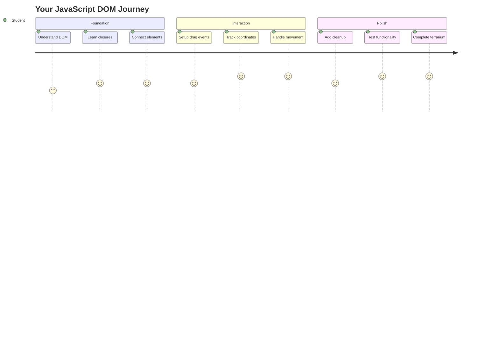
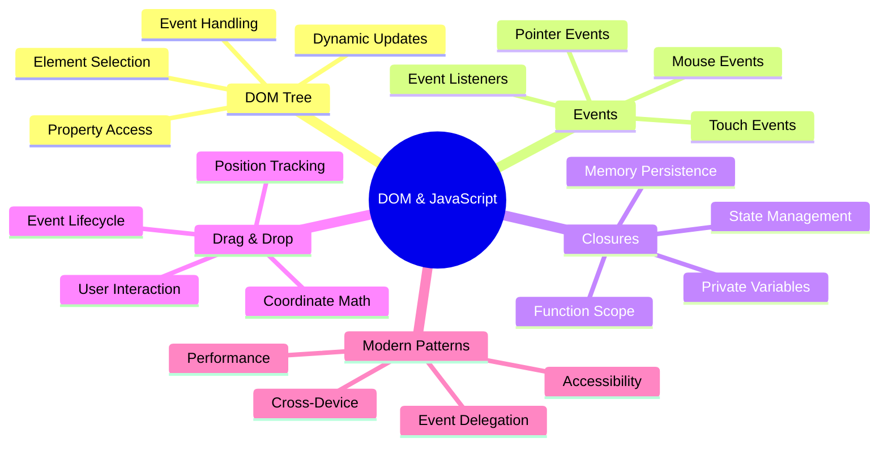
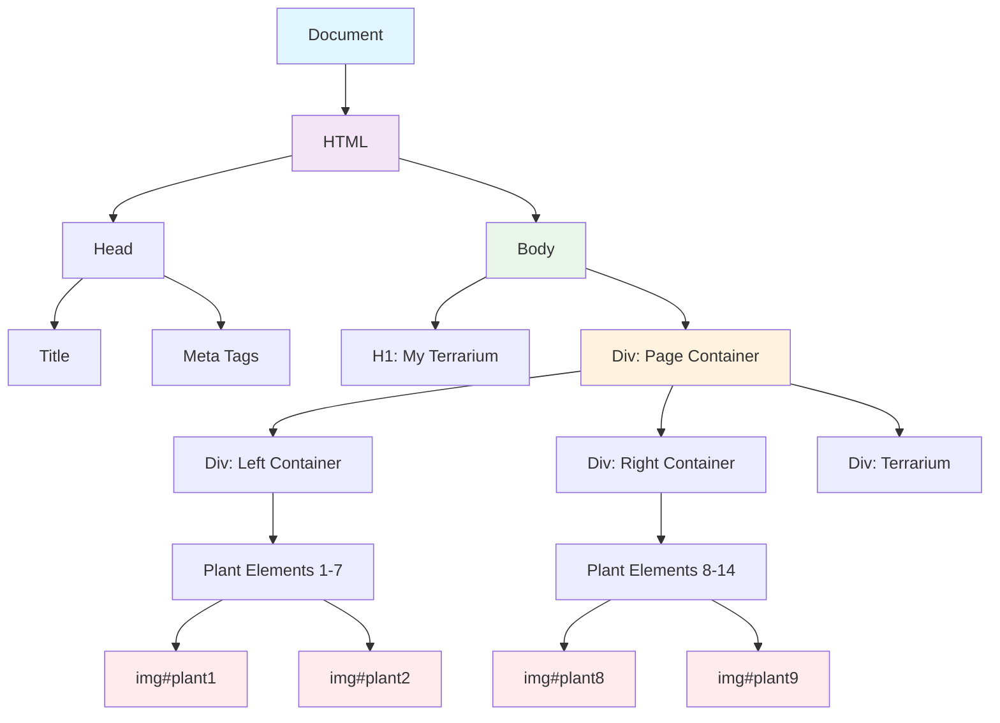
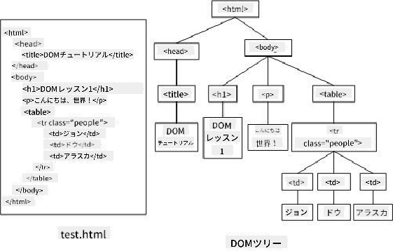
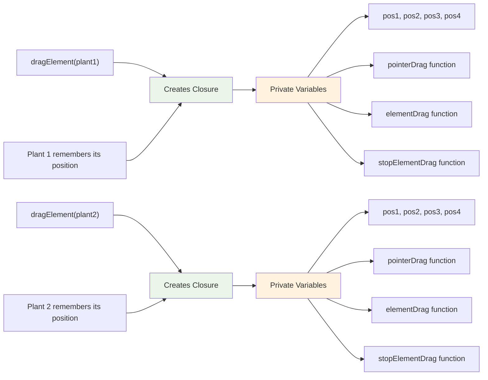
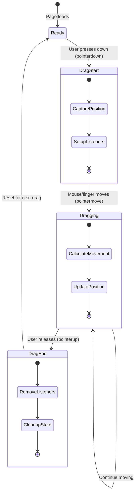
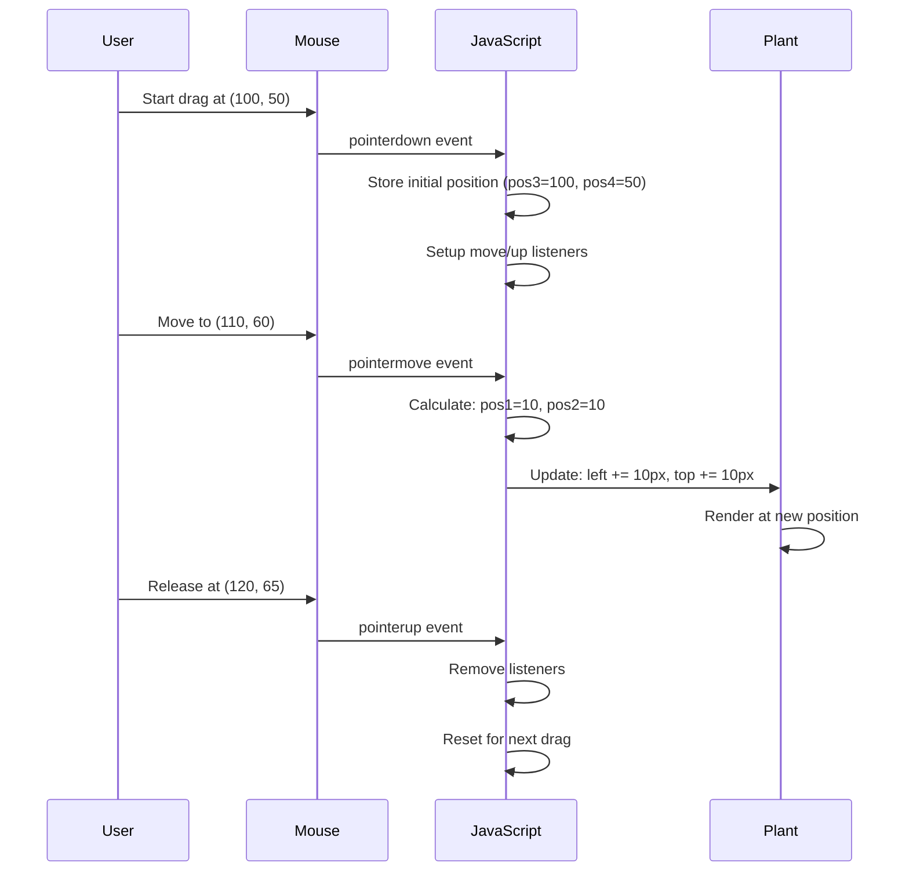
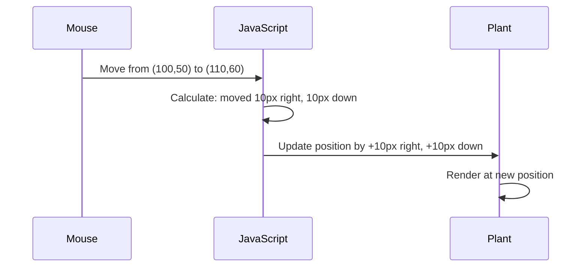
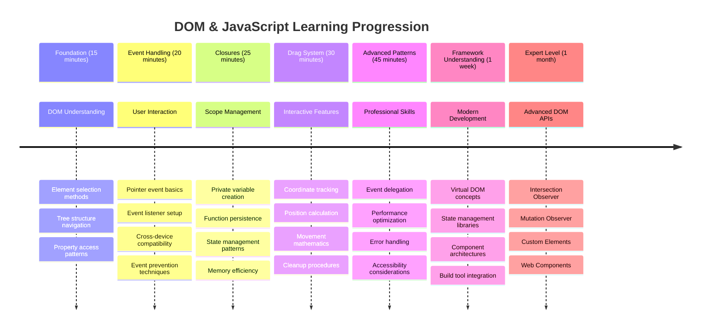

<!--
CO_OP_TRANSLATOR_METADATA:
{
  "original_hash": "973e48ad87d67bf5bb819746c9f8e302",
  "translation_date": "2025-11-06T12:45:24+00:00",
  "source_file": "3-terrarium/3-intro-to-DOM-and-closures/README.md",
  "language_code": "ja"
}
-->
# テラリウムプロジェクト パート3: DOM操作とJavaScriptクロージャ




> スケッチノート: [Tomomi Imura](https://twitter.com/girlie_mac)

ウェブ開発の最も魅力的な側面の一つへようこそ！インタラクティブな要素を作ることです。Document Object Model (DOM) は、HTMLとJavaScriptをつなぐ橋のようなもので、今日はこれを使ってテラリウムを動かします。ティム・バーナーズ＝リーが最初のウェブブラウザを作ったとき、彼は動的でインタラクティブなドキュメントを想像していました。そのビジョンを可能にするのがDOMです。

また、JavaScriptのクロージャについても学びます。最初は難しそうに聞こえるかもしれませんが、クロージャは関数が重要な情報を「記憶するポケット」を作るようなものだと考えてください。それは、テラリウムの各植物が自分の位置を追跡するデータ記録を持つようなものです。このレッスンの終わりには、クロージャがどれほど自然で便利なものか理解できるでしょう。

今回作るのは、ユーザーが植物を自由にドラッグ＆ドロップできるテラリウムです。ドラッグ＆ドロップのファイルアップロードからインタラクティブなゲームまでを支えるDOM操作技術を学びます。テラリウムを生き生きとさせましょう。



## 講義前クイズ

[講義前クイズ](https://ff-quizzes.netlify.app/web/quiz/19)

## DOMの理解: インタラクティブなウェブページへの入り口

Document Object Model (DOM) は、JavaScriptがHTML要素と通信する方法です。ブラウザがHTMLページを読み込むと、そのページの構造化された表現をメモリに作成します。それがDOMです。HTMLの各要素が家族の一員であり、JavaScriptがアクセス、変更、再配置できる家系図のようなものだと考えてください。

DOM操作は静的なページをインタラクティブなウェブサイトに変えます。ボタンがホバーで色を変えたり、ページをリフレッシュせずにコンテンツが更新されたり、ドラッグ可能な要素がある場合、それはDOM操作の成果です。





> DOMとそれを参照するHTMLマークアップの表現。出典: [Olfa Nasraoui](https://www.researchgate.net/publication/221417012_Profile-Based_Focused_Crawler_for_Social_Media-Sharing_Websites)

**DOMの強力な点:**
- **提供**: ページ上の任意の要素にアクセスする構造化された方法
- **可能**: ページをリフレッシュせずに動的なコンテンツ更新
- **対応**: クリックやドラッグなどのユーザーインタラクションにリアルタイムで反応
- **基盤**: 現代のインタラクティブなウェブアプリケーションの基礎を構築

## JavaScriptクロージャ: 整理された強力なコードの作成

[JavaScriptクロージャ](https://developer.mozilla.org/docs/Web/JavaScript/Closures)は、関数に独自のプライベートな作業スペースと永続的なメモリを与えるようなものです。ダーウィンのフィンチがガラパゴス諸島でそれぞれの環境に基づいて特化したくちばしを発達させたように、クロージャは特定のコンテキストを「記憶」する特化した関数を作ります。

テラリウムでは、クロージャが各植物の位置を独立して記憶するのに役立ちます。このパターンはプロフェッショナルなJavaScript開発全体で頻繁に現れ、理解する価値のある概念です。



> 💡 **クロージャの理解**: クロージャはJavaScriptの重要なトピックであり、多くの開発者が理論的な側面を完全に理解する前に何年も使用します。今日は実践的な応用に焦点を当てます。インタラクティブな機能を構築する中で、自然にその仕組みが見えてくるでしょう。理解は実際の問題を解決する方法を見ることで深まります。


> DOMとそれを参照するHTMLマークアップの表現。出典: [Olfa Nasraoui](https://www.researchgate.net/publication/221417012_Profile-Based_Focused_Crawler_for_Social_Media-Sharing_Websites)

このレッスンでは、ページ上の植物を操作できるJavaScriptを作成することで、インタラクティブなテラリウムプロジェクトを完成させます。

## 始める前に: 成功への準備

前回のテラリウムレッスンで使用したHTMLとCSSファイルが必要です。これからその静的デザインをインタラクティブにします。初めて参加する場合は、まずそれらのレッスンを完了することで重要なコンテキストを得られます。

今回作るもの:
- **スムーズなドラッグ＆ドロップ**: テラリウムのすべての植物に対応
- **座標追跡**: 植物が自分の位置を記憶
- **完全なインタラクティブインターフェース**: バニラJavaScriptを使用
- **整理されたコード**: クロージャパターンを活用

## JavaScriptファイルのセットアップ

テラリウムをインタラクティブにするJavaScriptファイルを作成しましょう。

**ステップ1: スクリプトファイルを作成**

テラリウムフォルダ内に新しいファイル`script.js`を作成します。

**ステップ2: JavaScriptをHTMLにリンク**

`index.html`ファイルの`<head>`セクションに以下のスクリプトタグを追加します:

```html
<script src="./script.js" defer></script>
```

**`defer`属性が重要な理由:**
- **保証**: JavaScriptがすべてのHTMLが読み込まれるまで待機
- **防止**: JavaScriptが準備ができていない要素を探すエラー
- **確保**: すべての植物要素がインタラクション可能
- **提供**: スクリプトをページの下部に配置するよりも良いパフォーマンス

> ⚠️ **重要な注意点**: `defer`属性は一般的なタイミング問題を防ぎます。これがないと、JavaScriptがHTML要素を読み込む前にアクセスしようとしてエラーが発生する可能性があります。

---

## JavaScriptをHTML要素に接続する

要素をドラッグ可能にする前に、JavaScriptがDOM内でそれらを見つける必要があります。これは図書館のカタログシステムのようなものです。カタログ番号があれば、必要な本を正確に見つけてその内容にアクセスできます。

`document.getElementById()`メソッドを使用してこれらの接続を行います。これは正確なファイリングシステムのようなもので、IDを提供するとHTML内の必要な要素を正確に見つけます。

### すべての植物にドラッグ機能を有効化

以下のコードを`script.js`ファイルに追加してください:

```javascript
// Enable drag functionality for all 14 plants
dragElement(document.getElementById('plant1'));
dragElement(document.getElementById('plant2'));
dragElement(document.getElementById('plant3'));
dragElement(document.getElementById('plant4'));
dragElement(document.getElementById('plant5'));
dragElement(document.getElementById('plant6'));
dragElement(document.getElementById('plant7'));
dragElement(document.getElementById('plant8'));
dragElement(document.getElementById('plant9'));
dragElement(document.getElementById('plant10'));
dragElement(document.getElementById('plant11'));
dragElement(document.getElementById('plant12'));
dragElement(document.getElementById('plant13'));
dragElement(document.getElementById('plant14'));
```

**このコードが達成すること:**
- **DOM内で**各植物要素をそのユニークなIDを使って見つける
- **JavaScript参照を取得**: 各HTML要素に対して
- **各要素を**`dragElement`関数に渡す（次に作成します）
- **すべての植物を**ドラッグ＆ドロップインタラクションに準備
- **HTML構造を**JavaScript機能に接続

> 🎯 **なぜIDをクラスではなく使用するのか?** IDは特定の要素に対するユニークな識別子を提供します。一方、CSSクラスは要素のグループをスタイリングするために設計されています。JavaScriptが個々の要素を操作する必要がある場合、IDは必要な精度とパフォーマンスを提供します。

> 💡 **プロのヒント**: 各植物に対して個別に`dragElement()`を呼び出していることに注目してください。このアプローチは、各植物が独自のドラッグ動作を得ることを保証し、スムーズなユーザーインタラクションに不可欠です。

### 🔄 **教育的チェックイン**
**DOM接続の理解**: ドラッグ機能に進む前に、以下を確認してください:
- ✅ `document.getElementById()`がHTML要素をどのように見つけるか説明できる
- ✅ なぜ各植物にユニークなIDを使用するのか理解できる
- ✅ スクリプトタグの`defer`属性の目的を説明できる
- ✅ JavaScriptとHTMLがDOMを通じてどのように接続されるか認識できる

**簡単な自己テスト**: もし2つの要素が同じIDを持っていたらどうなるでしょうか？なぜ`getElementById()`は1つの要素しか返さないのでしょうか？
*答え: IDはユニークであるべきです。重複している場合、最初の要素のみが返されます*

---

## ドラッグ要素クロージャの構築

次に、各植物のドラッグ動作を管理するクロージャを作成します。このクロージャは、マウスの動きを追跡し、要素の位置を更新するために協力する複数の内部関数を含みます。

クロージャは、このタスクに最適です。なぜなら、関数呼び出し間で持続する「プライベート」変数を作成し、各植物に独自の座標追跡システムを提供できるからです。

### 簡単な例でクロージャを理解する

クロージャの概念を示す簡単な例を以下に示します:

```javascript
function createCounter() {
    let count = 0; // This is like a private variable
    
    function increment() {
        count++; // The inner function remembers the outer variable
        return count;
    }
    
    return increment; // We're giving back the inner function
}

const myCounter = createCounter();
console.log(myCounter()); // 1
console.log(myCounter()); // 2
```

**このクロージャパターンで起こっていること:**
- **プライベートな`count`変数を作成**: このクロージャ内でのみ存在
- **内部関数**: 外部変数（クロージャメカニズム）にアクセスして変更可能
- **返すとき**: 内部関数はそのプライベートデータへの接続を維持
- **終了後も**: `createCounter()`が実行を終了しても`count`は持続し、その値を記憶

### ドラッグ機能にクロージャが最適な理由

テラリウムでは、各植物が現在の位置座標を記憶する必要があります。クロージャは完璧な解決策を提供します:

**プロジェクトにおける主な利点:**
- **各植物の位置変数を独立して維持**
- **ドラッグイベント間で座標データを保持**
- **異なるドラッグ可能な要素間の変数競合を防止**
- **整理されたコード構造を作成**

> 🎯 **学習目標**: クロージャのすべての側面を今すぐマスターする必要はありません。コードを整理し、ドラッグ機能の状態を維持する方法を理解することに集中してください。



### dragElement関数の作成

次に、ドラッグロジック全体を処理するメイン関数を構築します。この関数を植物要素の宣言の下に追加してください:

```javascript
function dragElement(terrariumElement) {
    // Initialize position tracking variables
    let pos1 = 0,  // Previous mouse X position
        pos2 = 0,  // Previous mouse Y position  
        pos3 = 0,  // Current mouse X position
        pos4 = 0;  // Current mouse Y position
    
    // Set up the initial drag event listener
    terrariumElement.onpointerdown = pointerDrag;
}
```

**位置追跡システムの理解:**
- **`pos1`と`pos2`**: 古いマウス位置と新しいマウス位置の差を保存
- **`pos3`と`pos4`**: 現在のマウス座標を追跡
- **`terrariumElement`**: ドラッグ可能にする特定の植物要素
- **`onpointerdown`**: ユーザーがドラッグを開始したときにトリガーされるイベント

**クロージャパターンの仕組み:**
- **各植物要素にプライベートな位置変数を作成**
- **ドラッグライフサイクル全体でこれらの変数を維持**
- **各植物が独自の座標を独立して追跡することを保証**
- **`dragElement`関数を通じてクリーンなインターフェースを提供**

### なぜポインターイベントを使用するのか？

`onclick`ではなく`onpointerdown`を使用する理由が気になるかもしれません。以下がその理由です:

| イベントタイプ | 最適な用途 | 注意点 |
|------------|----------|-------------|
| `onclick` | シンプルなボタンのクリック | ドラッグを処理できない（クリックとリリースのみ） |
| `onpointerdown` | マウスとタッチの両方 | 新しいが、現在は十分にサポートされている |
| `onmousedown` | デスクトップマウス専用 | モバイルユーザーを対象外にする |

**ポインターイベントが今回の構築に最適な理由:**
- **マウス、指、スタイラス**を使用しても問題なく動作
- **ラップトップ、タブレット、スマホ**で同じ感覚
- **実際のドラッグ動作を処理**（クリック＆終了ではない）
- **現代のウェブアプリが期待するスムーズな体験を提供**

> 💡 **将来を見据えた設計**: ポインターイベントはユーザーインタラクションを処理する現代的な方法です。マウスとタッチのコードを別々に書く代わりに、両方を無料で得られます。かなり便利ですよね？

### 🔄 **教育的チェックイン**
**イベント処理の理解**: イベントの理解を確認してください:
- ✅ なぜマウスイベントではなくポインターイベントを使用するのか？
- ✅ クロージャ変数が関数呼び出し間で持続する仕組みは？
- ✅ `preventDefault()`がスムーズなドラッグに果たす役割は？
- ✅ なぜ個々の要素ではなくドキュメントにリスナーをアタッチするのか？

**実世界の接続**: 日常的に使用するドラッグ＆ドロップインターフェースを考えてみてください:
- **ファイルアップロード**: ブラウザウィンドウにファイルをドラッグ
- **カンバンボード**: タスクを列間で移動
- **画像ギャラリー**: 写真の順序を並べ替え
- **モバイルインターフェース**: タッチスクリーンでのスワイプやドラッグ

---

## pointerDrag関数: ドラッグ開始のキャプチャ

ユーザーが植物を押したとき（マウスクリックまたは指タッチ）、`pointerDrag`関数が動作を開始します。この関数は初期座標をキャプチャし、ドラッグシステムをセットアップします。

以下の関数を`dragElement`クロージャ内に追加してください。`terrariumElement.onpointerdown = pointerDrag;`の直後に配置します:

```javascript
function pointerDrag(e) {
    // Prevent default browser behavior (like text selection)
    e.preventDefault();
    
    // Capture the initial mouse/touch position
    pos3 = e.clientX;  // X coordinate where drag started
    pos4 = e.clientY;  // Y coordinate where drag started
    
    // Set up event listeners for the dragging process
    document.onpointermove = elementDrag;
    document.onpointerup = stopElementDrag;
}
```

**ステップごとに何が起こっているか:**
- **防止**: ドラッグを妨げる可能性のあるブラウザのデフォルト動作
- **記録**: ユーザーがドラッグジェスチャを開始した正確な座標
- **設定**: 継続的なドラッグ動作のイベントリスナーを確立
- **準備**: ドキュメント全体でマウス/指の動きを追跡するシステムを準備

### イベント防止の理解

`e.preventDefault()`行はスムーズなドラッグに不可欠です:

**防止しない場合、ブラウザは以下を行う可能性があります:**
- **テキストを選択**: ページ全体でドラッグするとき
- **コンテキストメニューをトリガー**: 右クリックドラッグ
- **カスタムドラッグ動作に干渉**
- **ドラッグ操作中に視覚的なアーティファクトを作成**

> 🔍 **実験**: このレッスンを完了した後、`e.preventDefault()`を削除してドラッグ体験にどのような影響が
**これらの座標を理解する:**
- **ピクセル単位**で正確な位置情報を提供
- **リアルタイム**でユーザーがポインターを動かすたびに更新
- **異なる画面サイズやズームレベル**でも一貫性を維持
- **スムーズで応答性の高い**ドラッグ操作を可能にする

### ドキュメントレベルのイベントリスナーの設定

マウスの移動や停止イベントを植物要素だけでなく、`document`全体にアタッチしている点に注目してください:

```javascript
document.onpointermove = elementDrag;
document.onpointerup = stopElementDrag;
```

**なぜドキュメントにアタッチするのか:**
- **植物要素を離れても**追跡を継続
- **ユーザーが素早く動かしても**ドラッグが中断されない
- **画面全体でスムーズなドラッグ**を提供
- **カーソルがブラウザウィンドウ外に移動する**場合のエッジケースを処理

> ⚡ **パフォーマンスに関する注意**: メモリリークやパフォーマンス問題を避けるため、ドラッグが停止した際にこれらのドキュメントレベルのリスナーをクリーンアップします。

## ドラッグシステムの完成: 移動とクリーンアップ

次に、実際のドラッグ移動を処理し、ドラッグが停止した際にクリーンアップする2つの関数を追加します。これらの関数は連携して、テラリウム内でスムーズで応答性の高い植物の移動を実現します。

### elementDrag関数: 移動の追跡

`pointerDrag`の閉じ中括弧の直後に`elementDrag`関数を追加してください:

```javascript
function elementDrag(e) {
    // Calculate the distance moved since the last event
    pos1 = pos3 - e.clientX;  // Horizontal distance moved
    pos2 = pos4 - e.clientY;  // Vertical distance moved
    
    // Update the current position tracking
    pos3 = e.clientX;  // New current X position
    pos4 = e.clientY;  // New current Y position
    
    // Apply the movement to the element's position
    terrariumElement.style.top = (terrariumElement.offsetTop - pos2) + 'px';
    terrariumElement.style.left = (terrariumElement.offsetLeft - pos1) + 'px';
}
```

**座標計算の数学を理解する:**
- **`pos1`と`pos2`**: 前回の更新からマウスがどれだけ移動したかを計算
- **`pos3`と`pos4`**: 次回の計算のために現在のマウス位置を保存
- **`offsetTop`と`offsetLeft`**: ページ上の要素の現在位置を取得
- **減算ロジック**: マウスが移動した分だけ要素を移動



**移動計算の内訳:**
1. **古いマウス位置と新しいマウス位置の差を測定**
2. **マウスの移動に基づいて要素をどれだけ移動させるかを計算**
3. **リアルタイムで要素のCSS位置プロパティを更新**
4. **次回の移動計算の基準として新しい位置を保存**

### 数学の視覚的表現



### stopElementDrag関数: クリーンアップ

`elementDrag`の閉じ中括弧の後にクリーンアップ関数を追加してください:

```javascript
function stopElementDrag() {
    // Remove the document-level event listeners
    document.onpointerup = null;
    document.onpointermove = null;
}
```

**なぜクリーンアップが重要なのか:**
- **残存するイベントリスナーによるメモリリークを防止**
- **ユーザーが植物を離した際にドラッグ動作を停止**
- **他の要素を独立してドラッグ可能にする**
- **次のドラッグ操作のためにシステムをリセット**

**クリーンアップをしない場合に起こること:**
- ドラッグが停止した後もイベントリスナーが動作し続ける
- 未使用のリスナーが蓄積されることでパフォーマンスが低下
- 他の要素との予期しない動作が発生
- 不必要なイベント処理にブラウザリソースが浪費される

### CSS位置プロパティの理解

ドラッグシステムでは、以下の2つの重要なCSSプロパティを操作します:

| プロパティ | 制御内容 | 使用方法 |
|----------|----------|----------|
| `top` | 上端からの距離 | ドラッグ中の垂直位置 |
| `left` | 左端からの距離 | ドラッグ中の水平位置 |

**オフセットプロパティに関する重要な洞察:**
- **`offsetTop`**: 配置された親要素の上端からの現在の距離
- **`offsetLeft`**: 配置された親要素の左端からの現在の距離
- **配置コンテキスト**: これらの値は最も近い配置された祖先に対して相対的
- **リアルタイム更新**: CSSプロパティを変更すると即座に変化

> 🎯 **デザイン哲学**: このドラッグシステムは意図的に柔軟性を持たせています。特定の「ドロップゾーン」や制限はありません。ユーザーは植物をどこにでも配置でき、テラリウムデザインに完全な創造的コントロールを持つことができます。

## すべてをまとめる: 完全なドラッグシステム

おめでとうございます！バニラJavaScriptを使用して高度なドラッグ＆ドロップシステムを構築しました。完成した`dragElement`関数には、以下を管理する強力なクロージャが含まれています:

**クロージャが達成すること:**
- **各植物の独立した位置変数を保持**
- **ドラッグライフサイクル全体を開始から終了まで処理**
- **画面全体でスムーズで応答性の高い動きを提供**
- **リソースを適切にクリーンアップしてメモリリークを防止**
- **テラリウムデザインのための直感的で創造的なインターフェースを作成**

### インタラクティブテラリウムのテスト

インタラクティブテラリウムをテストしましょう！`index.html`ファイルをウェブブラウザで開き、機能を試してください:

1. **植物をクリックしてホールド**するとドラッグが開始
2. **マウスや指を動かす**と植物がスムーズに追従
3. **離す**と植物が新しい位置にドロップ
4. **異なる配置を試して**インターフェースを探索

🥇 **達成感**: プロの開発者が日常的に使用するコアコンセプトを活用して、完全にインタラクティブなウェブアプリケーションを作成しました。このドラッグ＆ドロップ機能は、ファイルアップロード、カンバンボード、その他多くのインタラクティブインターフェースの背後にある原則を使用しています。

### 🔄 **教育的チェックイン**
**完全なシステム理解**: ドラッグシステム全体の理解を確認してください:
- ✅ クロージャは各植物の独立した状態をどのように維持するか？
- ✅ スムーズな動きのために座標計算が必要な理由は？
- ✅ イベントリスナーのクリーンアップを忘れた場合に何が起こるか？
- ✅ このパターンはより複雑なインタラクションにどのようにスケールするか？

**コード品質の反省**: 完全なソリューションをレビューしてください:
- **モジュール設計**: 各植物が独自のクロージャインスタンスを取得
- **イベント効率**: リスナーの適切な設定とクリーンアップ
- **デバイス間の互換性**: デスクトップとモバイルで動作
- **パフォーマンス意識**: メモリリークや冗長な計算なし


---

## GitHub Copilot Agentチャレンジ 🚀

Agentモードを使用して以下のチャレンジを完了してください:

**説明:** テラリウムプロジェクトにリセット機能を追加し、すべての植物を元の位置にスムーズに戻すアニメーションを実装します。

**プロンプト:** ページ読み込み時に元の位置を保存し、リセットボタンをクリックすると、すべての植物がCSSトランジションを使用して1秒間で元のサイドバー位置にスムーズに戻るようにするリセットボタンを作成してください。

[Agentモードについて詳しくはこちら](https://code.visualstudio.com/blogs/2025/02/24/introducing-copilot-agent-mode)。

## 🚀 追加チャレンジ: スキルを拡張

テラリウムを次のレベルに進化させる準備はできましたか？以下の拡張機能を試してみてください:

**創造的な拡張:**
- **ダブルクリック**で植物を最前面に移動（z-index操作）
- **視覚的フィードバックを追加**: 植物にホバーした際の微妙な光の効果
- **境界を実装**: 植物がテラリウム外にドラッグされるのを防止
- **保存機能を作成**: localStorageを使用して植物の位置を記憶
- **音声効果を追加**: 植物を拾ったり配置したりする際の効果音

> 💡 **学習の機会**: これらのチャレンジは、DOM操作、イベント処理、ユーザーエクスペリエンスデザインの新しい側面を学ぶのに役立ちます。

## 講義後のクイズ

[講義後のクイズ](https://ff-quizzes.netlify.app/web/quiz/20)

## 復習と自己学習: 理解を深める

DOM操作とクロージャの基本を習得しましたが、さらに探求することは常に可能です！知識とスキルを拡張するための道筋を以下に示します。

### 代替ドラッグ＆ドロップアプローチ

最大限の柔軟性を得るためにポインターイベントを使用しましたが、ウェブ開発には複数のアプローチがあります:

| アプローチ | 最適な用途 | 学習価値 |
|----------|----------|----------|
| [HTML Drag and Drop API](https://developer.mozilla.org/docs/Web/API/HTML_Drag_and_Drop_API) | ファイルアップロード、正式なドラッグゾーン | ネイティブブラウザ機能の理解 |
| [タッチイベント](https://developer.mozilla.org/docs/Web/API/Touch_events) | モバイル特有のインタラクション | モバイルファースト開発パターン |
| CSS `transform`プロパティ | スムーズなアニメーション | パフォーマンス最適化技術 |

### 高度なDOM操作トピック

**学習の次のステップ:**
- **イベント委任**: 複数の要素に対する効率的なイベント処理
- **Intersection Observer**: 要素がビューポートに入る/出るのを検出
- **Mutation Observer**: DOM構造の変更を監視
- **Web Components**: 再利用可能でカプセル化されたUI要素の作成
- **仮想DOMの概念**: フレームワークがDOM更新を最適化する方法の理解

### 継続学習のための必須リソース

**技術ドキュメント:**
- [MDN Pointer Events Guide](https://developer.mozilla.org/docs/Web/API/Pointer_events) - 包括的なポインターイベントリファレンス
- [W3C Pointer Events Specification](https://www.w3.org/TR/pointerevents1/) - 公式標準ドキュメント
- [JavaScript Closures Deep Dive](https://developer.mozilla.org/docs/Web/JavaScript/Closures) - 高度なクロージャパターン

**ブラウザ互換性:**
- [CanIUse.com](https://caniuse.com/) - 機能のブラウザ間サポートを確認
- [MDN Browser Compatibility Data](https://github.com/mdn/browser-compat-data) - 詳細な互換性情報

**練習の機会:**
- **パズルゲームを構築**: 同様のドラッグメカニクスを使用
- **カンバンボードを作成**: タスク管理のドラッグ＆ドロップ
- **画像ギャラリーをデザイン**: ドラッグ可能な写真配置
- **モバイルインターフェースのタッチジェスチャーを実験**

> 🎯 **学習戦略**: これらの概念を確固たるものにする最善の方法は練習です。ドラッグ可能なインターフェースのバリエーションを構築してみてください。各プロジェクトがユーザーインタラクションとDOM操作について新しいことを教えてくれます。

### ⚡ **次の5分でできること**
- [ ] ブラウザのDevToolsを開き、コンソールで`document.querySelector('body')`を入力
- [ ] `innerHTML`や`textContent`を使用してウェブページのテキストを変更してみる
- [ ] ウェブページの任意のボタンやリンクにクリックイベントリスナーを追加
- [ ] Elementsパネルを使用してDOMツリー構造を調査

### 🎯 **この1時間で達成できること**
- [ ] 講義後のクイズを完了し、DOM操作の概念を復習
- [ ] ユーザーのクリックに応答するインタラクティブなウェブページを作成
- [ ] 異なるイベントタイプ（クリック、マウスオーバー、キー入力）でイベント処理を練習
- [ ] DOM操作を使用して簡単なToDoリストやカウンターを構築
- [ ] HTML要素とJavaScriptオブジェクトの関係を探索

### 📅 **1週間のJavaScript学習の旅**
- [ ] ドラッグ＆ドロップ機能を備えたインタラクティブテラリウムプロジェクトを完成
- [ ] 効率的なイベント処理のためのイベント委任を習得
- [ ] イベントループと非同期JavaScriptについて学ぶ
- [ ] モジュールを構築してプライベート状態を管理することでクロージャを練習
- [ ] Intersection Observerなどの最新のDOM APIを探索
- [ ] フレームワークを使用せずにインタラクティブなコンポーネントを構築

### 🌟 **1か月間のJavaScript習得計画**
- [ ] バニラJavaScriptを使用して複雑なシングルページアプリケーションを作成
- [ ] モダンフレームワーク（React、Vue、Angular）を学び、バニラDOMとの比較を行う
- [ ] オープンソースのJavaScriptプロジェクトに貢献
- [ ] Webコンポーネントやカスタム要素などの高度な概念を習得
- [ ] 最適なDOMパターンを使用してパフォーマンスの高いウェブアプリケーションを構築
- [ ] DOM操作とJavaScriptの基本について他の人に教える

## 🎯 JavaScript DOM習得タイムライン



### 🛠️ JavaScriptツールキットのまとめ

このレッスンを完了した後、以下を習得しました:
- **DOMの習得**: 要素選択、プロパティ操作、ツリーのナビゲーション
- **イベントの専門知識**: ポインターイベントによるデバイス間のインタラクション処理
- **クロージャの理解**: プライベート状態管理と関数の永続性
- **インタラクティブシステム**: ゼロからの完全なドラッグ＆ドロップ実装
- **パフォーマンス意識**: 適切なイベントクリーンアップとメモリ管理
- **モダンパターン**: プロフェッショナル開発で使用されるコード組織技術
- **ユーザーエクスペリエンス**: 直感的で応答性の高いインターフェースの作成

**習得したプロフェッショナルスキル**: 以下の技術を使用して機能を構築しました:
- **Trello/カンバンボード**: カラム間のカードドラッグ
- **ファイルアップロードシステム**: ドラッグ＆ドロップによるファイル処理
- **画像ギャラリー**: 写真配置インターフェース
- **モバイルアプリ**: タッチベースのインタラクションパターン

**次のステップ**: React、Vue、Angularなどのモダンフレームワークを探索する準備が整いました。これらは、これまで学んだDOM操作の基本概念を基盤としています！

## 課題

[DOMをもう少し操作してみよう](assignment.md)

---

**免責事項**:  
この文書はAI翻訳サービス[Co-op Translator](https://github.com/Azure/co-op-translator)を使用して翻訳されています。正確性を追求しておりますが、自動翻訳には誤りや不正確な部分が含まれる可能性があります。元の言語で記載された文書を正式な情報源としてご参照ください。重要な情報については、専門の人間による翻訳を推奨します。この翻訳の使用に起因する誤解や誤認について、当方は一切の責任を負いません。