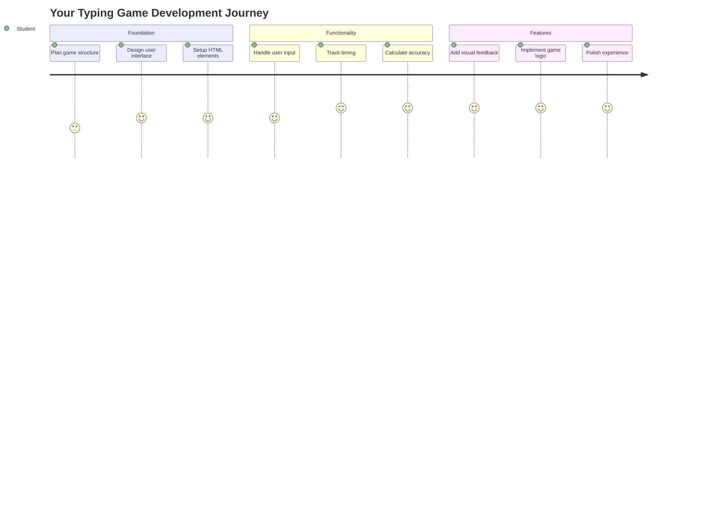
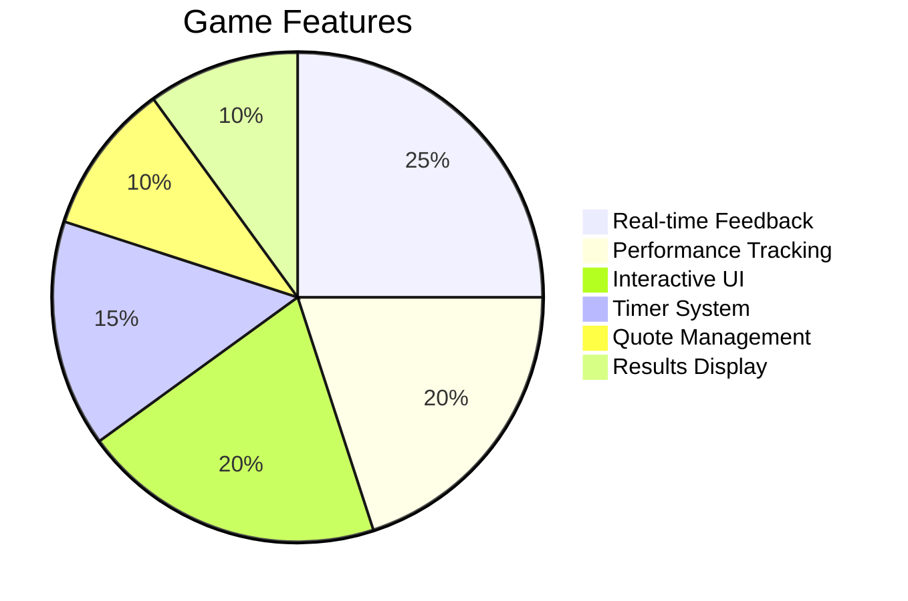
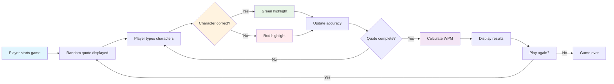
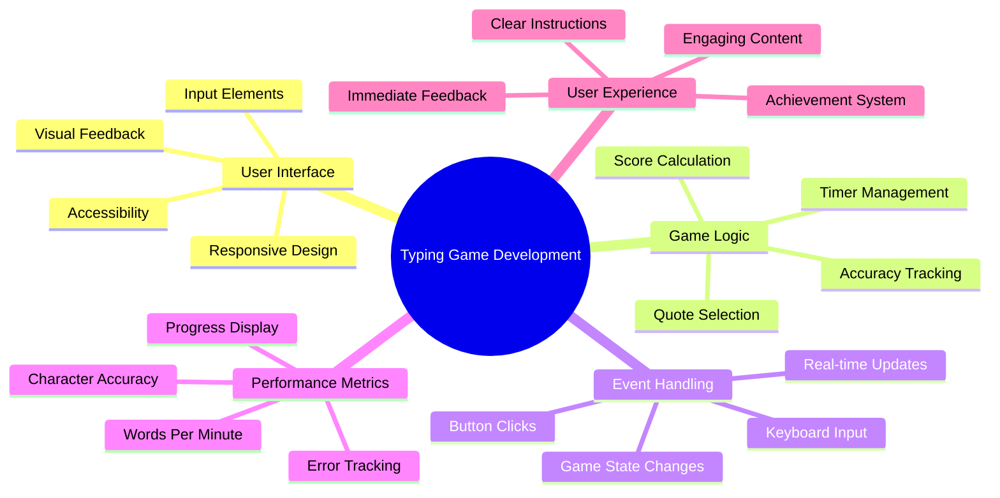
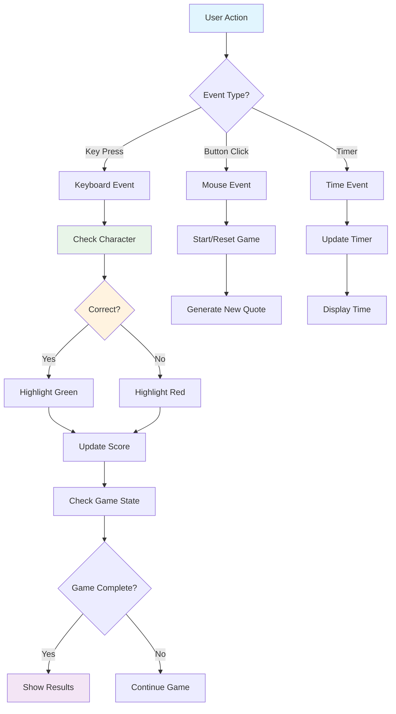
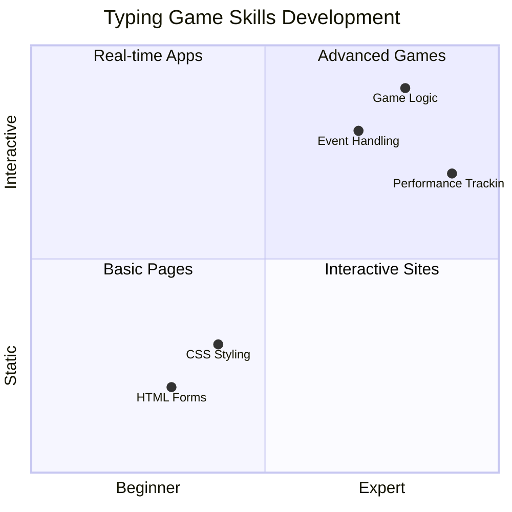
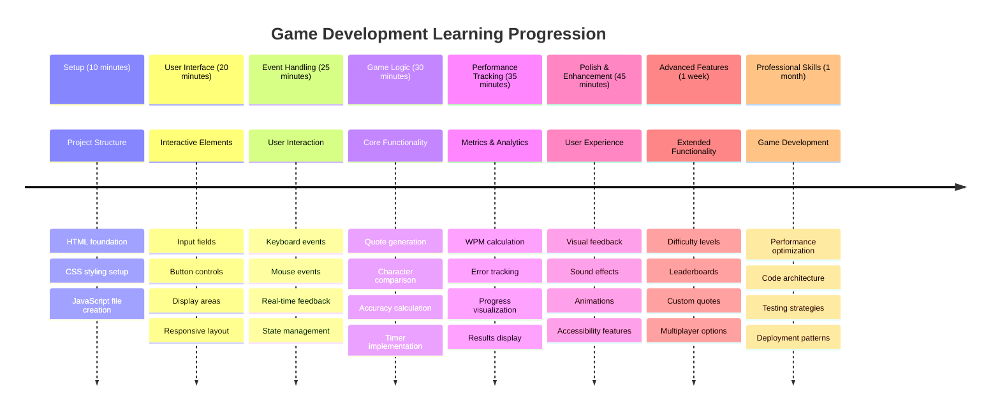

# イベント駆動型プログラミング - タイピングゲームを作ろう

## はじめに

開発者なら誰もが知っているけれど、あまり話題にしないことがあります。それは、速くタイピングすることがスーパーパワーだということです！🚀 考えてみてください。頭の中のアイデアをコードエディタに素早く移せるほど、創造性がどんどん流れ出てきます。まるで思考と画面を直接つなぐパイプラインのようです。

このスキルをレベルアップする最高の方法のひとつを知りたいですか？そうです、ゲームを作ることです！

> 一緒に素晴らしいタイピングゲームを作りましょう！

これまで学んできたJavaScript、HTML、CSSのスキルを活かす準備はできていますか？これから、伝説の探偵[シャーロック・ホームズ](https://en.wikipedia.org/wiki/Sherlock_Holmes)のランダムな名言で挑戦するタイピングゲームを作ります。このゲームでは、タイピングの速さと正確さを測定します。そして、これが思った以上にハマるものだと保証します！

## 必要な知識

始める前に、以下の概念に慣れていることを確認してください（もし少し復習が必要なら心配しないでください。誰でもそういう時があります！）：

- テキスト入力とボタンコントロールの作成
- CSSとクラスを使ったスタイル設定  
- JavaScriptの基本
  - 配列の作成
  - ランダムな数値の生成
  - 現在の時間の取得

これらが少し不安でも大丈夫です！プロジェクトに飛び込んで、やりながら学ぶことが知識を固める最良の方法になることもあります。

### 🔄 **教育的チェックイン**
**基礎評価**: 開発を始める前に以下を理解していることを確認してください：
- ✅ HTMLフォームと入力要素の仕組み
- ✅ CSSクラスと動的スタイリング
- ✅ JavaScriptのイベントリスナーとハンドラー
- ✅ 配列操作とランダム選択
- ✅ 時間測定と計算

**簡単な自己テスト**: これらの概念がインタラクティブなゲームでどのように連携するか説明できますか？
- **イベント**はユーザーが要素とやり取りするときにトリガーされます
- **ハンドラー**はそのイベントを処理し、ゲームの状態を更新します
- **CSS**はユーザーのアクションに対する視覚的フィードバックを提供します
- **タイミング**はパフォーマンス測定とゲーム進行を可能にします

## さあ、作り始めましょう！

[イベント駆動型プログラミングでタイピングゲームを作る](./typing-game/README.md)

### ⚡ **次の5分間でできること**
- [ ] ブラウザコンソールを開いて、`addEventListener`でキーボードイベントをリスニングしてみる
- [ ] 入力フィールドを含む簡単なHTMLページを作成し、タイピング検出をテストする
- [ ] 文字列操作を練習して、入力されたテキストとターゲットテキストを比較する
- [ ] `setTimeout`を使ってタイミング関数を理解する

### 🎯 **この1時間で達成できること**
- [ ] レッスン後のクイズを完了し、イベント駆動型プログラミングを理解する
- [ ] 単語検証付きのタイピングゲームの基本バージョンを作成する
- [ ] 正しいタイピングと間違ったタイピングの視覚的フィードバックを追加する
- [ ] 速さと正確さに基づいた簡単なスコアリングシステムを実装する
- [ ] CSSでゲームをスタイリングし、視覚的に魅力的にする

### 📅 **1週間のゲーム開発計画**
- [ ] すべての機能と仕上げを備えた完全なタイピングゲームを完成させる
- [ ] 単語の複雑さが異なる難易度レベルを追加する
- [ ] ユーザー統計追跡を実装する（WPM、時間経過による正確さ）
- [ ] ユーザー体験を向上させるための効果音とアニメーションを作成する
- [ ] タッチデバイス向けにゲームをモバイル対応にする
- [ ] ゲームをオンラインで共有し、ユーザーからフィードバックを得る

### 🌟 **1か月間のインタラクティブ開発計画**
- [ ] 異なるインタラクションパターンを探る複数のゲームを作成する
- [ ] ゲームループ、状態管理、パフォーマンス最適化について学ぶ
- [ ] オープンソースのゲーム開発プロジェクトに貢献する
- [ ] 高度なタイミング概念とスムーズなアニメーションを習得する
- [ ] 様々なインタラクティブアプリケーションを展示するポートフォリオを作成する
- [ ] ゲーム開発やユーザーインタラクションに興味のある人を指導する

## 🎯 タイピングゲーム習得タイムライン

### 🛠️ ゲーム開発ツールキットのまとめ

このプロジェクトを完了した後、以下を習得できます：
- **イベント駆動型プログラミング**: ユーザー入力に反応するインターフェース
- **リアルタイムフィードバック**: 即時の視覚的およびパフォーマンスの更新
- **パフォーマンス測定**: 正確なタイミングとスコアリングシステム
- **ゲーム状態管理**: アプリケーションの流れとユーザー体験の制御
- **インタラクティブデザイン**: 魅力的で中毒性のあるユーザー体験の作成
- **最新のWeb API**: ブラウザ機能を活用したリッチなインタラクション
- **アクセシビリティパターン**: すべてのユーザーに対応するインクルーシブデザイン

**実世界での応用**: これらのスキルは以下に直接適用できます：
- **ウェブアプリケーション**: インタラクティブなインターフェースやダッシュボード
- **教育ソフトウェア**: 学習プラットフォームやスキル評価ツール
- **生産性ツール**: テキストエディタ、IDE、コラボレーションソフトウェア
- **ゲーム業界**: ブラウザゲームやインタラクティブエンターテインメント
- **モバイル開発**: タッチベースのインターフェースやジェスチャー操作

**次のステップ**: 高度なゲームフレームワーク、リアルタイムマルチプレイヤーシステム、または複雑なインタラクティブアプリケーションを探求する準備が整いました！

## クレジット

♥️を込めて執筆 [Christopher Harrison](http://www.twitter.com/geektrainer)

---

**免責事項**:  
この文書はAI翻訳サービス[Co-op Translator](https://github.com/Azure/co-op-translator)を使用して翻訳されています。正確性を追求しておりますが、自動翻訳には誤りや不正確な部分が含まれる可能性があります。元の言語で記載された文書を正式な情報源としてお考えください。重要な情報については、専門の人間による翻訳を推奨します。この翻訳の使用に起因する誤解や誤認について、当方は責任を負いません。